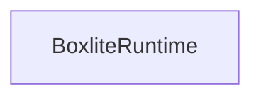
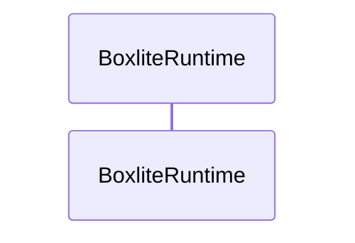

# BoxLite Diagrams

Turn current BoxLite repository evidence into three mutually checking views:

1. Mermaid architecture diagram
2. Mermaid sequence diagram
3. ASCII call graph with exact source anchors

An attractive diagram with an invented hop is worse than no diagram. Generate
an evidence manifest, run the bundled validator, and present the diagrams only
after it passes.

## Workflow

1. Resolve the repository root, current revision, and requested subject.
2. Read the actual source, nearby tests, and relevant architecture docs.
3. If an issue or PR is named, read it with `gh` and resolve its revisions.
4. Classify evidence sources independently from change meaning:
   - sources: checkout, issue, PR, base/head revisions, or working-tree diff;
   - meaning: `none`, `bug`, `feature`, `refactor`, or `docs`.
5. Create `diagram.md` and `evidence.json` in a temporary task directory.
6. Run `scripts/validate_diagrams.py` using the command below.
7. On failure, read `validation.json`, correct the evidence or diagram, and
   retry. Stop after three failed attempts and return the report instead of an
   unverified diagram.
8. After deterministic validation passes, use the repository's required
   verdict-auditor workflow before presenting architectural conclusions.

Do not edit BoxLite production code when the request is only for a diagram.
Save generated files in the repository only when the user explicitly asks.

## State and annotation model

Choose state labels from the evidence:

- overview: `Current`;
- unimplemented issue: `Current` and `Expected (proposed)`;
- PR, commit, branch, or working-tree change: `Before` and `After`.

Apply annotations to the exact affected node or edge:

- `ISSUE`: verified current gap described by a non-bug issue;
- `← BUG: <description>`: faulty hop in `Current` or `Before`;
- `FIX`: corrected behavior in `Expected (proposed)` or `After`;
- `PROPOSED`: behavior required by an issue but absent from source;
- `ADDED`, `CHANGED`, `REMOVED`: behavior grounded in the corresponding diff.

A PR can fix a bug reported by an issue. Do not model issue, bug, and PR as
mutually exclusive kinds.

## Required document format

Use exactly these level-two view headings and one level-three heading for every
manifest state:

````markdown
## Architecture

### Current



## Sequence

### Current



## Call graph

### Current

```text
  create (BoxliteRuntime · src/boxlite/src/runtime/core.rs:291) — public boundary
```
````

For bug-fix PRs, add `Fixes #<number>` after the call-graph states.

Read [references/output-contract.md](references/output-contract.md) before
authoring either output file. Validate `evidence.json` against the shape in
[references/evidence.schema.json](references/evidence.schema.json); the script
also performs semantic checks that JSON Schema cannot express.

## Canonical IDs

Use stable lowercase snake-case IDs. Reuse an ID when the same entity or
relationship appears in more than one view or state.

- Architecture node: `runtime["BoxliteRuntime"]`
- Architecture edge: `runtime create_box@--> box`
- Sequence participant: `participant runtime as BoxliteRuntime`
- Sequence edge: put `%% edge:create_box` immediately before its message
- Call graph: the validator maps a hop to one manifest node by its symbol and
  source anchor, then derives edges from indentation.

Every Mermaid edge must have a canonical ID. Do not leave sequence messages or
architecture arrows untracked.

## Source grounding

- Cite the exact revision, repository-relative path, and inclusive line range.
- Put the call graph's displayed line inside that evidence range.
- Include narrow evidence tokens that prove the symbol or relationship.
- For a direct call, the edge evidence must contain the callee's leaf symbol.
- For RPC, dispatch, spawn, data flow, or state transitions, cite the concrete
  registration, protocol call, process launch, assignment, or transition.
- Never infer a call merely because two real functions have compatible names.
- Never invent a future symbol for an unimplemented issue. Stop the proposed
  call graph at the last real boundary and annotate the missing next behavior.
- Mark issue-derived future nodes or edges `proposed: true` and support them
  with issue evidence rather than fake source evidence.

For comparisons, source anchors belong to their own state revision. A deleted
hop cites the base revision; an added hop cites the head revision.

## Visual rules

- Keep all three views focused on the same behavior.
- Architecture shows components and trust/process/storage boundaries.
- Sequence shows time, calls, responses, alternatives, concurrency, and failure.
- Call graph uses one hop per line:
  `symbol (Type · path/file.ext:line) — role`.
- Use two-space indentation per call depth and `└─` or `├─` for children.
- Keep meaning in text. Color may reinforce but never carry an annotation.
- Mermaid is limited to `flowchart`/`graph` and `sequenceDiagram`.
- Do not use Mermaid initialization directives, clicks, links, raw HTML, or
  JavaScript.

## Validation command

```bash
python3 .agents/skills/boxlite-diagrams/scripts/validate_diagrams.py \
  --repo "$(git rev-parse --show-toplevel)" \
  --document "$TASK_DIR/diagram.md" \
  --evidence "$TASK_DIR/evidence.json" \
  --report "$TASK_DIR/validation.json"
```

Exit codes:

- `0`: every deterministic check passed;
- `1`: diagram or evidence is invalid;
- `2`: a required tool is unavailable.

The validator renders Mermaid with pinned on-demand
`@mermaid-js/mermaid-cli@11.16.0`. It uses an installed Chrome/Chromium when
available and otherwise lets Puppeteer provision its browser.

## Response

Lead with the ASCII call graph and one `Key:` line, matching BoxLite's normal
code-explanation style. Then show architecture and sequence. For comparisons,
keep `Before` and `After` adjacent within each view. End with a compact evidence
summary and the passing validation-report path when files were requested.

Do not claim that mechanical validation proves the architecture is correct.
It proves renderability, source traceability, diff alignment, and cross-view
consistency; the verdict audit covers the remaining interpretation.
