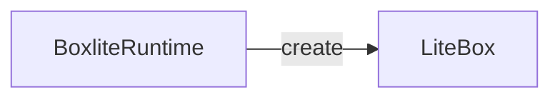

# BoxLite diagram output contract

## Document

`diagram.md` contains exactly three level-two sections in this order:

1. `Architecture`
2. `Sequence`
3. `Call graph`

Each section contains exactly one level-three subsection for every state listed
in `evidence.json`, in the same order. Architecture and sequence state sections
contain one `mermaid` fence. Call-graph state sections contain one `text` fence.

Architecture fences start with `flowchart` or `graph`. Sequence fences start
with `sequenceDiagram`.

## Architecture IDs

Declare nodes with their manifest IDs:



The Mermaid edge ID (`create_box`) is also the manifest edge ID.

## Sequence IDs

Participants use manifest node IDs. Every message is immediately preceded by a
manifest edge ID comment:

```mermaid
sequenceDiagram
  participant runtime as BoxliteRuntime
  participant box as LiteBox
  %% edge:create_box
  runtime->>box: create
```

Notes and grouping statements may be untracked because they are not edges.

## Call graph

Each hop is a single line:

```text
  create (BoxliteRuntime · src/boxlite/src/runtime/core.rs:291) — public boundary
    └─ create (RuntimeImpl · src/boxlite/src/runtime/rt_impl.rs:385) — persist configuration
```

Rules:

- two spaces before a root hop;
- two additional spaces for each depth;
- a child uses `└─` or `├─` after its indentation;
- the displayed line must be inside the matching manifest evidence range;
- indentation creates a caller-to-callee edge that must exist in the manifest;
- `BUG:` belongs on a faulty `Before`/`Current` hop, never on a standalone line;
- future behavior has no invented hop—annotate the last real boundary instead.

## Evidence types

Source evidence:

```json
{
  "type": "source",
  "state": "current",
  "revision": "HEAD",
  "path": "src/boxlite/src/runtime/core.rs",
  "line_start": 291,
  "line_end": 299,
  "symbol": "BoxliteRuntime::create",
  "tokens": ["pub async fn create", "self.backend.create"]
}
```

Issue evidence for behavior that is explicitly proposed:

```json
{
  "type": "issue",
  "state": "expected",
  "issue": 1209,
  "tokens": ["volume creation", "mount"]
}
```

Tokens are exact, case-sensitive substrings of the cited source range or
case-insensitive substrings of the issue title/body.

## Manifest membership

Each node and edge declares the states and views where it appears. Allowed view
IDs are `architecture`, `sequence`, and `call_graph`. Shared entities reuse the
same canonical ID; view-specific context is allowed when it materially improves
that view.

Every parsed Mermaid node, Mermaid edge, sequence participant/message, and call
graph hop/relationship must map to exactly one declared manifest item.

## Annotation targets

Annotations target `node:<id>` or `edge:<id>` and include one state:

```json
{
  "kind": "BUG",
  "target": "edge:signal_pid",
  "state": "before",
  "text": "a recycled PID can identify another process"
}
```

Use `ISSUE`, `BUG`, `FIX`, `PROPOSED`, `ADDED`, `CHANGED`, or `REMOVED`.
For diff annotations, the target's evidence must intersect the correct base/head
diff hunk.
