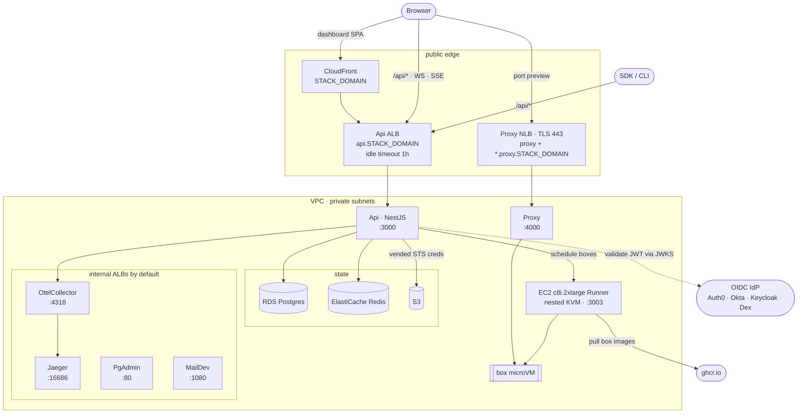

# BoxLite Infra (SST on AWS)

Deploys the BoxLite control plane: ECS Fargate services, an EC2 Runner with
nested KVM, RDS Postgres, ElastiCache Redis, S3, and CloudFront.

- **Region** — `AWS_REGION`, default `ap-southeast-1`
- **IaC** — SST v4 (Pulumi underneath)
- **Cost** — ~$570/month always-on; see [Cost](#cost)

**Where the "why" lives:** design rationale sits in `sst.config.ts` comments,
next to the code it explains. This file is the runbook.

## Architecture



## Prerequisites

`npm run login` and `npm run bootstrap` set up everything except the accounts
and the stack itself:

| You provide | Notes |
| --- | --- |
| An AWS account | `npm run login` runs `aws login` — no IAM user, no access keys |
| A GitHub repo | `npm run login` runs `gh auth login` |
| A Cloudflare domain + API token | One manual step — see [Cloudflare API token](#cloudflare-api-token) |
| An OIDC tenant | Signup is always manual. `--provision-auth0` creates the app, API, and post-login Action **only on Auth0**; any other compliant IdP needs those created by hand |
| An existing stack whose Runner count matches `RUNNERS` | First-Runner provisioning is not implemented here |

## Deploy an existing stack

This updates an existing stack. It cannot create or replace a Runner.

```bash
cd apps/infra
npm install
cp .env.example .env && $EDITOR .env   # STACK_DOMAIN, OIDC_ISSUER_BASE_URL, OIDC_AUDIENCE

npm run login                          # browser sign-in: AWS, GitHub, Auth0
npm run bootstrap -- --stage dev       # IAM role, GitHub Environment, secrets

# Optional, and NOT idempotent — Auth0 has no upsert, so this duplicates apps:
npm run bootstrap -- --stage dev --provision-auth0

gh workflow run deploy-infra.yml --ref main -f stage=dev -f apply=false  # preview
gh workflow run deploy-infra.yml --ref main -f stage=dev -f apply=true   # deploy
```

`npm run bootstrap` is safe to re-run. It prompts once per stage for the
Cloudflare token and `OIDC_CLIENT_ID`, then stores them in SSM and the SST
secret store; `--force` replaces already-seeded values. Its full flag list is in
the script's header comment.

A deploy takes 10–15 minutes and prints the service URLs. On a transient
registry error, just rerun — SST resumes from the failed step.

**Adding a stage:** run `npm run bootstrap -- --stage <name>`, then add `<name>`
to the `stage` input's `options` in `.github/workflows/deploy-infra.yml`. That
list is an allowlist, so a typo cannot target a protected Environment.

## Secrets & credentials

Nothing secret lives in git, but there are **two** control planes, and
offboarding means revoking both. Most secrets live in AWS, where anyone who can
deploy can read them. The rest are GitHub Environment secrets (see the table
below), reachable by anyone who can administer the repository or run the
workflow — revoking AWS access does not touch those. Secrets are per-stage; seed
each stage you run.

| What | Stored in | Set by |
| --- | --- | --- |
| App secrets (`OIDC_CLIENT_ID`, Auth0 Management API, Svix, PostHog) | SST secret store | `npm run bootstrap`; others via `npm run sst -- secret set <NAME> --stage <stage>` reading stdin |
| Cloudflare creds (`CLOUDFLARE_API_TOKEN`, `CLOUDFLARE_DEFAULT_ACCOUNT_ID`) | AWS SSM SecureString, or GitHub Environment secrets (which win) | `npm run bootstrap` |
| Stage config (`STACK_DOMAIN`, `OIDC_*`, toggles) | GitHub Environment secret `DEPLOY_ENV` | `npm run bootstrap` |

Never pass secret values as command arguments or echo them. Rotate on any
suspected disclosure. `npm run secrets -- --stage dev` lists what is set.

Run SST through the npm scripts, never bare `npx sst` — the wrapper loads
Cloudflare creds from SSM, enforces the Runner safety policy, and scrubs
Pulumi event logs that can contain provider credentials. `sst dev` is disabled.

### Cloudflare API token

The one credential a browser login cannot provide: Cloudflare only issues a
first API token through the dashboard.

**[Create the token →](https://dash.cloudflare.com/?to=/:account/api-tokens&permissionGroupKeys=%5B%7B%22key%22%3A%22zone%22%2C%22type%22%3A%22read%22%7D%2C%7B%22key%22%3A%22dns%22%2C%22type%22%3A%22edit%22%7D%5D&name=BoxLite%20deploy)**

That link opens the **account** token form with `Zone:Read` + `DNS:Edit`
pre-selected. Pick the zone serving `STACK_DOMAIN`, confirm, and paste the value
when `npm run bootstrap` prompts. Account-owned tokens survive the creator
leaving the org; creating one needs Administrator or Super Administrator.

Cloudflare offers no machine-to-machine OAuth grant for third-party clients, so
this cannot be automated. Its `cf` CLI can mint a DNS-capable OAuth token, but
it expires in about an hour and its refresh tokens are single-use — unusable as
a stored CI secret. cert-manager, external-dns, and SST's own Cloudflare guide
all require the same manual token.

## Common commands

```bash
npm run sst -- diff --stage dev      # preview changes
npm run sst -- unlock --stage dev    # recover from "concurrent update detected"
npm run sst -- shell --stage dev     # shell with SST-linked env vars
npm run runner:update -- --stage dev # roll the Runner binary, one host at a time
```

Every deploy and removal requires an explicit `--stage` so the deployer, the
verifier, and destructive operations cannot target different stages.

## Operating rules

**The Runner holds state.** `/var/lib/boxlite` and the live microVMs are on its
root disk, so `sst.config.ts` marks it `protect: true` with
`ignoreChanges: ['ami', 'userDataBase64']`. Routine deploys never replace it.
The CI gate rejects any Runner create, delete, replace, or protected-property
change — so scaling out, scaling down, and first-Runner provisioning are all
separate reviewed operations that this repository does not implement.

**Version bumps reach the fleet by rolling upgrade, not replacement.** A deploy
runs `scripts/runner-update-binary.mjs` per host over SSM, chained so hosts
upgrade one at a time. Each host verifies the release checksum before stopping
its service, and restores its backup if the new binary fails to report healthy.

**Runners cache image refs exactly.** `BOXLITE_SYSTEM_IMAGES` (comma-separated
`name=ref`) adds box images without a code deploy, but publish updated bytes
under a new tag or digest — repushing a mutable tag leaves already-cached
Runners serving the old image.

**Proxy topology is protected.** The NLB, TLS listener, and target group refuse
replacement. A deliberate migration is two deploys: first set the three Proxy
`opts.protect` values to `false` and ship that metadata-only change, then do the
reviewed migration. Never combine them.

**Deploys self-verify.** After a successful deploy the wrapper checks that the
NLB listener forwards to the Proxy service's target group with healthy targets,
probes `/health` over both the base and a wildcard hostname, and confirms
`/api/config` reports the expected issuer, version, and Proxy host. The check is
read-only and exits nonzero on failure — it does **not** roll back. By the time
it runs the deploy has already applied its changes, so a failure means the stack
is live in the state that failed the check; recover by fixing forward or
redeploying a known-good revision.

**`/api/*` bypasses CloudFront on purpose.** CloudFront caps WebSockets at 10
minutes, which would kill `exec`/`attach` sessions. Use
`https://api.<STACK_DOMAIN>/api` for SDK and CLI profiles; the CloudFront path
is only for short request/response calls.

## Troubleshooting

**"concurrent update detected"** — `npm run sst -- unlock --stage dev`, then retry.

**Service stuck at `rolloutState: FAILED` with 1 running task** — stale event
from an earlier failed deploy. If `runningCount == desiredCount`, ignore it.

**`Failed to fetch OpenID configuration`** — the API cannot reach
`<OIDC_ISSUER_BASE_URL>/.well-known/openid-configuration`. Check egress from the
API container and that the issuer host works.

**`unexpected issuer URI`** — `OIDC_ISSUER_BASE_URL` does not byte-match what
the IdP's discovery doc reports as `issuer`. Auth0 includes a trailing slash.

**`Callback URL mismatch`** — add `http://127.0.0.1:5555/callback` to the Auth0
SPA app's Allowed Callback URLs. The CLI's loopback URL is a separate entry from
the dashboard's.

**`No end session endpoint` on logout** — the API's IdP discovery probe failed
at startup. Fix connectivity; the next `/api/config` self-heals.

**"Organization is suspended: Please verify your email address"** — the access
token lacks `email_verified`. Deploy the post-login Action
(`npm run bootstrap -- --provision-auth0`).

**Runner never reaches `READY`** — its `BOXLITE_RUNNER_TOKEN` must equal the DB
row's `apiKey`. Check `journalctl -u boxlite-runner` via `aws ssm start-session`.

**Box preview cannot connect** — check that the NLB listener's target group
matches the Proxy service attachment and has a healthy registered target.

**Dashboard terminal cannot connect** — it uses the direct API host, not the
Proxy. Verify `https://api.<STACK_DOMAIN>/api/config`.

**Docker build "broken pipe"** — transient ECR push failure. Retry.

## Cost

ap-southeast-1 on-demand, approximate:

| Resource | Monthly |
| --- | --- |
| EC2 c8i.2xlarge (Runner) | ~$325 |
| Load balancers (5 ALB + 2 NLB) | ~$115 |
| 7x Fargate 0.25 vCPU / 0.5 GB | ~$65 |
| CloudFront + S3 + CloudWatch Logs | ~$20 |
| 2x NAT EC2 (`t4g.nano`) + public IPv4 | ~$16 |
| RDS `t4g.micro` Postgres | ~$15 |
| ElastiCache Redis | ~$15 |
| **Total** | **~$570** |

Only the `prod` stage retains S3 buckets and RDS snapshots on removal
(`removal: 'retain'`); every other stage is disposable. Whole-stack teardown
needs a separate reviewed Proxy and Runner decommission runbook, which is not
implemented here.

## Reference

- `.env.example` — every configuration variable, with required/optional tiers
- `sst.config.ts` — the stack itself; comments carry the design rationale
- `scripts/*.mjs` — each script's header comment documents its flags
- `.github/workflows/deploy-infra.yml` — the guarded CI deployment
