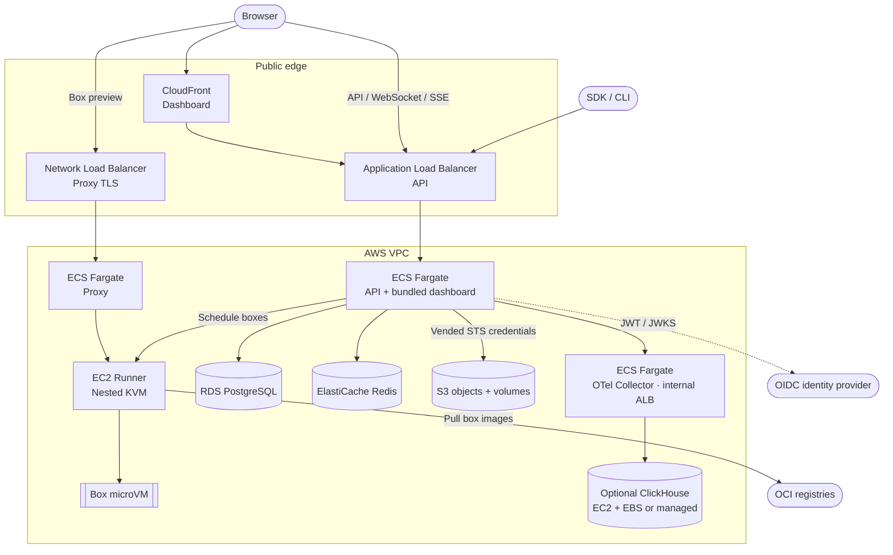

## TL;DR

BoxLite separates its control plane, proxy, and VM runners, with managed state and observability services around them.

# Infrastructure architecture

[Infrastructure index](../README.md) · [Deployment](deployment.md) · [Networking](networking.md) · [Cost catalog](costs.md)

These diagrams describe the checked-in resource declarations, not an inventory of a live project.
`$` marks a GCP billing component before free allowances; conditional resources depend on stage configuration.
BoxLite processes inside a paid host do not create a second GCP compute charge.

## GCP architecture

See the [GCP architecture guide](gcp/architecture.md) for overview, runtime and supporting-service diagrams.

## AWS overview

The AWS provider uses the same BoxLite services with different hosting and network resources.
Sizing comes from the stage configuration; the diagram does not prescribe one instance type.

## Source ownership

| Responsibility | Source |
| --- | --- |
| Stage configuration, identity, encrypted environment and state access | [`mstage/`](../mstage/README.md) |
| Container build, verification and promotion | [`mbuild/`](../mbuild/) |
| Deploy intent and cloud engine selection | [`mdeploy/src/run.ts`](../mdeploy/src/run.ts), [`deploy.ts`](../mdeploy/src/deploy.ts) |
| Resource composition and provider interfaces | [`mdeploy/stack/`](../mdeploy/stack/) |
| GCP resources | [`mdeploy/stack/providers/gcp/`](../mdeploy/stack/providers/gcp/) |
| AWS resources | [`mdeploy/stack/providers/aws/`](../mdeploy/stack/providers/aws/) |
| Runner build, promotion and in-place updates | [`mdeploy/src/`](../mdeploy/src/) |
| Account/project bootstrap and federated CI identity | [`bootstrap/`](../bootstrap/) |
| Retained AWS SST deployment path | [`deployment/`](../deployment/), [`stack/`](../stack/), [`sst.config.ts`](../sst.config.ts) |

`mdeploy` uses Pulumi directly on GCP and SST on AWS. The legacy `npm run deploy` entrypoint
still enters `deployment/sst.ts`; it is not the engine used by every deployment command.
