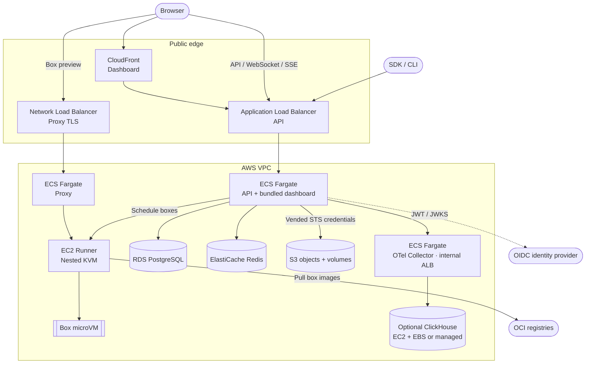
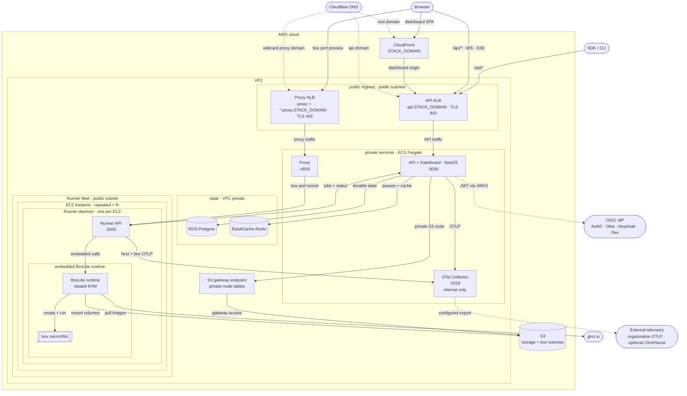

## TL;DR

AWS runs the API, proxy and collector on ECS Fargate, with EC2 runners and managed state services.

# AWS architecture

[Cloud guide](README.md) · [Infrastructure index](../../README.md)

This diagram describes source configuration, not a live account inventory.
Review the [bootstrap compatibility boundary](../../bootstrap/aws/README.md#aws-mdeploy-compatibility) before choosing a deployment path.

[Networking](networking.md) · [Cost inventory](costs.md)

## AWS overview

The AWS provider hosts BoxLite's services using the resources shown below.
Sizing comes from the stage configuration; the diagram does not prescribe one instance type.

## Detailed application topology

Sources: [AWS providers](../../mdeploy/stack/providers/aws/), [retained legacy stack](../../stack/), [legacy SST entrypoint](../../sst.config.ts).
