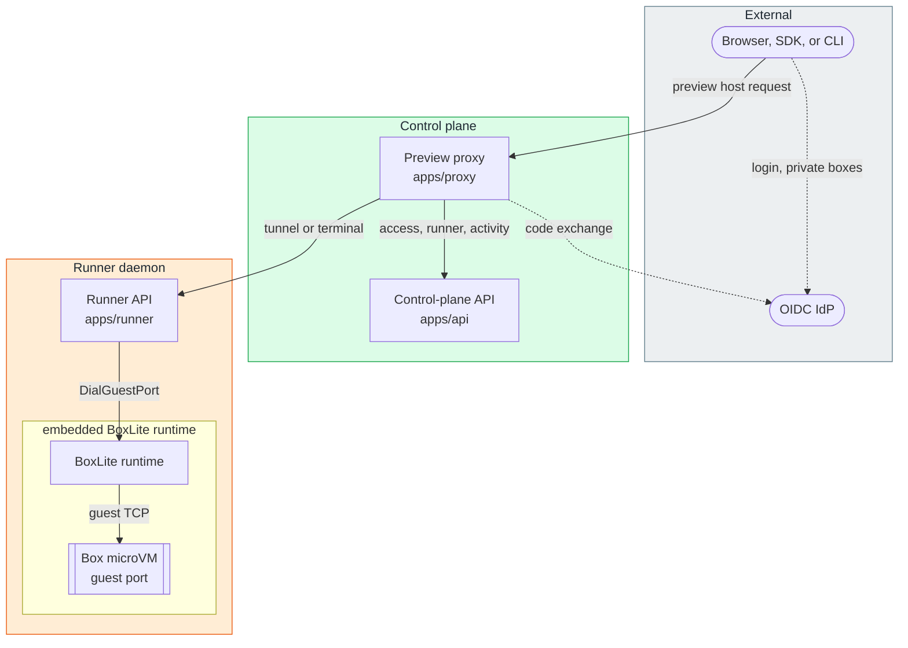

# BoxLite preview proxy

`apps/proxy` is the Go service behind `https://<port>-<box>.proxy.<domain>`. It checks with the
control-plane API that the caller may reach the box, then forwards the request to that port inside
the box through the box's runner. The SST stack runs it as an ECS service on port 4000 behind a
network load balancer that terminates TLS for `proxy.<domain>` and `*.proxy.<domain>`
([`edge.ts`](../infra/stack/edge.ts)); [`apps/infra/mdeploy`](../infra/mdeploy/) deploys it too.

- Routes: [`apps/API.md`](../API.md#preview-proxy-api)
- Place in the platform: [`apps/README.md`](../README.md)

## Architecture



The proxy asks the API whether the box is public, whether the caller may reach it, which runner
hosts it, and records activity. It then opens a tunnel through that runner to the guest port.
Browsers opening a private box log in through the OIDC provider first.

## Preview hosts

The first label of the host is `<port>-<id>`, where `<id>` takes one of three forms:

| `<id>`     | Meaning                                                                 | Minted by                                                                                          |
| ---------- | ----------------------------------------------------------------------- | -------------------------------------------------------------------------------------------------- |
| `d-<hex>`  | Hex-encoded box ID: box IDs are mixed-case, and hostnames are not       | `getPortPreviewUrl`, `getNetworkTunnelUrl` in [`box.service.ts`](../api/src/box/services/box.service.ts) |
| `<box ID>` | Raw box ID, kept for terminal URLs on port 22222                        | `getPortPreviewUrl`                                                                                |
| `<token>`  | Signed preview token, which the API resolves to a box ID               | `getSignedPortPreviewUrl`                                                                          |

A host without a `<port>-` label serves only the utility routes listed in
[`apps/API.md`](../API.md#preview-proxy-api).

## Request paths

| Request                                    | Upstream                                                        | Authentication                    |
| ------------------------------------------ | --------------------------------------------------------------- | --------------------------------- |
| HTTP or WebSocket to any port except 22222 | Reverse proxy over a runner CONNECT tunnel to the guest port    | Private boxes only                |
| Port 22222                                 | The runner's web terminal at `/boxes/<id>/toolbox/proxy/22222`  | Always                            |
| `CONNECT`                                  | Raw TCP tunnel through the runner                               | Public boxes only; others get 403 |

The HTTP path in code:

```text
  StartProxy (— · apps/proxy/pkg/proxy/proxy.go:78) — registers the catch-all route for preview hosts
    └─ NewProxyRequestHandler (— · apps/libs/common-go/pkg/proxy/proxy.go:113) — reverse proxy for one request
      ├─ GetProxyTarget (Proxy · apps/proxy/pkg/proxy/get_box_target.go:49) — choose the upstream
        ├─ parseHost (Proxy · apps/proxy/pkg/proxy/get_box_target.go:357) — port plus box ID or signed token
        ├─ getBoxPublic (Proxy · apps/proxy/pkg/proxy/get_box_target.go:250) — ask the API, cached 3 s
        ├─ Authenticate (Proxy · apps/proxy/pkg/proxy/auth.go:18) — private box or terminal port only
        └─ updateLastActivity (Proxy · apps/proxy/pkg/proxy/get_box_target.go:430) — renew activity every 50 s
      └─ dialGuestPort (Proxy · apps/proxy/pkg/proxy/get_box_target.go:165) — dial each new upstream connection
        ├─ getBoxRunnerInfo (Proxy · apps/proxy/pkg/proxy/get_box_target.go:211) — runner URL and key, cached 2 min
        └─ dialRunnerTunnel (— · apps/proxy/pkg/proxy/tunnel.go:117) — CONNECT through the runner to the guest port
```

The upstream URL `http://<box ID>:<port>` is only a routing key. `dialGuestPort` is the transport's
`DialContext`: it resolves the box's runner and returns a tunneled connection, so HTTP connection
pooling reuses tunnels per box and port. Raw `CONNECT` requests skip this router and go to
`handleTunnelConnect` in [`tunnel.go`](pkg/proxy/tunnel.go).

## Authentication

A request to a private box, or to port 22222, takes the first credential that works
([`auth.go`](pkg/proxy/auth.go)):

1. `Authorization: Bearer <API key or JWT>`: the API checks box access with the caller's own token.
2. `X-BoxLite-Preview-Token` header: the API validates the preview token. The header is removed
   before forwarding.
3. `BOXLITE_BOX_AUTH_KEY` query parameter: the same check. A valid key is removed from the query.
4. `boxlite-box-auth-<id>` cookie: signed with `PROXY_API_KEY` and trusted without an API call.
5. A signed preview token in the host: the API resolves it to a box ID, and the proxy sets the cookie.
6. Otherwise, a 307 redirect to the OIDC provider with PKCE. `/callback` exchanges the code, checks
   access, sets the cookie, and sends the browser back to the original URL.

Credential checks cache only rejections, for 2 minutes. Accepted credentials go back to the API on
every request, so a revoked key stops working at once. The cookie is the exception: browsers keep
it for 1 hour, the signature check accepts it for securecookie's default of 30 days, and nothing
re-checks it with the API.

## Failure responses

| Situation                                                  | HTTP or WebSocket                                                   | `CONNECT`                    |
| ---------------------------------------------------------- | ------------------------------------------------------------------- | ---------------------------- |
| The box is private                                         | `307` to the OIDC login unless a credential works, for API clients too | `403`, whatever the credential |
| The host has no `<port>-<id>` label                        | `404`, except the utility routes                                    | `400`                        |
| The API still fails the visibility check after its retries | `400`                                                               | `502`                        |
| The runner or the guest port is unreachable                | `502`                                                               | `502`                        |

Port 22222 needs a credential even on a public box. SDK and CLI callers should always send one:
without it they get the browser redirect, not a `401`.

## Box activity

Each proxied request and each CONNECT tunnel reports activity to the API at once and then every
50 seconds until the connection closes, so an idle policy does not stop a box that is in use. A
per-box cache drops reports made within the previous 45 seconds.

## Caches

| Cache                     | Key                 | TTL   |
| ------------------------- | ------------------- | ----- |
| Box is public             | box ID              | 3 s   |
| Runner URL and API key    | box ID              | 2 min |
| Rejected credential       | box ID + credential | 2 min |
| Activity already reported | box ID              | 45 s  |

The caches live in Redis when `REDIS_HOST` is set, as in the local stack
([`native.py`](../infra-local/compose/native.py)). Otherwise each process keeps its own caches in
memory. Neither deploy stack in `apps/infra` gives the proxy `REDIS_*` settings, so a hosted proxy
caches in memory unless its stage adds them.

## Other behavior

- **CORS** allows any origin, with credentials. A request carrying `X-BoxLite-Disable-CORS: true`
  leaves CORS to the app in the box.
- **Preview warning**: with `PREVIEW_WARNING_ENABLED`, browsers see an interstitial page until they
  accept it, which sets a cookie for 1 day. Non-browser clients, WebSockets, port 22222, and requests
  carrying `X-BoxLite-Skip-Preview-Warning: true` skip it.
- **Shutdown** waits up to `SHUTDOWN_TIMEOUT_SEC` (default 1 hour) for open requests and tunnels. A
  second signal forces the exit.
- **Tracing** stamps `boxlite.box_id` on the span of each proxied HTTP request. CONNECT tunnels
  bypass the router and have no span.

## Calls to other services

The preview host format and the reserved paths are the proxy's public contract. Everything below
is internal and changes together with the API and the runner.

| Service | Call                                                                                                     | Credential                                              |
| ------- | -------------------------------------------------------------------------------------------------------- | ------------------------------------------------------- |
| API     | `GET /api/config` at startup, for unset OIDC settings                                                    | `PROXY_API_KEY`                                         |
| API     | `GET /api/preview/{boxId}/public`, `/validate/{token}`; `GET /api/preview/{token}/{port}/box-id`         | `PROXY_API_KEY`                                         |
| API     | `GET /api/preview/{boxId}/access`                                                                        | The caller's bearer token                               |
| API     | `GET /api/runners/by-box/{boxId}`, `POST /api/box/{boxId}/last-activity`                                 | `PROXY_API_KEY`                                         |
| Runner  | `CONNECT /v1/boxes/{boxId}/network/tunnel?port={port}`; `/boxes/{boxId}/toolbox/proxy/22222/...`         | The runner's key from `by-box`, in `X-BoxLite-Authorization` |

## Configuration

Settings come from the environment. `.env`, then `.env.local`, then `.env.production` in the
working directory override it, but loading stops at the first file that is missing
([`config.go`](cmd/proxy/config/config.go)).

| Variable                                                                         | Purpose                                                                                 |
| -------------------------------------------------------------------------------- | --------------------------------------------------------------------------------------- |
| `PROXY_PORT`                                                                     | Listen port (required)                                                                  |
| `PROXY_PROTOCOL`                                                                 | `http` or `https`, for redirects and `X-Forwarded-Proto` (required)                     |
| `PROXY_API_KEY`                                                                  | Bearer key for API calls and the cookie-signing key (required)                          |
| `BOXLITE_API_URL`                                                                | Control-plane API base URL, ending in `/api` (required)                                 |
| `OIDC_CLIENT_ID`, `OIDC_CLIENT_SECRET`, `OIDC_DOMAIN`, `OIDC_PUBLIC_DOMAIN`, `OIDC_AUDIENCE` | Login for private boxes; an unset client ID, domain, or audience comes from the API's `/config` at startup |
| `COOKIE_DOMAIN`                                                                  | Cookie domain; defaults to `.<request host>`                                            |
| `ENABLE_TLS`, `TLS_CERT_FILE`, `TLS_KEY_FILE`                                    | Serve TLS directly; `ENABLE_TLS` also marks auth cookies `Secure`                       |
| `REDIS_HOST` and the other `REDIS_*` settings                                    | Shared caches                                                                           |
| `PREVIEW_WARNING_ENABLED`                                                        | Browser warning page                                                                    |
| `SHUTDOWN_TIMEOUT_SEC`                                                           | Drain limit                                                                             |
| `OTEL_LOGGING_ENABLED`, `OTEL_TRACING_ENABLED`, `OTEL_EXPORTER_OTLP_ENDPOINT`, `OTEL_EXPORTER_OTLP_HEADERS`, `ENVIRONMENT` | Telemetry                                          |

## Build and test

```bash
cd apps/proxy
go build ./cmd/proxy
go test ./...
```

From `apps/`, the Nx project `proxy` wraps the same commands in its `build`, `serve`, `test`, and
`lint` targets ([`project.json`](project.json)). `make build:apps` and `make test:apps` cover the
whole apps workspace, this service included. `make up` in [`apps/infra-local`](../infra-local/)
runs the proxy on port 4000 with the rest of the local stack.

## Related code

- [`cmd/proxy/main.go`](cmd/proxy/main.go): startup, telemetry, and signal handling
- [`pkg/proxy/proxy.go`](pkg/proxy/proxy.go): router, middleware, caches, and the CONNECT split
- [`pkg/proxy/get_box_target.go`](pkg/proxy/get_box_target.go): host parsing, upstream choice, API
  lookups, and activity
- [`pkg/proxy/auth.go`](pkg/proxy/auth.go), [`pkg/proxy/auth_callback.go`](pkg/proxy/auth_callback.go):
  credentials and OIDC login
- [`pkg/proxy/tunnel.go`](pkg/proxy/tunnel.go): CONNECT tunnels to the runner
- [`pkg/proxy/warning_page.go`](pkg/proxy/warning_page.go): preview warning page
- [`../libs/common-go/pkg/proxy/`](../libs/common-go/pkg/proxy/): shared reverse proxy and stream relay
- Runner side: [`network_tunnel.go`](../runner/pkg/api/controllers/network_tunnel.go) and
  [`guest_port_tunnel.go`](../runner/pkg/boxlite/guest_port_tunnel.go)
