# BoxLite Architecture Guide

> Cross-Platform Architecture & Design Reference for Windows Native Support Preparation

---

## Table of Contents

1. [High-Level Architecture](#1-high-level-architecture)
2. [Layered Architecture](#2-layered-architecture)
3. [Complete Call Chain](#3-complete-call-chain)
4. [Platform Abstraction Map](#4-platform-abstraction-map)
5. [Module Deep Dive](#5-module-deep-dive)
6. [External Dependencies & Libraries](#6-external-dependencies--libraries)
7. [Guest Agent Architecture](#7-guest-agent-architecture)
8. [Host-Guest Communication](#8-host-guest-communication)
9. [Windows Native Porting Analysis](#9-windows-native-porting-analysis)
10. [Initialization Pipeline](#10-initialization-pipeline)
11. [Snapshot & Clone Architecture](#11-snapshot--clone-architecture)
12. [Key Design Decisions](#12-key-design-decisions)

---

## 1. High-Level Architecture

BoxLite is an **embeddable VM runtime** — "SQLite for sandboxing." It runs OCI containers inside lightweight VMs with hardware-level isolation, without requiring a daemon or root privileges.

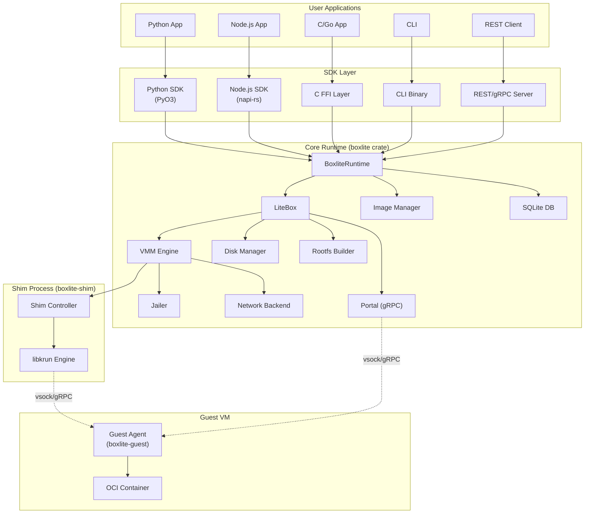

---

## 2. Layered Architecture

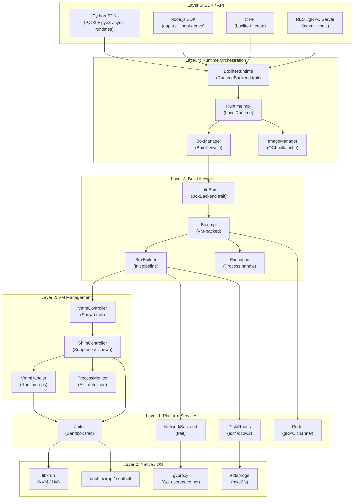

---

## 3. Complete Call Chain

### 3.1 Box Creation Flow

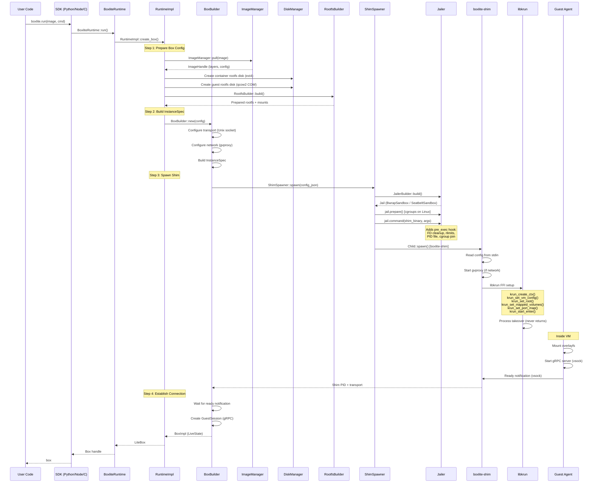

### 3.2 Command Execution Flow

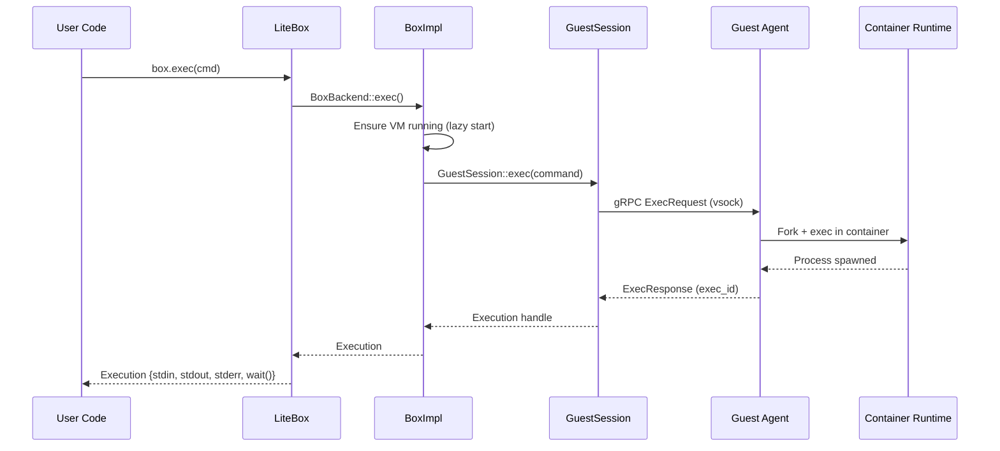

---

## 4. Platform Abstraction Map

### 4.1 Platform Decision Tree

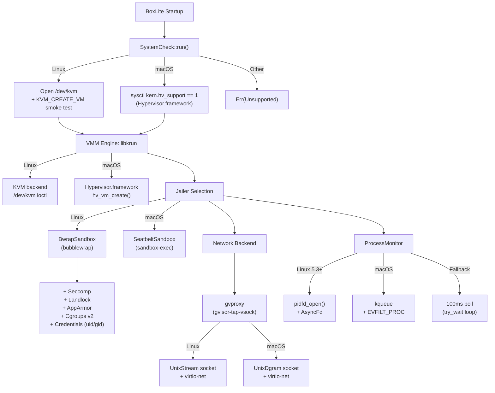

### 4.2 Platform-Specific Code Map

| Module | Linux | macOS | Windows (TODO) |
|--------|-------|-------|----------------|
| **Hypervisor** | KVM (`/dev/kvm`) | Hypervisor.framework | WHPX / Hyper-V (MSHV) |
| **VMM Library** | `libkrun` (KVM backend) | `libkrun` (Hvf backend) | Cloud Hypervisor / custom |
| **Jailer Sandbox** | `bubblewrap` (namespaces, pivot_root) | `sandbox-exec` (Seatbelt/SBPL) | Job Objects + AppContainer |
| **Seccomp/Syscall** | Seccomp BPF filter | N/A (Seatbelt covers) | N/A |
| **Landlock** | Landlock LSM (kernel 5.13+) | N/A | N/A |
| **Cgroups** | cgroups v2 | N/A | Job Objects |
| **AppArmor** | AppArmor profiles | N/A | N/A |
| **Network Socket** | `UnixStream` | `UnixDgram` | Named Pipes / AF_HYPERV |
| **Process Monitor** | `pidfd_open()` | `kqueue` + `EVFILT_PROC` | `WaitForSingleObject()` |
| **FD Cleanup** | `close_range()` / `/proc/self/fd` | `getrlimit` brute-force | `NtQueryInformationProcess` |
| **Host-Guest Transport** | vsock (`AF_VSOCK`) | vsock (via libkrun) | Hyper-V sockets (`AF_HYPERV`) |
| **Filesystem Sharing** | virtiofs | virtiofs | Plan 9 / virtiofs |
| **Disk Creation** | `mke2fs` (e2fsprogs) | `mke2fs` (e2fsprogs) | Need ext4 tools or alt format |
| **Bind Mounts** | `mount --bind` | N/A (virtiofs share) | N/A |
| **User Namespaces** | Clone + unshare | N/A | N/A |
| **DNS Configuration** | Write `/etc/resolv.conf` in rootfs | Same | Same |

---

## 5. Module Deep Dive

### 5.1 Runtime Layer (`src/boxlite/src/runtime/`)

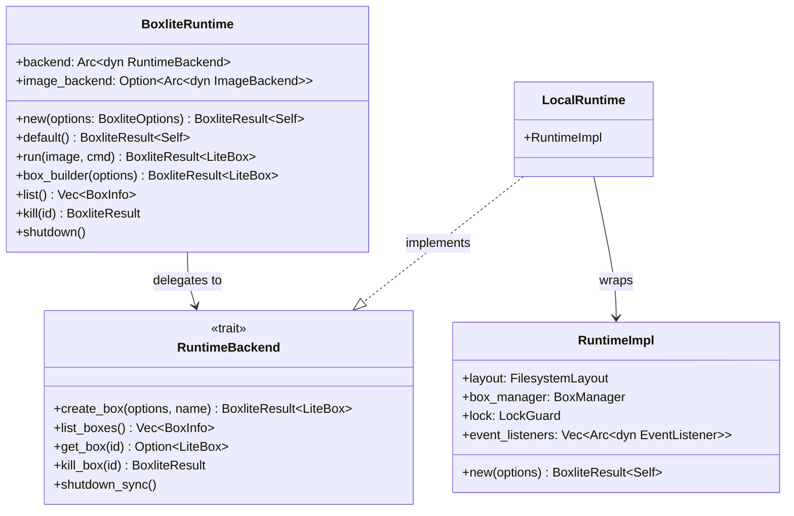

**Key types:**
- `BoxliteRuntime` — Public API, cloneable (`Arc`), delegates to a `RuntimeBackend`
- `RuntimeImpl` — Local implementation: filesystem layout, box manager, SQLite DB, event listeners
- `BoxliteOptions` — Configuration: home dir, log level, event listeners, resource defaults
- `FilesystemLayout` — Typed paths: `~/.boxlite/{boxes,images,layers,bases,logs,db}`

### 5.2 LiteBox Layer (`src/boxlite/src/litebox/`)

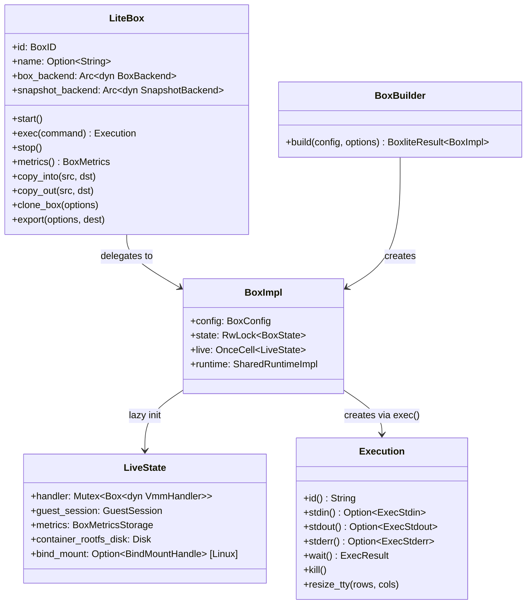

**Key design:**
- `LiteBox` is a thin wrapper over `BoxBackend` trait (enables REST and local backends)
- `BoxImpl` holds `BoxConfig` (persisted) and `LiveState` (lazy, via `OnceCell`)
- `BoxBuilder` is the init pipeline: disk creation, rootfs assembly, shim spawn, gRPC connect
- `Execution` wraps the gRPC exec stream: stdin/stdout/stderr via `Arc<Mutex<...>>`

### 5.3 VMM Layer (`src/boxlite/src/vmm/`)

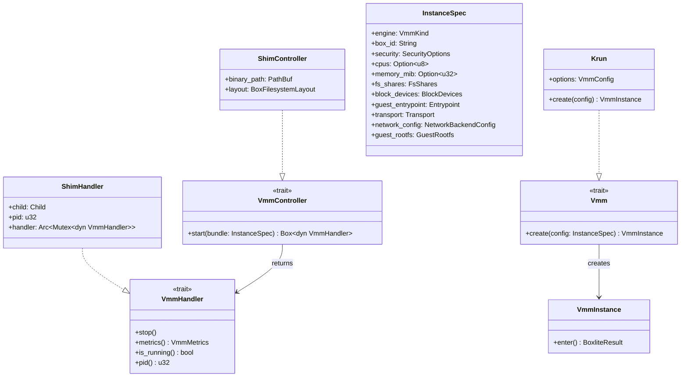

**Architecture split:**
- **VmmController** = spawn operations (creates a VmmHandler)
- **VmmHandler** = runtime operations (stop, metrics, is_running)
- **Vmm trait** = engine-specific (libkrun): used inside the **shim process**
- **ShimController** = spawns `boxlite-shim` as subprocess (isolation from process takeover)

### 5.4 Jailer Layer (`src/boxlite/src/jailer/`)

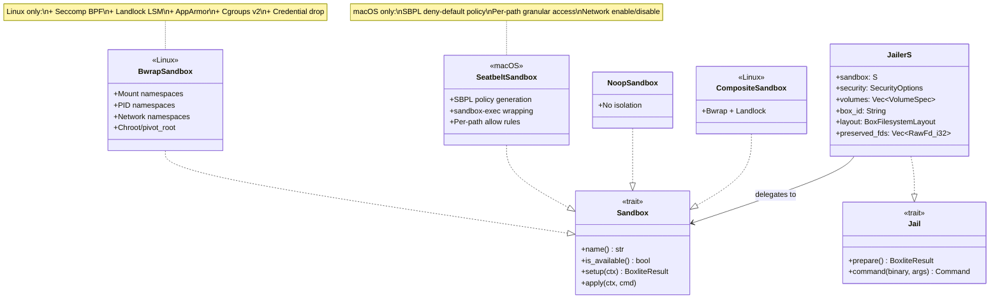

**Pre-exec hook chain** (applied to `std::process::Command`):
1. FD preservation (dup2 watchdog pipe)
2. FD cleanup (`close_range` / `/proc/self/fd` / brute-force)
3. Resource limits (rlimits)
4. PID file write
5. Cgroup join (Linux, added by `BwrapSandbox::apply`)
6. Landlock enforcement (Linux, added by `CompositeSandbox::apply`)

### 5.5 Network Layer (`src/boxlite/src/net/`)

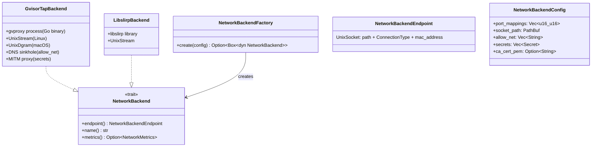

**gvproxy (gvisor-tap-vsock):**
- Go binary, vendored in `src/deps/libgvproxy-sys`
- Provides userspace TCP/IP stack (no root, no TUN/TAP)
- DNS sinkhole for `allow_net` filtering
- MITM proxy for `secrets` injection into HTTPS
- Connection type differs: `UnixStream` on Linux, `UnixDgram` on macOS

---

## 6. External Dependencies & Libraries

### 6.1 Vendored Sys Crates (`src/deps/`)

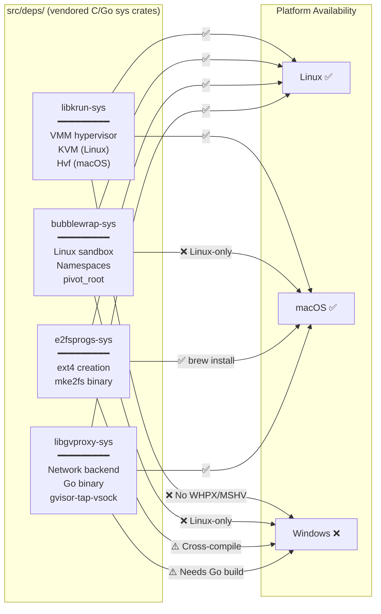

| Crate | Purpose | Linux | macOS | Windows |
|-------|---------|-------|-------|---------|
| `libkrun-sys` | VMM: KVM/Hvf hypervisor, virtio devices, process takeover | KVM | Hypervisor.framework | **Blocker**: No WHPX/MSHV backend |
| `bubblewrap-sys` | Sandbox: namespaces, pivot_root, seccomp | Full | Not used | Not applicable |
| `e2fsprogs-sys` | Disk: `mke2fs` for ext4 filesystem creation | Native | Homebrew | Needs cross-compile or alt |
| `libgvproxy-sys` | Network: Go-based userspace TCP/IP | Full | Full | Needs Go cross-compile |

### 6.2 Rust Crate Dependencies

| Category | Crate | Purpose |
|----------|-------|---------|
| **Async Runtime** | `tokio` | Event loop, tasks, timers, I/O |
| **gRPC** | `tonic` + `prost` | Host-guest communication protocol |
| **OCI Images** | `oci-client` | Container image pull/push |
| **Database** | `rusqlite` | Box metadata persistence |
| **HTTP Server** | `axum` | REST API server |
| **Serialization** | `serde` + `serde_json` | Config, IPC, persistence |
| **Logging** | `tracing` + `tracing-subscriber` | Structured logging |
| **Python FFI** | `pyo3` + `pyo3-async-runtimes` | Python SDK bindings |
| **Node.js FFI** | `napi` + `napi-derive` | Node.js SDK bindings |
| **Process** | `sysinfo` | Process CPU/memory metrics |
| **Crypto** | `rcgen` + `time` | MITM CA cert generation |
| **Concurrency** | `parking_lot` | Fast RwLock for BoxState |
| **Async Traits** | `async-trait` | Async trait methods |
| **TLS** | `rustls` | gRPC TLS support |

### 6.3 Key Library Choices & Rationale

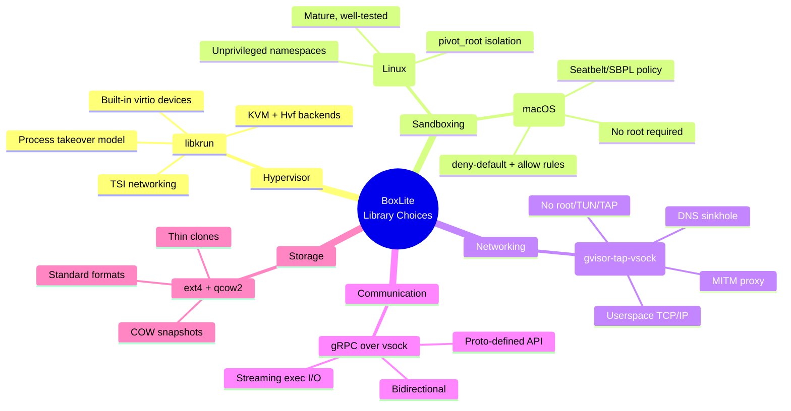

---

## 7. Guest Agent Architecture

The guest agent (`src/guest/`) runs **inside the VM** and is always compiled for Linux.

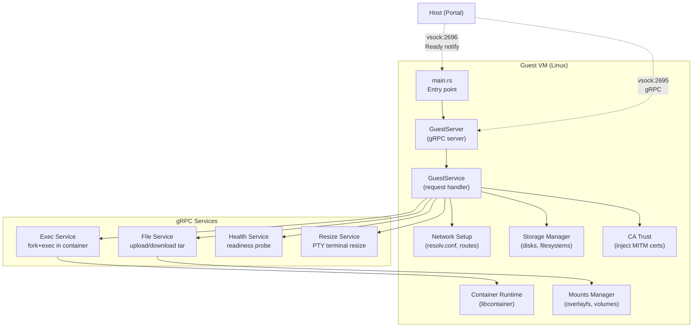

**Guest startup sequence:**
1. **Start Zygote** (`clone3()` fork server) **before** Tokio — avoids musl `malloc` deadlock in forked async runtime
2. Mount essential tmpfs (`/tmp`, `/dev/shm`)
3. Parse args (`--listen vsock://2695 --notify vsock://2696`)
4. Initialize tracing
5. Prepare guest layout (`/boxlite/*`)
6. Start gRPC server on vsock
7. Send ready notification to host

**On `Guest.Init()` gRPC call:**
1. Mount volumes (virtiofs + block devices)
2. Configure network (DNS, routes)
3. Inject CA certs (if MITM secrets configured)

**On `Container.Init()` gRPC call:**
1. Assemble overlayfs (upper + lower layers)
2. Start OCI container via `libcontainer`

**Zygote pattern:** Container processes are spawned via the pre-forked Zygote using `clone3()` syscall. This avoids the musl libc deadlock that occurs when `fork()` is called from a multi-threaded Tokio runtime — the Zygote is started **before** any threads exist.

---

## 8. Host-Guest Communication

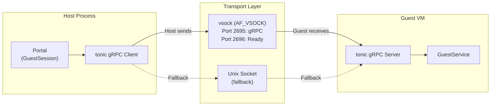

**Transport abstraction:**
```
Transport enum:
  ├── Vsock { port: u32 }        ← Primary (inside VM, no host setup)
  ├── Unix  { socket_path }      ← Fallback / development
  └── Tcp   { port: u16 }       ← Future / distributed
```

**Krun-specific transform:** The host configures `Unix` transport (socket in box dir), but libkrun's process bridges it to `vsock` inside the guest. The `Krun::transform_shell_arg_unix_to_vsock()` method rewrites the guest entrypoint args.

---

## 9. Windows Native Porting Analysis

### 9.1 Component Readiness

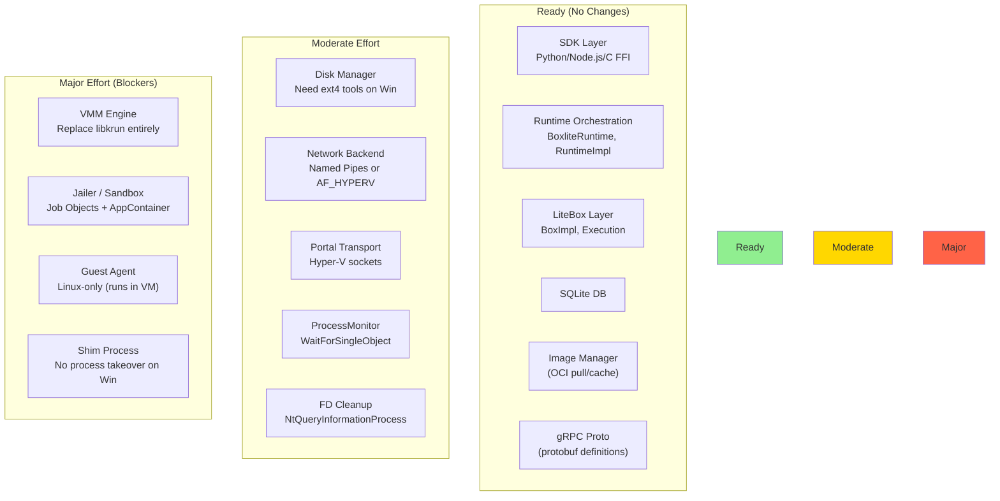

### 9.2 Platform Abstraction Strategy

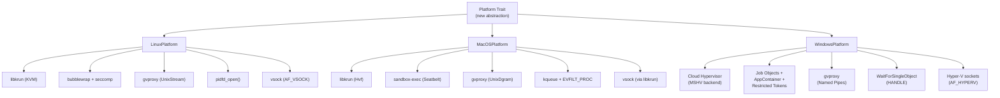

### 9.3 Recommended Windows Porting Phases

| Phase | Component | Effort | Description |
|-------|-----------|--------|-------------|
| **Phase 0** | `SystemCheck` | Small | Add `target_os = "windows"` check for WHPX/Hyper-V |
| **Phase 1** | `ProcessMonitor` | Small | `WaitForSingleObject` implementation |
| **Phase 1** | `FD Cleanup` | Small | Replace with `NtQueryInformationProcess` or skip |
| **Phase 2** | `Transport` | Medium | Add `HyperVSocket { vm_id, service_id }` variant |
| **Phase 2** | `Portal` | Medium | Hyper-V socket gRPC transport |
| **Phase 3** | `VMM Engine` | **Large** | Cloud Hypervisor with MSHV backend (new engine impl) |
| **Phase 3** | `Shim` | Large | No process takeover — use subprocess model instead |
| **Phase 4** | `Jailer` | Medium | `WindowsSandbox` impl: Job Objects + AppContainer |
| **Phase 5** | `Network` | Medium | gvproxy on Windows (Named Pipes + Go cross-compile) |
| **Phase 6** | `Disk` | Medium | ext4 tools for Windows or alternative format |

---

## 10. Initialization Pipeline

BoxBuilder uses a **staged execution pipeline** (`src/boxlite/src/litebox/init/`) with parallel and sequential phases, adapting to the box's current status.

### 10.1 First Start (Configured)

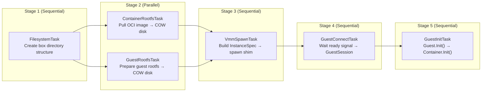

### 10.2 Restart (Stopped)

Same pipeline, but:
- **ContainerRootfsTask**: Reuses existing COW disk (preserves user modifications)
- **GuestRootfsTask**: Reuses existing COW disk
- **VmmSpawnTask**: Spawns **new** VM process
- **GuestInitTask**: Must run (new VM has fresh guest daemon)

### 10.3 Reattach (Running)

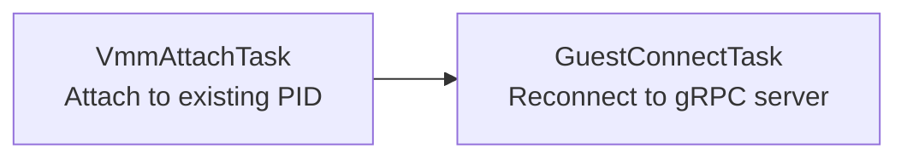

### 10.4 RAII Cleanup Guarantees

- **CleanupGuard** in BoxBuilder: Kills VM + removes directory on pipeline failure
- **Disk** RAII: Deletes file on drop (unless `persistent=true`)
- **BindMountHandle** RAII (Linux): Unmounts on drop
- **LockGuard**: Releases filesystem lock on drop

---

## 11. Snapshot & Clone Architecture

### 11.1 Snapshot Flow (Quiesce + Fork)

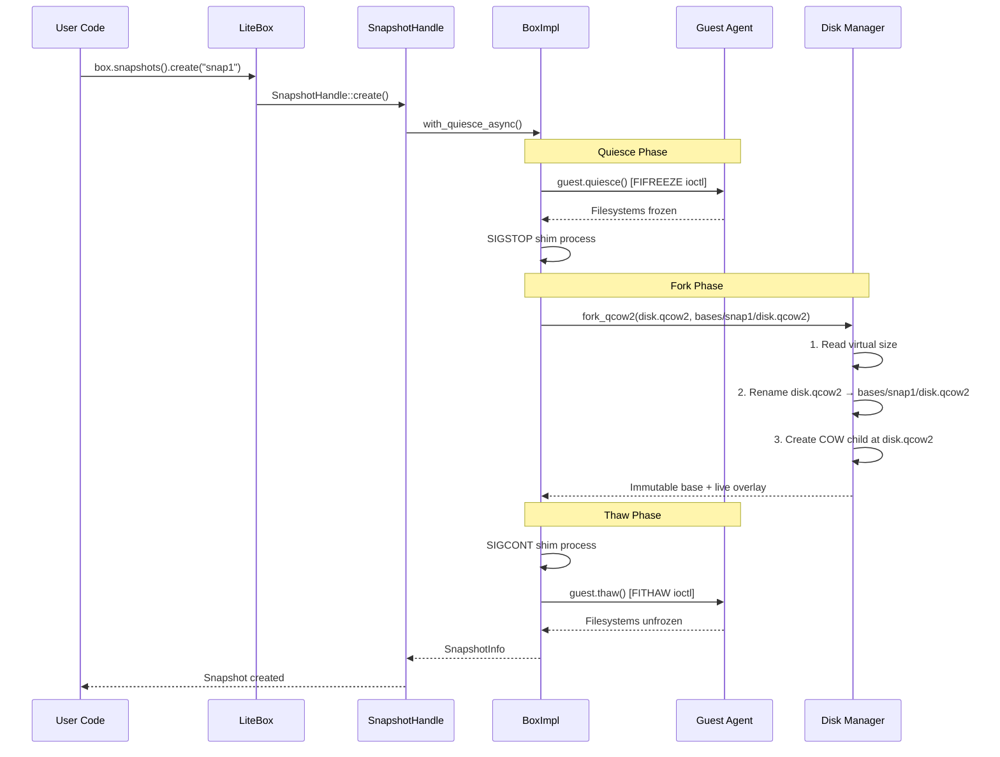

### 11.2 Clone Flow (Thin Overlay)

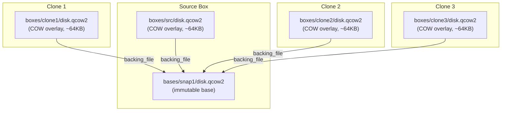

**Batch clone** (`clone_boxes`): Source disks copied once into shared base, then each clone gets a thin qcow2 overlay (~64KB) — O(1) per clone instead of O(disk_size).

---

## 12. Key Design Decisions

### 12.1 Why Shim Process?

```mermaid
graph LR
    subgraph "Without Shim (Dangerous)"
        HOST1["Host Process"] -->|"krun_start_enter()"| TAKEOVER["Process Takeover<br/>Host process GONE"]
    end

    subgraph "With Shim (Current Design)"
        HOST2["Host Process"] -->|"spawn()"| SHIM2["boxlite-shim"]
        SHIM2 -->|"krun_start_enter()"| VM2["VM Running<br/>Host survives"]
    end
```

`libkrun`'s `krun_start_enter()` **takes over the calling process** — it never returns. The shim subprocess isolates this behavior, letting the host application continue running and manage multiple VMs concurrently.

### 12.2 Why vsock?

- No host network configuration needed
- Works inside hardware-isolated VM
- Faster than TCP (no network stack overhead)
- Secure by design (no network exposure)
- Standard Linux/macOS kernel support

### 12.3 Why gvproxy (not TUN/TAP)?

- **No root required** — userspace TCP/IP stack
- **No TUN/TAP device** — works in unprivileged containers
- **Built-in features** — DNS sinkhole, MITM proxy, port mapping
- **Cross-platform** — Go binary works on Linux and macOS

### 12.4 Trait-Based Extensibility

```
RuntimeBackend (trait)
├── LocalRuntime  → VM-backed boxes
└── RestRuntime   → HTTP-backed boxes (distributed)

BoxBackend (trait)
├── BoxImpl       → Local VM lifecycle
└── RestBox       → Remote box via REST API

Sandbox (trait)
├── BwrapSandbox      → Linux namespaces
├── SeatbeltSandbox   → macOS Seatbelt
├── CompositeSandbox  → Bwrap + Landlock
├── NoopSandbox       → Disabled
└── WindowsSandbox    → TODO: Job Objects + AppContainer

NetworkBackend (trait)
├── GvisorTapBackend  → gvproxy (primary)
└── LibslirpBackend   → libslirp (fallback)

VmmController (trait)
├── ShimController    → Subprocess shim
└── (future)          → Direct VM management

Vmm (trait)
├── Krun              → libkrun engine
└── (future)          → Cloud Hypervisor, Firecracker
```

The trait-based architecture is well-suited for Windows porting — new platform implementations can be added behind the existing trait boundaries without modifying the upper layers.
