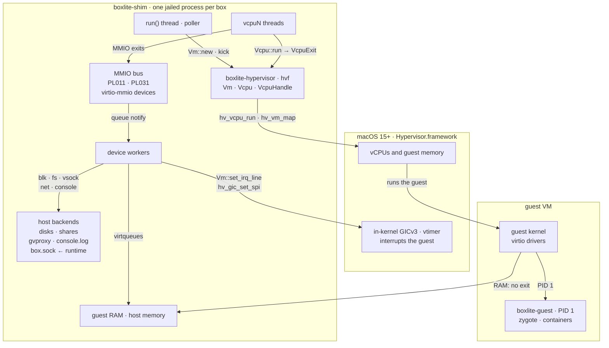
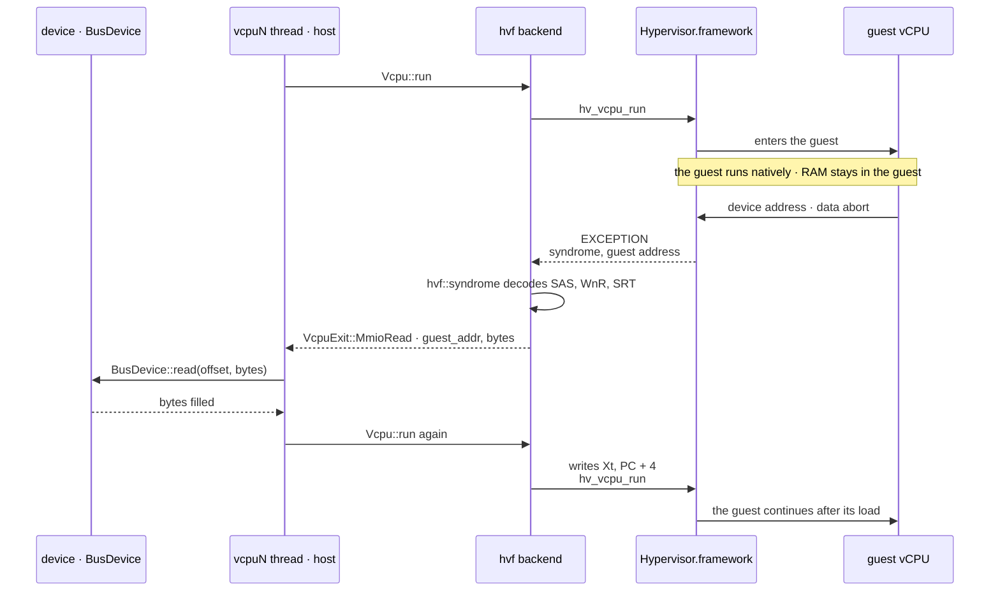
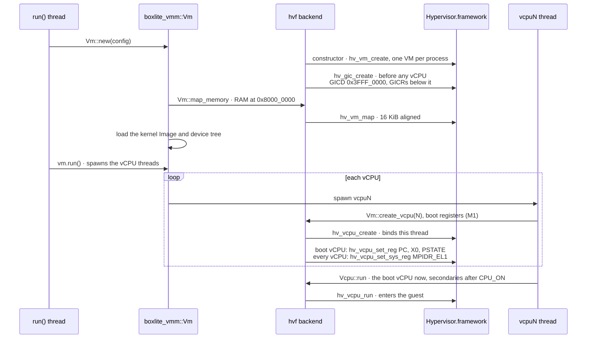
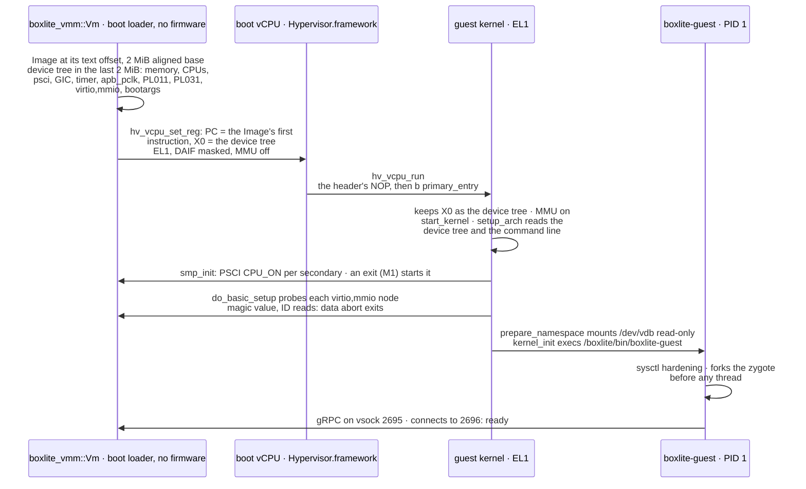
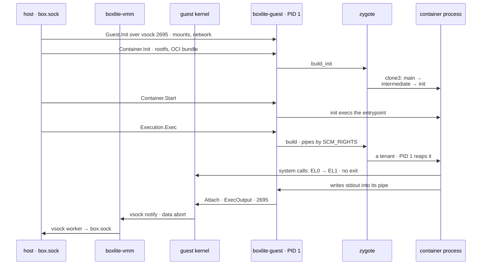
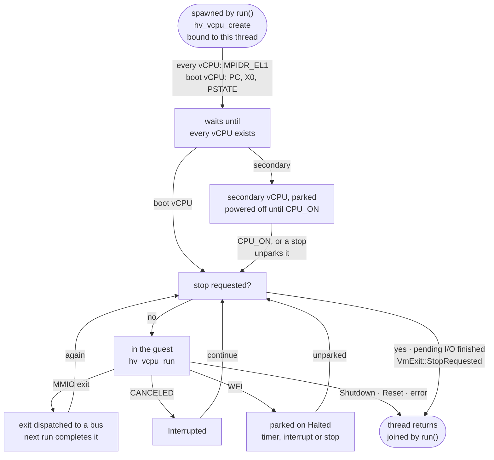
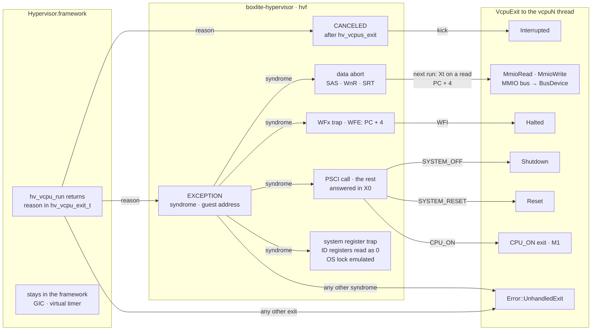
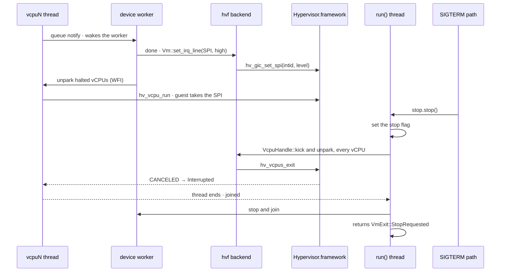

# macOS Hypervisor.framework (design)

How the [VMM design](README.md) runs a box on macOS 15+ on Apple silicon. Planned: M1 boots a test initramfs on this backend, and M2 adds virtio devices and `boxlite-guest` as PID 1.

## Components

## Host to guest to host

## Setup order

## Boot: the VMM as boot loader, then the kernel and PID 1

## A process in the guest

## vCPU lifecycle

## Exits

## I/O, interrupts and stop

