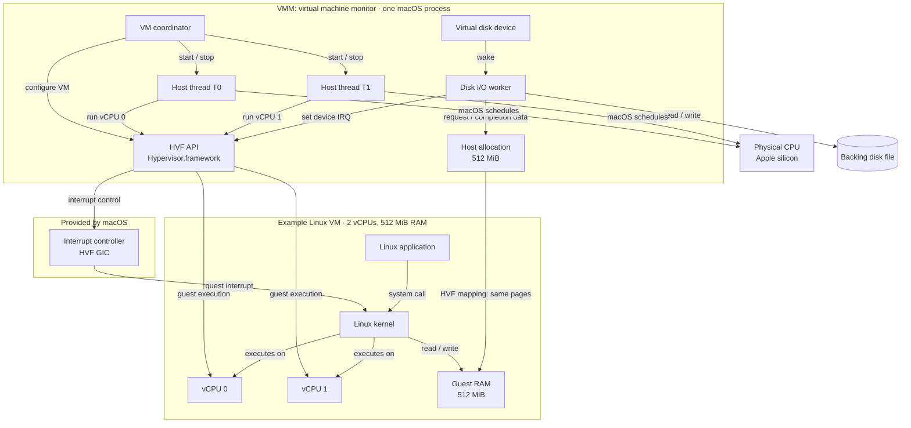
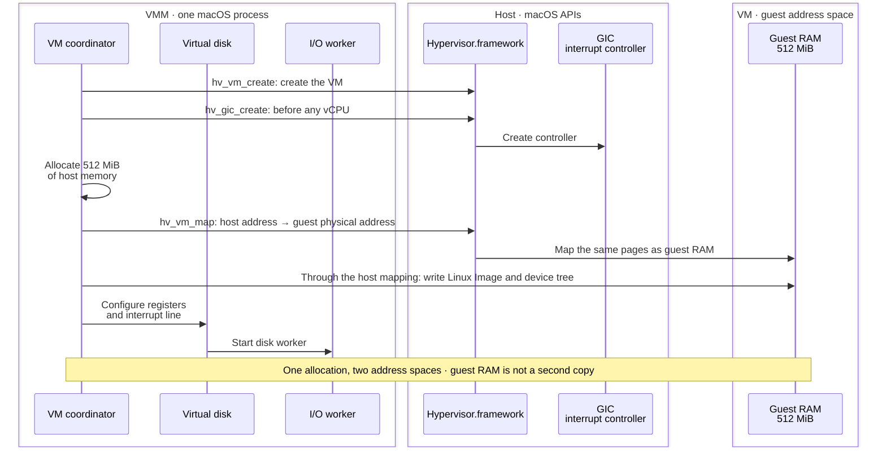
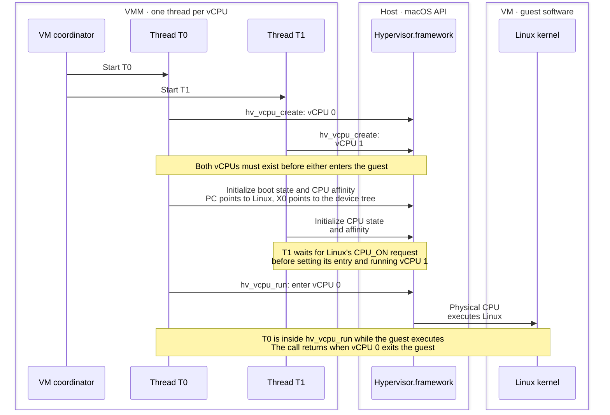
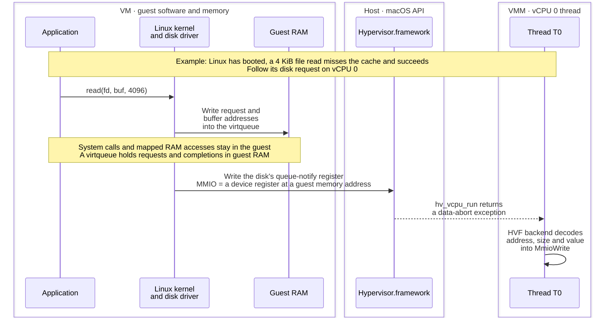
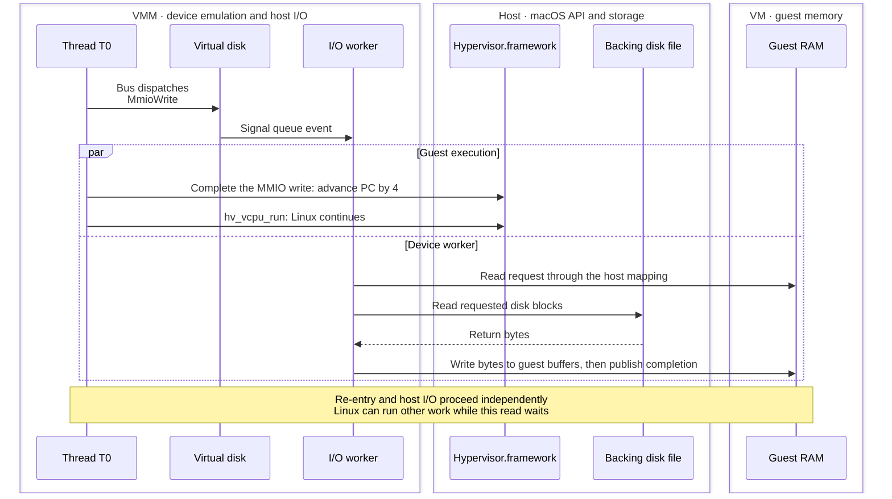
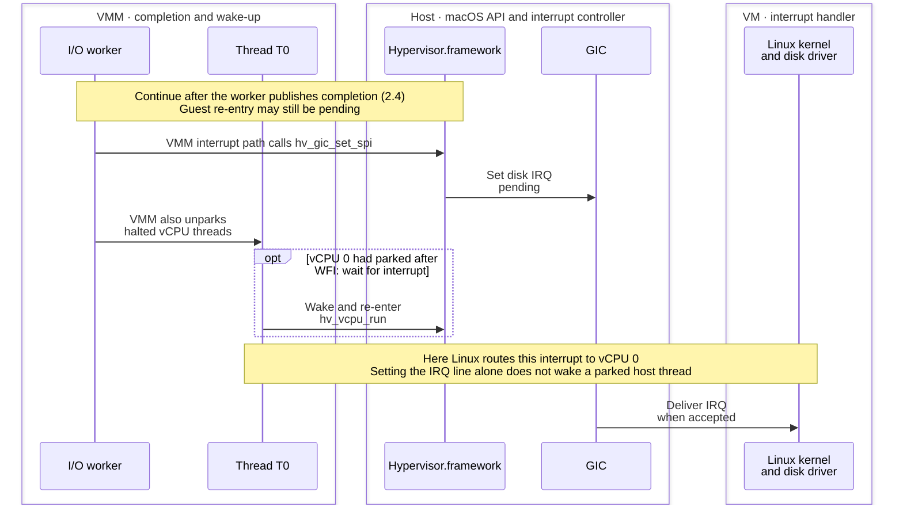
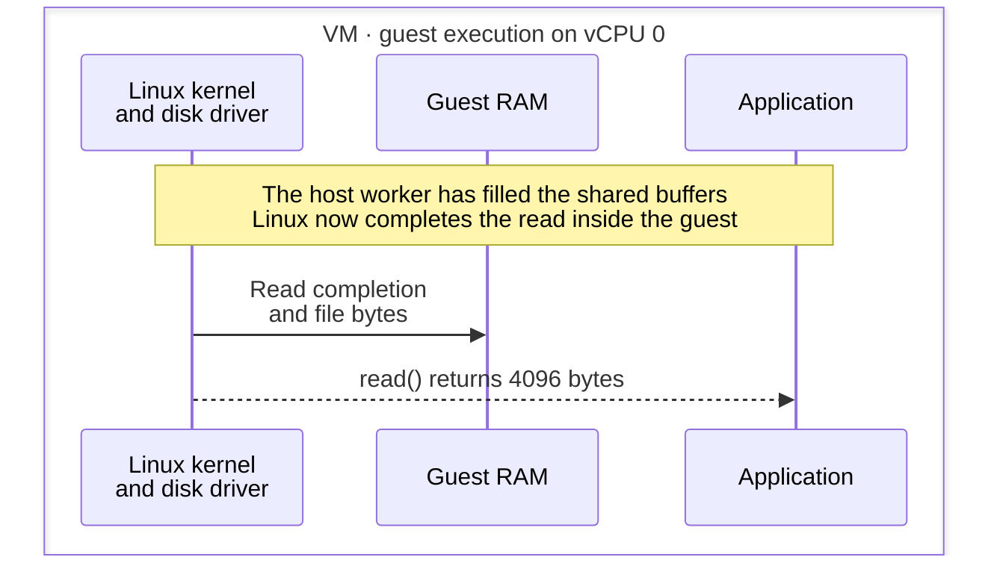
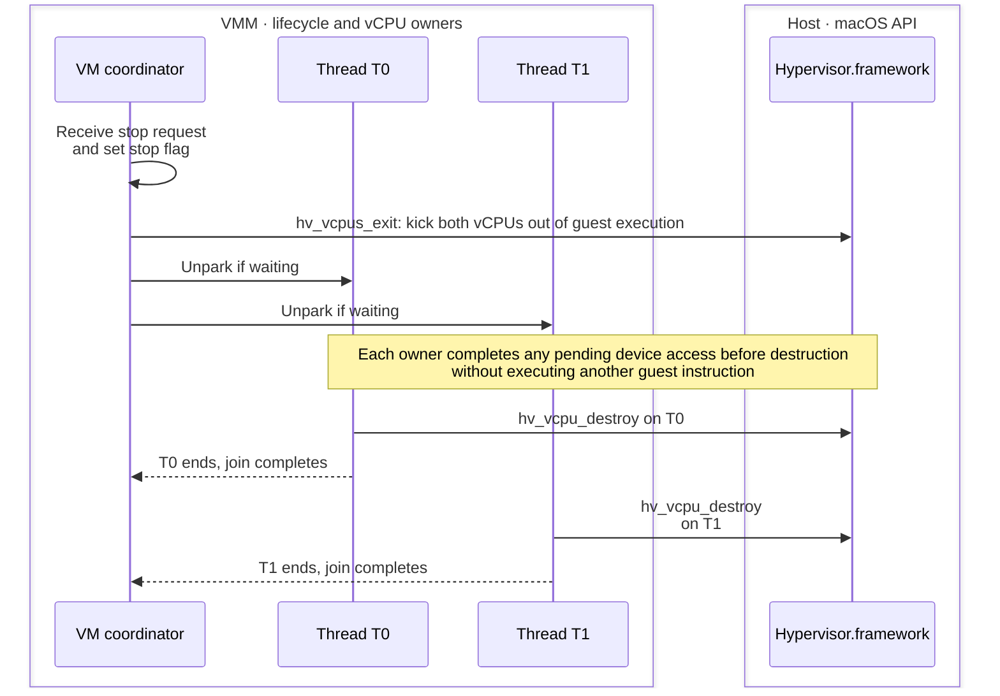
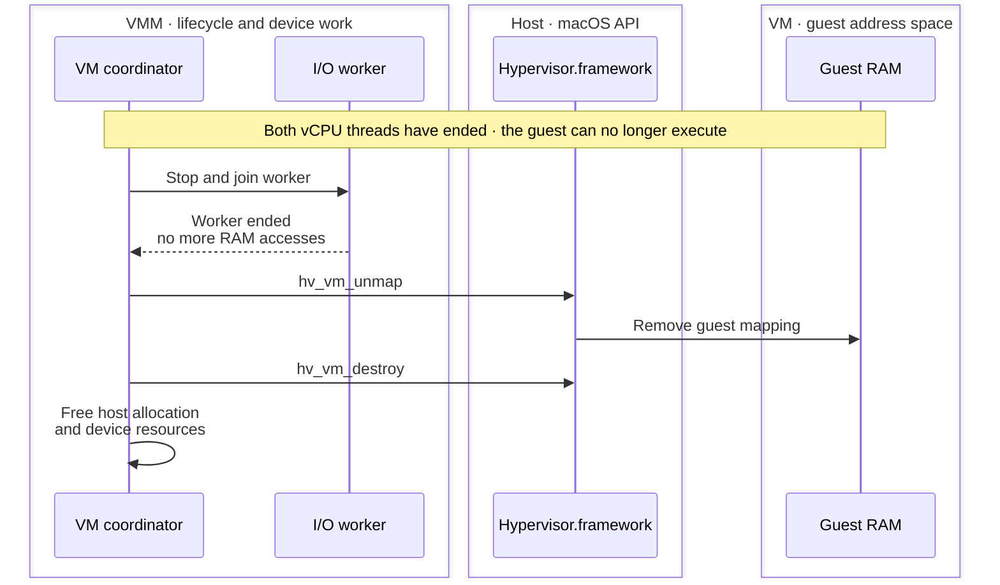

# Understanding Hypervisor.framework

A visual introduction to HVF on Apple silicon, using BoxLite's
[planned native VMM](README.md). This design targets macOS 15+ for HVF's
interrupt controller. The native backend is still a stub; boxes currently use
libkrun.

## 1. Architecture

## 2. How it works

### 2.1 Prepare the machine

### 2.2 Boot Linux on a vCPU

### 2.3 A file read reaches a device register

### 2.4 The VMM resumes Linux while the worker reads the disk

### 2.5 The host delivers the disk interrupt

### 2.6 Linux completes the file read

### 2.7 Stop the vCPU threads

### 2.8 Release the remaining resources

## BoxLite implementation reference

[Crate responsibilities](README.md#architecture) ·
[HVF API contract](README.md#hypervisor-backend-interface) ·
[Exit decoding](README.md#exit-contract) ·
[Memory layout](memory.md) ·
[Boot registers and device tree](README.md#boot-path) ·
[Threading and remaining M1 work](README.md#threads) ·
[Real HVF run loop in libkrun](https://github.com/libkrun/libkrun/blob/e12b9b3780ffa8df9f3e1797b217d13453479167/src/hvf/src/lib.rs#L553-L650) ·
[Apple's HVF overview](https://developer.apple.com/documentation/hypervisor)
