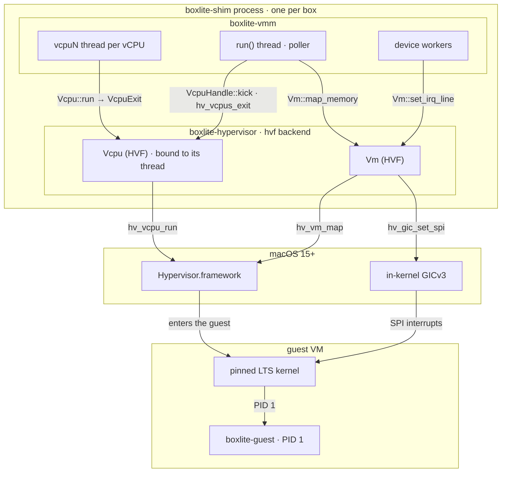

# macOS Hypervisor.framework (design)

How the [VMM design](README.md) runs a box on macOS 15+ on Apple silicon. Planned: M1 boots a test initramfs on this backend, and M2 adds virtio devices and `boxlite-guest` as PID 1.

