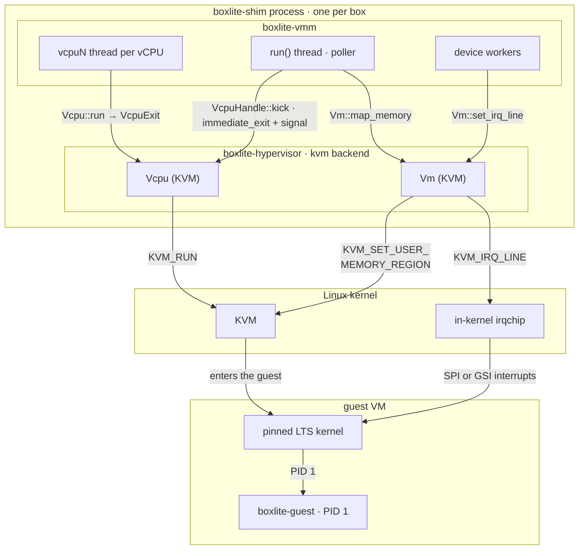

# Linux KVM (design)

How the [VMM design](README.md) runs a box on Linux x86_64 and arm64. Planned: M1 boots a test initramfs on this backend, and M2 adds virtio devices and `boxlite-guest` as PID 1.

