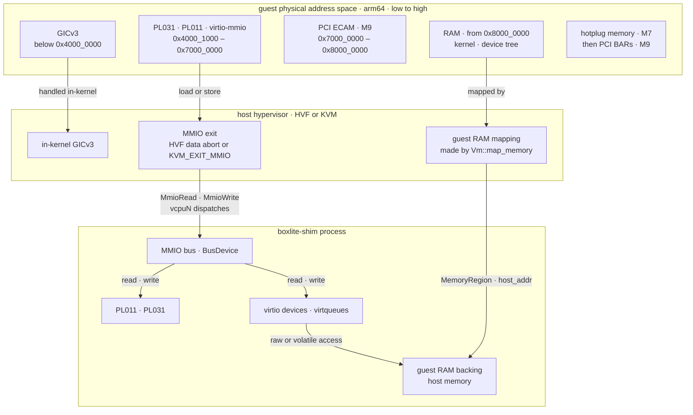

# Guest memory (design)

How a guest physical address reaches host memory or a device in the [VMM design](README.md), on arm64; the design also lists the x86_64 layout. Planned: M1 maps guest memory and adds the PL011 and PL031, and M2 adds virtio devices.

