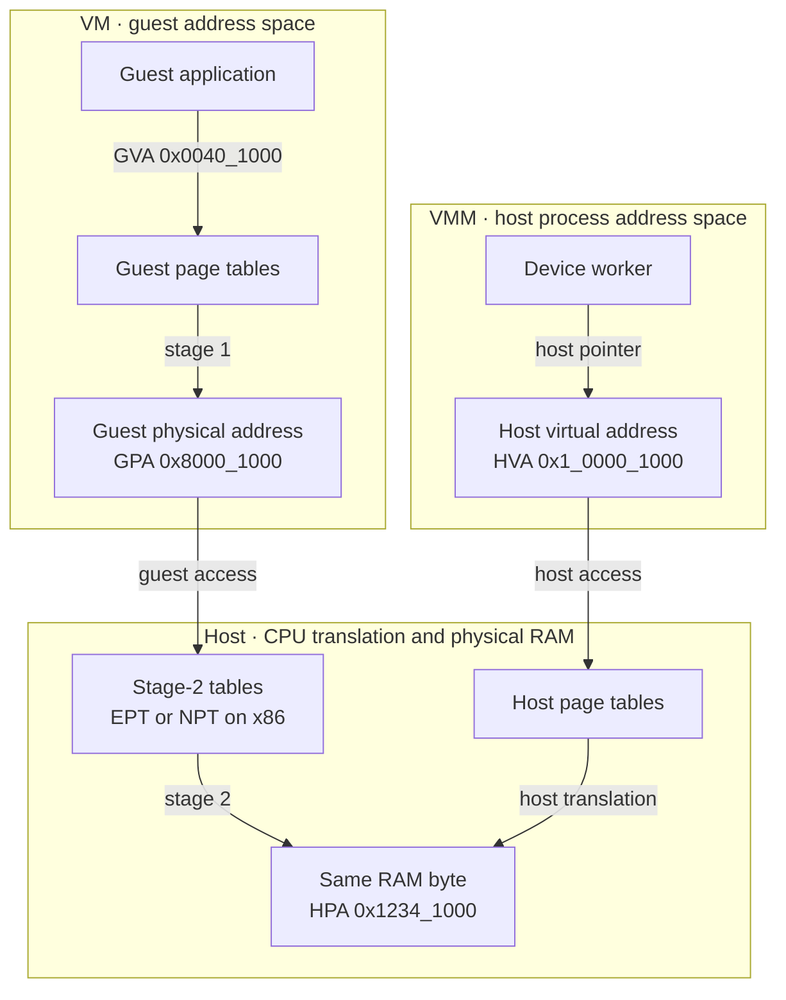
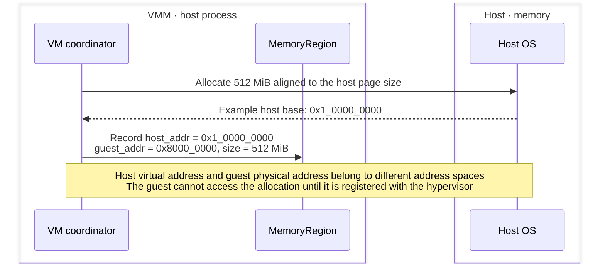
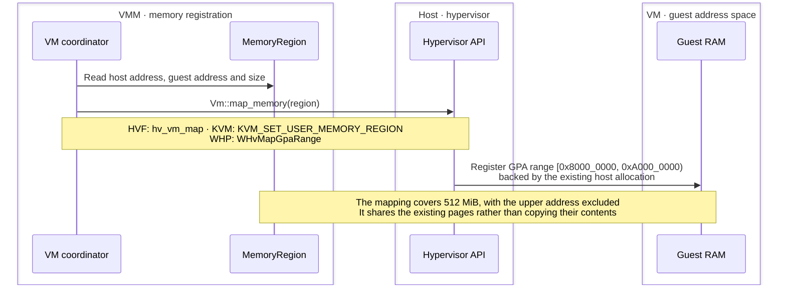
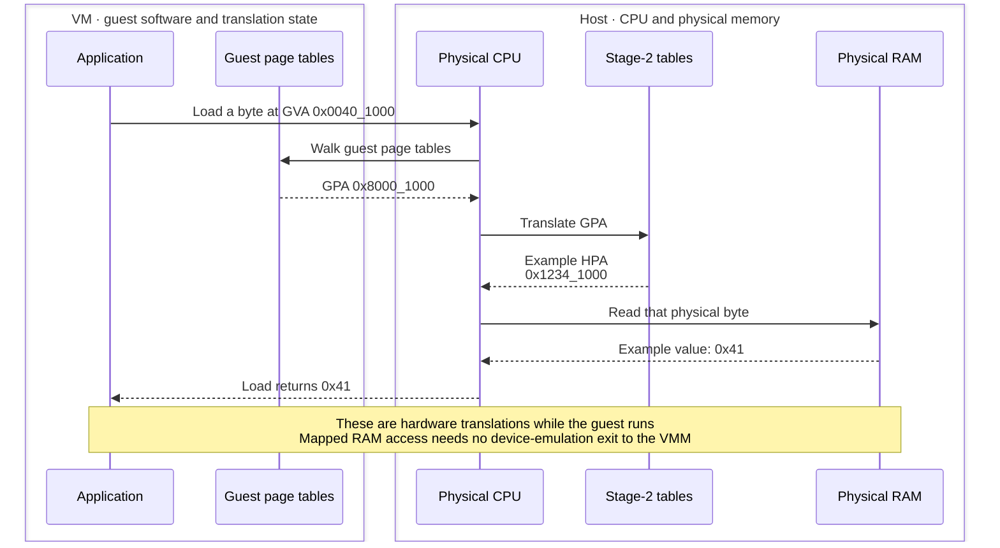
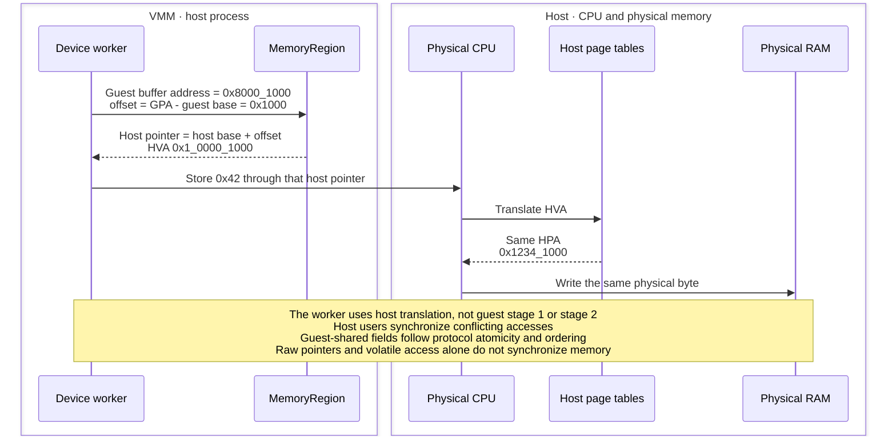
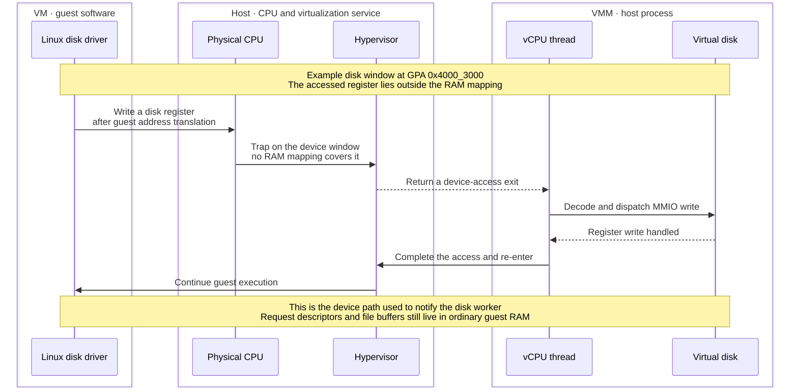
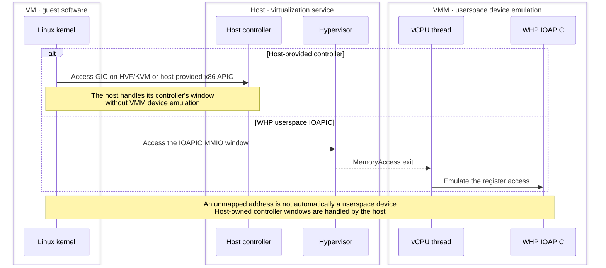
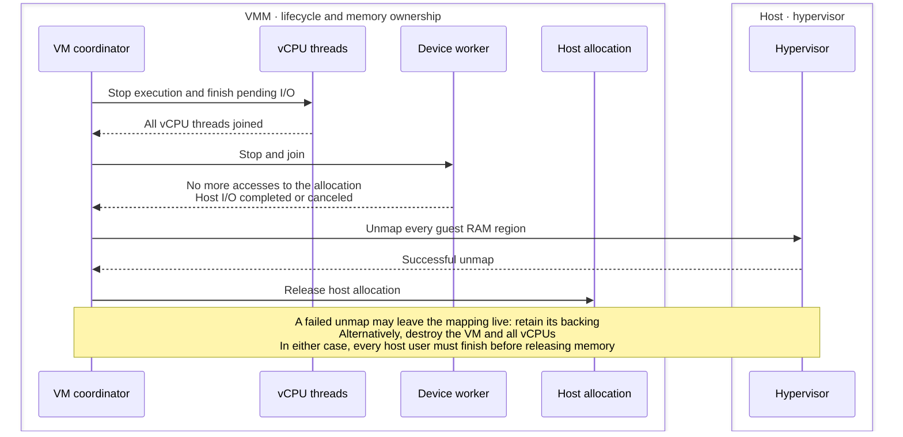
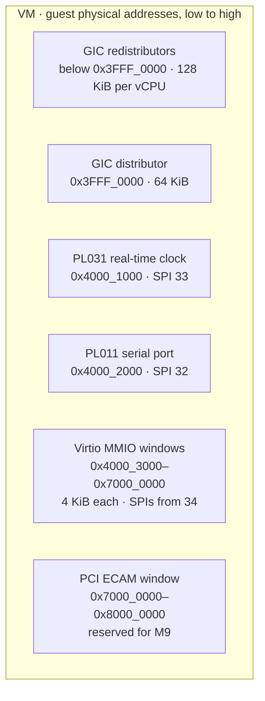
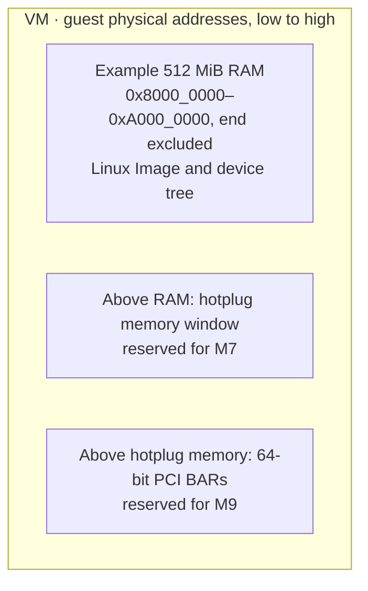

# Understanding guest memory

A visual introduction to memory in the [planned native VMM](README.md), using
an arm64 VM with 512 MiB RAM. The walkthrough follows one byte through guest
and host addresses. Pointer values and physical addresses are illustrative;
the final address-map diagrams show BoxLite's planned guest layout.

## 1. Architecture

## 2. How it works

### 2.1 Allocate backing memory in the host process

### 2.2 Register the allocation as guest RAM

### 2.3 Translate one guest load into a physical RAM access

### 2.4 The host worker accesses the same byte through a different pointer

### 2.5 A device register takes the MMIO path instead

### 2.6 Interrupt-controller windows depend on who implements them

### 2.7 Keep the backing alive until every user has stopped

## 3. The planned arm64 address map

### 3.1 Controller and device windows below RAM

### 3.2 RAM and space reserved above it

## BoxLite implementation reference

[MemoryRegion fields](../../../src/hypervisor/src/memory.rs) ·
[Memory lifetime contract](README.md#hypervisor-backend-interface) ·
[Guest address layout](README.md#guest-memory-layout) ·
[Pending I/O contract](../../../src/hypervisor/src/exit.rs) ·
[HVF walkthrough](hvf.md) · [KVM walkthrough](kvm.md) · [WHP walkthrough](whp.md) ·
[WHP host-to-guest mapping API](https://learn.microsoft.com/en-us/virtualization/api/hypervisor-platform/funcs/whvmapgparange) ·
[KVM memory registration](https://docs.kernel.org/virt/kvm/api.html#kvm-set-user-memory-region)
