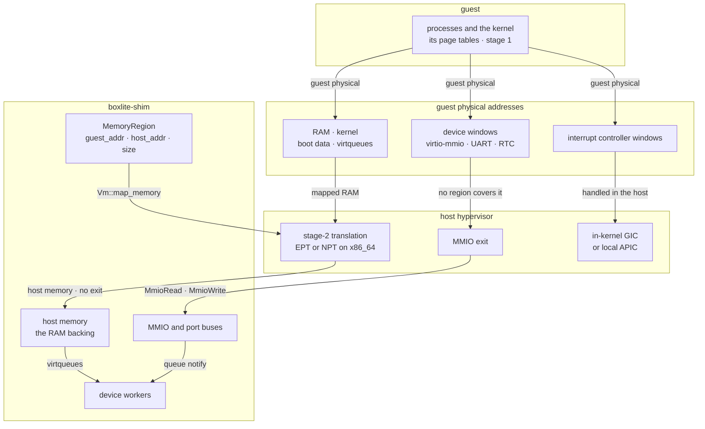
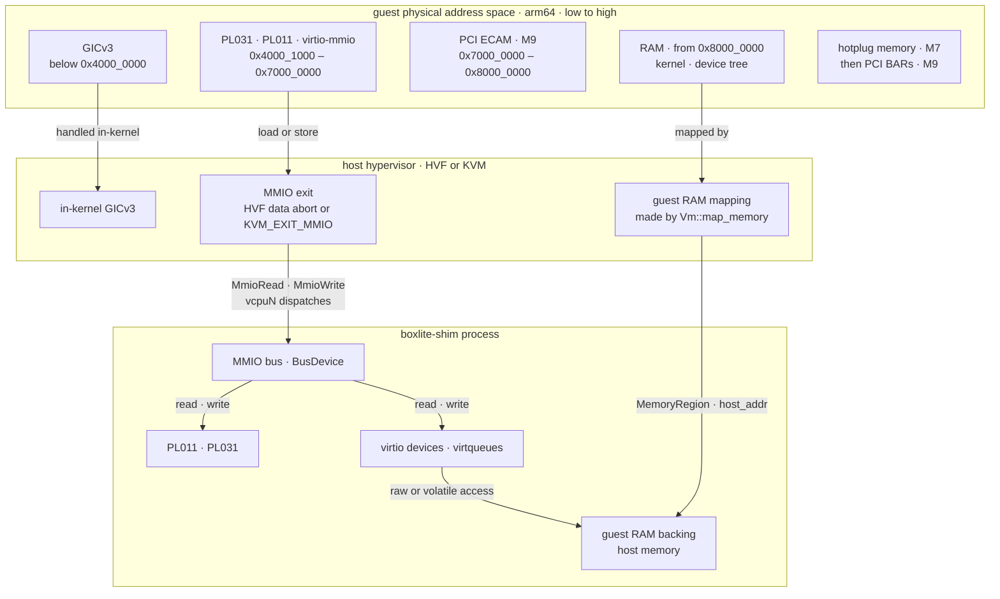

# Guest memory (design)

What turns a guest access into host memory or a device access in the [VMM design](README.md), and where each guest physical address goes on arm64; the design also lists the x86_64 layout. Planned: M1 maps guest memory and adds the PL011 and PL031, and M2 adds virtio devices.

## Components

## arm64 address map

