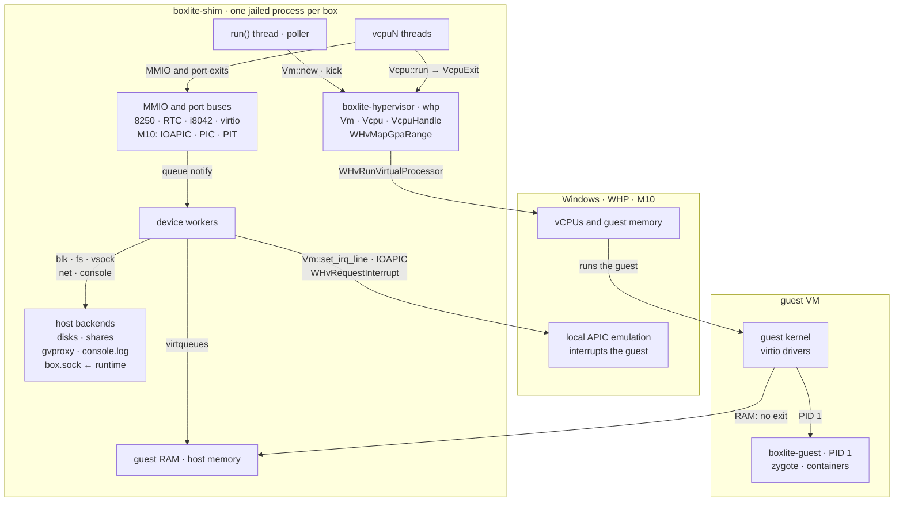
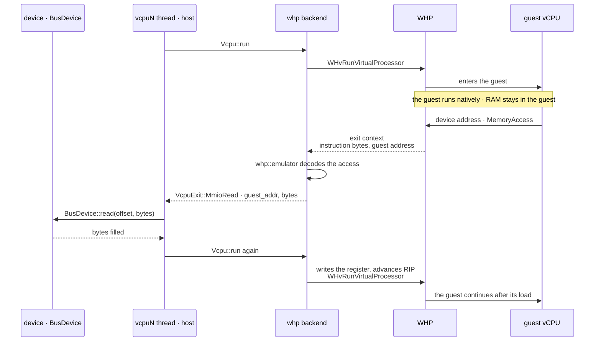
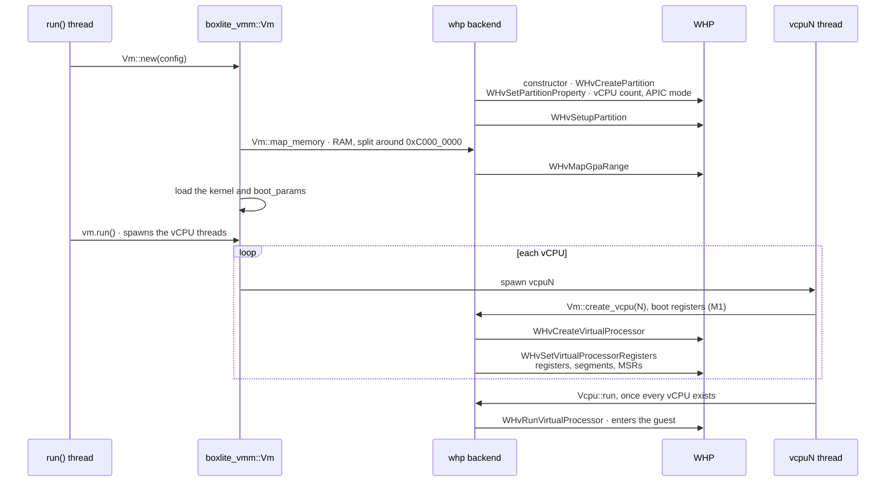
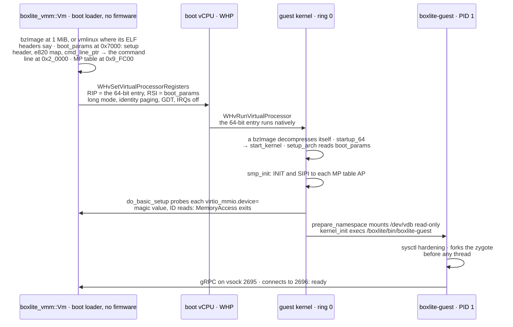
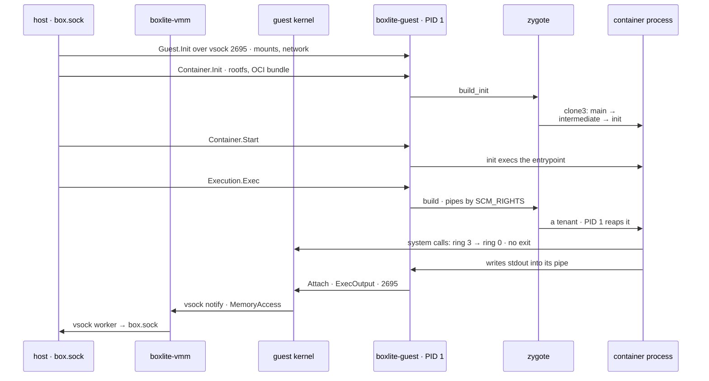
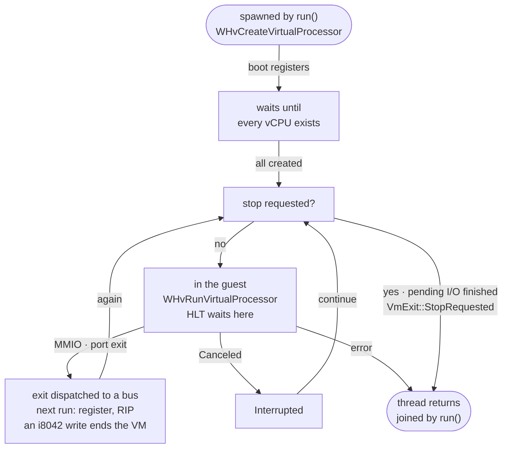
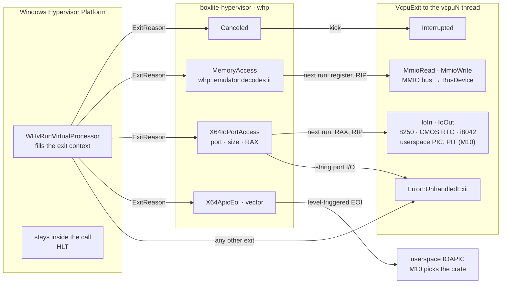
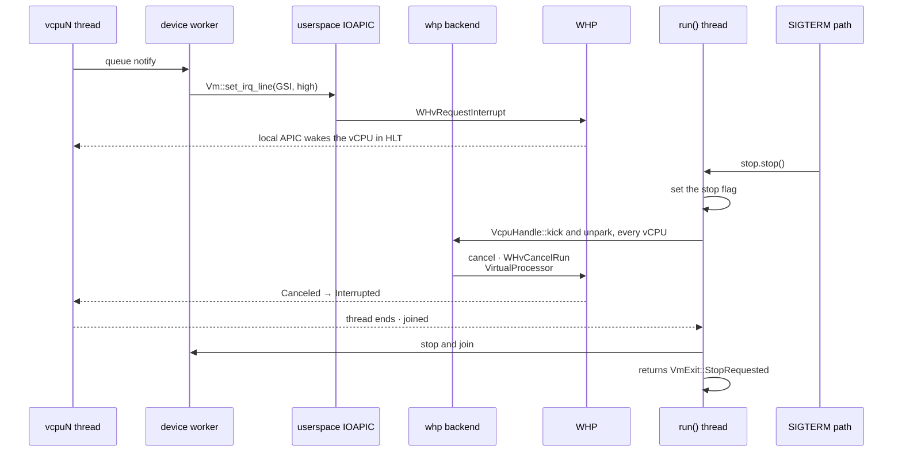

# Windows Hypervisor Platform (design)

How the [VMM design](README.md) would run a box on Windows x86_64. Planned for M10: today `boxlite-hypervisor` only reserves the `whp` module.

## Components

## Host to guest to host

## Setup order

## Boot: the VMM as boot loader, then the kernel and PID 1

## A process in the guest

## vCPU lifecycle

## Exits

## I/O, interrupts and stop

