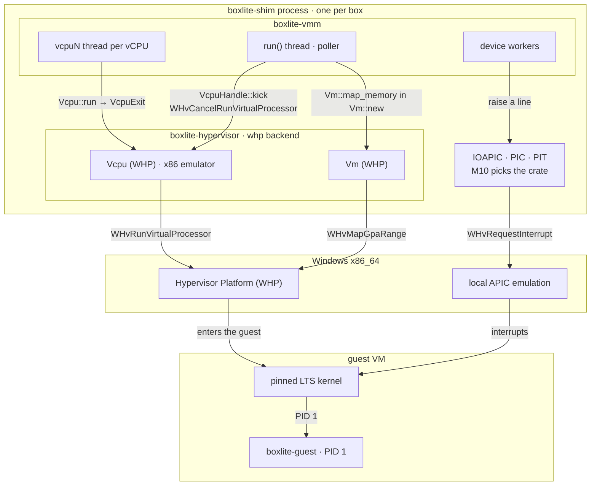

# Windows Hypervisor Platform (design)

How the [VMM design](README.md) would run a box on Windows x86_64. Planned for M10: today `boxlite-hypervisor` only reserves the `whp` module.

```mermaid
flowchart TB
  subgraph shim_process["boxlite-shim process · one per box"]
    subgraph vmm_crate["boxlite-vmm"]
      run_thread["run() thread · poller"]
      device_worker["device workers"]
      vcpu_thread["vcpuN thread per vCPU"]
    end
    subgraph whp_backend["boxlite-hypervisor · whp backend"]
      whp_vm["Vm (WHP)"]
      whp_vcpu["Vcpu (WHP) · x86 emulator"]
    end
    userspace_irqchip["IOAPIC · PIC · PIT<br/>M10 picks the crate"]
  end
  subgraph windows["Windows x86_64"]
    whp_api["Hypervisor Platform (WHP)"]
    lapic["local APIC emulation"]
  end
  subgraph guest_vm["guest VM"]
    guest_kernel["pinned LTS kernel"]
    guest_init["boxlite-guest · PID 1"]
  end
  vcpu_thread e_vcpu_run@-->|"Vcpu::run → VcpuExit"| whp_vcpu
  whp_vcpu e_whv_run@-->|"WHvRunVirtualProcessor"| whp_api
  whp_api e_enter_guest@-->|"enters the guest"| guest_kernel
  run_thread e_kick@-->|"VcpuHandle::kick<br/>WHvCancelRunVirtualProcessor"| whp_vcpu
  run_thread e_map_memory@-->|"Vm::map_memory in Vm::new"| whp_vm
  whp_vm e_whv_map@-->|"WHvMapGpaRange"| whp_api
  device_worker e_raise@-->|"raise a line"| userspace_irqchip
  userspace_irqchip e_request_interrupt@-->|"WHvRequestInterrupt"| lapic
  lapic e_guest_irq@-->|"interrupts"| guest_kernel
  guest_kernel e_pid1@-->|"PID 1"| guest_init
```
