# Understanding Windows Hypervisor Platform

A visual introduction to WHP, using BoxLite's [planned native VMM](README.md).
The example is a Linux x86_64 VM with 2 vCPUs, 512 MiB RAM and a virtual disk
on a Windows host. This entire backend is planned for M10; the current code
only reserves its module.

## 1. Architecture

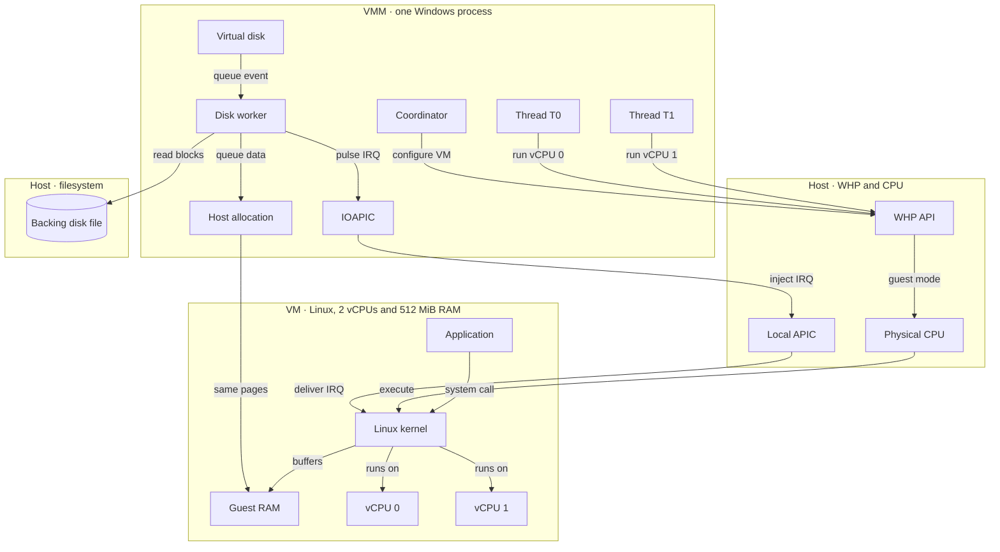

## 2. How it works

### 2.1 Create and configure a partition

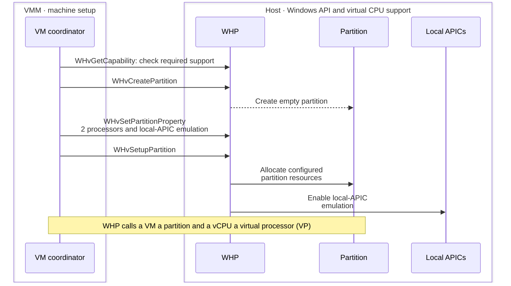

### 2.2 Build the userspace chipset

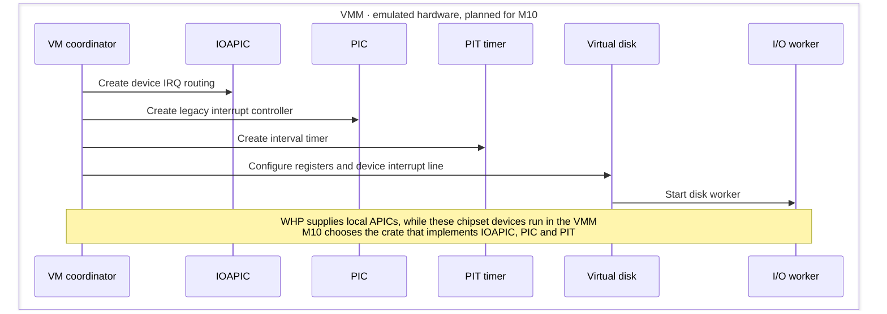

### 2.3 Map RAM and load Linux

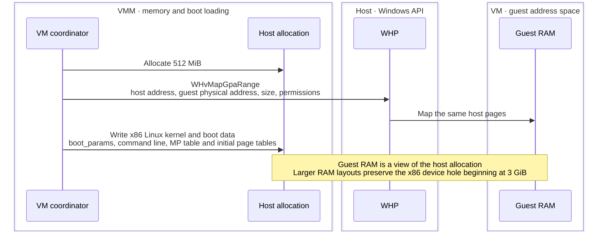

### 2.4 Create virtual processors and boot Linux

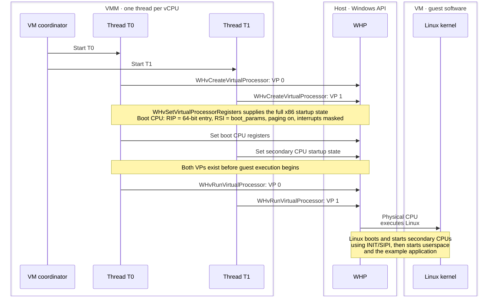

### 2.5 A file read reaches a device register

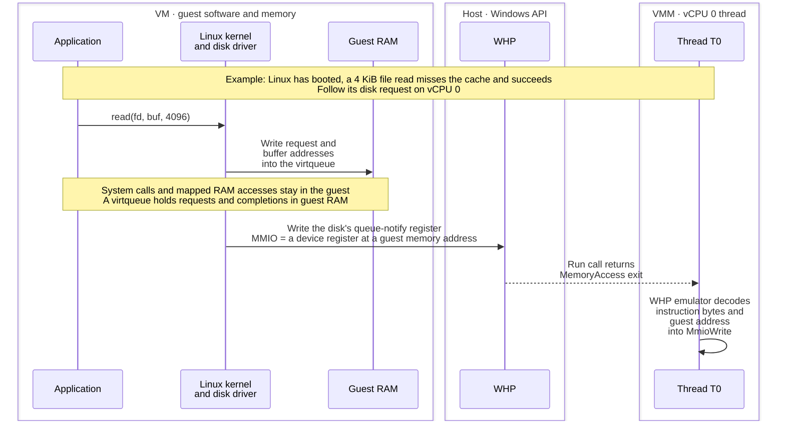

### 2.6 Resume Linux while the worker reads the disk

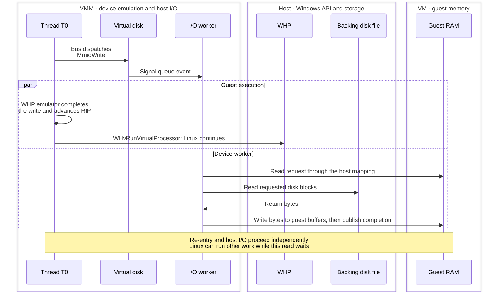

### 2.7 Route the disk interrupt through the userspace IOAPIC

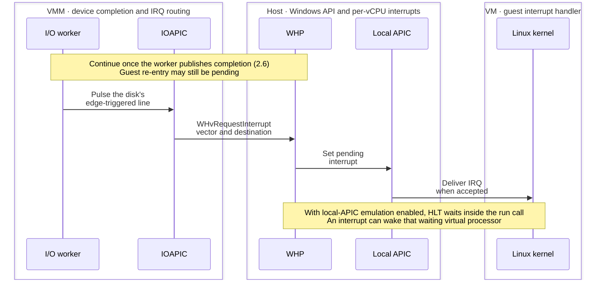

### 2.8 Linux completes the file read

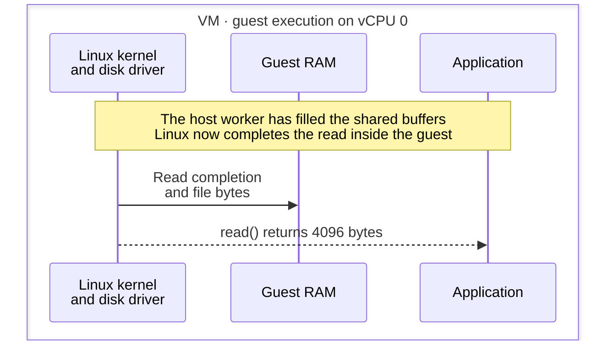

### 2.9 A level-triggered device also needs EOI feedback

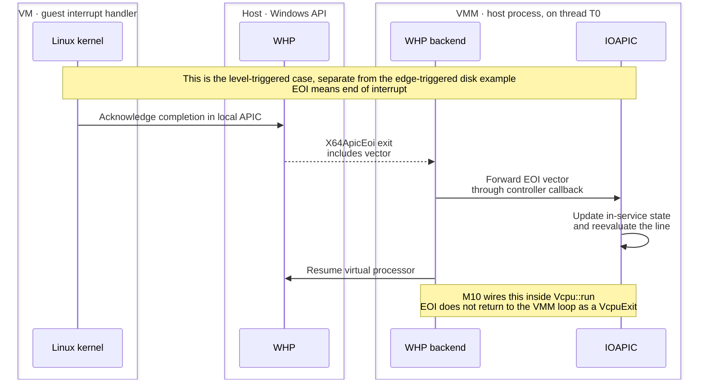

### 2.10 Stop the vCPU threads

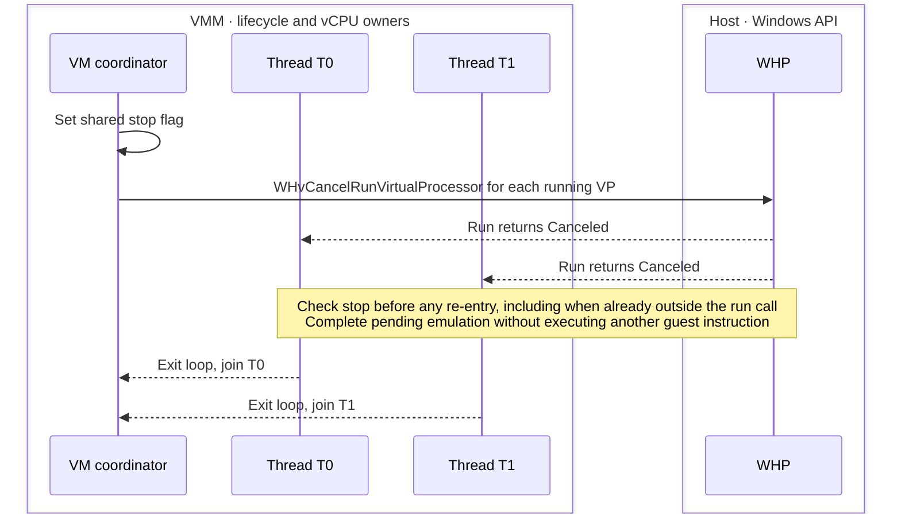

### 2.11 Release the remaining resources

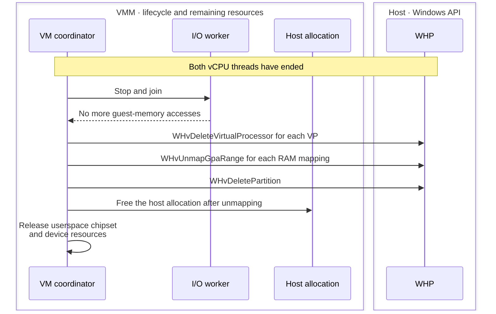

## BoxLite implementation reference

[Crate responsibilities](README.md#architecture) ·
[Backend API contract](README.md#hypervisor-backend-interface) ·
[Exit decoding](README.md#exit-contract) ·
[Memory layout](memory.md) ·
[Boot registers and boot data](README.md#boot-path) ·
[Threads and lifecycle](README.md#threads) ·
[Windows M10 scope](README.md#room-for-later-milestones) ·
[WHP API](https://learn.microsoft.com/en-us/virtualization/api/hypervisor-platform/hypervisor-platform) ·
[QEMU WHP exit handling](https://github.com/qemu/qemu/blob/f8aef8a9aed7438083c400da10acabdec485dc9b/target/i386/whpx/whpx-all.c#L2332-L2342)
