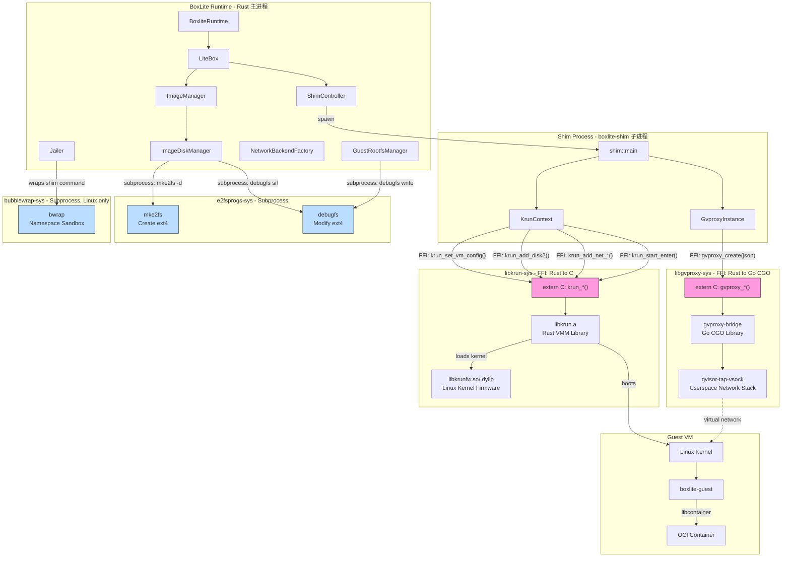
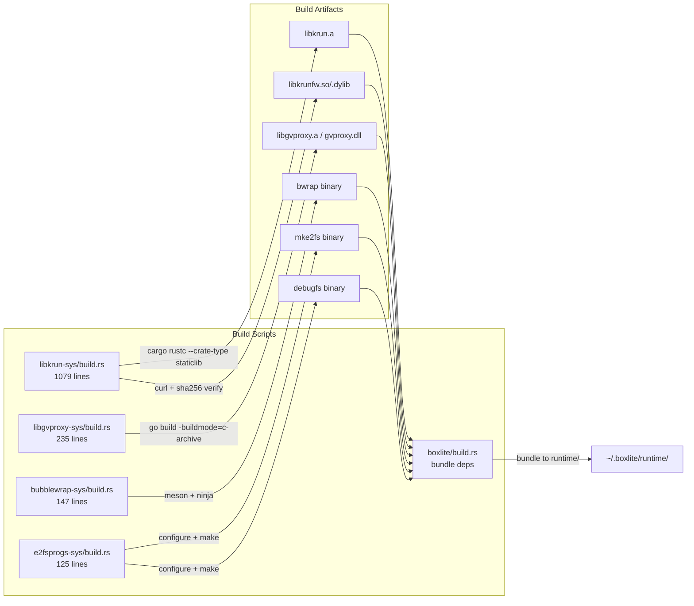
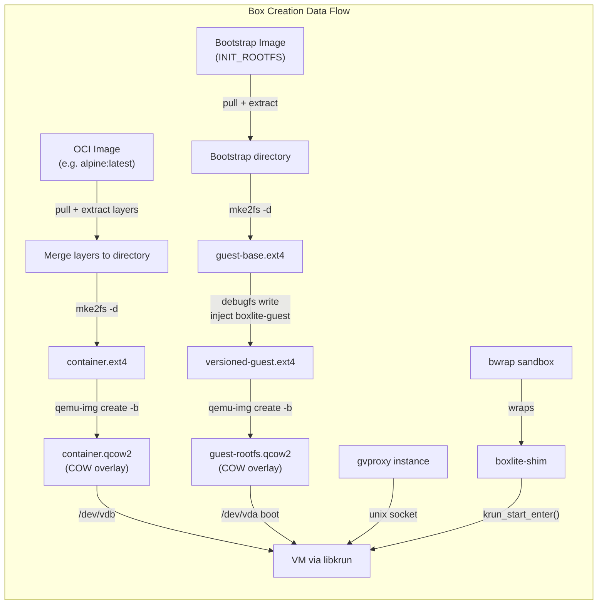
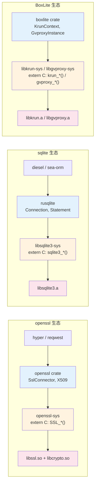
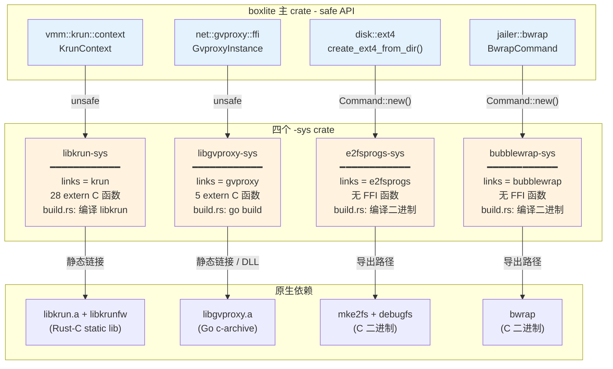

# BoxLite Dependencies: Four Core Native Crates

BoxLite 依赖四个原生构建封装 crate（`*-sys`），分别对应四个上游项目，提供虚拟化、网络、磁盘和沙箱能力。

---

## 目录

- [1. bubblewrap / bubblewrap-sys](#1-bubblewrap--bubblewrap-sys)
- [2. e2fsprogs / e2fsprogs-sys](#2-e2fsprogs--e2fsprogs-sys)
- [3. gvisor-tap-vsock / libgvproxy / libgvproxy-sys](#3-gvisor-tap-vsock--libgvproxy--libgvproxy-sys)
- [4. libkrun / libkrun-sys](#4-libkrun--libkrun-sys)
- [5. Landlock 文件系统 ACL](#5-landlock-文件系统-acl)
- [6. Seatbelt 与 Seccomp — 进程级安全沙箱](#6-seatbelt-与-seccomp--进程级安全沙箱)
- [调用架构图](#调用架构图)
- [总结对比](#总结对比)
- [附录](#附录)
  - [A. Shim 的含义](#a-shim-的含义)
  - [B. Rust Crate 与 Python/Java 的对应关系](#b-rust-crate-与-pythonjava-的对应关系)
  - [C. Rust `-sys` Crate 惯例](#c-rust--sys-crate-惯例)

---

## 1. bubblewrap / bubblewrap-sys

**上游项目**: [containers/bubblewrap](https://github.com/containers/bubblewrap) — 轻量级无特权沙箱工具，利用 Linux namespace 实现进程隔离。Flatpak 和 GNOME 也使用它。

**核心能力**: 不需要 root 权限即可创建 mount/pid/ipc/uts namespace 隔离环境。

| 项目 | 说明 |
|------|------|
| **bubblewrap** | C 语言编写的 `bwrap` 二进制，通过命令行参数声明隔离策略 |
| **bubblewrap-sys** | Rust 构建封装，从 vendored C 源码编译 bwrap 二进制 |

**集成方式**: 子进程执行（非 FFI 链接）

### 构建流程

`src/deps/bubblewrap-sys/build.rs`:

```
Meson setup → Ninja build → 输出 bwrap 二进制
cargo:bwrap_BOXLITE_DEP={path}  # 导出路径给 boxlite
```

构建配置禁用了 SELinux、man pages、tests、shell completions 等不必要功能，最小化依赖。

### BoxLite 中的使用

**关键文件**: `src/boxlite/src/jailer/`

- `bwrap.rs` — `BwrapCommand` builder，组装 bwrap 命令行参数
- `sandbox/bwrap.rs` — 实现 `Sandbox` trait，与 Landlock 组合使用
- `apparmor.rs` — 处理 Ubuntu 23.10+ 的 AppArmor 限制

**功能**: namespace 隔离、只读绑定挂载、环境变量清洗、seccomp 过滤器注入

**仅 Linux 平台**，macOS 用 sandbox-exec，Windows 用 Job Object。

### 隔离策略示例

```bash
bwrap --unshare-user --unshare-pid --unshare-ipc --unshare-uts \
      --die-with-parent --new-session \
      --ro-bind /usr /usr --ro-bind /lib /lib \
      --dev /dev --dev-bind /dev/kvm /dev/kvm \
      --bind ~/.boxlite ~/.boxlite \
      --tmpfs /tmp --clearenv \
      --setenv PATH /usr/bin:/usr/sbin \
      -- boxlite-shim <args>
```

### Sandbox 组合

Linux 使用分层隔离 — BwrapSandbox + LandlockSandbox:

```rust
// jailer/sandbox/composite.rs
pub fn platform_new() -> Self {
    Self::new(vec![
        Box::new(super::BwrapSandbox::new()),     // Namespace 隔离
        Box::new(super::LandlockSandbox::new()),  // 文件系统 ACL
    ])
}
```

### bwrap 发现优先级

1. 系统 bwrap: `PATH` 中的 `bwrap`（允许用户覆盖）
2. 捆绑 bwrap: bubblewrap-sys 编译产出的二进制

### bwrap 提供的隔离层（纵深防御）

**bwrap 内部**:
- Namespace 隔离 (mount, pid, ipc, uts)
- 文件系统隔离 (pivot_root / chroot)
- 环境变量清洗 (--clearenv)
- Seccomp 过滤器注入 (BPF from fd)
- PR_SET_NO_NEW_PRIVS (禁用 setuid)
- Die-with-parent 行为

**BoxLite 额外添加**:
- Cgroups v2（资源限制）
- Seccomp BPF 过滤器生成
- FD 清理
- rlimits
- Landlock 文件系统 ACL (Linux 5.13+)

---

## 2. e2fsprogs / e2fsprogs-sys

**上游项目**: [tytso/e2fsprogs](https://github.com/tytso/e2fsprogs) — Linux ext2/ext3/ext4 文件系统工具集，由 Theodore Ts'o 维护。

**核心能力**: 创建和操作 ext4 文件系统镜像。

| 项目 | 说明 |
|------|------|
| **e2fsprogs** | C 工具集：`mke2fs`（创建 ext4）、`debugfs`（修改 ext4 内部文件） |
| **e2fsprogs-sys** | Rust 构建封装，从 vendored 源码编译 mke2fs 和 debugfs 二进制 |

**集成方式**: 子进程执行（非 FFI 链接）

### 构建流程

`src/deps/e2fsprogs-sys/build.rs`:

```
./configure --disable-nls --disable-threads ... → make libs → make mke2fs debugfs
cargo:mke2fs_BOXLITE_DEP={path}
cargo:debugfs_BOXLITE_DEP={path}
```

禁用了 nls、threads、tdb、imager、resizer、defrag、fsck、e2initrd-helper 等模块，只构建 mke2fs 和 debugfs。

### BoxLite 中的使用

**关键文件**: `src/boxlite/src/disk/ext4.rs`

| 函数 | 用途 |
|------|------|
| `create_ext4_from_dir()` | OCI 镜像层合并后创建 ext4 磁盘镜像 (`mke2fs -d`) |
| `fix_ownership_with_debugfs()` | 修复所有文件所有权为 root:root (`debugfs sif`) |
| `inject_file_into_ext4()` | 向 guest rootfs 注入 boxlite-guest 二进制 (`debugfs write`) |

### 磁盘大小计算

```
文件内容 (4KB 块对齐) + inode 空间 (256B/文件) + 10% 元数据开销 + 64MB journal
最小 256MB
```

相关常量 (`disk/ext4.rs`):

```rust
BLOCK_SIZE = 4096
INODE_SIZE = 256
SIZE_MULTIPLIER_NUM/DEN = 11/10  // 1.1x = 10% overhead
JOURNAL_OVERHEAD_BYTES = 64MB
MIN_DISK_SIZE_BYTES = 256MB
```

### 关键使用场景

1. **Container rootfs**: OCI 镜像层 → 合并目录 → `mke2fs -d` → container.ext4
2. **Guest rootfs**: bootstrap 镜像 → ext4 → `debugfs write` 注入 boxlite-guest → guest-rootfs.ext4
3. **Windows 特殊处理**: 通过 debugfs 修复 Unicode 文件名、创建 symlink、恢复权限

### mke2fs 命令参数

```bash
mke2fs -t ext4 -b 4096 -d <source_dir> -m 0 -E root_owner=0:0 -F -q <output.ext4>
```

| 参数 | 含义 |
|------|------|
| `-t ext4` | ext4 文件系统类型 |
| `-b 4096` | 4KB 块大小 |
| `-d <dir>` | 从目录填充文件系统内容 |
| `-m 0` | 不保留块（容器场景不需要） |
| `-E root_owner=0:0` | 根 inode 所有权设为 root |
| `-F` | 强制执行 |

### debugfs 操作

```bash
# 修复所有权
debugfs -w -f <script> <image.ext4>
# script 内容:
sif /path/to/file uid 0
sif /path/to/file gid 0

# 注入文件
debugfs -w -f <script> <image.ext4>
# script 内容:
mkdir boxlite
mkdir boxlite/bin
write "/host/path/boxlite-guest" boxlite/bin/boxlite-guest
sif boxlite/bin/boxlite-guest uid 0
sif boxlite/bin/boxlite-guest gid 0
sif boxlite/bin/boxlite-guest mode 0555
```

---

## 3. gvisor-tap-vsock / libgvproxy / libgvproxy-sys

这三个是同一技术栈的三个层次：

```
gvisor-tap-vsock          (上游 Go 库，通用)
  └→ libgvproxy           (BoxLite 的 Go 封装层，gvproxy-bridge/)
      └→ libgvproxy-sys   (Rust FFI 绑定 crate)
```

### gvisor-tap-vsock vs libgvproxy vs libgvproxy-sys

#### gvisor-tap-vsock

**是什么**: [containers/gvisor-tap-vsock](https://github.com/containers/gvisor-tap-vsock) — Podman 团队维护的 **Go 开源库**，提供用户空间虚拟网络栈。

**提供什么**: TAP 设备模拟、NAT、DHCP、DNS、端口转发 — 全部在用户空间，无需 root，无需内核 TAP 设备。

**BoxLite 直接用它吗**: 不直接用。它是 Go 库，不能直接从 Rust 调用。

#### libgvproxy (gvproxy-bridge)

**是什么**: BoxLite 自己写的 **Go 封装层**，位于 `src/deps/libgvproxy-sys/gvproxy-bridge/`。

**做什么**:
1. **包装** gvisor-tap-vsock 为 C 导出函数（通过 CGO `//export`）
2. **添加** BoxLite 独有功能（上游没有的）：
   - MITM 代理 + secret 替换 (`mitm.go`, `mitm_proxy.go`, `mitm_replacer.go`)
   - DNS sinkhole 网络白名单 (`dns_filter.go`)
   - TCP 过滤器 (`tcp_filter.go`)
   - Go → Rust 日志桥接 (`main.go` 中的 `RustTracingLogrusHook`)
   - 反射 hack 替换 TCP handler (`forked_network.go`)
3. **编译为** C archive (`.a`) 或 DLL (`.dll`)

**关键导出函数**:
```go
//export gvproxy_create
func gvproxy_create(configJSON *C.char) C.longlong

//export gvproxy_destroy
func gvproxy_destroy(id C.longlong) C.int

//export gvproxy_get_stats
func gvproxy_get_stats(id C.longlong) *C.char

//export gvproxy_set_log_callback
func gvproxy_set_log_callback(callback unsafe.Pointer)
```

#### libgvproxy-sys

**是什么**: Rust `-sys` crate，位于 `src/deps/libgvproxy-sys/`。

**做什么**:
1. **构建**: `build.rs` 调用 `go build -buildmode=c-archive` 编译 gvproxy-bridge 为 `.a`
2. **声明** FFI 绑定 (`src/lib.rs`):
   ```rust
   extern "C" {
       pub fn gvproxy_create(json: *const c_char) -> c_longlong;
       pub fn gvproxy_destroy(id: c_longlong) -> c_int;
       pub fn gvproxy_get_stats(id: c_longlong) -> *mut c_char;
       pub fn gvproxy_free_string(str: *mut c_char);
       pub fn gvproxy_set_log_callback(callback: *const c_void);
   }
   ```
3. **链接**: 配置 `cargo:rustc-link-lib=static=gvproxy` + 平台依赖（CoreFoundation, resolv 等）

**注意**: libgvproxy-sys 只提供 **unsafe raw 绑定**。安全封装在 boxlite 主 crate 的 `src/boxlite/src/net/gvproxy/` 中。

#### 三层对比

| | gvisor-tap-vsock | libgvproxy (gvproxy-bridge) | libgvproxy-sys |
|---|---|---|---|
| **语言** | Go | Go | Rust |
| **来源** | 上游开源库 | BoxLite 自研 | BoxLite 自研 |
| **角色** | 网络协议栈实现 | CGO 封装 + 增强功能 | Rust FFI 绑定 + 构建 |
| **产物** | Go module (源码依赖) | C archive / DLL | Rust crate |
| **谁调用谁** | 被 gvproxy-bridge 引用 | 被 libgvproxy-sys 编译 | 被 boxlite crate 使用 |
| **独有功能** | TAP, NAT, DHCP, DNS | MITM, 白名单, 日志桥接 | build.rs, unsafe bindings |

#### 调用链

```
boxlite (Rust, safe)
  → net/gvproxy/ffi.rs (safe wrappers, CString, NULL checks)
    → libgvproxy-sys/src/lib.rs (unsafe extern "C")
      → gvproxy-bridge/main.go (CGO exports)
        → gvisor-tap-vsock (Go library, upstream)
```

简单说：**gvisor-tap-vsock 是引擎，libgvproxy 是适配器，libgvproxy-sys 是胶水**。

### 详细说明

**上游项目**: [containers/gvisor-tap-vsock](https://github.com/containers/gvisor-tap-vsock) — 用户空间虚拟网络栈，Go 语言编写，Podman 团队维护。

**核心能力**: 无需 root 和内核 TAP 设备，提供完整的虚拟网络（NAT、DHCP、DNS、端口转发）。

| 项目 | 说明 |
|------|------|
| **gvisor-tap-vsock** | Go 网络库，模拟 TAP 设备 + 完整协议栈 |
| **libgvproxy-sys** | Rust FFI 封装，将 Go 库编译为 C archive/DLL，通过 CGO 导出函数 |

**集成方式**: FFI 链接（Rust → C → Go CGO）

### 构建流程

`src/deps/libgvproxy-sys/build.rs`:

```
Unix:    go build -buildmode=c-archive → libgvproxy.a (静态链接)
Windows: 预构建 gvproxy.dll (动态链接，避免 Go runtime 死锁)
```

**Windows 使用 DLL 的原因**: Go 的静态 c-archive (~40MB) 在 Win11 上会死锁 — `_cgo_wait_runtime_init_done()` 在静态嵌入 Rust/MSVC 二进制时会发生死锁。DLL 模式下 Go runtime 在独立的 DllMain 中初始化，避免了这个问题。

### Go Bridge

`gvproxy-bridge/main.go` 在上游库基础上增加了:

- MITM 代理（TLS 拦截 + secret 替换）
- DNS sinkhole（网络白名单过滤）
- TCP 过滤器（基于 IP/CIDR/hostname 的访问控制）
- Go → Rust 日志桥接（logrus → tracing）

### FFI 函数

`src/deps/libgvproxy-sys/src/lib.rs`:

| 函数 | 方向 | 用途 |
|------|------|------|
| `gvproxy_create(json)` | Rust→Go | 创建实例，返回 i64 ID |
| `gvproxy_destroy(id)` | Rust→Go | 销毁实例 |
| `gvproxy_get_stats(id)` | Rust→Go | 获取网络统计 (JSON) |
| `gvproxy_free_string(ptr)` | Rust→Go | 释放 Go 分配的内存 |
| `gvproxy_set_log_callback(fn)` | Rust→Go | 注册日志回调 |

### 平台差异

| 平台 | Socket | 协议 | 链接方式 |
|------|--------|------|---------|
| macOS | Unix Datagram | VFKit | 静态 c-archive |
| Linux | Unix Stream | Qemu | 静态 c-archive |
| Windows | TCP | Qemu | 动态 DLL |

### 链接器配置

**macOS**:
```
-framework CoreFoundation -framework Security -lresolv
```

**Linux**:
```
-static -lresolv  # 强制静态链接 libresolv，避免动态链接导致 TLS SIGSEGV
```

**Windows**:
```
-ldylib=gvproxy  # 通过 import library (.lib) 动态链接
```

### Rust 安全封装层级

```
libgvproxy-sys (unsafe extern "C")
  → net/gvproxy/ffi.rs (safe wrappers, NULL checks, CString validation)
    → net/gvproxy/instance.rs (RAII, Drop auto-cleanup)
      → net/gvproxy/config.rs (builder pattern, serde JSON)
        → net/gvproxy/logging.rs (Go logrus → Rust tracing callback)
```

### 虚拟网络拓扑

```
192.168.127.0/24 subnet:
  Gateway (gvproxy):  192.168.127.1
  Guest VM:           192.168.127.2
  Virtual Host IP:    192.168.127.254 → NAT to 127.0.0.1
  DNS alias:          host.boxlite.internal → 192.168.127.254
```

### 网络功能

| 功能 | 实现方式 |
|------|---------|
| 端口转发 | `(host_port, guest_port)` 元组 → gvproxy Forwards map |
| NAT | `192.168.127.254` → `127.0.0.1`（访问宿主机回环） |
| DHCP | 静态租约，guest 固定获得 `192.168.127.2` |
| DNS | 内嵌 DNS 服务器，自定义域 + 转发到宿主机 |
| 网络白名单 | DNS sinkhole 阻断白名单外的 DNS 查询 |
| MITM Secrets | TLS 拦截，HTTP/HTTPS header 和 body 中替换占位符为真实密钥 |
| 抓包 | 可选 PCAP 文件记录，用于 Wireshark 调试 |
| 统计 | bytes_sent/received, TCP 连接数/重传/超时 |

---

## 4. libkrun / libkrun-sys

**上游项目**: [containers/libkrun](https://github.com/containers/libkrun) — 轻量级 VMM 库，基于 Firecracker 的 VirtIO 设备模型，支持 KVM、Hypervisor.framework、WHPX。

**核心能力**: 在进程内创建和运行微型虚拟机，无需 daemon，无需 root。

| 项目 | 说明 |
|------|------|
| **libkrun** | Rust 编写的 VMM 库，编译为 C 静态库 (libkrun.a)，提供 C API |
| **libkrunfw** | 将 Linux 内核打包为共享库 (libkrunfw.so/dylib)，libkrun 通过它加载内核 |
| **libkrun-sys** | Rust FFI 绑定，处理 libkrunfw 下载 + libkrun 编译 + 链接配置 |

**集成方式**: FFI 链接（Rust → C static library）

### 构建流程

`src/deps/libkrun-sys/build.rs` (1079 行):

```
macOS:   下载预构建 libkrunfw → 编译 libkrun.a (需要 LLVM cross-compile 链)
Linux:   下载预构建 libkrunfw.so → 编译 libkrun.a
Windows: 编译 libkrun.a (无需 libkrunfw，直接加载 vmlinuz)
```

**构建复杂度层级**:
1. **Minimal**: 仅 libkrunfw feature（下载预构建）
2. **Medium**: krunfw feature（macOS 需要 clang/lld 构建 libkrunfw）
3. **Maximum**: krun feature（构建 init 二进制 + libkrun.a，需要交叉编译链）

### FFI 函数

`src/deps/libkrun-sys/src/lib.rs` — 28 个 `extern "C"` 函数:

#### 日志 (4)

```rust
pub fn krun_init_log(target: i32, level: u32, style: u32, flags: u32) -> i32;
pub fn krun_set_log_level(level: u32) -> i32;
```

#### 上下文生命周期 (2)

```rust
pub fn krun_create_ctx() -> i32;     // 返回 ctx_id
pub fn krun_free_ctx(ctx_id: u32) -> i32;
```

#### VM 配置 (7)

```rust
pub fn krun_set_vm_config(ctx_id: u32, num_vcpus: u8, ram_mib: u32) -> i32;
pub fn krun_set_root(ctx_id: u32, root_path: *const c_char) -> i32;
pub fn krun_set_kernel(ctx_id: u32, kernel_path: *const c_char,
                       kernel_format: u32, initramfs: *const c_char,
                       cmdline: *const c_char) -> i32;
pub fn krun_set_exec(ctx_id: u32, exec_path: *const c_char,
                     argv: *const *const c_char, envp: *const *const c_char) -> i32;
pub fn krun_set_env(ctx_id: u32, envp: *const *const c_char) -> i32;
pub fn krun_set_workdir(ctx_id: u32, workdir_path: *const c_char) -> i32;
pub fn krun_set_root_disk_remount(ctx_id: u32, device: *const c_char,
                                  fstype: *const c_char, options: *const c_char) -> i32;
```

#### 存储与文件系统 (4)

```rust
pub fn krun_add_virtiofs3(ctx_id: u32, mount_tag: *const c_char,
                          host_path: *const c_char, shm_size: u64, read_only: bool) -> i32;
pub fn krun_add_disk2(ctx_id: u32, block_id: *const c_char, disk_path: *const c_char,
                      disk_format: u32, read_only: bool) -> i32;
// disk_format: KRUN_DISK_FORMAT_RAW = 0, KRUN_DISK_FORMAT_QCOW2 = 1
```

#### 网络 (5)

```rust
pub fn krun_add_net_unixstream(ctx_id: u32, path: *const c_char, fd: i32,
                               mac: *const u8, features: u32, flags: u32) -> i32;
pub fn krun_add_net_unixgram(ctx_id: u32, path: *const c_char, fd: i32,
                             mac: *const u8, features: u32, flags: u32) -> i32;
pub fn krun_add_net(ctx_id: u32, endpoint: *const c_char, mac: *const u8) -> i32;  // Windows only
pub fn krun_add_vsock(ctx_id: u32, tsi_features: u32) -> i32;
pub fn krun_add_vsock_port2(ctx_id: u32, port: u32, filepath: *const c_char, listen: bool) -> i32;
```

#### VM 生命周期 (4)

```rust
pub fn krun_start_enter(ctx_id: u32) -> i32;  // 进程接管，成功不返回
pub fn krun_start(ctx_id: u32) -> i32;         // 非阻塞启动
pub fn krun_wait(ctx_id: u32) -> i32;          // 阻塞等待 VM 退出
pub fn krun_stop(ctx_id: u32) -> i32;          // 强制停止
```

#### Unix-Only (2)

```rust
#[cfg(unix)]
pub fn krun_setuid(ctx_id: u32, uid: libc::uid_t) -> i32;
pub fn krun_setgid(ctx_id: u32, gid: libc::gid_t) -> i32;
```

### 进程接管模型

`krun_start_enter()` 是关键设计 — 调用后当前进程变成 VM，永不返回。这就是为什么 BoxLite 需要 shim 子进程：

```
BoxliteRuntime (主进程, 存活)
  └→ spawn boxlite-shim (子进程)
       ├→ 创建 gvproxy 实例
       ├→ 配置 KrunContext
       └→ krun_start_enter()  ← 子进程变成 VM，不返回
```

### 平台差异

| 平台 | Hypervisor | 内核来源 | 特殊处理 |
|------|-----------|---------|---------|
| macOS | Hypervisor.framework | libkrunfw.dylib 内嵌 | 需要 LLVM cross-compile |
| Linux | KVM | libkrunfw.so 内嵌 | 直接编译 |
| Windows | WHPX (Hyper-V) | 外部 vmlinuz + initrd.img | vCPU 限制 4 核, `/FORCE:MULTIPLE` 链接器标志 |

### Rust 安全封装

```
libkrun-sys (unsafe extern "C", 28 functions)
  → vmm/krun/context.rs (KrunContext, safe wrapper, Drop cleanup)
    → vmm/krun/engine.rs (Vmm trait impl, transport bridging)
      → vmm/krun/constants.rs (TSI features, network flags)
```

**错误处理** (`vmm/krun/mod.rs`):

```rust
fn check_status(label: &str, status: i32) -> BoxliteResult<()> {
    // status < 0: 错误
    // status == -22 (EINVAL): 特殊诊断
    //   macOS: kern.hv.max_address_spaces 超限
    //   无效 rootfs 结构
    // 其他: 通用错误，包含函数名 + 状态码
}
```

### Transport 桥接

Host 使用 Unix socket，Guest 使用 vsock，Engine 负责转换:

```
Host:  unix:///path/to/socket (gRPC portal)
  ↓ krun_add_vsock_port2(port=2695, socket_path, listen=true)
Guest: vsock://2:2695 (boxlite-guest --listen vsock://2:2695)
```

---

## 5. Landlock 文件系统 ACL

**Landlock** 是 Linux 内核 5.13+ 引入的安全模块 (LSM)，提供**基于 inode 的文件系统访问控制**和**网络访问控制**。进程可以在无 root 权限的情况下限制自身的访问权限。

Landlock 不是独立的外部依赖，而是通过 Rust crate `landlock = "0.4"` 调用内核接口，与 bubblewrap 配合使用。

### 与 bwrap 和 seccomp 的区别

BoxLite 在 Linux 上使用三层纵深防御，各层解决不同问题：

```
1. bwrap (namespace)  → 进程能 看到 什么（mount namespace 可见性）
2. Landlock (ACL)     → 进程能 访问 什么（inode 级文件/网络权限）
3. seccomp (BPF)      → 进程能 调用 什么系统调用
```

bwrap 通过 namespace 隐藏文件系统路径，但 namespace 内可见的路径仍然全部可访问。Landlock 在此基础上进一步细化：即使路径可见，也按规则限制读/写权限。

### 双阶段应用

父进程构建规则集，子进程应用：

```
父进程 (fork 前):
  build_landlock_ruleset(paths, network_enabled)
    → 创建 ruleset fd (完整 Rust API)
    → 返回 raw fd 给 pre_exec hook

子进程 (fork 后, exec 前):
  restrict_self_raw(fd)
    → prctl(PR_SET_NO_NEW_PRIVS, 1)   // 防止 setuid 提权
    → syscall(SYS_landlock_restrict_self, fd, 0)  // 应用规则
    → 全程异步信号安全，仅使用原始 syscall
```

关键代码在 `src/boxlite/src/jailer/landlock.rs:168-200`。

### 文件系统规则

**系统路径**（始终添加，只读）:
- `/usr`, `/lib`, `/lib64`, `/bin`, `/sbin`, `/etc`, `/proc`, `/dev`

**系统路径**（始终添加，可写）:
- `/tmp`

**Box 特定路径**（由 `build_path_access()` 生成，`jailer/mod.rs:192-294`）:

| 路径 | 权限 | 用途 |
|------|------|------|
| `sockets_dir/` | 可写 | vsock/unix socket |
| `tmp_dir/` | 可写 | shim 临时文件 |
| `logs_dir/` | 可写 | 日志 + VM console |
| `exit_file_path` | 可写 | 退出信息 JSON |
| `disk_path` | 可写 | container.qcow2 |
| `guest_rootfs_disk_path` | 可写 | guest-rootfs.qcow2 |
| qcow2 backing chain | 只读 | 多级 backing 文件 |
| `bin_dir/` | 只读 | shim 二进制 + libkrunfw |
| `shared_dir/` | 可写 | virtiofs 共享目录 |
| `~/.boxlite/bases/` | 只读 | 快照/克隆 backing |
| 用户 volumes | 按配置 | VolumeSpec.read_only |

### 网络规则

- `network_enabled=true`: 不处理 AccessNet → 内核允许所有 TCP/UDP
- `network_enabled=false`: 处理 AccessNet 但不添加任何规则 → 内核拒绝所有 TCP/UDP

### 与 bwrap 的组合

`src/boxlite/src/jailer/sandbox/composite.rs`:

```rust
// Linux 默认安全栈
pub fn platform_new() -> Self {
    Self::new(vec![
        Box::new(BwrapSandbox::new()),     // 1st: 替换命令为 bwrap 包装
        Box::new(LandlockSandbox::new()),  // 2nd: 添加 restrict_self pre_exec hook
    ])
}
```

两者协作但独立：BwrapSandbox 替换整个命令为 `bwrap ...`，LandlockSandbox 只添加 pre_exec hook。最终子进程的 pre_exec hook 按注册顺序执行：

```
1. cgroup join        (BwrapSandbox)
2. Landlock restrict  (LandlockSandbox)
3. FD cleanup         (jailer common)
4. rlimits            (jailer common)
5. Write PID file     (jailer common)
```

### 优雅降级

- **内核 < 5.13**: Landlock 不可用 → `build_landlock_ruleset()` 返回 `Ok(None)` → 跳过，仅依赖 bwrap + seccomp
- **内核 5.13-6.6**: 仅文件系统规则生效，网络规则静默丢弃（BestEffort 模式）
- **内核 6.7+**: 文件系统 + 网络规则全部生效
- **目标 ABI**: V5 (kernel 6.10+)，向下兼容

### 关键文件

| 文件 | 用途 |
|------|------|
| `src/boxlite/src/jailer/landlock.rs` | 核心实现：规则构建 + restrict_self_raw |
| `src/boxlite/src/jailer/sandbox/landlock.rs` | Sandbox trait 实现 |
| `src/boxlite/src/jailer/sandbox/composite.rs` | bwrap + Landlock 组合 |
| `src/boxlite/src/jailer/mod.rs:192-294` | PathAccess 规则生成 |

---

## 6. Seatbelt 与 Seccomp — 进程级安全沙箱

BoxLite 在 VM 硬件隔离之外，还对 `boxlite-shim` 进程施加**操作系统级沙箱**，按平台分为两种机制：

- **macOS**: Seatbelt（sandbox-exec + SBPL 策略）
- **Linux**: Seccomp-BPF（系统调用过滤）

两者与 bubblewrap（namespace）和 Landlock（文件系统 ACL）一起构成纵深防御体系。

### 6.1 Seatbelt（macOS sandbox-exec）

**Seatbelt** 是 macOS 内核的沙箱框架（也称 App Sandbox / TrustedBSD MAC），通过 `/usr/bin/sandbox-exec` 命令或编程 API 对进程施加 deny-default 的资源访问限制。

#### 安全模型

**deny-default + 显式 allowlist**：

```scheme
(version 1)
(deny default)
; 仅显式授权的操作允许执行
(allow process-exec ...)
(allow file-read* (subpath "/usr/lib"))
```

未被 `(allow ...)` 覆盖的所有操作都会被内核拒绝。

#### SBPL 策略文件

BoxLite 使用 4 个 SBPL（Sandbox Profile Language）资源文件，编译时通过 `include_str!()` 嵌入：

| 文件 | 用途 |
|------|------|
| `seatbelt_base_policy.sbpl` | 核心能力：进程生命周期、Mach 服务、IOKit、sysctl |
| `seatbelt_file_read_policy.sbpl` | 静态系统路径的只读访问 |
| `seatbelt_file_write_policy.sbpl` | 临时目录的写入访问 |
| `seatbelt_network_policy.sbpl` | 网络访问（仅 `network_enabled=true` 时加入） |

位于 `src/boxlite/resources/seatbelt/`。

#### 策略组合

策略在运行时**动态拼接**，由静态 SBPL + 动态路径规则组成：

```
build_sandbox_policy(paths, binary_path, network_enabled)
  1. SEATBELT_BASE_POLICY           ← 进程/Mach/IOKit/sysctl
  2. SEATBELT_FILE_READ_POLICY      ← 系统库/框架只读
  3. build_dynamic_read_paths()     ← 二进制 + box 特定只读路径
  4. SEATBELT_FILE_WRITE_POLICY     ← /tmp 写入
  5. build_dynamic_write_paths()    ← box 特定可写路径
  6. SEATBELT_NETWORK_POLICY        ← 仅 network_enabled 时加入
```

#### 各策略允许的资源

**Base Policy**:
- 进程：`process-exec`, `process-fork`, `signal`, `process-info*`
- 设备：`/dev/null` 写入（仅 character device）
- Sysctl：~40 个白名单项（`hw.*`, `kern.*`, `vm.*`, `sysctl.proc.pid.*`, `net.routetable.*`）
- IOKit：`RootDomainUserClient`（电源管理）
- Mach 服务：OpenDirectory, PowerManagement, logd, notification_center
- IPC：`ipc-posix-sem`, `pseudo-tty`

**File Read Policy**（静态系统路径）:
```scheme
(allow file-read*
    (literal "/")                    ; 根目录元数据
    (subpath "/usr/lib")             ; 动态链接库
    (subpath "/System/Library")      ; 系统框架
    (subpath "/Library/Frameworks")
    (subpath "/private/var/db/dyld") ; dyld 共享缓存
    (literal "/dev/null")
    (literal "/dev/urandom")
    (literal "/dev/random")
)
```

**File Write Policy**（静态临时路径）:
```scheme
(allow file-write*
    (subpath "/private/tmp")          ; 标准 tmp
    (subpath "/private/var/tmp")      ; 备用 tmp
    (subpath "/private/var/folders")  ; 用户 $TMPDIR (gvproxy sockets)
)
```

**Network Policy**（仅 `network_enabled=true`）:
```scheme
(allow network-outbound)
(allow network-inbound)
(allow system-socket)
(allow mach-lookup
  (global-name "com.apple.SecurityServer")
  (global-name "com.apple.trustd.agent")
  (global-name "com.apple.SystemConfiguration.DNSConfiguration")
)
```

**动态路径**（来自 `build_path_access()`）:
- 可写：`sockets/`, `tmp/`, `logs/`, `shared/`, `exit` 文件, `disk.qcow2`, `guest-rootfs.qcow2`
- 只读：`bin/`（shim + libkrunfw）, `~/.boxlite/bases/`（backing 文件）, qcow2 backing chain
- 用户 volumes：按 `VolumeSpec.read_only` 配置

#### 应用方式

Seatbelt 在 shim **启动前**通过命令包装应用：

```rust
// jailer/sandbox/seatbelt.rs
// 原始命令:
Command::new("/path/to/boxlite-shim").args(["--arg1", "value"])

// 转换为:
Command::new("/usr/bin/sandbox-exec")
    .args(["-p", "<policy>", "-D", "DARWIN_USER_CACHE_DIR=/path"])
    .arg("/path/to/boxlite-shim")
    .args(["--arg1", "value"])
```

**关键文件**: `src/boxlite/src/jailer/sandbox/seatbelt.rs`

#### 调试

```bash
# 查看沙箱违规日志
log show --predicate 'subsystem == "com.apple.sandbox"' --last 5m

# 打印策略到 stderr
BOXLITE_DEBUG_PRINT_SEATBELT=1

# 保存策略到文件
BOXLITE_DEBUG_POLICY_FILE=/tmp/debug.sbpl
```

### 6.2 Seccomp-BPF（Linux 系统调用过滤）

**Seccomp**（Secure Computing Mode）是 Linux 内核的系统调用过滤机制，通过 BPF（Berkeley Packet Filter）程序在内核级别拦截和过滤系统调用。

#### 编译流程

Seccomp 过滤器在**构建时**从 JSON 编译为 BPF 字节码：

```
JSON 定义 (resources/seccomp/*.json)
  ↓ build.rs:281-373
  ↓ seccompiler::compile_from_json()
  ↓ bincode::encode_to_vec()
BPF 字节码 (OUT_DIR/seccomp_filter.bpf)
  ↓ include_bytes!() 嵌入二进制
运行时安装
```

#### JSON 过滤器文件

位于 `src/boxlite/resources/seccomp/`：

| 文件 | 说明 |
|------|------|
| `x86_64-unknown-linux-gnu.json` | x86_64 GNU 过滤器（~1472 行） |
| `aarch64-unknown-linux-gnu.json` | ARM64 GNU 过滤器 |
| `x86_64-unknown-linux-musl.json` | x86_64 musl 过滤器 |
| `aarch64-unknown-linux-musl.json` | ARM64 musl 过滤器 |
| `unimplemented.json` | 未支持平台的 fallback |
| `*.original.json` | Firecracker 原始过滤器备份（含参数限制） |

#### 过滤器角色

```rust
pub enum SeccompRole {
    Vmm,   // 主 shim 线程（libkrun + Go runtime）
    Vcpu,  // vCPU 线程（libkrun 创建）
    Api,   // 保留（未使用）
}
```

- **VMM filter**: 通过 TSYNC 应用到所有线程，允许约 106 个系统调用
- **vCPU filter**: 已编译但未单独应用（vCPU 线程继承 VMM 过滤器）
- **API filter**: 未使用

#### JSON 格式

```json
{
  "vmm": {
    "default_action": "trap",
    "filter_action": "allow",
    "filter": [
      {"syscall": "read"},
      {"syscall": "write"},
      {"syscall": "mmap"},
      {"syscall": "ioctl"},
      {"syscall": "futex"},
      {"syscall": "clone"},
      {"syscall": "socket"},
      {"syscall": "epoll_pwait"},
      ...
    ]
  }
}
```

`default_action: "trap"` 表示未白名单的系统调用会触发 `SIGSYS` 信号终止进程。

#### 运行时安装

Seccomp 在 shim **启动后**、VM 引擎创建前安装：

```rust
// bin/shim/main.rs:154-183
fn run_shim(mut config: InstanceSpec) -> BoxliteResult<()> {
    // 1. gvproxy 已创建（需要 socket syscall）
    // 2. 安装 seccomp 过滤器
    #[cfg(target_os = "linux")]
    {
        if config.security.jailer_enabled && config.security.seccomp_enabled {
            seccomp::apply_vmm_filter(&config.box_id)?;
        }
    }
    // 3. 创建 VM 引擎（在 seccomp 限制下运行）
    let mut engine = vmm::create_engine(config.engine, options)?;
}
```

#### TSYNC 安装

```rust
// seccomp.rs:175-231
fn install_filter(bpf_filter: BpfProgramRef, flags: libc::c_ulong) -> Result<()> {
    unsafe {
        // Step 1: 禁止特权提升
        libc::prctl(libc::PR_SET_NO_NEW_PRIVS, 1, 0, 0, 0);

        // Step 2: 安装 BPF 过滤器（TSYNC 同步到所有线程）
        libc::syscall(
            libc::SYS_seccomp,
            libc::SECCOMP_SET_MODE_FILTER,
            libc::SECCOMP_FILTER_FLAG_TSYNC,  // 所有线程同步
            &bpf_prog,
        );
    }
}
```

`SECCOMP_FILTER_FLAG_TSYNC` 确保 Go runtime 的 goroutine 线程也受同一过滤器约束。

**关键文件**: `src/boxlite/src/jailer/seccomp.rs`, `src/boxlite/build.rs:281-373`

#### 当前状态

当前 VMM 过滤器**有意放宽** — Firecracker 原始过滤器的参数限制（如 `ioctl` 只允许特定 request code）被去除，改为仅按系统调用名称过滤。原始过滤器保留在 `*.original.json` 中供后续收紧参考。

### 6.3 Seatbelt vs Seccomp 对比

| 方面 | Seatbelt (macOS) | Seccomp (Linux) |
|------|-----------------|-----------------|
| **应用时机** | 启动前（包装命令） | 启动后（shim 内部安装） |
| **机制** | sandbox-exec + SBPL 策略 | SYS_seccomp + BPF 字节码 |
| **过滤编译** | 运行时（SBPL → 内核解析） | 构建时（JSON → BPF 字节码） |
| **线程覆盖** | 进程级（sandbox-exec 天然全进程） | TSYNC 标志（显式同步所有线程） |
| **过滤粒度** | 文件路径 + 操作类型 + Mach 服务 | 系统调用编号（当前无参数限制） |
| **网络策略** | 独立 SBPL 模块，条件加载 | 作为 VMM 过滤器中 socket syscall 允许项 |
| **Go 线程** | 不需要额外处理 | 需要 TSYNC 覆盖 gvproxy Go 线程 |
| **策略文件** | 4 个 SBPL 文件 | 按平台 JSON 文件（4 平台 + fallback） |
| **调试方式** | `log show` + 环境变量 | `SIGSYS` 信号 + `dmesg` / `audit.log` |

### 6.4 完整 Linux vs macOS 安全栈

```
Linux 安全栈:
┌─────────────────────────────────────────────┐
│  KVM 硬件虚拟化                               │  ← VM 隔离（第一道防线）
├─────────────────────────────────────────────┤
│  bwrap (namespace 隔离)                      │  ← 可见性控制
│    mount / pid / ipc / uts namespace         │
│    pivot_root, clearenv, die-with-parent     │
├─────────────────────────────────────────────┤
│  Landlock (文件系统 ACL)                      │  ← 访问控制
│    inode 级读/写权限 + 网络 ACL               │
├─────────────────────────────────────────────┤
│  Seccomp-BPF (系统调用过滤)                   │  ← 行为控制
│    ~106 个白名单 syscall, TSYNC 全线程         │
├─────────────────────────────────────────────┤
│  PR_SET_NO_NEW_PRIVS                         │  ← 禁止特权提升
│  Cgroups v2 (资源限制)                        │
│  rlimits (NOFILE, NPROC)                     │
└─────────────────────────────────────────────┘

macOS 安全栈:
┌─────────────────────────────────────────────┐
│  Hypervisor.framework 硬件虚拟化              │  ← VM 隔离（第一道防线）
├─────────────────────────────────────────────┤
│  Seatbelt (sandbox-exec + SBPL)              │  ← 可见性 + 访问 + 行为控制
│    deny-default + 文件路径/Mach/网络 allowlist │
│    4 个策略模块动态组合                        │
└─────────────────────────────────────────────┘
```

Linux 使用多层独立机制（namespace + ACL + syscall filter），macOS 使用单一但功能全面的 Seatbelt 框架覆盖文件、网络、IPC 等所有资源类型。

### 6.5 关键文件

| 文件 | 用途 |
|------|------|
| `src/boxlite/src/jailer/sandbox/seatbelt.rs` | Seatbelt 实现：策略拼接 + sandbox-exec 包装 |
| `src/boxlite/resources/seatbelt/*.sbpl` | 4 个 SBPL 策略资源文件 |
| `src/boxlite/src/jailer/seccomp.rs` | Seccomp 实现：BPF 加载 + TSYNC 安装 |
| `src/boxlite/resources/seccomp/*.json` | JSON 系统调用过滤器定义 |
| `src/boxlite/build.rs:281-373` | 构建时 JSON → BPF 编译 |
| `src/bin/shim/main.rs:154-183` | Seccomp 运行时注入点 |
| `src/boxlite/src/jailer/mod.rs:397` | Seatbelt 运行时注入点 |

---

## 调用架构图

### 整体调用架构



### 构建时依赖链



### Box 创建数据流



### FFI 安全封装层级

```mermaid
graph TB
    subgraph "libkrun FFI Stack"
        K1["libkrun-sys/src/lib.rs<br/>unsafe extern C (28 functions)"]
        K2["vmm/krun/mod.rs<br/>check_status() error handling"]
        K3["vmm/krun/context.rs<br/>KrunContext safe wrapper + Drop"]
        K4["vmm/krun/engine.rs<br/>Vmm trait, transport bridging"]
        K1 --> K2 --> K3 --> K4
    end

    subgraph "libgvproxy FFI Stack"
        G1["libgvproxy-sys/src/lib.rs<br/>unsafe extern C (5 functions)"]
        G2["net/gvproxy/ffi.rs<br/>NULL checks, CString, free"]
        G3["net/gvproxy/instance.rs<br/>GvproxyInstance RAII + Drop"]
        G4["net/gvproxy/config.rs<br/>builder + serde JSON"]
        G5["net/gvproxy/logging.rs<br/>Go logrus to Rust tracing"]
        G1 --> G2 --> G3 --> G4
        G1 --> G5
    end

    subgraph "Subprocess Tools"
        S1["e2fsprogs: mke2fs + debugfs<br/>disk/ext4.rs Command::new()"]
        S2["bubblewrap: bwrap<br/>jailer/bwrap.rs BwrapCommand"]
    end

    style K1 fill:#fcc,stroke:#333
    style G1 fill:#fcc,stroke:#333
    style K3 fill:#cfc,stroke:#333
    style G3 fill:#cfc,stroke:#333
    style S1 fill:#ccf,stroke:#333
    style S2 fill:#ccf,stroke:#333
```



---

## 总结对比

| | bubblewrap-sys | e2fsprogs-sys | libgvproxy-sys | libkrun-sys |
|---|---|---|---|---|
| **上游项目** | containers/bubblewrap | tytso/e2fsprogs | containers/gvisor-tap-vsock | containers/libkrun |
| **上游语言** | C | C | Go | Rust (编译为 C) |
| **集成方式** | 子进程执行 | 子进程执行 | FFI (CGO) | FFI (static lib) |
| **构建工具** | Meson + Ninja | configure + make | go build | cargo rustc |
| **产物** | bwrap 二进制 | mke2fs + debugfs 二进制 | .a 或 .dll | libkrun.a + libkrunfw |
| **平台支持** | Linux only | Unix + Windows | 全平台 | 全平台 |
| **角色** | 安全隔离 (namespace) | 磁盘镜像创建 (ext4) | 网络虚拟化 (TAP) | VM 虚拟化引擎 |
| **调用频率** | 每次启动 shim | 首次构建镜像时 | 每个 box 一个实例 | 每个 box 一个上下文 |
| **build.rs 行数** | 147 | 125 | 235 | 1079 |
| **Stub 模式** | .cargo_vcs_info.json | BOXLITE_DEPS_STUB | .cargo_vcs_info.json | .cargo_vcs_info.json |

### 关键文件索引

| 依赖 | 关键文件 |
|------|---------|
| **bubblewrap-sys** | `src/deps/bubblewrap-sys/build.rs`, `src/boxlite/src/jailer/bwrap.rs`, `src/boxlite/src/jailer/sandbox/bwrap.rs` |
| **e2fsprogs-sys** | `src/deps/e2fsprogs-sys/build.rs`, `src/boxlite/src/disk/ext4.rs`, `src/boxlite/src/images/image_disk.rs`, `src/boxlite/src/rootfs/guest.rs` |
| **libgvproxy-sys** | `src/deps/libgvproxy-sys/build.rs`, `src/deps/libgvproxy-sys/src/lib.rs`, `src/deps/libgvproxy-sys/gvproxy-bridge/main.go`, `src/boxlite/src/net/gvproxy/` |
| **libkrun-sys** | `src/deps/libkrun-sys/build.rs`, `src/deps/libkrun-sys/src/lib.rs`, `src/boxlite/src/vmm/krun/context.rs`, `src/boxlite/src/vmm/krun/engine.rs` |

---

## 附录

### A. Shim 的含义

**Shim** 的原义是"垫片"——插在两个部件之间填补间隙的薄片。在软件工程中含义一致：**插在两层之间的薄适配层，让不兼容的接口能对接工作**。

#### 核心特征

1. **薄** — 不包含业务逻辑，只做转换/桥接
2. **透明** — 调用方和被调用方都不需要知道 shim 的存在
3. **临时性** — 通常是为了兼容、过渡或隔离而存在

#### 常见使用场景

| 场景 | 例子 |
|------|------|
| **API 兼容** | Windows shim database — 让旧程序在新系统上运行 |
| **Polyfill** | `es5-shim.js` — 让旧浏览器支持新 JS API |
| **进程隔离** | BoxLite 的 `boxlite-shim` — 隔离进程接管 |
| **库版本桥接** | `libfoo-shim.so` — 旧 ABI → 新 ABI 转换 |
| **测试替身** | 测试中替换系统调用的 shim 层 |
| **容器运行时** | `containerd-shim` — 容器 daemon 和实际运行时之间的中间进程 |

#### BoxLite 中的 shim

`boxlite-shim` 是典型的**进程隔离 shim**：

```
BoxliteRuntime (主进程，长期存活)
  └→ boxlite-shim (子进程，一次性)
       ├→ 创建 gvproxy 网络实例
       ├→ 配置 KrunContext
       └→ krun_start_enter()  ← 进程被 libkrun 接管，变成 VM
```

为什么需要这个 shim：`krun_start_enter()` 会**接管整个进程**（进程变成 VM，永不返回）。如果主进程直接调用，BoxliteRuntime 就死了。shim 作为牺牲性子进程，让主进程不受影响。

这和 `containerd-shim` 的设计思路相同 — containerd 也用 shim 子进程隔离每个容器的生命周期，防止容器进程影响 daemon。

### B. Rust Crate 与 Python/Java 的对应关系

Crate 是 Rust 的编译和分发最小单元，大致对应 Python 的 PyPI package 和 Java 的 JAR：

| Rust | Python | Java | 角色 |
|------|--------|------|------|
| **crate** | package (PyPI 上的分发单元) | artifact (JAR/library) | **编译和分发的最小单元** |
| **module** (`mod`) | module (`.py` 文件) | package (`com.foo.bar`) | 代码组织和命名空间 |
| **Cargo.toml** | `pyproject.toml` / `setup.py` | `pom.xml` / `build.gradle` | 构建配置和依赖声明 |
| **crates.io** | PyPI | Maven Central | 包注册中心 |

#### 与 Python package 的差异

```python
# Python: package 是目录 + __init__.py，运行时动态导入
import boxlite.runtime  # 运行时才加载
```

```rust
// Rust: crate 是编译时静态链接的单元
use boxlite::runtime;  // 编译时就确定，零运行时开销
```

- Python package 可以在运行时动态加载/卸载，Rust crate 在编译时就固定了
- Python 一个 package 内可以有多个独立模块随意引用，Rust crate 有严格的可见性规则 (`pub`, `pub(crate)`, 私有)

#### 与 Java package/library 的差异

```java
// Java: package 是命名空间，JAR 是分发单元
import com.boxlite.runtime.BoxliteRuntime;  // package = 命名空间
// boxlite.jar = 分发单元 (多个 package 打包)
```

```rust
// Rust: crate 同时是命名空间根 + 编译单元 + 分发单元
use boxlite::runtime::BoxliteRuntime;  // boxlite = crate 名
```

Java 的 package 只是命名空间，多个 package 可以打包进一个 JAR。Rust 的 crate 把命名空间、编译单元、分发单元三合一。

#### BoxLite 中的 crate 结构

```
src/
  boxlite/           ← library crate (核心库)
  cli/               ← binary crate (CLI 可执行文件)
  guest/             ← binary crate (guest agent)
  shared/            ← library crate (共享类型)
  ffi/               ← library crate (C FFI 导出)
  deps/
    libkrun-sys/     ← library crate (-sys 惯例: 原生绑定)
    libgvproxy-sys/  ← library crate
    e2fsprogs-sys/   ← library crate
    bubblewrap-sys/  ← library crate
sdks/
  python/            ← cdylib crate (编译为 .so，给 Python 用)
  node/              ← cdylib crate (编译为 .node，给 Node.js 用)
  c/                 ← cdylib + staticlib crate (编译为 .so + .a)
```

#### 一句话总结

**Crate ≈ Python 的 PyPI package ≈ Java 的 JAR**，但 crate 还额外是编译器的最小编译单元（Python/Java 没有这个约束）。

### C. Rust `-sys` Crate 惯例

`*-sys` 是 Rust 社区的**命名惯例**，表示这个 crate 是某个原生库的最底层绑定。

#### 分层架构

```
┌─────────────────────────────────────────────────────┐
│  应用层 (Safe Rust API)                              │
│  ┌───────────────┐  ┌──────────────┐                │
│  │ boxlite::vmm  │  │ boxlite::net │  ...           │
│  │ ::krun::      │  │ ::gvproxy::  │                │
│  │ context.rs    │  │ ffi.rs       │                │
│  │               │  │ instance.rs  │                │
│  │ KrunContext   │  │ GvproxyInst  │                │
│  │ (RAII, Drop,  │  │ (RAII, Drop, │                │
│  │  Result<T>)   │  │  Result<T>)  │                │
│  └───────┬───────┘  └──────┬───────┘                │
│          │                  │                        │
├──────────┼──────────────────┼────────────────────────┤
│  FFI 层 (unsafe, raw bindings)                       │
│  ┌───────┴───────┐  ┌──────┴───────┐                │
│  │ libkrun-sys   │  │libgvproxy-sys│                │
│  │               │  │              │                │
│  │ extern "C" {  │  │ extern "C" { │                │
│  │  krun_*()     │  │  gvproxy_*() │                │
│  │ }             │  │ }            │                │
│  │               │  │              │                │
│  │ build.rs:     │  │ build.rs:    │                │
│  │  编译+链接     │  │  go build    │                │
│  │  libkrun.a    │  │  libgvproxy.a│                │
│  └───────┬───────┘  └──────┬───────┘                │
│          │                  │                        │
├──────────┼──────────────────┼────────────────────────┤
│  原生库层 (C / Go)                                    │
│  ┌───────┴───────┐  ┌──────┴───────┐                │
│  │ libkrun (C)   │  │gvisor-tap-   │                │
│  │ libkrunfw     │  │vsock (Go)    │                │
│  └───────────────┘  └──────────────┘                │
└─────────────────────────────────────────────────────┘
```

#### 通用模式

```
foo-sys   → 原生库 foo 的 raw FFI 绑定（unsafe, 最薄层）
foo       → 安全的 Rust API 封装（safe, 惯用 Rust 风格）
```

#### 职责划分

| 职责 | `*-sys` crate | 上层 crate |
|------|--------------|-----------|
| `build.rs` 编译/链接原生库 | yes | no |
| `extern "C"` 声明 | yes | no |
| `unsafe` 调用 | yes | 封装为 safe |
| Rust 惯用 API | no | yes |
| 错误处理 (Result) | no | yes |
| RAII / Drop | no | yes |
| 文档和示例 | minimal | 完整 |

#### 社区实例对照



#### BoxLite 四个 `-sys` crate 的职责



#### `-sys` crate 的两种模式

| | FFI 模式 | 二进制导出模式 |
|---|---|---|
| **代表** | libkrun-sys, libgvproxy-sys | e2fsprogs-sys, bubblewrap-sys |
| **build.rs** | 编译原生库 + 配置链接器 | 编译原生工具 + 导出路径 |
| **src/lib.rs** | `extern "C" { fn foo(); }` | 空（仅文档） |
| **调用方式** | `unsafe { krun_create_ctx() }` | `Command::new(mke2fs_path)` |
| **链接方式** | 静态/动态链接到进程 | 子进程执行 |
| **Cargo 输出** | `cargo:rustc-link-lib=static=krun` | `cargo:mke2fs_BOXLITE_DEP={path}` |
| **共同点** | `links = "..."` 防止重复链接，build.rs 处理原生依赖 ||

#### `links` 字段的作用

`Cargo.toml` 中的 `links = "foo"` 是 `-sys` crate 的关键机制：

```toml
# libkrun-sys/Cargo.toml
[package]
links = "krun"        # 声明：本 crate 链接原生库 "krun"
```

Cargo 保证整个依赖树中只有**一个 crate** 可以 `links = "krun"`，防止同一个原生库被重复链接。这也是 `-sys` crate 存在的技术原因之一。
