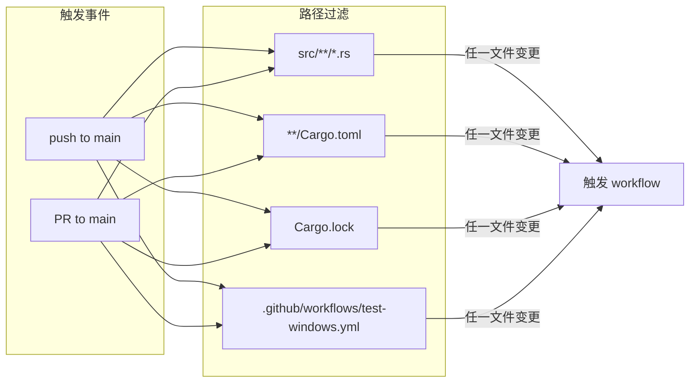
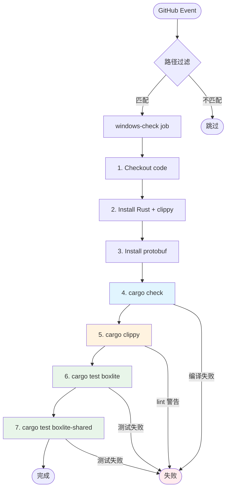
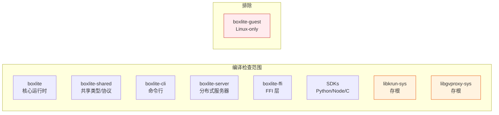
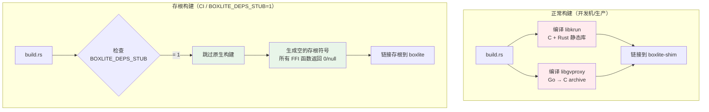
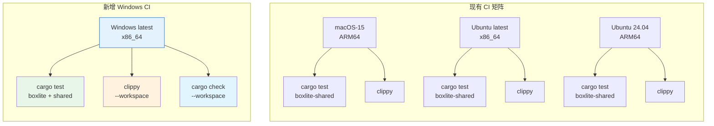

# Windows CI Workflow 详解

## 概述

文件：`.github/workflows/test-windows.yml`

BoxLite 的 Windows CI 工作流在 GitHub Actions 的 `windows-latest` runner 上运行编译检查、Clippy 静态分析和单元测试。由于 GitHub runner 不提供 WHPX/Hyper-V 虚拟化能力，工作流使用 `BOXLITE_DEPS_STUB=1` 环境变量将原生依赖（libkrun、libgvproxy）替换为存根实现，从而在无虚拟化硬件的环境中验证所有 Windows 平台代码。

---

## 触发条件



**说明：** 只有当 Rust 源码、Cargo 配置或工作流文件本身发生变更时才会触发，避免对文档、脚本等无关变更浪费 CI 资源。

---

## 环境变量

| 变量 | 值 | 用途 |
|------|-----|------|
| `CARGO_TERM_COLOR` | `always` | 在 CI 日志中保留颜色输出，便于阅读 |
| `CARGO_INCREMENTAL` | `0` | 禁用增量编译，确保 CI 构建的确定性和可重现性 |
| `BOXLITE_DEPS_STUB` | `1` | **关键**：启用依赖存根模式，跳过 libkrun/libgvproxy 的实际构建 |

---

## 工作流执行流程



---

## 各步骤详解

### Step 1: Checkout code

```yaml
- uses: actions/checkout@v5
```

标准代码检出。注意 BoxLite 使用 git submodule（`vendor/libkrun`），但在存根模式下不需要 `--recursive`，因为 `BOXLITE_DEPS_STUB=1` 会跳过 libkrun 构建。

### Step 2: Install Rust + clippy

```yaml
- uses: actions-rust-lang/setup-rust-toolchain@v1
  with:
    toolchain: stable
    components: clippy
```

安装 Rust stable 工具链和 clippy 组件。使用 `actions-rust-lang/setup-rust-toolchain`（与现有 CI 一致），该 action 会自动配置缓存。

### Step 3: Install protobuf

```yaml
- run: choco install protoc -y
```

通过 Chocolatey 安装 protobuf 编译器。BoxLite 使用 gRPC（tonic + prost），`boxlite-shared` crate 的 build.rs 需要 `protoc` 编译 `.proto` 文件。

### Step 4: Cargo check（编译验证）

```yaml
- run: cargo check --workspace --all-targets --exclude boxlite-guest
```

**目的：** 验证所有 `#[cfg(windows)]` 代码能在 Windows 目标上正确编译。

**关键细节：**
- `--workspace`：检查所有 crate（boxlite、boxlite-shared、boxlite-cli、boxlite-server、SDK 等）
- `--all-targets`：包括 lib、bin、test、bench 所有编译目标
- `--exclude boxlite-guest`：排除 guest agent（Linux-only，包含 `compile_error!` 宏）



### Step 5: Clippy（静态分析）

```yaml
- run: cargo clippy --workspace --all-targets --exclude boxlite-guest -- -D warnings
```

**目的：** 在 Windows 目标上运行 Clippy 静态分析，捕获 Windows 特有的 lint 问题。

**关键细节：**
- `-D warnings`：将所有警告视为错误（零容忍策略）
- 在 Windows 上运行 Clippy 能捕获 macOS/Linux CI 无法检测的问题，例如：
  - Windows 路径分隔符相关的 lint
  - `cfg(windows)` 代码块中的死代码或未使用变量
  - Windows API 调用的安全性问题

### Step 6-7: Unit tests（单元测试）

```yaml
- run: cargo test -p boxlite --no-default-features --lib      # 633 tests
- run: cargo test -p boxlite-shared --lib
```

**目的：** 验证平台无关的业务逻辑在 Windows 上行为一致。

**关键细节：**
- `--no-default-features`：禁用默认 feature（避免尝试链接 gvproxy 的 Go 代码）
- `--lib`：只运行库单元测试（不运行 integration tests 和 doc tests）
- 633 个测试覆盖：配置解析、镜像处理、卷管理、运行时逻辑等

---

## 存根机制原理



**存根的作用：**

| 依赖 | 正常模式 | 存根模式 |
|------|----------|----------|
| libkrun (VMM) | 编译 C/Rust 代码 → 静态库 | 空函数，返回默认值 |
| libgvproxy (网络) | 编译 Go 代码 → C archive | 空函数，返回默认值 |
| bubblewrap (沙箱) | 编译 C 代码 | 空函数 |
| e2fsprogs (ext4) | 编译 C 代码 | 空函数 |

存根模式下所有 FFI 调用都是空操作（no-op），因此：
- 编译验证通过（类型检查、借用检查、cfg 门控全部生效）
- 单元测试通过（不涉及实际 VM 创建）
- 集成测试无法运行（需要真实的虚拟化后端）

---

## 与现有 CI 的对比



| 维度 | 现有 CI (macOS/Linux) | 新增 Windows CI |
|------|----------------------|-----------------|
| Runner | macOS-15, ubuntu-latest, ubuntu-24.04-arm | windows-latest |
| 依赖构建 | 真实构建 libkrun 等 | 存根模式 |
| 测试范围 | boxlite-shared only | boxlite (633) + boxlite-shared |
| Clippy | 每个平台各跑一次 | Windows 目标跑一次 |
| 编译检查 | 隐含在 clippy/test 中 | 显式 `cargo check --workspace` |
| protobuf | apt/brew 安装 | choco 安装 |
| 共享配置 | 使用 config.yml | 独立（Windows 不在共享平台矩阵中） |
| 测试覆盖率 | llvm-cov + Codecov | 无（存根模式下覆盖率无意义） |

---

## 排除 boxlite-guest 的原因

`boxlite-guest` 是运行在 VM 内部的 agent 进程，只在 Linux 上运行：

```rust
// src/guest/src/main.rs
#[cfg(not(target_os = "linux"))]
compile_error!("BoxLite guest is Linux-only; build with a Linux target");
```

这个 `compile_error!` 宏会导致在任何非 Linux 平台（包括 Windows 和 macOS）上编译失败。这是有意为之的设计——guest agent 运行在 VM 内的 Linux 环境中，永远不会有 Windows 版本。

---

## E2E 集成测试（Self-Hosted Runner）

文件：`.github/workflows/test-windows-e2e.yml`

由于 GitHub Actions 托管 runner 不提供 WHPX/Hyper-V 支持，真实 VM E2E 测���需要在自托管 runner 上���行。

### 触发方式

手动触发（`workflow_dispatch`），支持以下参数：

| 参数 | 默认值 | 说明 |
|------|--------|------|
| `rounds` | 5 | 稳定性测试轮数 |
| `suite` | all | 测试套件：stability / functional / performance / all |
| `skip_perf` | false | 跳过性能测�� |

### 测试矩阵

同时在 Win10 和 Win11 self-hosted runner 上运行，使用 `fail-fast: false` 确保一台失败不影响另一台。

### Self-Hosted Runner 设置

在 Win10/Win11 开发机上部署 GitHub Actions self-hosted runner：

1. **硬件要求**：
   - Intel CPU（支持 VT-x 和 WHPX/Hyper-V）
   - 8GB+ RAM
   - 50GB+ 磁盘空间

2. **软件要求**：
   - Windows 10/11 Pro（需 Hyper-V 功能）
   - 启用 Hyper-V：`Enable-WindowsOptionalFeature -Online -FeatureName Microsoft-Hyper-V-All`
   - Rust toolchain（`rustup`）
   - protobuf compiler（`choco install protoc`）
   - Python 3.12+
   - Go 1.24+（用于 gvproxy 编译）

3. **安装 Runner**：
   ```powershell
   # 从 GitHub repo Settings → Actions → Runners → New self-hosted runner
   # 下载并配置 runner，添加标签：
   ./config.cmd --labels "windows,whpx,win10"   # 或 win11
   ```

4. **标签约定**��
   - `windows` — 平台标识
   - `whpx` — 表示支持 WHPX 虚拟化
   - `win10` / `win11` — 机器标识（用于矩阵选择）

### 测试脚本

使用 `scripts/test/cross_platform_e2e.py`，该脚本在所有平台（macOS/Win10/Win11）上行为一致，包含三个测��套件：

- **Stability**：反复 create/exec/stop/remove，验证可靠性
- **Functional**：13 个功能测试（exec、env、cwd、timeout、lifecycle 等）
- **Performance**：详细的阶段计时（cold exec、warm exec、stop）

测试结果以 JSON 格式保存并上传为 GitHub Actions artifact。

---

## 未来扩展方向

1. **Rust 缓存**：添加 `actions/cache` 或 `sccache` 加速编译���当前未加缓存是因为存根模式编译已经很快）
2. **交叉编译 guest**：可以添加 `--target x86_64-unknown-linux-musl` 来交叉编译 guest agent
3. **合并到共享配置**：当 Windows 成为正式支持平台后，将 `windows-latest` 加入 `config.yml` 的 platforms 矩阵
4. **E2E 自动触发**：当 self-hosted runner 稳定运行���，可在 PR 事件中自动触发 E2E 测试
