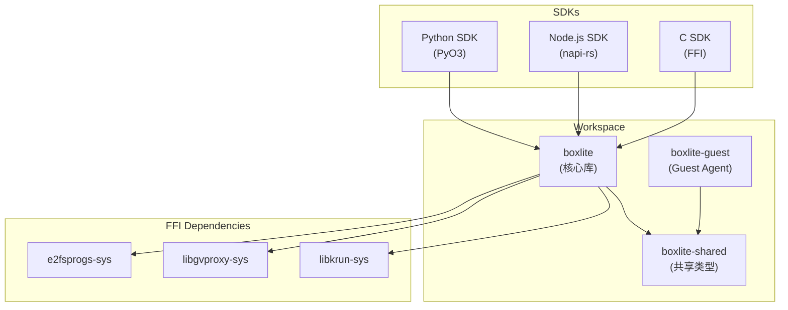
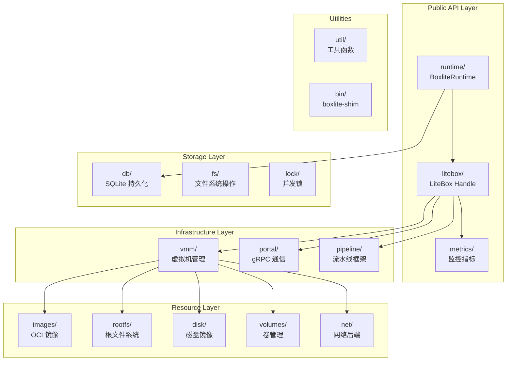
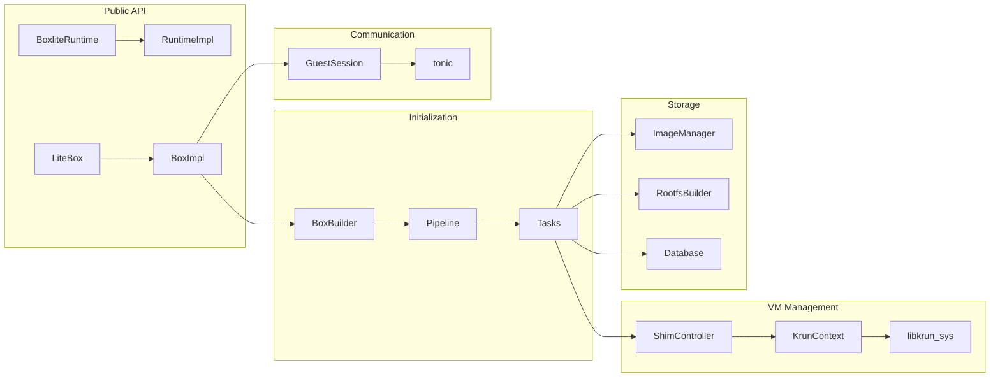
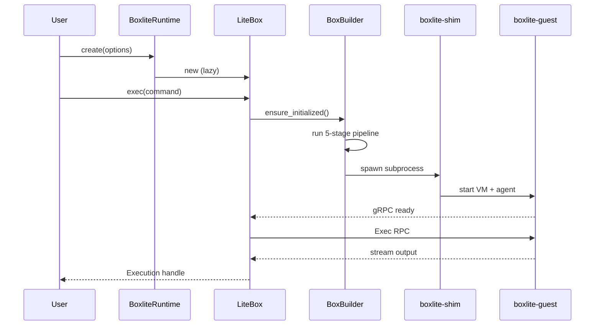

# BoxLite 代码结构详解

本文档详细介绍 BoxLite 项目的代码组织结构，帮助开发者快速理解和导航整个代码库。

## 目录

1. [项目概览](#1-项目概览)
2. [顶层目录结构](#2-顶层目录结构)
3. [boxlite 核心库](#3-boxlite-核心库)
4. [boxlite-shared 共享库](#4-boxlite-shared-共享库)
5. [guest Agent](#5-guest-agent)
6. [SDK 实现](#6-sdk-实现)
7. [FFI 依赖库](#7-ffi-依赖库)
8. [示例代码](#8-示例代码)
9. [构建与脚本](#9-构建与脚本)
10. [模块依赖关系](#10-模块依赖关系)
11. [关键文件索引](#11-关键文件索引)

---

## 1. 项目概览

BoxLite 采用 Rust Workspace 组织，包含多个 crate：



---

## 2. 顶层目录结构

```
boxlite/
├── Cargo.toml              # Workspace 配置
├── Cargo.lock              # 依赖锁定
├── Makefile                # 构建命令入口
├── CLAUDE.md               # AI 开发指南
├── CONTRIBUTING.md         # 贡献指南
├── README.md               # 项目说明
│
├── boxlite/                # 核心运行时库
├── boxlite-shared/         # Host/Guest 共享代码
├── guest/                  # VM 内 Guest Agent
│
├── sdks/                   # 语言 SDK
│   ├── python/             # Python SDK (PyO3, 稳定)
│   ├── node/               # Node.js SDK (napi-rs, WIP)
│   └── c/                  # C SDK (FFI, 早期)
│
├── examples/               # 示例代码
│   ├── python/             # Python 示例 (12个)
│   ├── node/               # Node.js 示例
│   └── c/                  # C 示例
│
├── docs/                   # 文档
├── scripts/                # 构建/发布脚本
└── .github/                # CI/CD 配置
```

---

## 3. boxlite 核心库

核心库位于 `boxlite/src/`，包含 19 个模块：

### 3.1 模块总览



### 3.2 各模块详解

#### runtime/ - 运行时入口

```
boxlite/src/runtime/
├── mod.rs              # 模块导出
├── core.rs             # BoxliteRuntime 主结构
├── rt_impl.rs          # 运行时内部实现
├── options.rs          # BoxliteOptions, BoxOptions 配置
├── types.rs            # BoxID, BoxInfo, BoxState 等类型
├── layout.rs           # FilesystemLayout 目录布局
├── constants.rs        # 常量定义
├── lock.rs             # 运行时级别锁
└── guest_rootfs.rs     # Guest rootfs 配置
```

**核心职责**:
- `BoxliteRuntime`: 主入口，管理全局状态
- `RuntimeImpl`: 实际实现，Box 创建/获取/列表/删除
- `FilesystemLayout`: `~/.boxlite/` 目录结构管理

#### litebox/ - Box 生命周期

```
boxlite/src/litebox/
├── mod.rs              # LiteBox 结构定义
├── box_impl.rs         # Box 内部实现 (SharedBoxImpl)
├── config.rs           # BoxConfig 配置
├── state.rs            # BoxState, BoxStatus 状态机
├── manager.rs          # BoxManager 管理器
├── exec.rs             # BoxCommand, Execution 执行
└── init/               # 懒初始化子系统
    ├── mod.rs          # BoxBuilder 导出
    └── tasks/          # 初始化任务
        ├── mod.rs
        ├── filesystem.rs   # 阶段1: 准备文件系统
        ├── rootfs.rs       # 阶段2: 准备 rootfs
        ├── vmm_spawn.rs    # 阶段3: 启动 VM
        ├── guest_connect.rs # 阶段4: 连接 Guest
        └── guest_init.rs   # 阶段5: 初始化 Guest
```

**核心职责**:
- `LiteBox`: 用户面向的 Box 句柄
- `BoxBuilder`: 5 阶段初始化流水线
- 懒初始化: 首次 API 调用时才启动 VM

#### vmm/ - 虚拟机管理

```
boxlite/src/vmm/
├── mod.rs              # VmmKind, InstanceSpec, FsShare 等
├── engine.rs           # Vmm trait 定义
├── factory.rs          # VmmFactory 工厂
├── registry.rs         # 引擎注册表
├── krun/               # libkrun 引擎实现
│   ├── mod.rs
│   ├── context.rs      # KrunContext FFI 封装
│   └── engine.rs       # Krun 引擎
└── controller/         # VM 控制器
    ├── mod.rs          # VmmController trait
    ├── shim.rs         # ShimController 实现
    ├── spawn.rs        # 进程启动逻辑
    └── handler.rs      # VmmHandler 运行时操作
```

**核心职责**:
- `Vmm` trait: 引擎抽象接口
- `ShimController`: 通过 boxlite-shim 子进程隔离 VM
- `KrunContext`: libkrun FFI 安全封装

#### portal/ - Host-Guest 通信

```
boxlite/src/portal/
├── mod.rs              # GuestSession 导出
├── connection.rs       # gRPC 连接管理
├── session.rs          # GuestSession 会话
└── interfaces/         # gRPC 客户端包装
    ├── mod.rs
    ├── guest.rs        # Guest 服务接口
    ├── container.rs    # Container 服务接口
    └── execution.rs    # Execution 服务接口
```

**核心职责**:
- `GuestSession`: Host 与 Guest 的 gRPC 会话
- 支持 Unix Socket 和 vsock 传输

#### images/ - OCI 镜像管理

```
boxlite/src/images/
├── mod.rs              # ImageManager 导出
├── manager.rs          # ImageManager 主逻辑
├── config.rs           # ContainerImageConfig
├── object.rs           # ImageObject 抽象
├── storage.rs          # 镜像存储
├── store.rs            # 镜像仓库
└── archive/            # 归档操作
    ├── mod.rs
    ├── extract.rs      # 解压层
    └── whiteout.rs     # 处理 whiteout 文件
```

**核心职责**:
- 从 Docker Registry 拉取 OCI 镜像
- 层解压和 whiteout 处理
- 镜像缓存管理

#### db/ - 持久化存储

```
boxlite/src/db/
├── mod.rs              # Database 主结构
├── schema.rs           # SQL Schema 定义
├── boxes.rs            # BoxStore 存储
└── images.rs           # ImageIndexStore 存储
```

**核心职责**:
- SQLite 数据库管理
- Box 配置/状态持久化
- 镜像索引缓存

#### disk/ - 磁盘镜像

```
boxlite/src/disk/
├── mod.rs              # 导出
├── image.rs            # Disk RAII 包装
├── ext4.rs             # Ext4 文件系统创建
├── qcow2.rs            # QCOW2 镜像操作
└── constants.rs        # 磁盘相关常量
```

**核心职责**:
- 创建 Ext4 文件系统
- QCOW2 Copy-on-Write 镜像

#### net/ - 网络后端

```
boxlite/src/net/
├── mod.rs              # NetworkBackend trait
├── constants.rs        # MAC 地址等常量
├── libslirp.rs         # libslirp 后端
└── gvproxy/            # gvisor-tap-vsock 后端
    ├── mod.rs
    └── backend.rs
```

**核心职责**:
- `NetworkBackend` trait 抽象
- gvproxy 用户态网络
- 端口映射支持

#### rootfs/ - 根文件系统

```
boxlite/src/rootfs/
├── mod.rs              # RootfsBuilder 导出
├── builder.rs          # Rootfs 构建器
├── operations.rs       # 底层操作
├── copy_mount.rs       # Copy-on-Write 挂载
└── dns.rs              # DNS 配置
```

**核心职责**:
- 从 OCI 层构建 rootfs
- 注入 Guest Agent 二进制
- 配置 `/etc/resolv.conf`

#### volumes/ - 卷管理

```
boxlite/src/volumes/
├── mod.rs              # 导出
├── guest_volume.rs     # GuestVolumeManager
└── container_volume.rs # ContainerVolumeManager
```

**核心职责**:
- virtiofs 共享目录
- 块设备挂载
- 容器绑定挂载

#### pipeline/ - 流水线框架

```
boxlite/src/pipeline/
├── mod.rs              # 导出
├── pipeline.rs         # Pipeline, PipelineExecutor
├── stage.rs            # Stage, ExecutionMode
├── task.rs             # PipelineTask trait
└── metrics.rs          # PipelineMetrics 指标
```

**核心职责**:
- 通用表驱动流水线
- 支持并行/顺序执行模式
- 用于 BoxBuilder 初始化

#### bin/ - 可执行文件

```
boxlite/src/bin/
└── shim.rs             # boxlite-shim 入口
```

**核心职责**:
- `boxlite-shim`: 隔离 libkrun 进程接管的子进程

---

## 4. boxlite-shared 共享库

Host 和 Guest 共享的代码：

```
boxlite-shared/src/
├── lib.rs              # 导出 + gRPC 类型
├── errors.rs           # BoxliteError, BoxliteResult
├── constants.rs        # 共享常量 (端口号等)
├── layout.rs           # 目录布局常量
└── transport.rs        # Transport (Unix/vsock/TCP)
```

**proto 文件** (生成 gRPC 代码):
```
boxlite-shared/proto/
└── boxlite/v1/
    ├── guest.proto     # Guest 服务定义
    ├── container.proto # Container 服务定义
    └── execution.proto # Execution 服务定义
```

---

## 5. guest Agent

运行在 VM 内的 Guest Agent：

```
guest/src/
├── main.rs             # 入口点，参数解析
├── layout.rs           # GuestLayout 目录结构
├── mounts.rs           # 必要的 tmpfs 挂载
├── network.rs          # 网络配置 (rtnetlink)
├── overlayfs.rs        # Overlayfs 挂载
│
├── service/            # gRPC 服务实现
│   ├── mod.rs
│   ├── server.rs       # GuestServer 主服务器
│   ├── guest.rs        # Guest 服务 (Init, Ping, Shutdown)
│   ├── container.rs    # Container 服务 (Init)
│   └── exec/           # Execution 服务 (Exec, Wait, Kill)
│       ├── mod.rs
│       ├── service.rs
│       └── exec_handle.rs
│
├── container/          # OCI 容器运行时
│   ├── mod.rs
│   ├── lifecycle.rs    # Container 生命周期
│   ├── command.rs      # ContainerCommand 构建器
│   ├── spec.rs         # OCI Spec 生成
│   ├── capabilities.rs # Linux capabilities
│   ├── start.rs        # 容器启动
│   ├── kill.rs         # 信号发送
│   ├── stdio.rs        # 标准 I/O 处理
│   └── console_socket.rs
│
└── storage/            # 存储挂载
    ├── mod.rs
    ├── virtiofs.rs     # virtiofs 挂载
    ├── block_device.rs # 块设备挂载
    ├── volume.rs       # 卷挂载统一入口
    ├── perms.rs        # 权限处理
    └── copy.rs         # 文件复制
```

---

## 6. SDK 实现

### 6.1 Python SDK

```
sdks/python/
├── Cargo.toml          # PyO3 配置
├── pyproject.toml      # Python 包配置
├── README.md           # API 文档
│
├── src/                # Rust 源码 (PyO3 绑定)
│   ├── lib.rs          # 模块入口
│   ├── runtime.rs      # BoxliteRuntime 绑定
│   ├── box_handle.rs   # Box 句柄绑定
│   ├── options.rs      # 配置选项绑定
│   ├── exec.rs         # 执行相关绑定
│   ├── metrics.rs      # 指标绑定
│   ├── info.rs         # BoxInfo 绑定
│   └── util.rs         # 工具函数
│
├── boxlite/            # Python 包
│   ├── __init__.py     # 导出
│   └── *.pyi           # 类型存根
│
└── tests/              # pytest 测试
```

### 6.2 Node.js SDK (WIP)

```
sdks/node/
├── Cargo.toml          # napi-rs 配置
├── package.json        # npm 包配置
├── tsconfig.json       # TypeScript 配置
├── README.md           # API 文档
│
├── src/                # Rust 源码 (napi-rs 绑定)
│   ├── lib.rs
│   ├── runtime.rs
│   ├── box_handle.rs
│   └── ...
│
└── lib/                # TypeScript 类型定义
```

### 6.3 C SDK

```
sdks/c/
├── Cargo.toml          # cbindgen 配置
├── build.rs            # 头文件生成
├── README.md           # API 文档
│
├── src/                # Rust 源码 (FFI 绑定)
│   └── lib.rs
│
└── include/            # C 头文件
    └── boxlite.h       # 生成的头文件
```

---

## 7. FFI 依赖库

```
boxlite/deps/
├── README.md           # 依赖说明
│
├── libkrun-sys/        # libkrun FFI 绑定
│   ├── Cargo.toml
│   ├── build.rs        # 构建脚本 (Homebrew/源码)
│   ├── src/lib.rs      # FFI 声明
│   └── vendor/         # 源码 (git submodule)
│       ├── libkrun/
│       └── libkrunfw/
│
├── libgvproxy-sys/     # gvproxy FFI 绑定
│   ├── Cargo.toml
│   ├── build.rs        # CGO 构建
│   ├── src/lib.rs      # FFI 声明
│   └── vendor/         # 源码 (git submodule)
│
└── e2fsprogs-sys/      # e2fsprogs FFI 绑定
    ├── Cargo.toml
    ├── build.rs
    └── src/lib.rs
```

---

## 8. 示例代码

```
examples/python/
├── README.md                   # 示例说明
├── simplebox_example.py        # 基础用法
├── codebox_example.py          # 代码执行沙箱
├── browserbox_example.py       # 浏览器自动化
├── computerbox_example.py      # 完整桌面环境
├── interactivebox_example.py   # 交互式会话
├── lifecycle_example.py        # 生命周期管理
├── list_boxes_example.py       # 列出所有 Box
├── detach_example.py           # 分离模式
├── cross_process_example.py    # 跨进程共享
├── native_example.py           # 原生镜像
└── llm_driven_simplebox_example.py  # LLM 驱动示例
```

---

## 9. 构建与脚本

### 9.1 Makefile 目标

```bash
make setup          # 安装依赖 (auto-detect OS)
make dev:python     # 本地构建 Python SDK
make test           # 运行 Rust 测试
make fmt            # 格式化代码
make clippy         # Lint 检查
make dist:python    # 构建可发布的 wheel
make clean          # 清理构建产物
```

### 9.2 脚本目录

```
scripts/
├── setup-macos.sh      # macOS 依赖安装
├── setup-linux.sh      # Linux 依赖安装
├── build-python.sh     # Python SDK 构建
├── build-node.sh       # Node.js SDK 构建
└── ci/                 # CI 相关脚本
```

---

## 10. 模块依赖关系

### 10.1 核心依赖图



### 10.2 数据流向



---

## 11. 关键文件索引

### 11.1 入口点

| 文件 | 说明 |
|------|------|
| `boxlite/src/lib.rs` | 核心库入口 |
| `boxlite/src/runtime/core.rs` | BoxliteRuntime 定义 |
| `boxlite/src/litebox/mod.rs` | LiteBox 定义 |
| `boxlite/src/bin/shim.rs` | boxlite-shim 入口 |
| `guest/src/main.rs` | boxlite-guest 入口 |

### 11.2 核心实现

| 文件 | 说明 |
|------|------|
| `boxlite/src/litebox/init/mod.rs` | BoxBuilder 流水线 |
| `boxlite/src/vmm/krun/context.rs` | KrunContext FFI 封装 |
| `boxlite/src/vmm/krun/engine.rs` | Krun 引擎实现 |
| `boxlite/src/vmm/controller/shim.rs` | ShimController |
| `boxlite/src/portal/session.rs` | GuestSession |

### 11.3 Guest Agent

| 文件 | 说明 |
|------|------|
| `guest/src/service/server.rs` | GuestServer |
| `guest/src/container/lifecycle.rs` | Container 生命周期 |
| `guest/src/storage/volume.rs` | 卷挂载 |

### 11.4 配置与类型

| 文件 | 说明 |
|------|------|
| `boxlite/src/runtime/options.rs` | BoxliteOptions, BoxOptions |
| `boxlite/src/runtime/types.rs` | BoxID, BoxInfo, BoxState |
| `boxlite/src/vmm/mod.rs` | InstanceSpec, FsShare |
| `boxlite-shared/src/errors.rs` | BoxliteError |
| `boxlite-shared/src/transport.rs` | Transport |

### 11.5 数据库

| 文件 | 说明 |
|------|------|
| `boxlite/src/db/mod.rs` | Database 主结构 |
| `boxlite/src/db/schema.rs` | SQL Schema |
| `boxlite/src/db/boxes.rs` | BoxStore |

---

## 附录 A: 目录布局 (~/.boxlite/)

```
~/.boxlite/
├── lock                    # 运行时锁文件
├── db/
│   └── boxlite.db          # SQLite 数据库
├── images/
│   └── <digest>/           # OCI 镜像层
├── boxes/
│   └── <box_id>/
│       ├── config.json     # Box 配置
│       ├── rootfs/         # 根文件系统
│       ├── work/           # overlayfs work
│       ├── upper/          # overlayfs upper
│       └── disk.qcow2      # 持久化磁盘
├── logs/
│   └── boxlite.log         # 运行日志
└── cache/
    └── guest-rootfs/       # Guest rootfs 缓存
```

---

## 附录 B: 环境变量

| 变量 | 说明 | 默认值 |
|------|------|--------|
| `BOXLITE_HOME` | 数据目录 | `~/.boxlite` |
| `RUST_LOG` | 日志级别 | `info` |
| `LIBKRUN_SYS_STUB` | 跳过 libkrun 构建 | - |
| `LIBGVPROXY_SYS_STUB` | 跳过 gvproxy 构建 | - |

---

## 附录 C: 构建依赖

### macOS

```bash
# 运行 setup 脚本自动安装所有依赖
make setup

# 或手动安装
brew install musl-cross      # 交叉编译工具链 (编译 guest)
brew install dtc             # Device Tree Compiler (libkrun 构建)
brew install lld llvm        # LLVM 工具链 (bindgen)
brew install dylibbundler    # 动态库打包
brew install protobuf        # gRPC 编译
brew install go              # gvproxy 构建

# 注意: libkrun 和 libkrunfw 从 vendored 源码自动构建
# 不需要安装 libvirt 或 qemu
```

### Linux

```bash
# 初始化 git submodules (必须)
git submodule update --init --recursive

# libkrun 自动从 vendor/ 源码构建
# libkrunfw 默认下载预编译的 .so (节省 ~20 分钟)
# 设置 BOXLITE_BUILD_LIBKRUNFW=1 从源码构建
```

### 构建说明

| 依赖 | 来源 | 说明 |
|------|------|------|
| libkrun | vendor/libkrun | 从源码构建 |
| libkrunfw | 预编译下载 | macOS: kernel.c → 本地编译; Linux: .so 直接下载 |
| libgvproxy | gvproxy-bridge/ | CGO 编译 Go 代码 |
| e2fsprogs | vendor/ | 编译 mke2fs 二进制 |
