# Understanding KVM

A visual introduction to Linux KVM (Kernel-based Virtual Machine), using BoxLite's
[planned native VMM](README.md). The main example is an x86_64 Linux VM with
2 vCPUs, 512 MiB RAM and a virtual disk; arm64 differences follow the walkthrough.
M1 currently provides native x86_64 VM creation and RAM registration in
[`boxlite-hypervisor`](../../../src/hypervisor/README.md); vCPU execution and
Linux boot follow. Boxes currently use libkrun.

## 1. Architecture

Show architecture diagram

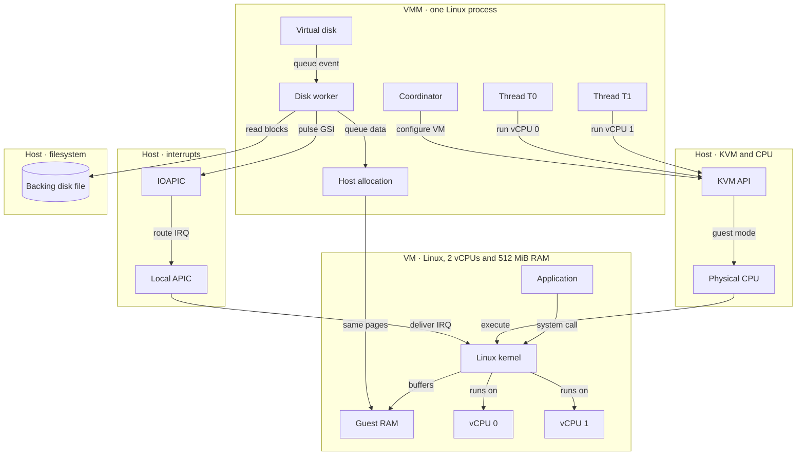

## 2. How it works

### 2.1 Open KVM and create an empty VM

Show sequence diagram

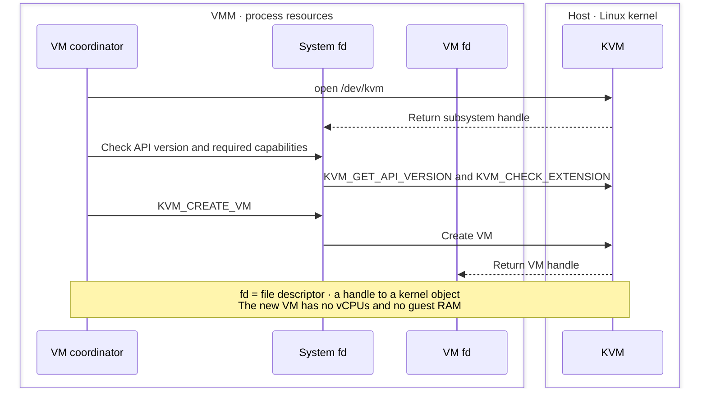

### 2.2 Prepare x86 interrupt controllers

Show sequence diagram

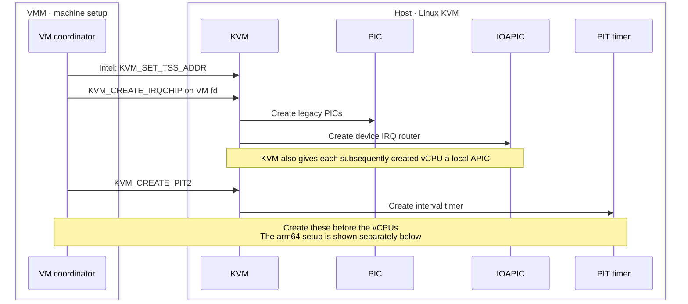

### 2.3 Map RAM and load Linux

See the [side-by-side view of guest ranges, KVM slots and host allocations](memory.md#1-architecture).

Show sequence diagram

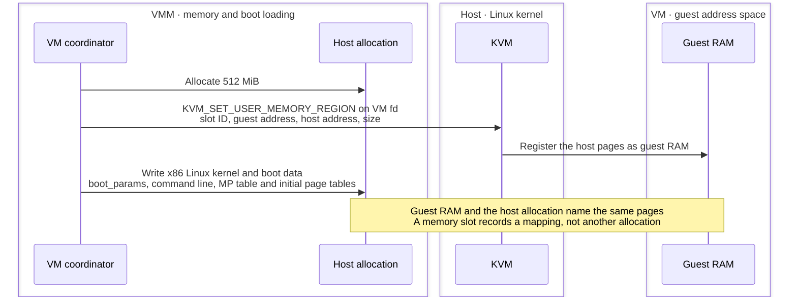

### 2.4 Create two vCPUs and their run buffers

Show sequence diagram

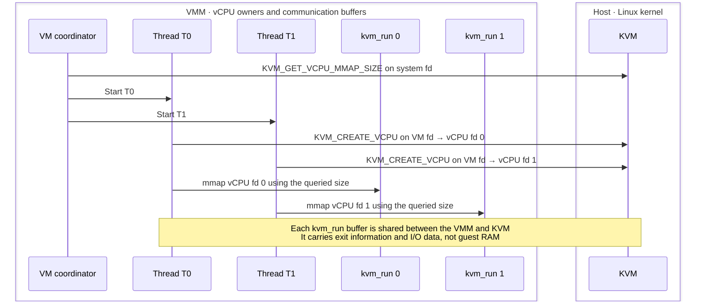

### 2.5 Boot the x86 Linux guest

Show sequence diagram

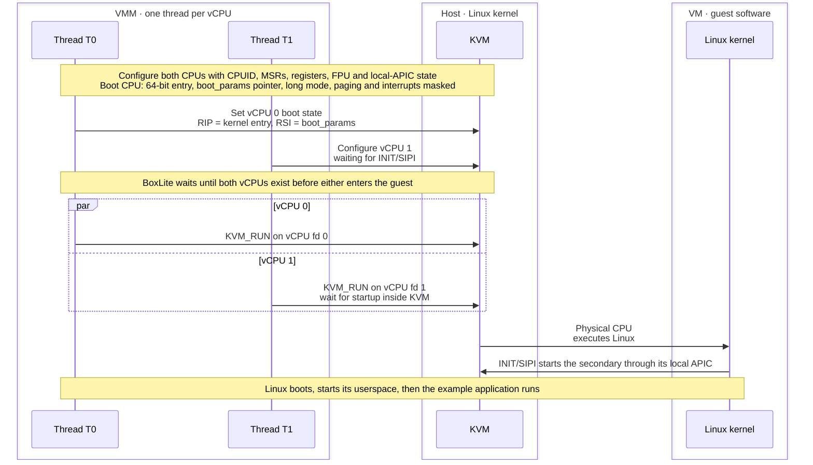

### 2.6 A file read reaches a device register

Show sequence diagram

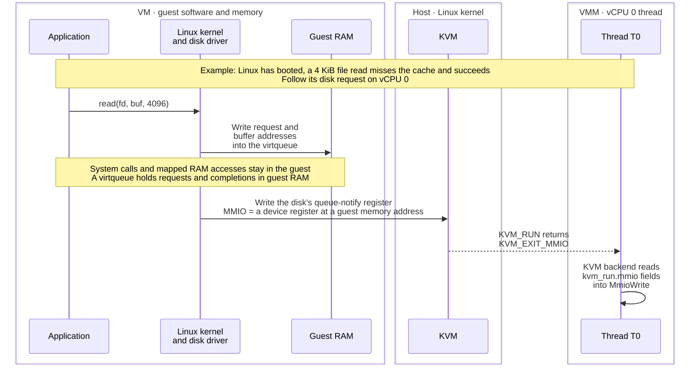

### 2.7 Resume Linux while the worker reads the disk

Show sequence diagram

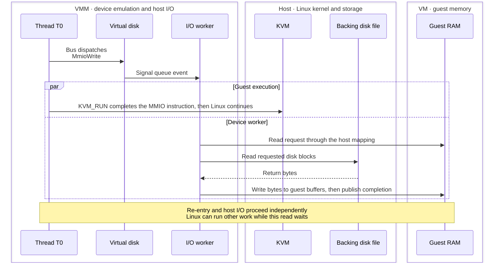

### 2.8 KVM delivers the disk interrupt

Show sequence diagram

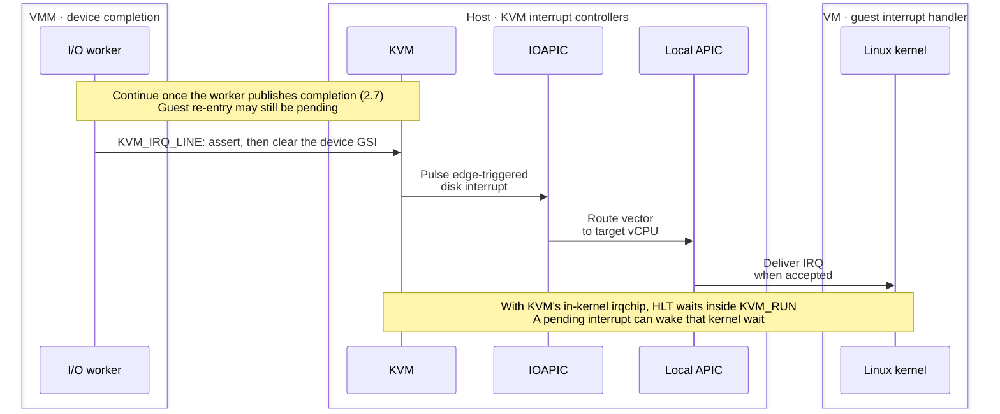

### 2.9 Linux completes the file read

Show sequence diagram

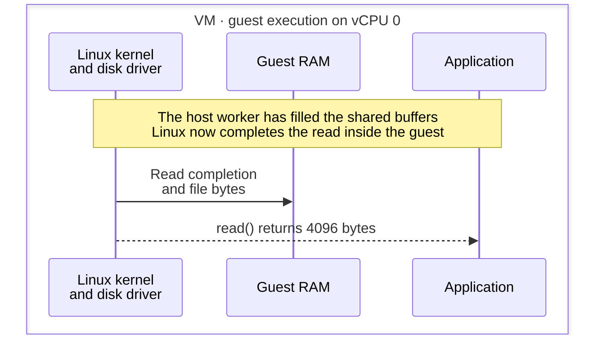

### 2.10 Stop the vCPU threads

Show sequence diagram

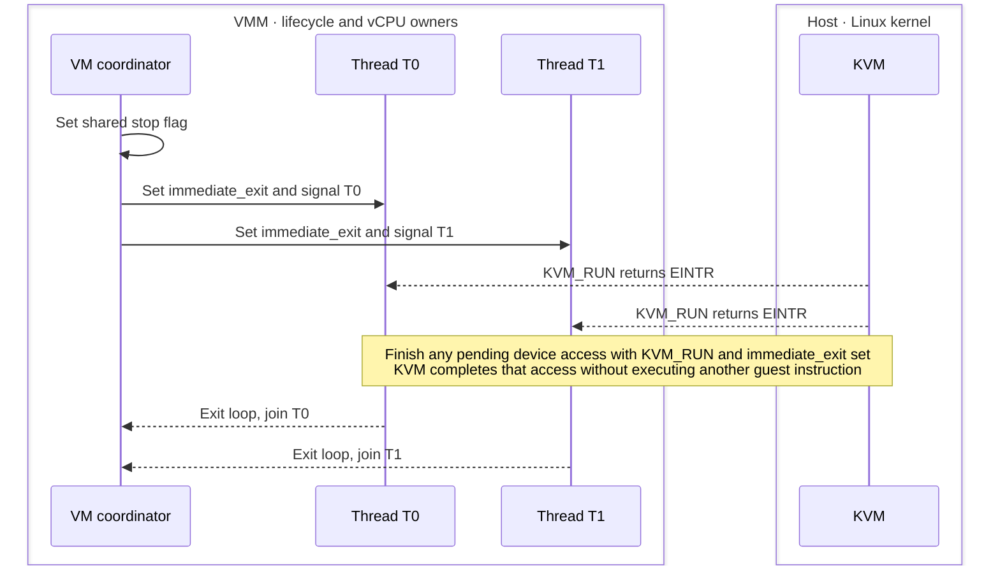

### 2.11 Release the mappings and descriptors

Show sequence diagram

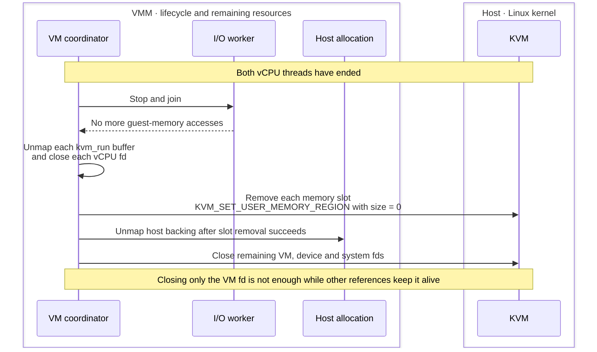

## 3. What changes on arm64

### 3.1 Configure the GIC and initialize it after the vCPUs exist

Show sequence diagram

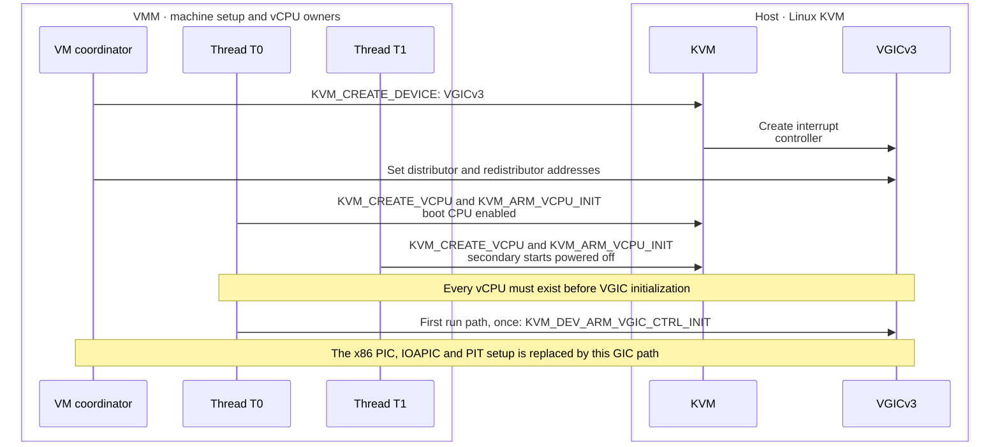

### 3.2 Use the arm64 boot protocol and let KVM start secondaries

Show sequence diagram

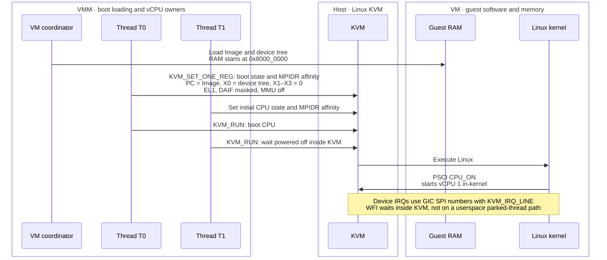

## BoxLite implementation reference

[Crate responsibilities](README.md#architecture) ·
[Backend API contract](README.md#hypervisor-backend-interface) ·
[Exit decoding](README.md#exit-contract) ·
[Memory layout](memory.md) ·
[Boot registers and boot data](README.md#boot-path) ·
[Threads and lifecycle](README.md#threads) ·
[KVM API](https://docs.kernel.org/virt/kvm/api.html) ·
[VGICv3 initialization](https://docs.kernel.org/virt/kvm/devices/arm-vgic-v3.html) ·
[Firecracker x86 vCPU setup](https://github.com/firecracker-microvm/firecracker/blob/68698adfee9b252df130b7a98e3ba04eb81f0f54/src/vmm/src/arch/x86_64/vcpu.rs#L222-L301)
