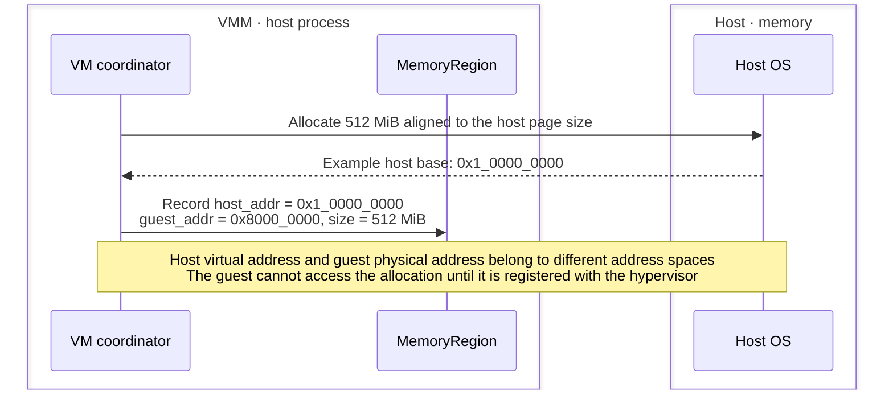
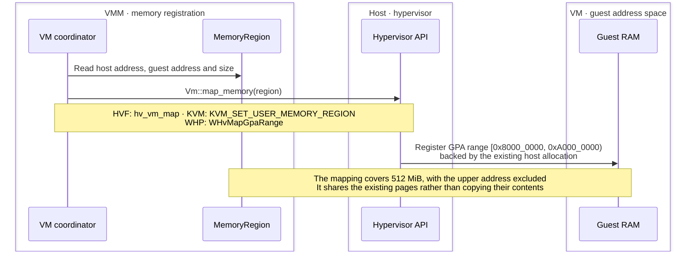
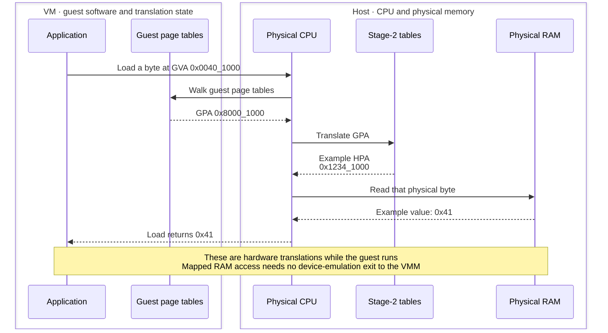
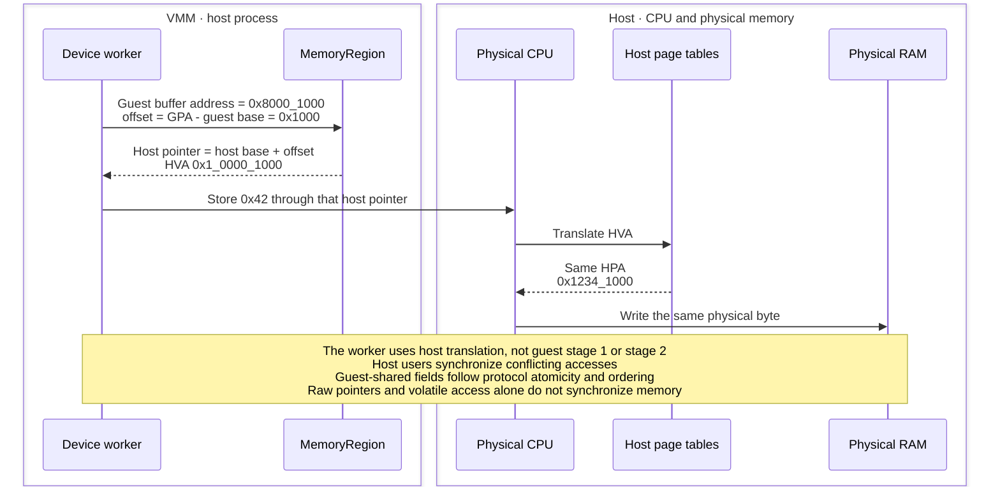
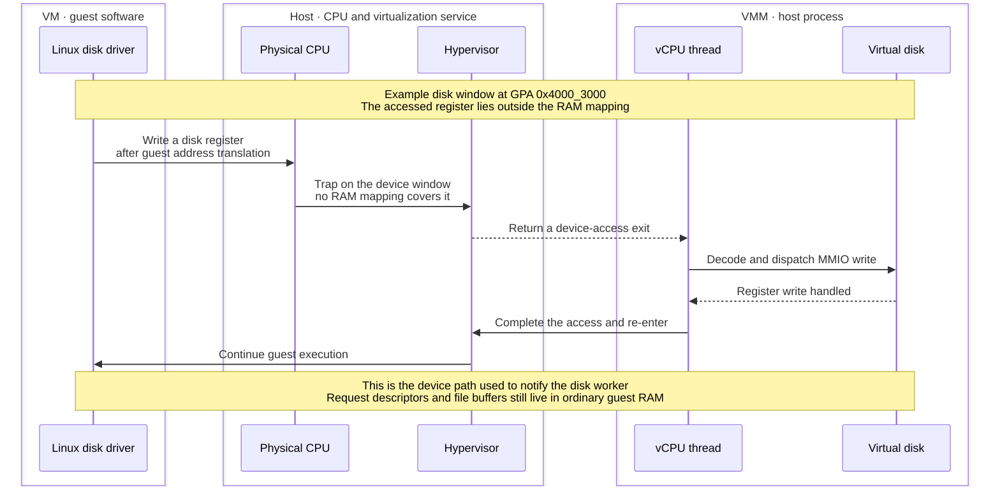
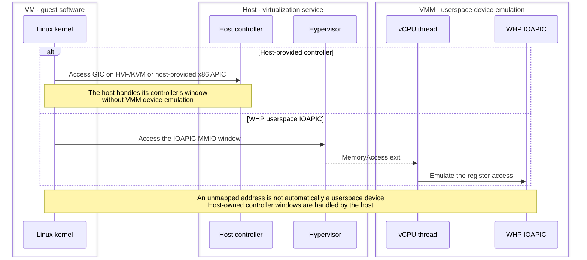
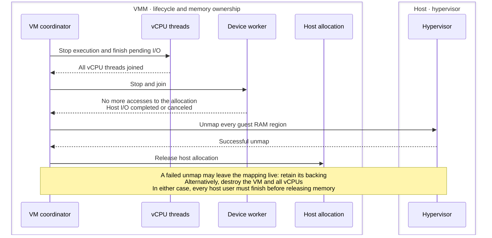
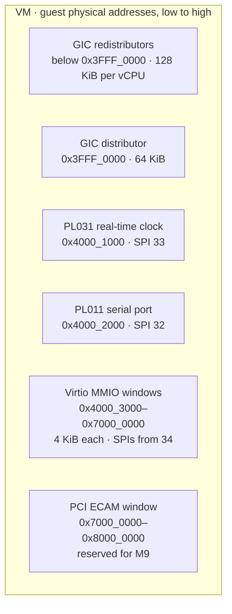
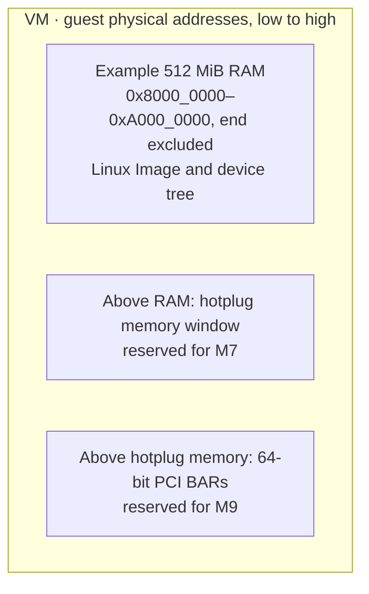

# Understanding guest memory

A visual introduction to memory in the [planned native VMM](README.md).
The architecture view starts with a small x86_64 KVM example; the walkthrough
then follows one byte through an arm64 VM with 512 MiB RAM. Example addresses
are illustrative; the final address-map diagrams show BoxLite's planned layout.

## 1. Architecture

Two mapped RAM regions provide 12 KiB of guest RAM on a host with 4 KiB pages.
Program, data and stack labels illustrate how the guest could use that RAM.
Range endpoints below are inclusive; the host column shows virtual addresses.

<details>
<summary>Show architecture diagram</summary>

```text
                  WHOLE EXAMPLE: TWO MAPPED RAM REGIONS

Guest physical addresses          KVM mapping   Host virtual addresses
                                                BoxLite-owned allocations

0x0000  +---------------------+
        | Unmapped            |
0x0FFF  +---------------------+

0x1000  +---------------------+                 +---------------------+ 0x70000000
        | Program             |     slot 0      | Program bytes       |
        | 4 KiB               |    <=======>    | 4 KiB allocation    |
0x1FFF  +---------------------+                 +---------------------+ 0x70000FFF

0x2000  +---------------------+                 +---------------------+ 0x90000000
        | Data                |     slot 1      | 8 KiB allocation    |
0x2010  | One byte: 00        |    <=======>    | Same byte: 00       | 0x90000010
        | ...                 |                 | ...                 |
        | Stack space         |                 |                     |
0x3FFF  +---------------------+                 +---------------------+ 0x90001FFF

0x4000  +---------------------+
        | Remaining address   |
        | space: unmapped     |
        +---------------------+
```

</details>

`<=======>` joins two address views of the **same backing bytes**.

- **Slot 0** maps the 4 KiB program region. **Slot 1** maps the entire 8 KiB
  data/stack region; a slot can cover several pages.
- Guest byte `0x2010` is `0x10` bytes into slot 1, so its host address is
  `0x90000000 + 0x10 = 0x90000010`. Both labels identify the same byte.
- The guest regions are adjacent even though the host allocations are far
  apart. Their host physical pages may also be scattered.

[`MemorySlots`](../../../src/hypervisor/src/kvm/memory.rs) keeps the slot
records outside guest RAM. Its vector index is the slot ID; `None` marks an
unused slot. Records change only after the KVM ioctl succeeds. BoxLite keeps
the backing allocations alive under the
[memory lifetime contract](../../../src/hypervisor/src/vm.rs).

### 1.1 The same RAM through each project's structures

Each drawing puts the project's trimmed structure code above the two mappings.
Names and field types come from the linked revisions; visibility, attributes and
unrelated fields are omitted. These are schematic excerpts, not compilable code
or the projects' default boot layouts.

All addresses and slot IDs reuse the illustrative example above. Only the two
mapped regions are repeated; the unmapped gaps are unchanged. Structs and slot
records live in the host process, outside guest RAM. Arrows show relationships,
not a copy of the bytes.

#### BoxLite PR1: caller-owned RAM and a private slot table

<details>
<summary>Show BoxLite memory structures</summary>

```text
HOST PROCESS: selected structure fields
+----------------------------------------------------------------+
| struct MemoryRegion {                                          |
|     guest_addr: u64,                                           |
|     host_addr: NonNull<u8>,                                    |
|     size: usize,                                               |
| }                                                              |
| struct KvmVm {                                                 |
|     fd: VmFd,                                                  |
|     slots: Mutex<MemorySlots>,                                 |
| }                                                              |
| struct MemorySlots {                                           |
|     regions: Vec<Option<kvm_userspace_memory_region>>,         |
|     page_size: usize,                                          |
| }                                                              |
+----------------------------------------------------------------+
        |
        | MemoryRegion describes caller-owned RAM.
        | slots.regions[index] records the KVM mapping; index = slot.
        v

GUEST PHYSICAL          SLOT METADATA                 HOST VIRTUAL / RAM
0x1000 +--------------+ regions[0] = Some(...)       +--------------+ 0x70000000
       | Program      | <========= slot 0 =========> | Same bytes   |
       | 4 KiB        |                              | 4 KiB        |
0x1FFF +--------------+                              +--------------+ 0x70000FFF

0x2000 +--------------+ regions[1] = Some(...)       +--------------+ 0x90000000
       | Data / stack | <========= slot 1 =========> | Same bytes   |
       | 8 KiB        |                              | 8 KiB        |
0x3FFF +--------------+                              +--------------+ 0x90001FFF
```

</details>

The caller retains both allocations. An unused entry is `None`; registration
records `Some(...)` only after the ioctl succeeds. Neither `MemoryRegion` nor
`MemorySlots` owns the bytes.

[Descriptor: memory.rs:14–22](../../../src/hypervisor/src/memory.rs#L14-L22) ·
[VM: kvm/vm.rs:17–20](../../../src/hypervisor/src/kvm/vm.rs#L17-L20) ·
[Slots: kvm/memory.rs:13–61](../../../src/hypervisor/src/kvm/memory.rs#L13-L61)

<details>
<summary>Firecracker: each region carries its slot layout</summary>

```text
HOST PROCESS: selected structure fields
+----------------------------------------------------------------+
| struct GuestRegionMmapExt {                                    |
|     inner: GuestRegionMmap,                                    |
|     region_type: GuestRegionType,                              |
|     slot_from: u32,                                            |
|     slot_size: usize,                                          |
|     plugged: Mutex<BitVec>,                                    |
| }                                                              |
+----------------------------------------------------------------+
        |
        | inner keeps each host mapping alive.
        | slot_from + slot_size describe the region's KVM slots.
        v

GUEST PHYSICAL          SLOT METADATA                 HOST VIRTUAL / RAM
0x1000 +--------------+ slot_from = 0                +--------------+ 0x70000000
       | Program      | <========= slot 0 =========> | Same bytes   |
       | 4 KiB        |                              | 4 KiB        |
0x1FFF +--------------+                              +--------------+ 0x70000FFF

0x2000 +--------------+ slot_from = 1                +--------------+ 0x90000000
       | Data / stack | <========= slot 1 =========> | Same bytes   |
       | 8 KiB        |                              | 8 KiB        |
0x3FFF +--------------+                              +--------------+ 0x90001FFF
```

For these ordinary DRAM regions, each region uses one slot: `slot_size` is
4 KiB or 8 KiB. Hotplug regions can span several slots; `plugged` tracks which
are registered.

[Ownership: memory.rs:434–438](https://github.com/firecracker-microvm/firecracker/blob/68698adfee9b252df130b7a98e3ba04eb81f0f54/src/vmm/src/vstate/memory.rs#L434-L438) ·
[Fields: memory.rs:505–516](https://github.com/firecracker-microvm/firecracker/blob/68698adfee9b252df130b7a98e3ba04eb81f0f54/src/vmm/src/vstate/memory.rs#L505-L516) ·
[DRAM slots: memory.rs:651–661](https://github.com/firecracker-microvm/firecracker/blob/68698adfee9b252df130b7a98e3ba04eb81f0f54/src/vmm/src/vstate/memory.rs#L651-L661)

</details>

<details>
<summary>libkrun: RAM collection and sequential slot assignment</summary>

```text
HOST PROCESS: selected structure fields
+----------------------------------------------------------------+
| struct Vmm {                                                   |
|     guest_memory: GuestMemoryMmap,                             |
| }                                                              |
| struct Vm {                                                    |
|     fd: VmFd,                                                  |
|     next_mem_slot: u32,                                        |
| }                                                              |
+----------------------------------------------------------------+
        |
        | Vmm.guest_memory retains the two host mappings.
        | Vm assigns next_mem_slot during registration; then increments it.
        v

GUEST PHYSICAL          SLOT METADATA                 HOST VIRTUAL / RAM
0x1000 +--------------+ first assigned slot          +--------------+ 0x70000000
       | Program      | <========= slot 0 =========> | Same bytes   |
       | 4 KiB        |                              | 4 KiB        |
0x1FFF +--------------+                              +--------------+ 0x70000FFF

0x2000 +--------------+ second assigned slot         +--------------+ 0x90000000
       | Data / stack | <========= slot 1 =========> | Same bytes   |
       | 8 KiB        |                              | 8 KiB        |
0x3FFF +--------------+                              +--------------+ 0x90001FFF
```

Starting from slot 0, registering these two regions leaves `next_mem_slot`
at 2. The RAM collection belongs to `Vmm`; the Linux VM adapter submits the
registrations.

[RAM owner: lib.rs:195–200](https://github.com/libkrun/libkrun/blob/e12b9b3780ffa8df9f3e1797b217d13453479167/src/vmm/src/lib.rs#L195-L200) ·
[VM fields: vstate.rs:489–492](https://github.com/libkrun/libkrun/blob/e12b9b3780ffa8df9f3e1797b217d13453479167/src/vmm/src/linux/vstate.rs#L489-L492) ·
[Registration: vstate.rs:634–750](https://github.com/libkrun/libkrun/blob/e12b9b3780ffa8df9f3e1797b217d13453479167/src/vmm/src/linux/vstate.rs#L634-L750)

</details>

<details>
<summary>Cloud Hypervisor: memory views and reusable slots</summary>

```text
HOST PROCESS: selected structure fields
+----------------------------------------------------------------+
| struct MemoryManager {                                         |
|     boot_guest_memory: GuestMemoryMmap,                        |
|     guest_memory: GuestMemoryAtomic<GuestMemoryMmap>,          |
|     next_memory_slot: Arc<AtomicU32>,                          |
|     memory_slot_free_list: Arc<Mutex<Vec<u32>>>,               |
|     guest_ram_mappings: Vec<GuestRamMapping>,                  |
| }                                                              |
| struct GuestRamMapping {                                       |
|     slot: u32,                                                 |
|     gpa: u64,                                                  |
|     size: u64,                                                 |
| }                                                              |
+----------------------------------------------------------------+
        |
        | The memory views retain access to the host mappings.
        | guest_ram_mappings records slot, GPA and size for each mapping.
        v

GUEST PHYSICAL          SLOT METADATA                 HOST VIRTUAL / RAM
0x1000 +--------------+ mapping.slot = 0             +--------------+ 0x70000000
       | Program      | <========= slot 0 =========> | Same bytes   |
       | 4 KiB        |                              | 4 KiB        |
0x1FFF +--------------+                              +--------------+ 0x70000FFF

0x2000 +--------------+ mapping.slot = 1             +--------------+ 0x90000000
       | Data / stack | <========= slot 1 =========> | Same bytes   |
       | 8 KiB        |                              | 8 KiB        |
0x3FFF +--------------+                              +--------------+ 0x90001FFF
```

Each `GuestRamMapping` also records its zone and backing-file offset.
`memory_slot_free_list` allows slot IDs to be reused; these records are
separate from the RAM allocations.

[Fields: memory_manager.rs:187–245](https://github.com/cloud-hypervisor/cloud-hypervisor/blob/c24527002473dec810ef98fe3befb558ff2d5ede/vmm/src/memory_manager.rs#L187-L245)

</details>

<details>
<summary>crosvm: initial RAM plus owned dynamic mappings</summary>

```text
HOST PROCESS: selected structure fields
+-------------------------------------------------------------------+
| struct KvmVm {                                                    |
|     guest_mem: GuestMemory,                                       |
|     mem_regions: Mutex<BTreeMap<MemSlot, Box<dyn MappedRegion>>>, |
|     mem_slot_gaps: Mutex<BinaryHeap<Reverse<MemSlot>>>,           |
| }                                                                 |
| struct GuestMemory {                                              |
|     regions: Arc<[MemoryRegion]>,                                 |
| }                                                                 |
| struct MemoryRegion {                                             |
|     mapping: MemoryMapping,                                       |
|     guest_base: GuestAddress,                                     |
| }                                                                 |
+-------------------------------------------------------------------+
        |
        | For initial RAM, guest_mem.regions retains the mappings.
        | Each initial region is registered with its enumerated slot ID.
        v

GUEST PHYSICAL          SLOT METADATA                 HOST VIRTUAL / RAM
0x1000 +--------------+ initial region 0             +--------------+ 0x70000000
       | Program      | <========= slot 0 =========> | Same bytes   |
       | 4 KiB        |                              | 4 KiB        |
0x1FFF +--------------+                              +--------------+ 0x70000FFF

0x2000 +--------------+ initial region 1             +--------------+ 0x90000000
       | Data / stack | <========= slot 1 =========> | Same bytes   |
       | 8 KiB        |                              | 8 KiB        |
0x3FFF +--------------+                              +--------------+ 0x90001FFF
```

The drawing shows initial RAM. Later additions move a `Box<dyn MappedRegion>`
into `mem_regions`; removal returns it. `mem_slot_gaps` stores reusable IDs.
The dynamic map is not the container for initial RAM.

[VM fields: kvm/mod.rs:322–331](https://github.com/google/crosvm/blob/4c88690f44c382e34bdff7ad18ca10f8f9de6aa2/hypervisor/src/kvm/mod.rs#L322-L331) ·
[Initial slots: kvm/mod.rs:373–389](https://github.com/google/crosvm/blob/4c88690f44c382e34bdff7ad18ca10f8f9de6aa2/hypervisor/src/kvm/mod.rs#L373-L389) ·
[RAM: guest_memory.rs:208–218](https://github.com/google/crosvm/blob/4c88690f44c382e34bdff7ad18ca10f8f9de6aa2/vm_memory/src/guest_memory.rs#L208-L218) ·
[Collection: guest_memory.rs:288–292](https://github.com/google/crosvm/blob/4c88690f44c382e34bdff7ad18ca10f8f9de6aa2/vm_memory/src/guest_memory.rs#L288-L292) ·
[Added regions: kvm/mod.rs:738–802](https://github.com/google/crosvm/blob/4c88690f44c382e34bdff7ad18ca10f8f9de6aa2/hypervisor/src/kvm/mod.rs#L738-L802)

</details>

<details>
<summary>Alioth: shared pages and a range-to-slot map</summary>

```text
HOST PROCESS: selected structure fields
+----------------------------------------------------------------+
| struct ArcMemPages {                                           |
|     addr: usize,                                               |
|     size: usize,                                               |
|     _inner: Arc<MemPages>,                                     |
| }                                                              |
| struct MemSlots {                                              |
|     next_id: u32,                                              |
|     mapped: HashMap<(u64, u64), u32>,                          |
| }                                                              |
+----------------------------------------------------------------+
        |
        | _inner shares ownership of the host mapping.
        | MemSlots.mapped uses (guest base, size) as its key.
        v

GUEST PHYSICAL          SLOT METADATA                 HOST VIRTUAL / RAM
0x1000 +--------------+ (0x1000, 0x1000) -> 0        +--------------+ 0x70000000
       | Program      | <========= slot 0 =========> | Same bytes   |
       | 4 KiB        |                              | 4 KiB        |
0x1FFF +--------------+                              +--------------+ 0x70000FFF

0x2000 +--------------+ (0x2000, 0x2000) -> 1        +--------------+ 0x90000000
       | Data / stack | <========= slot 1 =========> | Same bytes   |
       | 8 KiB        |                              | 8 KiB        |
0x3FFF +--------------+                              +--------------+ 0x90001FFF
```

The RAM address-space collection holds `ArcMemPages`. `KvmVm` separately
protects `MemSlots` with a mutex; the slot map does not own the backing pages.

[RAM ownership: mapped.rs:43–71](https://github.com/google/alioth/blob/9d39a5d288fcd8630a24c5e762e4c31e97f1840f/alioth/src/mem/mapped.rs#L43-L71) ·
[Slot map: vm.rs:443–452](https://github.com/google/alioth/blob/9d39a5d288fcd8630a24c5e762e4c31e97f1840f/alioth/src/hv/kvm/vm/vm.rs#L443-L452)

</details>

<details>
<summary>Dragonball / Kata: address-space manager</summary>

```text
HOST PROCESS: selected structure fields
+----------------------------------------------------------------+
| struct AddressSpaceMgr {                                       |
|     address_space: Option<AddressSpace>,                       |
|     vm_as: Option<GuestAddressSpaceImpl>,                      |
|     base_to_slot: Arc<Mutex<HashMap<u64, u32>>>,               |
|     numa_nodes: BTreeMap<u32, NumaNode>,                       |
| }                                                              |
+----------------------------------------------------------------+
        |
        | vm_as holds the guest-memory view and its host mappings.
        | base_to_slot maps the start GPA of each region to its slot.
        v

GUEST PHYSICAL          SLOT METADATA                 HOST VIRTUAL / RAM
0x1000 +--------------+ base_to_slot[0x1000]=0       +--------------+ 0x70000000
       | Program      | <========= slot 0 =========> | Same bytes   |
       | 4 KiB        |                              | 4 KiB        |
0x1FFF +--------------+                              +--------------+ 0x70000FFF

0x2000 +--------------+ base_to_slot[0x2000]=1       +--------------+ 0x90000000
       | Data / stack | <========= slot 1 =========> | Same bytes   |
       | 8 KiB        |                              | 8 KiB        |
0x3FFF +--------------+                              +--------------+ 0x90001FFF
```

`GuestAddressSpaceImpl` is `Arc<GuestMemoryMmap>` by default, or
`GuestMemoryAtomic<GuestMemoryMmap>` with the atomic-memory feature.
NUMA and address-space metadata stay in the same manager.

[Memory type: address_space_manager.rs:54–66](https://github.com/kata-containers/kata-containers/blob/68b56713d9fa37d4cf4613c775c78b14465eb7ab/src/dragonball/src/address_space_manager.rs#L54-L66) ·
[Manager: address_space_manager.rs:308–315](https://github.com/kata-containers/kata-containers/blob/68b56713d9fa37d4cf4613c775c78b14465eb7ab/src/dragonball/src/address_space_manager.rs#L308-L315)

</details>

<details>
<summary>QEMU: memory tree translated into KVM slot records</summary>

```text
HOST PROCESS: selected structure fields
+----------------------------------------------------------------+
| struct AddressSpace {                                          |
|     MemoryRegion *root;                                        |
|     struct FlatView *current_map;                              |
| };                                                             |
| typedef struct KVMMemoryListener {                             |
|     MemoryListener listener;                                   |
|     KVMSlot *slots;                                            |
| } KVMMemoryListener;                                           |
| typedef struct KVMSlot {                                       |
|     hwaddr start_addr;                                         |
|     ram_addr_t memory_size;                                    |
|     void *ram;                                                 |
|     int slot;                                                  |
| } KVMSlot;                                                     |
+----------------------------------------------------------------+
        |
        | MemoryRegion tree -> FlatView -> KVM memory listener.
        | KVMSlot records GPA (start_addr), size and host pointer (ram).
        v

GUEST PHYSICAL          SLOT METADATA                 HOST VIRTUAL / RAM
0x1000 +--------------+ KVMSlot.slot = 0             +--------------+ 0x70000000
       | Program      | <========= slot 0 =========> | Same bytes   |
       | 4 KiB        |                              | 4 KiB        |
0x1FFF +--------------+                              +--------------+ 0x70000FFF

0x2000 +--------------+ KVMSlot.slot = 1             +--------------+ 0x90000000
       | Data / stack | <========= slot 1 =========> | Same bytes   |
       | 8 KiB        |                              | 8 KiB        |
0x3FFF +--------------+                              +--------------+ 0x90001FFF
```

The listener translates the resolved address-space view into KVM registrations.
`KVMSlot.ram` points to backing RAM managed by QEMU's memory subsystem; the
slot record is not the allocation owner.

[Address space: memory.h:899–912](https://github.com/qemu/qemu/blob/f8aef8a9aed7438083c400da10acabdec485dc9b/include/system/memory.h#L899-L912) ·
[Slot records: kvm_int.h:22–56](https://github.com/qemu/qemu/blob/f8aef8a9aed7438083c400da10acabdec485dc9b/include/system/kvm_int.h#L22-L56) ·
[Registration: kvm-all.c:369–425](https://github.com/qemu/qemu/blob/f8aef8a9aed7438083c400da10acabdec485dc9b/accel/kvm/kvm-all.c#L369-L425)

</details>

<details>
<summary>OpenVMM: separate backing manager and slot-indexed entries</summary>

```text
HOST PROCESS: selected structure fields
+----------------------------------------------------------------+
| struct GuestMemoryManager {                                    |
|     guest_ram: Vec<RamBacking>,                                |
|     ram_regions: Arc<Vec<RamRegion>>,                          |
| }                                                              |
| struct KvmMemoryRangeState {                                   |
|     ranges: Vec<Option<KvmMemoryRange>>,                       |
| }                                                              |
| struct KvmMemoryRange {                                        |
|     host_addr: *mut u8,                                        |
|     range: MemoryRange,                                        |
| }                                                              |
+----------------------------------------------------------------+
        |
        | GuestMemoryManager manages backing and host mappings.
        | ranges[index] describes a KVM mapping; index = slot.
        v

GUEST PHYSICAL          SLOT METADATA                 HOST VIRTUAL / RAM
0x1000 +--------------+ ranges[0] = Some(...)        +--------------+ 0x70000000
       | Program      | <========= slot 0 =========> | Same bytes   |
       | 4 KiB        |                              | 4 KiB        |
0x1FFF +--------------+                              +--------------+ 0x70000FFF

0x2000 +--------------+ ranges[1] = Some(...)        +--------------+ 0x90000000
       | Data / stack | <========= slot 1 =========> | Same bytes   |
       | 8 KiB        |                              | 8 KiB        |
0x3FFF +--------------+                              +--------------+ 0x90001FFF
```

`None` marks an unused slot. The KVM range stores a host pointer and guest
range; backing allocation and mapping lifetime are handled by the separate
memory manager.

[Backing manager: memory_manager/mod.rs:36–54](https://github.com/microsoft/openvmm/blob/998904f2debee98416c5d007a17f05be1b7dad34/openvmm/membacking/src/memory_manager/mod.rs#L36-L54) ·
[KVM records: memory.rs:44–59](https://github.com/microsoft/openvmm/blob/998904f2debee98416c5d007a17f05be1b7dad34/vmm_core/virt_kvm/src/memory.rs#L44-L59)

</details>

<details>
<summary>Hyperlight: caller supplies the slot with the region</summary>

```text
HOST PROCESS: selected structure fields
+----------------------------------------------------------------+
| struct MemoryRegion_<K: MemoryRegionKind> {                    |
|     guest_region: Range<usize>,                                |
|     host_region: Range<K::HostBaseType>,                       |
|     flags: MemoryRegionFlags,                                  |
|     region_type: MemoryRegionType,                             |
| }                                                              |
| type MemoryRegion = MemoryRegion_<HostGuestMemoryRegion>;      |
+----------------------------------------------------------------+
        |
        | Each descriptor pairs a guest range with a host range.
        | KVM map_memory receives (slot, &region) from its caller.
        v

GUEST PHYSICAL          SLOT METADATA                 HOST VIRTUAL / RAM
0x1000 +--------------+ (0, &program_region)         +--------------+ 0x70000000
       | Program      | <========= slot 0 =========> | Same bytes   |
       | 4 KiB        |                              | 4 KiB        |
0x1FFF +--------------+                              +--------------+ 0x70000FFF

0x2000 +--------------+ (1, &data_region)            +--------------+ 0x90000000
       | Data / stack | <========= slot 1 =========> | Same bytes   |
       | 8 KiB        |                              | 8 KiB        |
0x3FFF +--------------+                              +--------------+ 0x90001FFF
```

The adapter converts each descriptor into KVM's structure and sets the supplied
slot. Rust `Range` excludes its end: the data region is `0x2000..0x4000`;
the drawing labels its last byte as `0x3FFF`.

[Descriptor: memory_region.rs:278–292](https://github.com/hyperlight-dev/hyperlight/blob/398e7957c194ef6227d79fa729fd8dd43e5dc117/src/hyperlight_host/src/mem/memory_region.rs#L278-L292) ·
[Adapter: x86_64.rs:397–418](https://github.com/hyperlight-dev/hyperlight/blob/398e7957c194ef6227d79fa729fd8dd43e5dc117/src/hyperlight_host/src/hypervisor/virtual_machine/kvm/x86_64.rs#L397-L418)

</details>

<details>
<summary>Arcbox: owned or external RAM and dirty-log slot metadata</summary>

```text
HOST PROCESS: selected structure fields
+----------------------------------------------------------------+
| struct KvmMemory {                                             |
|     regions: RwLock<Vec<MappedRegion>>,                        |
|     memory_slots: RwLock<Vec<MemorySlotInfo>>,                 |
| }                                                              |
| struct MappedRegion {                                          |
|     guest_addr: GuestAddress,                                  |
|     size: u64,                                                 |
|     host_addr: *mut u8,                                        |
|     owned: bool,                                               |
| }                                                              |
| struct MemorySlotInfo {                                        |
|     slot: u32,                                                 |
|     guest_phys_addr: u64,                                      |
|     size: u64,                                                 |
|     userspace_addr: u64,                                       |
| }                                                              |
+----------------------------------------------------------------+
        |
        | regions holds backing pointers; owned says who frees them.
        | memory_slots tracks slot details for dirty logging.
        v

GUEST PHYSICAL          SLOT METADATA                 HOST VIRTUAL / RAM
0x1000 +--------------+ MemorySlotInfo.slot=0        +--------------+ 0x70000000
       | Program      | <========= slot 0 =========> | Same bytes   |
       | 4 KiB        |                              | 4 KiB        |
0x1FFF +--------------+                              +--------------+ 0x70000FFF

0x2000 +--------------+ MemorySlotInfo.slot=1        +--------------+ 0x90000000
       | Data / stack | <========= slot 1 =========> | Same bytes   |
       | 8 KiB        |                              | 8 KiB        |
0x3FFF +--------------+                              +--------------+ 0x90001FFF
```

`owned = true` means Arcbox allocated that backing; `false` means it came from
outside. `memory_slots` mirrors registration details for dirty logging;
adding an entry to that metadata vector alone does not install a KVM mapping.

[Fields: memory.rs:21–62](https://github.com/arcboxlabs/arcbox/blob/b992009907aee2ceeaae0e8f2eb219d5b96c60a5/virt/arcbox-hypervisor/src/linux/memory.rs#L21-L62) ·
[Metadata updates: memory.rs:229–279](https://github.com/arcboxlabs/arcbox/blob/b992009907aee2ceeaae0e8f2eb219d5b96c60a5/virt/arcbox-hypervisor/src/linux/memory.rs#L229-L279)

</details>

`kvm-ioctls` supplies the low-level KVM wrapper, while `applevisor` targets
macOS Hypervisor.framework; neither adds another KVM memory-manager design here.

## 2. How it works

### 2.1 Allocate backing memory in the host process

<details>
<summary>Show sequence diagram</summary>



</details>

### 2.2 Register the allocation as guest RAM

<details>
<summary>Show sequence diagram</summary>



</details>

### 2.3 Translate one guest load into a physical RAM access

<details>
<summary>Show sequence diagram</summary>



</details>

### 2.4 The host worker accesses the same byte through a different pointer

<details>
<summary>Show sequence diagram</summary>



</details>

### 2.5 A device register takes the MMIO path instead

<details>
<summary>Show sequence diagram</summary>



</details>

### 2.6 Interrupt-controller windows depend on who implements them

<details>
<summary>Show sequence diagram</summary>



</details>

### 2.7 Keep the backing alive until every user has stopped

<details>
<summary>Show sequence diagram</summary>



</details>

## 3. The planned arm64 address map

### 3.1 Controller and device windows below RAM

<details>
<summary>Show address map</summary>



</details>

### 3.2 RAM and space reserved above it

<details>
<summary>Show address map</summary>



</details>

## BoxLite implementation reference

[MemoryRegion fields](../../../../src/hypervisor/src/memory.rs) ·
[Memory lifetime contract](README.md#hypervisor-backend-interface) ·
[Guest address layout](README.md#guest-memory-layout) ·
[Pending I/O contract](../../../../src/hypervisor/src/exit.rs) ·
[HVF walkthrough](hvf.md) · [KVM walkthrough](kvm.md) · [WHP walkthrough](whp.md) ·
[WHP host-to-guest mapping API](https://learn.microsoft.com/en-us/virtualization/api/hypervisor-platform/funcs/whvmapgparange) ·
[KVM memory registration](https://docs.kernel.org/virt/kvm/api.html#kvm-set-user-memory-region)
