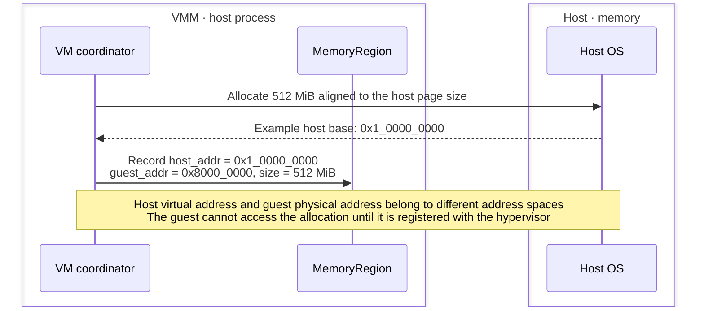
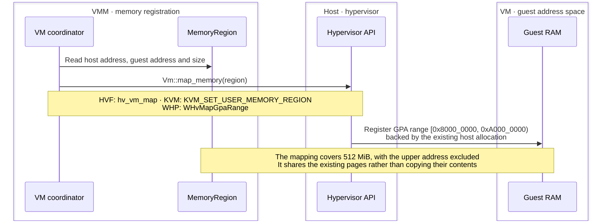
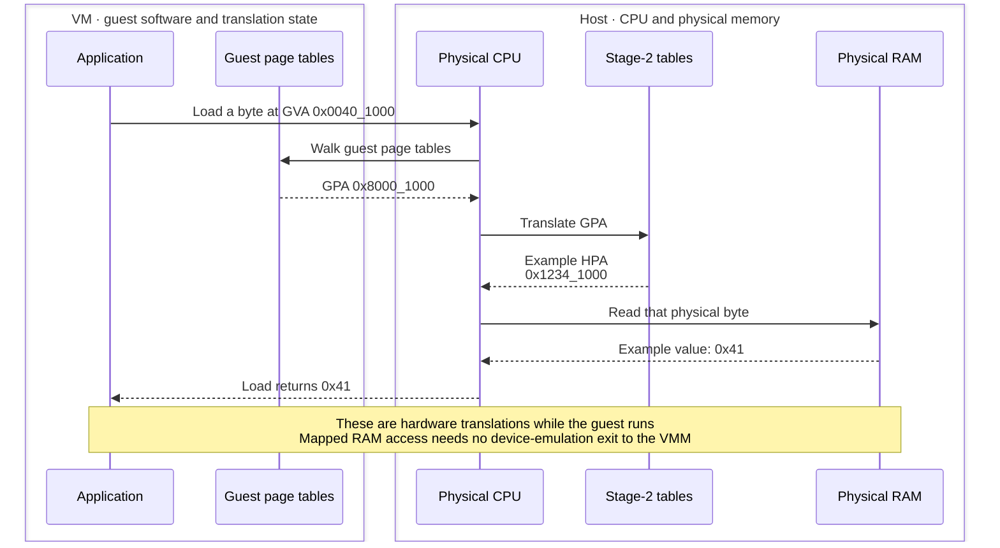
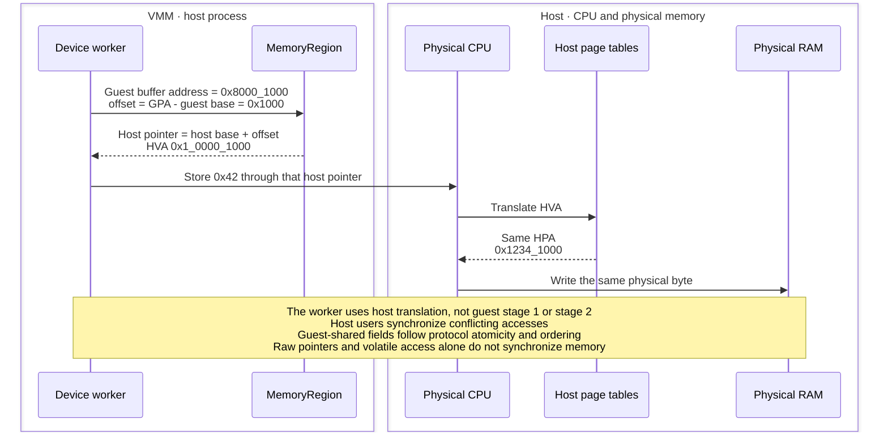
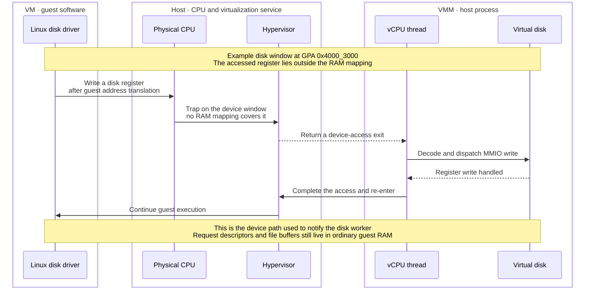
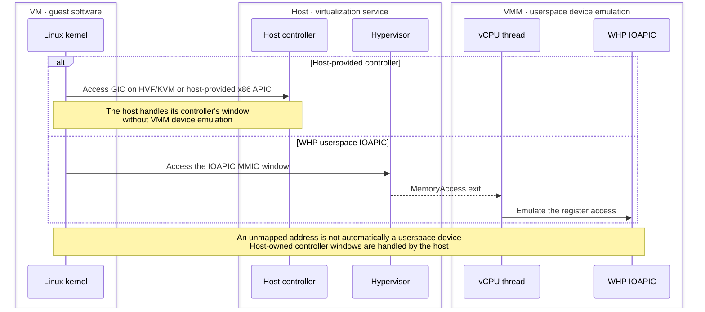
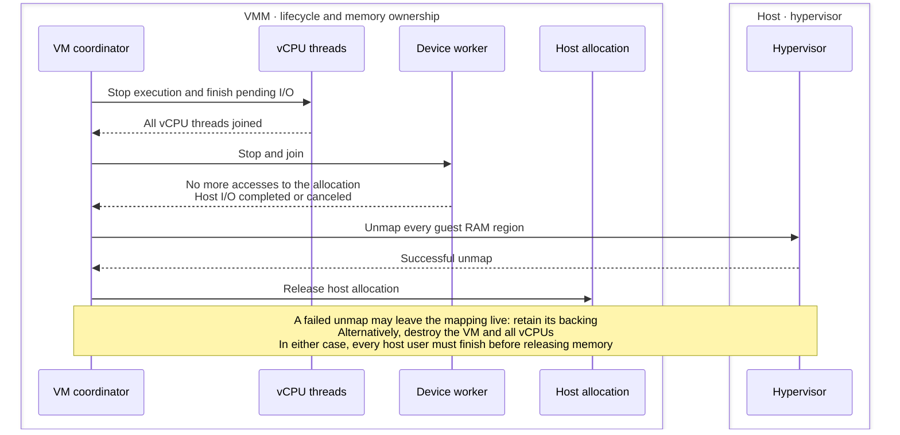
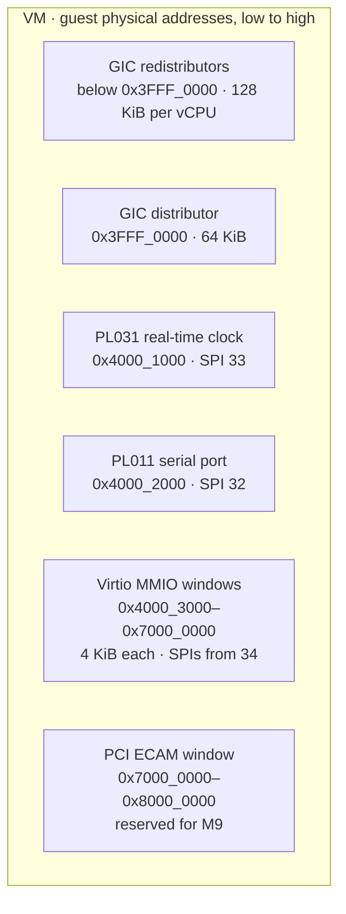
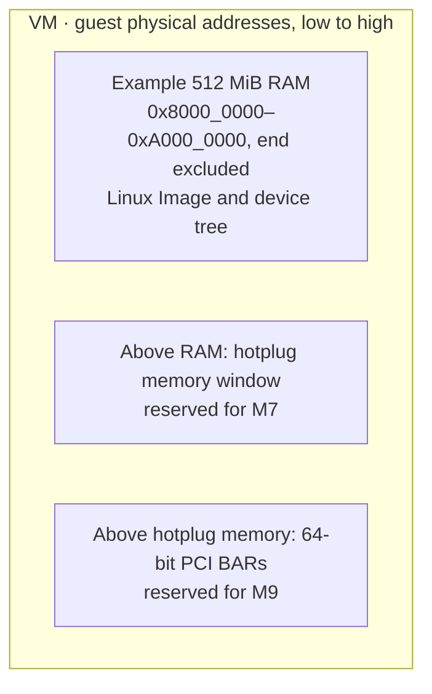

# Understanding guest memory

A visual introduction to memory in the [planned native VMM](README.md).
The architecture view starts with a small x86_64 KVM example; the walkthrough
then follows one byte through an arm64 VM with 512 MiB RAM. Example addresses
are illustrative; the final address-map diagrams show BoxLite's planned layout.

## 1. Architecture

Two mapped RAM regions provide 12 KiB of guest RAM on a host with 4 KiB pages.
Program, data and stack labels illustrate how the guest could use that RAM.
Range endpoints below are inclusive; the host column shows virtual addresses.

<details>
<summary>Show architecture diagram</summary>

```text
                  WHOLE EXAMPLE: TWO MAPPED RAM REGIONS

Guest physical addresses          KVM mapping   Host virtual addresses
                                                BoxLite-owned allocations

0x0000  +---------------------+
        | Unmapped            |
0x0FFF  +---------------------+

0x1000  +---------------------+                 +---------------------+ 0x70000000
        | Program             |     slot 0      | Program bytes       |
        | 4 KiB               |    <=======>    | 4 KiB allocation    |
0x1FFF  +---------------------+                 +---------------------+ 0x70000FFF

0x2000  +---------------------+                 +---------------------+ 0x90000000
        | Data                |     slot 1      | 8 KiB allocation    |
0x2010  | One byte: 00        |    <=======>    | Same byte: 00       | 0x90000010
        | ...                 |                 | ...                 |
        | Stack space         |                 |                     |
0x3FFF  +---------------------+                 +---------------------+ 0x90001FFF

0x4000  +---------------------+
        | Remaining address   |
        | space: unmapped     |
        +---------------------+
```

</details>

`<=======>` joins two address views of the **same backing bytes**.

- **Slot 0** maps the 4 KiB program region. **Slot 1** maps the entire 8 KiB
  data/stack region; a slot can cover several pages.
- Guest byte `0x2010` is `0x10` bytes into slot 1, so its host address is
  `0x90000000 + 0x10 = 0x90000010`. Both labels identify the same byte.
- The guest regions are adjacent even though the host allocations are far
  apart. Their host physical pages may also be scattered.

[`MemorySlots`](../../../src/hypervisor/src/kvm/memory.rs) keeps the slot
records outside guest RAM. Its vector index is the slot ID; `None` marks an
unused slot. Records change only after the KVM ioctl succeeds. BoxLite keeps
the backing allocations alive under the
[memory lifetime contract](../../../src/hypervisor/src/vm.rs).

## 2. How it works

### 2.1 Allocate backing memory in the host process

<details>
<summary>Show sequence diagram</summary>



</details>

### 2.2 Register the allocation as guest RAM

<details>
<summary>Show sequence diagram</summary>



</details>

### 2.3 Translate one guest load into a physical RAM access

<details>
<summary>Show sequence diagram</summary>



</details>

### 2.4 The host worker accesses the same byte through a different pointer

<details>
<summary>Show sequence diagram</summary>



</details>

### 2.5 A device register takes the MMIO path instead

<details>
<summary>Show sequence diagram</summary>



</details>

### 2.6 Interrupt-controller windows depend on who implements them

<details>
<summary>Show sequence diagram</summary>



</details>

### 2.7 Keep the backing alive until every user has stopped

<details>
<summary>Show sequence diagram</summary>



</details>

## 3. The planned arm64 address map

### 3.1 Controller and device windows below RAM

<details>
<summary>Show address map</summary>



</details>

### 3.2 RAM and space reserved above it

<details>
<summary>Show address map</summary>



</details>

## BoxLite implementation reference

[MemoryRegion fields](../../../../src/hypervisor/src/memory.rs) ·
[Memory lifetime contract](README.md#hypervisor-backend-interface) ·
[Guest address layout](README.md#guest-memory-layout) ·
[Pending I/O contract](../../../../src/hypervisor/src/exit.rs) ·
[HVF walkthrough](hvf.md) · [KVM walkthrough](kvm.md) · [WHP walkthrough](whp.md) ·
[WHP host-to-guest mapping API](https://learn.microsoft.com/en-us/virtualization/api/hypervisor-platform/funcs/whvmapgparange) ·
[KVM memory registration](https://docs.kernel.org/virt/kvm/api.html#kvm-set-user-memory-region)
