# BoxLite Architecture Overview / BoxLite 架构总览

> BoxLite is an embeddable virtual machine runtime for secure, isolated code execution --
> "SQLite for sandboxing." This document provides both a concise executive summary and a
> comprehensive deep-dive into the system architecture.

**Version**: 0.9.2 | **Rust Edition**: 2024 | **MSRV**: 1.88

---

## Table of Contents / 目录

- [Part A: Concise Version (扼要版)](#part-a-concise-version-扼要版)
  - [A.1 What BoxLite Is / 项目定位](#a1-what-boxlite-is--项目定位)
  - [A.2 High-Level Architecture / 高层架构](#a2-high-level-architecture--高层架构)
  - [A.3 Key Abstractions / 核心抽象](#a3-key-abstractions--核心抽象)
  - [A.4 Data Flow / 数据流](#a4-data-flow--数据流)
  - [A.5 Cross-Platform Strategy / 跨平台策略](#a5-cross-platform-strategy--跨平台策略)
- [Part B: Comprehensive Version (全面细致版)](#part-b-comprehensive-version-全面细致版)
  - [B.1 Project Structure / 项目结构](#b1-project-structure--项目结构)
  - [B.2 Cargo Workspace and Crate Dependency Graph / 工作空间与 Crate 依赖图](#b2-cargo-workspace-and-crate-dependency-graph--工作空间与-crate-依赖图)
  - [B.3 Core Modules Deep Dive / 核心模块详解](#b3-core-modules-deep-dive--核心模块详解)
  - [B.4 Module Relationship Diagram / 模块关系图](#b4-module-relationship-diagram--模块关系图)
  - [B.5 Initialization Pipeline / 初始化流水线](#b5-initialization-pipeline--初始化流水线)
  - [B.6 State Machine / 状态机](#b6-state-machine--状态机)
  - [B.7 Host-Guest Communication / 宿主-客户机通信](#b7-host-guest-communication--宿主客户机通信)
  - [B.8 Security Architecture / 安全架构](#b8-security-architecture--安全架构)
  - [B.9 Storage Architecture / 存储架构](#b9-storage-architecture--存储架构)
  - [B.10 Networking Architecture / 网络架构](#b10-networking-architecture--网络架构)
  - [B.11 Cross-Platform Abstraction Layers / 跨平台抽象层](#b11-cross-platform-abstraction-layers--跨平台抽象层)
  - [B.12 Feature Flags / 特性开关](#b12-feature-flags--特性开关)
  - [B.13 SDK Architecture / SDK 架构](#b13-sdk-architecture--sdk-架构)

---

# Part A: Concise Version (扼要版)

## A.1 What BoxLite Is / 项目定位

BoxLite is an embeddable VM runtime that provides hardware-level isolation for running
untrusted code. Unlike Docker (daemon-based) or Firecracker (server-based), BoxLite is a
**library** you link into your application -- no daemon, no root privileges, no orchestrator.

**Primary use cases:**

- **AI Agent Sandbox** -- safe execution of AI-generated code
- **Serverless Multi-tenant Runtime** -- per-customer isolation
- **Regulated Environments** -- hardware-level compliance boundaries

**Core properties:**

| Property | Implementation |
|---|---|
| Isolation | Hardware VMs (KVM / Hypervisor.framework / WHPX) |
| Containers | OCI images run inside each VM |
| API | Async Rust library, Python/Node.js/C SDKs |
| Communication | gRPC over vsock (host-to-guest) |
| Storage | QCOW2 COW disks, SQLite metadata |

## A.2 High-Level Architecture / 高层架构

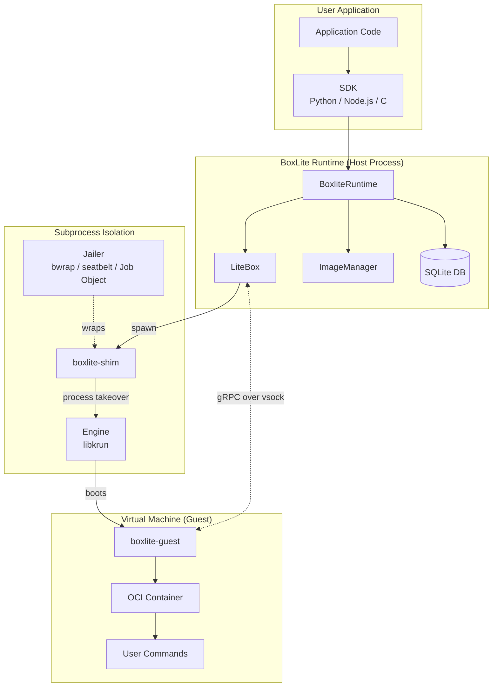

**How a box runs:**

1. User calls `runtime.create_box(options)` -- returns a `LiteBox` handle.
2. On `start()`, the runtime spawns `boxlite-shim` as a subprocess.
3. The Jailer wraps the subprocess in platform-specific sandboxing.
4. The shim calls `krun_start_enter()` which performs **process takeover** -- the shim
   process *becomes* the VM.
5. Inside the VM, `boxlite-guest` starts as PID 1, sets up the OCI container, and
   listens for gRPC commands on vsock port 2695.
6. The host communicates with the guest via gRPC to execute commands, transfer files,
   and manage the container lifecycle.

## A.3 Key Abstractions / 核心抽象

| Abstraction | Role | Key Detail |
|---|---|---|
| **BoxliteRuntime** | Entry point | Creates/manages boxes. Owns ImageManager, BoxManager, Database, Layout |
| **LiteBox** | Box handle (facade) | Thin wrapper over `BoxBackend`. Delegates to `BoxImpl` (local) or `RestBox` (remote) |
| **BoxImpl** | Core implementation | Owns immutable config, mutable state (`RwLock`), lazy `LiveState` (`OnceCell`) |
| **Vmm (trait)** | Pluggable hypervisor | Currently: Krun (libkrun). Future: Firecracker |
| **ShimController** | Process manager | Spawns `boxlite-shim` subprocess; watchdog monitors health |
| **Jailer** | Defense-in-depth sandbox | Platform-specific: bwrap + landlock + seccomp (Linux), seatbelt (macOS), Job Objects (Windows) |
| **GuestSession** | gRPC client | 4 service interfaces: Guest, Container, Execution, Files |
| **boxlite-guest** | Guest agent | PID 1 inside VM. Handles init, container setup, exec, file transfer |

## A.4 Data Flow / 数据流

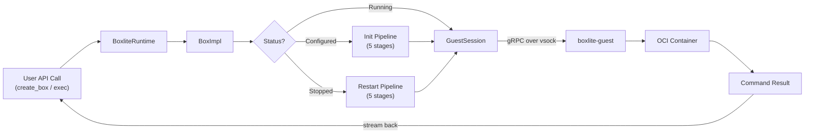

## A.5 Cross-Platform Strategy / 跨平台策略

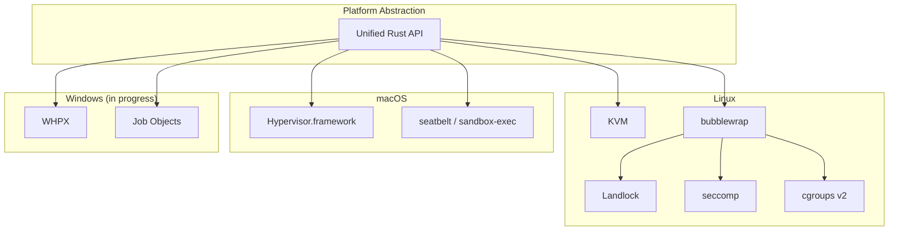

All three platforms share the same public API (`BoxliteRuntime`, `LiteBox`, `BoxCommand`).
Platform differences are isolated behind traits (`Vmm`, `Sandbox`, `Jail`) and `#[cfg]` gates.

---

# Part B: Comprehensive Version (全面细致版)

## B.1 Project Structure / 项目结构

```
boxlite/
├── src/
│   ├── boxlite/               # Core runtime library (Rust)
│   │   ├── src/
│   │   │   ├── lib.rs          # Public API surface + module declarations
│   │   │   ├── runtime/        # BoxliteRuntime: entry point, options, layout, IDs
│   │   │   ├── litebox/        # LiteBox: box handle, state machine, init pipeline, exec
│   │   │   ├── vmm/            # VM manager: engine trait, Krun, ShimController, watchdog
│   │   │   ├── jailer/         # Security: seccomp, seatbelt, bwrap, landlock, cgroups, jobs
│   │   │   ├── portal/         # Host-guest gRPC: connection, session, service interfaces
│   │   │   ├── images/         # OCI images: pull, cache, extract layers, manifest
│   │   │   ├── rootfs/         # Root filesystem: builder, copy_mount, overlayfs, operations
│   │   │   ├── net/            # Networking: gvproxy backend, port forwarding, DNS, MITM, CA
│   │   │   ├── disk/           # Disks: QCOW2, ext4, COW, base disk management
│   │   │   ├── volumes/        # Volumes: guest (virtiofs), container (bind mounts)
│   │   │   ├── db/             # SQLite: box_config, box_state, image_index, base_disk, snapshots
│   │   │   ├── lock/           # Multi-process file locks
│   │   │   ├── metrics/        # Runtime and per-box metrics
│   │   │   ├── pipeline/       # Generic stage-based pipeline executor
│   │   │   ├── event_listener/ # Audit event system
│   │   │   ├── fs/             # Filesystem helpers (bind mounts)
│   │   │   ├── rest/           # REST API client backend (optional)
│   │   │   └── util/           # Cross-cutting utilities
│   │   └── src/bin/shim/       # boxlite-shim binary (subprocess entry point)
│   │
│   ├── shared/                 # Shared types: protobuf, transport, errors, constants
│   ├── cli/                    # CLI binary (boxlite command)
│   ├── server/                 # Distributed server (REST backend)
│   ├── guest/                  # Guest agent binary (runs inside VM as PID 1)
│   ├── ffi/                    # FFI layer for C SDK
│   ├── test-utils/             # Test utilities (VM helpers, temp dirs)
│   └── deps/                   # Vendored C sys crates
│       ├── bubblewrap-sys/     # Linux sandbox (bwrap binary)
│       ├── e2fsprogs-sys/      # ext4 filesystem tools (mke2fs)
│       ├── libgvproxy-sys/     # Go network proxy (gvisor-tap-vsock CGO)
│       └── libkrun-sys/        # Hypervisor bindings (KVM/HVF/WHPX)
│
├── sdks/
│   ├── python/                 # Python SDK (PyO3, Python 3.10+)
│   ├── c/                      # C SDK (FFI/cbindgen)
│   └── node/                   # Node.js SDK (napi-rs, Node.js 18+)
│
├── examples/python/            # Python examples (7 categorized subdirectories)
├── docs/                       # Documentation
└── scripts/                    # Build and setup scripts
```

## B.2 Cargo Workspace and Crate Dependency Graph / 工作空间与 Crate 依赖图

The workspace contains 12 crates organized in three tiers: core library, platform bindings,
and SDK bindings.

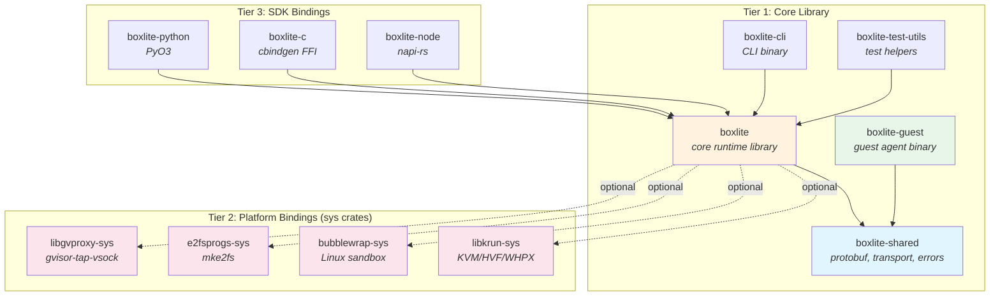

**Dependency rules:**

- `boxlite-shared` is the foundation -- depended on by both host (`boxlite`) and guest
  (`boxlite-guest`). Contains protobuf definitions, transport types, error types, and
  shared constants (port numbers, mount tags).
- `boxlite` (core) depends on `boxlite-shared` and optionally on the four sys crates.
  The sys crates are gated behind feature flags so the library compiles without native
  dependencies for documentation and API-only use.
- SDK crates (`python`, `c`, `node`) depend on `boxlite` core and provide language
  bindings via PyO3, cbindgen, and napi-rs respectively.
- `boxlite-guest` depends only on `boxlite-shared` (plus Linux-specific crates like
  `libcontainer` and `tokio-vsock`). It never depends on the host-side `boxlite` crate.

## B.3 Core Modules Deep Dive / 核心模块详解

### B.3.1 runtime/ -- BoxliteRuntime (入口点)

The `runtime/` module is the main entry point. `BoxliteRuntime` is a backend-agnostic
facade that delegates to a `RuntimeBackend` implementation.

**Submodules:**

| Submodule | Purpose |
|---|---|
| `core.rs` | `BoxliteRuntime` struct: `new()`, `default()`, `create_box()`, `list_boxes()`, `remove_box()` |
| `rt_impl.rs` | `RuntimeImpl` / `LocalRuntime`: local VM-backed backend |
| `backend.rs` | `RuntimeBackend` + `BoxBackend` + `SnapshotBackend` traits |
| `options.rs` | `BoxliteOptions`, `BoxOptions`, `NetworkSpec`, `VolumeSpec`, `Secret` |
| `advanced_options.rs` | `SecurityOptions`, `ResourceLimits`, `HealthCheckOptions` |
| `layout.rs` | `FilesystemLayout` + `BoxFilesystemLayout`: typed path accessors for `~/.boxlite/` |
| `id.rs` | `BoxID`, `BaseDiskID` (ULID-based) with `Mint` types for controlled generation |
| `images.rs` | `ImageHandle`: pull, cache, and manage OCI images |
| `constants.rs` | VM defaults (1 CPU, 2048 MiB), default images, mount tags |
| `embedded.rs` | `include_bytes!` embedding of shim/guest/kernel binaries |
| `signal_handler.rs` | SIGTERM/SIGINT handler for graceful shutdown |

**Key design decisions:**

- `BoxliteRuntime` is cheaply cloneable via `Arc` -- all clones share the same state.
- A filesystem lock ensures only one local runtime uses a given `BOXLITE_HOME` at a time.
- The global `DEFAULT_RUNTIME` singleton uses `OnceLock` with an `atexit` handler for
  process-level cleanup.

### B.3.2 litebox/ -- LiteBox (Box 生命周期)

`LiteBox` is the user-facing handle for an individual sandbox.

**Submodules:**

| Submodule | Purpose |
|---|---|
| `mod.rs` | `LiteBox` struct: thin facade delegating to `BoxBackend` |
| `box_impl.rs` | `BoxImpl` + `SharedBoxImpl`: core implementation with `LiveState` |
| `config.rs` | `BoxConfig`: immutable configuration stored once at creation |
| `state.rs` | `BoxStatus` enum, `BoxState` struct, state machine transitions |
| `init/` | `BoxBuilder` + init pipeline (5-stage table-driven initialization) |
| `exec.rs` | `BoxCommand`, `Execution`, `ExecResult` (streaming stdin/stdout/stderr) |
| `copy.rs` | `CopyOptions` for host-guest file transfer |
| `manager.rs` | `BoxManager`: concurrent box registry |
| `snapshot.rs` / `snapshot_mgr.rs` | Snapshot handles and lifecycle |
| `archive.rs` | `.boxlite` portable archive export/import |
| `clone_export.rs` | Box cloning (single + batch with shared base disk) |
| `crash_report.rs` | `CrashReport`: captures `ExitInfo` from shim on crash |

**Key design decisions:**

- `BoxImpl` uses **lazy initialization**: `LiveState` is stored in a `OnceCell` and
  populated only when the box is first started.
- The init pipeline is **table-driven**: different execution plans are selected based on
  `BoxStatus` (Configured, Stopped, Running).
- `LiteBox` is `Send + Sync` (compile-time assertion in source).

### B.3.3 vmm/ -- Virtual Machine Manager (虚拟机管理)

The VMM module provides a pluggable engine abstraction.

**Submodules:**

| Submodule | Purpose |
|---|---|
| `engine.rs` | `Vmm` trait + `VmmInstance` + `VmmConfig` |
| `krun/` | Krun engine: libkrun FFI, `create()` implementation |
| `controller/` | `VmmController` trait, `ShimController`, `ShimHandler` |
| `controller/watchdog.rs` | Pipe-based parent death detection + health monitoring |
| `factory.rs` | `VmmFactory`: engine instantiation |
| `registry.rs` | `create_engine()`: VmmKind -> concrete engine |
| `exit_info.rs` | `ExitInfo`: structured crash data from shim |
| `guest_check.rs` | Guest readiness verification |

**Engine trait hierarchy:**

```
Vmm (trait)                    -- creates VmmInstance from InstanceSpec
  └── VmmInstance              -- enter() performs process takeover
        └── VmmInstanceImpl    -- internal engine-specific implementation

VmmController (trait)          -- spawns VM, returns VmmHandler
  └── ShimController           -- spawns boxlite-shim subprocess

VmmHandler (trait)             -- runtime operations (stop, metrics)
  └── ShimHandler              -- manages shim child process
```

**VmmKind enum:**

- `Libkrun` (default) -- uses libkrun for KVM/HVF/WHPX virtualization
- `Firecracker` (future) -- placeholder for Firecracker integration

### B.3.4 jailer/ -- Security Isolation (安全隔离)

The Jailer provides defense-in-depth sandboxing for the `boxlite-shim` process.

**Trait hierarchy:**

```
Jail (trait -- public contract)
│   prepare()  -> pre-spawn setup
│   command()  -> confined command ready to spawn
│
└── Jailer<S: Sandbox> (struct -- implements Jail)
    │   translates SecurityOptions -> SandboxContext
    │   delegates to S, adds pre_exec hook
    │
    └── Sandbox (trait -- platform-specific wrapping)
        ├── BwrapSandbox        (Linux -- bubblewrap + namespaces)
        ├── SeatbeltSandbox     (macOS -- sandbox-exec with SBPL)
        ├── JobSandbox          (Windows -- Job Objects)
        └── NoopSandbox         (fallback when sandboxing unavailable)
```

**Platform security layers:**

| Layer | Linux | macOS | Windows |
|---|---|---|---|
| Process isolation | PID/mount/net namespaces (bwrap) | sandbox-exec (SBPL profile) | Job Objects |
| Filesystem restriction | Landlock LSM | Seatbelt deny-default | -- |
| Syscall filtering | seccomp BPF (build-time compiled) | -- | -- |
| Resource limits | cgroups v2 + rlimits | rlimits | Job Object limits |
| Binary isolation | Shim copy (Firecracker pattern) | Shim copy | Shim copy |

### B.3.5 portal/ -- Host-Guest gRPC (宿主-客户机通信)

The portal module provides gRPC communication between the host and the guest agent.

**Submodules:**

| Submodule | Purpose |
|---|---|
| `connection.rs` | gRPC channel creation over Unix socket / vsock |
| `session.rs` | `GuestSession`: unified client with all four service interfaces |
| `interfaces/guest.rs` | `GuestInterface`: init, shutdown, network config |
| `interfaces/container.rs` | `ContainerInterface`: rootfs setup, container lifecycle |
| `interfaces/exec.rs` | `ExecutionInterface`: command execution with streaming I/O |
| `interfaces/files.rs` | `FilesInterface`: file transfer (copy in/out) |

**Communication flow:**

```
Host Process                           Guest VM
    │                                     │
    │  Unix socket ←─ libkrun bridge ─→ vsock
    │                                     │
    ├── GuestInterface ──────────────→ Guest service (init, shutdown)
    ├── ContainerInterface ──────────→ Container service (rootfs, lifecycle)
    ├── ExecutionInterface ──────────→ Execution service (exec, streaming I/O)
    └── FilesInterface ──────────────→ Files service (copy in/out via tar stream)
```

### B.3.6 Other Modules / 其它模块

| Module | Purpose |
|---|---|
| `images/` | OCI image pull (via `oci-client`), layer extraction, manifest parsing, content-addressable cache |
| `rootfs/` | Root filesystem preparation: `RootfsBuilder` (overlayfs on Linux), `copy_mount` fallback, guest rootfs assembly |
| `net/` | Network backend factory pattern. Pluggable: gvproxy (gvisor-tap-vsock), libslirp. Features: port forwarding, DNS sinkhole (`allow_net`), MITM proxy (secret injection), per-box CA generation |
| `disk/` | RAII `Disk` type, QCOW2 COW child creation, ext4 from directory (`mke2fs`), `fork_qcow2` (atomic snapshot/clone), `BaseDiskManager` (shared base images with reference counting) |
| `volumes/` | `GuestVolumeManager` (virtiofs shares + block devices), `ContainerVolumeManager` (bind mounts inside container) |
| `db/` | SQLite persistence: `BoxStore` (config + state), `ImageIndexStore` (OCI cache), `BaseDiskStore` (reference-counted base disks), `SnapshotStore`. WAL mode, auto-migration |
| `lock/` | File-based multi-process locks for safe concurrent access |
| `pipeline/` | Generic stage-based pipeline: `Stage` (sequential or parallel tasks), `PipelineBuilder`, `PipelineExecutor`, `PipelineMetrics` |
| `metrics/` | `RuntimeMetrics` (global), `BoxMetrics` (per-box init stage timings, process stats) |
| `event_listener/` | `AuditEvent` system for observability hooks |

## B.4 Module Relationship Diagram / 模块关系图

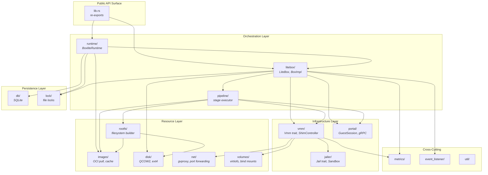

## B.5 Initialization Pipeline / 初始化流水线

Box initialization is table-driven with different execution plans based on current status.
The pipeline uses a generic `Stage` executor that supports sequential and parallel task
execution with automatic cleanup on failure via `CleanupGuard` (RAII pattern).

### B.5.1 First Start (Configured -> Running)

```mermaid
flowchart TD
    START([BoxBuilder.build]) --> S1

    subgraph S1["Stage 1: Filesystem (sequential)"]
        FS[FilesystemTask<br/><i>Create box directory layout</i>]
    end

    S1 --> S2

    subgraph S2["Stage 2: Rootfs Preparation (parallel)"]
        CR[ContainerRootfsTask<br/><i>Pull OCI image → create ext4 → QCOW2 COW</i>]
        GR[GuestRootfsTask<br/><i>Prepare guest rootfs → QCOW2 COW</i>]
    end

    S2 --> S3

    subgraph S3["Stage 3: VM Spawn (sequential)"]
        VS[VmmSpawnTask<br/><i>Build InstanceSpec → ShimController.start()</i>]
    end

    S3 --> S4

    subgraph S4["Stage 4: Guest Connect (sequential)"]
        GC[GuestConnectTask<br/><i>Wait for guest ready signal on port 2696</i>]
    end

    S4 --> S5

    subgraph S5["Stage 5: Guest Init (sequential)"]
        GI[GuestInitTask<br/><i>Initialize container rootfs and volumes</i>]
    end

    S5 --> DONE([LiveState ready])

    style S2 fill:#e8f5e9
```

### B.5.2 Restart (Stopped -> Running)

The restart pipeline is identical in structure, but rootfs tasks **reuse existing QCOW2
COW disks** instead of creating new ones. This preserves user data written during the
previous session.

### B.5.3 Reattach (Running -> Running)

When a box is already running (e.g., after parent process restart with `detach: true`):

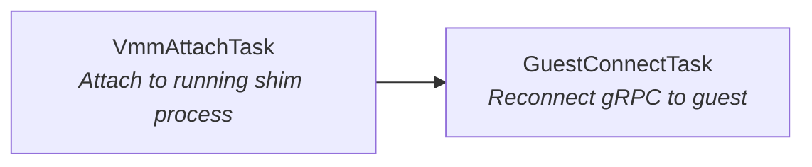

## B.6 State Machine / 状态机

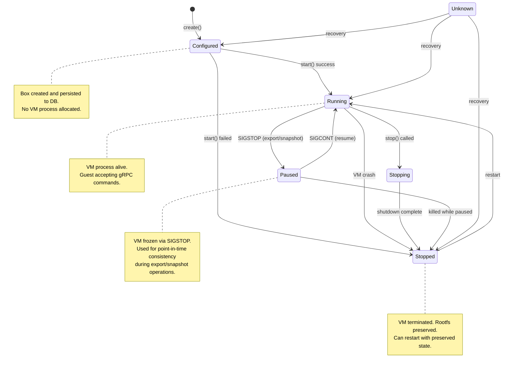

**State transition rules (from source):**

| From | Valid Targets |
|---|---|
| `Unknown` | Any state (recovery path) |
| `Configured` | `Running`, `Stopped`, `Unknown` |
| `Running` | `Stopping`, `Stopped`, `Paused`, `Unknown` |
| `Stopping` | `Stopped`, `Unknown` |
| `Stopped` | `Running`, `Unknown` |
| `Paused` | `Running`, `Stopped`, `Unknown` |

**Implicit start:** calling `exec()` on a `Configured` or `Stopped` box triggers an
implicit `start()` before executing the command.

## B.7 Host-Guest Communication / 宿主-客户机通信

### B.7.1 Transport

Communication between the host and the guest uses **vsock** (virtio socket), bridged to
Unix domain sockets by libkrun:

```
Host Process                    libkrun bridge                  Guest VM
     │                               │                              │
     ├── Unix socket ──────────→ vsock bridge ──────────→ vsock listener
     │   (box.sock)                   │                     (port 2695)
     │                               │                              │
     └── Unix socket ←────────── vsock bridge ←────────── vsock connect
         (ready.sock)                 │                     (port 2696)
```

**Ports:**

| Port | Direction | Purpose |
|---|---|---|
| 2695 (`GUEST_AGENT_PORT`) | Host -> Guest | gRPC service (commands, files, container lifecycle) |
| 2696 (`GUEST_READY_PORT`) | Guest -> Host | Ready notification (guest connects when boot is complete) |

### B.7.2 Protocol

The protocol uses **gRPC** (tonic) with protobuf definitions in `boxlite-shared`. Four
service interfaces are exposed:

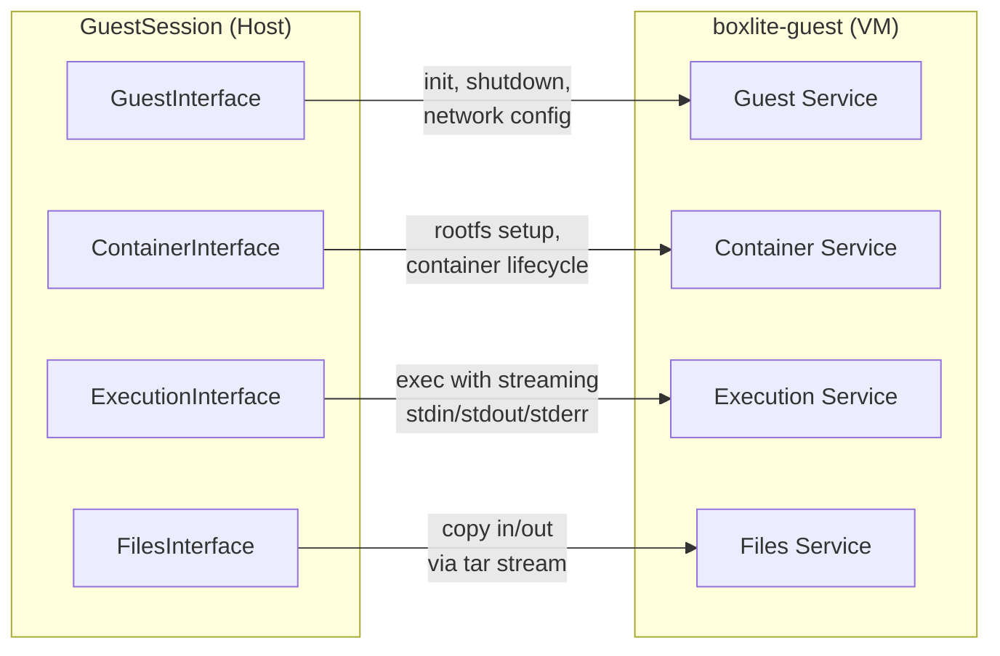

| Interface | Key RPCs |
|---|---|
| **GuestInterface** | `init()` (first-time setup), `shutdown()`, network/volume config |
| **ContainerInterface** | `init_rootfs()` (mount OCI layers), container lifecycle management |
| **ExecutionInterface** | `exec()` with bidirectional streaming (stdin, stdout, stderr) |
| **FilesInterface** | `copy_into()` / `copy_out()` using tar-encoded streams |

## B.8 Security Architecture / 安全架构

BoxLite uses defense-in-depth: multiple independent security layers, each providing value
even if other layers are compromised.

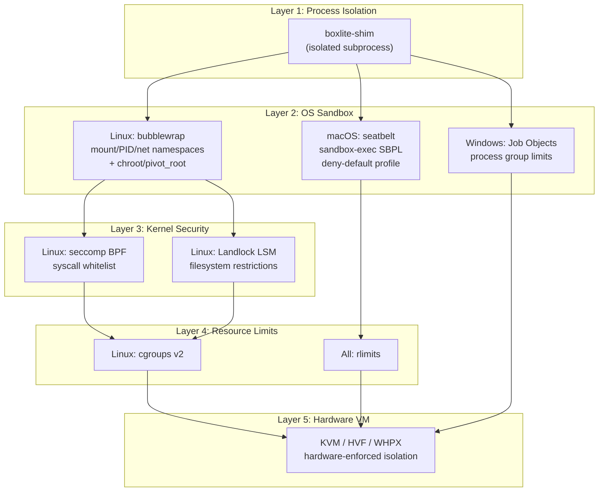

**Filesystem access model (granular, not wholesale):**

The Jailer builds a per-box `PathAccess` list with minimum required permissions:

```
{box_dir}/
├── bin/                        [RO]  copied shim binary + libkrunfw
├── shared/                     [RW]  guest-visible virtio-fs share root
├── sockets/                    [RW]  libkrun vsock/unix sockets
├── tmp/                        [RW]  shim/libkrun transient temp files
├── logs/                       [RW]  shim logging + VM console output
├── disks/                      [RW]  disk images (QCOW2)
├── exit                        [RW]  crash ExitInfo JSON
├── mounts/                     [--]  EXCLUDED (host writes, shim reads via shared/)
└── shim.pid                    [--]  EXCLUDED (written by pre_exec before sandbox)
```

## B.9 Storage Architecture / 存储架构

### B.9.1 Directory Layout

```
~/.boxlite/                         # BOXLITE_HOME (configurable via env)
├── db/
│   └── boxlite.db                  # SQLite database (WAL mode)
├── images/
│   ├── layers/                     # OCI image layers (content-addressable)
│   ├── manifests/                  # OCI image manifests
│   └── disk-images/                # ext4 base images from OCI layers
├── boxes/
│   └── {box_id}/                   # Per-box directory
│       ├── bin/                    # Copied shim binary + libkrunfw
│       ├── disks/
│       │   ├── disk.qcow2          # Container rootfs (QCOW2 COW overlay)
│       │   └── guest-rootfs.qcow2  # Guest rootfs (QCOW2 COW overlay)
│       ├── sockets/
│       │   └── box.sock            # Unix domain socket for gRPC
│       ├── shared/                 # Virtio-fs share root
│       ├── mounts/                 # Host-side mount preparation
│       ├── logs/                   # Shim logs + console output
│       ├── tmp/                    # Transient files
│       └── exit                    # Crash info (ExitInfo JSON)
├── bases/                          # Shared backing files (snapshots, clones)
├── locks/                          # Per-entity file locks
├── logs/                           # Runtime-level logs
└── tmp/                            # Runtime-level temp files
```

### B.9.2 Disk Image Strategy

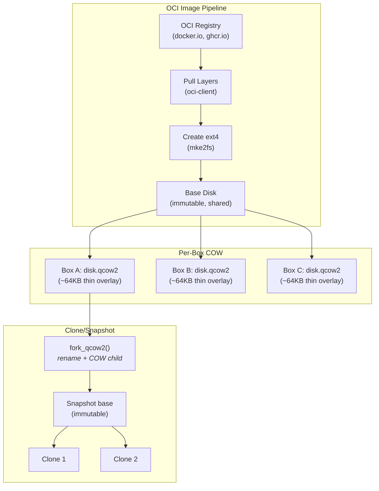

**Key properties:**

- **Copy-on-write**: QCOW2 overlays start at ~64KB and grow only as data is written.
  Multiple boxes from the same image share a single base disk.
- **State preservation**: COW disks persist across VM restarts -- user data survives
  `stop()` + `start()` cycles.
- **Atomic fork**: `fork_qcow2()` performs rename + COW child creation atomically,
  enabling zero-downtime snapshots and clones.
- **Reference counting**: `BaseDiskManager` + `BaseDiskStore` track shared base disks
  and clean up when the last reference is removed.

### B.9.3 SQLite Schema

The database uses a **JSON blob pattern** (inspired by Podman) with queryable indexed
columns for performance:

| Table | Purpose |
|---|---|
| `schema_version` | Schema versioning with auto-migration |
| `box_config` | Immutable box configuration (stored once at creation) |
| `box_state` | Mutable lifecycle state (updated on transitions) |
| `alive` | Liveness tracking |
| `image_index` | OCI image cache metadata |
| `base_disk` | Shared base disk registry (path, hash, size) |
| `base_disk_ref` | Reference counting for base disks |
| `snapshot` | Snapshot metadata per box |

Configuration: WAL mode, FULL synchronous, foreign keys enabled, 100s busy timeout.

## B.10 Networking Architecture / 网络架构

BoxLite uses a pluggable network backend architecture:

```mermaid
graph TD
    subgraph "Host Process"
        NBF["NetworkBackendFactory"]
        NB["NetworkBackend (trait)"]
    end

    subgraph "Network Backends"
        GVP["GvisorTapBackend<br/>(gvisor-tap-vsock / gvproxy)"]
        SLP["LibslirpBackend<br/>(libslirp)"]
    end

    subgraph "Features"
        PF["Port Forwarding<br/>(host:port → guest:port)"]
        DNS["DNS Sinkhole<br/>(allow_net whitelist)"]
        MITM["MITM Proxy<br/>(secret injection)"]
        CA["Per-Box CA<br/>(rcgen)"]
    end

    subgraph "Engine Integration"
        ENG["Vmm Engine"]
        SOCK["Unix Socket"]
        VMNET["VM Network Interface"]
    end

    NBF --> GVP
    NBF --> SLP
    GVP --> NB
    SLP --> NB

    NB --> PF
    NB --> DNS
    NB --> MITM
    MITM --> CA

    NB -->|"endpoint()"| ENG
    ENG --> SOCK
    SOCK --> VMNET
```

**Backend selection** (priority order, compile-time feature flags):

1. `gvproxy` feature -> `GvisorTapBackend` (gvisor-tap-vsock CGO library)
2. `libslirp` feature -> `LibslirpBackend` (external libslirp-helper binary)
3. No feature -> engine's default networking (libkrun TSI fallback)

**Connection types:**

- `UnixStream` (SOCK_STREAM) -- used on Linux
- `UnixDgram` (SOCK_DGRAM) -- used on macOS

## B.11 Cross-Platform Abstraction Layers / 跨平台抽象层

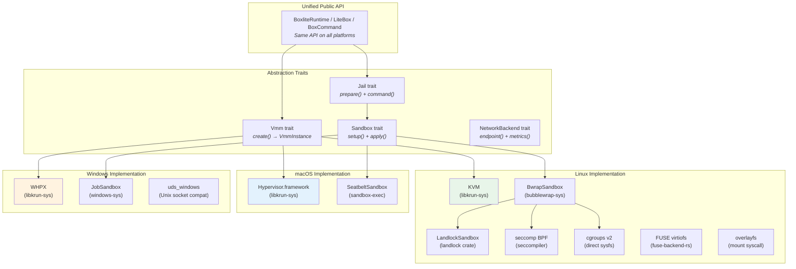

**Platform-specific dependency map:**

| Dependency | Linux | macOS | Windows | Purpose |
|---|---|---|---|---|
| `libkrun-sys` | KVM | HVF | WHPX | Hypervisor abstraction |
| `bubblewrap-sys` | Yes | -- | -- | Namespace + chroot sandbox |
| `seccompiler` | Yes | -- | -- | Syscall filtering |
| `landlock` | Yes | -- | -- | LSM filesystem restrictions |
| `fuse-backend-rs` | Yes | -- | -- | FUSE-based virtiofs |
| `nix` | Yes | Yes | -- | Unix system calls |
| `xattr` | Yes | Yes | -- | Extended attributes |
| `windows-sys` | -- | -- | Yes | Win32 API (Job Objects, etc.) |
| `uds_windows` | -- | -- | Yes | Unix socket emulation |
| `caps` | Yes | -- | -- | Linux capabilities |
| `pathrs` | Yes | -- | -- | Safe path resolution (CVE mitigation) |

## B.12 Feature Flags / 特性开关

| Feature | Default | Description |
|---|---|---|
| `embedded-runtime` | Yes | Embed shim/guest/kernel binaries via `include_bytes!` |
| `krunfw` | Yes | Download libkrunfw firmware at build time |
| `krun` | No | Build + statically link libkrun.a (only for boxlite-shim binary) |
| `e2fsprogs` | Yes | Bundled `mke2fs` for ext4 disk creation |
| `bubblewrap` | Yes | Bundled `bwrap` for Linux sandbox isolation |
| `gvproxy` | No | gvisor-tap-vsock CGO shared library for networking |
| `libslirp` | No | External libslirp-helper binary for networking |
| `rest` | No | REST API client backend (for distributed mode) |

**Minimal build** (API-only, no native deps): disable all default features. This is used
for documentation generation (`docs.rs`).

## B.13 SDK Architecture / SDK 架构

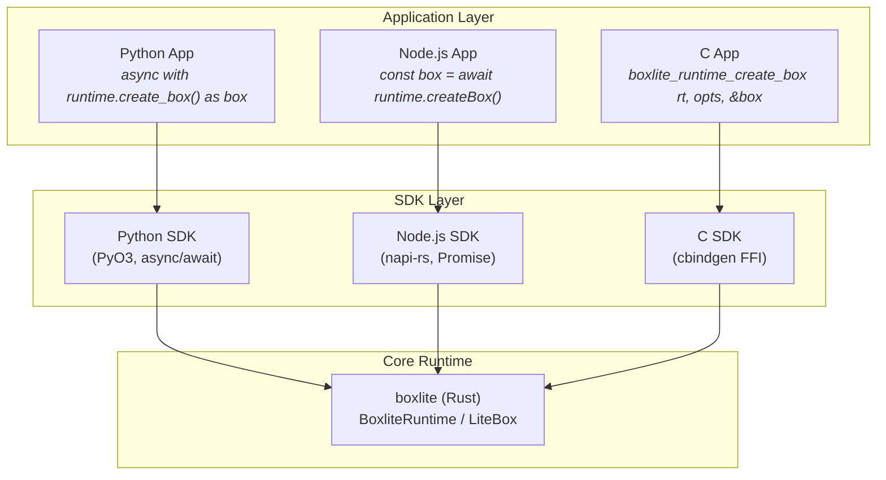

| SDK | Binding | Async Model | Key Features |
|---|---|---|---|
| **Python** | PyO3 | `async/await` (asyncio) | Context managers (`async with`), type hints, Python 3.10+ |
| **Node.js** | napi-rs | Promises | Node.js 18+, native addon |
| **C** | cbindgen FFI | Callbacks / polling | Header generation, opaque pointers |

All SDKs wrap the same Rust core, ensuring feature parity and consistent behavior
across languages.

---

*This document is generated from the BoxLite v0.9.2 source code. For the latest
version, refer to the repository at `https://github.com/boxlite-ai/boxlite`.*
