# BoxLite VM Lifecycle: In-Depth Guide

This document provides a complete reference for the BoxLite VM lifecycle -- from creation through execution to shutdown. It covers the initialization pipeline, state machine, command execution, watchdog mechanisms, and error handling in detail.

The document is organized in two parts:

- **Part A: Concise Version** -- A brief summary of the lifecycle for quick reference.
- **Part B: Comprehensive Version** -- Full detailed coverage with code-level accuracy.

---

# Part A: Concise Version

## 1. Lifecycle Overview

A BoxLite box progresses through a well-defined lifecycle managed by three layers of abstraction:

| Layer | Type | Responsibility |
|-------|------|----------------|
| `BoxliteRuntime` | Public API | Creates boxes, manages global state |
| `LiteBox` | Thin facade | Delegates to `BoxBackend` trait |
| `BoxImpl` | Implementation | Holds config (immutable), state (`RwLock`), and `LiveState` (`OnceCell`, lazy) |

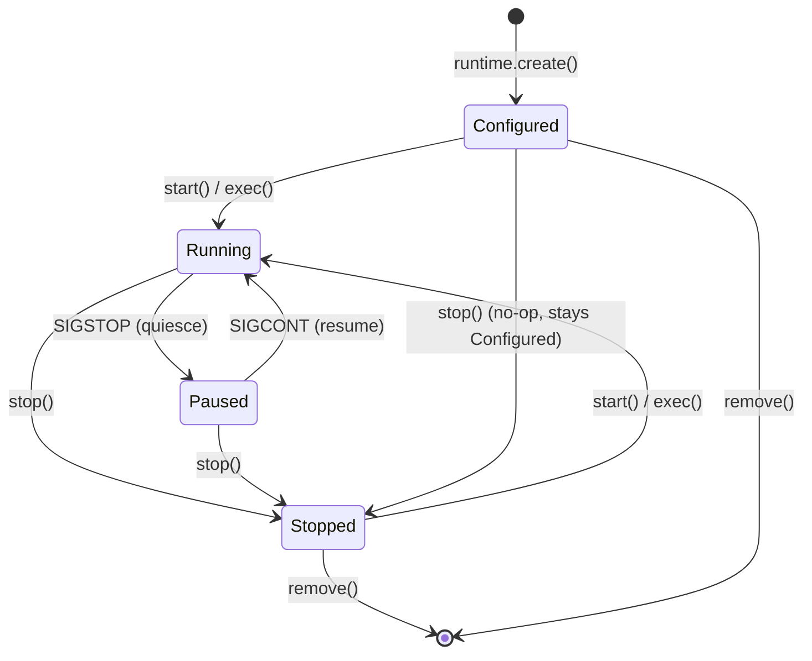

## 2. Creation Flow

`runtime.create(BoxOptions, name)` performs these steps synchronously:

1. Validate options, generate `BoxID` (nanoid), allocate a per-entity lock
2. Create `BoxConfig` (immutable) and `BoxState` (status = `Configured`)
3. Persist to SQLite database
4. Wrap in `BoxImpl` and return a `LiteBox` handle

No VM is started. No disk is allocated. The box is a lightweight record.

## 3. Lazy LiveState Initialization

On the first call to `start()` or `exec()`, `BoxImpl` triggers lazy initialization via `OnceCell`. The init pipeline runs in stages:

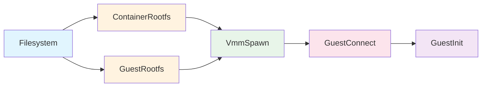

| Stage | Mode | What It Does |
|-------|------|-------------|
| **FilesystemTask** | Sequential | Creates `~/.boxlite/boxes/{box_id}/` directory structure |
| **ContainerRootfs** | Parallel | Pulls OCI image, extracts layers, creates ext4 base + QCOW2 COW overlay |
| **GuestRootfs** | Parallel | Prepares guest rootfs (Alpine + boxlite-guest binary), cached in `~/.boxlite/bases/` |
| **VmmSpawn** | Sequential | Builds `InstanceSpec`, spawns `boxlite-shim` via Jailer with watchdog pipe/event |
| **GuestConnect** | Sequential | Waits for guest ready signal (port 2696), establishes gRPC channel (port 2695) |
| **GuestInit** | Sequential | Sends guest init config (volumes, network) and container init (rootfs, image config) |

A `CleanupGuard` (RAII) ensures that if any stage fails, partial resources are rolled back.

## 4. Restart vs. Reattach

- **Restart** (Stopped -> Running): Same pipeline, but rootfs tasks reuse existing COW disks (preserving user modifications). A new VM process and guest daemon are created.
- **Reattach** (Running, from different runtime instance): Only runs `VmmAttach` (attaches to existing shim by PID) + `GuestConnect` (reconnects gRPC).

## 5. Command Execution

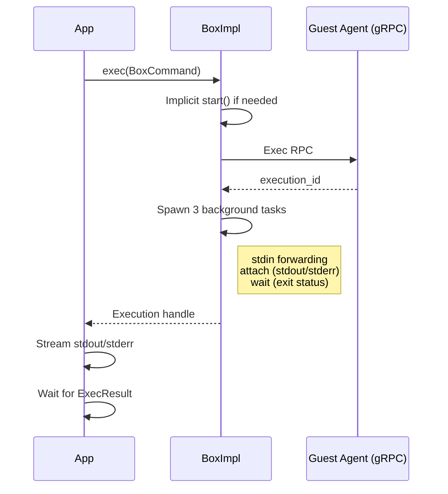

## 6. Shutdown

`box.stop()` executes: abort health check -> Guest.Shutdown RPC -> ShimHandler.stop() (SIGTERM, wait 2s, SIGKILL on Unix; signal Event, WaitForSingleObject, TerminateProcess on Windows) -> clean up PID file -> update state to Stopped -> persist to DB -> invalidate cache -> fire event listeners -> optional `auto_remove`.

## 7. Watchdog Mechanism

| Platform | Mechanism | Parent Death Detection |
|----------|-----------|----------------------|
| Unix | Pipe pair (`pipe2` with `O_CLOEXEC`) | Parent holds write end; shim polls read end for `POLLHUP` |
| Windows | Event handle (`CreateEventW`) + parent process handle | Shim waits via `WaitForMultipleObjects` on both |

If the parent process crashes, the watchdog fires and the shim exits gracefully.

## 8. Resource Defaults

| Resource | Default | Notes |
|----------|---------|-------|
| vCPUs | 1 | Capped at 4 on Windows (WHPX limitation) |
| Memory | 512 MiB | Passed to libkrun |
| Disk | Virtual 10 GB, actual ~200 KB sparse | QCOW2 COW overlay, configurable via `disk_size_gb` |

---

# Part B: Comprehensive Version

## 1. Architecture: The Three-Layer Box Model

BoxLite separates the public API surface from internal implementation using three layers:

```
BoxliteRuntime           LiteBox               BoxImpl
+-----------------+     +----------------+     +-------------------+
| Public API      |---->| Thin Facade    |---->| Config (immutable)|
| create/get/list |     | BoxBackend     |     | State (RwLock)    |
| shutdown        |     | trait dispatch |     | LiveState (Once)  |
+-----------------+     +----------------+     +-------------------+
```

### BoxliteRuntime

The entry point. Delegates all operations to a `RuntimeBackend` trait implementation. Two backends exist:

- `LocalRuntime`: Manages local VMs via libkrun.
- `RestRuntime`: Proxies to a remote BoxLite API server (HTTP).

The runtime holds: a `BoxManager` (integrated persistence), an `ImageManager`, filesystem layout, guest rootfs cache, runtime metrics (atomic counters), a per-entity lock manager, and a `CancellationToken` for coordinated shutdown.

### LiteBox

A thin, cheaply cloneable handle. It stores the `BoxID`, optional name, and two trait object references:

- `BoxBackend`: Lifecycle, exec, file copy, clone, export operations.
- `SnapshotBackend`: Snapshot lifecycle operations.

`LiteBox` never holds internal state beyond delegation pointers. It is `Send + Sync`.

### BoxImpl

The real implementation. Created immediately by `runtime.create()`, but expensive resources are deferred:

```rust
pub(crate) struct BoxImpl {
    // Always available (lightweight)
    pub(crate) config: BoxConfig,           // Immutable after creation
    pub(crate) state: Arc<RwLock<BoxState>>,// Mutable: status, pid, health
    pub(crate) shutdown_token: CancellationToken,

    // Lazily initialized on first start()/exec()
    live: OnceCell<LiveState>,
}
```

`LiveState` contains the running VM's resources:

```rust
pub(crate) struct LiveState {
    handler: Mutex<Box<dyn VmmHandler>>,    // VM process control
    guest_session: GuestSession,            // gRPC channel to guest
    metrics: BoxMetricsStorage,             // Per-box timing + counters
    _container_rootfs_disk: Disk,           // QCOW2 COW disk (kept alive)
    guest_rootfs_disk: Option<Disk>,        // Guest rootfs disk
}
```

## 2. VM Creation Flow

When you call `runtime.create(BoxOptions, name)`, the following happens:

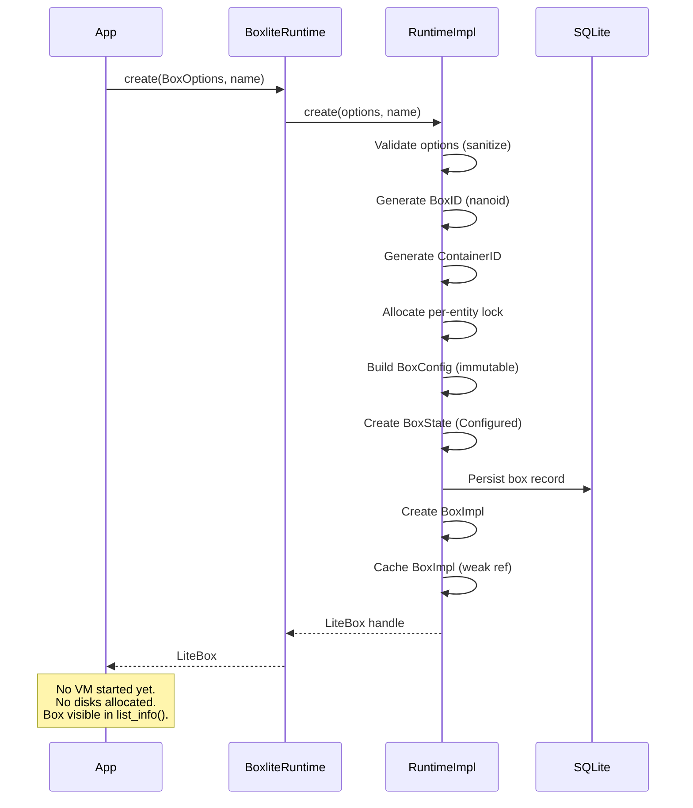

Key details:

1. **BoxID generation**: Uses nanoid for compact, collision-resistant identifiers.
2. **Lock allocation**: A per-entity lock is allocated from the `LockManager` for multiprocess-safe operations. The lock ID is stored in `BoxState.lock_id`.
3. **BoxConfig**: Immutable after creation. Contains box ID, container ID, options, transport paths, and the computed `box_home` path (`~/.boxlite/boxes/{box_id}/`).
4. **BoxState**: Mutable state persisted to DB. Initial status is `Configured`, pid is `None`, lock_id is set.
5. **Caching**: The runtime maintains a `HashMap<BoxID, Weak<BoxImpl>>` cache. `get()` checks the cache first, falls back to DB lookup and reconstruction.

## 3. Lazy LiveState Initialization Pipeline

### 3.1 Trigger

The first call to `start()` or `exec()` invokes `BoxImpl::live_state()`, which delegates to `OnceCell::get_or_try_init()`. This guarantees the initialization pipeline runs exactly once, even under concurrent calls.

```rust
async fn live_state(&self) -> BoxliteResult<&LiveState> {
    self.live.get_or_try_init(|| self.init_live_state()).await
}
```

### 3.2 Execution Plans

The pipeline is table-driven. Different `BoxStatus` values produce different execution plans:

| Status | Plan | Description |
|--------|------|-------------|
| `Configured` | Full pipeline (5 stages) | First start: create everything from scratch |
| `Stopped` | Restart pipeline (5 stages) | Reuse existing COW disks, new VM process |
| `Running` | Reattach pipeline (2 stages) | Attach to existing shim, reconnect gRPC |

### 3.3 Complete Init Pipeline (Configured)

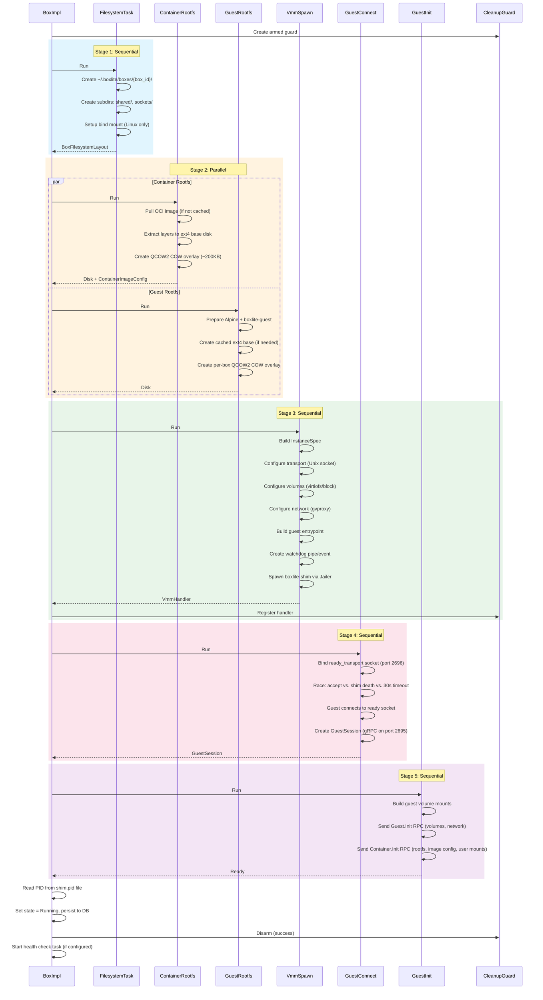

### 3.4 Stage Details

#### FilesystemTask

Creates the box directory structure under `~/.boxlite/boxes/{box_id}/`:

```
{box_id}/
  shared/              # Host-guest shared filesystem (virtiofs/9p)
    containers/{id}/   # Container rootfs workspace
      image/           # Extracted image layers
      rw/              # Read-write overlay
      rootfs/          # Merged rootfs mount point
  sockets/             # Unix domain sockets
  shim.pid             # PID file (written by pre_exec hook)
  shim.stderr          # Shim stderr capture
  console.log          # VM console output
  container.qcow2      # Container rootfs QCOW2 COW disk
  guest.qcow2          # Guest rootfs QCOW2 COW disk
```

On Linux, a bind mount is optionally configured for the `shared/` directory.

#### ContainerRootfsTask

Runs in parallel with `GuestRootfsTask`.

1. **Pull OCI image**: Resolves the image reference (e.g., `alpine:latest`), pulls from registry if not cached, and stores layers in `~/.boxlite/images/`.
2. **Extract layers**: Unpacks each layer tarball, handling whiteout files.
3. **Create ext4 base disk**: Merges all layers into a single ext4 disk image. This base is cached per image digest and shared across boxes.
4. **Create QCOW2 COW overlay**: Creates a thin copy-on-write disk that references the shared base. Initial size is ~200 KB (sparse). Virtual size defaults to 10 GB, configurable via `disk_size_gb`.

On restart (`reuse_rootfs = true`), steps 1-3 are skipped. The existing QCOW2 COW disk is reused, preserving all user modifications from the previous run.

#### GuestRootfsTask

Prepares the guest operating environment (Alpine Linux + `boxlite-guest` binary):

1. Checks `~/.boxlite/bases/` for a cached guest rootfs matching the current version.
2. If not cached, builds a new ext4 disk containing Alpine base + the `boxlite-guest` binary.
3. Creates a per-box QCOW2 COW overlay for the guest rootfs.

#### VmmSpawnTask

The most complex stage. Assembles an `InstanceSpec` and spawns the VM subprocess:

1. **Transport setup**: Creates two Unix socket paths -- one for gRPC communication (port 2695) and one for the ready signal (port 2696). Unix sockets work on all platforms including Windows (via `uds_windows`).
2. **Volume configuration**: Uses `GuestVolumeManager` to collect filesystem shares (virtiofs/9p) and block devices (QCOW2 disks). Configures user volumes with resolved paths and owner UID/GID for idmap.
3. **Network configuration**: Builds `NetworkBackendConfig` with port mappings from the container image's `EXPOSE` directives and user-provided port specs. Configures gvproxy as the network backend. Optionally generates a MITM CA for secrets injection.
4. **Guest entrypoint**: Constructs the command that boots inside the VM: `boxlite-guest --listen {transport_uri} --notify {ready_uri}` with environment variables.
5. **Watchdog creation**: Creates a pipe (Unix) or Event handle (Windows) for parent-death detection.
6. **Shim spawn**: `ShimController` serializes the `InstanceSpec` to JSON, creates a `ShimSpawner` which launches the `boxlite-shim` binary with Jailer isolation (seccomp on Linux, sandbox-exec on macOS). The shim's `pre_exec` hook writes the PID file and sets up FD inheritance.

#### GuestConnectTask

Races three conditions using `tokio::select!`:

1. **Guest ready signal**: The guest agent connects to the ready socket (port 2696) after booting. This is the success path.
2. **Shim process death**: `ProcessMonitor` polls the shim PID. If the process exits during boot, a `CrashReport` is generated from the exit file, console log, and stderr capture.
3. **30-second timeout**: Fallback if neither of the above fires.

After the guest signals ready, a `GuestSession` is created from the main gRPC transport (port 2695).

#### GuestInitTask

Sends two gRPC RPCs to the guest agent:

1. **Guest.Init**: Configures guest-level volumes (filesystem shares and block devices) and network (static IP on eth0 via rtnetlink).
2. **Container.Init**: Sets up the container rootfs (mount ext4 disk, overlay if needed), applies image config (environment, working directory, user), and mounts user volumes inside the container namespace.

### 3.5 CleanupGuard (RAII Rollback)

`CleanupGuard` is armed at the start of the pipeline. If any stage fails and the guard is dropped while armed:

1. Stops the VM handler (if spawned)
2. Preserves diagnostic files (box directory is NOT deleted -- preserved for debugging)
3. Removes the box from `BoxManager` and database
4. Increments the `boxes_failed` runtime metric

On success, the caller calls `cleanup_guard.disarm()` to prevent cleanup.

## 4. State Machine

### 4.1 Status Definitions

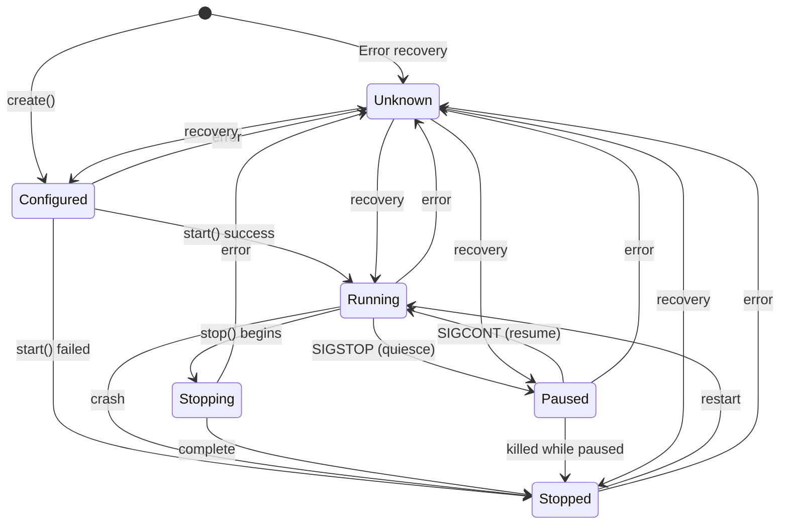

| Status | Description | PID | VM Process |
|--------|-------------|-----|-----------|
| `Unknown` | Cannot determine state (error recovery) | None | Unknown |
| `Configured` | Box created, persisted to DB, no VM started | None | Not allocated |
| `Running` | VM running, guest agent accepting commands | Set | Alive |
| `Stopping` | Graceful shutdown in progress (transient) | Set | Terminating |
| `Stopped` | VM terminated, rootfs preserved, can restart | None | Dead |
| `Paused` | VM frozen via SIGSTOP (quiesce for snapshot/export) | Set | Suspended |

### 4.2 Transition Guards

Each transition is validated at the API level:

| Operation | Allowed From | Behavior |
|-----------|-------------|----------|
| `can_start()` | `Configured`, `Stopped` | First start or restart |
| `can_stop()` | `Running`, `Paused` | Graceful shutdown |
| `can_exec()` | `Configured`, `Running`, `Stopped` | Implicit `start()` if not `Running` |
| `can_remove()` | `Configured`, `Stopped`, `Unknown` | Delete box and all resources |

### 4.3 Idempotency

- `start()` on a `Running` box is a no-op (returns `Ok(())`).
- `stop()` on a `Stopped` box is a no-op (returns `Ok(())`).
- `exec()` on a non-running box triggers implicit `start()`.

## 5. Restart Flow (Stopped -> Running)

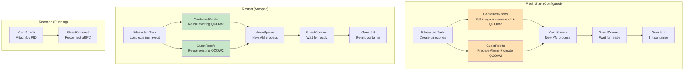

Key differences between fresh start and restart:

| Aspect | Fresh Start | Restart |
|--------|-------------|---------|
| Container rootfs | Pull image, extract layers, create ext4 base + QCOW2 | Reuse existing QCOW2 (preserves user data) |
| Guest rootfs | Create QCOW2 overlay from cached base | Reuse existing QCOW2 |
| VM process | New | New |
| Guest daemon | New | New (must re-init: volumes, network, container) |
| User modifications | None | Preserved in COW layer |

## 6. Reattach Flow (Running, Different Runtime Instance)

When a new `BoxliteRuntime` instance discovers a box in `Running` status (with a valid PID file), it performs a lightweight reattach:

1. **VmmAttachTask**: Creates a `ShimHandler::from_pid(pid, box_id)` -- no `Child` handle, no watchdog keepalive. The handler manages the process by PID only.
2. **GuestConnectTask**: Skips the ready wait (`skip_guest_wait = true`). Creates a `GuestSession` directly from the stored transport.

Reattach is used for:
- CLI commands querying a running box started by a different process.
- Runtime recovery after a process restart where boxes were left running (detached mode).

Limitation: A reattached box has no `Keepalive` handle, so the watchdog will not fire if the new runtime crashes. The original parent's death will still trigger the watchdog if the pipe/event is still valid.

## 7. Command Execution Flow

### 7.1 Host-Side Flow

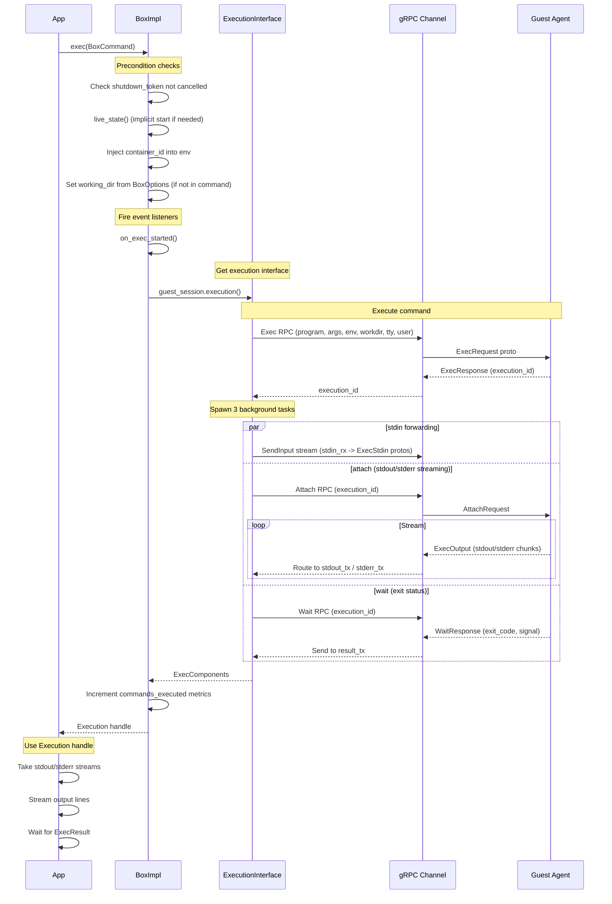

### 7.2 Background Tasks and Cancellation

All three background tasks (stdin, attach, wait) are spawned as Tokio tasks and are cancellable via the box's `shutdown_token`:

- Each task uses `tokio::select!` with `biased` ordering, checking `shutdown_token.cancelled()` first.
- On cancellation, the wait task sends `ExecResult { exit_code: -1 }` to the result channel.
- The attach task breaks out of its streaming loop cleanly.
- The stdin task stops forwarding.

### 7.3 Guest-Side Flow

Inside the VM, the guest agent:

1. Receives the `ExecRequest` via gRPC.
2. Resolves the container by ID.
3. Forks a new process inside the container's namespaces (PID, mount, UTS, IPC, network).
4. `execve`s the requested program with the specified environment.
5. Bridges stdio between the container process and the gRPC streams.
6. Monitors the process via `waitpid`.
7. When the process exits, sends the `WaitResponse` with exit code and signal information.

### 7.4 Execution Handle API

The returned `Execution` handle provides:

| Method | Description |
|--------|-------------|
| `id()` | Unique execution identifier |
| `stdin()` | Take the stdin write stream (once) |
| `stdout()` | Take the stdout read stream (once) |
| `stderr()` | Take the stderr read stream (once) |
| `wait()` | Await `ExecResult` (exit code + optional error message) |
| `kill()` | Send SIGKILL to the process |
| `signal(sig)` | Send arbitrary signal |
| `resize_tty(rows, cols)` | Resize PTY window (TTY mode only) |

## 8. VM Shutdown Flow

### 8.1 Shutdown Sequence

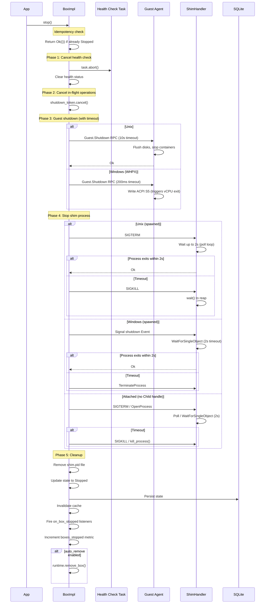

### 8.2 Graceful Shutdown Timeline

```
t=0       stop() called
t=0       Abort health check, cancel shutdown_token
t=0       Guest.Shutdown RPC sent
t=0..10s  Wait for guest to flush disks and stop containers
t=10s     Guest shutdown timeout (if unresponsive)
t=10s     SIGTERM to shim process
t=10..12s Wait for shim to exit
t=12s     SIGKILL if shim still alive
t=12s     Clean up PID file, update DB, invalidate cache
```

### 8.3 State Transitions During Stop

The `stop()` method handles various starting states:

- `Running` -> `Stopped`: Normal shutdown path.
- `Paused` -> `Stopped`: Shim receives SIGTERM while SIGSTOP'd; the kernel delivers SIGTERM after SIGCONT.
- `Configured` -> stays `Configured`: If `stop()` is called before any start, the state stays `Configured` so the next `start()` triggers full initialization.
- `Stopped` -> `Stopped`: Idempotent, returns immediately.

## 9. Watchdog Mechanism

### 9.1 Purpose

The watchdog ensures that if the parent process (the application embedding BoxLite) crashes or is killed, the shim subprocess exits gracefully rather than becoming an orphan.

### 9.2 Unix Implementation (Pipe Trick)

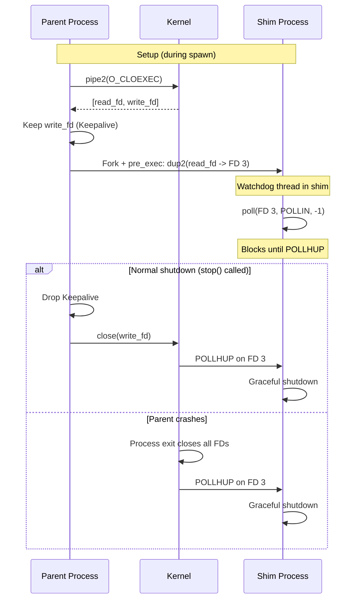

Key properties:
- **Zero-latency**: `POLLHUP` is delivered immediately by the kernel.
- **Tamper-proof**: Based on kernel FD lifecycle, not timers or heartbeats.
- **Namespace-safe**: Works across PID/mount namespaces.
- **CLOEXEC**: Both ends are created with `FD_CLOEXEC` to prevent leaking to unrelated child processes (preventing the orphan shim bug).

### 9.3 Windows Implementation (Event + Process Handle)

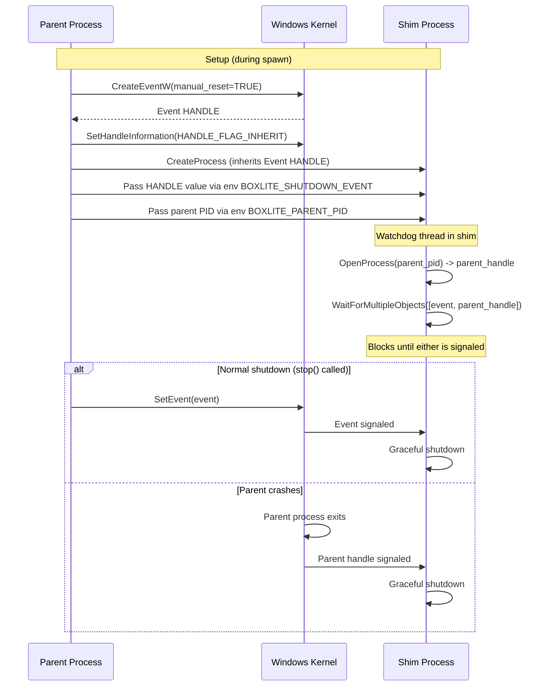

Key properties:
- **Dual detection**: Both explicit signal (SetEvent) and parent death (process handle) are monitored simultaneously.
- **Manual-reset event**: Once signaled, stays signaled -- all waiters wake up.
- **Inheritable handle**: The event handle is inheritable so the child process receives it directly.

### 9.4 Defense-in-Depth

Even if `stop()` is never called, the `ShimHandler`'s `Drop` implementation closes the Keepalive:

- **Unix**: Dropping `Keepalive` closes the pipe write end via `OwnedFd::drop()`, delivering `POLLHUP`.
- **Windows**: Dropping `Keepalive` calls `SetEvent` then `CloseHandle`.

## 10. Quiesce/Pause Protocol

For point-in-time consistent operations (snapshot, export, clone), BoxLite implements a QEMU+libvirt-style quiesce bracket:

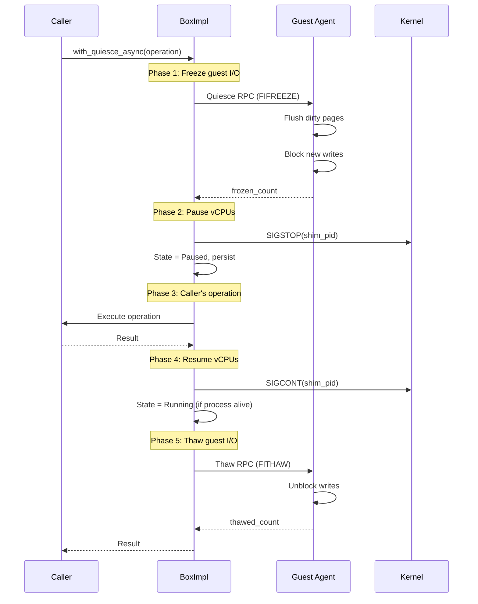

Guest RPCs are best-effort with a 5-second timeout. If quiesce fails, the operation degrades to crash-consistent (SIGSTOP-only), not operation failure.

## 11. Resource Management

### 11.1 CPU

- Default: 1 vCPU
- Configured via `BoxOptions.cpus`
- Passed to libkrun's `krun_set_vm_config`
- Windows (WHPX): Capped at 4 vCPUs due to WHPX API limitations

### 11.2 Memory

- Default: 512 MiB
- Configured via `BoxOptions.memory_mib`
- Passed to libkrun

### 11.3 Disk

- **Container rootfs**: QCOW2 COW overlay on top of a shared ext4 base disk
  - Virtual size: 10 GB (default), configurable via `disk_size_gb`
  - Actual size: ~200 KB (sparse, grows as data is written)
  - Base disk: Cached per image digest, shared across all boxes using the same image
- **Guest rootfs**: QCOW2 COW overlay on top of a versioned Alpine base
  - Base cached in `~/.boxlite/bases/`
- **Resize**: Only performed on fresh start with custom `disk_size_gb`, not on restart

### 11.4 Network

- Backend: gvproxy (userspace networking)
- Guest interface: virtio-net device (eth0)
- Guest IP: Static, configured via rtnetlink
- Port mappings: Merged from image `EXPOSE` directives and user-provided port specs
- Network can be disabled via `NetworkSpec::Disabled`

## 12. Metrics

### 12.1 Box Metrics (`BoxMetrics`)

Queried via `litebox.metrics()`. Includes:

**Runtime counters** (monotonic):
- `commands_executed_total`: Total `exec()` calls
- `exec_errors_total`: Total failed `exec()` calls
- `bytes_sent_total`: Bytes sent via stdin
- `bytes_received_total`: Bytes received via stdout/stderr

**System metrics** (point-in-time snapshot):
- `cpu_percent`: CPU usage (0.0-100.0), from `sysinfo` crate
- `memory_bytes`: Memory usage, from `sysinfo` crate
- `network_bytes_sent/received`: Network I/O (when available)
- `network_tcp_connections/errors`: TCP stats (when available)

**Initialization stage timing** (set once):
- `total_create_duration_ms`: End-to-end init time
- `stage_filesystem_setup_ms`: Directory creation
- `stage_image_prepare_ms`: OCI image pull + layer extraction
- `stage_guest_rootfs_ms`: Guest rootfs preparation
- `stage_box_spawn_ms`: Shim subprocess spawn
- `stage_container_init_ms`: Guest-side container setup

### 12.2 Runtime Metrics (`RuntimeMetrics`)

Queried via `runtime.metrics()`. All counters are atomic and lock-free:

- `boxes_created_total`: Total `create()` calls
- `boxes_failed_total`: Total failed initializations (CleanupGuard fired)
- `boxes_stopped_total`: Total successful `stop()` calls
- `num_running_boxes()`: Calculated as `created - stopped - failed`
- `total_commands_executed`: Aggregate `exec()` across all boxes
- `total_exec_errors`: Aggregate `exec()` errors across all boxes

## 13. Error Handling

### 13.1 Init Failure: CleanupGuard RAII Rollback

When any pipeline stage fails:

1. The `CleanupGuard` fires on drop (armed = true).
2. If a `VmmHandler` was registered, `handler.stop()` is called to terminate the shim.
3. The box directory is **preserved** for debugging (unlike Docker, which deletes everything).
4. The box record is removed from the database via `BoxManager`.
5. The `boxes_failed` metric is incremented.

Error message includes the path to diagnostic files:

```
Box crashed. Diagnostic files preserved at:
  ~/.boxlite/boxes/abc123/

To clean up: rm -rf ~/.boxlite/boxes/abc123/
```

### 13.2 Crash Recovery

On runtime startup, the `BoxManager` scans the database for stale entries:

1. Boxes with `Running` or `Paused` status have their PIDs checked.
2. If the PID is not alive, the box is marked as `Stopped` via `reset_for_reboot()`.
3. PID fields are cleared since all processes are gone after reboot/restart.

### 13.3 Guest Connect Failure Detection

The `GuestConnectTask` races the ready signal against shim process death:

- If the shim process exits during boot, a `CrashReport` is generated immediately (sub-second detection) rather than waiting for the 30-second timeout.
- The crash report includes: exit code, console log excerpts, and stderr capture.

### 13.4 Detached Boxes

Boxes created with `detach: true`:

- Have no watchdog -- the shim survives parent exit.
- The caller is responsible for eventual cleanup.
- Can be reattached from a different runtime instance.

### 13.5 Handle Invalidation

After `stop()` is called, the `shutdown_token` is cancelled. Any subsequent operations on the same `BoxImpl` (via a stale `LiteBox` handle) return:

```
BoxliteError::Stopped("Handle invalidated after stop(). Use runtime.get() to get a new handle.")
```

The runtime cache is invalidated so that `runtime.get()` constructs a fresh `BoxImpl` with a new `OnceCell`.

## 14. Health Check System

When `BoxOptions.advanced.health_check` is configured, a background health check task runs after box initialization:

1. **Start period**: During `start_period`, health checks are skipped (grace period for slow-starting applications).
2. **Periodic pings**: After the start period, the task sends `Guest.Ping` RPCs at the configured `interval`.
3. **State transitions**: `None` -> `Starting` -> `Healthy` (on first success) -> `Unhealthy` (after `retries` consecutive failures).
4. **Recovery**: A successful check after failures resets the failure counter to 0.
5. **Shim death detection**: If the shim process dies, the health check immediately marks the box as `Stopped` + `Unhealthy` and stops.
6. **Cancellation**: The task is cancelled on `stop()` or runtime shutdown.

State changes are persisted to the database and accessible via `box.info().health_status`.
