# In-Depth: Hypervisor and Engine Integration

> How BoxLite bridges safe Rust abstractions to raw hypervisor FFI, manages process takeover,
> and configures virtio devices across Linux, macOS, and Windows.

---

## Part A: Concise Version

### Engine Abstraction at a Glance

BoxLite isolates engine-specific hypervisor logic behind a two-trait abstraction. The `Vmm`
trait creates a configured VM instance; the `VmmInstanceImpl` trait runs it.

```
Vmm::create(InstanceSpec) --> VmmInstance --> VmmInstance::enter()
                                                |
                                          process takeover
                                         (never returns on success)
```

Engines register themselves at compile time using the `inventory` crate. No global
registries, no singletons -- the linker collects all `inventory::submit!` entries and
the runtime iterates them to find the requested engine.

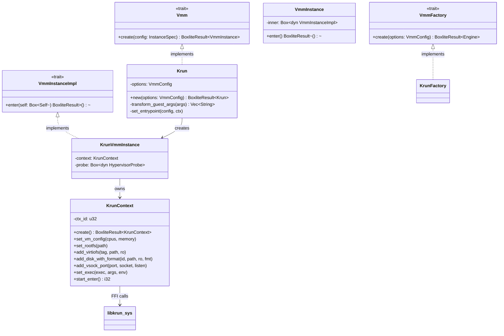

### The libkrun FFI Layer

`libkrun-sys` exposes 30+ C functions from the libkrun shared library. The `KrunContext`
struct provides a safe-ish Rust wrapper that:

- Owns a `ctx_id` (freed via `krun_free_ctx` on drop)
- Converts Rust strings to `CString` for all path/string arguments
- Routes all error codes through `check_status()`, with special diagnostics for `-22` (EINVAL)

### Process Takeover and the Shim Architecture

`krun_start_enter()` hijacks the calling process -- it never returns on success.
BoxLite solves this by spawning a `boxlite-shim` subprocess that absorbs the takeover:

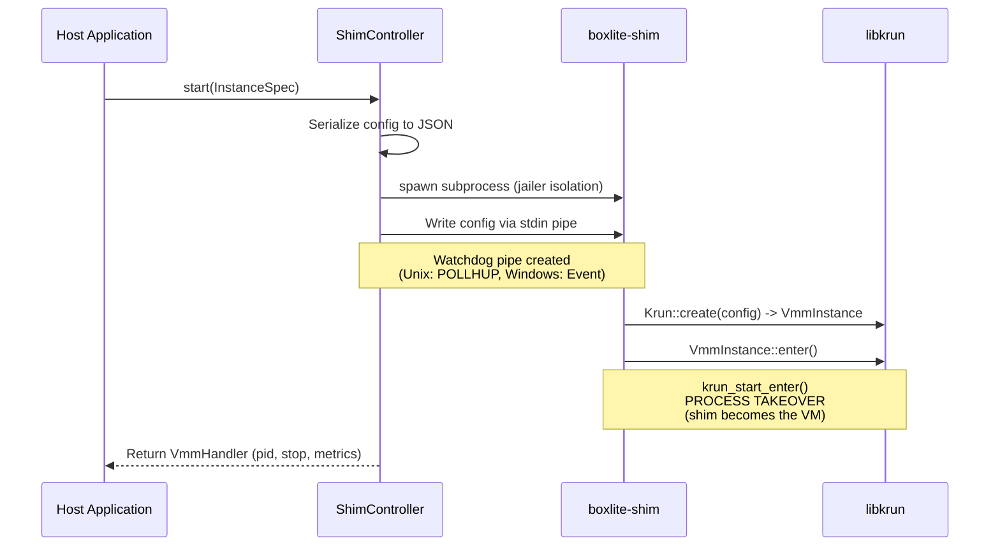

### Transport Transformation

The host communicates via Unix sockets (or TCP on Windows), but the guest sees vsock.
The Krun engine transforms entrypoint arguments at VM creation time:

| Host Argument | Guest Sees |
|---|---|
| `--listen unix:///path/grpc.sock` | `--listen vsock://2695` |
| `--notify unix:///path/ready.sock` | `--notify vsock://2696` |
| `--listen tcp://127.0.0.1:12345` | `--listen vsock://2695` |

The `krun_add_vsock_port2` FFI call bridges each host socket to a guest vsock port.

### Virtio Device Topology

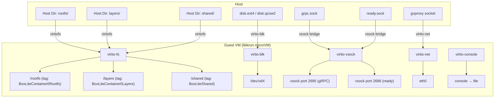

### Cross-Platform Summary

| Aspect | Linux (KVM) | macOS (HVF) | Windows (WHPX) |
|---|---|---|---|
| Hypervisor | KVM kernel module | Hypervisor.framework | Hyper-V Platform |
| Kernel firmware | Embedded in libkrunfw (.so) | Embedded in libkrunfw (compiled) | External vmlinuz file |
| Network backend | gvproxy (UnixStream) | gvproxy (UnixDgram + VFKIT) | gvproxy (TCP) |
| vCPU limit | Unlimited | Unlimited | 4 vCPUs |
| Overlayfs rootfs | Yes (CAP_SYS_ADMIN) | No (extracted fallback) | No (extracted fallback) |
| Watchdog mechanism | Pipe POLLHUP | Pipe POLLHUP | Event + parent handle |

---

## Part B: Comprehensive Version

### 1. Engine Abstraction Layer

BoxLite defines a pluggable engine abstraction so that different hypervisor backends can be
swapped at compile time. Today, libkrun is the only production implementation, but the
architecture allows adding Firecracker or other VMMs without touching core runtime code.

#### 1.1 Core Traits

Three traits define the contract:

**`Vmm` -- Engine-level VM creation** (`vmm/engine.rs`)

```rust
pub trait Vmm {
    fn create(&mut self, config: InstanceSpec) -> BoxliteResult<VmmInstance>;
}
```

Takes a complete `InstanceSpec` (CPU count, memory, filesystem shares, block devices,
entrypoint, network config, rootfs strategy) and returns a fully configured but not-yet-started
`VmmInstance`.

**`VmmInstanceImpl` -- Instance-level execution** (`vmm/engine.rs`)

```rust
pub(crate) trait VmmInstanceImpl {
    fn enter(self: Box<Self>) -> BoxliteResult<()>;
}
```

Consumes `self` because `enter()` may never return (process takeover). The `Box<Self>`
signature enables dynamic dispatch while allowing move semantics.

**`VmmFactory` -- Engine construction** (`vmm/factory.rs`)

```rust
pub trait VmmFactory {
    type Engine: Vmm;
    fn create(options: VmmConfig) -> BoxliteResult<Self::Engine>;
}
```

Creates an engine instance from a `VmmConfig` (CPU count, memory MiB).

#### 1.2 VmmInstance Wrapper

`VmmInstance` is a public type that wraps `Box<dyn VmmInstanceImpl>`, hiding the internal
trait from external callers:

```rust
pub struct VmmInstance {
    inner: Box<dyn VmmInstanceImpl>,
}

impl VmmInstance {
    pub fn enter(self) -> BoxliteResult<()> {
        self.inner.enter()
    }
}
```

This design means callers only interact with `VmmInstance`, never with `KrunVmmInstance`
or other engine-specific types.

#### 1.3 Engine Registration via `inventory`

Engines register themselves at compile time using the `inventory` crate. This eliminates
runtime registration, global HashMaps, and singleton patterns.

**Registration entry:**

```rust
pub struct EngineFactoryRegistration {
    pub kind: VmmKind,
    pub factory: EngineFactoryFn,  // fn(VmmConfig) -> BoxliteResult<Box<dyn Vmm>>
}

inventory::collect!(EngineFactoryRegistration);
```

**Krun registers itself** (`vmm/krun/factory.rs`):

```rust
inventory::submit! {
    EngineFactoryRegistration {
        kind: VmmKind::Libkrun,
        factory: |options| {
            Ok(Box::new(KrunFactory::create(options)?))
        }
    }
}
```

**Engine lookup** (`vmm/registry.rs`):

```rust
pub fn create_engine(kind: VmmKind, options: VmmConfig) -> BoxliteResult<Box<dyn Vmm>> {
    for registration in inventory::iter::<EngineFactoryRegistration> {
        if registration.kind == kind {
            return (registration.factory)(options);
        }
    }
    Err(BoxliteError::Engine(format!(
        "Engine {:?} is not registered. Available engines: {:?}",
        kind, available
    )))
}
```

#### 1.4 VmmKind and VmmConfig

```rust
pub enum VmmKind {
    #[default]
    Libkrun,
    Firecracker,  // Reserved, not yet implemented
}

pub struct VmmConfig {
    pub cpus: Option<u8>,        // Default: DEFAULT_CPUS
    pub memory_mib: Option<u32>, // Default: DEFAULT_MEMORY_MIB
}
```

#### 1.5 InstanceSpec -- The Complete VM Blueprint

`InstanceSpec` is the single configuration struct that flows from the runtime through the
shim to the engine. It contains everything needed to create a VM:

| Field | Type | Purpose |
|---|---|---|
| `engine` | `VmmKind` | Which engine to use |
| `box_id` | `String` | Unique box identifier |
| `security` | `SecurityOptions` | Jailer/sandbox configuration |
| `cpus` | `Option<u8>` | vCPU count |
| `memory_mib` | `Option<u32>` | Memory allocation |
| `fs_shares` | `FsShares` | Virtiofs host-to-guest shares |
| `block_devices` | `BlockDevices` | Virtio-blk disk attachments |
| `guest_entrypoint` | `Entrypoint` | Executable, args, and env |
| `transport` | `Transport` | Host gRPC socket/address |
| `ready_transport` | `Transport` | Host ready-notification socket |
| `guest_rootfs` | `GuestRootfs` | Rootfs path and assembly strategy |
| `network_config` | `Option<NetworkBackendConfig>` | Port mappings (shim creates gvproxy) |
| `network_backend_endpoint` | `Option<NetworkBackendEndpoint>` | Socket path from gvproxy (set by shim, not serialized) |
| `disable_network` | `bool` | Disable TSI network forwarding |
| `home_dir` | `PathBuf` | `~/.boxlite` or `BOXLITE_HOME` |
| `console_output` | `Option<PathBuf>` | Redirect kernel/init output |
| `exit_file` | `PathBuf` | Crash diagnostics file (Podman pattern) |
| `detach` | `bool` | Survive parent death |

The `InstanceSpec` is serialized to JSON and sent to the shim subprocess via stdin pipe.

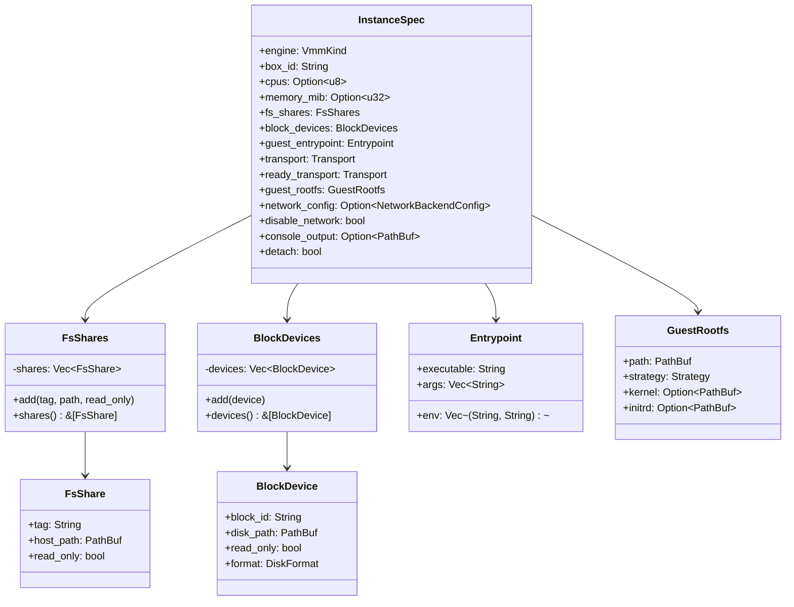

---

### 2. libkrun-sys FFI Bindings

The `src/deps/libkrun-sys/` crate provides raw, unsafe C bindings to the libkrun shared
library. These are the lowest-level building blocks -- no safety guarantees, no error
context, just `extern "C"` function signatures.

#### 2.1 Complete FFI Function Reference

**Context lifecycle:**

| FFI Function | Signature | Purpose |
|---|---|---|
| `krun_create_ctx` | `() -> i32` | Create a new VM configuration context. Returns ctx_id (>= 0) or negative error. |
| `krun_free_ctx` | `(ctx_id: u32) -> i32` | Free a configuration context and release resources. |
| `krun_init_log` | `(target, level, style, flags) -> i32` | Initialize logging subsystem. Must be called before any context creation. |
| `krun_set_log_level` | `(level: u32) -> i32` | Set the log verbosity level. |

**VM configuration:**

| FFI Function | Signature | Purpose |
|---|---|---|
| `krun_set_vm_config` | `(ctx_id, num_vcpus: u8, ram_mib: u32) -> i32` | Set CPU count and memory allocation. |
| `krun_set_kernel` | `(ctx_id, kernel_path, format, initramfs, cmdline) -> i32` | Set external kernel/initrd (Windows WHPX only -- on Linux/macOS the kernel is embedded in libkrunfw). |

**Root filesystem:**

| FFI Function | Signature | Purpose |
|---|---|---|
| `krun_set_root` | `(ctx_id, root_path) -> i32` | Set the guest root filesystem path (virtiofs-based boot). |
| `krun_set_root_disk_remount` | `(ctx_id, device, fstype, options) -> i32` | Boot from a block device. Libkrun creates a dummy virtiofs root, runs init, then pivots to the disk. |

**Virtiofs filesystem shares:**

| FFI Function | Signature | Purpose |
|---|---|---|
| `krun_add_virtiofs` | `(ctx_id, mount_tag, host_path) -> i32` | Add a virtiofs share (legacy, no read-only control). |
| `krun_add_virtiofs3` | `(ctx_id, mount_tag, host_path, shm_size, read_only) -> i32` | Add a virtiofs share with shared memory size and read-only flag. |

**Block devices:**

| FFI Function | Signature | Purpose |
|---|---|---|
| `krun_add_disk` | `(ctx_id, block_id, disk_path, read_only) -> i32` | Attach a raw disk image via virtio-blk. |
| `krun_add_disk2` | `(ctx_id, block_id, disk_path, disk_format, read_only) -> i32` | Attach a disk image with explicit format (raw=0, qcow2=1). |

**Networking:**

| FFI Function | Signature | Purpose |
|---|---|---|
| `krun_add_net` | `(ctx_id, endpoint, mac) -> i32` | Add TCP-based network backend (Windows). |
| `krun_add_net_unixstream` | `(ctx_id, path, fd, mac, features, flags) -> i32` | Add Unix stream socket network backend. |
| `krun_add_net_unixgram` | `(ctx_id, path, fd, mac, features, flags) -> i32` | Add Unix datagram socket network backend with VFKIT handshake. |

**Vsock:**

| FFI Function | Signature | Purpose |
|---|---|---|
| `krun_disable_implicit_vsock` | `(ctx_id) -> i32` | Remove the default vsock device (which has TSI enabled). |
| `krun_add_vsock` | `(ctx_id, tsi_features) -> i32` | Add an explicit vsock with specified TSI feature flags. |
| `krun_add_vsock_port2` | `(ctx_id, port, filepath, listen) -> i32` | Bridge a guest vsock port to a host Unix socket. |

**Process execution:**

| FFI Function | Signature | Purpose |
|---|---|---|
| `krun_set_exec` | `(ctx_id, exec_path, argv, envp) -> i32` | Set the entrypoint binary, arguments, and environment. |
| `krun_set_env` | `(ctx_id, envp) -> i32` | Set additional environment variables. |
| `krun_set_workdir` | `(ctx_id, workdir_path) -> i32` | Set the working directory for the entrypoint. |

**VM lifecycle:**

| FFI Function | Signature | Purpose |
|---|---|---|
| `krun_start_enter` | `(ctx_id) -> i32` | **PROCESS TAKEOVER.** Start the VM and hijack the calling process. Never returns on success. Returns negative on error, positive on guest exit. |
| `krun_start` | `(ctx_id) -> i32` | Start the VM on a background thread (non-blocking). |
| `krun_wait` | `(ctx_id) -> i32` | Block until the VM exits. Returns guest exit code. |
| `krun_stop` | `(ctx_id) -> i32` | Force-stop a running VM. |

**Console and misc:**

| FFI Function | Signature | Purpose |
|---|---|---|
| `krun_set_console_output` | `(ctx_id, filepath) -> i32` | Redirect kernel/init console output to a file. |
| `krun_get_console_output` | `(ctx_id, buf, buf_size) -> i32` | Read console output buffer. |
| `krun_set_rlimits` | `(ctx_id, rlimits) -> i32` | Set guest resource limits (e.g., RLIMIT_NPROC, RLIMIT_NOFILE). |
| `krun_set_port_map` | `(ctx_id, port_map) -> i32` | Configure port mappings. |
| `krun_split_irqchip` | `(ctx_id, enable) -> i32` | Enable split IRQ chip mode. |
| `krun_set_nested_virt` | `(ctx_id, enabled) -> i32` | Enable nested virtualization. |
| `krun_set_gpu_options` | `(ctx_id, virgl_flags) -> i32` | Configure GPU passthrough options. |
| `krun_setuid` | `(ctx_id, uid) -> i32` | Set the VM process UID (Unix only). |
| `krun_setgid` | `(ctx_id, gid) -> i32` | Set the VM process GID (Unix only). |

#### 2.2 Constants

```rust
// Log targets
pub const KRUN_LOG_TARGET_DEFAULT: i32 = 0;
pub const KRUN_LOG_TARGET_STDOUT: i32 = 1;
pub const KRUN_LOG_TARGET_STDERR: i32 = 2;

// Log levels
pub const KRUN_LOG_LEVEL_OFF: u32   = 0;
pub const KRUN_LOG_LEVEL_ERROR: u32 = 1;
pub const KRUN_LOG_LEVEL_WARN: u32  = 2;
pub const KRUN_LOG_LEVEL_INFO: u32  = 3;
pub const KRUN_LOG_LEVEL_DEBUG: u32 = 4;
pub const KRUN_LOG_LEVEL_TRACE: u32 = 5;

// Disk formats
pub const KRUN_DISK_FORMAT_RAW: u32   = 0;
pub const KRUN_DISK_FORMAT_QCOW2: u32 = 1;
```

---

### 3. KrunContext -- Safe FFI Wrapper

`KrunContext` (`vmm/krun/context.rs`, ~660 lines) wraps a libkrun context ID and provides
safe-ish Rust methods for all FFI calls. It implements `Drop` to ensure context cleanup.

#### 3.1 Ownership and Lifecycle

```rust
pub struct KrunContext {
    ctx_id: u32,
}

impl Drop for KrunContext {
    fn drop(&mut self) {
        unsafe { let _ = krun_free_ctx(self.ctx_id); }
    }
}
```

The context is created via `KrunContext::create()` which calls `krun_create_ctx()` and
checks for negative return values. All subsequent calls use the stored `ctx_id`.

#### 3.2 Safety Pattern

All methods are marked `unsafe` because they call into C code. Each method follows
this pattern:

1. Convert Rust `&str` to `CString` (with error handling for null bytes)
2. Call the FFI function with `CString::as_ptr()`
3. Route the return code through `check_status()`

```rust
pub unsafe fn set_rootfs(&self, rootfs: &str) -> BoxliteResult<()> {
    let rootfs_c = CString::new(rootfs)
        .map_err(|e| BoxliteError::Engine(format!("invalid rootfs path: {e}")))?;
    check_status("krun_set_root", unsafe {
        krun_set_root(self.ctx_id, rootfs_c.as_ptr())
    })
}
```

#### 3.3 Error Handling -- check_status()

The `check_status` function converts negative return codes into `BoxliteError::Engine`.
It has special handling for `-22` (EINVAL), the most common error:

```rust
pub(crate) fn check_status(label: &str, status: i32) -> BoxliteResult<()> {
    if status < 0 {
        if status == -22 {
            return Err(BoxliteError::Engine(format!(
                "libkrun function '{}' returned EINVAL (-22). Possible causes:\n\
                 - macOS: VM address space limit reached (kern.hv.max_address_spaces)\n\
                 - Invalid rootfs structure (missing kernel or initrd)\n\
                 Run `boxlite list` to check active boxes.",
                label
            )));
        }
        Err(BoxliteError::Engine(format!(
            "libkrun function '{}' failed with status {}",
            label, status
        )))
    } else {
        Ok(())
    }
}
```

#### 3.4 Key Methods Summary

| Method | FFI Call | Notes |
|---|---|---|
| `create()` | `krun_create_ctx` | Returns `BoxliteResult<Self>` |
| `set_vm_config()` | `krun_set_vm_config` | CPU + memory |
| `set_rootfs()` | `krun_set_root` | Virtiofs-based boot |
| `set_root_disk_remount()` | `krun_set_root_disk_remount` | Disk-based boot |
| `set_kernel()` | `krun_set_kernel` | Windows WHPX only |
| `add_virtiofs()` | `krun_add_virtiofs3` | With read-only flag |
| `add_disk_with_format()` | `krun_add_disk2` | Raw or QCOW2 |
| `add_net_path()` | `krun_add_net_unixstream` / `krun_add_net_unixgram` | Platform-specific |
| `add_net()` | `krun_add_net` | Windows TCP only |
| `disable_implicit_vsock()` | `krun_disable_implicit_vsock` | For network=disabled mode |
| `add_vsock()` | `krun_add_vsock` | With TSI feature flags |
| `add_vsock_port()` | `krun_add_vsock_port2` | Socket-to-vsock bridge |
| `set_exec()` | `krun_set_exec` | Entrypoint + argv + envp |
| `set_console_output()` | `krun_set_console_output` | Console redirection |
| `start_enter()` | `krun_start_enter` | **Process takeover** |
| `start()` | `krun_start` | Non-blocking start |
| `wait()` | `krun_wait` | Block until exit |
| `stop()` | `krun_stop` | Force kill |

---

### 4. Krun Engine Implementation

The `Krun` struct (`vmm/krun/engine.rs`) implements `Vmm` and orchestrates the full VM
creation sequence.

#### 4.1 Complete Creation Flow

The `Krun::create()` method follows a strict ordering -- each step depends on the
previous one, and several steps must happen before the irreversible `start_enter()`.

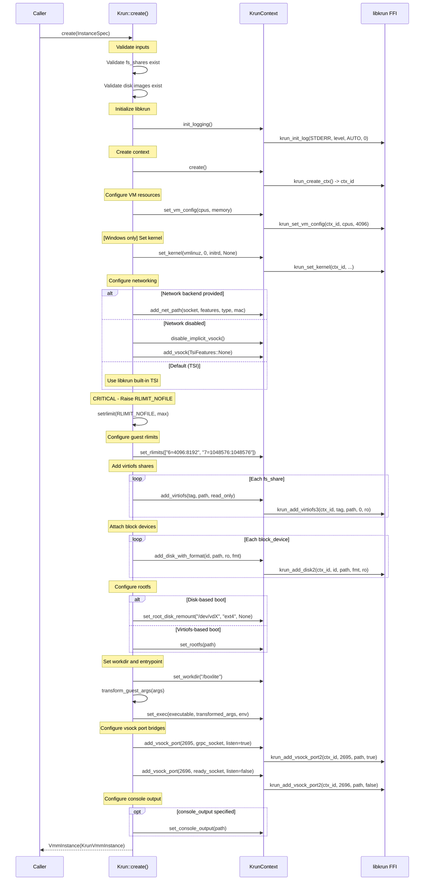

#### 4.2 Step-by-Step Breakdown

**Step 1: Input validation.** Before touching FFI, the engine validates that all
filesystem share directories and disk image files exist on the host. This catches
configuration errors before the point of no return.

**Step 2: Logging initialization.** `KrunContext::init_logging()` maps the `RUST_LOG`
environment variable to libkrun's log level constants. This must happen before any
context creation.

**Step 3: Context creation.** `krun_create_ctx()` allocates internal state in libkrun
and returns a context ID. The `KrunContext` struct owns this ID.

**Step 4: VM resources.** `krun_set_vm_config()` sets vCPU count and memory. On Windows
WHPX, vCPU count is clamped to 4 due to WHPX partition constraints (previously capped
at 2 due to a BSP hang bug -- fixed by adding `vcpu_running` flags so the timer thread
only cancels actually-running vCPUs).

**Step 5: Kernel (Windows only).** On Linux and macOS, the kernel is embedded in
libkrunfw -- there is nothing to load. On Windows WHPX, the kernel is not embedded;
`krun_set_kernel()` loads an external `vmlinuz` file and optional `initrd.img`.

**Step 6: Networking.** Three modes:
- **External backend:** gvproxy provides a Unix socket. The engine calls
  `add_net_unixstream` (passt) or `add_net_unixgram` (gvproxy/VFKIT) with feature flags.
  On Windows, `add_net` takes a TCP endpoint.
- **Disabled:** Replace the implicit vsock (which has TSI hijacking) with an explicit one
  that has zero TSI features. Vsock IPC ports still work, but guest sockets are not
  forwarded through the host.
- **Default (TSI):** Use libkrun's built-in Transparent Socket Impersonation. Guest
  AF_INET/AF_UNIX sockets are transparently forwarded through the host kernel.

**Step 7: RLIMIT_NOFILE.** Virtiofs is a userspace file server inside the VMM process.
Each shared file consumes a file descriptor. BoxLite raises `RLIMIT_NOFILE` to the
hard limit before mounting any virtiofs shares to prevent "too many open files" errors
under heavy container workloads.

**Step 8: Guest rlimits.** Configures resource limits that will be applied inside the
guest VM:
- `RLIMIT_NPROC` (6) = 4096 soft / 8192 hard
- `RLIMIT_NOFILE` (7) = 1048576 soft / 1048576 hard

**Step 9: Virtiofs shares.** Each `FsShare` becomes a virtiofs mount in the guest.
Standard tags are:

| Mount Tag | Purpose |
|---|---|
| `BoxLiteContainer0Rootfs` | Container root filesystem |
| `BoxLiteContainer0Layers` | OCI image layers |
| `BoxLiteShared` | User-facing shared directory |

**Step 10: Block devices.** Disk images are attached via virtio-blk. Each device gets
a `block_id` (e.g., "vda", "vdb") and appears as `/dev/vdX` in the guest. Supported
formats:

| Format | Constant | Use Case |
|---|---|---|
| Raw | `KRUN_DISK_FORMAT_RAW` (0) | Direct block access, best performance |
| QCOW2 | `KRUN_DISK_FORMAT_QCOW2` (1) | Copy-on-write, snapshots, thin provisioning |

**Step 11: Root filesystem.** Two strategies:
- **Virtiofs boot:** `krun_set_root(path)` points to a directory that becomes `/` in the guest.
- **Disk boot:** `krun_set_root_disk_remount("/dev/vda", "ext4", None)` boots from a block
  device. Libkrun creates a temporary virtiofs root with just the init binary, boots from it,
  then pivots to the disk-based root via automatic remount.

**Step 12: Entrypoint.** `krun_set_exec()` configures the guest agent binary, its arguments
(after transport transformation), and environment variables. The working directory is set
to `/boxlite`.

**Step 13: Vsock bridges.** Two vsock ports are bridged to host Unix sockets:

| Port | Purpose | `listen` Flag |
|---|---|---|
| 2695 | gRPC communication (host-to-guest) | `true` -- libkrun creates the socket, host connects to it |
| 2696 | Ready notification (guest-to-host) | `false` -- host creates the socket, guest connects to it |

Port numbers are mnemonics: 2695 = "BOXL" and 2696 = "BOXM" on a phone keypad.

**Step 14: Console output.** Optionally redirects kernel and init messages to a file for
post-mortem debugging.

---

### 5. Transport Transformation

The guest VM cannot access Unix sockets on the host filesystem. Instead, libkrun bridges
host sockets to guest vsock ports. The engine must transform entrypoint arguments so the
guest agent listens on vsock instead of the host's Unix socket or TCP address.

#### 5.1 Transformation Logic

`Krun::transform_guest_args()` handles four transformation cases:

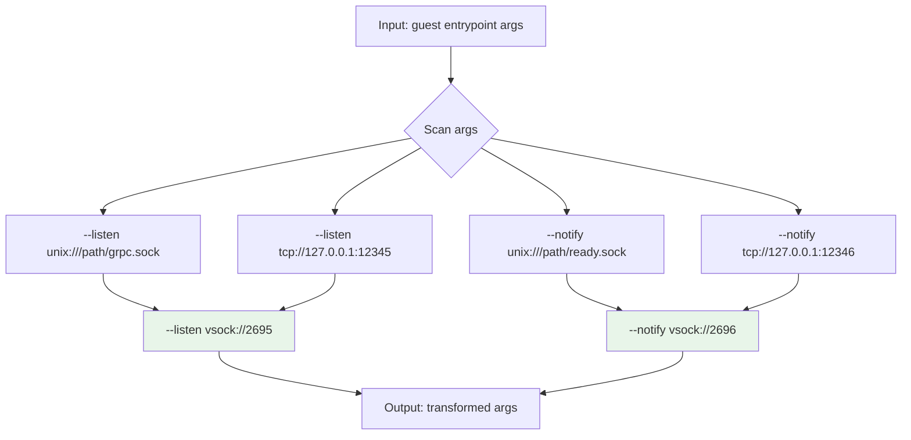

#### 5.2 Two Argument Formats

The transformation handles two argument formats:

**Separate arguments:**
```
["--listen", "unix:///tmp/boxlite.sock", "--notify", "unix:///tmp/ready.sock"]
   -->
["--listen", "vsock://2695", "--notify", "vsock://2696"]
```

**Shell command string:**
```
["-c", "exec boxlite-guest --listen unix:///tmp/boxlite.sock --notify unix:///tmp/ready.sock"]
   -->
["-c", "exec boxlite-guest --listen vsock://2695 --notify vsock://2696"]
```

The shell command case is needed because the entrypoint may use `exec` to replace the
shell process with the guest agent.

#### 5.3 Platform-Specific Transport

| Platform | Host Transport | Guest Transport | Transformation |
|---|---|---|---|
| Linux | `unix:///path/to/socket` | `vsock://PORT` | Unix to vsock |
| macOS | `unix:///path/to/socket` | `vsock://PORT` | Unix to vsock |
| Windows | `tcp://127.0.0.1:PORT` | `vsock://PORT` | TCP to vsock |

The engine applies both Unix and TCP transformations unconditionally -- only one will
match on any given platform.

---

### 6. Process Takeover and Shim Architecture

#### 6.1 The Problem

`krun_start_enter()` is a process takeover function: on success, the calling process
becomes the VM and never returns. This is incompatible with:
- A host application that needs to continue running
- Test harnesses
- Any process that manages multiple VMs

#### 6.2 The Solution: boxlite-shim

BoxLite spawns a `boxlite-shim` subprocess that absorbs the process takeover. The
parent application retains a handler with the shim's PID for lifecycle management.

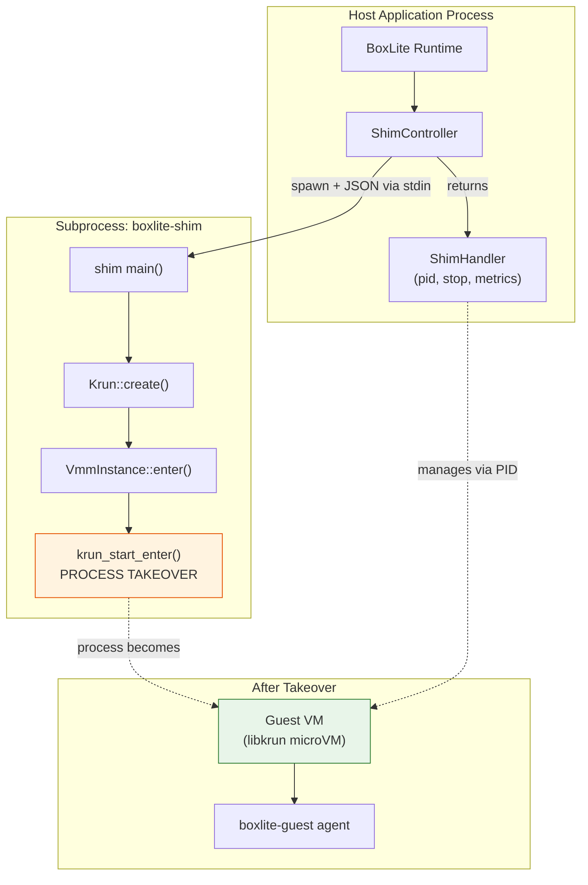

#### 6.3 ShimSpawner -- Subprocess Creation

`ShimSpawner` (`vmm/controller/spawn.rs`) handles the full subprocess creation sequence:

1. **Create watchdog** (non-detached only).
   - Unix: pipe pair with `FD_CLOEXEC`
   - Windows: named Event object (inheritable, manual-reset)

2. **Build jailer.** `JailerBuilder` creates an OS-specific sandbox:
   - Linux: seccomp + cgroup + namespace isolation
   - macOS: `sandbox-exec` with deny-default profile
   - Windows: Job Object (process group isolation)

3. **Prepare isolation.** `jail.prepare()` sets up cgroups (Linux) or is a no-op (macOS).

4. **Build command.** `jail.command()` wraps the binary in isolation. No CLI arguments --
   the config is sent via stdin pipe to avoid `/proc/cmdline` exposure (which would leak
   CA private keys and secrets).

5. **Configure environment.** Passes `RUST_LOG`, `RUST_BACKTRACE`, and library search
   paths. When using the built-in macOS seatbelt profile, `TMPDIR`/`TMP`/`TEMP` are
   redirected to a box-scoped directory.

6. **Configure stdio.**
   - `stdin`: piped (for config JSON)
   - `stdout`: null
   - `stderr`: redirected to a file (captures pre-main dyld errors)

7. **Spawn.** On Windows, `CREATE_SUSPENDED` flag eliminates the TOCTOU window between
   spawn and Job Object assignment.

8. **Post-spawn sandbox.** `jail.post_spawn()` assigns the process to a Job Object (Windows).

9. **Resume.** On Windows, `resume_suspended_process()` enumerates threads via Toolhelp32
   and resumes each one.

10. **Write config.** Config JSON is written to the child's stdin, then stdin is closed
    (shim reads until EOF).

11. **Close child FD.** The read end of the watchdog pipe is closed in the parent.

12. **Write PID file.** On Windows only (Unix writes PID via `pre_exec` hook after fork).

#### 6.4 ShimHandler -- Runtime Operations

`ShimHandler` (`vmm/controller/shim.rs`) provides lifecycle operations on a running VM:

| Method | Behavior |
|---|---|
| `pid()` | Return the shim process ID |
| `is_running()` | Check if the process is alive |
| `stop()` | Graceful shutdown: SIGTERM (Unix) / signal Event (Windows), wait 2s, then SIGKILL / force-kill |
| `metrics()` | CPU usage and memory via `sysinfo` crate (uses shared `System` for delta calculation) |

Two construction modes:
- `from_spawned(SpawnedShim)` -- owns the `Child` handle and watchdog `Keepalive`
- `from_pid(pid)` -- attach to an existing VM (reconnection mode, no keepalive)

**Defense-in-depth:** Even if `stop()` is never called, dropping the `ShimHandler` drops
the `Keepalive`, which triggers shim shutdown automatically.

#### 6.5 VmmController Trait

```rust
#[async_trait]
pub trait VmmController: Send {
    async fn start(&mut self, bundle: &InstanceSpec) -> BoxliteResult<Box<dyn VmmHandler>>;
}
```

`ShimController` implements this trait. The `start()` method:
1. Clones and serializes the `InstanceSpec` to JSON
2. Cleans up stale Unix sockets
3. Creates a `ShimSpawner` and calls `spawn()`
4. Returns a `ShimHandler` for runtime operations

---

### 7. Watchdog -- Parent Death Detection

The watchdog ensures that shim subprocesses do not become orphans when the parent
application crashes or exits unexpectedly.

#### 7.1 Unix: Pipe Trick

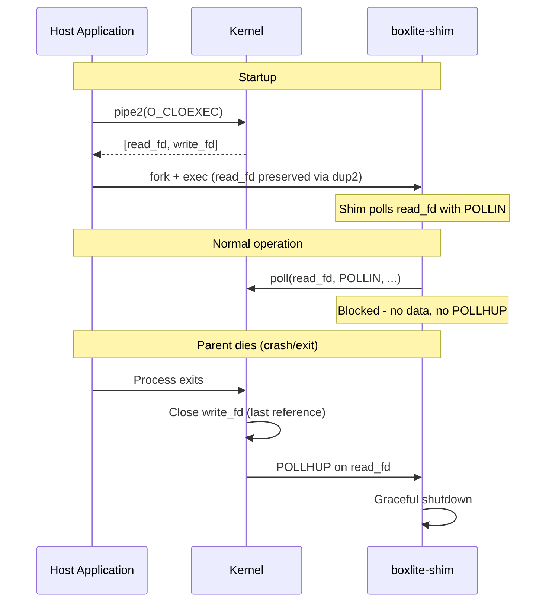

Key properties:
- **Zero latency:** POLLHUP fires immediately when the write end closes.
- **Tamper-proof:** Kernel FDs cannot be faked.
- **Namespace-safe:** Works across PID/mount namespaces.
- **FD_CLOEXEC:** Both pipe ends have CLOEXEC set to prevent leaking to unrelated child
  processes. Without this, a child process (e.g., spawned by VS Code) could inherit the
  write end, preventing POLLHUP from firing when the parent dies.

This is the same mechanism used by s6, containerd-shim, runc, crun, and conmon.

#### 7.2 Windows: Event + Parent Handle

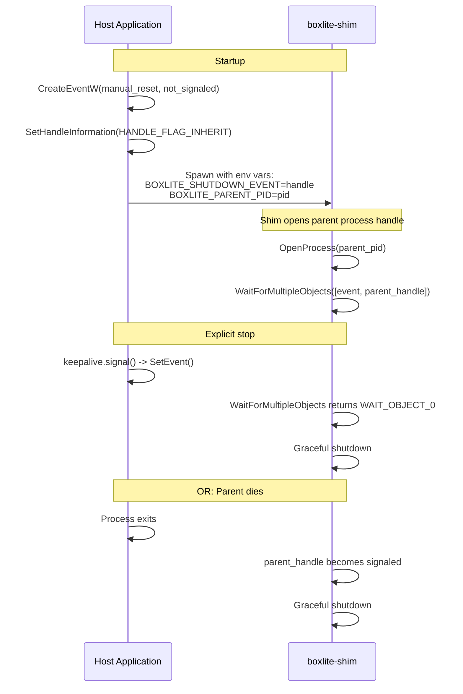

Two detection mechanisms run in parallel:
- **Event handle:** Parent calls `SetEvent()` on explicit stop. Also signaled in
  `Keepalive::drop()` for defense-in-depth.
- **Parent process handle:** When the parent process exits, its handle becomes signaled.
  `WaitForMultipleObjects` wakes on whichever fires first.

---

### 8. Virtio Device Setup

The guest VM sees a set of virtio devices configured by the Krun engine. Each device
type serves a specific purpose in the BoxLite architecture.

#### 8.1 Virtio-fs (virtiofs)

Virtiofs shares expose host directories to the guest via FUSE-over-virtio. The guest
agent mounts them using mount tags.

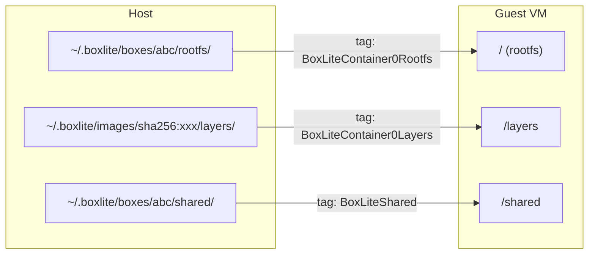

**RLIMIT_NOFILE requirement:** Virtiofs is a userspace file server inside the VMM process.
Each file accessed by the guest consumes a file descriptor in the host process. BoxLite
raises `RLIMIT_NOFILE` to the hard maximum *before* adding any virtiofs shares. Without
this, container workloads that touch many files simultaneously would hit "too many open
files" errors.

#### 8.2 Virtio-blk

Block devices attach disk images to the guest as `/dev/vdX` devices.

| Property | Value |
|---|---|
| Device naming | `/dev/vda`, `/dev/vdb`, etc. |
| Supported formats | Raw (`KRUN_DISK_FORMAT_RAW` = 0), QCOW2 (`KRUN_DISK_FORMAT_QCOW2` = 1) |
| Access modes | Read-write, read-only |
| Security note | QCOW2 images can reference backing files, which libkrun opens automatically |

Used for:
- Guest rootfs disk images (ext4, booted via `set_root_disk_remount`)
- Persistent storage volumes
- Scratch disks

#### 8.3 Virtio-console

Redirects kernel and init output to a file on the host. Configured via
`krun_set_console_output()`. This is invaluable for debugging boot failures --
without it, early kernel messages would be lost.

#### 8.4 Virtio-vsock

Vsock provides zero-copy, zero-configuration host-guest communication. BoxLite uses
two mechanisms:

**Port bridging** via `krun_add_vsock_port2()`:

```
Host Unix socket  <-->  vsock port 2695  (gRPC: host-to-guest commands)
Host Unix socket  <-->  vsock port 2696  (Ready: guest-to-host notification)
```

The `listen` flag controls who creates the socket:
- `listen=true` (port 2695): libkrun creates the Unix socket and listens. The host
  runtime connects to it.
- `listen=false` (port 2696): The host runtime creates and listens on the Unix socket.
  The guest connects to it.

**TSI (Transparent Socket Impersonation)** via `krun_add_vsock()`:

TSI transparently forwards guest socket operations through the host kernel. This enables
the guest to access the internet without explicit network configuration.

```rust
pub enum TsiFeatures {
    None,        // 0: No forwarding (vsock IPC only)
    HijackInet,  // 1: Forward AF_INET (TCP/UDP)
    HijackUnix,  // 2: Forward AF_UNIX
    HijackAll,   // 3: Forward both
}
```

When `network_config` is `None` and `disable_network` is `false`, libkrun's default
vsock has TSI enabled with `HijackAll`, giving the guest transparent internet access.

When `disable_network` is `true`, BoxLite replaces the implicit vsock with an explicit
one using `TsiFeatures::None`. The vsock IPC ports (2695, 2696) still work for host-guest
gRPC, but guest sockets are not forwarded.

#### 8.5 Virtio-net

External network backends (gvproxy) provide a virtio-net device with a real MAC address
and full TCP/IP networking. The guest sees an `eth0` interface.

**Feature flags** (from the virtio specification):

| Flag | Value | Purpose |
|---|---|---|
| `NET_FEATURE_CSUM` | `1 << 0` | Guest handles partial checksum |
| `NET_FEATURE_GUEST_CSUM` | `1 << 1` | Guest handles checksum offload |
| `NET_FEATURE_GUEST_TSO4` | `1 << 7` | Guest can receive TSOv4 |
| `NET_FEATURE_GUEST_UFO` | `1 << 10` | Guest can receive UFO |
| `NET_FEATURE_HOST_TSO4` | `1 << 11` | Host can receive TSOv4 |
| `NET_FEATURE_HOST_UFO` | `1 << 14` | Host can receive UFO |

**Connection flag:**

| Flag | Value | Purpose |
|---|---|---|
| `NET_FLAG_VFKIT` | `1 << 0` | Send VFKIT magic ("VFKT") handshake after connection (required by gvproxy with UnixDgram sockets) |

#### 8.6 Complete Virtio Device Topology

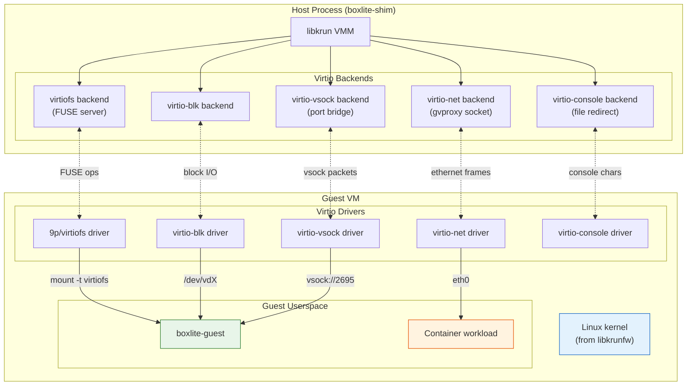

---

### 9. Kernel and Initrd Handling

How the guest Linux kernel reaches the VM varies significantly across platforms.

#### 9.1 Linux (KVM)

The kernel is embedded in `libkrunfw.so`, a shared library that contains a minimal
Linux kernel compiled specifically for libkrun. The build system downloads a prebuilt
`.so` file from the libkrunfw release artifacts.

```
libkrunfw release (GitHub) --> libkrunfw.so --> linked into libkrun --> embedded kernel
```

No `krun_set_kernel()` call is needed.

#### 9.2 macOS (Hypervisor.framework)

The kernel is embedded in `libkrunfw.dylib`, compiled from C source (`kernel.c`) that
contains the kernel binary as a byte array. The build system compiles `kernel.c` into a
shared library.

```
kernel.c (byte array) --> cc --> libkrunfw.dylib --> linked into libkrun --> embedded kernel
```

No `krun_set_kernel()` call is needed.

#### 9.3 Windows (WHPX)

The kernel is **not** embedded. It must be provided as an external file. The engine
discovers `vmlinuz` and `initrd.img` from the runtime directory:

```rust
#[cfg(not(unix))]
{
    let kernel_path = crate::util::find_binary("vmlinuz")?;
    let initrd_path = crate::util::find_binary("initrd.img").ok();
    ctx.set_kernel(kernel_str, 0, initrd_str, None)?;
}
```

If `vmlinuz` is not found, the engine returns an error with guidance to set
`BOXLITE_RUNTIME_DIR`.

---

### 10. Rootfs Assembly Strategies

BoxLite supports four strategies for preparing the guest root filesystem, selected
based on platform capabilities and image type.

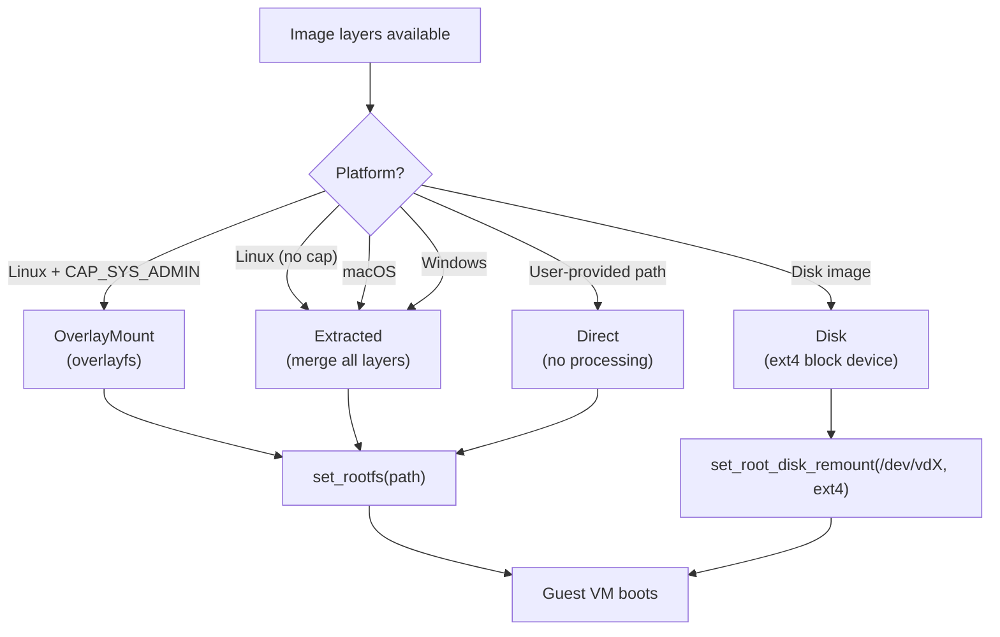

#### 10.1 Direct

User-provided root filesystem path. No processing -- the path is passed directly to
`krun_set_root()`. Used for custom rootfs directories.

#### 10.2 Extracted

All OCI image layers are merged into a single directory by extracting each layer tarball
in order. This is the fallback strategy on macOS and Windows where overlayfs is not
available.

**Trade-off:** Slower setup (full extraction), but simple and universally supported.

#### 10.3 OverlayMount

Linux overlayfs mounts OCI layers as a stack without extraction:
- **Lower layers:** Read-only OCI layers (one per image layer)
- **Upper layer:** Writable tmpfs for container modifications
- **Work directory:** Required by overlayfs for atomic operations

Requires `CAP_SYS_ADMIN` on Linux. Not available on macOS or Windows.

**Trade-off:** Fast setup (no extraction), copy-on-write semantics, but requires
elevated capabilities.

#### 10.4 Disk

The guest rootfs is baked into an ext4 disk image. The VM boots from this block device
using `krun_set_root_disk_remount()`:

1. Libkrun creates a dummy virtiofs root containing just the init binary
2. The VM boots from this dummy root
3. Init runs and immediately pivots to the block device root
4. The ext4 filesystem becomes `/`

**Trade-off:** Best guest filesystem performance (native ext4 vs FUSE), but requires
building the disk image upfront.

---

### 11. Cross-Platform Hypervisor Comparison

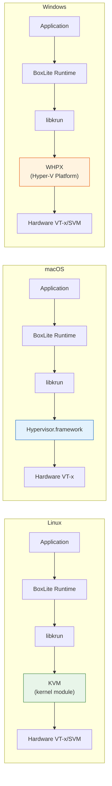

#### 11.1 Detailed Comparison

| Aspect | Linux (KVM) | macOS (HVF) | Windows (WHPX) |
|---|---|---|---|
| **Hypervisor** | KVM kernel module | Hypervisor.framework | Hyper-V Platform (WHPX) |
| **Hardware requirement** | VT-x/AMD-V | Apple Silicon (ARM64) | VT-x/AMD-V + Hyper-V enabled |
| **libkrunfw** | Downloaded prebuilt `.so` | Compiled from `kernel.c` source | Vendored inside libkrun |
| **Kernel loading** | Embedded in libkrunfw | Embedded in libkrunfw | External `vmlinuz` via `krun_set_kernel()` |
| **Initrd** | Embedded | Embedded | External `initrd.img` (optional) |
| **Network FFI** | `krun_add_net_unixstream` / `krun_add_net_unixgram` | `krun_add_net_unixgram` (VFKIT) | `krun_add_net` (TCP endpoint) |
| **Network backend** | gvproxy via Unix stream socket | gvproxy via Unix datagram socket | gvproxy via TCP socket |
| **VFKIT handshake** | Not needed (UnixStream) | Required (UnixDgram + `NET_FLAG_VFKIT`) | Not applicable |
| **vCPU limit** | None (hardware limit) | None (hardware limit) | 4 vCPUs (WHPX partition constraint) |
| **Overlayfs** | Yes (with `CAP_SYS_ADMIN`) | No | No |
| **Rootfs fallback** | Extracted (if no cap) | Extracted | Extracted |
| **Watchdog** | Pipe POLLHUP (`pipe2` + `O_CLOEXEC`) | Pipe POLLHUP (`pipe` + `fcntl`) | Event handle + parent process handle |
| **Jailer sandbox** | seccomp + cgroups + namespaces | `sandbox-exec` (seatbelt) | Job Object |
| **Process suspension** | N/A (fork semantics) | N/A (fork semantics) | `CREATE_SUSPENDED` + resume after Job Object |
| **PID file** | Written in `pre_exec` (after fork) | Written in `pre_exec` (after fork) | Written by parent after spawn |
| **UID/GID setting** | `krun_setuid` / `krun_setgid` | `krun_setuid` / `krun_setgid` | Not applicable |
| **Transport** | Unix socket | Unix socket | TCP (localhost) |

#### 11.2 Windows WHPX vCPU Limitation

Windows WHPX is capped at 4 vCPUs. The history:

1. **Original cap: 2 vCPUs.** At 4+ vCPUs, the BSP (Bootstrap Processor) would hang during
   boot. Root cause: the timer thread was calling `WHvCancelRunVirtualProcessor` on
   Application Processors (APs) that were not actually running -- they were still waiting
   on a condition variable. This corrupted the WHPX partition state.

2. **Fix: `vcpu_running` flags.** Adding per-vCPU running flags ensured the timer thread
   only cancels vCPUs that are actively running in `WHvRunVirtualProcessor`.

3. **Current cap: 4 vCPUs.** After the fix, 4 vCPUs work reliably. The cap is enforced in
   the engine via `cpus.clamp(1, 4)`.

---

### 12. Exit Information and Crash Diagnostics

When the shim process crashes or the VM fails to start, structured exit information is
written to an exit file (JSON format, following the Podman pattern):

```rust
pub enum ExitInfo {
    Signal { exit_code: i32, signal: String },        // SIGABRT, SIGSEGV, etc.
    Panic  { exit_code: i32, message: String, location: String },
    Error  { exit_code: i32, message: String },       // enter() failure
}
```

Example exit file contents:

```json
{"type":"signal","exit_code":134,"signal":"SIGABRT"}
```

```json
{"type":"panic","exit_code":101,"message":"explicit panic","location":"main.rs:42:5"}
```

Stderr output is captured separately in a `shim.stderr` file, which captures even
pre-main dyld errors (the stderr file is created *before* spawning the subprocess).

---

### Source File Reference

| File | Lines | Purpose |
|---|---|---|
| `src/boxlite/src/vmm/mod.rs` | ~295 | VmmKind, InstanceSpec, FsShare, BlockDevice types |
| `src/boxlite/src/vmm/engine.rs` | ~105 | Vmm, VmmInstanceImpl, VmmInstance, VmmConfig |
| `src/boxlite/src/vmm/factory.rs` | ~13 | VmmFactory trait |
| `src/boxlite/src/vmm/registry.rs` | ~113 | Engine registration via inventory |
| `src/boxlite/src/vmm/krun/mod.rs` | ~32 | Krun module root, check_status() |
| `src/boxlite/src/vmm/krun/factory.rs` | ~27 | KrunFactory, inventory::submit! |
| `src/boxlite/src/vmm/krun/engine.rs` | ~748 | Krun::create(), transport transformation |
| `src/boxlite/src/vmm/krun/context.rs` | ~664 | KrunContext safe FFI wrapper |
| `src/boxlite/src/vmm/krun/constants.rs` | ~90 | TsiFeatures, network feature flags |
| `src/boxlite/src/vmm/controller/mod.rs` | ~50 | VmmController, VmmHandler traits |
| `src/boxlite/src/vmm/controller/shim.rs` | ~410 | ShimController, ShimHandler |
| `src/boxlite/src/vmm/controller/spawn.rs` | ~452 | ShimSpawner, subprocess creation |
| `src/boxlite/src/vmm/controller/handler.rs` | ~31 | VmmHandler trait definition |
| `src/boxlite/src/vmm/controller/watchdog.rs` | ~496 | Pipe trick (Unix), Event (Windows) |
| `src/boxlite/src/vmm/exit_info.rs` | ~212 | ExitInfo crash diagnostics |
| `src/deps/libkrun-sys/src/lib.rs` | ~157 | Raw C FFI bindings (30+ functions) |
| `src/shared/src/constants.rs` | ~55 | GUEST_AGENT_PORT (2695), GUEST_READY_PORT (2696), mount tags |
