# In-Depth: Host-Guest Communication

> How BoxLite's host process and guest VM agent communicate over gRPC, manage streaming I/O, transfer files, and coordinate lifecycle events such as snapshots and shutdown.

---

## Table of Contents

- [Part A: Concise Version](#part-a-concise-version)
- [Part B: Comprehensive Version](#part-b-comprehensive-version)

---

# Part A: Concise Version

## Overview

BoxLite uses **gRPC over vsock** for all host-guest communication. The host side (`portal/`) connects lazily to a guest agent (`guest/service/`), which runs a tonic gRPC server inside the VM. Four services cover the entire surface area: guest lifecycle, container management, command execution, and file transfer.

## gRPC Service Architecture

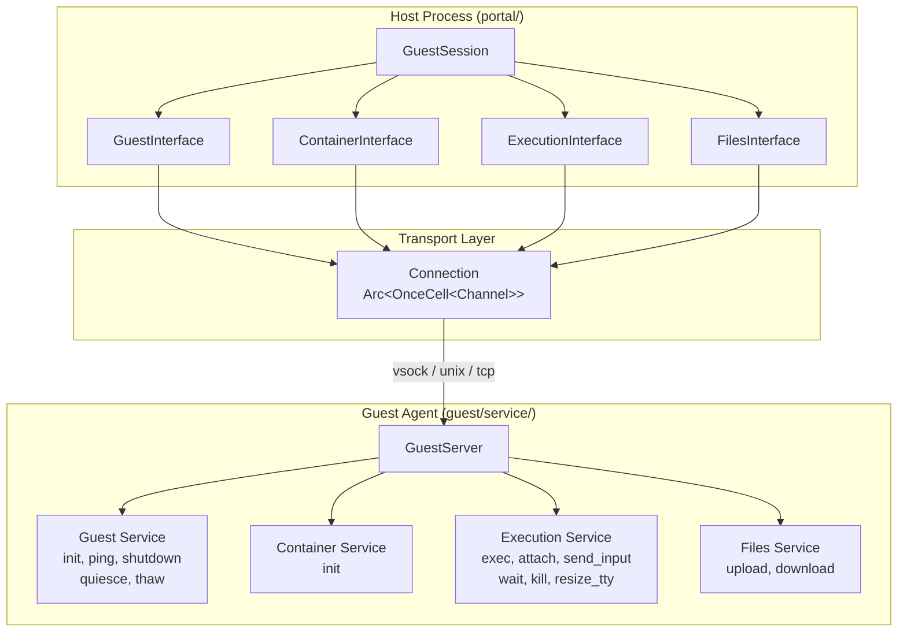
```mermaid
graph TB
    subgraph Host ["Host Process (portal/)"]
        GS[GuestSession]
        GS --> GI[GuestInterface]
        GS --> CI[ContainerInterface]
        GS --> EI[ExecutionInterface]
        GS --> FI[FilesInterface]
    end

    subgraph Transport ["Transport Layer"]
        CONN["Connection<br/>Arc&lt;OnceCell&lt;Channel&gt;&gt;"]
    end

    subgraph Guest ["Guest Agent (guest/service/)"]
        SRV[GuestServer]
        SRV --> GSvc["Guest Service<br/>init, ping, shutdown<br/>quiesce, thaw"]
        SRV --> CSvc["Container Service<br/>init"]
        SRV --> ESvc["Execution Service<br/>exec, attach, send_input<br/>wait, kill, resize_tty"]
        SRV --> FSvc["Files Service<br/>upload, download"]
    end

    GI & CI & EI & FI --> CONN
    CONN -- "vsock / unix / tcp" --> SRV
```

**Four services, each with a clear responsibility:**

| Service | RPCs | Purpose |
|---------|------|---------|
| **Guest** | `init`, `ping`, `shutdown`, `quiesce`, `thaw` | VM-level lifecycle and filesystem freeze/thaw for snapshots |
| **Container** | `init` | Prepare rootfs (Merged/Overlay/DiskImage), start OCI container via libcontainer |
| **Execution** | `exec`, `attach`, `send_input`, `wait`, `kill`, `resize_tty` | Spawn processes, stream I/O, manage process lifecycle |
| **Files** | `upload`, `download` | Tar-based file transfer in 1 MiB chunks (512 MiB cap for uploads) |

## Transport and Vsock Bridge

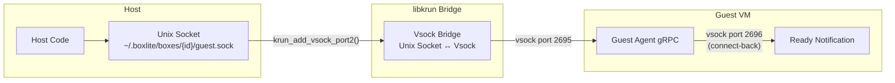
```mermaid
graph LR
    subgraph Host
        HC[Host Code] --> US["Unix Socket<br/>~/.boxlite/boxes/{id}/guest.sock"]
    end

    subgraph libkrun ["libkrun Bridge"]
        US -- "krun_add_vsock_port2()" --> VB["Vsock Bridge<br/>Unix Socket ↔ Vsock"]
    end

    subgraph VM ["Guest VM"]
        VB -- "vsock port 2695" --> GA[Guest Agent gRPC]
        GA -- "vsock port 2696<br/>(connect-back)" --> RN["Ready Notification"]
    end
```

The host never speaks vsock directly. libkrun bridges each vsock port to a host-side Unix socket. The guest binds vsock port 2695 for gRPC and connects back to vsock port 2696 to signal readiness.

## Exec Flow (3 Background Tasks)

When the host calls `exec()`, three background tokio tasks are spawned:

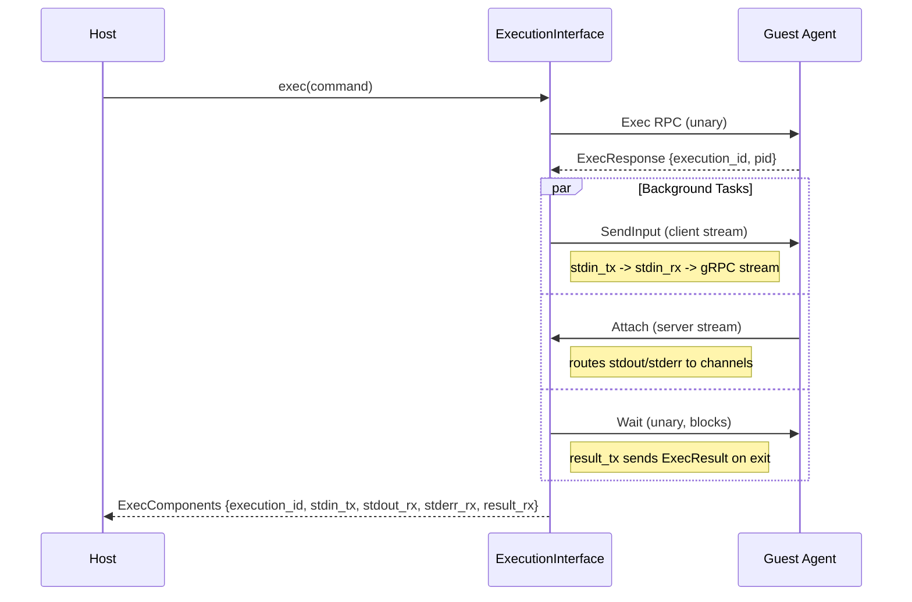
```mermaid
sequenceDiagram
    participant H as Host
    participant EI as ExecutionInterface
    participant G as Guest Agent

    H->>EI: exec(command)
    EI->>G: Exec RPC (unary)
    G-->>EI: ExecResponse {execution_id, pid}

    par Background Tasks
        EI->>G: SendInput (client stream)
        Note right of EI: stdin_tx -> stdin_rx -> gRPC stream
    and
        G->>EI: Attach (server stream)
        Note right of EI: routes stdout/stderr to channels
    and
        EI->>G: Wait (unary, blocks)
        Note right of EI: result_tx sends ExecResult on exit
    end

    EI-->>H: ExecComponents {execution_id, stdin_tx, stdout_rx, stderr_rx, result_rx}
```

All three tasks respect a `CancellationToken` via `tokio::select!` for clean shutdown.

## Shared Filesystem Layout

```
Host: ~/.boxlite/boxes/{box-id}/mounts/     Guest: /run/boxlite/shared/
  containers/                                  containers/
    {cid}/                                       {cid}/
      overlayfs/                                   overlayfs/
        diff/    (image layers)                      diff/
        upper/   (writable)                          upper/
        work/                                        work/
      rootfs/    (all strategies mount here)        rootfs/
      volumes/                                      volumes/
        {vol-name}/                                  {vol-name}/
      layers/    (virtiofs source)                  layers/
```

Both sides use `SharedGuestLayout` and `SharedContainerLayout` from `shared/src/layout.rs` to compute identical relative paths under different base directories.

## Quiesce/Thaw Snapshot Protocol

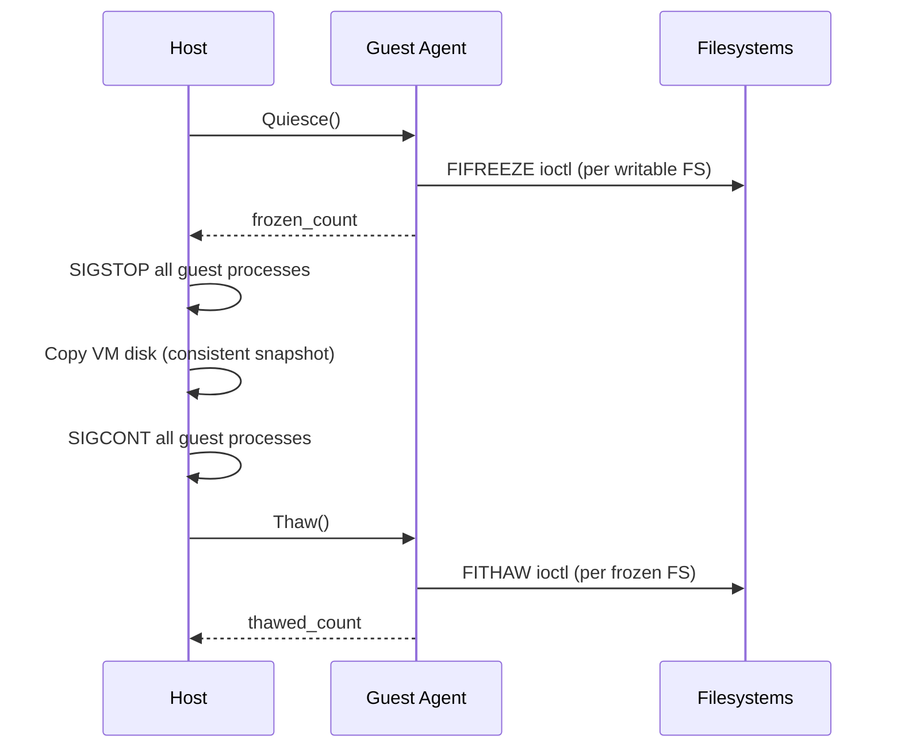
```mermaid
sequenceDiagram
    participant H as Host
    participant G as Guest Agent
    participant FS as Filesystems

    H->>G: Quiesce()
    G->>FS: FIFREEZE ioctl (per writable FS)
    G-->>H: frozen_count

    H->>H: SIGSTOP all guest processes
    H->>H: Copy VM disk (consistent snapshot)
    H->>H: SIGCONT all guest processes

    H->>G: Thaw()
    G->>FS: FITHAW ioctl (per frozen FS)
    G-->>H: thawed_count
```

---

# Part B: Comprehensive Version

## 1. Protocol Layer: Four gRPC Services

BoxLite defines four gRPC services that together cover the full host-guest interaction surface. All services run on a single tonic gRPC server inside the guest VM, sharing the same `GuestServer` state.

### 1.1 Guest Service

**Purpose:** VM-level initialization and lifecycle management.

**RPCs:**

| RPC | Type | Request | Response | Behavior |
|-----|------|---------|----------|----------|
| `Init` | Unary | `GuestInitRequest` | `GuestInitResponse` | Mount virtiofs shares and block devices, configure network via rtnetlink. Can only be called once. |
| `Ping` | Unary | `PingRequest` | `PingResponse` | Returns guest agent version. Used as a health check. |
| `Shutdown` | Unary | `ShutdownRequest` | `ShutdownResponse` | Graceful stop: kill executions (SIGTERM, then SIGKILL), shutdown containers, then `unsafe { libc::sync(); }` to flush dirty pages for COW disk consistency. |
| `Quiesce` | Unary | `QuiesceRequest` | `QuiesceResponse` | FIFREEZE ioctl on all writable, non-virtual filesystems. Returns `frozen_count`. |
| `Thaw` | Unary | `ThawRequest` | `ThawResponse` | FITHAW ioctl on previously frozen mount points. Returns `thawed_count`. |

**Init sequence details:**

1. Parse `volumes` from request -- each volume is either a `VirtiofsSource` (tag + mount_point + read_only) or a `BlockDeviceSource` (device + filesystem + need_format + need_resize).
2. Call `crate::storage::mount_volumes()` to mount all volumes.
3. If `network` is specified, call `crate::network::configure_network_from_config()` using rtnetlink to set IP address and default gateway. Network failure is non-fatal -- the box continues without networking.
4. Set `init_state.initialized = true` to gate Container.Init.

**Shutdown sync semantics:**

```rust
// In guest.rs shutdown handler:
unsafe { nix::libc::sync(); }
```

This `sync()` call is critical. BoxLite uses copy-on-write (COW) disks. Without flushing dirty pages, a restarted VM from the same disk image could have inconsistent filesystem state. The sync ensures all pending writes are committed to the virtual block device before the VM is torn down.

### 1.2 Container Service

**Purpose:** OCI container lifecycle -- rootfs preparation and container startup.

**Single RPC:** `Init`

| Field | Type | Description |
|-------|------|-------------|
| `container_id` | string | Host-generated container identifier |
| `container_config` | `ContainerConfig` | Entrypoint, env, workdir, user (from OCI image config) |
| `rootfs` | `RootfsInit` | Rootfs initialization strategy |
| `mounts` | `[]BindMount` | Volumes to bind-mount into container |
| `ca_certs` | `[]CaCert` | PEM certificates to install in container trust store |

**Rootfs strategies:**

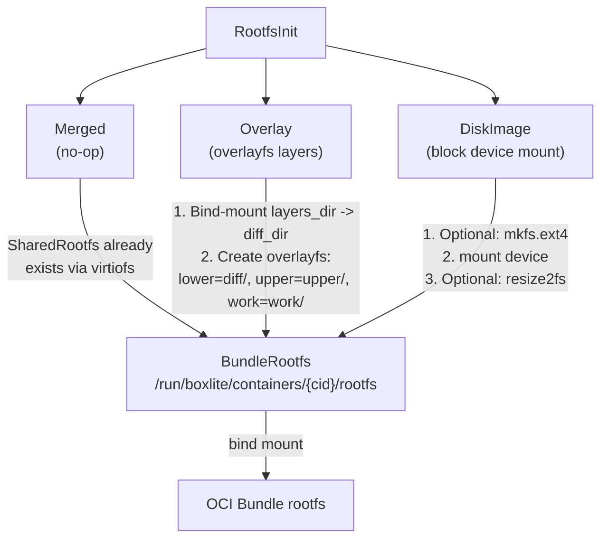
```mermaid
graph TD
    RI["RootfsInit"] --> M["Merged<br/>(no-op)"]
    RI --> O["Overlay<br/>(overlayfs layers)"]
    RI --> D["DiskImage<br/>(block device mount)"]

    M --> |"SharedRootfs already<br/>exists via virtiofs"| BR["BundleRootfs<br/>/run/boxlite/containers/{cid}/rootfs"]
    O --> |"1. Bind-mount layers_dir -> diff_dir<br/>2. Create overlayfs:<br/>lower=diff/, upper=upper/, work=work/"| BR
    D --> |"1. Optional: mkfs.ext4<br/>2. mount device<br/>3. Optional: resize2fs"| BR

    BR --> |"bind mount"| OCI["OCI Bundle rootfs"]
```

| Strategy | When Used | Steps |
|----------|-----------|-------|
| **Merged** | Pre-merged rootfs shared via virtiofs | No-op -- shared rootfs already exists at convention path |
| **Overlay** | Image with multiple layers | Bind-mount `layers/` to `overlayfs/diff/`, create overlayfs with `upper/` (writable) and `work/` dirs, mount at `rootfs/` |
| **DiskImage** | Block device-backed rootfs | Mount block device at `rootfs/`, optionally format (mkfs) and resize (resize2fs) |

After rootfs preparation, the container is started via libcontainer with pipe-based stdio. The init process blocks on `read()` from stdin, keeping the container alive indefinitely until an explicit shutdown.

**Post-start verification:** The service checks `container.is_running()` immediately after start. If the init process exited, it calls `container.diagnose_exit()` to collect stdout/stderr from the init process and returns a detailed error.

**CA certificate installation:** If `ca_certs` are provided, PEM certificates are appended to `/etc/ssl/certs/ca-certificates.crt` inside the container rootfs so HTTPS connections trust corporate MITM proxies.

### 1.3 Execution Service

**Purpose:** Spawn and manage processes inside the guest or container, with full streaming I/O.

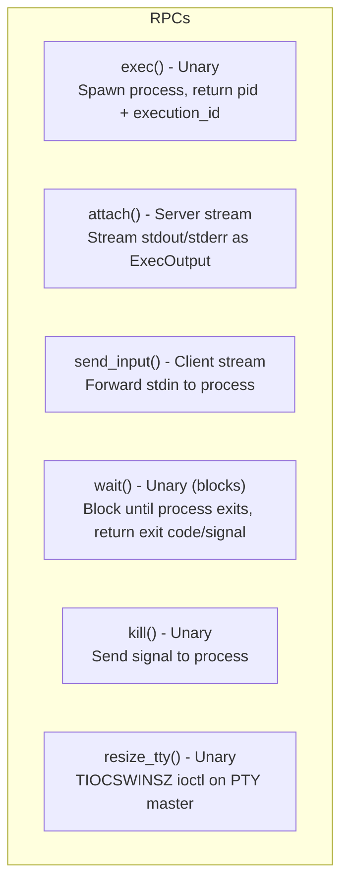
```mermaid
graph TB
    subgraph RPCs
        EXEC["exec() - Unary<br/>Spawn process, return pid + execution_id"]
        ATT["attach() - Server stream<br/>Stream stdout/stderr as ExecOutput"]
        SI["send_input() - Client stream<br/>Forward stdin to process"]
        WAIT["wait() - Unary (blocks)<br/>Block until process exits, return exit code/signal"]
        KILL["kill() - Unary<br/>Send signal to process"]
        RTT["resize_tty() - Unary<br/>TIOCSWINSZ ioctl on PTY master"]
    end
```

**RPCs:**

| RPC | Type | Description |
|-----|------|-------------|
| `Exec` | Unary | Spawns process. Returns `execution_id` and `pid`. |
| `Attach` | Server-streaming | Streams `ExecOutput` messages with `Stdout` or `Stderr` event payloads. |
| `SendInput` | Client-streaming | Receives `ExecStdin` messages. First message must carry `execution_id`. Last message has `close=true`. |
| `Wait` | Unary (long-poll) | Blocks until process exits. Returns `exit_code`, `signal`, `timed_out`, `error_message`. |
| `Kill` | Unary | Sends a Unix signal (e.g., SIGTERM, SIGKILL) to the process. |
| `ResizeTTY` | Unary | Issues `TIOCSWINSZ` ioctl on PTY master FD for terminal window resize. |

**Executor selection:**

The `BOXLITE_EXECUTOR` environment variable in the exec request determines how the process is spawned:

| Value | Executor | Behavior |
|-------|----------|----------|
| (empty or `"guest"`) | `GuestExecutor` | Direct spawn via `std::process::Command`. Pipe-based stdio or PTY mode. |
| `"container=<id>"` | `ContainerExecutor` | Spawn inside OCI container via libcontainer zygote IPC. Two-phase approach. |

**Container executor two-phase spawn:**

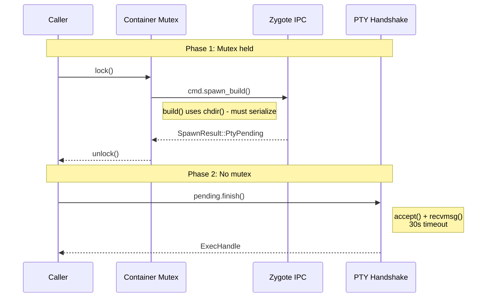
```mermaid
sequenceDiagram
    participant Caller
    participant Mutex as Container Mutex
    participant Zygote as Zygote IPC
    participant PTY as PTY Handshake

    Note over Caller,PTY: Phase 1: Mutex held
    Caller->>Mutex: lock()
    Mutex->>Zygote: cmd.spawn_build()
    Note right of Mutex: build() uses chdir() - must serialize
    Zygote-->>Mutex: SpawnResult::PtyPending
    Mutex-->>Caller: unlock()

    Note over Caller,PTY: Phase 2: No mutex
    Caller->>PTY: pending.finish()
    Note right of PTY: accept() + recvmsg()<br/>30s timeout
    PTY-->>Caller: ExecHandle
```

Phase 1 holds the container mutex because libcontainer's `build()` calls process-global `chdir()`. Concurrent builds would corrupt each other's working directory, causing hangs in `clone3`/`waitpid`. The mutex is released before Phase 2 (PTY handshake), so a stuck console socket does not block other execs or shutdown.

**Guest executor modes:**

| Mode | stdin | stdout | stderr | PTY Master |
|------|-------|--------|--------|------------|
| **Pipe** | write end of pipe | read end of pipe | read end of pipe | None |
| **PTY** | dup'd master FD | dup'd master FD | None (merged into stdout) | Kept for `TIOCSWINSZ` |

In PTY mode, stderr is merged into stdout at the terminal level. There is only one reader from the PTY master -- creating separate readers would cause a race condition where data is captured by the wrong reader.

**Container death detection:**

When an exec'd process receives `SIGKILL`, the Wait handler checks whether the container init process died. PID namespace teardown sends SIGKILL to all processes when init exits. If `check_container_death()` returns `Some(diagnosis)`, the error message includes init stdout/stderr to help debug the root cause.

### 1.4 Files Service

**Purpose:** Tar-based file transfer between host and guest container.

**RPCs:**

| RPC | Type | Chunk Size | Limit | Description |
|-----|------|-----------|-------|-------------|
| `Upload` | Client-streaming | 1 MiB | 512 MiB | First chunk MUST include `dest_path`. Tar bytes extracted at destination. |
| `Download` | Server-streaming | 1 MiB | None | Server packs source path into tar, streams chunks. |

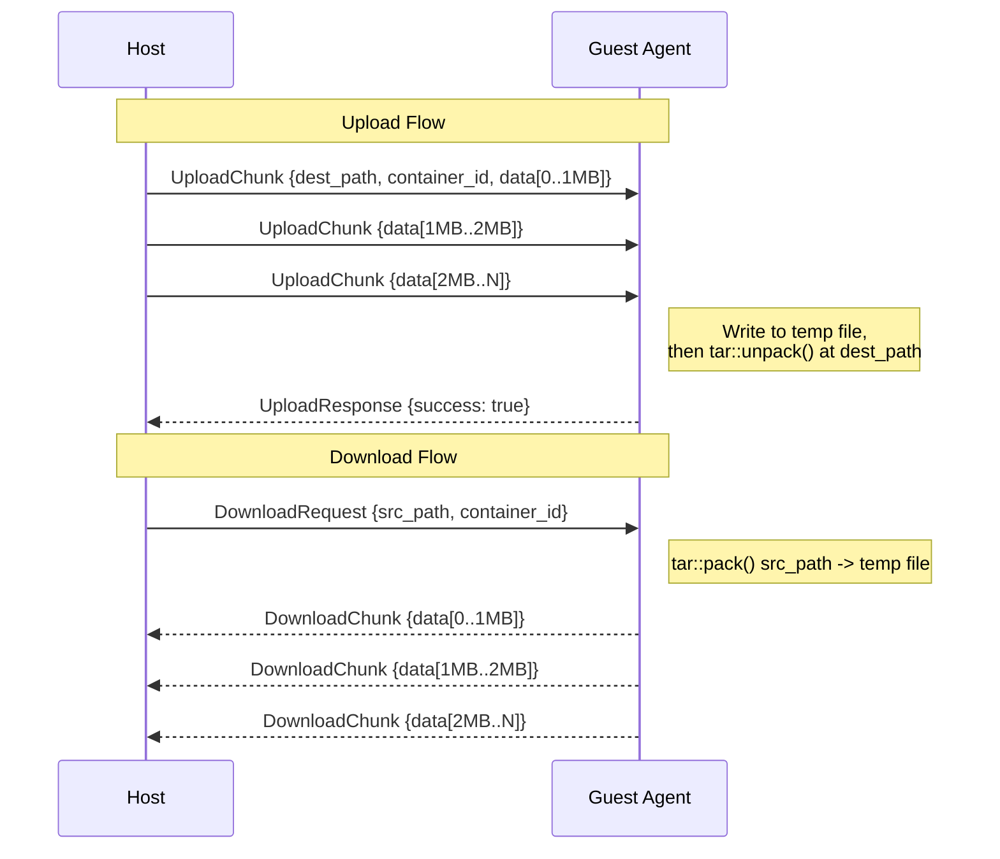
```mermaid
sequenceDiagram
    participant H as Host
    participant G as Guest Agent

    Note over H,G: Upload Flow
    H->>G: UploadChunk {dest_path, container_id, data[0..1MB]}
    H->>G: UploadChunk {data[1MB..2MB]}
    H->>G: UploadChunk {data[2MB..N]}
    Note right of G: Write to temp file,<br/>then tar::unpack() at dest_path
    G-->>H: UploadResponse {success: true}

    Note over H,G: Download Flow
    H->>G: DownloadRequest {src_path, container_id}
    Note right of G: tar::pack() src_path -> temp file
    G-->>H: DownloadChunk {data[0..1MB]}
    G-->>H: DownloadChunk {data[1MB..2MB]}
    G-->>H: DownloadChunk {data[2MB..N]}
```

**Security:** Path validation rejects any path containing `..` components to prevent directory traversal outside the container rootfs.

**Container resolution:** If only one container is running, `container_id` can be omitted and auto-resolves. With multiple containers, `container_id` is required.

---

## 2. Transport Abstraction

The `Transport` enum (`src/shared/src/transport.rs`) abstracts over three connection mechanisms:

```rust
pub enum Transport {
    Tcp { port: u16 },
    Unix { socket_path: PathBuf },
    Vsock { port: u32 },
}
```

Each variant supports URI serialization (`tcp://127.0.0.1:8080`, `unix:///path/to/sock`, `vsock://2695`), enabling transport selection via command-line arguments or configuration.

**Platform-specific connection behavior:**

| Transport | Unix Host | Windows Host | Guest |
|-----------|-----------|--------------|-------|
| `Unix` | `tokio::net::UnixStream` | `uds_windows::UnixStream` wrapped as `TcpStream` for IOCP compatibility | `tokio::net::UnixListener` |
| `Tcp` | Standard tonic channel | Standard tonic channel | `tokio::net::TcpListener` (with `TCP_NODELAY`) |
| `Vsock` | Not used directly (bridged by libkrun) | Not used directly | `tokio_vsock::VsockListener` |

**Windows Unix socket trick:** On Windows, `uds_windows::UnixStream` returns an AF_UNIX socket handle. Windows IOCP does not distinguish AF_UNIX from AF_INET at the handle level, so the handle is safely reinterpreted as a `TcpStream` for async I/O. This is the same technique used by VS Code Remote and Docker Desktop.

---

## 3. Host-Side Implementation

### 3.1 Connection (`portal/connection.rs`)

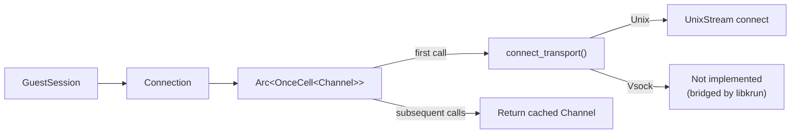
```mermaid
graph LR
    GS[GuestSession] --> CONN["Connection"]
    CONN --> OC["Arc&lt;OnceCell&lt;Channel&gt;&gt;"]
    OC --> |"first call"| INIT["connect_transport()"]
    OC --> |"subsequent calls"| CACHED["Return cached Channel"]
    INIT --> |"Unix"| UDS["UnixStream connect"]
    INIT --> |"Vsock"| ERR["Not implemented<br/>(bridged by libkrun)"]
```

The `Connection` struct wraps a `Transport` and an `Arc<OnceCell<Channel>>`. The channel is established on first use, avoiding async runtime issues during construction. After the first connect, all subsequent calls return the cached channel clone.

**Connect timeout:** 30 seconds for all transport types.

### 3.2 GuestSession (`portal/session.rs`)

A thin facade that creates service interface instances from the shared channel:

```rust
pub struct GuestSession {
    connection: Connection,
}

impl GuestSession {
    pub async fn execution(&self) -> BoxliteResult<ExecutionInterface> { ... }
    pub async fn container(&self) -> BoxliteResult<ContainerInterface> { ... }
    pub async fn guest(&self) -> BoxliteResult<GuestInterface> { ... }
    pub async fn files(&self) -> BoxliteResult<FilesInterface> { ... }
}
```

`GuestSession` is `Send + Sync` (enforced by compile-time assertion), allowing it to be shared across tasks and threads.

### 3.3 ExecutionInterface (`portal/interfaces/exec.rs`)

The `exec()` method is the most complex host-side operation. It orchestrates:

1. **Build request** from `BoxCommand` (program, args, env, workdir, tty config, user).
2. **Send Exec RPC** (unary) -- get back `execution_id` and `pid`.
3. **Spawn 3 background tasks** -- all cancellable via `CancellationToken`.

**Background task details:**

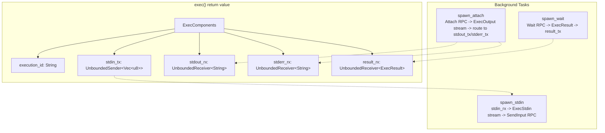
```mermaid
graph TB
    subgraph "exec() return value"
        EC["ExecComponents"]
        EC --> EID["execution_id: String"]
        EC --> STX["stdin_tx: UnboundedSender&lt;Vec&lt;u8&gt;&gt;"]
        EC --> SORX["stdout_rx: UnboundedReceiver&lt;String&gt;"]
        EC --> SERX["stderr_rx: UnboundedReceiver&lt;String&gt;"]
        EC --> RRX["result_rx: UnboundedReceiver&lt;ExecResult&gt;"]
    end

    subgraph "Background Tasks"
        T1["spawn_stdin<br/>stdin_rx -> ExecStdin stream -> SendInput RPC"]
        T2["spawn_attach<br/>Attach RPC -> ExecOutput stream -> route to stdout_tx/stderr_tx"]
        T3["spawn_wait<br/>Wait RPC -> ExecResult -> result_tx"]
    end

    STX -.-> T1
    T2 -.-> SORX
    T2 -.-> SERX
    T3 -.-> RRX
```

**Cancellation pattern (used in all three tasks):**

```rust
tokio::select! {
    biased;
    _ = shutdown_token.cancelled() => {
        // Clean exit
        return;
    }
    result = client.some_rpc(request) => result,
}
```

The `biased` keyword ensures the cancellation branch is checked first, preventing missed shutdown signals during high throughput.

**Output routing:** The `route_output()` function inspects `ExecOutput.event`:
- `Event::Stdout(chunk)` -- decoded as UTF-8 lossy, sent to `stdout_tx`
- `Event::Stderr(chunk)` -- decoded as UTF-8 lossy, sent to `stderr_tx`

**Wait response mapping:** The `map_wait_response()` function converts the gRPC `WaitResponse` into an `ExecResult`. If `signal != 0`, the exit code is set to `-signal` (negative) following Unix convention.

### 3.4 FilesInterface (`portal/interfaces/files.rs`)

**Upload:** Reads the tar file into 1 MiB chunks, sets `dest_path` only on the first chunk to reduce payload size, then sends as a client stream.

**Download:** Sends a unary `DownloadRequest`, receives a server stream of `DownloadChunk` messages, writes each chunk to a local temp file.

---

## 4. Guest-Side Implementation

### 4.1 GuestServer (`guest/service/server.rs`)

The central state holder for all four services:

```rust
pub(crate) struct GuestServer {
    pub layout: GuestLayout,
    pub init_state: Arc<Mutex<GuestInitState>>,
    pub containers: Arc<Mutex<HashMap<String, Arc<Mutex<Container>>>>>,
    pub registry: ExecutionRegistry,
    pub frozen_mounts: Mutex<Vec<PathBuf>>,
}
```

**Server startup flow:**

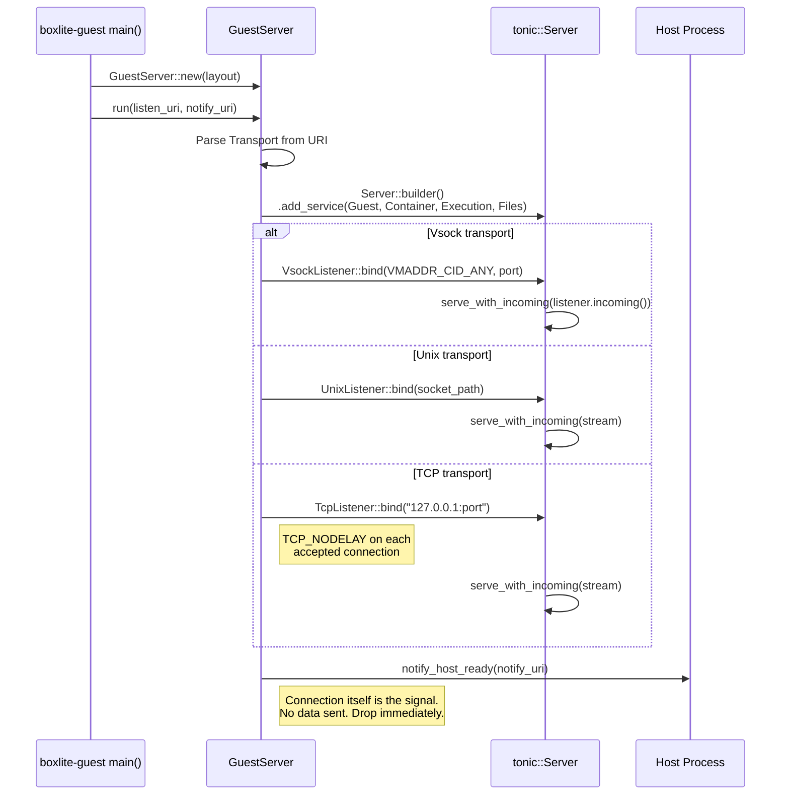
```mermaid
sequenceDiagram
    participant Main as boxlite-guest main()
    participant SRV as GuestServer
    participant Tonic as tonic::Server
    participant Host as Host Process

    Main->>SRV: GuestServer::new(layout)
    Main->>SRV: run(listen_uri, notify_uri)
    SRV->>SRV: Parse Transport from URI
    SRV->>Tonic: Server::builder()<br/>.add_service(Guest, Container, Execution, Files)

    alt Vsock transport
        SRV->>Tonic: VsockListener::bind(VMADDR_CID_ANY, port)
        Tonic->>Tonic: serve_with_incoming(listener.incoming())
    else Unix transport
        SRV->>Tonic: UnixListener::bind(socket_path)
        Tonic->>Tonic: serve_with_incoming(stream)
    else TCP transport
        SRV->>Tonic: TcpListener::bind("127.0.0.1:port")
        Note right of SRV: TCP_NODELAY on each<br/>accepted connection
        Tonic->>Tonic: serve_with_incoming(stream)
    end

    SRV->>Host: notify_host_ready(notify_uri)
    Note right of SRV: Connection itself is the signal.<br/>No data sent. Drop immediately.
```

**Readiness notification:** After binding the server socket, the guest spawns a task that connects to `notify_uri` (typically `vsock://2696`). The connection itself signals readiness -- no data is exchanged. The host side accepts this connection and knows the guest agent is ready to receive RPCs.

### 4.2 ExecutionState (`guest/service/exec/state.rs`)

`ExecutionState` manages the lifecycle of a single spawned process:

| Method | Description |
|--------|-------------|
| `send_input(first, stream)` | Takes stdin from `ExecHandle`, spawns forwarding task |
| `attach(exec_id)` | Takes stdout/stderr from `ExecHandle`, spawns forwarding tasks, returns `mpsc::Receiver<ExecOutput>` |
| `wait_process()` | Routes to `wait_direct()` (guest) or `wait_via_zygote()` (container) based on `init_health` presence |
| `kill(signal)` | Sends Unix signal to process PID |
| `resize_pty(rows, cols, ...)` | TIOCSWINSZ ioctl on PTY master FD |
| `check_container_death()` | Checks if container init died (returns diagnosis string) |

**Wait mechanism selection:**

| Executor | Wait Method | Reason |
|----------|-------------|--------|
| GuestExecutor | `waitpid(pid, None)` (blocking) | Direct child of guest agent process |
| ContainerExecutor | `zygote.wait(pid)` with WNOHANG polling every 10ms | Process is child of zygote (created by `clone3`). Cannot use blocking waitpid as it would hold the zygote mutex for the entire process lifetime. |

### 4.3 ExecutionRegistry (`guest/service/exec/registry.rs`)

Thread-safe `HashMap<String, ExecutionState>` behind `Arc<Mutex<>>`. Provides:

- `register()` / `get()` / `exists()` for state management
- `shutdown_all()` for graceful shutdown: SIGTERM first, wait with timeout, then SIGKILL for stragglers

---

## 5. Vsock Communication Architecture

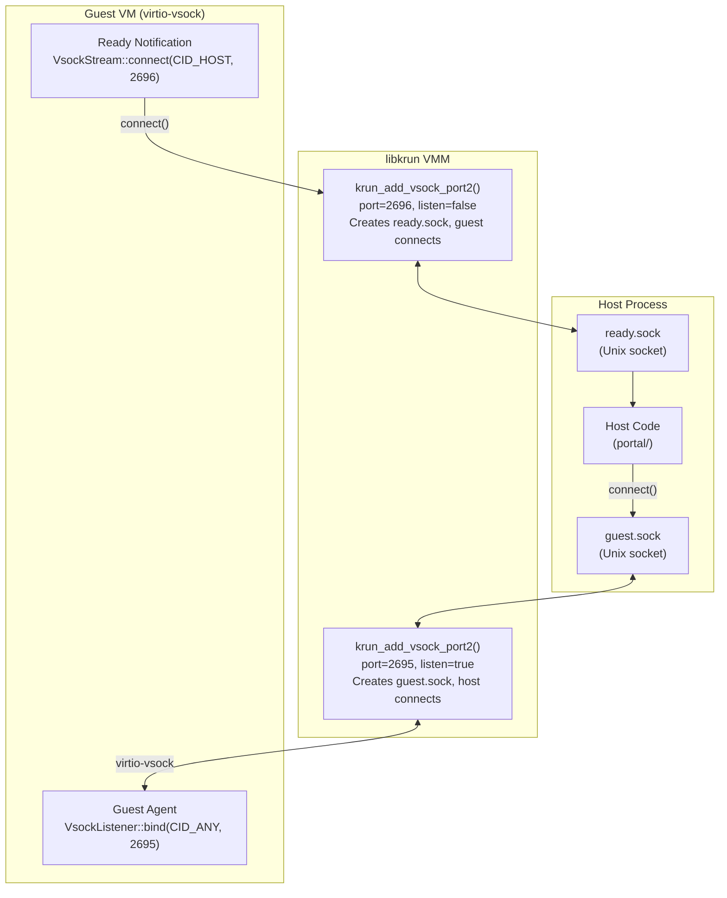
```mermaid
graph TB
    subgraph Host ["Host Process"]
        HC["Host Code<br/>(portal/)"]
        GS_SOCK["guest.sock<br/>(Unix socket)"]
        RN_SOCK["ready.sock<br/>(Unix socket)"]
    end

    subgraph libkrun ["libkrun VMM"]
        VP1["krun_add_vsock_port2()<br/>port=2695, listen=true<br/>Creates guest.sock, host connects"]
        VP2["krun_add_vsock_port2()<br/>port=2696, listen=false<br/>Creates ready.sock, guest connects"]
    end

    subgraph VM ["Guest VM (virtio-vsock)"]
        GA["Guest Agent<br/>VsockListener::bind(CID_ANY, 2695)"]
        RN["Ready Notification<br/>VsockStream::connect(CID_HOST, 2696)"]
    end

    HC -- "connect()" --> GS_SOCK
    GS_SOCK <--> VP1
    VP1 <-- "virtio-vsock" --> GA

    RN -- "connect()" --> VP2
    VP2 <--> RN_SOCK
    RN_SOCK --> HC
```

**Port assignments:**

| Port | Constant | Purpose | Direction |
|------|----------|---------|-----------|
| 2695 | `GUEST_AGENT_PORT` | gRPC service endpoint | Host connects to guest (libkrun listens on host socket) |
| 2696 | `GUEST_READY_PORT` | Readiness notification | Guest connects to host (libkrun listens on guest side) |

The port numbers are derived from phone keypad mnemonics: 2695 = "BOXL", 2696 = "BOXM".

**`krun_add_vsock_port2()` parameters:**

```rust
// Port 2695: libkrun creates Unix socket and listens.
// Host connects to this socket to reach guest gRPC.
ctx.add_vsock_port(2695, "/path/to/guest.sock", /* listen= */ true);

// Port 2696: libkrun creates Unix socket.
// Guest connects out to this port; host accepts on the socket.
ctx.add_vsock_port(2696, "/path/to/ready.sock", /* listen= */ false);
```

---

## 6. Shared Filesystem Layout

Both host and guest compute identical paths using the same Rust types from `shared/src/layout.rs`:

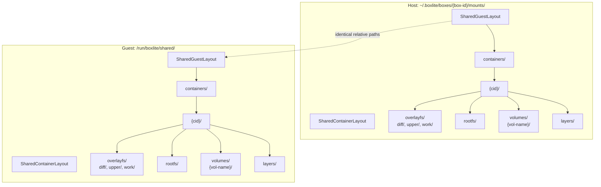
```mermaid
graph TB
    subgraph Host ["Host: ~/.boxlite/boxes/{box-id}/mounts/"]
        H_SGL["SharedGuestLayout"]
        H_SCL["SharedContainerLayout"]
        H_SGL --> H_CONT["containers/"]
        H_CONT --> H_CID["{cid}/"]
        H_CID --> H_OVL["overlayfs/<br/>diff/, upper/, work/"]
        H_CID --> H_RFS["rootfs/"]
        H_CID --> H_VOL["volumes/<br/>{vol-name}/"]
        H_CID --> H_LAY["layers/"]
    end

    subgraph Guest ["Guest: /run/boxlite/shared/"]
        G_SGL["SharedGuestLayout"]
        G_SCL["SharedContainerLayout"]
        G_SGL --> G_CONT["containers/"]
        G_CONT --> G_CID["{cid}/"]
        G_CID --> G_OVL["overlayfs/<br/>diff/, upper/, work/"]
        G_CID --> G_RFS["rootfs/"]
        G_CID --> G_VOL["volumes/<br/>{vol-name}/"]
        G_CID --> G_LAY["layers/"]
    end

    H_SGL -. "identical relative paths" .-> G_SGL
```

**Key invariant:** For any container ID and path component, the relative path from the base directory is identical on host and guest. This is enforced by property-based tests using proptest:

```rust
// From layout.rs tests:
let host_rel = host_rootfs.strip_prefix(host.base()).unwrap();
let guest_rel = guest_rootfs.strip_prefix(guest.base()).unwrap();
assert_eq!(host_rel, guest_rel);
```

**How virtiofs connects them:** The host exposes `~/.boxlite/boxes/{box-id}/mounts/` as a virtiofs share with the tag `BoxLiteShared`. The guest mounts this tag at `/run/boxlite/shared/`. Both sides then use `SharedGuestLayout` to navigate the directory tree.

---

## 7. Stream I/O Architecture

### 7.1 Overall Data Flow

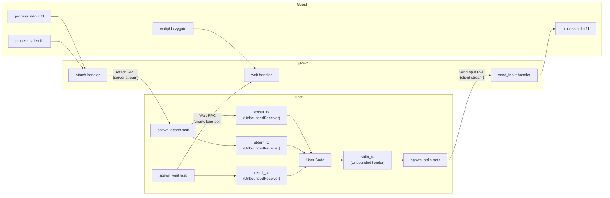
```mermaid
graph LR
    subgraph Host
        USER["User Code"] --> STX["stdin_tx<br/>(UnboundedSender)"]
        SORX["stdout_rx<br/>(UnboundedReceiver)"] --> USER
        SERX["stderr_rx<br/>(UnboundedReceiver)"] --> USER
        RRX["result_rx<br/>(UnboundedReceiver)"] --> USER

        STX --> SP_STDIN["spawn_stdin task"]
        SP_ATT["spawn_attach task"] --> SORX
        SP_ATT --> SERX
        SP_WAIT["spawn_wait task"] --> RRX
    end

    subgraph gRPC
        SP_STDIN -- "SendInput RPC<br/>(client stream)" --> G_STDIN
        G_ATT -- "Attach RPC<br/>(server stream)" --> SP_ATT
        SP_WAIT -- "Wait RPC<br/>(unary, long-poll)" --> G_WAIT
    end

    subgraph Guest
        G_STDIN["send_input handler"] --> PROC_STDIN["process stdin fd"]
        PROC_STDOUT["process stdout fd"] --> G_ATT["attach handler"]
        PROC_STDERR["process stderr fd"] --> G_ATT
        PROC_EXIT["waitpid / zygote"] --> G_WAIT["wait handler"]
    end
```

### 7.2 stdin Forwarding Detail

On the host side, `spawn_stdin` creates an internal `mpsc::channel(8)` for backpressure. A nested producer task reads from the user-facing `stdin_rx` and forwards `ExecStdin` messages into the bounded channel. The outer task wraps the bounded receiver as a `ReceiverStream` and sends it via the `SendInput` RPC.

On the guest side, `send_input()` extracts `execution_id` from the first message, looks up the `ExecutionState`, takes the stdin file descriptor from the `ExecHandle`, and spawns a forwarding task that writes each message's `data` bytes to the process stdin. When `close=true`, the task exits and the stdin FD is dropped (closing the pipe).

### 7.3 stdout/stderr Forwarding Detail

On the guest side, `attach()` takes stdout and stderr stream objects from the `ExecHandle` and spawns one forwarding task per stream. Each task reads chunks and wraps them in `ExecOutput { event: Stdout(...) }` or `ExecOutput { event: Stderr(...) }`, sending through an `mpsc::channel(100)`.

On the host side, `spawn_attach` receives the `ExecOutput` server stream and routes each message:
- `Event::Stdout` -- decode to string, send to `stdout_tx`
- `Event::Stderr` -- decode to string, send to `stderr_tx`

---

## 8. File Transfer Protocol

### 8.1 Upload Protocol

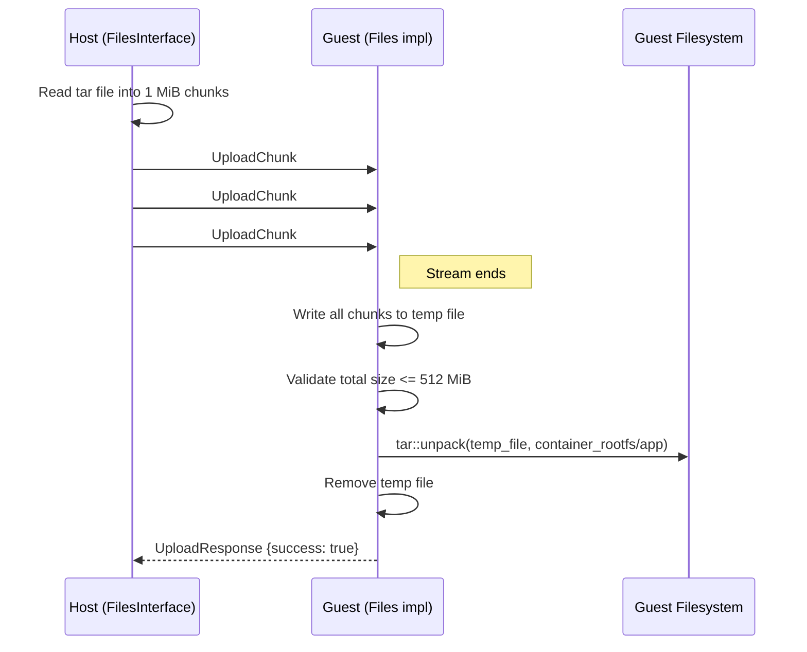
```mermaid
sequenceDiagram
    participant H as Host (FilesInterface)
    participant G as Guest (Files impl)
    participant FS as Guest Filesystem

    H->>H: Read tar file into 1 MiB chunks
    H->>G: UploadChunk #1 {dest_path: "/app", container_id: "main", data: [...], mkdir_parents: true}
    H->>G: UploadChunk #2 {dest_path: "", data: [...]}
    H->>G: UploadChunk #N {dest_path: "", data: [...]}
    Note right of G: Stream ends

    G->>G: Write all chunks to temp file
    G->>G: Validate total size <= 512 MiB

    G->>FS: tar::unpack(temp_file, container_rootfs/app)
    G->>G: Remove temp file

    G-->>H: UploadResponse {success: true}
```

**First chunk requirements:** `dest_path` is required and must be non-empty. `container_id` can be omitted if only one container is running. Subsequent chunks may have empty `dest_path` (it is only read from the first chunk).

**Safety cap:** The guest enforces a 512 MiB (`MAX_UPLOAD_BYTES`) limit. If cumulative upload size exceeds this, the RPC returns `RESOURCE_EXHAUSTED`.

**Trailing slash convention:** If `dest_path` ends with `/`, the tar is extracted in directory mode (`force_directory = true`).

### 8.2 Download Protocol

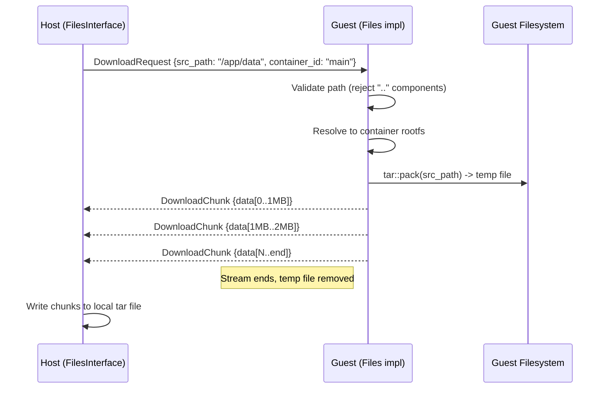
```mermaid
sequenceDiagram
    participant H as Host (FilesInterface)
    participant G as Guest (Files impl)
    participant FS as Guest Filesystem

    H->>G: DownloadRequest {src_path: "/app/data", container_id: "main"}

    G->>G: Validate path (reject ".." components)
    G->>G: Resolve to container rootfs
    G->>FS: tar::pack(src_path) -> temp file

    G-->>H: DownloadChunk {data[0..1MB]}
    G-->>H: DownloadChunk {data[1MB..2MB]}
    G-->>H: DownloadChunk {data[N..end]}
    Note left of G: Stream ends, temp file removed

    H->>H: Write chunks to local tar file
```

**Path validation:** The guest rejects any `src_path` containing `..` (parent directory) components. Absolute paths are stripped of their leading `/` and joined to the container rootfs.

**Options:** `include_parent` controls whether the parent directory name is included in the tar archive. `follow_symlinks` controls symlink resolution during packing.

---

## 9. Quiesce/Thaw: Snapshot Consistency Protocol

The quiesce/thaw protocol ensures filesystem consistency for VM snapshots. It mirrors QEMU guest-agent's `guest-fsfreeze-freeze` / `guest-fsfreeze-thaw` protocol.

### 9.1 Full Snapshot Workflow

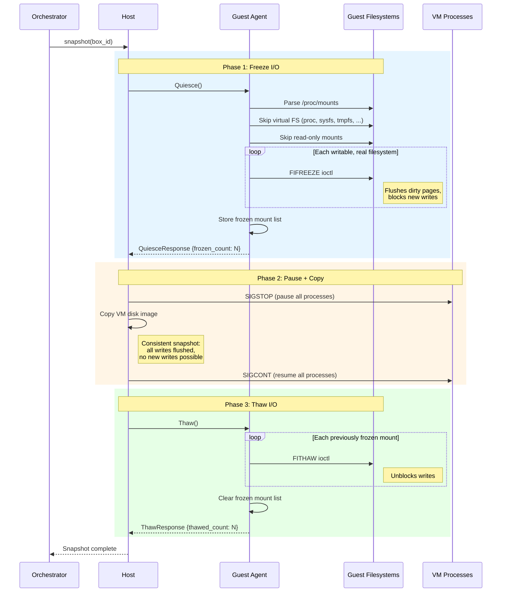
```mermaid
sequenceDiagram
    participant O as Orchestrator
    participant H as Host
    participant G as Guest Agent
    participant FS as Guest Filesystems
    participant VM as VM Processes

    O->>H: snapshot(box_id)

    rect rgb(230, 245, 255)
        Note over H,FS: Phase 1: Freeze I/O
        H->>G: Quiesce()
        G->>FS: Parse /proc/mounts
        G->>FS: Skip virtual FS (proc, sysfs, tmpfs, ...)
        G->>FS: Skip read-only mounts
        loop Each writable, real filesystem
            G->>FS: FIFREEZE ioctl
            Note right of FS: Flushes dirty pages,<br/>blocks new writes
        end
        G->>G: Store frozen mount list
        G-->>H: QuiesceResponse {frozen_count: N}
    end

    rect rgb(255, 245, 230)
        Note over H,VM: Phase 2: Pause + Copy
        H->>VM: SIGSTOP (pause all processes)
        H->>H: Copy VM disk image
        Note right of H: Consistent snapshot:<br/>all writes flushed,<br/>no new writes possible
        H->>VM: SIGCONT (resume all processes)
    end

    rect rgb(230, 255, 230)
        Note over H,FS: Phase 3: Thaw I/O
        H->>G: Thaw()
        loop Each previously frozen mount
            G->>FS: FITHAW ioctl
            Note right of FS: Unblocks writes
        end
        G->>G: Clear frozen mount list
        G-->>H: ThawResponse {thawed_count: N}
    end

    H-->>O: Snapshot complete
```

### 9.2 FIFREEZE/FITHAW Implementation

The `fsfreeze` module (`guest/src/storage/fsfreeze.rs`) implements the ioctl calls:

**Filesystem filtering:** Virtual/pseudo filesystems are skipped (proc, sysfs, devtmpfs, devpts, tmpfs, cgroup, cgroup2, securityfs, debugfs, tracefs, configfs, fusectl, mqueue, hugetlbfs, pstore, binfmt_misc, autofs, rpc_pipefs, nfsd, overlay).

**Error handling during freeze:**
- `EBUSY` -- filesystem already frozen, counted as success
- `EOPNOTSUPP` -- filesystem does not support freeze, skipped silently
- Other errors -- logged as warnings, filesystem not added to frozen list

**ioctl constants:**

```rust
const FIFREEZE: libc::c_ulong = 0xC004_5877;  // _IOWR('X', 119, int)
const FITHAW:   libc::c_ulong = 0xC004_5878;  // _IOWR('X', 120, int)
```

These are `_IOWR` (read+write direction) constants defined in `linux/fs.h`. The raw values are used instead of nix macros because `nix::ioctl_write_int!` generates `_IOW` (write-only), producing incorrect ioctl numbers.

---

## 10. Initialization Sequence (End-to-End)

The following diagram shows the complete host-guest communication flow from VM boot to first command execution:

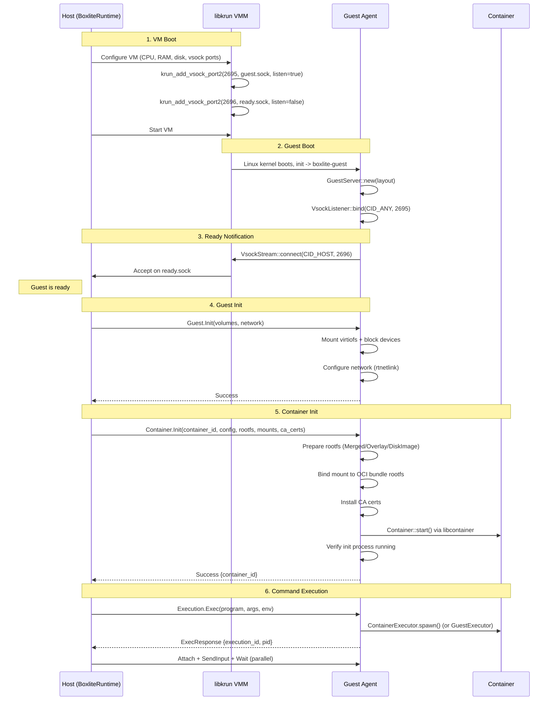
```mermaid
sequenceDiagram
    participant H as Host (BoxliteRuntime)
    participant K as libkrun VMM
    participant G as Guest Agent
    participant C as Container

    Note over H,K: 1. VM Boot
    H->>K: Configure VM (CPU, RAM, disk, vsock ports)
    K->>K: krun_add_vsock_port2(2695, guest.sock, listen=true)
    K->>K: krun_add_vsock_port2(2696, ready.sock, listen=false)
    H->>K: Start VM

    Note over K,G: 2. Guest Boot
    K->>G: Linux kernel boots, init -> boxlite-guest
    G->>G: GuestServer::new(layout)
    G->>G: VsockListener::bind(CID_ANY, 2695)

    Note over G,H: 3. Ready Notification
    G->>K: VsockStream::connect(CID_HOST, 2696)
    K->>H: Accept on ready.sock
    Note left of H: Guest is ready

    Note over H,G: 4. Guest Init
    H->>G: Guest.Init(volumes, network)
    G->>G: Mount virtiofs + block devices
    G->>G: Configure network (rtnetlink)
    G-->>H: Success

    Note over H,C: 5. Container Init
    H->>G: Container.Init(container_id, config, rootfs, mounts, ca_certs)
    G->>G: Prepare rootfs (Merged/Overlay/DiskImage)
    G->>G: Bind mount to OCI bundle rootfs
    G->>G: Install CA certs
    G->>C: Container::start() via libcontainer
    G->>G: Verify init process running
    G-->>H: Success {container_id}

    Note over H,C: 6. Command Execution
    H->>G: Execution.Exec(program, args, env)
    G->>C: ContainerExecutor.spawn() (or GuestExecutor)
    G-->>H: ExecResponse {execution_id, pid}
    H->>G: Attach + SendInput + Wait (parallel)
```

---

## 11. Source File Reference

| Component | File | Purpose |
|-----------|------|---------|
| Transport enum | `src/shared/src/transport.rs` | URI-based transport abstraction |
| Filesystem layout | `src/shared/src/layout.rs` | Shared path computation for host and guest |
| Constants | `src/shared/src/constants.rs` | Vsock ports, mount tags, executor env var |
| Host connection | `src/boxlite/src/portal/connection.rs` | Lazy `Arc<OnceCell<Channel>>` |
| Host session | `src/boxlite/src/portal/session.rs` | Facade over 4 service interfaces |
| Host exec interface | `src/boxlite/src/portal/interfaces/exec.rs` | 3-task exec orchestration |
| Host files interface | `src/boxlite/src/portal/interfaces/files.rs` | Tar upload/download |
| Host guest interface | `src/boxlite/src/portal/interfaces/guest.rs` | Init, ping, shutdown, quiesce, thaw |
| Host container interface | `src/boxlite/src/portal/interfaces/container.rs` | Container rootfs + lifecycle |
| Guest server | `src/guest/src/service/server.rs` | tonic server, readiness notification |
| Guest service impl | `src/guest/src/service/guest.rs` | Init, ping, shutdown, quiesce, thaw handlers |
| Container service impl | `src/guest/src/service/container.rs` | Rootfs strategies, OCI container start |
| Execution service impl | `src/guest/src/service/exec/mod.rs` | Exec, attach, send_input, wait, kill, resize_tty |
| Executor abstraction | `src/guest/src/service/exec/executor.rs` | GuestExecutor and ContainerExecutor |
| Execution state | `src/guest/src/service/exec/state.rs` | Per-execution state, I/O forwarding, wait routing |
| Execution registry | `src/guest/src/service/exec/registry.rs` | HashMap of active executions, graceful shutdown |
| Files service impl | `src/guest/src/service/files.rs` | Tar upload/download with path validation |
| Filesystem freeze | `src/guest/src/storage/fsfreeze.rs` | FIFREEZE/FITHAW ioctl |
| Vsock bridge config | `src/boxlite/src/vmm/krun/context.rs` | `krun_add_vsock_port2()` |
