# BoxLite Security and Isolation

> Defense-in-depth process isolation for the boxlite-shim, spanning Linux, macOS, and Windows.

This document describes every security layer that BoxLite applies to the shim process before, during, and after spawn. It is split into two self-contained parts so you can choose the depth you need.

**Navigation:**
- [Part A: Concise Version](#part-a-concise-version) -- 2-3 page executive summary
- [Part B: Comprehensive Version](#part-b-comprehensive-version) -- full technical reference

---

# Part A: Concise Version

## A.1 Defense-in-Depth Model

BoxLite never relies on a single isolation boundary. Three concentric rings protect the host from untrusted workloads, and every ring is enforced by the kernel, not by the application.

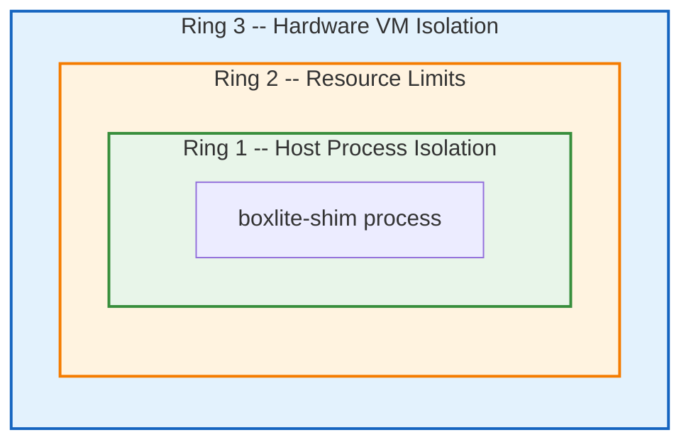

| Ring | Linux | macOS | Windows |
|------|-------|-------|---------|
| Host Process Isolation | bwrap namespaces + Landlock ACL + seccomp BPF | Seatbelt (sandbox-exec SBPL) | Job Object + UI restrictions |
| Resource Limits | cgroups v2 + rlimits | rlimits | Job Object memory/process limits |
| Hardware VM | KVM (libkrun) | Hypervisor.framework (libkrun) | WHPX |

## A.2 Platform Security Stacks at a Glance

### Linux

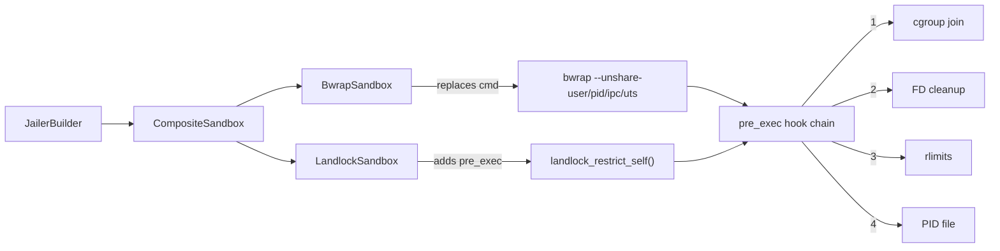

Bwrap provides namespace isolation (what the process can **see**), Landlock adds inode-based ACLs (what the process can **access**), and seccomp restricts syscalls (what the process can **call**). Cgroups v2 prevent resource exhaustion.

### macOS

Seatbelt applies a deny-default SBPL policy built from four modular files. Dynamic path rules are computed per-box from `PathAccess` entries. Network policy is added only when `network_enabled=true`.

### Windows

A Windows Job Object with `KILL_ON_JOB_CLOSE` is created during `setup()` and assigned to the child process after spawn via `post_spawn()`. UI restrictions block desktop manipulation.

## A.3 Filesystem Access Model

BoxLite never grants wholesale access to the box directory. Each subdirectory receives the minimum permission it needs.

| Path | Permission | Purpose |
|------|-----------|---------|
| `bin/` | Read-only | Copied shim binary + libkrunfw |
| `shared/` | Read-write | Guest-visible virtio-fs share root |
| `sockets/` | Read-write | libkrun vsock/unix sockets |
| `tmp/` | Read-write | Shim transient temp files |
| `logs/` | Read-write | Shim logs + VM console output |
| `disks/` | Read-write | QCOW2 disk images |
| `mounts/` | **Excluded** | Host writes before spawn; shim reads via `shared/` |
| `~/.boxlite/bases/` | Read-only | Snapshot/clone backing files |
| User volumes | Per `VolumeSpec.read_only` | Bind-mounted into guest |

QCOW2 backing chain traversal ensures all parent images (including multi-level clone chains) are granted read-only access.

## A.4 Threat Coverage Matrix

| Threat | Linux | macOS | Windows |
|--------|-------|-------|---------|
| Process escape | bwrap namespaces | Seatbelt | Job Object |
| Filesystem access | bwrap + Landlock | Seatbelt SBPL ACL | Job Object (limited) |
| Syscall abuse | seccomp BPF | N/A | N/A |
| Resource exhaustion | cgroups v2 + rlimits | rlimits | Job Object limits |
| FD info leakage | close_range() / brute-force | brute-force 4096 FDs | N/A |
| Privilege escalation | PR_SET_NO_NEW_PRIVS | N/A | N/A |
| Network exfiltration | Landlock (deny-all TCP/UDP) | Seatbelt (no network rules) | N/A |
| Binary substitution | Shim copy to `bin/` | Shim copy to `bin/` | Shim copy to `bin/` |

## A.5 SecurityOptions Defaults

| Option | Default | Notes |
|--------|---------|-------|
| `jailer_enabled` | `true` (macOS), `false` (Linux/others) | Sandbox wrapping |
| `seccomp_enabled` | `false` | Seccomp BPF (Linux only) |
| `close_fds` | `true` | Close inherited FDs 3+ |
| `sanitize_env` | `true` | Clear untrusted env vars |
| `env_allowlist` | `RUST_LOG, PATH, HOME, USER, LANG, TERM` | Preserved vars |
| `network_enabled` | `true` | Required for gvproxy VM networking |

Three presets are available: `development()` (all off), `standard()` (jailer + seccomp on supported platforms), and `maximum()` (full lockdown for untrusted workloads).

---

# Part B: Comprehensive Version

## B.1 Architecture Overview

### B.1.1 Trait Hierarchy

The jailer subsystem is organized as a two-layer abstraction. The public `Jail` trait is the only surface callers see. Internally, `Jailer<S>` delegates to platform-specific `Sandbox` implementations.

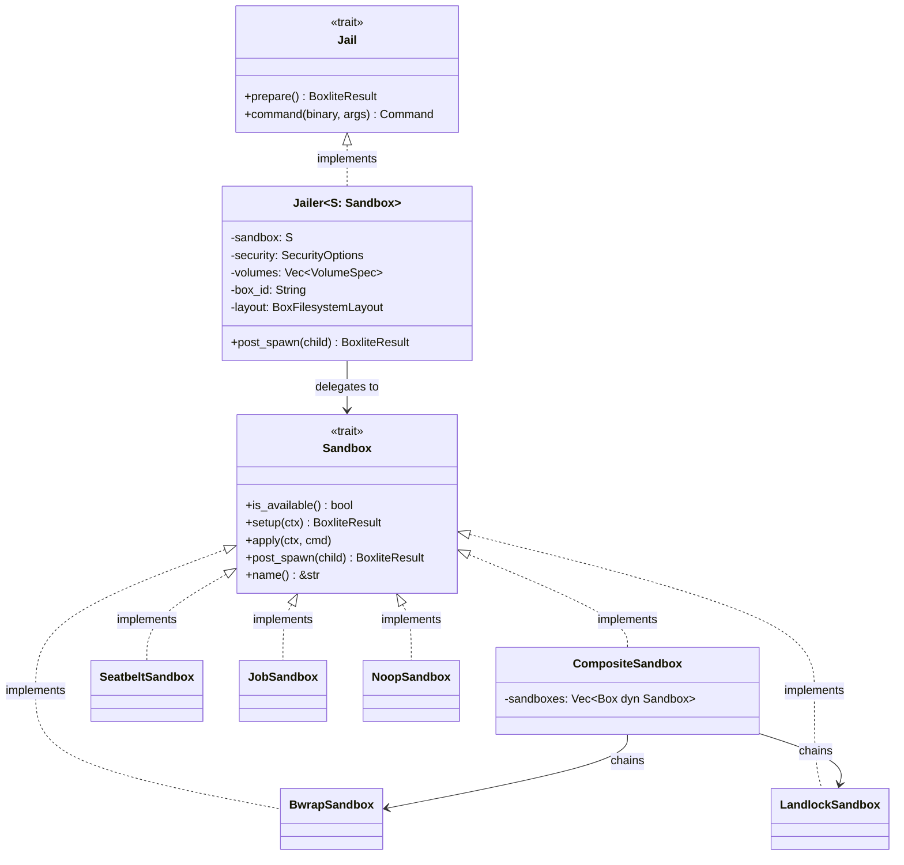

The `PlatformSandbox` type alias resolves at compile time:

| Platform | `PlatformSandbox` resolves to |
|----------|-------------------------------|
| Linux | `CompositeSandbox` (BwrapSandbox + LandlockSandbox) |
| macOS | `SeatbeltSandbox` |
| Windows | `JobSandbox` |
| Other | `NoopSandbox` |

### B.1.2 End-to-End Spawn Flow

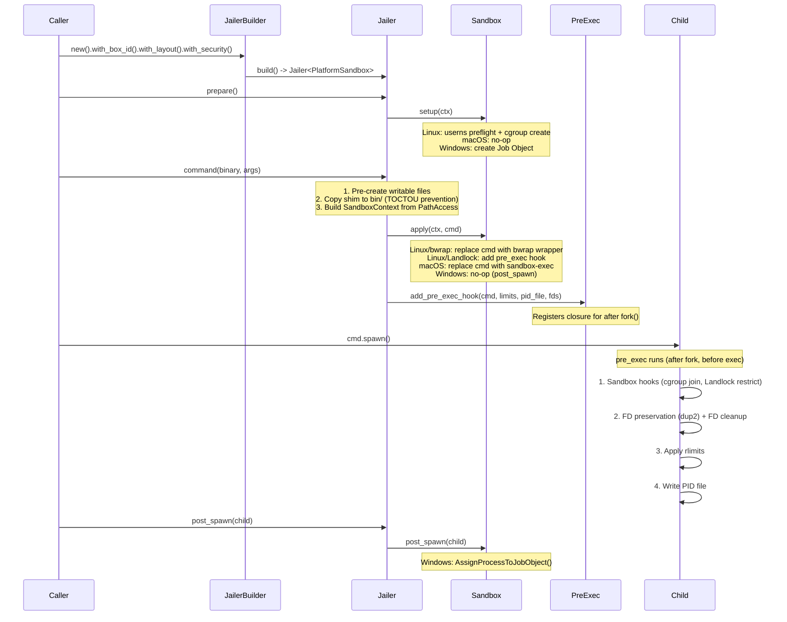

## B.2 Linux: Namespace Isolation (bubblewrap)

### B.2.1 Bwrap Discovery

BoxLite searches for bubblewrap in two locations, in order:

1. **System bwrap** -- found via `PATH`. This allows users to use their distribution's version, which typically ships with an AppArmor profile that grants `userns` permission.
2. **Bundled bwrap** -- built from the vendored `bubblewrap-sys` crate. Used as a fallback for SDK distribution scenarios where bwrap is not installed system-wide.

The path is resolved once and cached in a `OnceLock<Option<PathBuf>>` for the process lifetime.

### B.2.2 Namespace Configuration

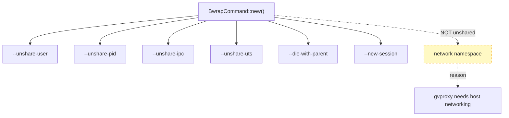

| Namespace | Flag | Purpose |
|-----------|------|---------|
| User | `--unshare-user` | Unprivileged UID/GID mapping (enables pivot_root without root) |
| PID | `--unshare-pid` | Isolated PID tree; shim is PID 1 inside |
| IPC | `--unshare-ipc` | Isolated System V IPC and POSIX message queues |
| UTS | `--unshare-uts` | Isolated hostname and domain name |
| Mount | (implicit) | Automatically unshared when bind mounts are used |
| Network | **not unshared** | Shared with host because gvproxy requires host networking |

### B.2.3 Mount Table

Bwrap constructs a minimal mount namespace:

| Source | Destination | Mode | Purpose |
|--------|-------------|------|---------|
| `/usr` | `/usr` | ro-bind | System binaries and libraries |
| `/lib` | `/lib` | ro-bind | Shared libraries |
| `/lib64` | `/lib64` | ro-bind (if exists) | 64-bit libraries on some distros |
| `/bin` | `/bin` | ro-bind | Essential binaries |
| `/sbin` | `/sbin` | ro-bind | System administration binaries |
| `/dev/kvm` | `/dev/kvm` | dev-bind (if exists) | KVM device for VM execution |
| `/dev/net/tun` | `/dev/net/tun` | dev-bind (if exists) | TUN device for networking |
| (tmpfs) | `/tmp` | tmpfs | Isolated scratch space |
| (devtmpfs) | `/dev` | --dev | Standard device nodes |
| (proc) | `/proc` | --proc | Process information |
| PathAccess writable | same path | bind (rw) | Per-box writable paths |
| PathAccess readonly | same path | ro-bind | Per-box readonly paths |

### B.2.4 Environment Sanitization

After `--clearenv`, only these environment variables are explicitly set:

| Variable | Value | Purpose |
|----------|-------|---------|
| `PATH` | `/usr/bin:/bin:/usr/sbin:/sbin` | Minimal system path |
| `HOME` | `/root` | Sandbox is isolated |
| `RUST_LOG` | (preserved from parent) | Debugging (if set) |
| `RUST_BACKTRACE` | (preserved from parent) | Stack traces (if set) |

### B.2.5 Privilege and Session Isolation

- **`--die-with-parent`**: If the host process (BoxLite runtime) dies, the shim is killed immediately via `PR_SET_PDEATHSIG`. Prevents orphaned VMs.
- **`--new-session`**: Creates a new terminal session. Prevents terminal injection attacks where a sandboxed process could write escape sequences to the parent terminal.
- **`PR_SET_NO_NEW_PRIVS`**: Applied by bwrap (and independently by Landlock and seccomp). Once set, the process and its descendants cannot gain new privileges through `execve()` of setuid/setgid binaries.

### B.2.6 User Namespace Preflight

Before spawning, `can_create_user_namespace()` performs a two-phase check:

1. **Chrome-style raw probe** -- calls `clone(CLONE_NEWUSER)` to get a kernel-level errno (`EPERM`, `EUSERS`, `EINVAL`, `ENOSPC`).
2. **bwrap probe** -- runs `bwrap --unshare-user --ro-bind / / -- true` to test whether bwrap can actually create namespaces (handles AppArmor per-binary profiles where the raw clone may fail but bwrap succeeds with its own profile).

If the probe fails, BoxLite produces a targeted diagnostic message that detects the specific restriction via sysctl files and provides the correct fix command.

## B.3 Linux: Landlock LSM

### B.3.1 Design

Landlock is a Linux Security Module (kernel 5.13+) that provides inode-based filesystem and network access control. It complements bwrap by adding fine-grained rules within the mount namespace.

```
bwrap     -> what the process can SEE  (mount namespace visibility)
Landlock  -> what the process can ACCESS  (inode-based ACL enforcement)
seccomp   -> what syscalls the process can CALL  (BPF filter)
```

### B.3.2 Dual-Phase Application

Landlock uses a split parent/child pattern for zero-gap enforcement:

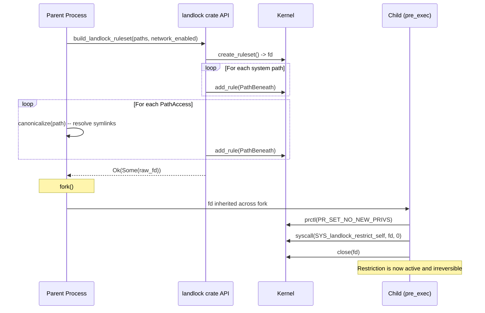

**Key detail**: The parent builds the ruleset using the full `landlock` crate API (which allocates freely). The child applies the restriction using only two raw syscalls (`prctl` and `landlock_restrict_self`), both of which are async-signal-safe.

### B.3.3 Filesystem Rules

| Category | Paths | Access |
|----------|-------|--------|
| System read-only | `/usr`, `/lib`, `/lib64`, `/bin`, `/sbin`, `/etc`, `/proc`, `/dev` | `AccessFs::from_read(V5)` |
| System writable | `/tmp` | `AccessFs::from_all(V5)` |
| Box-specific | Computed dynamically from `PathAccess` entries | `from_all` (writable) or `from_read` (read-only) |

### B.3.4 Network Isolation

- **`network_enabled=true`**: `AccessNet` is not handled at all -- the kernel permits all TCP/UDP by default.
- **`network_enabled=false`**: `AccessNet::from_all(V5)` is handled but **no rules are added** -- the kernel denies all TCP/UDP connections.

This zero-rules-equals-deny pattern is a core Landlock design principle.

### B.3.5 Graceful Degradation

- **Kernel < 5.13 (no Landlock)**: `build_landlock_ruleset()` returns `Ok(None)`. The caller logs a warning and continues without Landlock.
- **Kernel 5.13-6.6 (partial Landlock)**: The `BestEffort` compatibility mode silently drops unsupported access rights (e.g., network rules on pre-6.7 kernels).
- **Kernel 6.7+ (full Landlock V4+)**: All filesystem and network rules are enforced.

### B.3.6 Canonical Path Handling

Landlock is inode-based, not path-based. Symlinks must be resolved before adding rules, otherwise the rule applies to the symlink inode rather than the target. `canonicalize()` is called on every path, with a fallback to the original path if canonicalization fails (the path may not exist yet).

## B.4 Linux: Seccomp BPF

### B.4.1 Architecture

Seccomp filters are pre-compiled from JSON definitions at build time via `seccompiler`. This eliminates runtime compilation overhead and ensures deterministic filter content.

```
resources/seccomp/*.json  -->  build.rs (seccompiler)  -->  seccomp_filter.bpf
                                                              |
                                                              v
                                                     include_bytes!() at runtime
                                                              |
                                                              v
                                                     deserialize_binary() -> BpfThreadMap
```

### B.4.2 Thread-Specific Filters

| Role | Description | Application |
|------|-------------|-------------|
| `vmm` | Core VMM + libkrun + Go runtime (gvproxy) syscalls, ~106 entries | Applied with `SECCOMP_FILTER_FLAG_TSYNC` to all threads |
| `vcpu` | Virtual CPU thread filter | Compiled but vCPU threads inherit from main thread via `clone()` |
| `api` | Reserved for compatibility | Not used in BoxLite |

### B.4.3 TSYNC (Thread Synchronization)

The VMM filter is applied with `TSYNC` to ensure **all threads** -- including Go runtime threads spawned by the gvproxy networking component -- share the same filter. New threads created after application inherit it automatically via standard kernel `clone()` behavior.

### B.4.4 Default Action

Unauthorized syscalls trigger `SECCOMP_RET_TRAP`, which sends `SIGSYS` to the calling thread. This is a fatal signal by default, terminating the process immediately.

### B.4.5 Current Filter Status

The current VMM filter is intentionally broad. All argument-restricted entries from the original Firecracker filters were widened to unrestricted to get libkrun working. Original filters are preserved as `*.original.json` in `resources/seccomp/`. Future work: profile libkrun's actual syscall arguments and restore per-argument restrictions.

**Allowed syscall categories**: I/O, memory management, networking, process management, time, device, storage (including `io_uring`), and crypto.

## B.5 Linux: Cgroup v2

### B.5.1 Hierarchy

```
/sys/fs/cgroup/                                    # root mode
  boxlite/
    {box_id}/
      cpu.max          # "quota period" (e.g., "100000 100000")
      cpu.weight       # relative CPU weight (1-10000)
      memory.max       # hard memory limit in bytes
      memory.high      # throttle threshold (90% of max)
      pids.max         # maximum number of processes
      cgroup.procs     # write PID here to add process

/sys/fs/cgroup/user.slice/user-{uid}.slice/        # rootless mode
  user@{uid}.service/
    boxlite/
      {box_id}/
        ...same files...
```

### B.5.2 Rootless Support

BoxLite detects whether it is running as root. If not, it looks for the user's systemd service cgroup path (`user.slice/user-{uid}.slice/user@{uid}.service/`). If found, cgroups are created there. If not found, it falls back to the root cgroup path (which will likely fail due to permissions).

### B.5.3 Resource Limits

| Control File | Source | Effect |
|-------------|--------|--------|
| `cpu.max` | `ResourceLimits.max_cpu_time` | Quota in microseconds per period |
| `cpu.weight` | (configurable) | CPU time relative to other cgroups |
| `memory.max` | `ResourceLimits.max_memory` | Hard memory cap (OOM kill above this) |
| `memory.high` | 90% of `max_memory` | Throttle threshold (reclaim pressure) |
| `pids.max` | `ResourceLimits.max_processes` | Prevents fork bombs |

### B.5.4 Cgroup Join

The child process joins the cgroup via a pre_exec hook that writes the current PID to `cgroup.procs` using only async-signal-safe syscalls (`getpid`, `open`, `write`, `close`). The path is pre-computed as a `CString` in the parent process to avoid allocation in the fork-exec window.

## B.6 macOS: Seatbelt (sandbox-exec)

### B.6.1 Policy Architecture

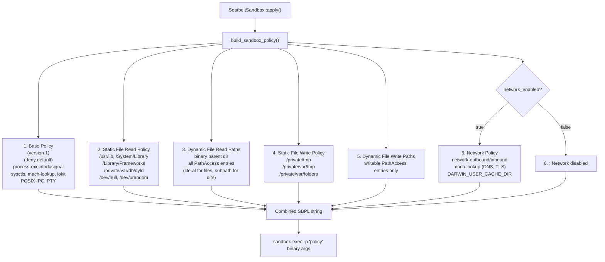

### B.6.2 Base Policy Details

The base policy starts from `(deny default)` and explicitly allows:

| Category | Rules |
|----------|-------|
| Process lifecycle | `process-exec`, `process-fork`, `signal (target same-sandbox)`, `process-info* (target same-sandbox)` |
| Device I/O | `file-write-data` to `/dev/null` (character device only) |
| Sysctls | 50+ named sysctls covering `hw.*`, `kern.*`, `vm.*`, `sysctl.*`, `net.routetable.*` |
| IOKit | `RootDomainUserClient` (power management queries) |
| Mach services | `com.apple.system.opendirectoryd.libinfo` (user/group lookup), `com.apple.PowerManagement.control`, `com.apple.logd` (logging), `com.apple.system.notification_center` |
| IPC/PTY | `ipc-posix-sem`, `pseudo-tty`, `/dev/ptmx` read/write/ioctl, `/dev/ttys*` (with pty extension) |

### B.6.3 Dynamic Path Rules

`seatbelt.rs` translates each `PathAccess` entry into SBPL rules:

- **Directories** get both `(literal "path")` (for `stat` on the directory node itself) and `(subpath "path")` (for all descendants).
- **Files** get only `(literal "path")`.
- All paths are canonicalized via `canonicalize()` to resolve symlinks, because Seatbelt operates on resolved paths.
- Nonexistent paths are treated as files (most restrictive: `literal` only, no `subpath`).

### B.6.4 Network Policy

When `network_enabled=true`, the network policy adds:

| Rule | Purpose |
|------|---------|
| `(allow network-outbound)` | All outbound connections |
| `(allow network-inbound)` | All inbound connections |
| `(allow system-socket)` | System socket operations |
| Mach lookups | DNS (`com.apple.SystemConfiguration.DNSConfiguration`), TLS (`com.apple.SecurityServer`, `com.apple.trustd.agent`), etc. |
| `DARWIN_USER_CACHE_DIR` write | TLS session and certificate caching |

### B.6.5 Hardened sandbox-exec Path

The path to `sandbox-exec` is hardcoded as `/usr/bin/sandbox-exec` to prevent PATH injection attacks. The sandbox would be defeated if an attacker could substitute a fake `sandbox-exec` binary.

## B.7 Windows: Job Objects

### B.7.1 Job Object Configuration

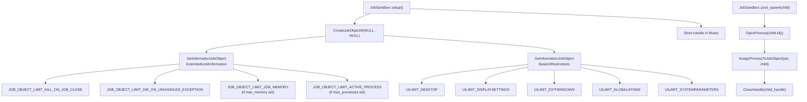

### B.7.2 Kill-on-Close Semantics

When the `JobSandbox` is dropped, the Rust `Drop` implementation calls `CloseHandle(job_handle)`. Because `JOB_OBJECT_LIMIT_KILL_ON_JOB_CLOSE` is set, the kernel terminates all processes assigned to the Job Object. This guarantees no orphaned shim processes survive host-side crashes.

### B.7.3 UI Restrictions

UI restrictions prevent sandbox escape via Windows desktop manipulation:

| Flag | Blocks |
|------|--------|
| `UILIMIT_DESKTOP` | Switching or creating desktops |
| `UILIMIT_DISPLAYSETTINGS` | Changing display settings |
| `UILIMIT_EXITWINDOWS` | Calling `ExitWindowsEx()` |
| `UILIMIT_GLOBALATOMS` | Accessing the global atom table |
| `UILIMIT_SYSTEMPARAMETERS` | Calling `SystemParametersInfo()` |

### B.7.4 Post-Spawn Assignment

Unlike Linux and macOS where isolation is applied before or during spawn, Windows Job Object assignment happens **after** `cmd.spawn()`. The `post_spawn()` method opens the child process with `PROCESS_SET_QUOTA | PROCESS_TERMINATE` access and assigns it to the Job Object via `AssignProcessToJobObject()`.

## B.8 Common Isolation Mechanisms

### B.8.1 Pre-exec Hook Chain

On Unix platforms, after `fork()` but before `exec()`, a chain of hooks runs in the child process. The order is critical and all operations must be async-signal-safe.

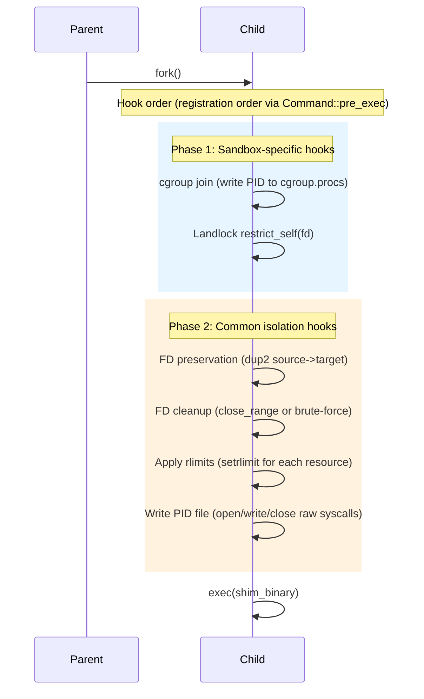

**Async-signal-safety constraint**: Between `fork()` and `exec()`, the child process is in a restricted state. No heap allocation (`Box`, `Vec`, `String`), no mutex operations, no logging (`tracing`, `println`), and no most Rust standard library functions. Only raw syscalls are permitted.

### B.8.2 FD Cleanup

File descriptor cleanup prevents information leakage through inherited file descriptors (which might include credentials, database connections, or sockets).

| Platform | Method | Details |
|----------|--------|---------|
| Linux (5.9+) | `close_range(first_fd, UINT_MAX, 0)` | Single syscall, O(1) kernel cleanup |
| Linux (< 5.9) | Brute-force `close()` loop | FDs 3 through 1023 |
| macOS | Brute-force `close()` loop | FDs 3 through 4095 |

FD preservation via `dup2(source, target)` allows specific file descriptors (e.g., the watchdog pipe) to survive the cleanup. After dup2, all FDs above the highest target are closed.

### B.8.3 Resource Limits (rlimits)

Applied via `setrlimit()` in the pre_exec hook:

| Resource | Limit Constant | Source |
|----------|---------------|--------|
| Max open files | `RLIMIT_NOFILE` | `ResourceLimits.max_open_files` |
| Max file size | `RLIMIT_FSIZE` | `ResourceLimits.max_file_size` |
| Max processes | `RLIMIT_NPROC` | `ResourceLimits.max_processes` |
| Max address space | `RLIMIT_AS` | `ResourceLimits.max_memory` |
| Max CPU time | `RLIMIT_CPU` | `ResourceLimits.max_cpu_time` |

Both soft and hard limits are set to the same value. `RLIMIT_NPROC` errors are ignored on macOS because process limiting works differently there.

### B.8.4 PID File Writing

The PID file is written in the pre_exec hook using raw `open()`, `write()`, `close()` syscalls. The PID is formatted into a 16-byte stack buffer without any heap allocation. This file serves as the single source of truth for the shim process PID, enabling crash recovery and process tracking.

### B.8.5 Shim Binary Copy

BoxLite copies (not hard-links) the shim binary into `{box_dir}/bin/` before spawning. This follows Firecracker's security isolation pattern and provides two benefits:

1. **TOCTOU Prevention**: If an attacker substitutes the original binary between the security checks and the `exec()` call, the copied binary (already verified) is what runs.
2. **Memory Isolation**: Hard-linked binaries share the same inode and `.text` section in memory. A vulnerability in one box could potentially exploit shared code pages.

On Unix, `libkrunfw` is also copied because libkrun loads it via `dlopen()` at runtime and the shim's rpath resolves to the `bin/` directory. On macOS, `DYLD_*` environment variables are stripped by SIP when going through `sandbox-exec`, so the library must be co-located.

Uses copy-if-newer semantics to avoid unnecessary I/O on subsequent starts.

## B.9 Filesystem Isolation: Granular Path Access

### B.9.1 Path Access Model

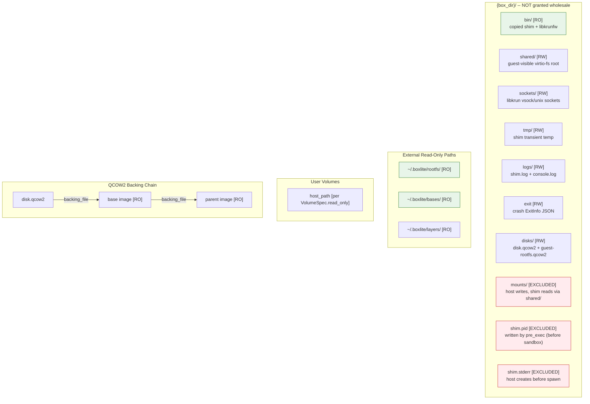

### B.9.2 QCOW2 Backing Chain Traversal

QCOW2 overlay images reference backing files that may live outside the box directory (e.g., in `~/.boxlite/images/disk-images/`). Cloned boxes create multi-level backing chains (clone -> source -> base image). `build_path_access()` traverses the full chain via `read_backing_chain()` and grants read-only access to every backing file **and** its parent directory.

Without this traversal, libkrun would fail with `EINVAL` when trying to open the backing file under a deny-default sandbox.

### B.9.3 Why `mounts/` is Excluded

The `mounts/` directory is where the host writes files before spawning the shim. The shim accesses these files through the `shared/` directory (which provides the guest-visible virtio-fs root). Including `mounts/` in the sandbox path access would widen the attack surface for no benefit, since the shim never writes to `mounts/` directly.

## B.10 Composite Sandbox Pattern

### B.10.1 Linux Composition

On Linux, `PlatformSandbox` is `CompositeSandbox`, which chains `BwrapSandbox` and `LandlockSandbox`:

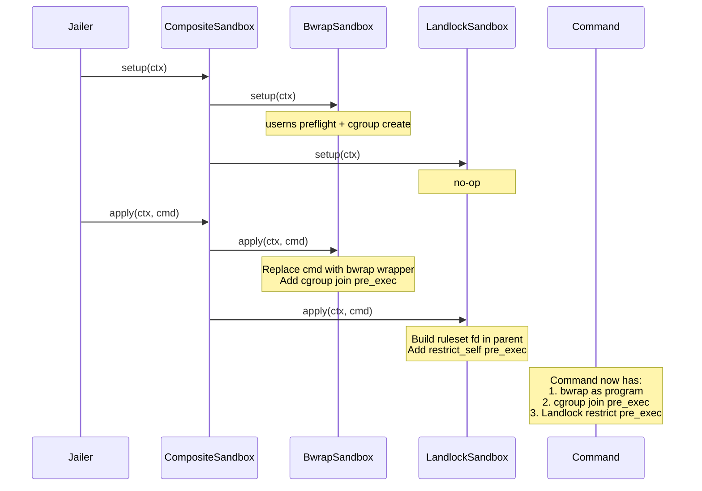

Each child's `apply()` is called in registration order on the same `Command`. `BwrapSandbox` replaces the command binary with bwrap; `LandlockSandbox` adds a `pre_exec` hook. Multiple `pre_exec` hooks are safe because `Command` stores them in a `Vec` and executes them in registration order.

### B.10.2 Availability Logic

`CompositeSandbox::is_available()` delegates to the **first** child sandbox only. On Linux, this means bwrap must be available; Landlock degrades gracefully on unsupported kernels.

## B.11 Jailer Trait and Builder

### B.11.1 The `Jail` Trait

```rust
pub trait Jail: Send + Sync {
    /// Pre-spawn setup (userns preflight, cgroup creation, Job Object creation).
    fn prepare(&self) -> BoxliteResult<()>;

    /// Build a confined command ready to spawn.
    fn command(&self, binary: &Path, args: &[String]) -> Command;
}
```

This is the only surface callers see. The trait is `Send + Sync` so it can be shared across async tasks.

### B.11.2 JailerBuilder

The builder pattern constructs the appropriate `Jailer<PlatformSandbox>` based on `SecurityOptions` and the target platform:

```rust
let jail = JailerBuilder::new()
    .with_box_id("my-box")
    .with_layout(layout)
    .with_security(SecurityOptions::standard())
    .with_volumes(volumes)
    .build()?;

jail.prepare()?;
let cmd = jail.command(&binary, &args);
let child = cmd.spawn()?;
jail.post_spawn(&child)?;
```

## B.12 SecurityOptions Reference

### B.12.1 Field Reference

| Field | Type | Default | Description |
|-------|------|---------|-------------|
| `jailer_enabled` | `bool` | `true` (macOS), `false` (others) | Enable sandbox wrapping |
| `seccomp_enabled` | `bool` | `false` | Enable seccomp BPF (Linux only) |
| `uid` | `Option<u32>` | `None` | UID to drop to after setup |
| `gid` | `Option<u32>` | `None` | GID to drop to after setup |
| `new_pid_ns` | `bool` | `false` | Create new PID namespace |
| `new_net_ns` | `bool` | `false` | Create new network namespace |
| `chroot_enabled` | `bool` | `true` (Linux) | Enable chroot isolation |
| `close_fds` | `bool` | `true` | Close inherited FDs 3+ |
| `sanitize_env` | `bool` | `true` | Clear untrusted env vars |
| `env_allowlist` | `Vec<String>` | `[RUST_LOG, PATH, HOME, USER, LANG, TERM]` | Preserved env vars |
| `resource_limits` | `ResourceLimits` | (all `None`) | CPU, memory, process, file limits |
| `sandbox_profile` | `Option<String>` | `None` | Custom SBPL profile path (macOS) |
| `network_enabled` | `bool` | `true` | Allow network in sandbox |

### B.12.2 Presets

| Preset | `jailer_enabled` | `seccomp_enabled` | `close_fds` | `sanitize_env` | Use Case |
|--------|-----------------|-------------------|-------------|----------------|----------|
| `default()` | macOS only | `false` | `true` | `true` | General use |
| `development()` | `false` | `false` | `false` | `false` | Debugging |
| `standard()` | Linux + macOS | Linux only | `true` | `true` | Production |
| `maximum()` | `true` | Linux only | `true` | `true` | Untrusted workloads (AI sandbox, multi-tenant) |

The `maximum()` preset additionally sets `uid/gid` to `65534` (nobody/nogroup), `new_pid_ns` to `true`, and applies resource limits (1024 max files, 1GB max file size, etc.).

## B.13 Threat Coverage Comparison

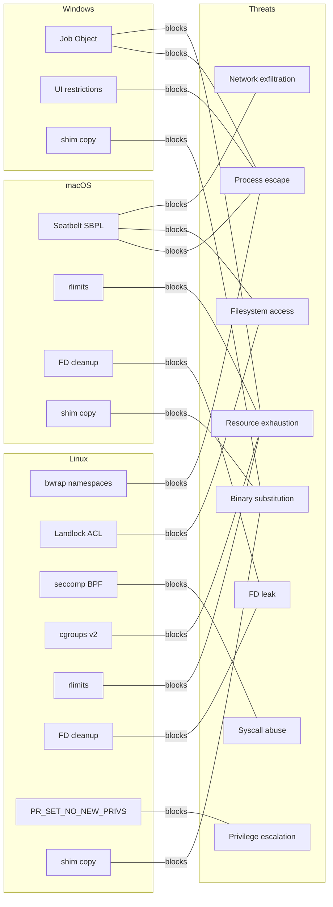

### Detailed Coverage Table

| Threat | Linux Mitigation | macOS Mitigation | Windows Mitigation |
|--------|-----------------|------------------|--------------------|
| **Process escape** | bwrap user/PID/IPC/UTS namespaces, pivot_root | Seatbelt `(deny default)` with explicit process allowlist | Job Object `KILL_ON_JOB_CLOSE` |
| **Filesystem access** | bwrap bind-mount allowlist + Landlock inode ACLs | Seatbelt file-read*/file-write* with literal/subpath rules | Job Object (limited; no filesystem ACL) |
| **Syscall abuse** | seccomp BPF with ~106-syscall allowlist, TRAP default | Not applicable (Seatbelt does not filter syscalls) | Not applicable |
| **Resource exhaustion** | cgroups v2 (cpu.max, memory.max, pids.max) + rlimits | rlimits (NOFILE, FSIZE, NPROC, AS, CPU) | Job Object (JOB_MEMORY, ACTIVE_PROCESS) |
| **FD info leakage** | `close_range()` (5.9+) or brute-force close 3-1023 | Brute-force close FDs 3-4095 | Not applicable (no FD inheritance model) |
| **Privilege escalation** | `PR_SET_NO_NEW_PRIVS` (via bwrap, Landlock, seccomp) | Not applicable (macOS does not use setuid model) | Not applicable |
| **Network exfiltration** | Landlock `AccessNet` deny-all (no rules = deny all TCP/UDP) | Seatbelt: no `network-outbound` rule when disabled | Not applicable (no network filtering) |
| **Binary substitution** | Copy shim + libkrunfw to `{box_dir}/bin/` | Copy shim + libkrunfw to `{box_dir}/bin/` | Copy shim to `{box_dir}/bin/` |

## B.14 Debugging Sandbox Violations

### macOS

View Seatbelt denials from the last 5 minutes:

```bash
log show --predicate 'subsystem == "com.apple.sandbox"' --last 5m
```

Dump the generated SBPL policy for inspection:

```bash
BOXLITE_DEBUG_PRINT_SEATBELT=1 python your_script.py
# or save to file:
BOXLITE_DEBUG_POLICY_FILE=/tmp/boxlite-policy.sbpl python your_script.py
```

### Linux

Check bwrap user namespace capability:

```bash
# Quick probe
bwrap --unshare-user --ro-bind / / -- true

# Check sysctls
cat /proc/sys/kernel/apparmor_restrict_unprivileged_userns   # 1 = blocked
cat /proc/sys/kernel/unprivileged_userns_clone               # 0 = blocked
cat /proc/sys/user/max_user_namespaces                       # 0 = blocked
```

View seccomp violations:

```bash
dmesg | grep -i seccomp
```

Verify Landlock is available:

```bash
# Landlock requires kernel 5.13+
uname -r
```

### General

Enable verbose logging:

```bash
RUST_LOG=debug python your_script.py
```
