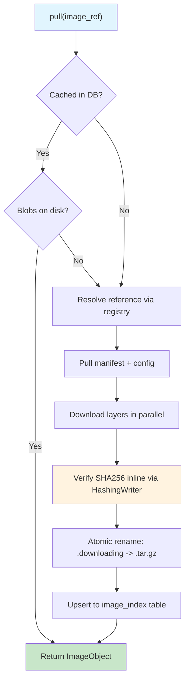
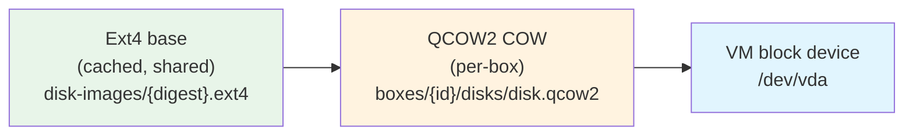
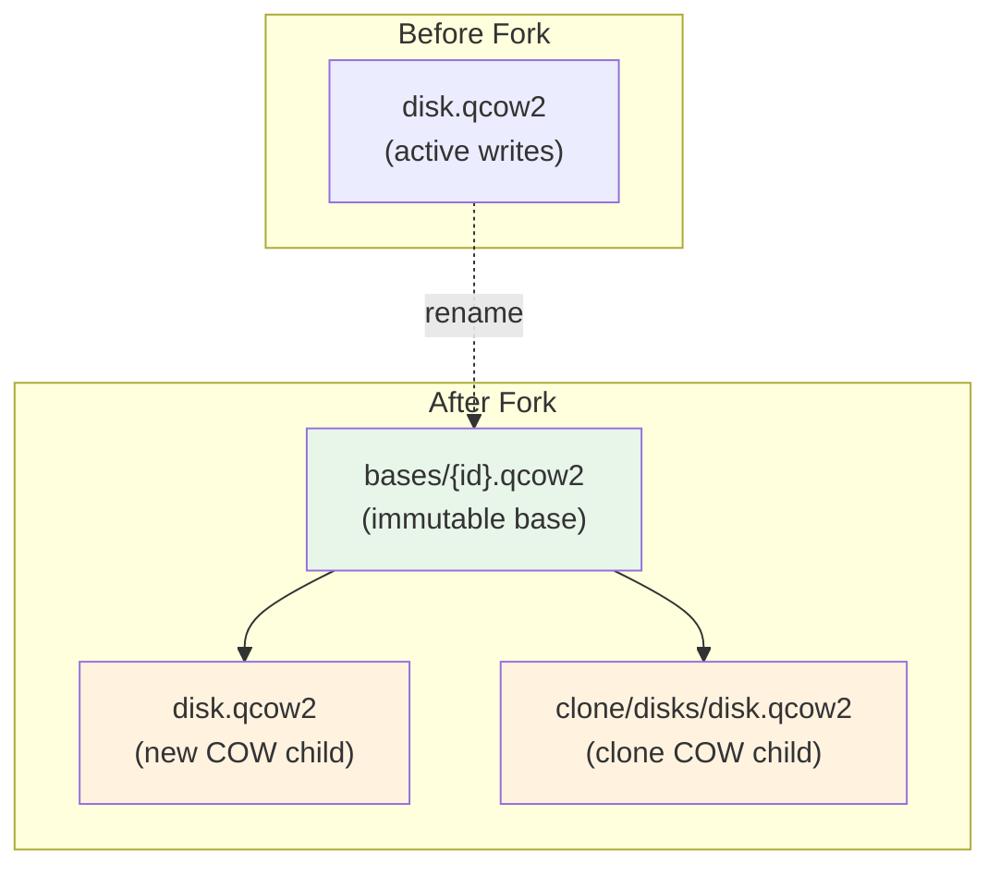
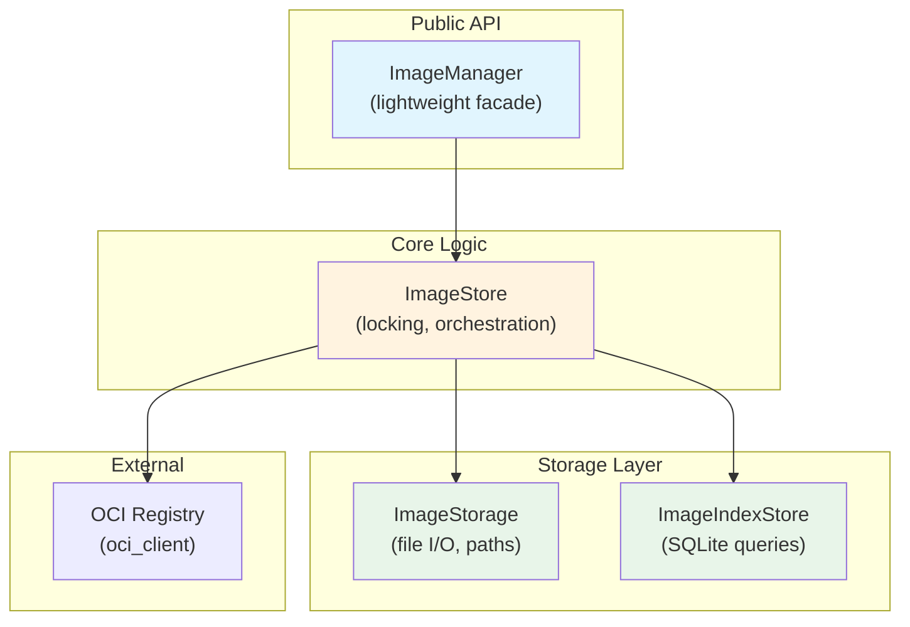
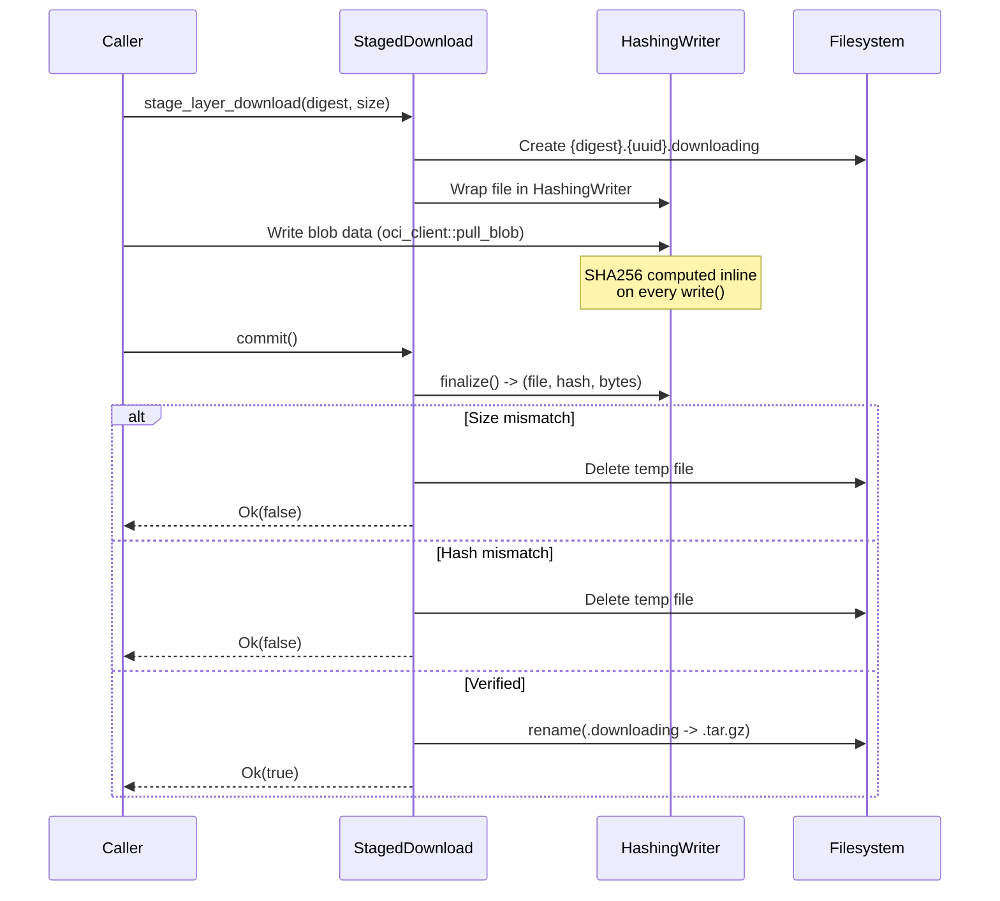
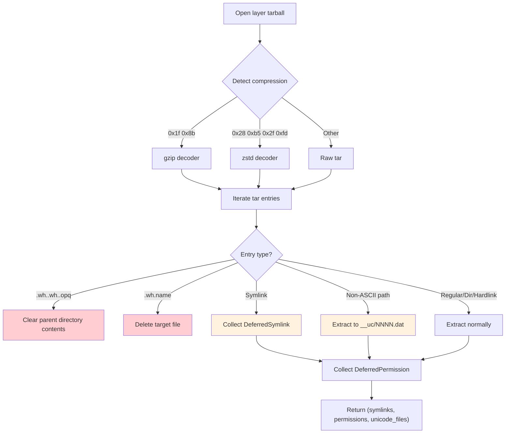
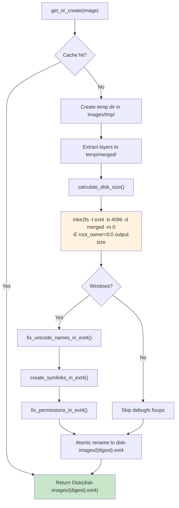
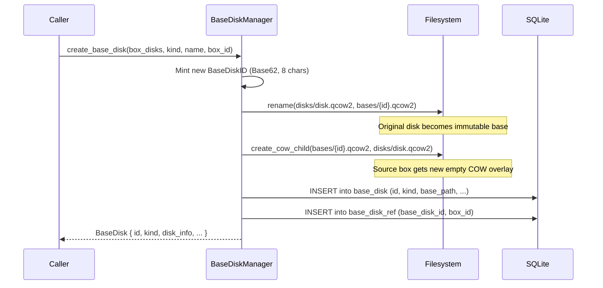
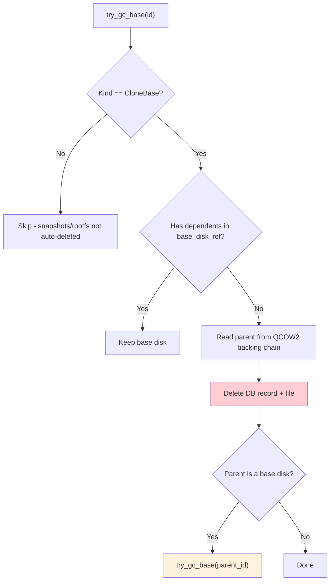
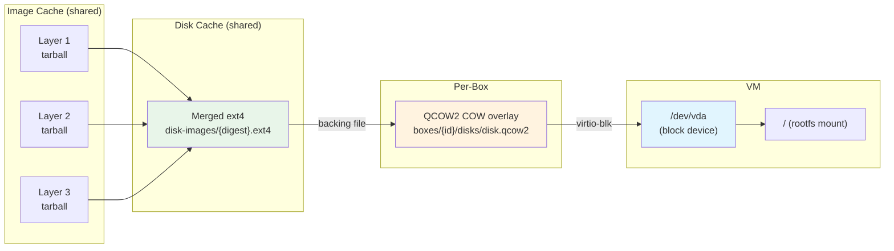

# BoxLite OCI Images & Storage: In-Depth Guide

This document provides a complete reference for BoxLite's OCI image management and storage subsystem -- from image pull through layer extraction and caching, to disk image creation, volume management, and base disk lifecycle. It covers the full data pipeline with code-level accuracy drawn directly from the source.

The document is organized in two parts:

- **Part A: Concise Version** -- A brief summary for quick reference.
- **Part B: Comprehensive Version** -- Full detailed coverage with implementation specifics.

---

# Part A: Concise Version

## 1. Storage Architecture Overview

BoxLite stores all runtime data under `~/.boxlite/`. Images, disk images, and per-box data follow a content-addressed, layered structure designed for deduplication and atomic operations.

```
~/.boxlite/
  images/                          # OCI image cache
    manifests/                     # sha256-{digest}.json
    layers/                        # sha256-{digest}.tar.gz (compressed tarballs)
    extracted/                     # sha256-{digest}/ (extracted layer directories, Unix only)
    configs/                       # sha256-{digest}.json (OCI image config blobs)
    disk-images/                   # sha256-{digest}.ext4 (cached ext4 images per unique layer set)
    tmp/                           # Staging area for atomic installs
  boxes/                           # Per-box runtime data
    {box_id}/
      disks/
        disk.qcow2                 # Container rootfs COW disk (QCOW2, per-box)
        guest-rootfs.qcow2         # Guest bootstrap COW disk (QCOW2, per-box)
  bases/                           # Immutable base disks (shared across boxes)
    {base_disk_id}.qcow2           # Flat files: clone bases, snapshots
  db/
    boxlite.db                     # SQLite database (schema v8)
```

## 2. Image Pull Pipeline

When you call `runtime.create()` with an OCI image reference, the image pull pipeline runs as part of lazy initialization:



| Step | What Happens |
|------|-------------|
| **Cache check** | Query `image_index` table for the reference. If `complete=1` and all layer blobs exist on disk, skip the network entirely. |
| **Registry resolution** | `ReferenceIter` tries multiple configured registries. For multi-arch images, the platform-specific manifest is selected. |
| **Layer download** | Each layer is downloaded through a `HashingWriter` that computes SHA256 inline. Size validation is performed if the manifest provides expected sizes. |
| **Staged install** | Layer tarballs download to `{digest}.{uuid}.downloading` temp files, then atomically rename to `{digest}.tar.gz` on successful verification. |
| **DB upsert** | The `image_index` row stores `reference`, `manifest_digest`, `config_digest`, `layers` (JSON array), `cached_at`, and `complete` flag. |

## 3. Layer Extraction & Rootfs Preparation

After layers are cached as tarballs, they must be extracted and merged into a filesystem for the VM. BoxLite supports two platform-specific paths:

**Unix (Linux/macOS):** Uses `RootfsBuilder` with `LayerExtractor` for streaming tar apply with full xattr and permission support. Layers are extracted to `images/extracted/{digest}/` and cached for reuse. Whiteout markers (`.wh.*`) are preserved in the cache and processed inline during the copy-based merge.

**Windows:** Uses a simpler tar extraction that collects symlinks, permissions, and non-ASCII filenames as deferred operations. These are applied after `mke2fs` creates the ext4 image, using `debugfs` batch commands.

## 4. Disk Image Management

BoxLite uses two disk formats:

| Format | Purpose | Created By |
|--------|---------|-----------|
| **Ext4** | Container rootfs content (image layers merged) | `mke2fs -d` (e2fsprogs) |
| **QCOW2** | Copy-on-write overlay for per-box writes | Native Rust (`qcow2_rs`) |

The disk chain for a running box:



**Key properties:**
- Ext4 base images are content-addressed by SHA256 of layer digests, so identical images share one cached disk
- QCOW2 overlays are created in ~1ms using native Rust (vs ~28ms with qemu-img subprocess)
- The `Disk` struct provides RAII cleanup -- non-persistent disks are deleted on drop

## 5. Base Disk Lifecycle (Clone & Snapshot)

When cloning or snapshotting a box, the container disk is "forked":

1. Move `disk.qcow2` to `bases/{base_disk_id}.qcow2` (makes it immutable)
2. Create a new COW child at the original path (source box keeps running)
3. Insert a `base_disk` DB record with ref tracking



**Garbage collection:** `BaseDiskKind` determines cleanup rules:
- `CloneBase` -- auto-deleted when `base_disk_ref` table shows zero dependents; cascades to parent
- `Snapshot` -- never auto-deleted; requires explicit removal
- `Rootfs` -- global cache, not auto-deleted

## 6. Volume Management

The `GuestVolumeManager` tracks two types of guest storage:

| Type | Mechanism | Example |
|------|-----------|---------|
| **Virtiofs shares** | `tag` + `host_path` mapped to guest mount | Shared directories |
| **Block devices** | Sequential allocation: `vda`, `vdb`, `vdc`... | Disk images |

`ContainerVolumeManager` provides convention-based paths for named container volumes: `/run/boxlite/shared/containers/{container_id}/volumes/{volume_name}`.

## 7. Key Design Patterns

| Pattern | Where Used | Why |
|---------|-----------|-----|
| **Staged install** | Layer downloads, disk image creation | No half-written files ever visible in cache |
| **Content-addressed caching** | Layers, manifests, configs, ext4 images | Automatic deduplication across images |
| **RAII disk cleanup** | `Disk` struct with `Drop` | Prevents leaked temp files |
| **HashingWriter** | Layer/config downloads | Inline SHA256 verification without post-download re-read |
| **Atomic rename** | All cache operations | Race-safe concurrent access |
| **DB-based ref counting** | `base_disk_ref` table | Cascading GC for clone bases |

---

# Part B: Comprehensive Version

## B.1 Storage Directory Layout

All BoxLite runtime data lives under a single root directory, defaulting to `~/.boxlite/`. The layout is managed by `ImageFilesystemLayout` and `BoxFilesystemLayout`, which compute paths deterministically from the root.

```
~/.boxlite/
  images/                              # OCI image cache (managed by ImageStorage)
    manifests/                         # OCI manifests, keyed by digest
      sha256-{digest}.json             # Serialized OciManifest
    layers/                            # Compressed layer tarballs
      sha256-{digest}.tar.gz           # Layer blob as downloaded from registry
      sha256-{digest}.{uuid}.downloading  # In-progress staged download (temp)
    extracted/                         # Extracted layer directories (Unix only)
      sha256-{digest}/                 # Fully extracted layer tree (with .wh.* preserved)
      sha256-{digest}.{uuid}.extracting  # In-progress extraction (temp)
    configs/                           # OCI image config blobs
      sha256-{digest}.json             # Image configuration JSON
    disk-images/                       # Cached ext4 base images (managed by ImageDiskManager)
      sha256-{digest}.ext4             # Merged ext4 of all layers for a unique image
    tmp/                               # Staging area for build operations
  boxes/                               # Per-box runtime data
    {box_id}/
      config.json                      # Immutable box configuration
      disks/
        disk.qcow2                     # Container rootfs COW overlay (QCOW2)
        guest-rootfs.qcow2             # Guest bootstrap COW overlay (QCOW2)
  bases/                               # Immutable base disks (flat files, shared)
    {base_disk_id}.qcow2               # Clone base, snapshot, or rootfs cache
  db/
    boxlite.db                         # SQLite database (all metadata)
```

**Critical filesystem constraint:** The `tmp/`, `bases/`, and `disk-images/` directories MUST reside on the same filesystem as their final destinations. This is required for `rename(2)` atomicity -- cross-filesystem renames fail with `EXDEV`.

## B.2 SQLite Database Schema (v8)

BoxLite uses SQLite for all persistent metadata. The schema version is tracked in the `schema_version` table and auto-migrated on startup.

### B.2.1 Image Index Table

Tracks cached OCI images by reference (e.g., `docker.io/library/python:3.12-alpine`):

```sql
CREATE TABLE IF NOT EXISTS image_index (
    reference      TEXT PRIMARY KEY NOT NULL,
    manifest_digest TEXT NOT NULL,
    config_digest   TEXT NOT NULL,
    layers          TEXT NOT NULL,       -- JSON array of layer digest strings
    cached_at       TEXT NOT NULL,       -- RFC 3339 timestamp
    complete        INTEGER NOT NULL DEFAULT 0  -- 1 = all blobs verified on disk
);
```

The `complete` flag prevents partial downloads from being treated as cached. A fresh pull sets `complete=0`, then flips to `1` only after all layer blobs pass SHA256 verification.

### B.2.2 Base Disk Tables

Track immutable base disks and their reference counts:

```sql
CREATE TABLE IF NOT EXISTS base_disk (
    id             TEXT PRIMARY KEY NOT NULL,  -- BaseDiskID (Base62, 8 chars)
    source_box_id  TEXT NOT NULL,              -- Box that created this base
    name           TEXT,                        -- Optional human-readable name
    kind           TEXT NOT NULL CHECK(kind IN ('snapshot', 'clone_base', 'rootfs')),
    base_path      TEXT NOT NULL,              -- Absolute path to .qcow2 file
    created_at     INTEGER NOT NULL,           -- Unix timestamp
    json           TEXT NOT NULL,              -- Full BaseDisk serialized as JSON
    UNIQUE(source_box_id, name)
);

CREATE TABLE IF NOT EXISTS base_disk_ref (
    base_disk_id   TEXT NOT NULL,
    box_id         TEXT NOT NULL,
    PRIMARY KEY (base_disk_id, box_id)
);
```

The `base_disk_ref` join table enables dependency-aware garbage collection. When a box is removed, its refs are deleted, and `try_gc_base()` checks if any remaining refs exist before deleting the base disk file.

### B.2.3 Box State Tables

```sql
CREATE TABLE IF NOT EXISTS box_config (
    box_id TEXT PRIMARY KEY NOT NULL,
    json   TEXT NOT NULL    -- Full BoxConfig serialized as JSON
);

CREATE TABLE IF NOT EXISTS box_state (
    box_id TEXT PRIMARY KEY NOT NULL,
    json   TEXT NOT NULL    -- Full BoxState serialized as JSON
);

CREATE TABLE IF NOT EXISTS alive (
    box_id TEXT PRIMARY KEY NOT NULL,
    pid    INTEGER NOT NULL,
    since  TEXT NOT NULL
);
```

### B.2.4 Snapshot Table

```sql
CREATE TABLE IF NOT EXISTS snapshot (
    id            TEXT PRIMARY KEY NOT NULL,
    box_id        TEXT NOT NULL,
    name          TEXT NOT NULL,
    base_disk_id  TEXT NOT NULL,
    created_at    INTEGER NOT NULL,
    json          TEXT NOT NULL,
    UNIQUE(box_id, name)
);
```

## B.3 Image Pull Flow (Detailed)

### B.3.1 Architecture

The image subsystem follows a layered architecture with clear separation of concerns:



| Component | Responsibility |
|-----------|---------------|
| `ImageManager` | Public facade. Holds `Arc<ImageStore>`. Cheaply cloneable. |
| `ImageStore` | All locking, deduplication, registry communication. Multiple concurrent pulls of the same image download once. |
| `ImageStorage` | Low-level file I/O. Content-addressed paths. Does NOT handle metadata or registry communication. |
| `ImageIndexStore` | SQLite operations on `image_index`. Get/upsert/remove/list. |

### B.3.2 Pull Algorithm

```rust
// Simplified pull flow from ImageStore
pub async fn pull(&self, image_ref: &str) -> BoxliteResult<ImageManifest> {
    // 1. Check DB cache
    if let Some(cached) = self.index.get(image_ref)? {
        if cached.complete && self.storage.verify_blobs_exist(&cached.layers) {
            return Ok(cached.to_manifest());  // Fast path: no network
        }
    }

    // 2. Resolve reference through registry chain
    let reference = Reference::from_str(image_ref)?;
    let (manifest, manifest_digest) = self.pull_manifest(&reference).await?;

    // 3. Pull config blob
    let config_digest = manifest.config.digest.clone();
    if !self.storage.has_config(&config_digest) {
        self.pull_config(&reference, &manifest).await?;
    }

    // 4. Pull layers in parallel (deduped by digest)
    for layer in &manifest.layers {
        if !self.storage.has_layer(&layer.digest) {
            self.pull_layer(&reference, layer).await?;
        }
    }

    // 5. Upsert to DB with complete=1
    self.index.upsert(image_ref, &manifest_digest, &config_digest, &layers)?;

    Ok(manifest)
}
```

### B.3.3 Staged Download Protocol

Every blob download uses the `StagedDownload` protocol for crash-safe, race-safe writes:



The `HashingWriter` wraps `tokio::fs::File` and implements `AsyncWrite`. On every `poll_write`, it feeds the successfully written bytes through `sha2::Sha256`. This eliminates the need for a post-download file re-read for verification.

### B.3.4 BlobSource Abstraction

`ImageObject` uses `BlobSource` to abstract where layer blobs come from:

```rust
pub enum BlobSource {
    /// Blobs from registry (stored in ImageStorage cache)
    Store(StoreBlobSource),
    /// Blobs from local OCI directory bundle (read directly, not copied)
    LocalBundle(LocalBundleBlobSource),
}
```

The `load_from_local()` path reads blobs directly from the local bundle directory without copying them to the store. A per-bundle cache directory (keyed by `bundle_path` + `manifest_digest`) stores extracted artifacts.

### B.3.5 Image Manifest & Layer Info

Internal types used throughout the pull pipeline:

```rust
pub(super) struct ImageManifest {
    pub manifest_digest: String,      // Platform-specific manifest digest
    pub layers: Vec<LayerInfo>,
    pub config_digest: String,
    pub diff_ids: Vec<String>,        // SHA256 of uncompressed layers (from config)
}

pub(super) struct LayerInfo {
    pub digest: String,               // SHA256 of compressed layer
    pub media_type: String,           // e.g., "application/vnd.oci.image.layer.v1.tar+gzip"
    pub size: i64,                    // Expected size; <=0 means unknown
}
```

## B.4 Layer Extraction & Caching

### B.4.1 Unix Path: LayerExtractor

On Unix (Linux/macOS), `LayerExtractor` provides containerd-style streaming tar apply:

```rust
// From archive/extractor.rs
pub struct LayerExtractor {
    root: SafeRoot,                    // Containment boundary
    whiteout_mode: WhiteoutMode,       // Apply or Preserve
}

pub enum WhiteoutMode {
    Apply,    // Process .wh.* files (delete targets)
    Preserve, // Keep .wh.* files as-is (for caching)
}
```

Key features of the Unix extractor:
- **SafeRoot containment**: Uses `openat2` (Linux) or lexical path validation (macOS) to prevent path traversal attacks
- **Deferred directory metadata**: Directory timestamps and permissions are applied after all files are extracted (avoids `mtime` clobbering by nested writes)
- **Deferred hardlinks**: Hardlinks to not-yet-extracted targets are queued and created after all entries are processed
- **Permission virtualization**: Uses xattr `user.containers.override_stat` with format `uid:gid:mode` for rootless container support

Layer extraction follows the staged install pattern:

1. Extract to `{digest}.{uuid}.extracting` temp directory
2. If extraction succeeds, atomic rename to `{digest}/`
3. If another thread/process won the rename race, silently clean up the temp directory

**Whiteout handling is critical.** Cached extracted layers preserve `.wh.*` markers because whiteouts indicate deletions from *lower* layers. Processing them on the individual layer would lose the deletion information. Whiteouts are processed inline during the copy-based rootfs merge.

### B.4.2 Windows Path: extract_layer_tarball

On Windows, layer extraction uses a simpler approach because the Windows filesystem does not support Unix permissions, xattrs, or arbitrary symlinks:



Three types of deferred operations are collected and applied via `debugfs` after `mke2fs` creates the ext4 image:

| Deferred Type | Why Deferred | Applied Via |
|---------------|-------------|-------------|
| `DeferredSymlink` | Windows requires special privileges for symlinks; Unix absolute paths are invalid on Windows | `debugfs symlink` commands |
| `DeferredPermission` | Windows does not preserve Unix mode bits | `debugfs sif mode` commands |
| `DeferredUnicodeFile` | `mke2fs -d` uses ANSI `opendir()`/`readdir()` on Windows (via MinGW), which mangles non-ASCII filenames | `debugfs write` with UTF-8 path |

All deferred operations use HashMap-based last-wins deduplication per OCI spec (upper layer overrides lower layer).

**Path sanitization**: All paths passed to debugfs commands are validated by `sanitize_debugfs_path()`, which rejects newlines, carriage returns, null bytes, and double quotes to prevent command injection.

### B.4.3 OCI Whiteout Handling

OCI layers use whiteout markers to indicate file deletions between layers:

| Marker | Meaning | Example |
|--------|---------|---------|
| `.wh.<name>` | Delete `<name>` in the same directory | `etc/.wh.old_config` deletes `etc/old_config` |
| `.wh..wh..opq` | Delete ALL contents of parent directory from lower layers | `etc/.wh..wh..opq` clears `etc/*` |

Processing order matters: opaque whiteouts clear the directory first, then new files from the same layer are extracted. Single-file whiteouts remove specific targets.

## B.5 Disk Image Creation

### B.5.1 Ext4 Creation Pipeline

`ImageDiskManager` orchestrates the creation of cached ext4 disk images from OCI images:



**Cache key computation**: The image digest is the SHA256 hash of all layer digest strings concatenated. This means two different image references with identical layer sets share the same cached ext4 disk.

**Disk size calculation** (`calculate_disk_size()`):

```
content_size = du -sb source_directory
inode_overhead = (file_count * 256 bytes)
adjusted = (content_size + inode_overhead) * 1.1  (10% overhead)
with_journal = adjusted + 64 MB
final = max(with_journal, 256 MB)
```

Constants from `disk/constants.rs`:

| Constant | Value | Purpose |
|----------|-------|---------|
| `BLOCK_SIZE` | 4096 bytes | Ext4 block size |
| `INODE_SIZE` | 256 bytes | Ext4 inode size |
| `SIZE_MULTIPLIER` | 11/10 (1.1x) | 10% overhead margin |
| `JOURNAL_OVERHEAD_BYTES` | 64 MB | Ext4 journal reservation |
| `MIN_DISK_SIZE_BYTES` | 256 MB | Minimum disk size floor |

### B.5.2 QCOW2 Operations

BoxLite uses a native Rust QCOW2 implementation (`qcow2_rs` crate) for all COW disk operations, avoiding the `qemu-img` subprocess overhead.

**Creating a standalone QCOW2 disk:**

```rust
// From disk/qcow2.rs - Qcow2Helper::create_disk()
pub fn create_disk(disk_path: &Path, persistent: bool) -> BoxliteResult<Disk> {
    let size_bytes = DEFAULT_DISK_SIZE_GB * 1024 * 1024 * 1024;  // 10 GB
    let (rc_table, rc_block, _l1_table) = Qcow2Header::calculate_meta_params(
        size_bytes, CLUSTER_BITS, REFCOUNT_ORDER, BLOCK_SIZE
    );
    // ... format header and write to file
    Ok(Disk::new(disk_path, DiskFormat::Qcow2, persistent))
}
```

QCOW2 configuration constants:

| Constant | Value | Meaning |
|----------|-------|---------|
| `DEFAULT_DISK_SIZE_GB` | 10 | Virtual disk size (sparse, ~200KB actual) |
| `CLUSTER_BITS` | 16 | 64 KB clusters (2^16) |
| `REFCOUNT_ORDER` | 4 | 16-bit refcounts (2^4) |
| `BLOCK_SIZE` | 512 | Metadata block size |

**Creating a COW child disk:**

The `create_cow_child_disk()` function creates a QCOW2 file that references another disk as a backing file. All reads go to the backing file; writes go to the child.

```rust
pub fn create_cow_child_disk(
    base_disk: &Path,
    backing_format: BackingFormat,  // Raw or Qcow2
    child_path: &Path,
    virtual_size: u64,
) -> BoxliteResult<Disk> {
    Self::write_cow_child_header(child_path, base_disk, backing_format, virtual_size)?;
    Ok(Disk::new(child_path, DiskFormat::Qcow2, false))
}
```

The header includes:
- Backing file path (canonicalized absolute path at offset 512)
- Backing format extension header (type `0xE2792ACA`)
- Empty L1 table (all reads fall through to backing)
- Properly sized refcount structures

Performance: Native Rust COW child creation takes ~1ms vs ~28ms for `qemu-img create -b`.

**Backing chain operations:**

```rust
// Read backing file path from QCOW2 header
pub fn read_backing_file_path(path: &Path) -> BoxliteResult<Option<String>>

// Walk full backing chain (up to MAX_BACKING_CHAIN_DEPTH = 8)
pub fn read_backing_chain(path: &Path) -> Vec<PathBuf>

// Check if target appears in chain_root's backing chain
pub fn is_backing_dependency(target: &Path, chain_root: &Path) -> bool

// Overwrite backing file path in header (lightweight rebase)
pub fn set_backing_file_path(qcow2_path: &Path, new_backing: &Path) -> BoxliteResult<()>

// Flatten entire backing chain into standalone QCOW2
pub fn flatten(src: &Path, dst: &Path) -> BoxliteResult<()>
```

The `flatten()` operation merges all layers of a backing chain into a single standalone QCOW2 file:
1. Open the full backing chain (top layer first, base last)
2. For each virtual cluster, resolve through the chain (first allocated layer wins)
3. Write data clusters, building L2 tables in memory
4. Write refcount structures
5. Write standalone QCOW2 v3 header (no backing file reference)

### B.5.3 Disk RAII Wrapper

The `Disk` struct provides RAII semantics for disk lifecycle management:

```rust
pub struct Disk {
    path: PathBuf,
    format: DiskFormat,   // Ext4 or Qcow2
    persistent: bool,     // If false, deleted on Drop
}

pub enum DiskFormat { Ext4, Qcow2 }
```

- Non-persistent disks (per-box COW overlays) are automatically deleted when the `Disk` is dropped
- Persistent disks (cached ext4 images, base disks) survive beyond the owning scope
- `disk.leak()` prevents cleanup by transferring ownership (used after atomic rename)

## B.6 Base Disk Management

### B.6.1 BaseDiskManager

`BaseDiskManager` manages the lifecycle of immutable base disks used for clone and snapshot operations:

```rust
pub(crate) struct BaseDiskManager {
    bases_dir: PathBuf,       // ~/.boxlite/bases/
    store: BaseDiskStore,     // DB operations
}
```

### B.6.2 The Fork Operation

The core `create_base_disk()` method implements the fork-and-COW pattern:



### B.6.3 BaseDiskKind Lifecycle Rules

```rust
pub enum BaseDiskKind {
    Snapshot,   // User-named. NOT auto-deleted by GC. Explicit removal only.
    CloneBase,  // Auto-deleted when base_disk_ref shows zero dependents.
    Rootfs,     // Global cache (source_box_id = "__global__"). Not auto-deleted.
}
```

### B.6.4 Garbage Collection (Cascading)

When a box is removed, its refs are cleaned from `base_disk_ref`. Then `try_gc_base()` runs:

```rust
pub(crate) fn try_gc_base(&self, base_disk_id: &BaseDiskID) {
    // 1. Skip if not CloneBase kind
    // 2. Query base_disk_ref for dependents
    // 3. If dependents exist, keep the base
    // 4. Read parent backing path from QCOW2 header BEFORE deleting
    // 5. Delete DB record and file
    // 6. Cascade: try_gc_base(parent_base_disk_id)
}
```

The cascade follows the QCOW2 backing chain: if base-2 backs to base-1, and base-2 has no dependents, deleting base-2 triggers a GC check on base-1.



## B.7 Volume Management

### B.7.1 GuestVolumeManager

Tracks two types of guest-visible storage:

```rust
pub struct GuestVolumeManager {
    fs_shares: Vec<FsShare>,          // Virtiofs shared directories
    block_devices: Vec<BlockDevice>,  // Block devices (QCOW2/ext4 disks)
}

struct FsShare {
    tag: String,       // Virtiofs mount tag (guest-side identifier)
    host_path: PathBuf, // Host directory to share
}

struct BlockDevice {
    id: String,        // Sequential: "vda", "vdb", "vdc", ...
    path: PathBuf,     // Path to disk image
}
```

Block device IDs are allocated sequentially using the naming convention `vd{a-z}`:

```rust
fn next_block_id(&self) -> String {
    let idx = self.block_devices.len();
    let letter = (b'a' + idx as u8) as char;
    format!("vd{}", letter)
}
```

The manager produces two outputs consumed by the VMM:
- `build_vmm_config()` -- Virtiofs share paths and block device paths for the hypervisor
- `build_guest_mounts()` -- Mount instructions sent to the guest agent via gRPC

### B.7.2 ContainerVolumeManager

Provides convention-based volume path resolution for named container volumes:

```rust
// Volume path convention:
// /run/boxlite/shared/containers/{container_id}/volumes/{volume_name}
pub fn volume_path(&self, volume_name: &str) -> PathBuf {
    PathBuf::from("/run/boxlite/shared/containers")
        .join(&self.container_id)
        .join("volumes")
        .join(volume_name)
}
```

This wraps `GuestVolumeManager` and maps user-facing volume names to the internal virtiofs share + guest mount path pair.

## B.8 OCI Image Configuration

### B.8.1 ContainerImageConfig

Extracted from the OCI image config blob, this struct carries runtime configuration:

```rust
pub struct ContainerImageConfig {
    pub entrypoint: Vec<String>,      // OCI ENTRYPOINT (executable)
    pub cmd: Vec<String>,             // OCI CMD (default arguments, overridable)
    pub user: String,                 // OCI USER (default "0:0")
    pub exposed_ports: Vec<String>,   // OCI EXPOSE (e.g., "8080/tcp")
    pub env: Vec<String>,             // OCI ENV (e.g., "PATH=/usr/bin")
    pub working_dir: String,          // OCI WORKDIR (default "/")
}
```

**Final command computation** follows Docker/OCI semantics:

```rust
pub fn final_cmd(&self) -> Vec<String> {
    let mut result = self.entrypoint.clone();
    result.extend(self.cmd.iter().cloned());
    result
}
// entrypoint=["/bin/sh", "-c"] + cmd=["echo hello"]
// -> ["/bin/sh", "-c", "echo hello"]
```

**Environment variable merging**: User-provided env vars override image env vars by key:

```rust
pub fn merge_env(&mut self, user_env: Vec<(String, String)>) {
    // Parse existing "KEY=VALUE" into HashMap
    // Merge user vars (overwrites existing keys)
    // Sort output for determinism
}
```

**Default config** (when image has no config or fields are missing):

| Field | Default |
|-------|---------|
| `entrypoint` | `["/bin/sh"]` |
| `cmd` | `[]` |
| `user` | `"0:0"` |
| `env` | `["PATH=/usr/local/sbin:/usr/local/bin:/usr/sbin:/usr/bin:/sbin:/bin"]` |
| `working_dir` | `"/"` |
| `exposed_ports` | `[]` |

## B.9 Container Rootfs Initialization Strategies

BoxLite uses two strategies for preparing the container rootfs, depending on platform capabilities:

### B.9.1 Copy-Based Mount (Unix, Preferred)

The `RootfsBuilder` uses a VFS-style copy operation with `cp -ac` (Linux) or `cp --reflink=auto` to merge extracted layers into a single directory tree. This approach:

- Processes whiteout markers inline during the copy (not after)
- Supports `user.containers.override_stat` xattr for permission virtualization
- Produces a merged directory that `mke2fs -d` converts to ext4

### B.9.2 Extraction-Based Mount (Windows, Fallback)

On Windows, layers are extracted from tarballs with deferred operations for symlinks, permissions, and non-ASCII filenames. The merged directory is converted to ext4 via `mke2fs -d`, then `debugfs` batch commands apply the deferred operations.

### B.9.3 End-to-End Disk Chain

The complete disk chain from OCI image to running VM:



## B.10 Key Design Patterns

### B.10.1 Staged Install Pattern

Every write to a shared cache location follows the staged install pattern to prevent half-written files:

```
1. Create work in temp location (unique suffix: UUID or PID)
2. Perform all I/O in temp location
3. Verify integrity (SHA256, size)
4. Atomic rename(2) to final location
5. If rename fails (race), check if winner succeeded
6. Clean up temp on any failure
```

This pattern appears in:
- Layer downloads (`StagedDownload` with `.downloading` suffix)
- Layer extraction (`.extracting` suffix)
- Disk image creation (temp dir in `images/tmp/`)

### B.10.2 Content-Addressed Caching

All cached artifacts are keyed by content digest:

| Artifact | Key | Path |
|----------|-----|------|
| Manifest | `sha256:{digest}` | `manifests/sha256-{digest}.json` |
| Layer tarball | `sha256:{digest}` | `layers/sha256-{digest}.tar.gz` |
| Config blob | `sha256:{digest}` | `configs/sha256-{digest}.json` |
| Extracted layer | `sha256:{digest}` | `extracted/sha256-{digest}/` |
| Ext4 disk image | SHA256 of layer digests | `disk-images/sha256-{digest}.ext4` |

Benefits: automatic deduplication across images, crash-safe (content either fully exists or does not), trivially verifiable.

### B.10.3 Inline Integrity Verification

The `HashingWriter` eliminates the need for post-download re-reads:

```rust
impl<W: AsyncWrite + Unpin> AsyncWrite for HashingWriter<W> {
    fn poll_write(..., buf: &[u8]) -> Poll<Result<usize>> {
        match Pin::new(&mut this.inner).poll_write(cx, buf) {
            Poll::Ready(Ok(n)) => {
                this.hasher.update(&buf[..n]);  // Hash only successfully written bytes
                this.bytes_written += n as u64;
                Poll::Ready(Ok(n))
            }
            other => other,
        }
    }
}
```

This is an independent verification layer from `oci-client`'s own digest check, providing defense-in-depth.

### B.10.4 RAII Resource Management

The `Disk` struct uses Rust's `Drop` trait for automatic cleanup:

```rust
impl Drop for Disk {
    fn drop(&mut self) {
        if !self.persistent {
            let _ = std::fs::remove_file(&self.path);
        }
    }
}
```

`CleanupGuard` in the initialization pipeline ensures that if any stage of box setup fails, all partial resources (extracted layers, temp disks, COW overlays) are rolled back.

### B.10.5 DB-Based Reference Counting

The `base_disk_ref` join table enables safe garbage collection of shared base disks:

```
Box A ----ref----> Base Disk X <----ref---- Box B
                        |
                   (backing file)
                        |
                   Base Disk Y
```

When Box A is removed:
1. Delete `base_disk_ref` row for (X, A)
2. Check: does X still have refs? If Box B's ref exists, keep X
3. When Box B is also removed, X has zero refs -> delete X
4. Cascade: check if Y (X's parent in the backing chain) also has zero refs

This avoids filesystem-level ref counting (which is fragile across crashes) and provides a clear audit trail of which boxes depend on which base disks.
