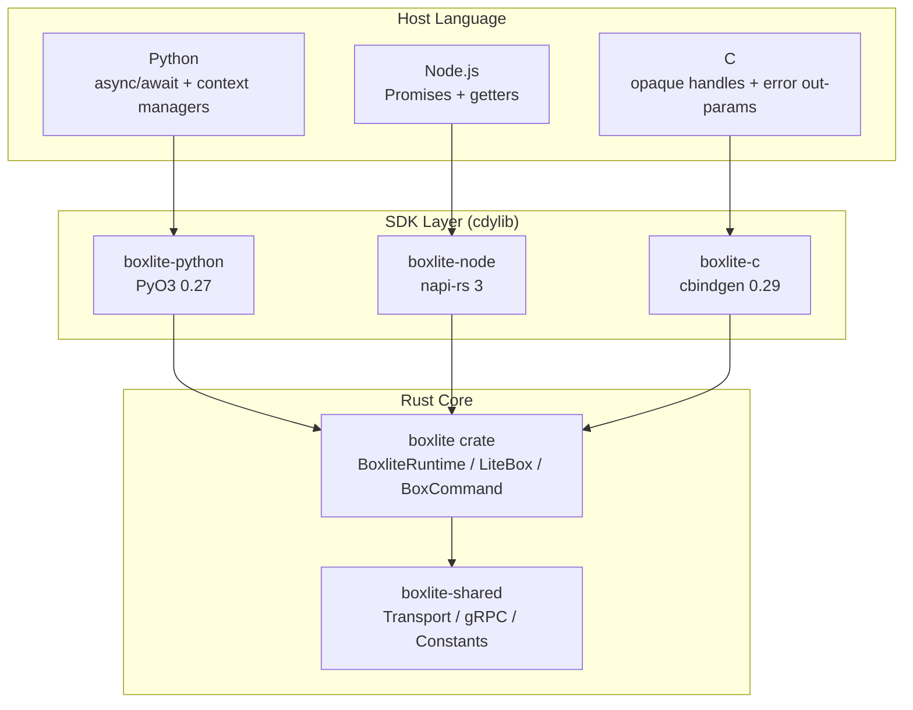
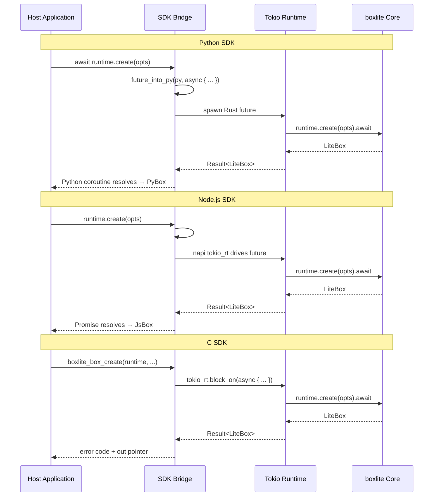
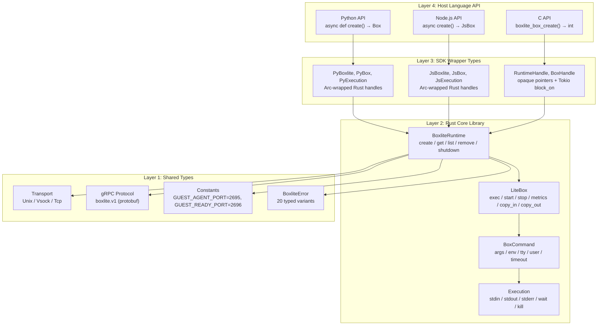
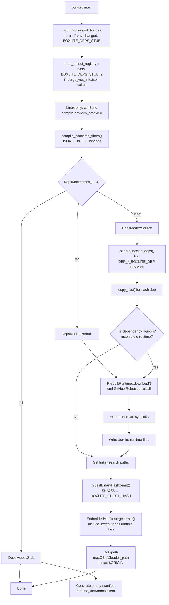
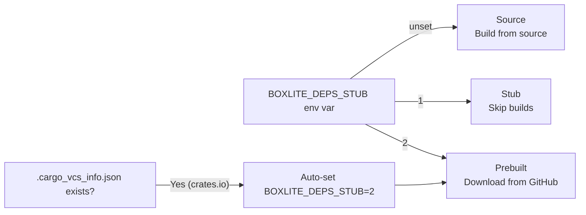
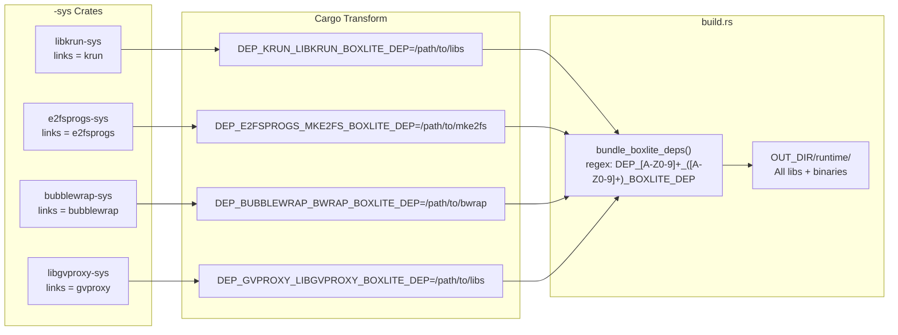
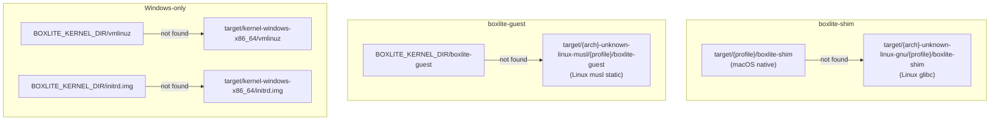
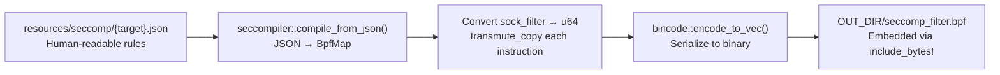
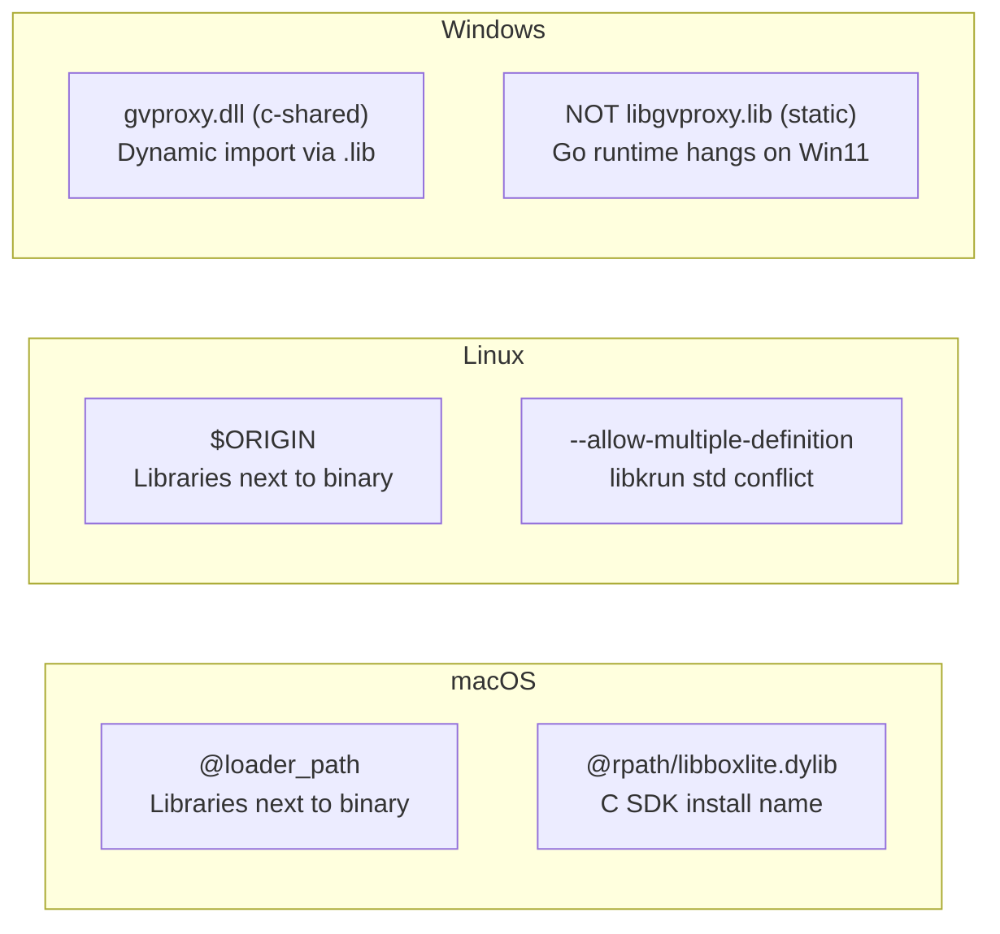
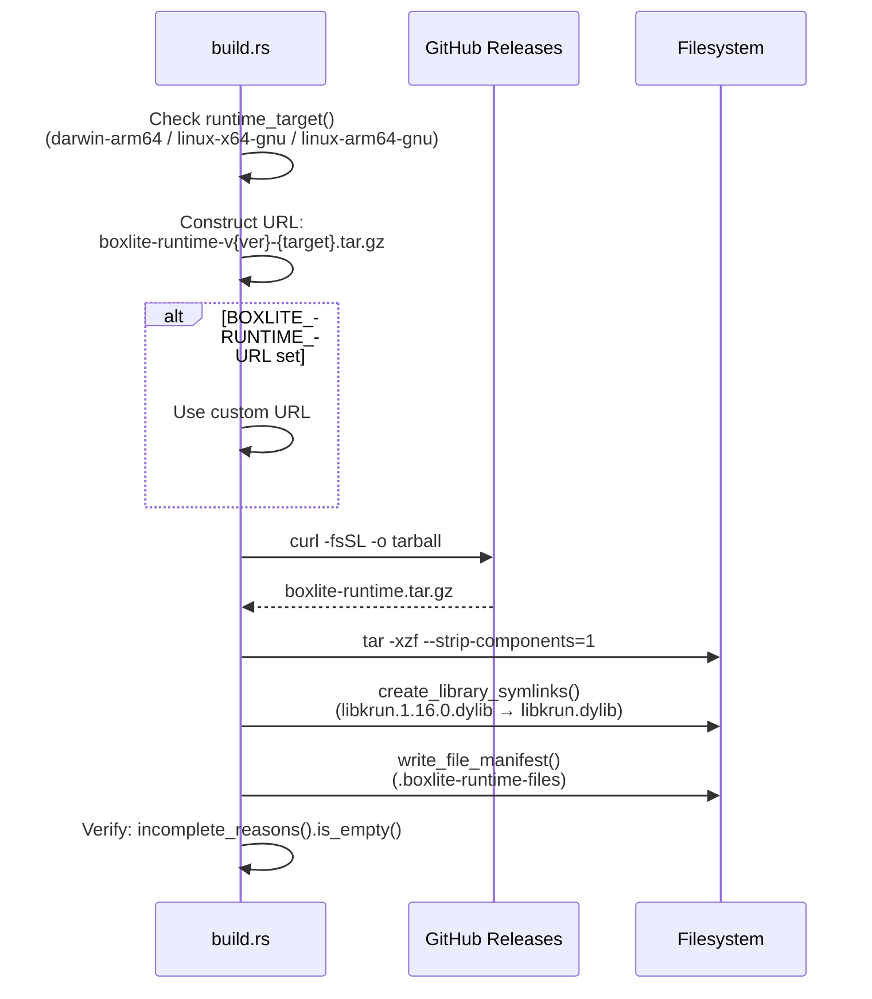

# SDK/FFI Layer and Cross-Platform Build System / SDK/FFI 层与跨平台构建系统

> BoxLite exposes its Rust core through three language-specific SDKs -- Python (PyO3),
> Node.js (napi-rs), and C (cbindgen FFI). This document covers the layered bridge
> architecture, async bridging patterns, error propagation, and the ~1,400-line build
> system that bundles native dependencies, compiles seccomp filters, and embeds runtime
> binaries for self-contained distribution.

**Version**: 0.9.2 | **Rust Edition**: 2024 | **MSRV**: 1.88

---

## Table of Contents / 目录

- [Part A: Concise Version (扼要版)](#part-a-concise-version-扼要版)
  - [A.1 SDK Architecture Overview / SDK 架构总览](#a1-sdk-architecture-overview--sdk-架构总览)
  - [A.2 Async Bridging Patterns / 异步桥接模式](#a2-async-bridging-patterns--异步桥接模式)
  - [A.3 Error Propagation / 错误传播](#a3-error-propagation--错误传播)
  - [A.4 Build System at a Glance / 构建系统概览](#a4-build-system-at-a-glance--构建系统概览)
  - [A.5 Cross-Platform Compilation / 跨平台编译](#a5-cross-platform-compilation--跨平台编译)
- [Part B: Comprehensive Version (全面细致版)](#part-b-comprehensive-version-全面细致版)
  - [B.1 Layered Bridge Architecture / 分层桥接架构](#b1-layered-bridge-architecture--分层桥接架构)
  - [B.2 Shared Types Layer / 共享类型层](#b2-shared-types-layer--共享类型层)
  - [B.3 Python SDK Deep Dive (PyO3) / Python SDK 详解](#b3-python-sdk-deep-dive-pyo3--python-sdk-详解)
  - [B.4 Node.js SDK Deep Dive (napi-rs) / Node.js SDK 详解](#b4-nodejs-sdk-deep-dive-napi-rs--nodejs-sdk-详解)
  - [B.5 C SDK Deep Dive (cbindgen FFI) / C SDK 详解](#b5-c-sdk-deep-dive-cbindgen-ffi--c-sdk-详解)
  - [B.6 SDK API Surface Comparison / SDK API 接口对照](#b6-sdk-api-surface-comparison--sdk-api-接口对照)
  - [B.7 Build System Deep Dive (build.rs) / 构建系统详解](#b7-build-system-deep-dive-buildrs--构建系统详解)
  - [B.8 Dependency Bundling Pipeline / 依赖打包流水线](#b8-dependency-bundling-pipeline--依赖打包流水线)
  - [B.9 Embedded Runtime Manifest / 嵌入式运行时清单](#b9-embedded-runtime-manifest--嵌入式运行时清单)
  - [B.10 Seccomp Filter Compilation / Seccomp 过滤器编译](#b10-seccomp-filter-compilation--seccomp-过滤器编译)
  - [B.11 Feature Flags / 特性开关](#b11-feature-flags--特性开关)
  - [B.12 Cross-Platform Conditional Compilation / 跨平台条件编译](#b12-cross-platform-conditional-compilation--跨平台条件编译)
  - [B.13 Platform-Specific Linking / 平台特定链接](#b13-platform-specific-linking--平台特定链接)
  - [B.14 Source File Reference / 源文件参考](#b14-source-file-reference--源文件参考)

---

# Part A: Concise Version (扼要版)

## A.1 SDK Architecture Overview / SDK 架构总览

BoxLite uses a **layered bridge pattern** where a single platform-agnostic Rust core
(`boxlite` crate) is exposed through three language-specific SDK crates. Each SDK is
a `cdylib` that wraps the same `BoxliteRuntime` and `LiteBox` types with language-idiomatic
APIs.



| SDK | Binding Framework | Crate Type | Async Model | Key Dependency |
|-----|-------------------|------------|-------------|----------------|
| Python | PyO3 0.27.1 | `cdylib` | `pyo3_async_runtimes::tokio::future_into_py()` | `pyo3`, `pyo3-async-runtimes` |
| Node.js | napi-rs 3 | `cdylib` | `#[napi] async fn` (auto-Promise) | `napi`, `napi-derive` |
| C | cbindgen 0.29 | `cdylib` + `staticlib` | `block_on()` (synchronous) | `cbindgen`, `tokio` |

**Core pattern across all SDKs:**

1. Wrap `BoxliteRuntime` in `Arc<BoxliteRuntime>` for shared ownership
2. Wrap `LiteBox` in `Arc<LiteBox>` for cross-reference safety
3. Convert `BoxliteError` to language-specific error types via a `map_err` helper
4. Mirror the Rust API surface 1:1 with language-idiomatic naming

## A.2 Async Bridging Patterns / 异步桥接模式

Each SDK handles the Rust-to-host-language async boundary differently:



## A.3 Error Propagation / 错误传播

All SDKs funnel through the centralized `BoxliteError` enum from `boxlite-shared`:

| SDK | Error Mapping | User-Facing Type |
|-----|--------------|------------------|
| Python | `map_err(e) → PyRuntimeError::new_err(e.to_string())` | `RuntimeError` with message |
| Node.js | `map_err(e) → NapiError::from_reason(e.to_string())` | `Error` with message |
| C | `error_to_code(&e) → BoxliteErrorCode` enum + `FFIError` struct | Integer code + `char*` message |

## A.4 Build System at a Glance / 构建系统概览

The `src/boxlite/build.rs` (~1,400 lines) handles five responsibilities:

1. **Dependency bundling** -- scans `DEP_{LINKS}_{NAME}_BOXLITE_DEP` env vars from `-sys` crates, copies libraries to `OUT_DIR/runtime/`
2. **Embedded runtime manifest** -- generates `include_bytes!` code for shim, guest, kernel binaries with SHA256 hashing
3. **Seccomp compilation** (Linux) -- compiles JSON filter rules to BPF bytecode via `seccompiler`
4. **Platform linking** -- sets `@rpath` (macOS), `$ORIGIN` (Linux), dynamic linking flags
5. **Prebuilt download** -- auto-detects crates.io packages, downloads from GitHub Releases

Three dependency resolution modes (`DepsMode`):

| Mode | Env Var | Behavior |
|------|---------|----------|
| `Source` | unset | Build `-sys` crates from source, bundle outputs |
| `Stub` | `BOXLITE_DEPS_STUB=1` | Skip everything (for `cargo check`/`cargo clippy`) |
| `Prebuilt` | `BOXLITE_DEPS_STUB=2` | Download prebuilt from GitHub Releases |

## A.5 Cross-Platform Compilation / 跨平台编译

BoxLite uses `#[cfg]` attributes extensively for platform-specific code:

| Platform | Hypervisor | Jailer | Dependencies |
|----------|-----------|--------|--------------|
| Linux | KVM | bwrap, landlock, cgroup, seccomp, apparmor | `nix`, `xattr`, `signal-hook`, `caps`, `seccompiler` |
| macOS | Hypervisor.framework | seatbelt (sandbox-exec) | `nix`, `xattr`, `signal-hook` |
| Windows | WHPX | Job Objects | `windows-sys`, `uds_windows` |

---

# Part B: Comprehensive Version (全面细致版)

## B.1 Layered Bridge Architecture / 分层桥接架构

The SDK architecture follows a strict layering principle. No SDK contains business
logic -- each is a thin translation layer from Rust types to host language types.



**Design invariants:**

- Every SDK module mirrors a core module: `runtime.rs`, `box_handle.rs`, `exec.rs`, `images.rs`, `metrics.rs`, `options.rs`, `snapshots.rs`
- All SDKs use `Arc<T>` for shared ownership -- the host language's GC can hold multiple references to the same Rust object
- Error conversion is a single function (`map_err`) per SDK, never scattered
- No SDK imports `boxlite-shared` directly except Node.js (for `BoxliteError` in its `map_err`). Python and C go through the re-exported `boxlite::BoxliteError`.

## B.2 Shared Types Layer / 共享类型层

The `boxlite-shared` crate (`src/shared/`) provides types used by both host-side runtime
and guest agent. SDKs depend on these indirectly through the `boxlite` crate.

### Transport Abstraction

```rust
// src/shared/src/transport.rs
pub enum Transport {
    Tcp { port: u16 },
    Unix { socket_path: PathBuf },
    Vsock { port: u32 },
}
```

Each variant has a URI representation (`tcp://127.0.0.1:8080`, `unix:///path/to/sock`,
`vsock://2695`) and round-trip parsing via `to_uri()` / `from_uri()`. The `Display` and
`FromStr` traits are implemented for seamless serialization.

### gRPC Protocol

The shared crate generates gRPC client/server code from protobuf definitions via
`tonic::include_proto!("boxlite.v1")`. Four services are generated:

| Service | Purpose |
|---------|---------|
| `Guest` | VM lifecycle (health check, shutdown) |
| `Container` | Container management inside VM |
| `Execution` | Command execution, stdin/stdout/stderr streaming |
| `Files` | File transfer between host and guest |

### Constants

Shared constants ensure host and guest agree on communication parameters:

```rust
// src/shared/src/constants.rs
pub mod network {
    pub const GUEST_AGENT_PORT: u32 = 2695;  // "BOXL" on phone keypad
    pub const GUEST_READY_PORT: u32 = 2696;  // "BOXM" on phone keypad
}

pub mod mount_tags {
    pub const ROOTFS: &str = "BoxLiteContainer0Rootfs";
    pub const LAYERS: &str = "BoxLiteContainer0Layers";
    pub const SHARED: &str = "BoxLiteShared";
}
```

## B.3 Python SDK Deep Dive (PyO3) / Python SDK 详解

**Crate**: `boxlite-python` | **Path**: `sdks/python/` | **Framework**: PyO3 0.27.1

### Module Structure

```
sdks/python/src/
  lib.rs               # Module registration (28 class exports)
  runtime.rs            # PyBoxlite → Arc<BoxliteRuntime>
  box_handle.rs         # PyBox → Arc<LiteBox>
  exec.rs               # PyExecution, PyExecStdin/Stdout/Stderr
  images.rs             # PyImageHandle, PyImageInfo, PyImagePullResult
  metrics.rs            # PyBoxMetrics, PyRuntimeMetrics
  options.rs            # PyBoxOptions, PyOptions, PyNetworkSpec, etc.
  info.rs               # PyBoxInfo, PyBoxStateInfo, PyHealthState
  snapshots.rs          # PySnapshotHandle, PySnapshotInfo
  snapshot_options.rs   # PySnapshotOptions, PyExportOptions, PyCloneOptions
  advanced_options.rs   # PyAdvancedBoxOptions, PySecurityOptions
  util.rs               # map_err helper (3 lines)
```

### Module Registration

The Python module is registered as `boxlite` with 30 exported classes (31 `add_class`
calls; `PyHealthCheckOptions` is registered twice):

```rust
// sdks/python/src/lib.rs
#[pymodule(name = "boxlite")]
fn boxlite_python(m: &Bound<'_, PyModule>) -> PyResult<()> {
    // Initialize tracing from RUST_LOG env var
    let _ = tracing_subscriber::fmt()
        .with_env_filter(tracing_subscriber::EnvFilter::from_default_env())
        .try_init();

    m.add_class::<PyOptions>()?;
    m.add_class::<PyBoxlite>()?;
    m.add_class::<PyBox>()?;
    m.add_class::<PyExecution>()?;
    // ... 24 more classes
    Ok(())
}
```

### Async Bridge Pattern

Every async operation uses `pyo3_async_runtimes::tokio::future_into_py()`, which converts
a Rust `Future` into a Python coroutine. The pattern is consistent across all methods:

```rust
// sdks/python/src/runtime.rs — canonical async bridge pattern
fn create<'py>(
    &self,
    py: Python<'py>,
    options: PyBoxOptions,
    name: Option<String>,
) -> PyResult<Bound<'py, PyAny>> {
    let runtime = Arc::clone(&self.runtime);     // 1. Clone Arc for move
    let opts = BoxOptions::try_from(options)     // 2. Convert options BEFORE async
        .map_err(map_err)?;
    pyo3_async_runtimes::tokio::future_into_py(  // 3. Bridge to Python
        py,
        async move {
            let handle = runtime.create(opts, name)
                .await.map_err(map_err)?;        // 4. Call core, map errors
            Ok(PyBox {
                handle: Arc::new(handle),        // 5. Wrap result in Arc
            })
        },
    )
}
```

**Why `Arc::clone` before the async block?** The `&self` reference cannot be moved into
the `async move` block (it borrows from Python). Cloning the `Arc` creates an owned
reference that the future can safely move across threads.

### Context Manager Support

`PyBox` implements `__aenter__` / `__aexit__` for the Testcontainers pattern --
the box auto-starts on entry and auto-stops on exit:

```rust
// sdks/python/src/box_handle.rs
fn __aenter__<'a>(slf: PyRefMut<'_, Self>, py: Python<'a>) -> PyResult<Bound<'a, PyAny>> {
    let handle = Arc::clone(&slf.handle);
    pyo3_async_runtimes::tokio::future_into_py(py, async move {
        handle.start().await.map_err(map_err)?;
        Ok(PyBox { handle })
    })
}

fn __aexit__<'a>(/* ... */) -> PyResult<Bound<'a, PyAny>> {
    let handle = Arc::clone(&slf.handle);
    pyo3_async_runtimes::tokio::future_into_py(py, async move {
        handle.stop().await.map_err(map_err)?;
        Ok(())
    })
}
```

Python usage:

```python
async with box as b:       # auto-starts
    result = await b.exec("echo", ["hello"])
                            # auto-stops on exit
```

### Streaming I/O

The `PyExecStdout` and `PyExecStderr` types implement Python's async iterator protocol
(`__aiter__` / `__anext__`) by wrapping Rust streams in `Arc<Mutex<...>>`:

```rust
// sdks/python/src/exec.rs
#[pyclass(name = "ExecStdout")]
pub(crate) struct PyExecStdout {
    pub(crate) stream: Arc<Mutex<boxlite::ExecStdout>>,
}

#[pymethods]
impl PyExecStdout {
    fn __aiter__(slf: PyRef<'_, Self>) -> PyRef<'_, Self> { slf }

    fn __anext__<'a>(&self, py: Python<'a>) -> PyResult<Option<Bound<'a, PyAny>>> {
        let stream = Arc::clone(&self.stream);
        let future = pyo3_async_runtimes::tokio::future_into_py(py, async move {
            use futures::StreamExt;
            let mut guard = stream.lock().await;
            match guard.next().await {
                Some(line) => Ok(line),
                None => Err(pyo3::exceptions::PyStopAsyncIteration::new_err("")),
            }
        })?;
        Ok(Some(future))
    }
}
```

### Error Mapping

The Python SDK's error mapping is a single 3-line function:

```rust
// sdks/python/src/util.rs
pub(crate) fn map_err(err: impl std::fmt::Display) -> PyErr {
    PyRuntimeError::new_err(err.to_string())
}
```

All `BoxliteError` variants become Python `RuntimeError` with the Rust error's display
string as the message. The generic `impl std::fmt::Display` bound means it also works
for non-BoxliteError types (e.g., `TryFrom` conversion errors).

## B.4 Node.js SDK Deep Dive (napi-rs) / Node.js SDK 详解

**Crate**: `boxlite-node` | **Path**: `sdks/node/` | **Framework**: napi-rs 3

### Module Structure

```
sdks/node/src/
  lib.rs               # Re-exports (pub use for all types)
  runtime.rs            # JsBoxlite → Arc<BoxliteRuntime>
  box_handle.rs         # JsBox → Arc<LiteBox>
  exec.rs               # JsExecution, JsExecStdin/Stdout/Stderr
  images.rs             # JsImageHandle, JsImageInfo
  metrics.rs            # JsBoxMetrics, JsRuntimeMetrics
  options.rs            # JsBoxOptions, JsOptions, etc.
  copy.rs               # JsCopyOptions
  info.rs               # JsBoxInfo, JsBoxStateInfo
  snapshots.rs          # JsSnapshotHandle, JsSnapshotInfo
  snapshot_options.rs   # JsSnapshotOptions, JsExportOptions
  advanced_options.rs   # JsSecurityOptions
  util.rs               # map_err helper
```

### Async Bridge Pattern

napi-rs provides built-in async support. The `#[napi] async fn` attribute automatically
converts Rust async functions into JavaScript Promise-returning functions:

```rust
// sdks/node/src/runtime.rs — napi-rs async pattern
#[napi]
pub async fn create(&self, options: JsBoxOptions, name: Option<String>) -> Result<JsBox> {
    let runtime = Arc::clone(&self.runtime);
    let options = BoxOptions::try_from(options).map_err(map_err)?;
    let handle = runtime.create(options, name).await.map_err(map_err)?;
    Ok(JsBox {
        handle: Arc::new(handle),
    })
}
```

Compared to the Python SDK, Node.js requires significantly less boilerplate:

- No manual `py: Python<'py>` lifetime threading
- No `future_into_py()` wrapper -- napi-rs handles Promise bridging internally
- Return types are directly `Result<T>` instead of `PyResult<Bound<'py, PyAny>>`

### Factory Methods and Getters

napi-rs uses attributes to control JavaScript API shape:

```rust
#[napi(constructor)]        // new Boxlite(options)
pub fn new(options: JsOptions) -> Result<Self> { /* ... */ }

#[napi(factory)]            // Boxlite.withDefaultConfig()
pub fn with_default_config() -> Result<Self> { /* ... */ }

#[napi(getter)]             // runtime.images (property, not method)
pub fn images(&self) -> Result<JsImageHandle> { /* ... */ }

#[napi(js_name = "importBox")]  // runtime.importBox() (camelCase)
pub async fn import_box(&self, ...) -> Result<JsBox> { /* ... */ }
```

### Release Profile Optimization

The Node.js SDK ships with aggressive release optimizations:

```toml
# sdks/node/Cargo.toml
[profile.release]
lto = true           # Link-time optimization
strip = true          # Strip debug symbols
codegen-units = 1     # Single codegen unit for better optimization
opt-level = 3         # Maximum optimization
```

### GetOrCreate Result Pattern

Node.js requires a wrapper struct because napi-rs cannot return tuples:

```rust
// sdks/node/src/runtime.rs
#[napi]
pub struct JsGetOrCreateResult {
    inner_handle: Arc<boxlite::LiteBox>,
    inner_created: bool,
}

#[napi]
impl JsGetOrCreateResult {
    #[napi(getter)]
    pub fn created(&self) -> bool { self.inner_created }

    #[napi(getter, js_name = "box")]
    pub fn get_box(&self) -> JsBox { /* ... */ }
}
```

### Error Mapping

```rust
// sdks/node/src/util.rs
pub(crate) fn map_err(err: BoxliteError) -> NapiError {
    NapiError::from_reason(format!("{}", err))
}
```

Unlike Python's generic `impl Display` bound, the Node.js `map_err` specifically
takes `BoxliteError`, because all napi-rs error paths go through the core error type.

## B.5 C SDK Deep Dive (cbindgen FFI) / C SDK 详解

**Crate**: `boxlite-c` | **Path**: `sdks/c/` | **Framework**: cbindgen 0.29

The C SDK is fundamentally different from the Python and Node.js SDKs because C has
no async runtime, no garbage collector, and no exception handling.

### Module Structure

```
sdks/c/src/
  lib.rs          # Opaque type aliases (16 type definitions)
  runtime.rs      # RuntimeHandle, RuntimeLiveness, FFI entry points
  box_handle.rs   # BoxHandle FFI functions
  exec.rs         # BoxRunner, ExecResult, ExecutionHandle, BoxliteCommand
  images.rs       # ImageHandle, CImageInfoList
  metrics.rs      # CBoxMetrics, CRuntimeMetrics
  options.rs      # OptionsHandle
  copy.rs         # Copy operation FFI
  info.rs         # CBoxInfo, CBoxInfoList
  error.rs        # BoxliteErrorCode enum (21 variants), FFIError struct
  util.rs         # c_str_to_string, ensure_runtime_live
  tests.rs        # Unit tests
```

### Opaque Handle Pattern

The C SDK exposes Rust types as opaque handles through 15 type aliases:

```rust
// sdks/c/src/lib.rs
pub type CBoxliteRuntime = runtime::RuntimeHandle;
pub type CBoxHandle = box_handle::BoxHandle;
pub type CBoxliteImageHandle = images::ImageHandle;
pub type CBoxliteOptions = options::OptionsHandle;
pub type CBoxliteError = error::FFIError;
pub type CBoxliteExecResult = exec::ExecResult;
pub type CBoxInfo = info::CBoxInfo;
pub type CBoxInfoList = info::CBoxInfoList;
pub type CBoxMetrics = metrics::CBoxMetrics;
pub type CExecutionHandle = exec::ExecutionHandle;
pub type CImageInfoList = images::CImageInfoList;
pub type CImagePullResult = images::CImagePullResult;
pub type CRuntimeMetrics = metrics::CRuntimeMetrics;
pub type CBoxliteSimple = exec::BoxRunner;
pub type BoxliteCommand = exec::BoxliteCommand;
```

C consumers see these as opaque pointers (`CBoxliteRuntime*`) and interact through
`boxlite_*` prefixed functions.

### Runtime Handle with Owned Tokio Runtime

Unlike the Python and Node.js SDKs (which rely on their host runtimes' event loops),
the C SDK must own its own Tokio runtime:

```rust
// sdks/c/src/runtime.rs
pub struct RuntimeHandle {
    pub runtime: BoxliteRuntime,
    pub tokio_rt: Arc<TokioRuntime>,
    pub liveness: Arc<RuntimeLiveness>,
}
```

All async operations use `block_on()` to drive the Tokio runtime synchronously:

```rust
let result = runtime_ref.tokio_rt.block_on(
    runtime_ref.runtime.shutdown(timeout)
);
```

### Liveness Tracking

The `RuntimeLiveness` struct uses `AtomicBool` to track whether the runtime is still
alive. Image handles and box handles check this before performing operations:

```rust
// sdks/c/src/runtime.rs
pub struct RuntimeLiveness {
    alive: AtomicBool,
}

impl RuntimeLiveness {
    pub fn is_alive(&self) -> bool {
        self.alive.load(Ordering::Acquire)
    }
    pub fn mark_closed(&self) {
        self.alive.store(false, Ordering::Release);
    }
}
```

This prevents use-after-free scenarios where a C caller tries to use an image handle
after freeing the runtime.

### FFI Function Convention

Every C-facing function follows a consistent pattern:

```rust
// sdks/c/src/runtime.rs — canonical FFI pattern
#[unsafe(no_mangle)]
pub unsafe extern "C" fn boxlite_runtime_new(
    home_dir: *const c_char,                    // Input: nullable string
    image_registries: *const BoxliteImageRegistry,  // Input: array pointer
    image_registries_count: c_int,              // Input: array length
    out_runtime: *mut *mut CBoxliteRuntime,     // Output: handle pointer
    out_error: *mut CBoxliteError,              // Output: error details
) -> BoxliteErrorCode {                         // Return: error code
    // 1. Validate pointers
    if out_runtime.is_null() {
        write_error(out_error, null_pointer_error("out_runtime"));
        return BoxliteErrorCode::InvalidArgument;
    }
    // 2. Create Tokio runtime
    // 3. Parse options from C types
    // 4. Call core API
    // 5. Write result to out pointer
    // 6. Return BoxliteErrorCode::Ok
}
```

**Convention summary:**

- Return value: `BoxliteErrorCode` enum (0 = success)
- Output values: via `*mut *mut T` out-parameters
- Error details: via `*mut CBoxliteError` out-parameter (code + message string)
- Memory ownership: caller must call `boxlite_*_free()` for every `*_new()` / `*_create()`
- String ownership: error messages must be freed with `boxlite_error_free()`

### Error Code Enum

The C SDK provides a comprehensive error code enum that maps 1:1 to `BoxliteError` variants:

```rust
// sdks/c/src/error.rs
#[repr(C)]
pub enum BoxliteErrorCode {
    Ok = 0,
    Internal = 1,
    NotFound = 2,
    AlreadyExists = 3,
    InvalidState = 4,
    InvalidArgument = 5,
    Config = 6,
    Storage = 7,
    Image = 8,
    Network = 9,
    Execution = 10,
    Stopped = 11,
    Engine = 12,
    Unsupported = 13,
    Database = 14,
    Portal = 15,
    Rpc = 16,
    RpcTransport = 17,
    Metadata = 18,
    UnsupportedEngine = 19,
    ResourceExhausted = 20,
}
```

### Header Generation

The `build.rs` uses cbindgen to auto-generate `include/boxlite.h`:

```rust
// sdks/c/build.rs
fn main() {
    let crate_dir = env::var("CARGO_MANIFEST_DIR").unwrap();
    let output_file = PathBuf::from(&crate_dir).join("include").join("boxlite.h");

    // macOS: set install name for dylib
    if env::var("CARGO_CFG_TARGET_OS").as_deref() == Ok("macos") {
        println!("cargo:rustc-cdylib-link-arg=-Wl,-install_name,@rpath/libboxlite.dylib");
    }

    let config = cbindgen::Config::from_file(
        PathBuf::from(&crate_dir).join("cbindgen.toml")
    ).expect("Failed to load cbindgen.toml");

    cbindgen::Builder::new()
        .with_crate(&crate_dir)
        .with_config(config)
        .generate()
        .expect("Unable to generate C bindings")
        .write_to_file(&output_file);
}
```

The cbindgen configuration (`cbindgen.toml`):

```toml
language = "C"
include_guard = "BOXLITE_H"
pragma_once = true
cpp_compat = true
documentation = true
documentation_style = "c99"
style = "both"
usize_is_size_t = true

[parse]
parse_deps = false
```

## B.6 SDK API Surface Comparison / SDK API 接口对照

The following table compares API naming and patterns across all three SDKs.

### Runtime Operations

| Operation | Python | Node.js | C |
|-----------|--------|---------|---|
| Create runtime | `Boxlite(options)` | `new Boxlite(options)` | `boxlite_runtime_new(...)` |
| Default runtime | `Boxlite.default()` | `Boxlite.withDefaultConfig()` | `boxlite_runtime_new(NULL, ...)` |
| REST runtime | `Boxlite.rest(opts)` | `Boxlite.rest(opts)` | -- |
| Create box | `await runtime.create(opts)` | `await runtime.create(opts)` | `boxlite_box_create(runtime, ...)` |
| Get or create | `await runtime.get_or_create(opts)` | `await runtime.getOrCreate(opts)` | -- |
| List boxes | `await runtime.list_info()` | `await runtime.listInfo()` | -- |
| Get images | `runtime.images` (property) | `runtime.images` (getter) | `boxlite_runtime_images(...)` |
| Shutdown | `await runtime.shutdown(timeout)` | `await runtime.shutdown(timeout)` | `boxlite_runtime_shutdown(...)` |
| Free | `runtime.close()` | `runtime.close()` | `boxlite_runtime_free(runtime)` |

### Box Operations

| Operation | Python | Node.js | C |
|-----------|--------|---------|---|
| Execute | `await box.exec("cmd", args=[...])` | `await box.exec("cmd", [...])` | `boxlite_box_exec(...)` |
| Start | `await box.start()` | `await box.start()` | -- |
| Stop | `await box.stop()` | `await box.stop()` | -- |
| Metrics | `await box.metrics()` | `await box.metrics()` | `boxlite_box_metrics(...)` |
| Copy in | `await box.copy_in(src, dest)` | `await box.copyIn(src, dest)` | -- |
| Copy out | `await box.copy_out(src, dest)` | `await box.copyOut(src, dest)` | -- |
| Export | `await box.export(dest=path)` | `await box.export(dest)` | -- |
| Clone | `await box.clone_box()` | `await box.cloneBox()` | -- |
| Context mgr | `async with box as b:` | -- | -- |
| ID | `box.id` (property) | `box.id` (getter) | `boxlite_box_id(...)` |
| Name | `box.name` (property) | `box.name` (getter) | -- |

## B.7 Build System Deep Dive (build.rs) / 构建系统详解

The main build script at `src/boxlite/build.rs` (~1,400 lines) is the most complex
build script in the project. It orchestrates native dependency bundling, runtime
embedding, and platform-specific configuration.

### Execution Flow



### CargoBuildContext

The `CargoBuildContext` struct captures Cargo environment values and provides
workspace discovery:

```rust
struct CargoBuildContext {
    manifest_dir: PathBuf,  // CARGO_MANIFEST_DIR
    out_dir: PathBuf,       // OUT_DIR
    workspace_root: OnceCell<Option<PathBuf>>,  // Lazily resolved
    primary_package: bool,  // CARGO_PRIMARY_PACKAGE
}
```

Key method: `is_dependency_build()` -- detects whether boxlite is being built as a
dependency of another crate (e.g., an SDK or user project). This triggers prebuilt
runtime download if the source workspace does not have all required binaries.

### DepsMode Resolution



Auto-detection: When `boxlite` is downloaded from crates.io, Cargo adds
`.cargo_vcs_info.json` to the package. The build script detects this and
automatically switches to `Prebuilt` mode.

## B.8 Dependency Bundling Pipeline / 依赖打包流水线

### Convention: BOXLITE_DEP Environment Variables

Each `-sys` crate (e.g., `libkrun-sys`, `e2fsprogs-sys`, `bubblewrap-sys`) emits
a `cargo:{NAME}_BOXLITE_DEP=<path>` metadata line. Cargo transforms this into
a `DEP_{LINKS}_{NAME}_BOXLITE_DEP` environment variable for downstream crates.



The path can point to either:

- **A directory**: `copy_libs()` copies all library files (`.dylib`, `.so`, `.so.*`, `.dll`), skipping symlinks
- **A single file**: copies that file directly

### Library File Detection

```rust
fn is_library_file(path: &Path) -> bool {
    let filename = path.file_name().and_then(|n| n.to_str()).unwrap_or("");
    filename.ends_with(".dylib")      // macOS
        || filename.contains(".so")   // Linux (.so, .so.1.2.3)
        || filename.ends_with(".dll") // Windows
}
```

## B.9 Embedded Runtime Manifest / 嵌入式运行时清单

The `EmbeddedManifest` struct generates a Rust source file containing `include_bytes!`
directives for all runtime files. This enables self-contained SDK distribution where
the native libraries are embedded directly in the compiled binary.

### Generated Code

```rust
// Auto-generated: OUT_DIR/embedded_manifest.rs
pub const MANIFEST: &[(&str, u32, &[u8])] = &[
    ("boxlite-guest", 0o755, include_bytes!("/path/to/runtime/boxlite-guest")),
    ("boxlite-shim", 0o755, include_bytes!("/path/to/runtime/boxlite-shim")),
    ("libkrun.1.16.0.dylib", 0o644, include_bytes!("/path/to/runtime/libkrun.1.16.0.dylib")),
    // ...
];
```

Each entry contains: `(filename, unix_permissions, binary_content)`.

### Prebuilt Binary Search Order



### Content Hashing

The manifest generator computes a SHA256 hash over all embedded file names, modes,
and contents. This hash is exposed via `cargo:rustc-env=BOXLITE_MANIFEST_HASH={hash}`
for cache invalidation and build reproducibility checks.

### macOS Code Signing

When embedding `boxlite-shim` on macOS, the build script automatically signs the
binary with the `com.apple.security.hypervisor` entitlement:

```rust
fn sign_shim_with_entitlements(binary: &Path) {
    // Write temporary .entitlements.plist
    // Run: codesign -s - --force --entitlements <plist> <binary>
    // Clean up plist
}
```

This is necessary because `cargo test` implicitly rebuilds the shim binary, stripping
any previous signature. Without this step, every VM-dependent test would fail with
"Hypervisor.framework access denied."

### Guest Binary Hash

The `GuestBinaryHash` struct computes and embeds the SHA256 hash of the guest binary
at compile time via `cargo:rustc-env=BOXLITE_GUEST_HASH={hash}`. The runtime uses
this for integrity verification. The search order prioritizes the direct build output
over the `OUT_DIR/runtime/` copy to avoid stale hashes.

## B.10 Seccomp Filter Compilation / Seccomp 过滤器编译

On Linux, the build script compiles JSON seccomp filter rules to BPF bytecode at
build time for zero-overhead syscall filtering at runtime:



The compiled filter is a `HashMap<String, Vec<u64>>` serialized with bincode using
`standard().with_fixed_int_encoding()`. At runtime, the filter is deserialized and
applied without any JSON parsing overhead.

## B.11 Feature Flags / 特性开关

The `boxlite` crate uses Cargo features to control which native dependencies are
included and how the runtime is built:

| Feature | Default | Description | Controlled Dependency |
|---------|---------|-------------|----------------------|
| `embedded-runtime` | Yes | Embed shim/guest/kernel binaries via `include_bytes!` | -- |
| `krunfw` | Yes | Download libkrunfw firmware for runtime bundling | `libkrun-sys/krunfw` |
| `e2fsprogs` | Yes | Bundled mke2fs for ext4 image creation | `dep:e2fsprogs-sys` |
| `bubblewrap` | Yes | Bundled bwrap for sandbox isolation (Linux) | `dep:bubblewrap-sys` |
| `krun` | No | Statically link libkrun.a (for boxlite-shim only) | `libkrun-sys/krun` |
| `gvproxy` | No | gvisor-tap-vsock CGO library for networking | `dep:libgvproxy-sys` |
| `libslirp` | No | External libslirp-helper binary for networking | -- |
| `rest` | No | REST API client backend | `dep:reqwest`, `dep:urlencoding` |

**SDK feature activation:**

- Python and Node.js SDKs enable `rest` feature: `boxlite = { features = ["rest"] }`
- C SDK uses default features only

## B.12 Cross-Platform Conditional Compilation / 跨平台条件编译

BoxLite uses `#[cfg]` extensively to gate platform-specific code. Here are the key
patterns:

### Cargo.toml Dependencies

```toml
# Unix-specific (macOS + Linux)
[target.'cfg(unix)'.dependencies]
nix = { version = "0.30.1", features = ["mount"] }
xattr = "1.0"
signal-hook = "0.3"

# Windows-specific
[target.'cfg(target_os = "windows")'.dependencies]
windows-sys = { version = "0.61", features = [
    "Win32_Foundation",
    "Win32_System_JobObjects",
    "Win32_System_Threading",
    # ... 8 more feature groups
] }
uds_windows = "1.2"

# Linux-specific
[target.'cfg(target_os = "linux")'.dependencies]
caps = "0.5"
seccompiler = "0.4"
landlock = "0.4"
fuse-backend-rs = { version = "0.12", features = ["fusedev"] }
```

### Jailer Platform Gating

The jailer module has the most extensive platform gating in the codebase:

```
src/boxlite/src/jailer/
  mod.rs           # Cross-platform
  builder.rs       # Cross-platform
  command.rs       # Cross-platform
  common.rs        # Cross-platform
  error.rs         # Cross-platform
  pre_exec.rs      # Cross-platform
  sandbox.rs       # Cross-platform
  bwrap.rs         # #[cfg(target_os = "linux")]
  landlock.rs      # #[cfg(target_os = "linux")]
  cgroup.rs        # #[cfg(target_os = "linux")]
  credentials.rs   # #[cfg(target_os = "linux")]
  seccomp.rs       # #[cfg(target_os = "linux")]
  apparmor.rs      # #[cfg(target_os = "linux")]
  seatbelt.rs      # #[cfg(target_os = "macos")]
  job_object.rs    # #[cfg(target_os = "windows")]
```

### Build Script Gating

```rust
// Seccomp compilation: Linux only
#[cfg(target_os = "linux")]
fn compile_seccomp_filters() { /* JSON → BPF */ }

#[cfg(not(target_os = "linux"))]
fn compile_seccomp_filters() { /* no-op */ }

// KVM smoke test: Linux only
#[cfg(target_os = "linux")]
{
    cc::Build::new().file("src/kvm_smoke.c").compile("kvm_smoke");
}

// Linker flags: platform-specific
#[cfg(target_os = "linux")]
println!("cargo:rustc-link-arg-tests=-Wl,--allow-multiple-definition");
```

### Windows Kernel Embedding

On Windows, the Linux kernel and initrd must be embedded because WHPX does not
have firmware built into libkrun:

```rust
let target_os = env::var("CARGO_CFG_TARGET_OS").unwrap_or_default();
if target_os == "windows" {
    self.copy_prebuilt_binary(workspace_root, "vmlinuz", &profile,
        Self::find_prebuilt_kernel);
    self.copy_prebuilt_binary(workspace_root, "initrd.img", &profile,
        Self::find_prebuilt_initrd);
}
```

## B.13 Platform-Specific Linking / 平台特定链接

### rpath Configuration



**macOS:**
```rust
println!("cargo:rustc-link-arg=-Wl,-rpath,@loader_path");
```
The C SDK build script also sets:
```rust
println!("cargo:rustc-cdylib-link-arg=-Wl,-install_name,@rpath/libboxlite.dylib");
```

**Linux:**
```rust
println!("cargo:rustc-link-arg=-Wl,-rpath,$ORIGIN");
println!("cargo:rustc-link-arg-tests=-Wl,--allow-multiple-definition");
println!("cargo:rustc-link-arg-bins=-Wl,--allow-multiple-definition");
```

The `--allow-multiple-definition` flag is needed because `libkrun` is a Rust staticlib
that embeds its own copy of `std`. When linked into Rust test or bin targets, standard
library symbols would otherwise conflict.

**Windows:**

The build script includes a comment explaining why gvproxy must be linked dynamically
on Windows: the statically embedded Go runtime hangs on Windows 11 during
`_cgo_wait_runtime_init_done()`. The DLL approach (`c-shared` buildmode) avoids this.

### Prebuilt Runtime Download Flow



### Library Symlink Creation

Prebuilt tarballs contain versioned library files (e.g., `libkrun.1.16.0.dylib`), but
build-time linking requires unversioned names (`libkrun.dylib`). The build script
creates symlinks using regex matching:

```rust
// Regex for versioned libraries
// macOS: lib<name>.<version>.dylib → lib<name>.dylib
// Linux: lib<name>.so.<version>    → lib<name>.so
let re = Regex::new(
    r"^(lib\w+)\.(\d+\.)*\d+\.dylib$|^(lib\w+\.so)\.\d+(\.\d+)*$"
).unwrap();
```

## B.14 Source File Reference / 源文件参考

### Python SDK (`sdks/python/`)

| File | Purpose | Key Types |
|------|---------|-----------|
| `Cargo.toml` | Crate config: `cdylib`, PyO3 0.27.1, pyo3-async-runtimes 0.27 | -- |
| `src/lib.rs` | Module registration, 28 class exports | `boxlite_python()` |
| `src/runtime.rs` | Runtime wrapper with `Arc<BoxliteRuntime>` | `PyBoxlite` |
| `src/box_handle.rs` | Box handle with context manager support | `PyBox` |
| `src/exec.rs` | Execution + async streaming (stdin/stdout/stderr) | `PyExecution`, `PyExecStdout` |
| `src/images.rs` | Image management | `PyImageHandle`, `PyImageInfo` |
| `src/metrics.rs` | Runtime and box metrics | `PyBoxMetrics`, `PyRuntimeMetrics` |
| `src/options.rs` | Configuration types | `PyBoxOptions`, `PyOptions` |
| `src/info.rs` | Box state information | `PyBoxInfo`, `PyBoxStateInfo` |
| `src/snapshots.rs` | Snapshot management | `PySnapshotHandle`, `PySnapshotInfo` |
| `src/snapshot_options.rs` | Snapshot/export/clone options | `PySnapshotOptions`, `PyExportOptions` |
| `src/advanced_options.rs` | Security and health check options | `PyAdvancedBoxOptions` |
| `src/util.rs` | Error mapping (3 lines) | `map_err()` |

### Node.js SDK (`sdks/node/`)

| File | Purpose | Key Types |
|------|---------|-----------|
| `Cargo.toml` | Crate config: `cdylib`, napi 3, LTO release profile | -- |
| `src/lib.rs` | Re-exports (pub use for all types) | -- |
| `src/runtime.rs` | Runtime wrapper, factory methods, getters | `JsBoxlite`, `JsGetOrCreateResult` |
| `src/box_handle.rs` | Box handle with exec/start/stop/copy | `JsBox` |
| `src/exec.rs` | Execution with Mutex-wrapped streams | `JsExecution` |
| `src/images.rs` | Image management | `JsImageHandle`, `JsImageInfo` |
| `src/metrics.rs` | Runtime and box metrics | `JsBoxMetrics`, `JsRuntimeMetrics` |
| `src/options.rs` | Configuration types | `JsBoxOptions`, `JsOptions` |
| `src/copy.rs` | Copy options | `JsCopyOptions` |
| `src/info.rs` | Box state information | `JsBoxInfo`, `JsBoxStateInfo` |
| `src/snapshots.rs` | Snapshot management | `JsSnapshotHandle` |
| `src/snapshot_options.rs` | Snapshot/export/clone options | `JsSnapshotOptions` |
| `src/advanced_options.rs` | Security options | `JsSecurityOptions` |
| `src/util.rs` | Error mapping (3 lines) | `map_err()` |

### C SDK (`sdks/c/`)

| File | Purpose | Key Types |
|------|---------|-----------|
| `Cargo.toml` | Crate config: `cdylib` + `staticlib`, cbindgen 0.29 | -- |
| `cbindgen.toml` | Header generation config: C language, `BOXLITE_H` guard | -- |
| `build.rs` | Header generation + macOS install name | -- |
| `src/lib.rs` | 15 opaque type aliases, wildcard re-exports | `CBoxliteRuntime`, `CBoxHandle` |
| `src/runtime.rs` | `RuntimeHandle` with owned Tokio + `RuntimeLiveness` | `RuntimeHandle`, `RuntimeLiveness` |
| `src/box_handle.rs` | Box FFI functions | `BoxHandle` |
| `src/exec.rs` | Execution + simple runner | `BoxRunner`, `ExecResult`, `ExecutionHandle` |
| `src/images.rs` | Image management | `ImageHandle`, `CImageInfoList` |
| `src/metrics.rs` | Metrics structs | `CBoxMetrics`, `CRuntimeMetrics` |
| `src/options.rs` | Options handle | `OptionsHandle` |
| `src/copy.rs` | Copy operations | -- |
| `src/info.rs` | Box info structs | `CBoxInfo`, `CBoxInfoList` |
| `src/error.rs` | Error code enum (21 variants) + FFIError struct | `BoxliteErrorCode`, `FFIError` |
| `src/util.rs` | String conversion, liveness check | `c_str_to_string()` |
| `src/tests.rs` | Unit tests for FFI functions | -- |

### Shared Types (`src/shared/`)

| File | Purpose | Key Types |
|------|---------|-----------|
| `src/lib.rs` | Module declarations, protobuf generation, re-exports | 4 gRPC services |
| `src/transport.rs` | Transport abstraction with URI serialization | `Transport` |
| `src/constants.rs` | Shared host-guest constants | `GUEST_AGENT_PORT`, `GUEST_READY_PORT` |
| `src/errors.rs` | Centralized error enum | `BoxliteError` (20 variants) |
| `src/layout.rs` | Path computation for guest/container directories | `SharedGuestLayout` |
| `src/tar.rs` | Tar utilities | -- |

### Build System (`src/boxlite/`)

| File | Purpose | Lines |
|------|---------|-------|
| `build.rs` | Main build script: dependency bundling, manifest generation, seccomp, linking | ~1,400 |
| `Cargo.toml` | Feature flags, platform-specific dependencies, build dependencies | ~130 |

### Environment Variables

| Variable | Phase | Description |
|----------|-------|-------------|
| `BOXLITE_DEPS_STUB` | Build | `1` = stub mode, `2` = prebuilt mode |
| `BOXLITE_RUNTIME_URL` | Build | Custom URL for prebuilt runtime download |
| `BOXLITE_KERNEL_DIR` | Build | Directory containing vmlinuz/initrd.img (Windows) |
| `CARGO_FEATURE_EMBEDDED_RUNTIME` | Build | Set when `embedded-runtime` feature is enabled |
| `BOXLITE_MANIFEST_HASH` | Build output | SHA256 hash prefix of embedded manifest |
| `BOXLITE_GUEST_HASH` | Build output | SHA256 hash of guest binary |
| `BOXLITE_BUILD_PROFILE` | Build output | `debug` or `release` |
| `BOXLITE_RUNTIME_DIR` | Build output / Runtime | Path to extracted runtime directory |
| `RUST_LOG` | Runtime | Logging filter (e.g., `debug`, `boxlite=trace`) |
