# BoxLite 架构总览

> BoxLite 是一个可嵌入的虚拟机运行时，用于安全、隔离的代码执行——
> "沙箱界的 SQLite"。本文档提供了简明的概要总结和全面深入的系统架构解析。

**版本**: 0.9.2 | **Rust 版本**: 2024 | **最低支持 Rust 版本（MSRV）**: 1.88

---

## 目录

- [第一部分：扼要版](#第一部分扼要版)
  - [A.1 项目定位](#a1-项目定位)
  - [A.2 高层架构](#a2-高层架构)
  - [A.3 核心抽象](#a3-核心抽象)
  - [A.4 数据流](#a4-数据流)
  - [A.5 跨平台策略](#a5-跨平台策略)
- [第二部分：全面细致版](#第二部分全面细致版)
  - [B.1 项目结构](#b1-项目结构)
  - [B.2 工作空间与 Crate 依赖图](#b2-工作空间与-crate-依赖图)
  - [B.3 核心模块详解](#b3-核心模块详解)
  - [B.4 模块关系图](#b4-模块关系图)
  - [B.5 初始化流水线](#b5-初始化流水线)
  - [B.6 状态机](#b6-状态机)
  - [B.7 宿主-客户机通信](#b7-宿主-客户机通信)
  - [B.8 安全架构](#b8-安全架构)
  - [B.9 存储架构](#b9-存储架构)
  - [B.10 网络架构](#b10-网络架构)
  - [B.11 跨平台抽象层](#b11-跨平台抽象层)
  - [B.12 特性开关](#b12-特性开关)
  - [B.13 SDK 架构](#b13-sdk-架构)

---

# 第一部分：扼要版

## A.1 项目定位

BoxLite 是一个可嵌入的虚拟机运行时，为运行不受信任的代码提供硬件级隔离。与 Docker（基于守护进程）或 Firecracker（基于服务端）不同，BoxLite 是一个直接链接到应用程序中的**库**——无需守护进程、无需 root 权限、无需编排器。

**主要应用场景：**

- **AI Agent 沙箱** -- 安全执行 AI 生成的代码
- **Serverless 多租户运行时** -- 每个客户独立隔离
- **合规环境** -- 硬件级合规隔离边界

**核心特性：**

| 特性 | 实现方式 |
|---|---|
| 隔离 | 硬件虚拟机（KVM / Hypervisor.framework / WHPX） |
| 容器 | 在每个虚拟机内运行 OCI 镜像 |
| API | 异步 Rust 库，Python/Node.js/C SDK |
| 通信 | gRPC over vsock（虚拟套接字）（宿主到客户机） |
| 存储 | QCOW2 COW（写时复制）磁盘，SQLite 元数据 |

## A.2 高层架构

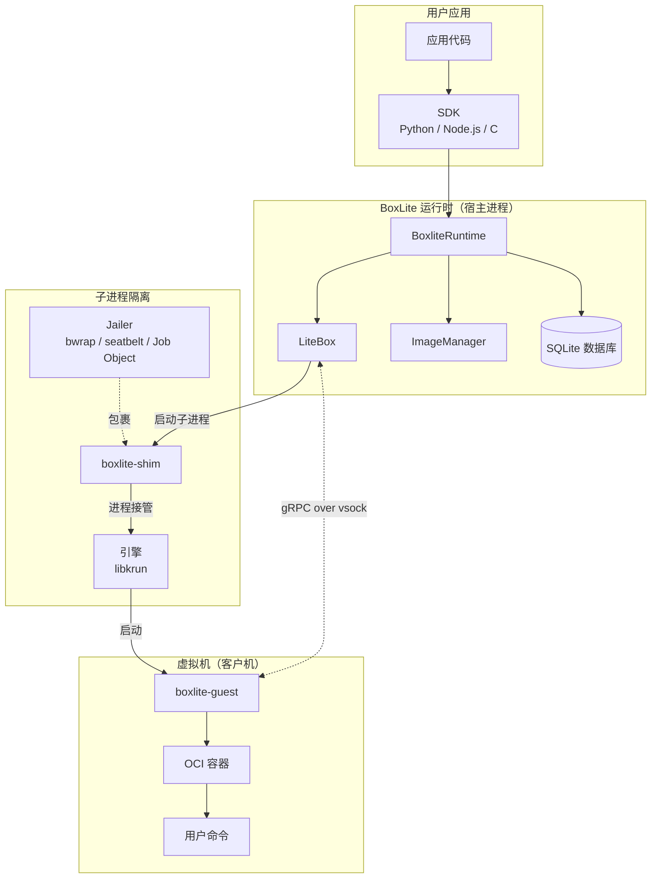

**Box 的运行流程：**

1. 用户调用 `runtime.create_box(options)` -- 返回一个 `LiteBox` 句柄。
2. 调用 `start()` 时，运行时将 `boxlite-shim` 作为子进程启动。
3. Jailer（监禁器）使用平台特定的沙箱机制包裹该子进程。
4. Shim 调用 `krun_start_enter()`，执行**进程接管** -- shim 进程*变成*虚拟机。
5. 在虚拟机内部，`boxlite-guest` 作为 PID 1 启动，设置 OCI 容器，并在 vsock 端口 2695 上监听 gRPC 命令。
6. 宿主通过 gRPC 与客户机通信，执行命令、传输文件、管理容器生命周期。

## A.3 核心抽象

| 抽象 | 角色 | 关键细节 |
|---|---|---|
| **BoxliteRuntime** | 入口点 | 创建/管理 Box。拥有 ImageManager、BoxManager、Database、Layout |
| **LiteBox** | Box 句柄（门面） | `BoxBackend` 的轻量包装。委派给 `BoxImpl`（本地）或 `RestBox`（远程） |
| **BoxImpl** | 核心实现 | 拥有不可变配置、可变状态（`RwLock`）、延迟初始化的 `LiveState`（`OnceCell`） |
| **Vmm (trait)** | 可插拔虚拟化引擎 | 当前实现：Krun (libkrun)。未来计划：Firecracker |
| **ShimController** | 进程管理器 | 启动 `boxlite-shim` 子进程；看门狗监控健康状态 |
| **Jailer** | 纵深防御沙箱 | 平台特定实现：bwrap + landlock + seccomp (Linux)、seatbelt (macOS)、Job Objects (Windows) |
| **GuestSession** | gRPC 客户端 | 4 个服务接口：Guest、Container、Execution、Files |
| **boxlite-guest** | 客户机代理 | 虚拟机内的 PID 1。处理初始化、容器设置、执行和文件传输 |

## A.4 数据流

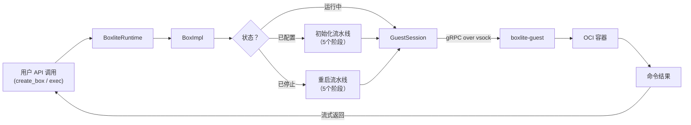

## A.5 跨平台策略

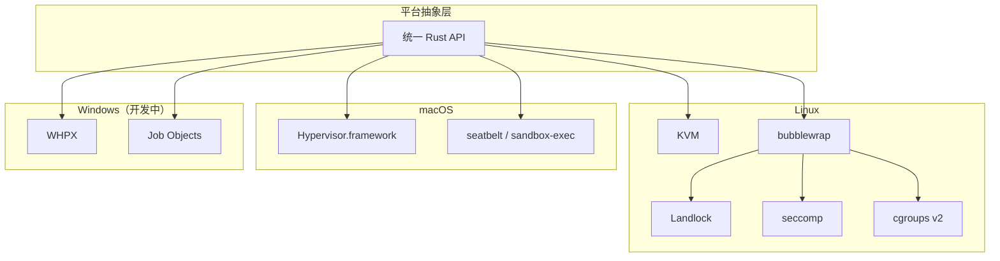

三个平台共享相同的公共 API（`BoxliteRuntime`、`LiteBox`、`BoxCommand`）。平台差异隔离在 trait（`Vmm`、`Sandbox`、`Jail`）和 `#[cfg]` 条件编译门控之后。

---

# 第二部分：全面细致版

## B.1 项目结构

```
boxlite/
├── src/
│   ├── boxlite/               # 核心运行时库（Rust）
│   │   ├── src/
│   │   │   ├── lib.rs          # 公共 API 表面 + 模块声明
│   │   │   ├── runtime/        # BoxliteRuntime：入口点、选项、布局、ID
│   │   │   ├── litebox/        # LiteBox：Box 句柄、状态机、初始化流水线、执行
│   │   │   ├── vmm/            # 虚拟机管理器：引擎 trait、Krun、ShimController、看门狗
│   │   │   ├── jailer/         # 安全：seccomp、seatbelt、bwrap、landlock、cgroups、jobs
│   │   │   ├── portal/         # 宿主-客户机 gRPC：连接、会话、服务接口
│   │   │   ├── images/         # OCI 镜像：拉取、缓存、提取层、清单
│   │   │   ├── rootfs/         # 根文件系统：构建器、copy_mount、overlayfs、操作
│   │   │   ├── net/            # 网络：gvproxy 后端、端口转发、DNS、MITM、CA
│   │   │   ├── disk/           # 磁盘：QCOW2、ext4、COW、基础磁盘管理
│   │   │   ├── volumes/        # 卷：客户机卷（virtiofs）、容器卷（bind mount）
│   │   │   ├── db/             # SQLite：box_config、box_state、image_index、base_disk、快照
│   │   │   ├── lock/           # 多进程文件锁
│   │   │   ├── metrics/        # 运行时和单 Box 指标
│   │   │   ├── pipeline/       # 通用阶段式流水线执行器
│   │   │   ├── event_listener/ # 审计事件系统
│   │   │   ├── fs/             # 文件系统辅助工具（bind mount）
│   │   │   ├── rest/           # REST API 客户端后端（可选）
│   │   │   └── util/           # 跨领域工具函数
│   │   └── src/bin/shim/       # boxlite-shim 二进制（子进程入口点）
│   │
│   ├── shared/                 # 共享类型：protobuf、传输层、错误、常量
│   ├── cli/                    # CLI 二进制（boxlite 命令）
│   ├── server/                 # 分布式服务端（REST 后端）
│   ├── guest/                  # 客户机代理二进制（在虚拟机内作为 PID 1 运行）
│   ├── ffi/                    # FFI（外部函数接口）层，用于 C SDK
│   ├── test-utils/             # 测试工具（虚拟机辅助、临时目录）
│   └── deps/                   # 自带的 C sys crate
│       ├── bubblewrap-sys/     # Linux 沙箱（bwrap 二进制）
│       ├── e2fsprogs-sys/      # ext4 文件系统工具（mke2fs）
│       ├── libgvproxy-sys/     # Go 网络代理（gvisor-tap-vsock CGO）
│       └── libkrun-sys/        # 虚拟化引擎绑定（KVM/HVF/WHPX）
│
├── sdks/
│   ├── python/                 # Python SDK（PyO3，Python 3.10+）
│   ├── c/                      # C SDK（FFI/cbindgen）
│   └── node/                   # Node.js SDK（napi-rs，Node.js 18+）
│
├── examples/python/            # Python 示例（7 个分类子目录）
├── docs/                       # 文档
└── scripts/                    # 构建和设置脚本
```

## B.2 工作空间与 Crate 依赖图

工作空间包含 12 个 crate，分为三个层级：核心库、平台绑定和 SDK 绑定。

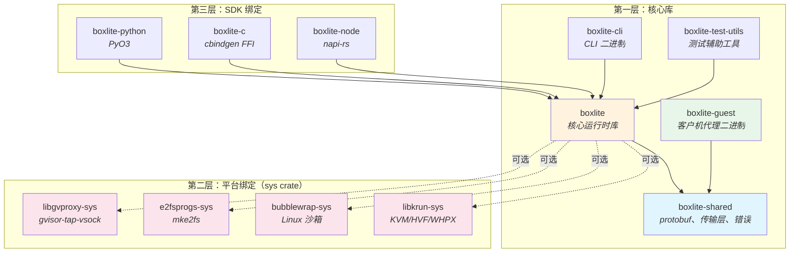

**依赖规则：**

- `boxlite-shared` 是基础层 -- 宿主端（`boxlite`）和客户机端（`boxlite-guest`）都依赖它。包含 protobuf 定义、传输类型、错误类型和共享常量（端口号、挂载标签）。
- `boxlite`（核心）依赖 `boxlite-shared`，并可选依赖四个 sys crate。这些 sys crate 通过特性开关（feature flag）控制，因此在文档生成和仅 API 使用场景下，库可以在没有本地依赖的情况下编译。
- SDK crate（`python`、`c`、`node`）依赖 `boxlite` 核心，分别通过 PyO3、cbindgen 和 napi-rs 提供语言绑定。
- `boxlite-guest` 仅依赖 `boxlite-shared`（加上 Linux 特定的 crate，如 `libcontainer` 和 `tokio-vsock`）。它永远不会依赖宿主端的 `boxlite` crate。

## B.3 核心模块详解

### B.3.1 runtime/ -- BoxliteRuntime（入口点）

`runtime/` 模块是主入口点。`BoxliteRuntime` 是一个与后端无关的门面（facade），委派给 `RuntimeBackend` 实现。

**子模块：**

| 子模块 | 用途 |
|---|---|
| `core.rs` | `BoxliteRuntime` 结构体：`new()`、`default()`、`create_box()`、`list_boxes()`、`remove_box()` |
| `rt_impl.rs` | `RuntimeImpl` / `LocalRuntime`：本地虚拟机后端实现 |
| `backend.rs` | `RuntimeBackend` + `BoxBackend` + `SnapshotBackend` trait |
| `options.rs` | `BoxliteOptions`、`BoxOptions`、`NetworkSpec`、`VolumeSpec`、`Secret` |
| `advanced_options.rs` | `SecurityOptions`、`ResourceLimits`、`HealthCheckOptions` |
| `layout.rs` | `FilesystemLayout` + `BoxFilesystemLayout`：`~/.boxlite/` 的类型化路径访问器 |
| `id.rs` | `BoxID`、`BaseDiskID`（基于 ULID），使用 `Mint` 类型进行受控生成 |
| `images.rs` | `ImageHandle`：拉取、缓存和管理 OCI 镜像 |
| `constants.rs` | 虚拟机默认值（1 CPU、2048 MiB）、默认镜像、挂载标签 |
| `embedded.rs` | `include_bytes!` 嵌入 shim/guest/kernel 二进制文件 |
| `signal_handler.rs` | SIGTERM/SIGINT 信号处理器，用于优雅关闭 |

**关键设计决策：**

- `BoxliteRuntime` 通过 `Arc` 实现低开销克隆 -- 所有克隆共享相同状态。
- 文件系统锁确保同一时间只有一个本地运行时使用给定的 `BOXLITE_HOME`。
- 全局 `DEFAULT_RUNTIME` 单例使用 `OnceLock`，配合 `atexit` 处理器进行进程级清理。

### B.3.2 litebox/ -- LiteBox（Box 生命周期）

`LiteBox` 是用户操作单个沙箱的句柄。

**子模块：**

| 子模块 | 用途 |
|---|---|
| `mod.rs` | `LiteBox` 结构体：委派给 `BoxBackend` 的轻量门面 |
| `box_impl.rs` | `BoxImpl` + `SharedBoxImpl`：包含 `LiveState` 的核心实现 |
| `config.rs` | `BoxConfig`：创建时存储一次的不可变配置 |
| `state.rs` | `BoxStatus` 枚举、`BoxState` 结构体、状态机转换 |
| `init/` | `BoxBuilder` + 初始化流水线（5 阶段表驱动初始化） |
| `exec.rs` | `BoxCommand`、`Execution`、`ExecResult`（流式 stdin/stdout/stderr） |
| `copy.rs` | `CopyOptions`：宿主-客户机文件传输 |
| `manager.rs` | `BoxManager`：并发 Box 注册表 |
| `snapshot.rs` / `snapshot_mgr.rs` | 快照句柄和生命周期 |
| `archive.rs` | `.boxlite` 可移植归档导出/导入 |
| `clone_export.rs` | Box 克隆（单个 + 共享基础磁盘的批量克隆） |
| `crash_report.rs` | `CrashReport`：在 shim 崩溃时捕获 `ExitInfo` |

**关键设计决策：**

- `BoxImpl` 使用**延迟初始化**：`LiveState` 存储在 `OnceCell` 中，仅在 Box 首次启动时填充。
- 初始化流水线是**表驱动的**：根据 `BoxStatus`（Configured、Stopped、Running）选择不同的执行计划。
- `LiteBox` 是 `Send + Sync` 的（源代码中有编译时断言）。

### B.3.3 vmm/ -- 虚拟机管理器

VMM（虚拟机管理器）模块提供可插拔的引擎抽象。

**子模块：**

| 子模块 | 用途 |
|---|---|
| `engine.rs` | `Vmm` trait + `VmmInstance` + `VmmConfig` |
| `krun/` | Krun 引擎：libkrun FFI、`create()` 实现 |
| `controller/` | `VmmController` trait、`ShimController`、`ShimHandler` |
| `controller/watchdog.rs` | 基于管道的父进程死亡检测 + 健康监控 |
| `factory.rs` | `VmmFactory`：引擎实例化 |
| `registry.rs` | `create_engine()`：VmmKind -> 具体引擎 |
| `exit_info.rs` | `ExitInfo`：来自 shim 的结构化崩溃数据 |
| `guest_check.rs` | 客户机就绪性验证 |

**引擎 trait 层次结构：**

```
Vmm (trait)                    -- 从 InstanceSpec 创建 VmmInstance
  └── VmmInstance              -- enter() 执行进程接管
        └── VmmInstanceImpl    -- 引擎特定的内部实现

VmmController (trait)          -- 启动虚拟机，返回 VmmHandler
  └── ShimController           -- 启动 boxlite-shim 子进程

VmmHandler (trait)             -- 运行时操作（停止、指标）
  └── ShimHandler              -- 管理 shim 子进程
```

**VmmKind 枚举：**

- `Libkrun`（默认）-- 使用 libkrun 进行 KVM/HVF/WHPX 虚拟化
- `Firecracker`（未来计划）-- Firecracker 集成的占位符

### B.3.4 jailer/ -- 安全隔离

Jailer（监禁器）为 `boxlite-shim` 进程提供纵深防御沙箱机制。

**Trait 层次结构：**

```
Jail (trait -- 公共契约)
│   prepare()  -> 启动前设置
│   command()  -> 受限命令，准备好启动
│
└── Jailer<S: Sandbox> (struct -- 实现 Jail)
    │   将 SecurityOptions 转换为 SandboxContext
    │   委派给 S，添加 pre_exec 钩子
    │
    └── Sandbox (trait -- 平台特定包装)
        ├── BwrapSandbox        (Linux -- bubblewrap + 命名空间)
        ├── SeatbeltSandbox     (macOS -- sandbox-exec 配合 SBPL)
        ├── JobSandbox          (Windows -- Job Objects)
        └── NoopSandbox         (沙箱不可用时的回退方案)
```

**平台安全层：**

| 层 | Linux | macOS | Windows |
|---|---|---|---|
| 进程隔离 | PID/mount/net 命名空间 (bwrap) | sandbox-exec (SBPL 配置文件) | Job Objects |
| 文件系统限制 | Landlock LSM | Seatbelt deny-default | -- |
| 系统调用过滤 | seccomp BPF（编译时编译） | -- | -- |
| 资源限制 | cgroups v2 + rlimits | rlimits | Job Object 限制 |
| 二进制隔离 | Shim 复制（Firecracker 模式） | Shim 复制 | Shim 复制 |

### B.3.5 portal/ -- 宿主-客户机 gRPC 通信

portal 模块提供宿主与客户机代理之间的 gRPC 通信。

**子模块：**

| 子模块 | 用途 |
|---|---|
| `connection.rs` | 通过 Unix 套接字 / vsock 创建 gRPC 通道 |
| `session.rs` | `GuestSession`：包含全部四个服务接口的统一客户端 |
| `interfaces/guest.rs` | `GuestInterface`：初始化、关闭、网络配置 |
| `interfaces/container.rs` | `ContainerInterface`：根文件系统设置、容器生命周期 |
| `interfaces/exec.rs` | `ExecutionInterface`：带流式 I/O 的命令执行 |
| `interfaces/files.rs` | `FilesInterface`：文件传输（复制入/出） |

**通信流程：**

```
宿主进程                              客户机虚拟机
    │                                     │
    │  Unix 套接字 ←─ libkrun 桥接 ─→ vsock
    │                                     │
    ├── GuestInterface ──────────────→ Guest 服务（初始化、关闭）
    ├── ContainerInterface ──────────→ Container 服务（根文件系统、生命周期）
    ├── ExecutionInterface ──────────→ Execution 服务（执行、流式 I/O）
    └── FilesInterface ──────────────→ Files 服务（通过 tar 流复制入/出）
```

### B.3.6 其它模块

| 模块 | 用途 |
|---|---|
| `images/` | OCI 镜像拉取（通过 `oci-client`）、层提取、清单解析、内容寻址缓存 |
| `rootfs/` | 根文件系统准备：`RootfsBuilder`（Linux 上使用 overlayfs）、`copy_mount` 回退方案、客户机根文件系统组装 |
| `net/` | 网络后端工厂模式。可插拔：gvproxy (gvisor-tap-vsock)、libslirp。功能：端口转发、DNS 黑洞（`allow_net`）、MITM（中间人）代理（密钥注入）、每个 Box 生成 CA 证书 |
| `disk/` | RAII `Disk` 类型、QCOW2 COW 子盘创建、从目录创建 ext4（`mke2fs`）、`fork_qcow2`（原子快照/克隆）、`BaseDiskManager`（带引用计数的共享基础镜像） |
| `volumes/` | `GuestVolumeManager`（virtiofs 共享 + 块设备）、`ContainerVolumeManager`（容器内 bind mount） |
| `db/` | SQLite 持久化：`BoxStore`（配置 + 状态）、`ImageIndexStore`（OCI 缓存）、`BaseDiskStore`（引用计数的基础磁盘）、`SnapshotStore`。WAL 模式、自动迁移 |
| `lock/` | 基于文件的多进程锁，用于安全的并发访问 |
| `pipeline/` | 通用阶段式流水线：`Stage`（顺序或并行任务）、`PipelineBuilder`、`PipelineExecutor`、`PipelineMetrics` |
| `metrics/` | `RuntimeMetrics`（全局）、`BoxMetrics`（每个 Box 的初始化阶段计时、进程统计） |
| `event_listener/` | `AuditEvent` 审计事件系统，用于可观测性钩子 |

## B.4 模块关系图

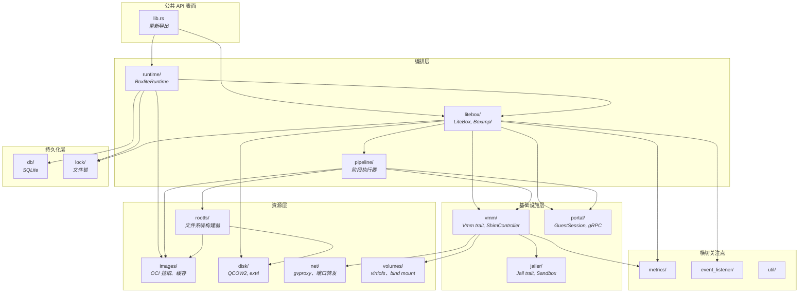

## B.5 初始化流水线

Box 的初始化是表驱动的，根据当前状态选择不同的执行计划。流水线使用通用的 `Stage` 执行器，支持顺序和并行任务执行，并通过 `CleanupGuard`（RAII 模式）在失败时自动清理。

### B.5.1 首次启动（已配置 -> 运行中）

```mermaid
flowchart TD
    START([BoxBuilder.build]) --> S1

    subgraph S1["阶段 1：文件系统（顺序）"]
        FS[FilesystemTask<br/><i>创建 Box 目录布局</i>]
    end

    S1 --> S2

    subgraph S2["阶段 2：根文件系统准备（并行）"]
        CR[ContainerRootfsTask<br/><i>拉取 OCI 镜像 → 创建 ext4 → QCOW2 COW</i>]
        GR[GuestRootfsTask<br/><i>准备客户机根文件系统 → QCOW2 COW</i>]
    end

    S2 --> S3

    subgraph S3["阶段 3：虚拟机启动（顺序）"]
        VS[VmmSpawnTask<br/><i>构建 InstanceSpec → ShimController.start()</i>]
    end

    S3 --> S4

    subgraph S4["阶段 4：客户机连接（顺序）"]
        GC[GuestConnectTask<br/><i>在端口 2696 等待客户机就绪信号</i>]
    end

    S4 --> S5

    subgraph S5["阶段 5：客户机初始化（顺序）"]
        GI[GuestInitTask<br/><i>初始化容器根文件系统和卷</i>]
    end

    S5 --> DONE([LiveState 就绪])

    style S2 fill:#e8f5e9
```

### B.5.2 重启（已停止 -> 运行中）

重启流水线在结构上完全相同，但根文件系统任务**复用现有的 QCOW2 COW 磁盘**，而不是创建新的。这样可以保留上一次会话中写入的用户数据。

### B.5.3 重新挂接（运行中 -> 运行中）

当 Box 已经在运行时（例如，使用 `detach: true` 后父进程重启）：

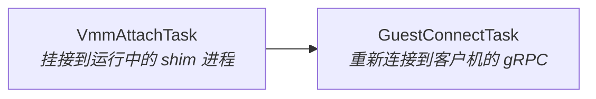

## B.6 状态机

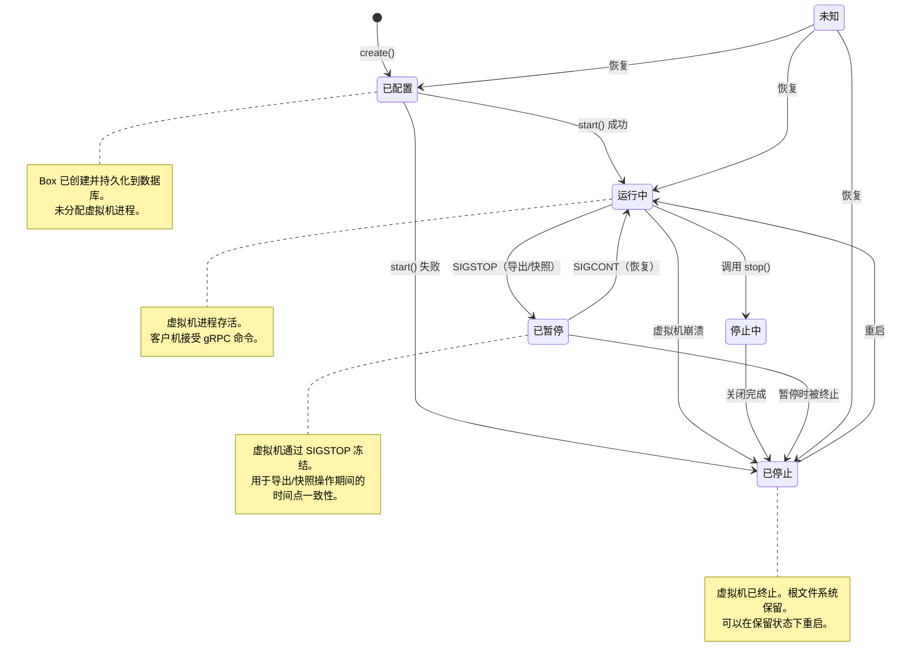

**状态转换规则（源自源代码）：**

| 源状态 | 有效目标状态 |
|---|---|
| `Unknown`（未知） | 任意状态（恢复路径） |
| `Configured`（已配置） | `Running`（运行中）、`Stopped`（已停止）、`Unknown`（未知） |
| `Running`（运行中） | `Stopping`（停止中）、`Stopped`（已停止）、`Paused`（已暂停）、`Unknown`（未知） |
| `Stopping`（停止中） | `Stopped`（已停止）、`Unknown`（未知） |
| `Stopped`（已停止） | `Running`（运行中）、`Unknown`（未知） |
| `Paused`（已暂停） | `Running`（运行中）、`Stopped`（已停止）、`Unknown`（未知） |

**隐式启动：** 对处于 `Configured`（已配置）或 `Stopped`（已停止）状态的 Box 调用 `exec()` 会在执行命令前触发隐式 `start()`。

## B.7 宿主-客户机通信

### B.7.1 传输层

宿主与客户机之间的通信使用 **vsock**（virtio 套接字），由 libkrun 桥接到 Unix 域套接字：

```
宿主进程                       libkrun 桥接                    客户机虚拟机
     │                               │                              │
     ├── Unix 套接字 ──────────→ vsock 桥接 ──────────→ vsock 监听器
     │   (box.sock)                   │                     (端口 2695)
     │                               │                              │
     └── Unix 套接字 ←────────── vsock 桥接 ←────────── vsock 连接
         (ready.sock)                 │                     (端口 2696)
```

**端口：**

| 端口 | 方向 | 用途 |
|---|---|---|
| 2695 (`GUEST_AGENT_PORT`) | 宿主 -> 客户机 | gRPC 服务（命令、文件、容器生命周期） |
| 2696 (`GUEST_READY_PORT`) | 客户机 -> 宿主 | 就绪通知（客户机启动完成后连接） |

### B.7.2 协议

协议使用 **gRPC**（tonic），protobuf 定义位于 `boxlite-shared` 中。暴露四个服务接口：

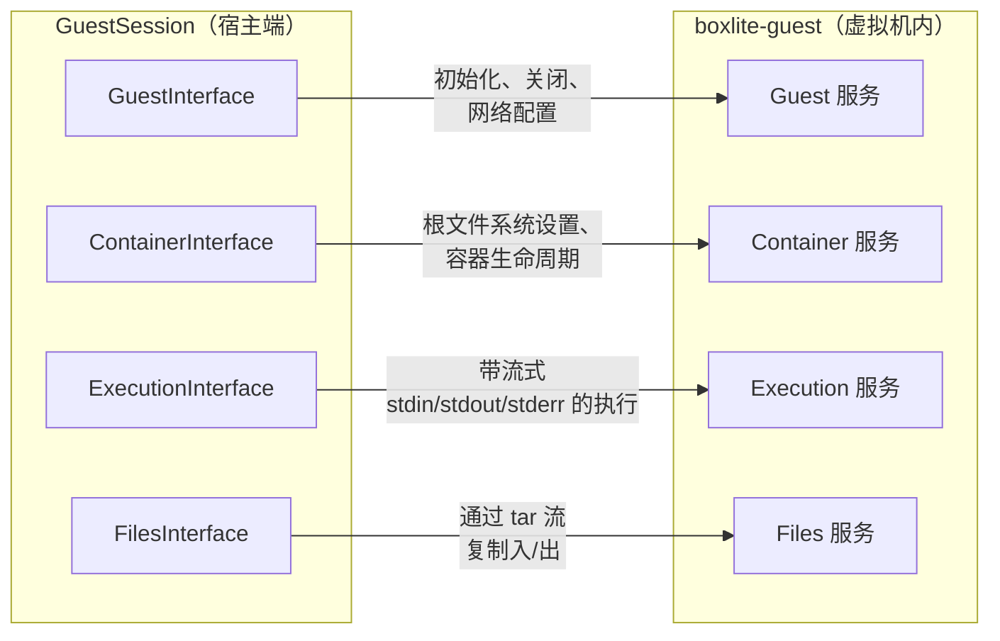

| 接口 | 关键 RPC |
|---|---|
| **GuestInterface** | `init()`（首次设置）、`shutdown()`、网络/卷配置 |
| **ContainerInterface** | `init_rootfs()`（挂载 OCI 层）、容器生命周期管理 |
| **ExecutionInterface** | `exec()`，支持双向流式传输（stdin、stdout、stderr） |
| **FilesInterface** | `copy_into()` / `copy_out()`，使用 tar 编码流 |

## B.8 安全架构

BoxLite 使用纵深防御策略：多个独立的安全层，每一层即使在其他层被突破的情况下仍然提供价值。

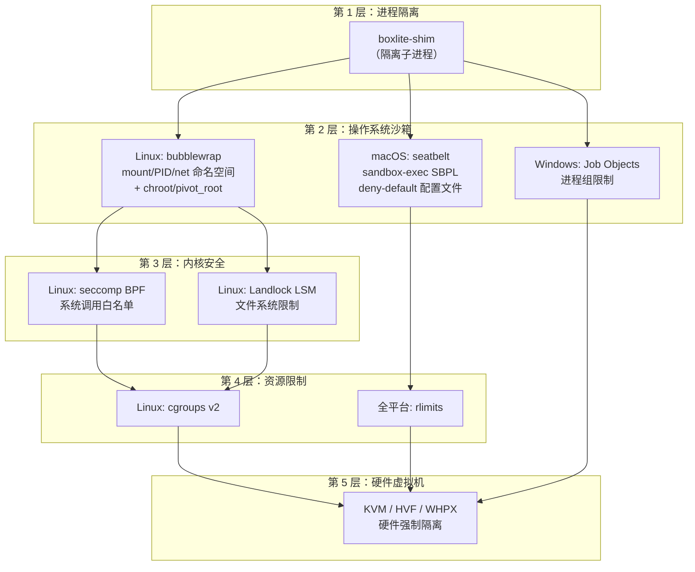

**文件系统访问模型（细粒度，而非全盘开放）：**

Jailer 为每个 Box 构建一个 `PathAccess` 列表，仅授予最小必要权限：

```
{box_dir}/
├── bin/                        [只读]  复制的 shim 二进制 + libkrunfw
├── shared/                     [读写]  客户机可见的 virtio-fs 共享根目录
├── sockets/                    [读写]  libkrun vsock/unix 套接字
├── tmp/                        [读写]  shim/libkrun 临时文件
├── logs/                       [读写]  shim 日志 + 虚拟机控制台输出
├── disks/                      [读写]  磁盘镜像（QCOW2）
├── exit                        [读写]  崩溃 ExitInfo JSON
├── mounts/                     [--]  排除（宿主写入，shim 通过 shared/ 读取）
└── shim.pid                    [--]  排除（在沙箱生效前由 pre_exec 写入）
```

## B.9 存储架构

### B.9.1 目录布局

```
~/.boxlite/                         # BOXLITE_HOME（可通过环境变量配置）
├── db/
│   └── boxlite.db                  # SQLite 数据库（WAL 模式）
├── images/
│   ├── layers/                     # OCI 镜像层（内容寻址）
│   ├── manifests/                  # OCI 镜像清单
│   └── disk-images/                # 从 OCI 层创建的 ext4 基础镜像
├── boxes/
│   └── {box_id}/                   # 每个 Box 的目录
│       ├── bin/                    # 复制的 shim 二进制 + libkrunfw
│       ├── disks/
│       │   ├── disk.qcow2          # 容器根文件系统（QCOW2 COW 覆盖层）
│       │   └── guest-rootfs.qcow2  # 客户机根文件系统（QCOW2 COW 覆盖层）
│       ├── sockets/
│       │   └── box.sock            # 用于 gRPC 的 Unix 域套接字
│       ├── shared/                 # Virtio-fs 共享根目录
│       ├── mounts/                 # 宿主端挂载准备
│       ├── logs/                   # Shim 日志 + 控制台输出
│       ├── tmp/                    # 临时文件
│       └── exit                    # 崩溃信息（ExitInfo JSON）
├── bases/                          # 共享后备文件（快照、克隆）
├── locks/                          # 每实体文件锁
├── logs/                           # 运行时级日志
└── tmp/                            # 运行时级临时文件
```

### B.9.2 磁盘镜像策略

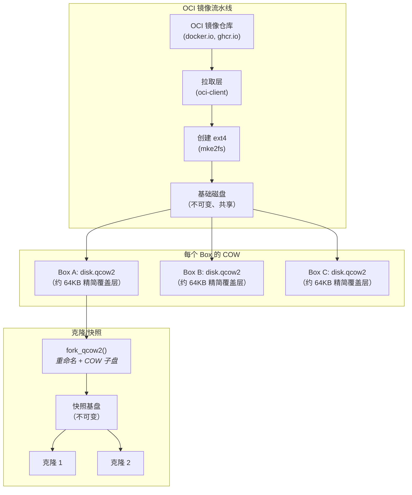

**关键特性：**

- **写时复制**：QCOW2 覆盖层起始大小约 64KB，仅在写入数据时增长。来自同一镜像的多个 Box 共享同一个基础磁盘。
- **状态保留**：COW 磁盘在虚拟机重启后持久化 -- 用户数据在 `stop()` + `start()` 循环中保留。
- **原子分叉**：`fork_qcow2()` 原子地执行重命名 + COW 子盘创建，实现零停机快照和克隆。
- **引用计数**：`BaseDiskManager` + `BaseDiskStore` 追踪共享基础磁盘，当最后一个引用被移除时自动清理。

### B.9.3 SQLite 模式

数据库使用**JSON blob 模式**（受 Podman 启发），配合可查询的索引列以提高性能：

| 表 | 用途 |
|---|---|
| `schema_version` | 模式版本控制，支持自动迁移 |
| `box_config` | 不可变的 Box 配置（创建时存储一次） |
| `box_state` | 可变的生命周期状态（在状态转换时更新） |
| `alive` | 存活状态追踪 |
| `image_index` | OCI 镜像缓存元数据 |
| `base_disk` | 共享基础磁盘注册表（路径、哈希、大小） |
| `base_disk_ref` | 基础磁盘的引用计数 |
| `snapshot` | 每个 Box 的快照元数据 |

配置：WAL 模式、FULL 同步、启用外键、100 秒忙等待超时。

## B.10 网络架构

BoxLite 使用可插拔的网络后端架构：

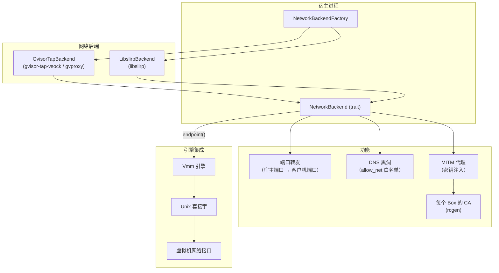

**后端选择**（优先级顺序，编译时特性开关）：

1. `gvproxy` 特性 -> `GvisorTapBackend`（gvisor-tap-vsock CGO 库）
2. `libslirp` 特性 -> `LibslirpBackend`（外部 libslirp-helper 二进制）
3. 无特性 -> 引擎默认网络（libkrun TSI 回退）

**连接类型：**

- `UnixStream` (SOCK_STREAM) -- 在 Linux 上使用
- `UnixDgram` (SOCK_DGRAM) -- 在 macOS 上使用

## B.11 跨平台抽象层

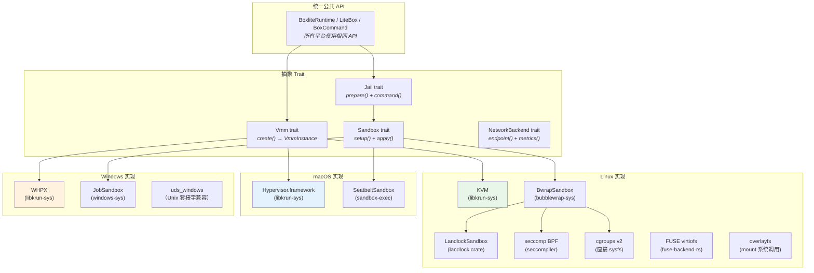

**平台特定依赖映射：**

| 依赖 | Linux | macOS | Windows | 用途 |
|---|---|---|---|---|
| `libkrun-sys` | KVM | HVF | WHPX | 虚拟化引擎抽象 |
| `bubblewrap-sys` | 是 | -- | -- | 命名空间 + chroot 沙箱 |
| `seccompiler` | 是 | -- | -- | 系统调用过滤 |
| `landlock` | 是 | -- | -- | LSM 文件系统限制 |
| `fuse-backend-rs` | 是 | -- | -- | 基于 FUSE 的 virtiofs |
| `nix` | 是 | 是 | -- | Unix 系统调用 |
| `xattr` | 是 | 是 | -- | 扩展属性 |
| `windows-sys` | -- | -- | 是 | Win32 API（Job Objects 等） |
| `uds_windows` | -- | -- | 是 | Unix 套接字模拟 |
| `caps` | 是 | -- | -- | Linux capabilities（能力） |
| `pathrs` | 是 | -- | -- | 安全路径解析（CVE 缓解） |

## B.12 特性开关

| 特性 | 默认值 | 描述 |
|---|---|---|
| `embedded-runtime` | 是 | 通过 `include_bytes!` 嵌入 shim/guest/kernel 二进制文件 |
| `krunfw` | 是 | 构建时下载 libkrunfw 固件 |
| `krun` | 否 | 构建并静态链接 libkrun.a（仅用于 boxlite-shim 二进制） |
| `e2fsprogs` | 是 | 内置 `mke2fs`，用于创建 ext4 磁盘 |
| `bubblewrap` | 是 | 内置 `bwrap`，用于 Linux 沙箱隔离 |
| `gvproxy` | 否 | gvisor-tap-vsock CGO 共享库，用于网络 |
| `libslirp` | 否 | 外部 libslirp-helper 二进制，用于网络 |
| `rest` | 否 | REST API 客户端后端（用于分布式模式） |

**最小构建**（仅 API，无本地依赖）：禁用所有默认特性。这用于文档生成（`docs.rs`）。

## B.13 SDK 架构

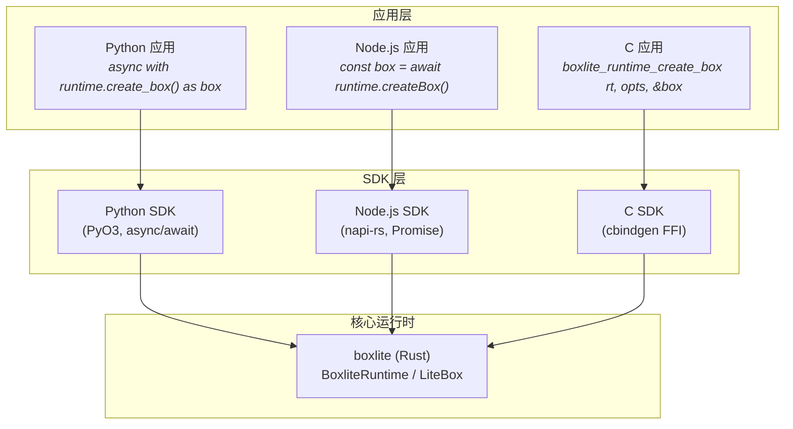

| SDK | 绑定方式 | 异步模型 | 关键特性 |
|---|---|---|---|
| **Python** | PyO3 | `async/await` (asyncio) | 上下文管理器（`async with`）、类型提示、Python 3.10+ |
| **Node.js** | napi-rs | Promises | Node.js 18+、原生插件 |
| **C** | cbindgen FFI | 回调 / 轮询 | 头文件生成、不透明指针 |

所有 SDK 包装同一个 Rust 核心，确保各语言之间的功能对等和行为一致。

---

*本文档基于 BoxLite v0.9.2 源代码生成。如需最新版本，请参阅仓库 `https://github.com/boxlite-ai/boxlite`。*
