# BoxLite 虚拟机生命周期：深度指南（中文版）

本文档提供了 BoxLite 虚拟机生命周期的完整参考——从创建、执行到关闭。涵盖初始化管线、状态机、命令执行、看门狗机制以及错误处理的详细内容。

本文档分为两个部分：

- **第 A 部分：精简版** —— 生命周期的简要总结，便于快速参考。
- **第 B 部分：详尽版** —— 具有代码级准确性的完整详细内容。

---

# 第 A 部分：精简版

## 1. 生命周期概述

一个 BoxLite box 按照明确定义的生命周期运行，由三层抽象管理：

| 层级 | 类型 | 职责 |
|------|------|------|
| `BoxliteRuntime` | 公共 API | 创建 box，管理全局状态 |
| `LiteBox` | 轻量门面 | 委托给 `BoxBackend` trait |
| `BoxImpl` | 实现层 | 持有配置（不可变）、状态（`RwLock`）和 `LiveState`（`OnceCell`，惰性初始化） |

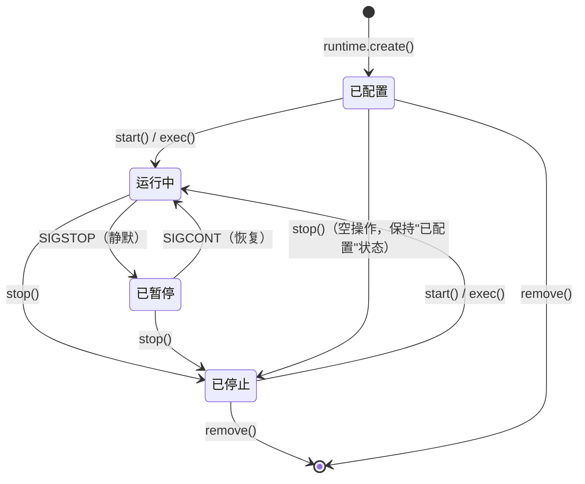

## 2. 创建流程

`runtime.create(BoxOptions, name)` 同步执行以下步骤：

1. 验证选项，生成 `BoxID`（nanoid），分配实体级锁
2. 创建 `BoxConfig`（不可变）和 `BoxState`（状态 = `Configured`）
3. 持久化到 SQLite 数据库
4. 封装在 `BoxImpl` 中并返回 `LiteBox` 句柄

此时不会启动虚拟机，不会分配磁盘。box 仅是一个轻量级记录。

## 3. 惰性 LiveState 初始化

在首次调用 `start()` 或 `exec()` 时，`BoxImpl` 通过 `OnceCell` 触发惰性初始化。初始化管线按阶段运行：

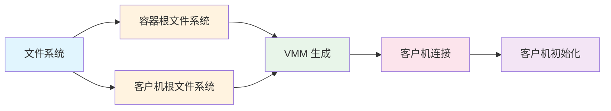

| 阶段 | 模式 | 功能说明 |
|------|------|----------|
| **FilesystemTask** | 顺序执行 | 创建 `~/.boxlite/boxes/{box_id}/` 目录结构 |
| **ContainerRootfs** | 并行执行 | 拉取 OCI 镜像，解压层，创建 ext4 基础盘 + QCOW2 COW（写时复制）覆盖层 |
| **GuestRootfs** | 并行执行 | 准备客户机根文件系统（Alpine + boxlite-guest 二进制文件），缓存在 `~/.boxlite/bases/` |
| **VmmSpawn** | 顺序执行 | 构建 `InstanceSpec`，通过 Jailer 生成 `boxlite-shim`，并配置看门狗管道/事件 |
| **GuestConnect** | 顺序执行 | 等待客户机就绪信号（端口 2696），建立 gRPC 通道（端口 2695） |
| **GuestInit** | 顺序执行 | 发送客户机初始化配置（卷、网络）和容器初始化配置（根文件系统、镜像配置） |

`CleanupGuard`（RAII）确保如果任何阶段失败，已分配的部分资源将被回滚。

## 4. 重启与重新挂接

- **重启**（已停止 -> 运行中）：相同的管线，但根文件系统任务会复用已有的 COW 磁盘（保留用户修改）。将创建新的虚拟机进程和客户机守护进程。
- **重新挂接**（运行中，来自不同的运行时实例）：仅运行 `VmmAttach`（通过 PID 挂接到已有的 shim 进程）+ `GuestConnect`（重新连接 gRPC）。

## 5. 命令执行

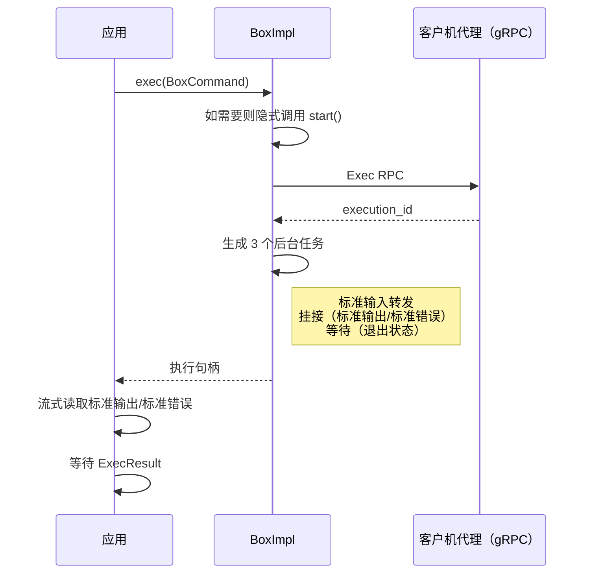

## 6. 关闭

`box.stop()` 执行：中止健康检查 -> Guest.Shutdown RPC -> ShimHandler.stop()（Unix 上发送 SIGTERM，等待 2 秒，然后 SIGKILL；Windows 上触发 Event 信号，WaitForSingleObject，TerminateProcess）-> 清理 PID 文件 -> 更新状态为已停止 -> 持久化到数据库 -> 使缓存失效 -> 触发事件监听器 -> 可选 `auto_remove`。

## 7. 看门狗机制

| 平台 | 机制 | 父进程死亡检测 |
|------|------|--------------|
| Unix | 管道对（`pipe2` 配合 `O_CLOEXEC`） | 父进程持有写入端；shim 轮询读取端的 `POLLHUP` |
| Windows | 事件句柄（`CreateEventW`）+ 父进程句柄 | shim 通过 `WaitForMultipleObjects` 同时等待两者 |

如果父进程崩溃，看门狗将触发并使 shim 优雅退出。

## 8. 资源默认值

| 资源 | 默认值 | 备注 |
|------|--------|------|
| vCPU | 1 | Windows 上限制为 4 个（WHPX 限制） |
| 内存 | 512 MiB | 传递给 libkrun |
| 磁盘 | 虚拟 10 GB，实际约 200 KB 稀疏分配 | QCOW2 COW 覆盖层，可通过 `disk_size_gb` 配置 |

---

# 第 B 部分：详尽版

## 1. 架构：三层 Box 模型

BoxLite 使用三层架构将公共 API 接口与内部实现分离：

```
BoxliteRuntime           LiteBox               BoxImpl
+-----------------+     +----------------+     +-------------------+
| 公共 API        |---->| 轻量门面       |---->| Config（不可变）   |
| create/get/list |     | BoxBackend     |     | State（RwLock）    |
| shutdown        |     | trait 分发     |     | LiveState（Once）  |
+-----------------+     +----------------+     +-------------------+
```

### BoxliteRuntime

入口点。将所有操作委托给 `RuntimeBackend` trait 实现。存在两个后端：

- `LocalRuntime`：通过 libkrun 管理本地虚拟机。
- `RestRuntime`：通过 HTTP 代理到远程 BoxLite API 服务器。

运行时持有：一个 `BoxManager`（集成持久化）、一个 `ImageManager`、文件系统布局、客户机根文件系统缓存、运行时指标（原子计数器）、实体级锁管理器，以及一个用于协调关闭的 `CancellationToken`。

### LiteBox

一个轻量级、可廉价克隆的句柄。它存储 `BoxID`、可选名称，以及两个 trait 对象引用：

- `BoxBackend`：生命周期、执行、文件复制、克隆、导出操作。
- `SnapshotBackend`：快照生命周期操作。

`LiteBox` 除了委托指针外不持有任何内部状态。它是 `Send + Sync` 的。

### BoxImpl

真正的实现层。由 `runtime.create()` 立即创建，但昂贵的资源被延迟分配：

```rust
pub(crate) struct BoxImpl {
    // 始终可用（轻量级）
    pub(crate) config: BoxConfig,           // 创建后不可变
    pub(crate) state: Arc<RwLock<BoxState>>,// 可变：状态、PID、健康度
    pub(crate) shutdown_token: CancellationToken,

    // 在首次调用 start()/exec() 时惰性初始化
    live: OnceCell<LiveState>,
}
```

`LiveState` 包含运行中虚拟机的资源：

```rust
pub(crate) struct LiveState {
    handler: Mutex<Box<dyn VmmHandler>>,    // 虚拟机进程控制
    guest_session: GuestSession,            // 到客户机的 gRPC 通道
    metrics: BoxMetricsStorage,             // 每个 box 的计时与计数器
    _container_rootfs_disk: Disk,           // QCOW2 COW 磁盘（保持存活）
    guest_rootfs_disk: Option<Disk>,        // 客户机根文件系统磁盘
}
```

## 2. 虚拟机创建流程

当你调用 `runtime.create(BoxOptions, name)` 时，会发生以下过程：

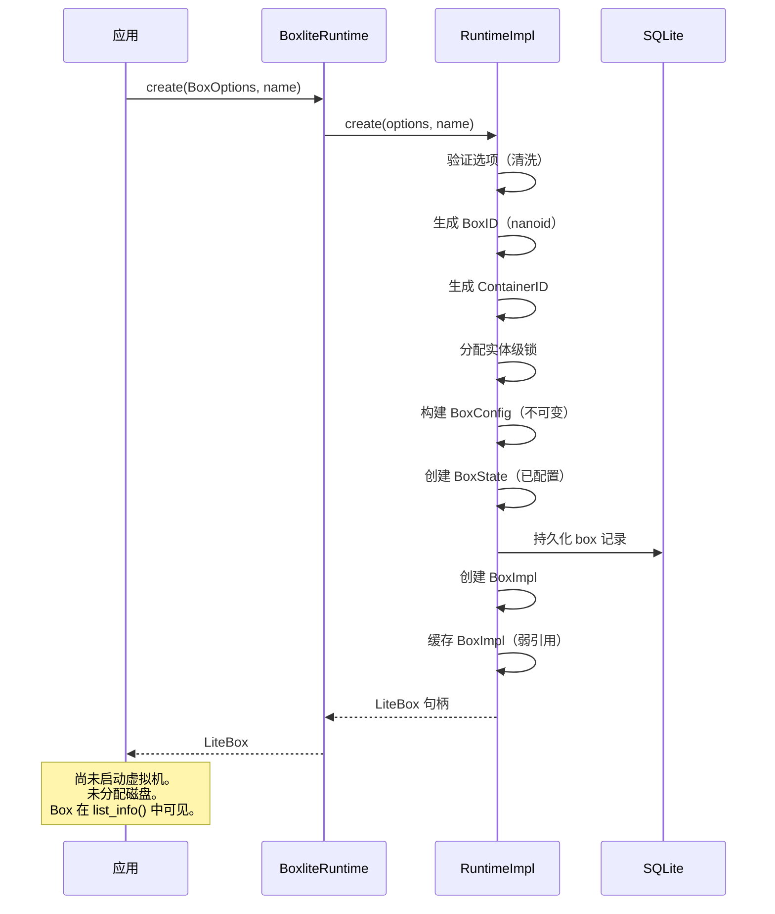

关键细节：

1. **BoxID 生成**：使用 nanoid 生成紧凑、抗碰撞的标识符。
2. **锁分配**：从 `LockManager` 分配一个实体级锁，用于多进程安全操作。锁 ID 存储在 `BoxState.lock_id` 中。
3. **BoxConfig**：创建后不可变。包含 box ID、容器 ID、选项、传输路径和计算得出的 `box_home` 路径（`~/.boxlite/boxes/{box_id}/`）。
4. **BoxState**：持久化到数据库的可变状态。初始状态为 `Configured`，pid 为 `None`，lock_id 已设置。
5. **缓存**：运行时维护一个 `HashMap<BoxID, Weak<BoxImpl>>` 缓存。`get()` 先检查缓存，如未命中则从数据库查找并重建。

## 3. 惰性 LiveState 初始化管线

### 3.1 触发条件

首次调用 `start()` 或 `exec()` 会调用 `BoxImpl::live_state()`，该方法委托给 `OnceCell::get_or_try_init()`。这保证了初始化管线只执行一次，即使在并发调用的情况下也是如此。

```rust
async fn live_state(&self) -> BoxliteResult<&LiveState> {
    self.live.get_or_try_init(|| self.init_live_state()).await
}
```

### 3.2 执行计划

管线是表驱动的。不同的 `BoxStatus` 值产生不同的执行计划：

| 状态 | 计划 | 描述 |
|------|------|------|
| `Configured` | 完整管线（5 个阶段） | 首次启动：从头创建所有资源 |
| `Stopped` | 重启管线（5 个阶段） | 复用已有的 COW 磁盘，创建新的虚拟机进程 |
| `Running` | 重新挂接管线（2 个阶段） | 挂接到已有的 shim，重新连接 gRPC |

### 3.3 完整初始化管线（已配置状态）

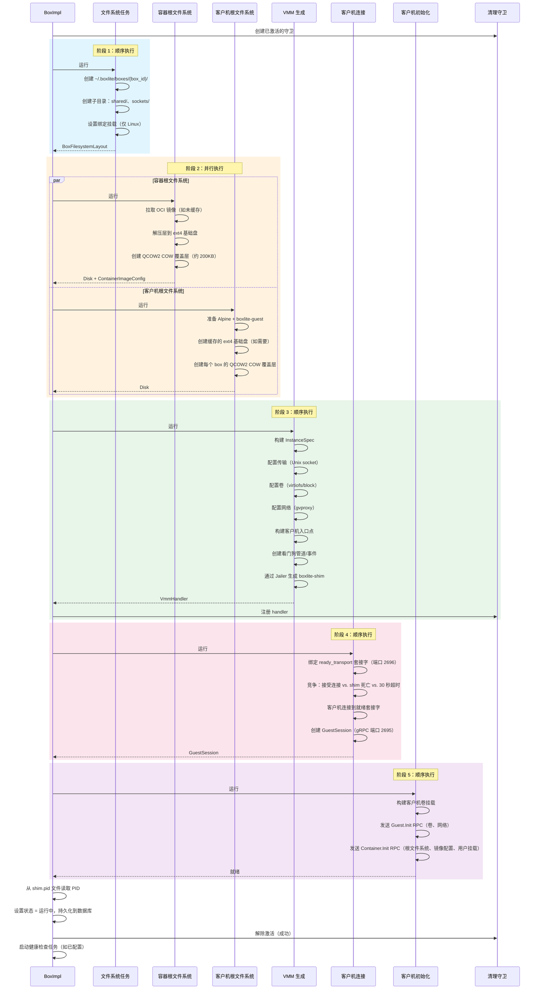

### 3.4 阶段详情

#### FilesystemTask

在 `~/.boxlite/boxes/{box_id}/` 下创建 box 目录结构：

```
{box_id}/
  shared/              # 主机-客户机共享文件系统（virtiofs/9p）
    containers/{id}/   # 容器根文件系统工作区
      image/           # 已解压的镜像层
      rw/              # 读写覆盖层
      rootfs/          # 合并后的根文件系统挂载点
  sockets/             # Unix 域套接字
  shim.pid             # PID 文件（由 pre_exec 钩子写入）
  shim.stderr          # shim 标准错误输出捕获
  console.log          # 虚拟机控制台输出
  container.qcow2      # 容器根文件系统 QCOW2 COW 磁盘
  guest.qcow2          # 客户机根文件系统 QCOW2 COW 磁盘
```

在 Linux 上，可选择为 `shared/` 目录配置绑定挂载。

#### ContainerRootfsTask

与 `GuestRootfsTask` 并行运行。

1. **拉取 OCI 镜像**：解析镜像引用（例如 `alpine:latest`），如未缓存则从注册表拉取，并将层存储在 `~/.boxlite/images/` 中。
2. **解压层**：解包每个层的 tarball，处理白名单删除文件（whiteout files）。
3. **创建 ext4 基础盘**：将所有层合并到一个 ext4 磁盘镜像中。此基础盘按镜像摘要缓存，跨 box 共享。
4. **创建 QCOW2 COW 覆盖层**：创建一个引用共享基础盘的薄写时复制磁盘。初始大小约 200 KB（稀疏分配）。虚拟大小默认为 10 GB，可通过 `disk_size_gb` 配置。

在重启时（`reuse_rootfs = true`），步骤 1-3 被跳过。复用已有的 QCOW2 COW 磁盘，保留上一次运行中的所有用户修改。

#### GuestRootfsTask

准备客户机操作环境（Alpine Linux + `boxlite-guest` 二进制文件）：

1. 检查 `~/.boxlite/bases/` 中是否有与当前版本匹配的缓存客户机根文件系统。
2. 如果没有缓存，构建一个包含 Alpine 基础系统 + `boxlite-guest` 二进制文件的新 ext4 磁盘。
3. 为客户机根文件系统创建每个 box 的 QCOW2 COW 覆盖层。

#### VmmSpawnTask

最复杂的阶段。组装一个 `InstanceSpec` 并生成虚拟机子进程：

1. **传输设置**：创建两个 Unix 套接字路径——一个用于 gRPC 通信（端口 2695），一个用于就绪信号（端口 2696）。Unix 套接字在所有平台上都有效，包括 Windows（通过 `uds_windows`）。
2. **卷配置**：使用 `GuestVolumeManager` 收集文件系统共享（virtiofs/9p）和块设备（QCOW2 磁盘）。配置用户卷，解析路径并设置所有者 UID/GID 以进行 idmap 映射。
3. **网络配置**：根据容器镜像的 `EXPOSE` 指令和用户提供的端口规范构建 `NetworkBackendConfig`，包含端口映射。配置 gvproxy 作为网络后端。可选生成 MITM CA 以进行密钥注入。
4. **客户机入口点**：构建在虚拟机内部启动的命令：`boxlite-guest --listen {transport_uri} --notify {ready_uri}`，附带环境变量。
5. **看门狗创建**：创建管道（Unix）或 Event 句柄（Windows），用于父进程死亡检测。
6. **shim 生成**：`ShimController` 将 `InstanceSpec` 序列化为 JSON，创建一个 `ShimSpawner`，通过 Jailer 隔离（Linux 上使用 seccomp，macOS 上使用 sandbox-exec）启动 `boxlite-shim` 二进制文件。shim 的 `pre_exec` 钩子写入 PID 文件并设置文件描述符继承。

#### GuestConnectTask

使用 `tokio::select!` 竞争三个条件：

1. **客户机就绪信号**：客户机代理在启动后连接到就绪套接字（端口 2696）。这是成功路径。
2. **shim 进程死亡**：`ProcessMonitor` 轮询 shim PID。如果进程在启动期间退出，将从退出文件、控制台日志和标准错误捕获中生成 `CrashReport`。
3. **30 秒超时**：如果上述两个条件都未触发的备用机制。

在客户机发出就绪信号后，从主 gRPC 传输（端口 2695）创建 `GuestSession`。

#### GuestInitTask

向客户机代理发送两个 gRPC RPC：

1. **Guest.Init**：配置客户机级别的卷（文件系统共享和块设备）和网络（通过 rtnetlink 在 eth0 上设置静态 IP）。
2. **Container.Init**：设置容器根文件系统（挂载 ext4 磁盘，如需要则创建覆盖层），应用镜像配置（环境变量、工作目录、用户），并在容器命名空间内挂载用户卷。

### 3.5 CleanupGuard（RAII 回滚）

`CleanupGuard` 在管线开始时激活。如果任何阶段失败且守卫在激活状态下被丢弃：

1. 停止虚拟机 handler（如果已生成）
2. 保留诊断文件（box 目录**不会**被删除——保留以便调试）
3. 从 `BoxManager` 和数据库中移除 box
4. 递增 `boxes_failed` 运行时指标

成功时，调用方调用 `cleanup_guard.disarm()` 以阻止清理操作。

## 4. 状态机

### 4.1 状态定义

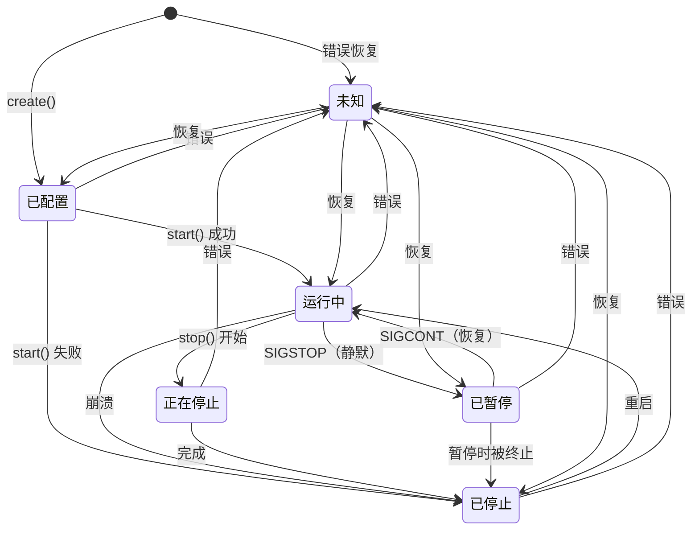

| 状态 | 描述 | PID | 虚拟机进程 |
|------|------|-----|-----------|
| `Unknown` | 无法确定状态（错误恢复） | 无 | 未知 |
| `Configured` | box 已创建，已持久化到数据库，虚拟机未启动 | 无 | 未分配 |
| `Running` | 虚拟机运行中，客户机代理接受命令 | 已设置 | 存活 |
| `Stopping` | 优雅关闭进行中（临时状态） | 已设置 | 正在终止 |
| `Stopped` | 虚拟机已终止，根文件系统已保留，可重启 | 无 | 已死亡 |
| `Paused` | 虚拟机通过 SIGSTOP 冻结（为快照/导出静默） | 已设置 | 已挂起 |

### 4.2 转换守卫

每个状态转换在 API 层级进行验证：

| 操作 | 允许的源状态 | 行为 |
|------|-------------|------|
| `can_start()` | `Configured`、`Stopped` | 首次启动或重启 |
| `can_stop()` | `Running`、`Paused` | 优雅关闭 |
| `can_exec()` | `Configured`、`Running`、`Stopped` | 如果不是 `Running` 则隐式调用 `start()` |
| `can_remove()` | `Configured`、`Stopped`、`Unknown` | 删除 box 及所有资源 |

### 4.3 幂等性

- 对 `Running` 状态的 box 调用 `start()` 是空操作（返回 `Ok(())`）。
- 对 `Stopped` 状态的 box 调用 `stop()` 是空操作（返回 `Ok(())`）。
- 对非运行状态的 box 调用 `exec()` 会触发隐式 `start()`。

## 5. 重启流程（已停止 -> 运行中）

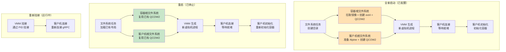

全新启动与重启之间的关键差异：

| 方面 | 全新启动 | 重启 |
|------|---------|------|
| 容器根文件系统 | 拉取镜像，解压层，创建 ext4 基础盘 + QCOW2 | 复用已有 QCOW2（保留用户数据） |
| 客户机根文件系统 | 从缓存的基础盘创建 QCOW2 覆盖层 | 复用已有 QCOW2 |
| 虚拟机进程 | 新建 | 新建 |
| 客户机守护进程 | 新建 | 新建（必须重新初始化：卷、网络、容器） |
| 用户修改 | 无 | 保留在 COW 层中 |

## 6. 重新挂接流程（运行中，不同的运行时实例）

当一个新的 `BoxliteRuntime` 实例发现一个处于 `Running` 状态（且有有效 PID 文件）的 box 时，它执行轻量级重新挂接：

1. **VmmAttachTask**：创建 `ShimHandler::from_pid(pid, box_id)` —— 没有 `Child` 句柄，没有看门狗保活。handler 仅通过 PID 管理进程。
2. **GuestConnectTask**：跳过就绪等待（`skip_guest_wait = true`）。直接从存储的传输信息创建 `GuestSession`。

重新挂接用于：
- CLI 命令查询由不同进程启动的运行中 box。
- 运行时在进程重启后的恢复，此时 box 仍在运行（分离模式）。

限制：重新挂接的 box 没有 `Keepalive` 句柄，因此如果新的运行时崩溃，看门狗不会触发。如果管道/事件仍然有效，原始父进程的死亡仍会触发看门狗。

## 7. 命令执行流程

### 7.1 主机侧流程

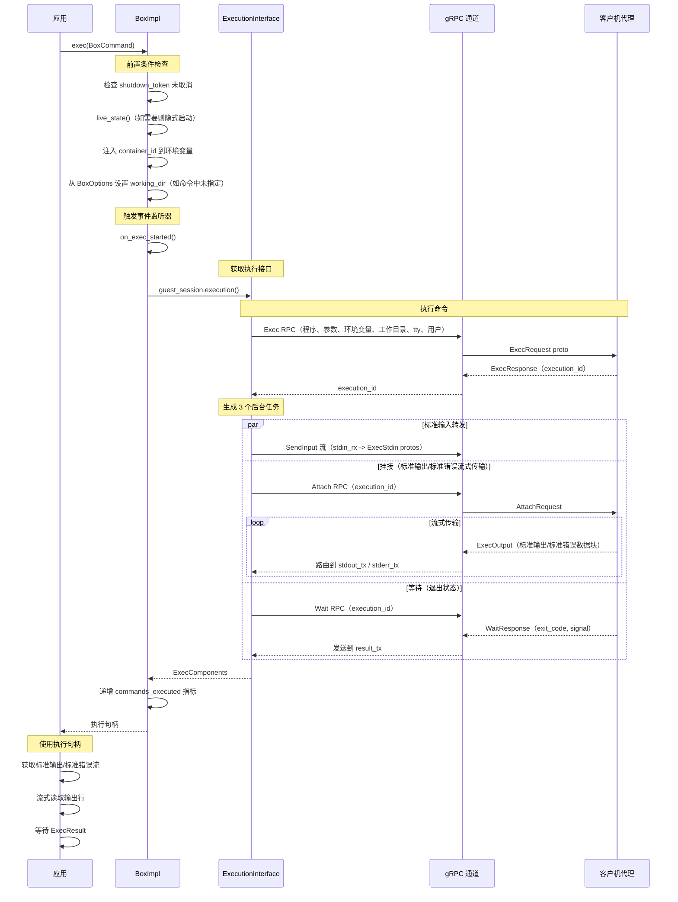

### 7.2 后台任务与取消

所有三个后台任务（标准输入、挂接、等待）都作为 Tokio 任务生成，可通过 box 的 `shutdown_token` 取消：

- 每个任务使用带 `biased` 排序的 `tokio::select!`，优先检查 `shutdown_token.cancelled()`。
- 取消时，等待任务向结果通道发送 `ExecResult { exit_code: -1 }`。
- 挂接任务从其流式循环中干净地退出。
- 标准输入任务停止转发。

### 7.3 客户机侧流程

在虚拟机内部，客户机代理：

1. 通过 gRPC 接收 `ExecRequest`。
2. 通过 ID 解析容器。
3. 在容器的命名空间（PID、mount、UTS、IPC、network）内 fork 一个新进程。
4. 使用指定的环境变量 `execve` 请求的程序。
5. 在容器进程和 gRPC 流之间桥接标准输入输出。
6. 通过 `waitpid` 监控进程。
7. 当进程退出时，发送带有退出码和信号信息的 `WaitResponse`。

### 7.4 执行句柄 API

返回的 `Execution` 句柄提供：

| 方法 | 描述 |
|------|------|
| `id()` | 唯一执行标识符 |
| `stdin()` | 获取标准输入写入流（仅一次） |
| `stdout()` | 获取标准输出读取流（仅一次） |
| `stderr()` | 获取标准错误读取流（仅一次） |
| `wait()` | 等待 `ExecResult`（退出码 + 可选错误消息） |
| `kill()` | 向进程发送 SIGKILL |
| `signal(sig)` | 发送任意信号 |
| `resize_tty(rows, cols)` | 调整 PTY（伪终端）窗口大小（仅 TTY 模式） |

## 8. 虚拟机关闭流程

### 8.1 关闭序列

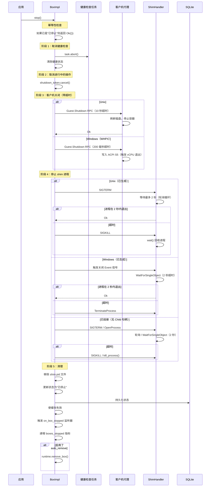

### 8.2 优雅关闭时间线

```
t=0       调用 stop()
t=0       中止健康检查，取消 shutdown_token
t=0       发送 Guest.Shutdown RPC
t=0..10s  等待客户机刷新磁盘并停止容器
t=10s     客户机关闭超时（如无响应）
t=10s     向 shim 进程发送 SIGTERM
t=10..12s 等待 shim 退出
t=12s     如果 shim 仍存活则发送 SIGKILL
t=12s     清理 PID 文件，更新数据库，使缓存失效
```

### 8.3 停止期间的状态转换

`stop()` 方法处理多种初始状态：

- `Running` -> `Stopped`：正常关闭路径。
- `Paused` -> `Stopped`：shim 在 SIGSTOP 状态下接收 SIGTERM；内核在 SIGCONT 后传递 SIGTERM。
- `Configured` -> 保持 `Configured`：如果在任何启动之前调用 `stop()`，状态保持为 `Configured`，以便下次 `start()` 触发完整初始化。
- `Stopped` -> `Stopped`：幂等操作，立即返回。

## 9. 看门狗机制

### 9.1 目的

看门狗确保当父进程（嵌入 BoxLite 的应用程序）崩溃或被终止时，shim 子进程优雅退出而不是成为孤儿进程。

### 9.2 Unix 实现（管道技巧）

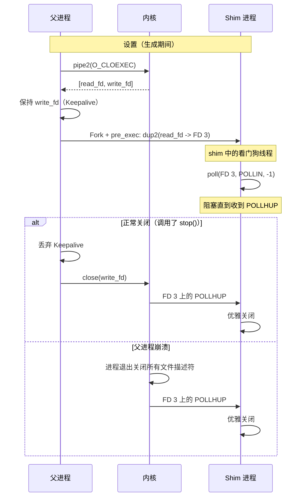

关键特性：
- **零延迟**：`POLLHUP` 由内核立即传递。
- **防篡改**：基于内核文件描述符生命周期，而非定时器或心跳。
- **命名空间安全**：跨 PID/mount 命名空间工作。
- **CLOEXEC**：两端都使用 `FD_CLOEXEC` 创建，防止泄漏到不相关的子进程（避免孤儿 shim 缺陷）。

### 9.3 Windows 实现（Event + 进程句柄）

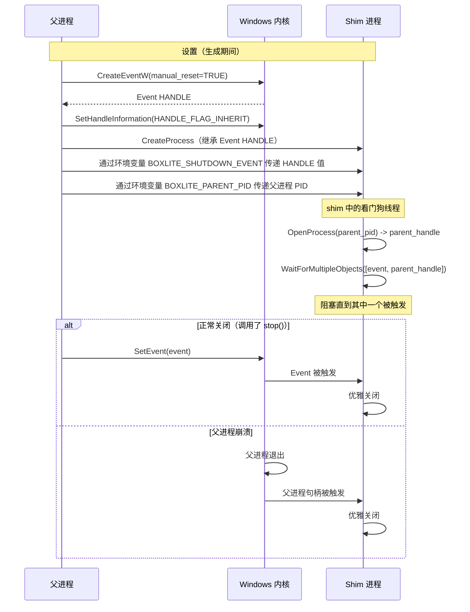

关键特性：
- **双重检测**：同时监控显式信号（SetEvent）和父进程死亡（进程句柄）。
- **手动重置事件**：一旦被触发，保持触发状态——所有等待者都会被唤醒。
- **可继承句柄**：事件句柄是可继承的，因此子进程直接接收它。

### 9.4 纵深防御

即使从未调用 `stop()`，`ShimHandler` 的 `Drop` 实现也会关闭 Keepalive：

- **Unix**：丢弃 `Keepalive` 通过 `OwnedFd::drop()` 关闭管道写入端，传递 `POLLHUP`。
- **Windows**：丢弃 `Keepalive` 调用 `SetEvent` 然后 `CloseHandle`。

## 10. 静默/暂停协议

对于时间点一致性操作（快照、导出、克隆），BoxLite 实现了类似 QEMU+libvirt 的静默括号机制：

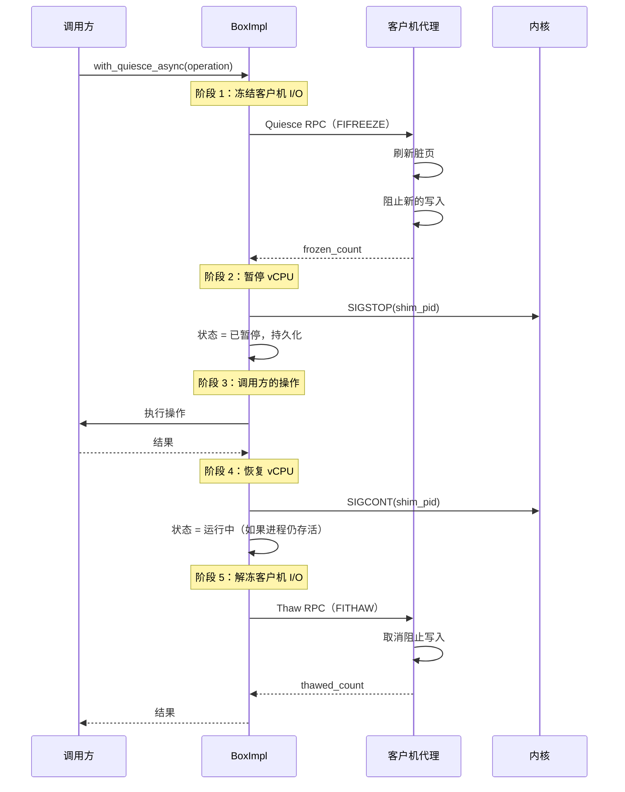

客户机 RPC 是尽力而为的，带有 5 秒超时。如果静默失败，操作将降级为崩溃一致性（仅 SIGSTOP），而不是操作失败。

## 11. 资源管理

### 11.1 CPU

- 默认值：1 个 vCPU
- 通过 `BoxOptions.cpus` 配置
- 传递给 libkrun 的 `krun_set_vm_config`
- Windows（WHPX）：由于 WHPX API 限制，上限为 4 个 vCPU

### 11.2 内存

- 默认值：512 MiB
- 通过 `BoxOptions.memory_mib` 配置
- 传递给 libkrun

### 11.3 磁盘

- **容器根文件系统**：基于共享 ext4 基础盘的 QCOW2 COW 覆盖层
  - 虚拟大小：10 GB（默认），可通过 `disk_size_gb` 配置
  - 实际大小：约 200 KB（稀疏分配，随数据写入而增长）
  - 基础盘：按镜像摘要缓存，跨所有使用相同镜像的 box 共享
- **客户机根文件系统**：基于版本化 Alpine 基础盘的 QCOW2 COW 覆盖层
  - 基础盘缓存在 `~/.boxlite/bases/`
- **调整大小**：仅在使用自定义 `disk_size_gb` 的全新启动时执行，重启时不执行

### 11.4 网络

- 后端：gvproxy（用户空间网络）
- 客户机接口：virtio-net 设备（eth0）
- 客户机 IP：静态，通过 rtnetlink 配置
- 端口映射：合并自镜像 `EXPOSE` 指令和用户提供的端口规范
- 可通过 `NetworkSpec::Disabled` 禁用网络

## 12. 指标

### 12.1 Box 指标（`BoxMetrics`）

通过 `litebox.metrics()` 查询。包括：

**运行时计数器**（单调递增）：
- `commands_executed_total`：`exec()` 调用总数
- `exec_errors_total`：失败的 `exec()` 调用总数
- `bytes_sent_total`：通过标准输入发送的字节数
- `bytes_received_total`：通过标准输出/标准错误接收的字节数

**系统指标**（时间点快照）：
- `cpu_percent`：CPU 使用率（0.0-100.0），来自 `sysinfo` crate
- `memory_bytes`：内存使用量，来自 `sysinfo` crate
- `network_bytes_sent/received`：网络 I/O（可用时）
- `network_tcp_connections/errors`：TCP 统计信息（可用时）

**初始化阶段计时**（设置一次）：
- `total_create_duration_ms`：端到端初始化时间
- `stage_filesystem_setup_ms`：目录创建
- `stage_image_prepare_ms`：OCI 镜像拉取 + 层解压
- `stage_guest_rootfs_ms`：客户机根文件系统准备
- `stage_box_spawn_ms`：shim 子进程生成
- `stage_container_init_ms`：客户机侧容器设置

### 12.2 运行时指标（`RuntimeMetrics`）

通过 `runtime.metrics()` 查询。所有计数器都是原子的且无锁：

- `boxes_created_total`：`create()` 调用总数
- `boxes_failed_total`：失败的初始化总数（CleanupGuard 触发）
- `boxes_stopped_total`：成功的 `stop()` 调用总数
- `num_running_boxes()`：计算为 `created - stopped - failed`
- `total_commands_executed`：所有 box 的 `exec()` 聚合计数
- `total_exec_errors`：所有 box 的 `exec()` 错误聚合计数

## 13. 错误处理

### 13.1 初始化失败：CleanupGuard RAII 回滚

当任何管线阶段失败时：

1. `CleanupGuard` 在丢弃时触发（armed = true）。
2. 如果已注册 `VmmHandler`，则调用 `handler.stop()` 终止 shim。
3. box 目录被**保留**以便调试（与 Docker 删除所有内容不同）。
4. 通过 `BoxManager` 从数据库中移除 box 记录。
5. `boxes_failed` 指标递增。

错误消息包含诊断文件的路径：

```
Box crashed. Diagnostic files preserved at:
  ~/.boxlite/boxes/abc123/

To clean up: rm -rf ~/.boxlite/boxes/abc123/
```

### 13.2 崩溃恢复

在运行时启动时，`BoxManager` 扫描数据库中的过期条目：

1. 具有 `Running` 或 `Paused` 状态的 box 会检查其 PID。
2. 如果 PID 不再存活，则通过 `reset_for_reboot()` 将 box 标记为 `Stopped`。
3. PID 字段被清除，因为重启后所有进程都已不存在。

### 13.3 客户机连接失败检测

`GuestConnectTask` 将就绪信号与 shim 进程死亡进行竞争：

- 如果 shim 进程在启动期间退出，会立即生成 `CrashReport`（亚秒级检测），而不是等待 30 秒超时。
- 崩溃报告包含：退出码、控制台日志摘录和标准错误捕获。

### 13.4 分离模式 Box

使用 `detach: true` 创建的 box：

- 没有看门狗 —— shim 在父进程退出后继续存活。
- 调用方负责最终的清理。
- 可以从不同的运行时实例重新挂接。

### 13.5 句柄失效

在调用 `stop()` 后，`shutdown_token` 被取消。对同一 `BoxImpl` 的任何后续操作（通过过期的 `LiteBox` 句柄）返回：

```
BoxliteError::Stopped("Handle invalidated after stop(). Use runtime.get() to get a new handle.")
```

运行时缓存被使失效，以便 `runtime.get()` 构建一个带有新 `OnceCell` 的全新 `BoxImpl`。

## 14. 健康检查系统

当配置了 `BoxOptions.advanced.health_check` 时，box 初始化后会运行一个后台健康检查任务：

1. **启动周期**：在 `start_period` 期间，跳过健康检查（为启动缓慢的应用程序提供宽限期）。
2. **定期 ping**：启动周期结束后，任务按配置的 `interval` 发送 `Guest.Ping` RPC。
3. **状态转换**：`None` -> `Starting` -> `Healthy`（首次成功时）-> `Unhealthy`（连续 `retries` 次失败后）。
4. **恢复**：失败后的一次成功检查将失败计数器重置为 0。
5. **shim 死亡检测**：如果 shim 进程死亡，健康检查立即将 box 标记为 `Stopped` + `Unhealthy` 并停止。
6. **取消**：任务在 `stop()` 或运行时关闭时被取消。

状态变更会持久化到数据库，并可通过 `box.info().health_status` 访问。
