# 深入解析：Hypervisor 与引擎集成

> BoxLite 如何将安全的 Rust 抽象桥接到原始的 hypervisor FFI（外部函数接口），管理进程接管，
> 以及在 Linux、macOS 和 Windows 上配置 virtio 设备。

---

## 第 A 部分：简明版

### 引擎抽象概览

BoxLite 将引擎特定的 hypervisor 逻辑隔离在一个双 trait 抽象之后。`Vmm`
trait 创建一个已配置的 VM 实例；`VmmInstanceImpl` trait 运行它。

```
Vmm::create(InstanceSpec) --> VmmInstance --> VmmInstance::enter()
                                                |
                                          进程接管
                                         (成功时永不返回)
```

引擎在编译时使用 `inventory` crate 注册自身。没有全局注册表，没有单例 ——
链接器收集所有 `inventory::submit!` 条目，运行时遍历它们以找到请求的引擎。

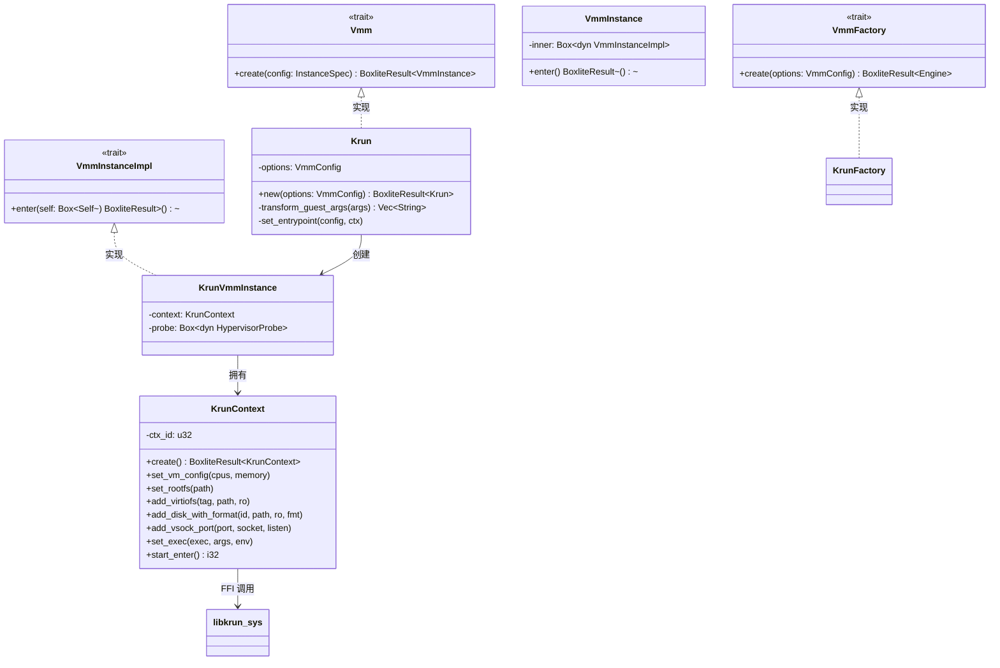

### libkrun FFI 层

`libkrun-sys` 从 libkrun 共享库暴露了 30 多个 C 函数。`KrunContext`
结构体提供了一个相对安全的 Rust 封装，它：

- 拥有一个 `ctx_id`（通过 drop 时调用 `krun_free_ctx` 释放）
- 将 Rust 字符串转换为 `CString` 用于所有路径/字符串参数
- 将所有错误码路由到 `check_status()`，对 `-22`（EINVAL）有特殊诊断

### 进程接管与 Shim 架构

`krun_start_enter()` 会劫持调用进程 —— 成功时它永不返回。
BoxLite 通过生成一个 `boxlite-shim` 子进程来吸收接管：

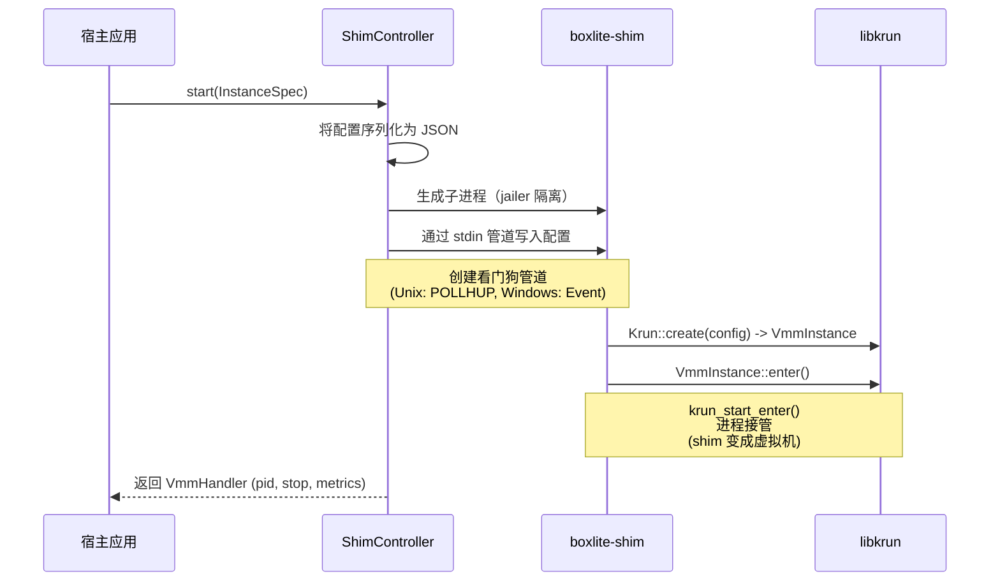

### 传输层转换

宿主通过 Unix 套接字（或 Windows 上的 TCP）通信，但客户机看到的是 vsock（虚拟套接字）。
Krun 引擎在 VM 创建时转换入口点参数：

| 宿主参数 | 客户机看到的 |
|---|---|
| `--listen unix:///path/grpc.sock` | `--listen vsock://2695` |
| `--notify unix:///path/ready.sock` | `--notify vsock://2696` |
| `--listen tcp://127.0.0.1:12345` | `--listen vsock://2695` |

`krun_add_vsock_port2` FFI 调用将每个宿主套接字桥接到客户机 vsock 端口。

### Virtio 设备拓扑

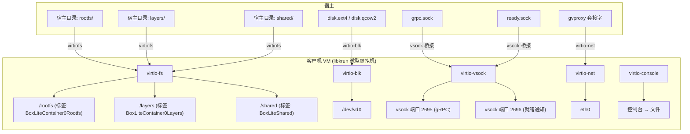

### 跨平台总结

| 方面 | Linux (KVM) | macOS (HVF) | Windows (WHPX) |
|---|---|---|---|
| Hypervisor | KVM 内核模块 | Hypervisor.framework | Hyper-V 平台 |
| 内核固件 | 嵌入在 libkrunfw (.so) 中 | 嵌入在 libkrunfw（编译生成）中 | 外部 vmlinuz 文件 |
| 网络后端 | gvproxy (UnixStream) | gvproxy (UnixDgram + VFKIT) | gvproxy (TCP) |
| vCPU 限制 | 无限制 | 无限制 | 4 个 vCPU |
| Overlayfs 根文件系统 | 是 (CAP_SYS_ADMIN) | 否（回退到解压方式） | 否（回退到解压方式） |
| 看门狗机制 | 管道 POLLHUP | 管道 POLLHUP | Event + 父进程句柄 |

---

## 第 B 部分：详细版

### 1. 引擎抽象层

BoxLite 定义了一个可插拔的引擎抽象，使得不同的 hypervisor 后端可以在编译时替换。
目前，libkrun 是唯一的生产环境实现，但该架构允许添加 Firecracker 或其他 VMM（虚拟机监视器）
而无需修改核心运行时代码。

#### 1.1 核心 Trait

三个 trait 定义了契约：

**`Vmm` —— 引擎级别的 VM 创建** (`vmm/engine.rs`)

```rust
pub trait Vmm {
    fn create(&mut self, config: InstanceSpec) -> BoxliteResult<VmmInstance>;
}
```

接受一个完整的 `InstanceSpec`（CPU 数量、内存、文件系统共享、块设备、
入口点、网络配置、根文件系统策略）并返回一个已完全配置但尚未启动的 `VmmInstance`。

**`VmmInstanceImpl` —— 实例级别的执行** (`vmm/engine.rs`)

```rust
pub(crate) trait VmmInstanceImpl {
    fn enter(self: Box<Self>) -> BoxliteResult<()>;
}
```

消费 `self`，因为 `enter()` 可能永不返回（进程接管）。`Box<Self>`
签名允许在动态分派的同时支持移动语义。

**`VmmFactory` —— 引擎构造** (`vmm/factory.rs`)

```rust
pub trait VmmFactory {
    type Engine: Vmm;
    fn create(options: VmmConfig) -> BoxliteResult<Self::Engine>;
}
```

从 `VmmConfig`（CPU 数量、内存 MiB）创建一个引擎实例。

#### 1.2 VmmInstance 封装

`VmmInstance` 是一个公开类型，封装了 `Box<dyn VmmInstanceImpl>`，
对外部调用者隐藏了内部 trait：

```rust
pub struct VmmInstance {
    inner: Box<dyn VmmInstanceImpl>,
}

impl VmmInstance {
    pub fn enter(self) -> BoxliteResult<()> {
        self.inner.enter()
    }
}
```

这种设计意味着调用者只与 `VmmInstance` 交互，永远不会接触到 `KrunVmmInstance`
或其他引擎特定的类型。

#### 1.3 通过 `inventory` 进行引擎注册

引擎在编译时使用 `inventory` crate 注册自身。这消除了运行时注册、
全局 HashMap 和单例模式。

**注册条目：**

```rust
pub struct EngineFactoryRegistration {
    pub kind: VmmKind,
    pub factory: EngineFactoryFn,  // fn(VmmConfig) -> BoxliteResult<Box<dyn Vmm>>
}

inventory::collect!(EngineFactoryRegistration);
```

**Krun 注册自身** (`vmm/krun/factory.rs`)：

```rust
inventory::submit! {
    EngineFactoryRegistration {
        kind: VmmKind::Libkrun,
        factory: |options| {
            Ok(Box::new(KrunFactory::create(options)?))
        }
    }
}
```

**引擎查找** (`vmm/registry.rs`)：

```rust
pub fn create_engine(kind: VmmKind, options: VmmConfig) -> BoxliteResult<Box<dyn Vmm>> {
    for registration in inventory::iter::<EngineFactoryRegistration> {
        if registration.kind == kind {
            return (registration.factory)(options);
        }
    }
    Err(BoxliteError::Engine(format!(
        "Engine {:?} is not registered. Available engines: {:?}",
        kind, available
    )))
}
```

#### 1.4 VmmKind 和 VmmConfig

```rust
pub enum VmmKind {
    #[default]
    Libkrun,
    Firecracker,  // 保留，尚未实现
}

pub struct VmmConfig {
    pub cpus: Option<u8>,        // 默认值: DEFAULT_CPUS
    pub memory_mib: Option<u32>, // 默认值: DEFAULT_MEMORY_MIB
}
```

#### 1.5 InstanceSpec —— 完整的 VM 蓝图

`InstanceSpec` 是从运行时通过 shim 流向引擎的单一配置结构体。
它包含创建 VM 所需的一切：

| 字段 | 类型 | 用途 |
|---|---|---|
| `engine` | `VmmKind` | 使用哪个引擎 |
| `box_id` | `String` | 唯一的 box 标识符 |
| `security` | `SecurityOptions` | Jailer/沙箱配置 |
| `cpus` | `Option<u8>` | vCPU 数量 |
| `memory_mib` | `Option<u32>` | 内存分配 |
| `fs_shares` | `FsShares` | virtiofs 宿主到客户机的共享 |
| `block_devices` | `BlockDevices` | virtio-blk 磁盘附加 |
| `guest_entrypoint` | `Entrypoint` | 可执行文件、参数和环境变量 |
| `transport` | `Transport` | 宿主 gRPC 套接字/地址 |
| `ready_transport` | `Transport` | 宿主就绪通知套接字 |
| `guest_rootfs` | `GuestRootfs` | 根文件系统路径和组装策略 |
| `network_config` | `Option<NetworkBackendConfig>` | 端口映射（shim 创建 gvproxy） |
| `network_backend_endpoint` | `Option<NetworkBackendEndpoint>` | gvproxy 的套接字路径（由 shim 设置，不序列化） |
| `disable_network` | `bool` | 禁用 TSI 网络转发 |
| `home_dir` | `PathBuf` | `~/.boxlite` 或 `BOXLITE_HOME` |
| `console_output` | `Option<PathBuf>` | 重定向内核/init 输出 |
| `exit_file` | `PathBuf` | 崩溃诊断文件（Podman 模式） |
| `detach` | `bool` | 在父进程退出后存活 |

`InstanceSpec` 被序列化为 JSON 并通过 stdin 管道发送到 shim 子进程。

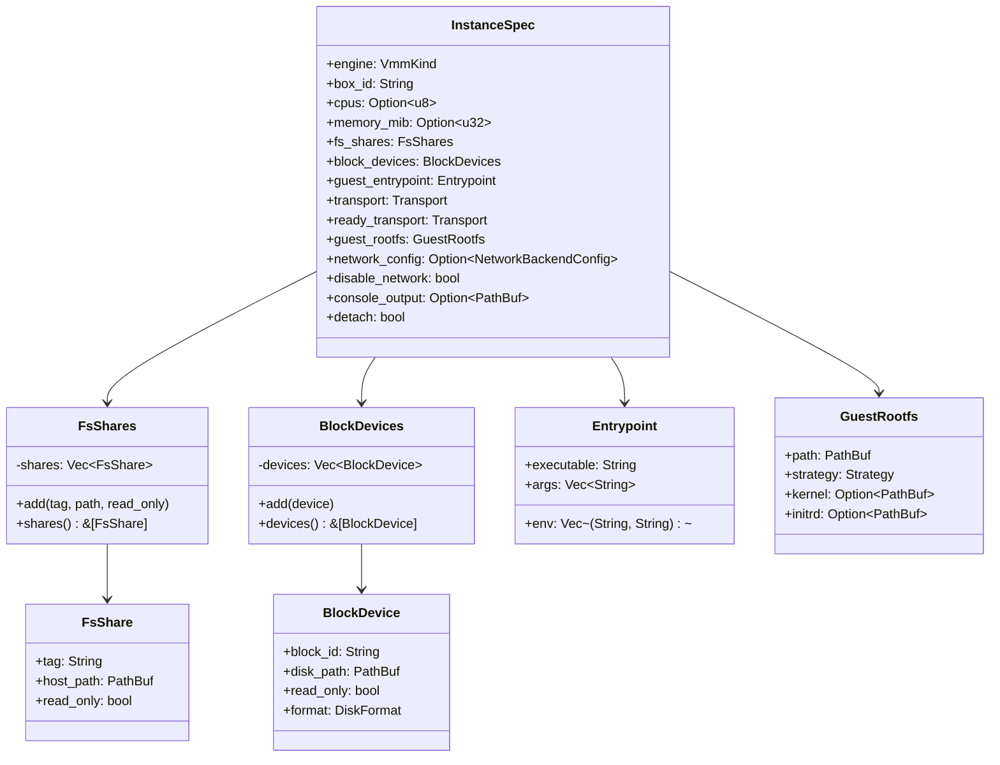

---

### 2. libkrun-sys FFI 绑定

`src/deps/libkrun-sys/` crate 提供了对 libkrun 共享库的原始、不安全的 C 绑定。
这些是最底层的构建块 —— 没有安全保证，没有错误上下文，只有 `extern "C"` 函数签名。

#### 2.1 完整 FFI 函数参考

**上下文生命周期：**

| FFI 函数 | 签名 | 用途 |
|---|---|---|
| `krun_create_ctx` | `() -> i32` | 创建一个新的 VM 配置上下文。返回 ctx_id (>= 0) 或负数错误码。 |
| `krun_free_ctx` | `(ctx_id: u32) -> i32` | 释放配置上下文并回收资源。 |
| `krun_init_log` | `(target, level, style, flags) -> i32` | 初始化日志子系统。必须在任何上下文创建之前调用。 |
| `krun_set_log_level` | `(level: u32) -> i32` | 设置日志详细级别。 |

**VM 配置：**

| FFI 函数 | 签名 | 用途 |
|---|---|---|
| `krun_set_vm_config` | `(ctx_id, num_vcpus: u8, ram_mib: u32) -> i32` | 设置 CPU 数量和内存分配。 |
| `krun_set_kernel` | `(ctx_id, kernel_path, format, initramfs, cmdline) -> i32` | 设置外部内核/initrd（仅限 Windows WHPX —— 在 Linux/macOS 上内核嵌入在 libkrunfw 中）。 |

**根文件系统：**

| FFI 函数 | 签名 | 用途 |
|---|---|---|
| `krun_set_root` | `(ctx_id, root_path) -> i32` | 设置客户机根文件系统路径（基于 virtiofs 的启动）。 |
| `krun_set_root_disk_remount` | `(ctx_id, device, fstype, options) -> i32` | 从块设备启动。libkrun 创建一个虚拟的 virtiofs 根，运行 init，然后切换到磁盘。 |

**virtiofs 文件系统共享：**

| FFI 函数 | 签名 | 用途 |
|---|---|---|
| `krun_add_virtiofs` | `(ctx_id, mount_tag, host_path) -> i32` | 添加 virtiofs 共享（旧版，无只读控制）。 |
| `krun_add_virtiofs3` | `(ctx_id, mount_tag, host_path, shm_size, read_only) -> i32` | 添加带共享内存大小和只读标志的 virtiofs 共享。 |

**块设备：**

| FFI 函数 | 签名 | 用途 |
|---|---|---|
| `krun_add_disk` | `(ctx_id, block_id, disk_path, read_only) -> i32` | 通过 virtio-blk 附加原始磁盘镜像。 |
| `krun_add_disk2` | `(ctx_id, block_id, disk_path, disk_format, read_only) -> i32` | 附加带有显式格式（raw=0, qcow2=1）的磁盘镜像。 |

**网络：**

| FFI 函数 | 签名 | 用途 |
|---|---|---|
| `krun_add_net` | `(ctx_id, endpoint, mac) -> i32` | 添加基于 TCP 的网络后端（Windows）。 |
| `krun_add_net_unixstream` | `(ctx_id, path, fd, mac, features, flags) -> i32` | 添加 Unix 流式套接字网络后端。 |
| `krun_add_net_unixgram` | `(ctx_id, path, fd, mac, features, flags) -> i32` | 添加带 VFKIT 握手的 Unix 数据报套接字网络后端。 |

**Vsock：**

| FFI 函数 | 签名 | 用途 |
|---|---|---|
| `krun_disable_implicit_vsock` | `(ctx_id) -> i32` | 移除默认的 vsock 设备（该设备启用了 TSI）。 |
| `krun_add_vsock` | `(ctx_id, tsi_features) -> i32` | 添加带指定 TSI 特性标志的显式 vsock。 |
| `krun_add_vsock_port2` | `(ctx_id, port, filepath, listen) -> i32` | 将客户机 vsock 端口桥接到宿主 Unix 套接字。 |

**进程执行：**

| FFI 函数 | 签名 | 用途 |
|---|---|---|
| `krun_set_exec` | `(ctx_id, exec_path, argv, envp) -> i32` | 设置入口点二进制文件、参数和环境变量。 |
| `krun_set_env` | `(ctx_id, envp) -> i32` | 设置额外的环境变量。 |
| `krun_set_workdir` | `(ctx_id, workdir_path) -> i32` | 设置入口点的工作目录。 |

**VM 生命周期：**

| FFI 函数 | 签名 | 用途 |
|---|---|---|
| `krun_start_enter` | `(ctx_id) -> i32` | **进程接管。** 启动 VM 并劫持调用进程。成功时永不返回。错误时返回负数，客户机退出时返回正数。 |
| `krun_start` | `(ctx_id) -> i32` | 在后台线程上启动 VM（非阻塞）。 |
| `krun_wait` | `(ctx_id) -> i32` | 阻塞直到 VM 退出。返回客户机退出码。 |
| `krun_stop` | `(ctx_id) -> i32` | 强制停止正在运行的 VM。 |

**控制台和其他：**

| FFI 函数 | 签名 | 用途 |
|---|---|---|
| `krun_set_console_output` | `(ctx_id, filepath) -> i32` | 将内核/init 控制台输出重定向到文件。 |
| `krun_get_console_output` | `(ctx_id, buf, buf_size) -> i32` | 读取控制台输出缓冲区。 |
| `krun_set_rlimits` | `(ctx_id, rlimits) -> i32` | 设置客户机资源限制（例如 RLIMIT_NPROC、RLIMIT_NOFILE）。 |
| `krun_set_port_map` | `(ctx_id, port_map) -> i32` | 配置端口映射。 |
| `krun_split_irqchip` | `(ctx_id, enable) -> i32` | 启用分离 IRQ 芯片模式。 |
| `krun_set_nested_virt` | `(ctx_id, enabled) -> i32` | 启用嵌套虚拟化。 |
| `krun_set_gpu_options` | `(ctx_id, virgl_flags) -> i32` | 配置 GPU 直通选项。 |
| `krun_setuid` | `(ctx_id, uid) -> i32` | 设置 VM 进程 UID（仅限 Unix）。 |
| `krun_setgid` | `(ctx_id, gid) -> i32` | 设置 VM 进程 GID（仅限 Unix）。 |

#### 2.2 常量

```rust
// 日志目标
pub const KRUN_LOG_TARGET_DEFAULT: i32 = 0;
pub const KRUN_LOG_TARGET_STDOUT: i32 = 1;
pub const KRUN_LOG_TARGET_STDERR: i32 = 2;

// 日志级别
pub const KRUN_LOG_LEVEL_OFF: u32   = 0;
pub const KRUN_LOG_LEVEL_ERROR: u32 = 1;
pub const KRUN_LOG_LEVEL_WARN: u32  = 2;
pub const KRUN_LOG_LEVEL_INFO: u32  = 3;
pub const KRUN_LOG_LEVEL_DEBUG: u32 = 4;
pub const KRUN_LOG_LEVEL_TRACE: u32 = 5;

// 磁盘格式
pub const KRUN_DISK_FORMAT_RAW: u32   = 0;
pub const KRUN_DISK_FORMAT_QCOW2: u32 = 1;
```

---

### 3. KrunContext —— 安全的 FFI 封装

`KrunContext`（`vmm/krun/context.rs`，约 660 行）封装了一个 libkrun 上下文 ID，
并为所有 FFI 调用提供相对安全的 Rust 方法。它实现了 `Drop` 以确保上下文清理。

#### 3.1 所有权与生命周期

```rust
pub struct KrunContext {
    ctx_id: u32,
}

impl Drop for KrunContext {
    fn drop(&mut self) {
        unsafe { let _ = krun_free_ctx(self.ctx_id); }
    }
}
```

上下文通过 `KrunContext::create()` 创建，该方法调用 `krun_create_ctx()` 并
检查负数返回值。所有后续调用都使用存储的 `ctx_id`。

#### 3.2 安全模式

所有方法都标记为 `unsafe`，因为它们调用了 C 代码。每个方法遵循以下模式：

1. 将 Rust `&str` 转换为 `CString`（带空字节的错误处理）
2. 使用 `CString::as_ptr()` 调用 FFI 函数
3. 将返回码路由到 `check_status()`

```rust
pub unsafe fn set_rootfs(&self, rootfs: &str) -> BoxliteResult<()> {
    let rootfs_c = CString::new(rootfs)
        .map_err(|e| BoxliteError::Engine(format!("invalid rootfs path: {e}")))?;
    check_status("krun_set_root", unsafe {
        krun_set_root(self.ctx_id, rootfs_c.as_ptr())
    })
}
```

#### 3.3 错误处理 —— check_status()

`check_status` 函数将负数返回码转换为 `BoxliteError::Engine`。
它对 `-22`（EINVAL）有特殊处理，这是最常见的错误：

```rust
pub(crate) fn check_status(label: &str, status: i32) -> BoxliteResult<()> {
    if status < 0 {
        if status == -22 {
            return Err(BoxliteError::Engine(format!(
                "libkrun function '{}' returned EINVAL (-22). Possible causes:\n\
                 - macOS: VM address space limit reached (kern.hv.max_address_spaces)\n\
                 - Invalid rootfs structure (missing kernel or initrd)\n\
                 Run `boxlite list` to check active boxes.",
                label
            )));
        }
        Err(BoxliteError::Engine(format!(
            "libkrun function '{}' failed with status {}",
            label, status
        )))
    } else {
        Ok(())
    }
}
```

#### 3.4 关键方法摘要

| 方法 | FFI 调用 | 说明 |
|---|---|---|
| `create()` | `krun_create_ctx` | 返回 `BoxliteResult<Self>` |
| `set_vm_config()` | `krun_set_vm_config` | CPU + 内存 |
| `set_rootfs()` | `krun_set_root` | 基于 virtiofs 的启动 |
| `set_root_disk_remount()` | `krun_set_root_disk_remount` | 基于磁盘的启动 |
| `set_kernel()` | `krun_set_kernel` | 仅限 Windows WHPX |
| `add_virtiofs()` | `krun_add_virtiofs3` | 带只读标志 |
| `add_disk_with_format()` | `krun_add_disk2` | Raw 或 QCOW2 |
| `add_net_path()` | `krun_add_net_unixstream` / `krun_add_net_unixgram` | 平台特定 |
| `add_net()` | `krun_add_net` | 仅限 Windows TCP |
| `disable_implicit_vsock()` | `krun_disable_implicit_vsock` | 用于 network=disabled 模式 |
| `add_vsock()` | `krun_add_vsock` | 带 TSI 特性标志 |
| `add_vsock_port()` | `krun_add_vsock_port2` | 套接字到 vsock 桥接 |
| `set_exec()` | `krun_set_exec` | 入口点 + argv + envp |
| `set_console_output()` | `krun_set_console_output` | 控制台重定向 |
| `start_enter()` | `krun_start_enter` | **进程接管** |
| `start()` | `krun_start` | 非阻塞启动 |
| `wait()` | `krun_wait` | 阻塞直到退出 |
| `stop()` | `krun_stop` | 强制终止 |

---

### 4. Krun 引擎实现

`Krun` 结构体（`vmm/krun/engine.rs`）实现了 `Vmm` 并编排完整的 VM 创建序列。

#### 4.1 完整创建流程

`Krun::create()` 方法遵循严格的顺序 —— 每一步都依赖于前一步，
并且多个步骤必须在不可逆的 `start_enter()` 之前完成。

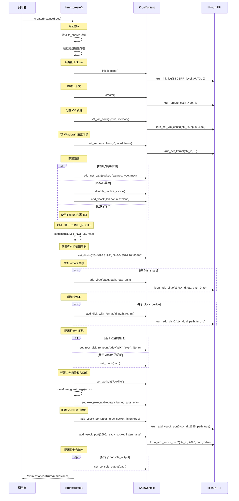

#### 4.2 逐步分解

**步骤 1：输入验证。** 在接触 FFI 之前，引擎验证所有文件系统共享目录和磁盘镜像文件
在宿主上存在。这会在不可逆点之前捕获配置错误。

**步骤 2：日志初始化。** `KrunContext::init_logging()` 将 `RUST_LOG`
环境变量映射到 libkrun 的日志级别常量。这必须在任何上下文创建之前完成。

**步骤 3：上下文创建。** `krun_create_ctx()` 在 libkrun 内部分配状态并返回上下文 ID。
`KrunContext` 结构体拥有此 ID。

**步骤 4：VM 资源。** `krun_set_vm_config()` 设置 vCPU 数量和内存。在 Windows
WHPX 上，vCPU 数量被限制为 4，这是由于 WHPX 分区约束（之前限制为 2，原因是 BSP 挂起
bug —— 通过添加 `vcpu_running` 标志修复，使计时器线程只取消实际运行中的 vCPU）。

**步骤 5：内核（仅限 Windows）。** 在 Linux 和 macOS 上，内核嵌入在 libkrunfw 中
—— 无需加载任何东西。在 Windows WHPX 上，内核未嵌入；`krun_set_kernel()`
加载外部 `vmlinuz` 文件和可选的 `initrd.img`。

**步骤 6：网络。** 三种模式：
- **外部后端：** gvproxy 提供一个 Unix 套接字。引擎调用
  `add_net_unixstream`（passt）或 `add_net_unixgram`（gvproxy/VFKIT）并带特性标志。
  在 Windows 上，`add_net` 接受 TCP 端点。
- **禁用：** 用显式的零 TSI 特性 vsock 替换隐式 vsock（后者具有 TSI 劫持功能）。
  vsock IPC 端口仍然工作，但客户机套接字不会通过宿主转发。
- **默认（TSI）：** 使用 libkrun 内置的透明套接字模拟（Transparent Socket Impersonation）。
  客户机 AF_INET/AF_UNIX 套接字通过宿主内核透明转发。

**步骤 7：RLIMIT_NOFILE。** virtiofs 是 VMM 进程内的用户空间文件服务器。
每个共享的文件消耗一个文件描述符。BoxLite 在挂载任何 virtiofs 共享之前将
`RLIMIT_NOFILE` 提升到硬限制，以防止在高负载容器工作负载下出现"打开文件过多"错误。

**步骤 8：客户机资源限制。** 配置将在客户机 VM 内部应用的资源限制：
- `RLIMIT_NPROC` (6) = 4096 软限制 / 8192 硬限制
- `RLIMIT_NOFILE` (7) = 1048576 软限制 / 1048576 硬限制

**步骤 9：virtiofs 共享。** 每个 `FsShare` 在客户机中变成一个 virtiofs 挂载。
标准标签为：

| 挂载标签 | 用途 |
|---|---|
| `BoxLiteContainer0Rootfs` | 容器根文件系统 |
| `BoxLiteContainer0Layers` | OCI 镜像层 |
| `BoxLiteShared` | 面向用户的共享目录 |

**步骤 10：块设备。** 磁盘镜像通过 virtio-blk 附加。每个设备获得一个
`block_id`（例如 "vda"、"vdb"）并在客户机中显示为 `/dev/vdX`。支持的格式：

| 格式 | 常量 | 使用场景 |
|---|---|---|
| Raw | `KRUN_DISK_FORMAT_RAW` (0) | 直接块访问，最佳性能 |
| QCOW2 | `KRUN_DISK_FORMAT_QCOW2` (1) | 写时复制、快照、精简配置 |

**步骤 11：根文件系统。** 两种策略：
- **virtiofs 启动：** `krun_set_root(path)` 指向一个目录，该目录在客户机中变成 `/`。
- **磁盘启动：** `krun_set_root_disk_remount("/dev/vda", "ext4", None)` 从块设备启动。
  libkrun 创建一个仅含 init 二进制文件的临时 virtiofs 根，从中启动，
  然后通过自动重新挂载切换到基于磁盘的根。

**步骤 12：入口点。** `krun_set_exec()` 配置客户机代理二进制文件、其参数
（经过传输层转换后）和环境变量。工作目录设置为 `/boxlite`。

**步骤 13：vsock 桥接。** 两个 vsock 端口被桥接到宿主 Unix 套接字：

| 端口 | 用途 | `listen` 标志 |
|---|---|---|
| 2695 | gRPC 通信（宿主到客户机） | `true` —— libkrun 创建套接字，宿主连接到它 |
| 2696 | 就绪通知（客户机到宿主） | `false` —— 宿主创建套接字，客户机连接到它 |

端口号是助记符：2695 = "BOXL"，2696 = "BOXM"（在手机键盘上）。

**步骤 14：控制台输出。** 可选地将内核和 init 消息重定向到文件，用于事后调试。

---

### 5. 传输层转换

客户机 VM 无法访问宿主文件系统上的 Unix 套接字。相反，libkrun 将宿主套接字桥接到
客户机 vsock 端口。引擎必须转换入口点参数，使客户机代理在 vsock 上监听，
而不是宿主的 Unix 套接字或 TCP 地址。

#### 5.1 转换逻辑

`Krun::transform_guest_args()` 处理四种转换情况：

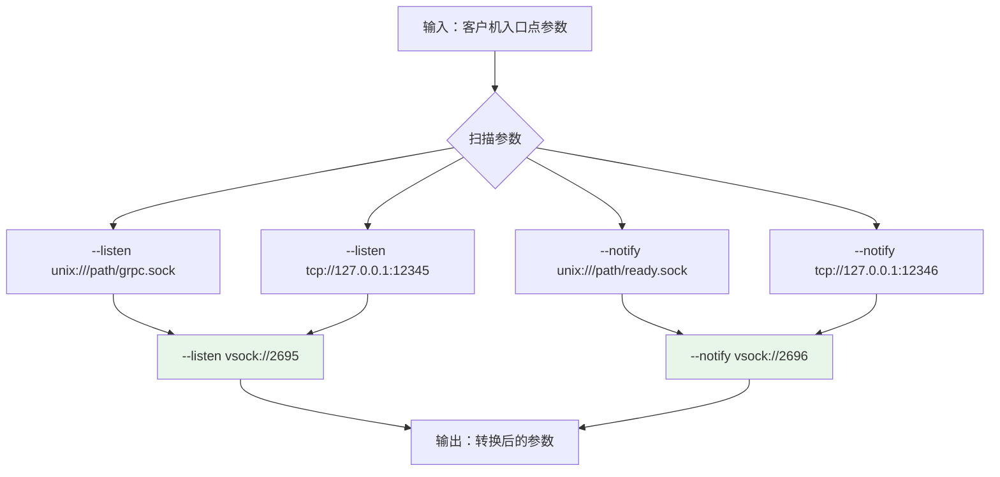

#### 5.2 两种参数格式

转换处理两种参数格式：

**分离参数：**
```
["--listen", "unix:///tmp/boxlite.sock", "--notify", "unix:///tmp/ready.sock"]
   -->
["--listen", "vsock://2695", "--notify", "vsock://2696"]
```

**Shell 命令字符串：**
```
["-c", "exec boxlite-guest --listen unix:///tmp/boxlite.sock --notify unix:///tmp/ready.sock"]
   -->
["-c", "exec boxlite-guest --listen vsock://2695 --notify vsock://2696"]
```

Shell 命令的情况是必要的，因为入口点可能使用 `exec` 将 shell 进程替换为客户机代理。

#### 5.3 平台特定传输

| 平台 | 宿主传输 | 客户机传输 | 转换 |
|---|---|---|---|
| Linux | `unix:///path/to/socket` | `vsock://PORT` | Unix 到 vsock |
| macOS | `unix:///path/to/socket` | `vsock://PORT` | Unix 到 vsock |
| Windows | `tcp://127.0.0.1:PORT` | `vsock://PORT` | TCP 到 vsock |

引擎无条件地应用 Unix 和 TCP 两种转换 —— 在任何给定平台上只有一种会匹配。

---

### 6. 进程接管与 Shim 架构

#### 6.1 问题

`krun_start_enter()` 是一个进程接管函数：成功时，调用进程变成 VM 并永不返回。
这与以下情况不兼容：
- 需要继续运行的宿主应用
- 测试框架
- 管理多个 VM 的任何进程

#### 6.2 解决方案：boxlite-shim

BoxLite 生成一个 `boxlite-shim` 子进程来吸收进程接管。
父应用保留一个带有 shim PID 的处理器用于生命周期管理。

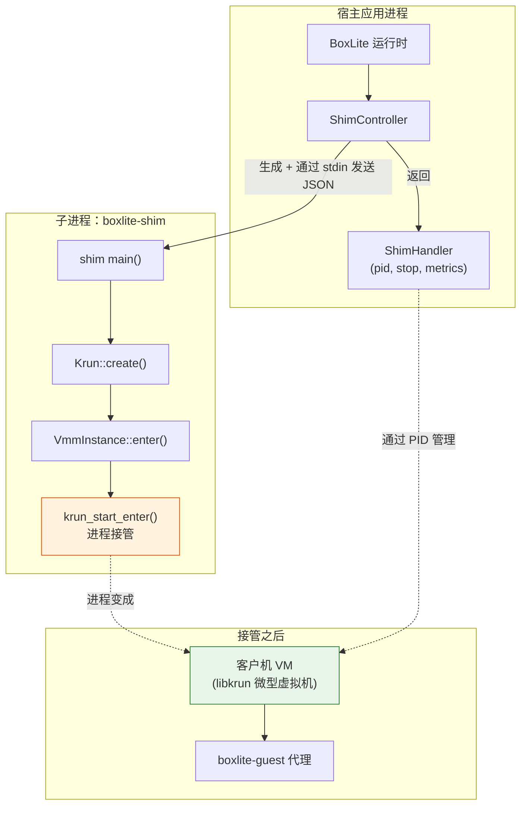

#### 6.3 ShimSpawner —— 子进程创建

`ShimSpawner`（`vmm/controller/spawn.rs`）处理完整的子进程创建序列：

1. **创建看门狗**（仅限非分离模式）。
   - Unix：带 `FD_CLOEXEC` 的管道对
   - Windows：命名 Event 对象（可继承，手动重置）

2. **构建 jailer（隔离器）。** `JailerBuilder` 创建操作系统特定的沙箱：
   - Linux：seccomp + cgroup + namespace 隔离
   - macOS：带 deny-default 策略的 `sandbox-exec`
   - Windows：Job Object（进程组隔离）

3. **准备隔离。** `jail.prepare()` 设置 cgroup（Linux）或为空操作（macOS）。

4. **构建命令。** `jail.command()` 将二进制文件包装在隔离环境中。没有 CLI 参数 ——
   配置通过 stdin 管道发送，以避免 `/proc/cmdline` 暴露（这会泄露 CA 私钥和机密信息）。

5. **配置环境。** 传递 `RUST_LOG`、`RUST_BACKTRACE` 和库搜索路径。
   使用内置 macOS seatbelt 策略时，`TMPDIR`/`TMP`/`TEMP` 被重定向到 box 范围的目录。

6. **配置标准 I/O。**
   - `stdin`：管道模式（用于配置 JSON）
   - `stdout`：空设备
   - `stderr`：重定向到文件（捕获 pre-main dyld 错误）

7. **生成。** 在 Windows 上，`CREATE_SUSPENDED` 标志消除了生成和 Job Object
   分配之间的 TOCTOU（检查时间/使用时间）窗口。

8. **生成后沙箱。** `jail.post_spawn()` 将进程分配到 Job Object（Windows）。

9. **恢复。** 在 Windows 上，`resume_suspended_process()` 通过 Toolhelp32
   枚举线程并恢复每个线程。

10. **写入配置。** 配置 JSON 写入子进程的 stdin，然后关闭 stdin
    （shim 读取直到 EOF）。

11. **关闭子进程 FD。** 在父进程中关闭看门狗管道的读端。

12. **写入 PID 文件。** 仅限 Windows（Unix 通过 fork 后的 `pre_exec` 钩子写入 PID）。

#### 6.4 ShimHandler —— 运行时操作

`ShimHandler`（`vmm/controller/shim.rs`）提供正在运行的 VM 的生命周期操作：

| 方法 | 行为 |
|---|---|
| `pid()` | 返回 shim 进程 ID |
| `is_running()` | 检查进程是否存活 |
| `stop()` | 优雅关闭：SIGTERM（Unix）/ 信号 Event（Windows），等待 2 秒，然后 SIGKILL / 强制终止 |
| `metrics()` | 通过 `sysinfo` crate 获取 CPU 使用率和内存（使用共享 `System` 进行增量计算） |

两种构造模式：
- `from_spawned(SpawnedShim)` —— 拥有 `Child` 句柄和看门狗 `Keepalive`
- `from_pid(pid)` —— 附加到现有 VM（重连模式，无 keepalive）

**纵深防御：** 即使从未调用 `stop()`，丢弃 `ShimHandler` 也会丢弃 `Keepalive`，
从而自动触发 shim 关闭。

#### 6.5 VmmController Trait

```rust
#[async_trait]
pub trait VmmController: Send {
    async fn start(&mut self, bundle: &InstanceSpec) -> BoxliteResult<Box<dyn VmmHandler>>;
}
```

`ShimController` 实现了这个 trait。`start()` 方法：
1. 克隆并将 `InstanceSpec` 序列化为 JSON
2. 清理过期的 Unix 套接字
3. 创建 `ShimSpawner` 并调用 `spawn()`
4. 返回 `ShimHandler` 用于运行时操作

---

### 7. 看门狗 —— 父进程死亡检测

看门狗确保当父应用崩溃或意外退出时，shim 子进程不会成为孤儿进程。

#### 7.1 Unix：管道技巧

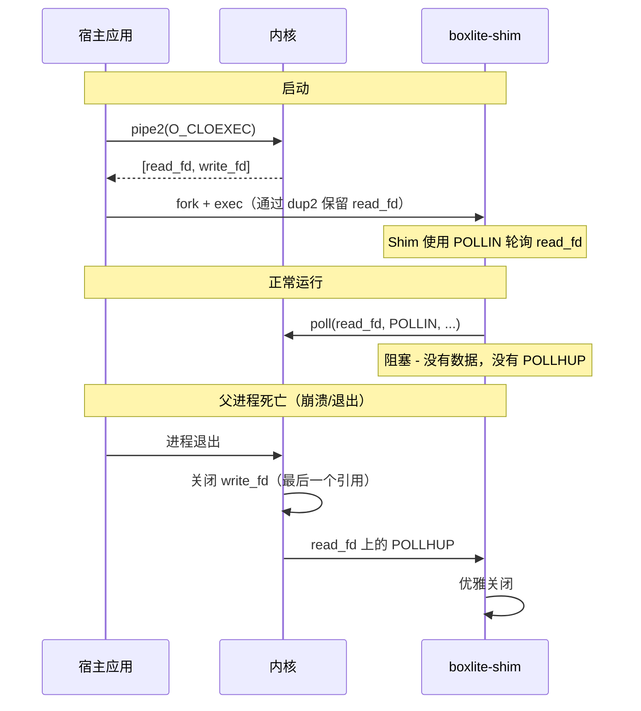

关键特性：
- **零延迟：** POLLHUP 在写端关闭时立即触发。
- **防篡改：** 内核 FD 不能被伪造。
- **命名空间安全：** 跨 PID/挂载命名空间工作。
- **FD_CLOEXEC：** 管道两端都设置了 CLOEXEC 以防止泄露到无关的子进程。
  没有这个设置，子进程（例如由 VS Code 生成的）可能继承写端，
  阻止父进程死亡时 POLLHUP 的触发。

这与 s6、containerd-shim、runc、crun 和 conmon 使用的机制相同。

#### 7.2 Windows：Event + 父进程句柄

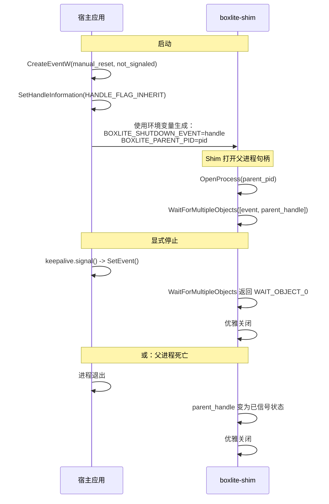

两种检测机制并行运行：
- **Event 句柄：** 父进程在显式停止时调用 `SetEvent()`。也在
  `Keepalive::drop()` 中发出信号，用于纵深防御。
- **父进程句柄：** 当父进程退出时，其句柄变为已信号状态。
  `WaitForMultipleObjects` 在任一先触发时唤醒。

---

### 8. Virtio 设备配置

客户机 VM 看到一组由 Krun 引擎配置的 virtio 设备。每种设备类型在
BoxLite 架构中服务于特定目的。

#### 8.1 Virtio-fs (virtiofs)

virtiofs 共享通过 FUSE-over-virtio 将宿主目录暴露给客户机。
客户机代理使用挂载标签来挂载它们。

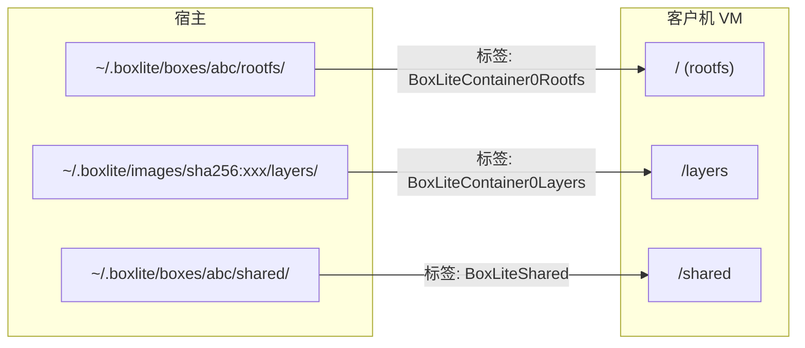

**RLIMIT_NOFILE 要求：** virtiofs 是 VMM 进程内的用户空间文件服务器。
客户机访问的每个文件消耗宿主进程中的一个文件描述符。BoxLite 在添加任何
virtiofs 共享*之前*将 `RLIMIT_NOFILE` 提升到硬限制的最大值。
如果没有这个设置，同时触及大量文件的容器工作负载会遇到"打开文件过多"错误。

#### 8.2 Virtio-blk

块设备将磁盘镜像作为 `/dev/vdX` 设备附加到客户机。

| 属性 | 值 |
|---|---|
| 设备命名 | `/dev/vda`、`/dev/vdb` 等 |
| 支持的格式 | Raw（`KRUN_DISK_FORMAT_RAW` = 0）、QCOW2（`KRUN_DISK_FORMAT_QCOW2` = 1） |
| 访问模式 | 读写、只读 |
| 安全注意事项 | QCOW2 镜像可以引用后备文件，libkrun 会自动打开这些文件 |

用途：
- 客户机根文件系统磁盘镜像（ext4，通过 `set_root_disk_remount` 启动）
- 持久存储卷
- 临时磁盘

#### 8.3 Virtio-console

将内核和 init 输出重定向到宿主上的文件。通过 `krun_set_console_output()` 配置。
这对于调试启动失败非常有价值 —— 没有它，早期内核消息将会丢失。

#### 8.4 Virtio-vsock

vsock 提供零拷贝、零配置的宿主-客户机通信。BoxLite 使用两种机制：

**端口桥接** 通过 `krun_add_vsock_port2()`：

```
宿主 Unix 套接字  <-->  vsock 端口 2695  (gRPC：宿主到客户机的命令)
宿主 Unix 套接字  <-->  vsock 端口 2696  (就绪：客户机到宿主的通知)
```

`listen` 标志控制谁创建套接字：
- `listen=true`（端口 2695）：libkrun 创建 Unix 套接字并监听。宿主运行时连接到它。
- `listen=false`（端口 2696）：宿主运行时创建并监听 Unix 套接字。客户机连接到它。

**TSI（透明套接字模拟）** 通过 `krun_add_vsock()`：

TSI 透明地将客户机套接字操作通过宿主内核转发。这使客户机无需显式网络配置即可访问互联网。

```rust
pub enum TsiFeatures {
    None,        // 0: 不转发（仅 vsock IPC）
    HijackInet,  // 1: 转发 AF_INET (TCP/UDP)
    HijackUnix,  // 2: 转发 AF_UNIX
    HijackAll,   // 3: 转发两者
}
```

当 `network_config` 为 `None` 且 `disable_network` 为 `false` 时，
libkrun 的默认 vsock 启用了 `HijackAll` 的 TSI，给予客户机透明的互联网访问。

当 `disable_network` 为 `true` 时，BoxLite 用使用 `TsiFeatures::None`
的显式 vsock 替换隐式 vsock。vsock IPC 端口（2695、2696）仍然可用于宿主-客户机
gRPC，但客户机套接字不会被转发。

#### 8.5 Virtio-net

外部网络后端（gvproxy）提供带有真实 MAC 地址和完整 TCP/IP 网络的 virtio-net 设备。
客户机看到一个 `eth0` 接口。

**特性标志**（来自 virtio 规范）：

| 标志 | 值 | 用途 |
|---|---|---|
| `NET_FEATURE_CSUM` | `1 << 0` | 客户机处理部分校验和 |
| `NET_FEATURE_GUEST_CSUM` | `1 << 1` | 客户机处理校验和卸载 |
| `NET_FEATURE_GUEST_TSO4` | `1 << 7` | 客户机可以接收 TSOv4 |
| `NET_FEATURE_GUEST_UFO` | `1 << 10` | 客户机可以接收 UFO |
| `NET_FEATURE_HOST_TSO4` | `1 << 11` | 宿主可以接收 TSOv4 |
| `NET_FEATURE_HOST_UFO` | `1 << 14` | 宿主可以接收 UFO |

**连接标志：**

| 标志 | 值 | 用途 |
|---|---|---|
| `NET_FLAG_VFKIT` | `1 << 0` | 连接后发送 VFKIT 魔术字节（"VFKT"）握手（gvproxy 使用 UnixDgram 套接字时需要） |

#### 8.6 完整的 Virtio 设备拓扑

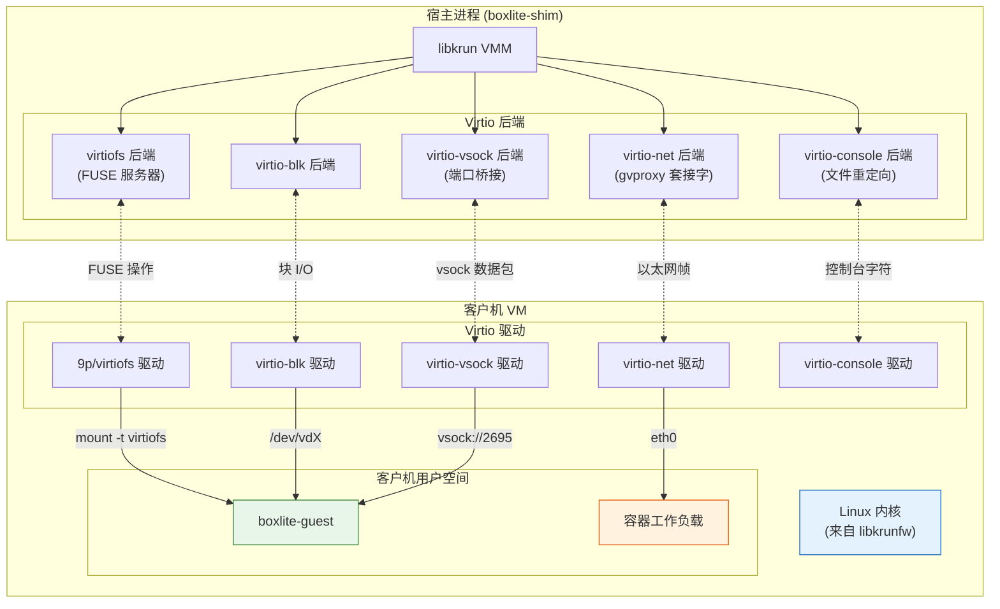

---

### 9. 内核与 Initrd 处理

客户机 Linux 内核如何到达 VM 在不同平台之间差异显著。

#### 9.1 Linux (KVM)

内核嵌入在 `libkrunfw.so` 中，这是一个包含专门为 libkrun 编译的最小 Linux 内核的
共享库。构建系统从 libkrunfw 发布构件中下载预构建的 `.so` 文件。

```
libkrunfw 发布 (GitHub) --> libkrunfw.so --> 链接到 libkrun --> 嵌入式内核
```

不需要调用 `krun_set_kernel()`。

#### 9.2 macOS (Hypervisor.framework)

内核嵌入在 `libkrunfw.dylib` 中，从包含内核二进制数据的字节数组的 C 源代码（`kernel.c`）
编译而来。构建系统将 `kernel.c` 编译为共享库。

```
kernel.c（字节数组） --> cc --> libkrunfw.dylib --> 链接到 libkrun --> 嵌入式内核
```

不需要调用 `krun_set_kernel()`。

#### 9.3 Windows (WHPX)

内核**未**嵌入。它必须作为外部文件提供。引擎从运行时目录发现 `vmlinuz`
和 `initrd.img`：

```rust
#[cfg(not(unix))]
{
    let kernel_path = crate::util::find_binary("vmlinuz")?;
    let initrd_path = crate::util::find_binary("initrd.img").ok();
    ctx.set_kernel(kernel_str, 0, initrd_str, None)?;
}
```

如果找不到 `vmlinuz`，引擎返回一个带有设置 `BOXLITE_RUNTIME_DIR` 指导的错误。

---

### 10. 根文件系统组装策略

BoxLite 支持四种准备客户机根文件系统的策略，根据平台能力和镜像类型选择。

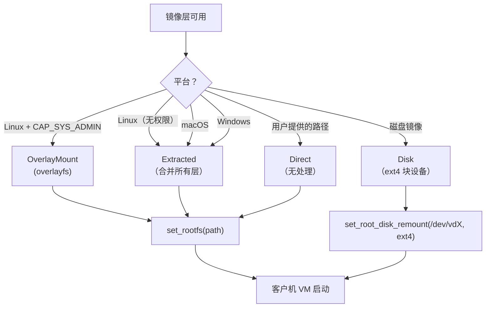

#### 10.1 Direct（直接）

用户提供的根文件系统路径。无处理 —— 路径直接传递给 `krun_set_root()`。
用于自定义根文件系统目录。

#### 10.2 Extracted（解压）

所有 OCI 镜像层按顺序解压每个层的 tarball 并合并到单个目录中。
这是在 macOS 和 Windows 上不支持 overlayfs 时的回退策略。

**权衡：** 设置较慢（完整解压），但简单且普遍支持。

#### 10.3 OverlayMount（Overlay 挂载）

Linux overlayfs 将 OCI 层作为堆栈挂载而无需解压：
- **下层：** 只读的 OCI 层（每个镜像层一个）
- **上层：** 可写的 tmpfs，用于容器修改
- **工作目录：** overlayfs 进行原子操作所需

需要 Linux 上的 `CAP_SYS_ADMIN`。在 macOS 或 Windows 上不可用。

**权衡：** 设置快速（无需解压），写时复制语义，但需要提升的权限。

#### 10.4 Disk（磁盘）

客户机根文件系统烘焙到 ext4 磁盘镜像中。VM 使用
`krun_set_root_disk_remount()` 从此块设备启动：

1. libkrun 创建仅包含 init 二进制文件的虚拟 virtiofs 根
2. VM 从此虚拟根启动
3. init 运行并立即切换到块设备根
4. ext4 文件系统变成 `/`

**权衡：** 最佳客户机文件系统性能（原生 ext4 vs FUSE），但需要预先构建磁盘镜像。

---

### 11. 跨平台 Hypervisor 比较

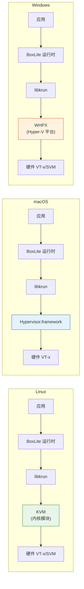

#### 11.1 详细比较

| 方面 | Linux (KVM) | macOS (HVF) | Windows (WHPX) |
|---|---|---|---|
| **Hypervisor** | KVM 内核模块 | Hypervisor.framework | Hyper-V 平台 (WHPX) |
| **硬件要求** | VT-x/AMD-V | Apple Silicon (ARM64) | VT-x/AMD-V + 已启用 Hyper-V |
| **libkrunfw** | 下载预构建的 `.so` | 从 `kernel.c` 源代码编译 | 内嵌在 libkrun 中 |
| **内核加载** | 嵌入在 libkrunfw 中 | 嵌入在 libkrunfw 中 | 通过 `krun_set_kernel()` 加载外部 `vmlinuz` |
| **Initrd** | 嵌入 | 嵌入 | 外部 `initrd.img`（可选） |
| **网络 FFI** | `krun_add_net_unixstream` / `krun_add_net_unixgram` | `krun_add_net_unixgram` (VFKIT) | `krun_add_net`（TCP 端点） |
| **网络后端** | gvproxy 通过 Unix 流式套接字 | gvproxy 通过 Unix 数据报套接字 | gvproxy 通过 TCP 套接字 |
| **VFKIT 握手** | 不需要（UnixStream） | 需要（UnixDgram + `NET_FLAG_VFKIT`） | 不适用 |
| **vCPU 限制** | 无（硬件限制） | 无（硬件限制） | 4 个 vCPU（WHPX 分区约束） |
| **Overlayfs** | 是（需要 `CAP_SYS_ADMIN`） | 否 | 否 |
| **根文件系统回退** | Extracted（若无权限） | Extracted | Extracted |
| **看门狗** | 管道 POLLHUP（`pipe2` + `O_CLOEXEC`） | 管道 POLLHUP（`pipe` + `fcntl`） | Event 句柄 + 父进程句柄 |
| **Jailer 沙箱** | seccomp + cgroup + namespace | `sandbox-exec`（seatbelt） | Job Object |
| **进程挂起** | 不适用（fork 语义） | 不适用（fork 语义） | `CREATE_SUSPENDED` + Job Object 后恢复 |
| **PID 文件** | 在 `pre_exec` 中写入（fork 后） | 在 `pre_exec` 中写入（fork 后） | 由父进程在生成后写入 |
| **UID/GID 设置** | `krun_setuid` / `krun_setgid` | `krun_setuid` / `krun_setgid` | 不适用 |
| **传输** | Unix 套接字 | Unix 套接字 | TCP（localhost） |

#### 11.2 Windows WHPX vCPU 限制

Windows WHPX 被限制为 4 个 vCPU。历史：

1. **原始限制：2 个 vCPU。** 在 4 个以上 vCPU 时，BSP（引导处理器）会在启动期间挂起。
   根本原因：计时器线程在并未实际运行的应用处理器（AP）上调用
   `WHvCancelRunVirtualProcessor` —— 它们仍在条件变量上等待。
   这破坏了 WHPX 分区状态。

2. **修复：`vcpu_running` 标志。** 添加每个 vCPU 的运行标志，确保计时器线程
   仅取消在 `WHvRunVirtualProcessor` 中活跃运行的 vCPU。

3. **当前限制：4 个 vCPU。** 修复后，4 个 vCPU 运行可靠。限制通过引擎中的
   `cpus.clamp(1, 4)` 强制执行。

---

### 12. 退出信息与崩溃诊断

当 shim 进程崩溃或 VM 启动失败时，结构化的退出信息以 JSON 格式写入退出文件
（遵循 Podman 模式）：

```rust
pub enum ExitInfo {
    Signal { exit_code: i32, signal: String },        // SIGABRT、SIGSEGV 等
    Panic  { exit_code: i32, message: String, location: String },
    Error  { exit_code: i32, message: String },       // enter() 失败
}
```

退出文件内容示例：

```json
{"type":"signal","exit_code":134,"signal":"SIGABRT"}
```

```json
{"type":"panic","exit_code":101,"message":"explicit panic","location":"main.rs:42:5"}
```

stderr 输出单独捕获在 `shim.stderr` 文件中，该文件甚至可以捕获 pre-main dyld 错误
（stderr 文件在生成子进程*之前*创建）。

---

### 源文件参考

| 文件 | 行数 | 用途 |
|---|---|---|
| `src/boxlite/src/vmm/mod.rs` | ~295 | VmmKind、InstanceSpec、FsShare、BlockDevice 类型 |
| `src/boxlite/src/vmm/engine.rs` | ~105 | Vmm、VmmInstanceImpl、VmmInstance、VmmConfig |
| `src/boxlite/src/vmm/factory.rs` | ~13 | VmmFactory trait |
| `src/boxlite/src/vmm/registry.rs` | ~113 | 通过 inventory 进行引擎注册 |
| `src/boxlite/src/vmm/krun/mod.rs` | ~32 | Krun 模块根，check_status() |
| `src/boxlite/src/vmm/krun/factory.rs` | ~27 | KrunFactory，inventory::submit! |
| `src/boxlite/src/vmm/krun/engine.rs` | ~748 | Krun::create()，传输层转换 |
| `src/boxlite/src/vmm/krun/context.rs` | ~664 | KrunContext 安全 FFI 封装 |
| `src/boxlite/src/vmm/krun/constants.rs` | ~90 | TsiFeatures，网络特性标志 |
| `src/boxlite/src/vmm/controller/mod.rs` | ~50 | VmmController、VmmHandler trait |
| `src/boxlite/src/vmm/controller/shim.rs` | ~410 | ShimController、ShimHandler |
| `src/boxlite/src/vmm/controller/spawn.rs` | ~452 | ShimSpawner，子进程创建 |
| `src/boxlite/src/vmm/controller/handler.rs` | ~31 | VmmHandler trait 定义 |
| `src/boxlite/src/vmm/controller/watchdog.rs` | ~496 | 管道技巧（Unix）、Event（Windows） |
| `src/boxlite/src/vmm/exit_info.rs` | ~212 | ExitInfo 崩溃诊断 |
| `src/deps/libkrun-sys/src/lib.rs` | ~157 | 原始 C FFI 绑定（30 多个函数） |
| `src/shared/src/constants.rs` | ~55 | GUEST_AGENT_PORT (2695)、GUEST_READY_PORT (2696)、挂载标签 |
