# 深入解析：宿主机与客户机通信

> BoxLite 的宿主机进程与客户机虚拟机代理如何通过 gRPC 进行通信、管理流式 I/O、传输文件，以及协调快照和关机等生命周期事件。

---

## 目录

- [A 部分：精简版](#a-部分精简版)
- [B 部分：详尽版](#b-部分详尽版)

---

# A 部分：精简版

## 概述

BoxLite 使用 **gRPC over vsock（虚拟套接字）** 进行所有宿主机与客户机之间的通信。宿主机侧（`portal/`）延迟连接到客户机代理（`guest/service/`），该代理在虚拟机内部运行一个 tonic gRPC 服务器。四个服务覆盖了全部交互面：客户机生命周期、容器管理、命令执行和文件传输。

## gRPC 服务架构

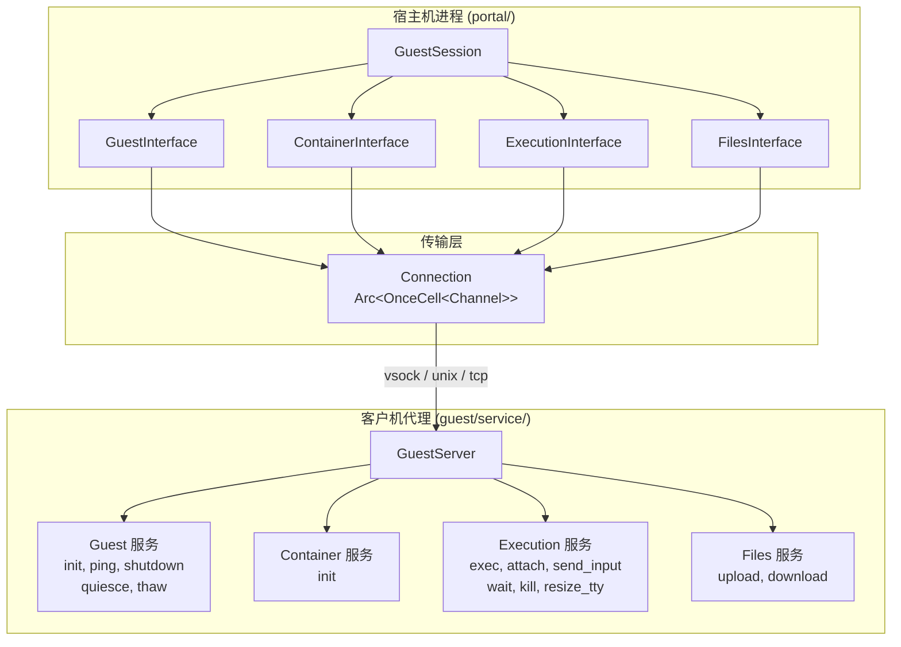
```mermaid
graph TB
    subgraph Host ["宿主机进程 (portal/)"]
        GS[GuestSession]
        GS --> GI[GuestInterface]
        GS --> CI[ContainerInterface]
        GS --> EI[ExecutionInterface]
        GS --> FI[FilesInterface]
    end

    subgraph Transport ["传输层"]
        CONN["Connection<br/>Arc&lt;OnceCell&lt;Channel&gt;&gt;"]
    end

    subgraph Guest ["客户机代理 (guest/service/)"]
        SRV[GuestServer]
        SRV --> GSvc["Guest 服务<br/>init, ping, shutdown<br/>quiesce, thaw"]
        SRV --> CSvc["Container 服务<br/>init"]
        SRV --> ESvc["Execution 服务<br/>exec, attach, send_input<br/>wait, kill, resize_tty"]
        SRV --> FSvc["Files 服务<br/>upload, download"]
    end

    GI & CI & EI & FI --> CONN
    CONN -- "vsock / unix / tcp" --> SRV
```

**四个服务，各有明确职责：**

| 服务 | RPC 方法 | 用途 |
|------|----------|------|
| **Guest** | `init`、`ping`、`shutdown`、`quiesce`、`thaw` | 虚拟机级别的生命周期管理，以及用于快照的文件系统冻结/解冻 |
| **Container** | `init` | 准备 rootfs（Merged/Overlay/DiskImage），通过 libcontainer 启动 OCI 容器 |
| **Execution** | `exec`、`attach`、`send_input`、`wait`、`kill`、`resize_tty` | 启动进程、流式 I/O、管理进程生命周期 |
| **Files** | `upload`、`download` | 基于 tar 的文件传输，以 1 MiB 分块传输（上传上限 512 MiB） |

## 传输层与 Vsock 桥接


```mermaid
graph LR
    subgraph Host ["宿主机"]
        HC[宿主机代码] --> US["Unix Socket<br/>~/.boxlite/boxes/{id}/guest.sock"]
    end

    subgraph libkrun ["libkrun 桥接"]
        US -- "krun_add_vsock_port2()" --> VB["Vsock 桥接<br/>Unix Socket ↔ Vsock"]
    end

    subgraph VM ["客户机虚拟机"]
        VB -- "vsock 端口 2695" --> GA[客户机代理 gRPC]
        GA -- "vsock 端口 2696<br/>(回连)" --> RN["就绪通知"]
    end
```

宿主机从不直接使用 vsock 通信。libkrun 将每个 vsock 端口桥接到宿主机侧的 Unix 套接字。客户机绑定 vsock 端口 2695 用于 gRPC 通信，并回连到 vsock 端口 2696 以发送就绪信号。

## 执行流程（3 个后台任务）

当宿主机调用 `exec()` 时，会启动三个后台 tokio 任务：

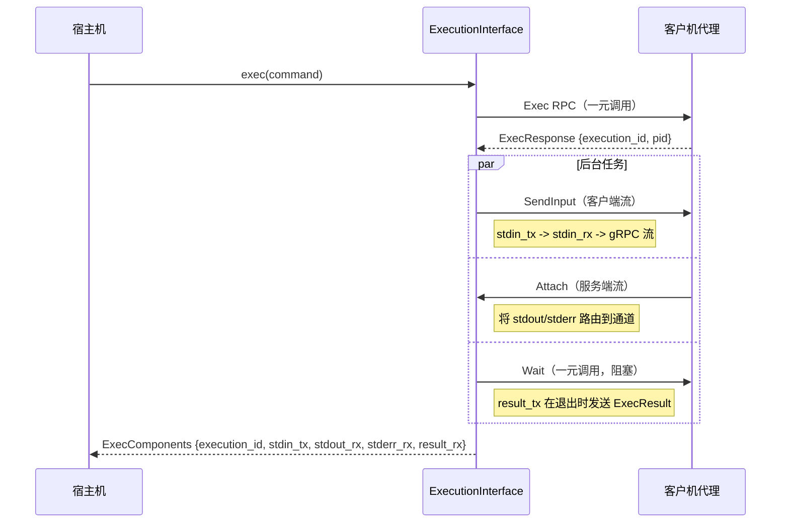
```mermaid
sequenceDiagram
    participant H as 宿主机
    participant EI as ExecutionInterface
    participant G as 客户机代理

    H->>EI: exec(command)
    EI->>G: Exec RPC（一元调用）
    G-->>EI: ExecResponse {execution_id, pid}

    par 后台任务
        EI->>G: SendInput（客户端流）
        Note right of EI: stdin_tx -> stdin_rx -> gRPC 流
    and
        G->>EI: Attach（服务端流）
        Note right of EI: 将 stdout/stderr 路由到通道
    and
        EI->>G: Wait（一元调用，阻塞）
        Note right of EI: result_tx 在退出时发送 ExecResult
    end

    EI-->>H: ExecComponents {execution_id, stdin_tx, stdout_rx, stderr_rx, result_rx}
```

所有三个任务都通过 `tokio::select!` 响应 `CancellationToken`，以实现干净的关闭。

## 共享文件系统布局

```
宿主机: ~/.boxlite/boxes/{box-id}/mounts/     客户机: /run/boxlite/shared/
  containers/                                  containers/
    {cid}/                                       {cid}/
      overlayfs/                                   overlayfs/
        diff/    (镜像层)                            diff/
        upper/   (可写层)                            upper/
        work/                                        work/
      rootfs/    (所有策略挂载于此)                    rootfs/
      volumes/                                      volumes/
        {vol-name}/                                  {vol-name}/
      layers/    (virtiofs 源)                       layers/
```

宿主机和客户机双方都使用 `shared/src/layout.rs` 中的 `SharedGuestLayout` 和 `SharedContainerLayout`，在不同的基础目录下计算出完全相同的相对路径。

## 静默/解冻快照协议

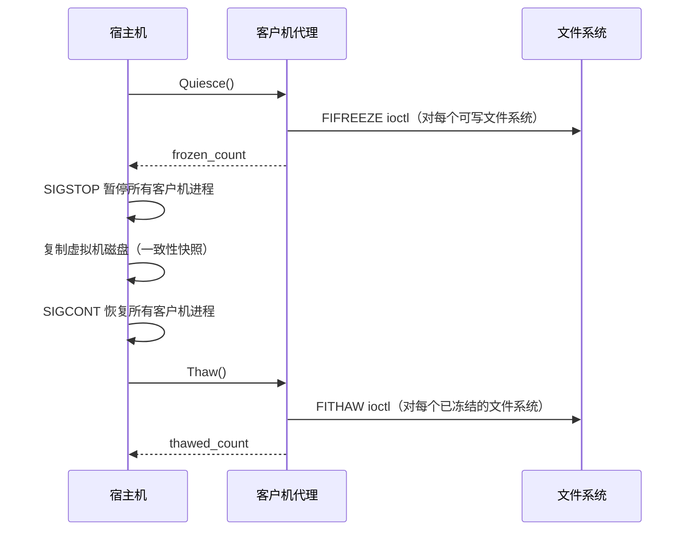
```mermaid
sequenceDiagram
    participant H as 宿主机
    participant G as 客户机代理
    participant FS as 文件系统

    H->>G: Quiesce()
    G->>FS: FIFREEZE ioctl（对每个可写文件系统）
    G-->>H: frozen_count

    H->>H: SIGSTOP 暂停所有客户机进程
    H->>H: 复制虚拟机磁盘（一致性快照）
    H->>H: SIGCONT 恢复所有客户机进程

    H->>G: Thaw()
    G->>FS: FITHAW ioctl（对每个已冻结的文件系统）
    G-->>H: thawed_count
```

---

# B 部分：详尽版

## 1. 协议层：四个 gRPC 服务

BoxLite 定义了四个 gRPC 服务，共同覆盖了宿主机与客户机之间的全部交互面。所有服务运行在客户机虚拟机内的单个 tonic gRPC 服务器上，共享同一个 `GuestServer` 状态。

### 1.1 Guest 服务

**用途：** 虚拟机级别的初始化和生命周期管理。

**RPC 方法：**

| RPC | 类型 | 请求 | 响应 | 行为 |
|-----|------|------|------|------|
| `Init` | 一元调用 | `GuestInitRequest` | `GuestInitResponse` | 挂载 virtiofs 共享和块设备，通过 rtnetlink 配置网络。只能调用一次。 |
| `Ping` | 一元调用 | `PingRequest` | `PingResponse` | 返回客户机代理版本，用作健康检查。 |
| `Shutdown` | 一元调用 | `ShutdownRequest` | `ShutdownResponse` | 优雅停止：终止执行（先 SIGTERM，再 SIGKILL），关闭容器，然后 `unsafe { libc::sync(); }` 刷新脏页以保证 COW（写时复制）磁盘的一致性。 |
| `Quiesce` | 一元调用 | `QuiesceRequest` | `QuiesceResponse` | 对所有可写的、非虚拟文件系统执行 FIFREEZE ioctl。返回 `frozen_count`。 |
| `Thaw` | 一元调用 | `ThawRequest` | `ThawResponse` | 对先前冻结的挂载点执行 FITHAW ioctl。返回 `thawed_count`。 |

**Init 初始化序列详情：**

1. 从请求中解析 `volumes` —— 每个卷要么是 `VirtiofsSource`（tag + mount_point + read_only），要么是 `BlockDeviceSource`（device + filesystem + need_format + need_resize）。
2. 调用 `crate::storage::mount_volumes()` 挂载所有卷。
3. 如果指定了 `network`，则调用 `crate::network::configure_network_from_config()` 通过 rtnetlink 设置 IP 地址和默认网关。网络配置失败不会导致致命错误 —— 虚拟机将在无网络状态下继续运行。
4. 设置 `init_state.initialized = true` 以控制 Container.Init 的调用门控。

**Shutdown 同步语义：**

```rust
// 在 guest.rs 的 shutdown 处理程序中：
unsafe { nix::libc::sync(); }
```

这个 `sync()` 调用至关重要。BoxLite 使用 COW（写时复制）磁盘。如果不刷新脏页，从同一磁盘镜像重启的虚拟机可能会出现文件系统状态不一致的问题。sync 确保在虚拟机被销毁之前，所有待写数据都已提交到虚拟块设备。

### 1.2 Container 服务

**用途：** OCI 容器生命周期 —— rootfs 准备和容器启动。

**单一 RPC 方法：** `Init`

| 字段 | 类型 | 描述 |
|------|------|------|
| `container_id` | string | 宿主机生成的容器标识符 |
| `container_config` | `ContainerConfig` | 入口点、环境变量、工作目录、用户（来自 OCI 镜像配置） |
| `rootfs` | `RootfsInit` | rootfs 初始化策略 |
| `mounts` | `[]BindMount` | 要绑定挂载到容器中的卷 |
| `ca_certs` | `[]CaCert` | 要安装到容器信任存储中的 PEM 证书 |

**rootfs 策略：**

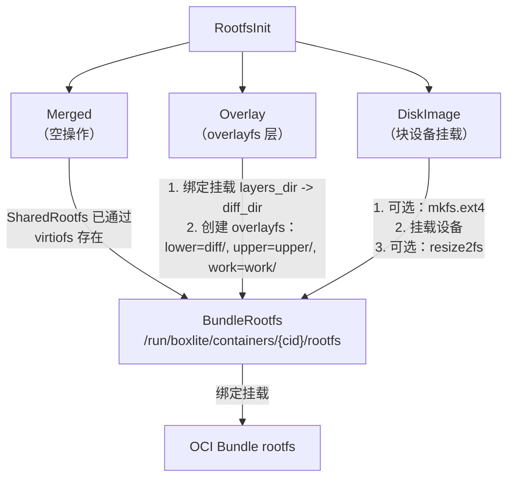
```mermaid
graph TD
    RI["RootfsInit"] --> M["Merged<br/>（空操作）"]
    RI --> O["Overlay<br/>（overlayfs 层）"]
    RI --> D["DiskImage<br/>（块设备挂载）"]

    M --> |"SharedRootfs 已通过<br/>virtiofs 存在"| BR["BundleRootfs<br/>/run/boxlite/containers/{cid}/rootfs"]
    O --> |"1. 绑定挂载 layers_dir -> diff_dir<br/>2. 创建 overlayfs：<br/>lower=diff/, upper=upper/, work=work/"| BR
    D --> |"1. 可选：mkfs.ext4<br/>2. 挂载设备<br/>3. 可选：resize2fs"| BR

    BR --> |"绑定挂载"| OCI["OCI Bundle rootfs"]
```

| 策略 | 使用场景 | 步骤 |
|------|----------|------|
| **Merged** | 通过 virtiofs 共享的预合并 rootfs | 空操作 —— 共享 rootfs 已存在于约定路径 |
| **Overlay** | 包含多层的镜像 | 将 `layers/` 绑定挂载到 `overlayfs/diff/`，创建包含 `upper/`（可写）和 `work/` 目录的 overlayfs，挂载到 `rootfs/` |
| **DiskImage** | 基于块设备的 rootfs | 将块设备挂载到 `rootfs/`，可选地进行格式化（mkfs）和调整大小（resize2fs） |

rootfs 准备完成后，容器通过 libcontainer 以基于管道的标准 I/O 方式启动。init 进程阻塞在 stdin 的 `read()` 上，使容器一直保持运行，直到显式关闭。

**启动后验证：** 服务在启动后立即检查 `container.is_running()`。如果 init 进程已退出，则调用 `container.diagnose_exit()` 收集 init 进程的 stdout/stderr 并返回详细错误信息。

**CA 证书安装：** 如果提供了 `ca_certs`，PEM 证书会被追加到容器 rootfs 内的 `/etc/ssl/certs/ca-certificates.crt`，以便 HTTPS 连接信任企业中间人代理。

### 1.3 Execution 服务

**用途：** 在客户机或容器内启动和管理进程，提供完整的流式 I/O。

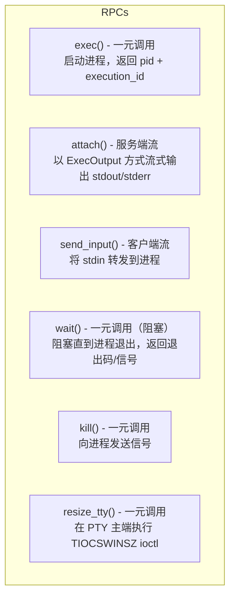
```mermaid
graph TB
    subgraph RPCs
        EXEC["exec() - 一元调用<br/>启动进程，返回 pid + execution_id"]
        ATT["attach() - 服务端流<br/>以 ExecOutput 方式流式输出 stdout/stderr"]
        SI["send_input() - 客户端流<br/>将 stdin 转发到进程"]
        WAIT["wait() - 一元调用（阻塞）<br/>阻塞直到进程退出，返回退出码/信号"]
        KILL["kill() - 一元调用<br/>向进程发送信号"]
        RTT["resize_tty() - 一元调用<br/>在 PTY 主端执行 TIOCSWINSZ ioctl"]
    end
```

**RPC 方法：**

| RPC | 类型 | 描述 |
|-----|------|------|
| `Exec` | 一元调用 | 启动进程。返回 `execution_id` 和 `pid`。 |
| `Attach` | 服务端流 | 流式发送 `ExecOutput` 消息，包含 `Stdout` 或 `Stderr` 事件载荷。 |
| `SendInput` | 客户端流 | 接收 `ExecStdin` 消息。首条消息必须携带 `execution_id`。最后一条消息设置 `close=true`。 |
| `Wait` | 一元调用（长轮询） | 阻塞直到进程退出。返回 `exit_code`、`signal`、`timed_out`、`error_message`。 |
| `Kill` | 一元调用 | 向进程发送 Unix 信号（如 SIGTERM、SIGKILL）。 |
| `ResizeTTY` | 一元调用 | 在 PTY（伪终端）主端文件描述符上执行 `TIOCSWINSZ` ioctl 以调整终端窗口大小。 |

**执行器选择：**

执行请求中的 `BOXLITE_EXECUTOR` 环境变量决定进程的启动方式：

| 值 | 执行器 | 行为 |
|----|--------|------|
| （空或 `"guest"`） | `GuestExecutor` | 通过 `std::process::Command` 直接启动。基于管道的标准 I/O 或 PTY 模式。 |
| `"container=<id>"` | `ContainerExecutor` | 通过 libcontainer zygote IPC 在 OCI 容器内启动。两阶段方式。 |

**容器执行器两阶段启动：**

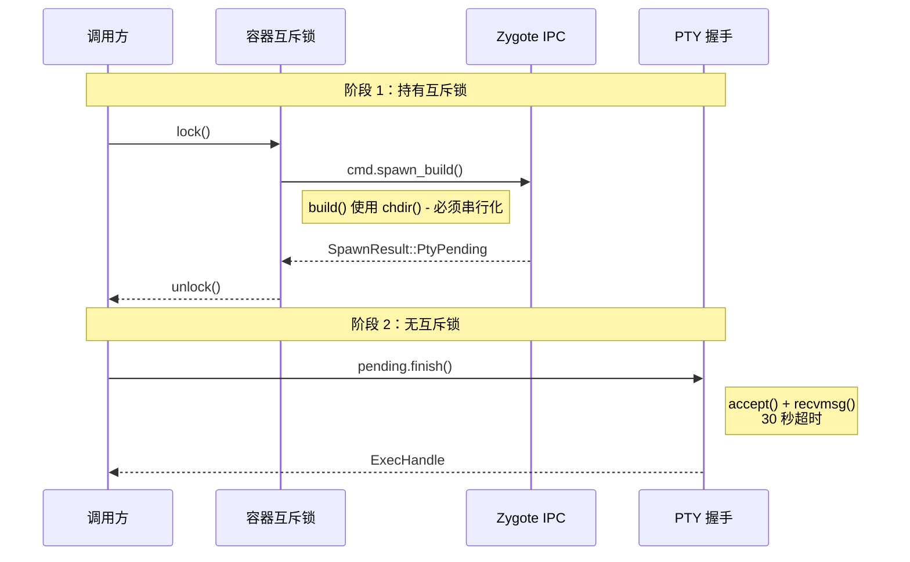
```mermaid
sequenceDiagram
    participant Caller as 调用方
    participant Mutex as 容器互斥锁
    participant Zygote as Zygote IPC
    participant PTY as PTY 握手

    Note over Caller,PTY: 阶段 1：持有互斥锁
    Caller->>Mutex: lock()
    Mutex->>Zygote: cmd.spawn_build()
    Note right of Mutex: build() 使用 chdir() - 必须串行化
    Zygote-->>Mutex: SpawnResult::PtyPending
    Mutex-->>Caller: unlock()

    Note over Caller,PTY: 阶段 2：无互斥锁
    Caller->>PTY: pending.finish()
    Note right of PTY: accept() + recvmsg()<br/>30 秒超时
    PTY-->>Caller: ExecHandle
```

阶段 1 持有容器互斥锁，因为 libcontainer 的 `build()` 调用了进程全局的 `chdir()`。并发构建会相互破坏工作目录，导致 `clone3`/`waitpid` 挂起。互斥锁在阶段 2（PTY 握手）之前释放，因此卡住的控制台套接字不会阻塞其他 exec 或关闭操作。

**客户机执行器模式：**

| 模式 | stdin | stdout | stderr | PTY 主端 |
|------|-------|--------|--------|----------|
| **管道（Pipe）** | 管道写端 | 管道读端 | 管道读端 | 无 |
| **PTY** | dup'd 主端 FD | dup'd 主端 FD | 无（合并到 stdout） | 保留用于 `TIOCSWINSZ` |

在 PTY 模式下，stderr 在终端层面合并到 stdout 中。PTY 主端只有一个读取器 —— 创建多个独立读取器会导致竞态条件，数据可能被错误的读取器捕获。

**容器死亡检测：**

当 exec 启动的进程收到 `SIGKILL` 时，Wait 处理程序会检查容器 init 进程是否已死亡。PID 命名空间（namespace）在 init 退出时会向所有进程发送 SIGKILL 进行清理。如果 `check_container_death()` 返回 `Some(diagnosis)`，错误消息中会包含 init 的 stdout/stderr，以帮助调试根本原因。

### 1.4 Files 服务

**用途：** 宿主机与客户机容器之间基于 tar 的文件传输。

**RPC 方法：**

| RPC | 类型 | 分块大小 | 限制 | 描述 |
|-----|------|----------|------|------|
| `Upload` | 客户端流 | 1 MiB | 512 MiB | 首个分块必须包含 `dest_path`。tar 字节在目标路径解压。 |
| `Download` | 服务端流 | 1 MiB | 无 | 服务端将源路径打包为 tar，流式发送分块。 |

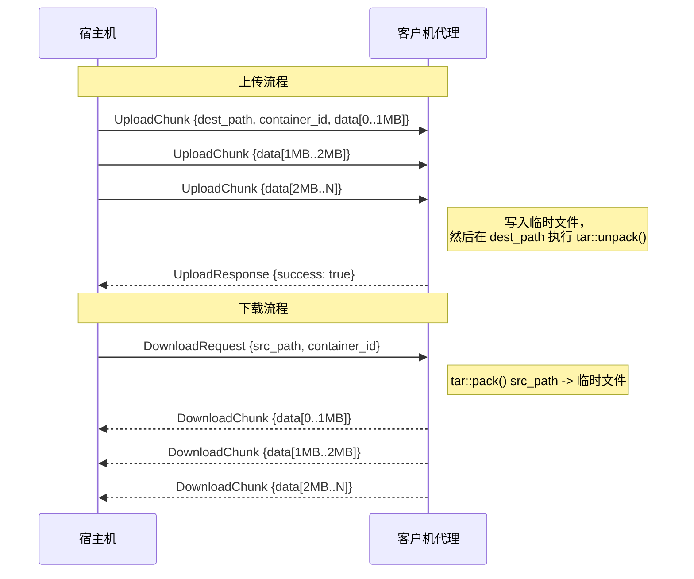
```mermaid
sequenceDiagram
    participant H as 宿主机
    participant G as 客户机代理

    Note over H,G: 上传流程
    H->>G: UploadChunk {dest_path, container_id, data[0..1MB]}
    H->>G: UploadChunk {data[1MB..2MB]}
    H->>G: UploadChunk {data[2MB..N]}
    Note right of G: 写入临时文件，<br/>然后在 dest_path 执行 tar::unpack()
    G-->>H: UploadResponse {success: true}

    Note over H,G: 下载流程
    H->>G: DownloadRequest {src_path, container_id}
    Note right of G: tar::pack() src_path -> 临时文件
    G-->>H: DownloadChunk {data[0..1MB]}
    G-->>H: DownloadChunk {data[1MB..2MB]}
    G-->>H: DownloadChunk {data[2MB..N]}
```

**安全性：** 路径验证会拒绝任何包含 `..` 组件的路径，以防止目录遍历攻击跳出容器 rootfs。

**容器解析：** 如果只有一个容器在运行，可以省略 `container_id`，系统会自动解析。当有多个容器运行时，`container_id` 为必填。

---

## 2. 传输层抽象

`Transport` 枚举（`src/shared/src/transport.rs`）抽象了三种连接机制：

```rust
pub enum Transport {
    Tcp { port: u16 },
    Unix { socket_path: PathBuf },
    Vsock { port: u32 },
}
```

每个变体都支持 URI 序列化（`tcp://127.0.0.1:8080`、`unix:///path/to/sock`、`vsock://2695`），从而能够通过命令行参数或配置进行传输方式选择。

**各平台的连接行为：**

| 传输方式 | Unix 宿主机 | Windows 宿主机 | 客户机 |
|----------|-------------|----------------|--------|
| `Unix` | `tokio::net::UnixStream` | `uds_windows::UnixStream` 包装为 `TcpStream` 以兼容 IOCP | `tokio::net::UnixListener` |
| `Tcp` | 标准 tonic channel | 标准 tonic channel | `tokio::net::TcpListener`（启用 `TCP_NODELAY`） |
| `Vsock` | 不直接使用（由 libkrun 桥接） | 不直接使用 | `tokio_vsock::VsockListener` |

**Windows Unix 套接字技巧：** 在 Windows 上，`uds_windows::UnixStream` 返回一个 AF_UNIX 套接字句柄。Windows IOCP 在句柄层面不区分 AF_UNIX 和 AF_INET，因此该句柄可以安全地被重新解释为 `TcpStream` 用于异步 I/O。VS Code Remote 和 Docker Desktop 也使用了相同的技术。

---

## 3. 宿主机侧实现

### 3.1 连接（`portal/connection.rs`）

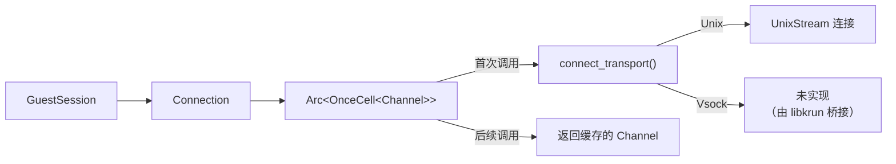
```mermaid
graph LR
    GS[GuestSession] --> CONN["Connection"]
    CONN --> OC["Arc&lt;OnceCell&lt;Channel&gt;&gt;"]
    OC --> |"首次调用"| INIT["connect_transport()"]
    OC --> |"后续调用"| CACHED["返回缓存的 Channel"]
    INIT --> |"Unix"| UDS["UnixStream 连接"]
    INIT --> |"Vsock"| ERR["未实现<br/>（由 libkrun 桥接）"]
```

`Connection` 结构体包装了一个 `Transport` 和一个 `Arc<OnceCell<Channel>>`。通道在首次使用时建立，避免了构造期间的异步运行时问题。首次连接之后，所有后续调用都返回缓存的通道克隆。

**连接超时：** 所有传输类型均为 30 秒。

### 3.2 GuestSession（`portal/session.rs`）

一个轻量级门面（facade），从共享通道创建服务接口实例：

```rust
pub struct GuestSession {
    connection: Connection,
}

impl GuestSession {
    pub async fn execution(&self) -> BoxliteResult<ExecutionInterface> { ... }
    pub async fn container(&self) -> BoxliteResult<ContainerInterface> { ... }
    pub async fn guest(&self) -> BoxliteResult<GuestInterface> { ... }
    pub async fn files(&self) -> BoxliteResult<FilesInterface> { ... }
}
```

`GuestSession` 是 `Send + Sync` 的（由编译时断言强制），允许它在任务和线程之间共享。

### 3.3 ExecutionInterface（`portal/interfaces/exec.rs`）

`exec()` 方法是宿主机侧最复杂的操作。它编排了以下流程：

1. **构建请求** —— 从 `BoxCommand`（程序、参数、环境变量、工作目录、tty 配置、用户）构建。
2. **发送 Exec RPC**（一元调用）—— 获取 `execution_id` 和 `pid`。
3. **启动 3 个后台任务** —— 所有任务均可通过 `CancellationToken` 取消。

**后台任务详情：**

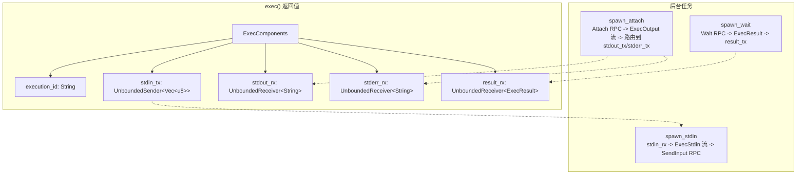
```mermaid
graph TB
    subgraph "exec() 返回值"
        EC["ExecComponents"]
        EC --> EID["execution_id: String"]
        EC --> STX["stdin_tx: UnboundedSender&lt;Vec&lt;u8&gt;&gt;"]
        EC --> SORX["stdout_rx: UnboundedReceiver&lt;String&gt;"]
        EC --> SERX["stderr_rx: UnboundedReceiver&lt;String&gt;"]
        EC --> RRX["result_rx: UnboundedReceiver&lt;ExecResult&gt;"]
    end

    subgraph "后台任务"
        T1["spawn_stdin<br/>stdin_rx -> ExecStdin 流 -> SendInput RPC"]
        T2["spawn_attach<br/>Attach RPC -> ExecOutput 流 -> 路由到 stdout_tx/stderr_tx"]
        T3["spawn_wait<br/>Wait RPC -> ExecResult -> result_tx"]
    end

    STX -.-> T1
    T2 -.-> SORX
    T2 -.-> SERX
    T3 -.-> RRX
```

**取消模式（所有三个任务中使用）：**

```rust
tokio::select! {
    biased;
    _ = shutdown_token.cancelled() => {
        // 干净退出
        return;
    }
    result = client.some_rpc(request) => result,
}
```

`biased` 关键字确保取消分支优先被检查，防止在高吞吐量时遗漏关闭信号。

**输出路由：** `route_output()` 函数检查 `ExecOutput.event`：
- `Event::Stdout(chunk)` —— 以 UTF-8 有损解码，发送到 `stdout_tx`
- `Event::Stderr(chunk)` —— 以 UTF-8 有损解码，发送到 `stderr_tx`

**Wait 响应映射：** `map_wait_response()` 函数将 gRPC `WaitResponse` 转换为 `ExecResult`。如果 `signal != 0`，退出码被设置为 `-signal`（负值），遵循 Unix 约定。

### 3.4 FilesInterface（`portal/interfaces/files.rs`）

**上传：** 将 tar 文件读取为 1 MiB 分块，仅在第一个分块中设置 `dest_path` 以减少负载大小，然后作为客户端流发送。

**下载：** 发送一元 `DownloadRequest`，接收 `DownloadChunk` 消息的服务端流，将每个分块写入本地临时文件。

---

## 4. 客户机侧实现

### 4.1 GuestServer（`guest/service/server.rs`）

四个服务的核心状态持有者：

```rust
pub(crate) struct GuestServer {
    pub layout: GuestLayout,
    pub init_state: Arc<Mutex<GuestInitState>>,
    pub containers: Arc<Mutex<HashMap<String, Arc<Mutex<Container>>>>>,
    pub registry: ExecutionRegistry,
    pub frozen_mounts: Mutex<Vec<PathBuf>>,
}
```

**服务器启动流程：**

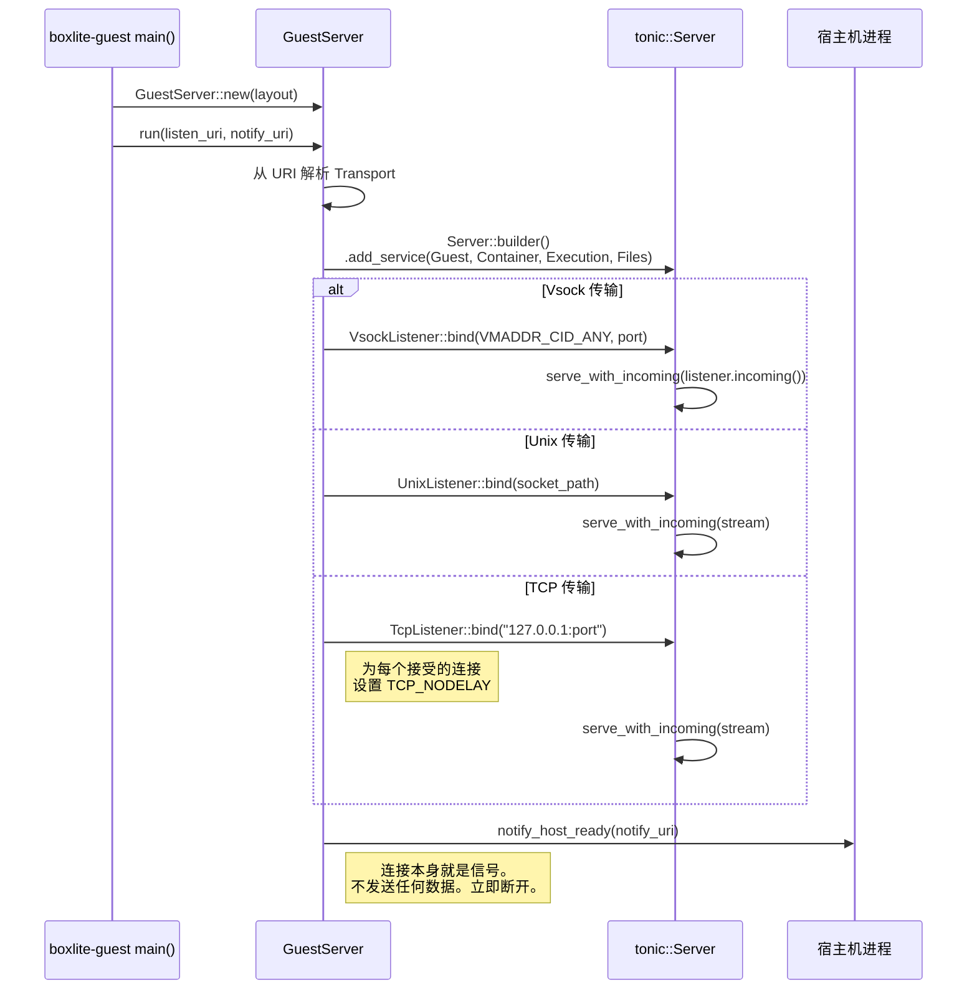
```mermaid
sequenceDiagram
    participant Main as boxlite-guest main()
    participant SRV as GuestServer
    participant Tonic as tonic::Server
    participant Host as 宿主机进程

    Main->>SRV: GuestServer::new(layout)
    Main->>SRV: run(listen_uri, notify_uri)
    SRV->>SRV: 从 URI 解析 Transport
    SRV->>Tonic: Server::builder()<br/>.add_service(Guest, Container, Execution, Files)

    alt Vsock 传输
        SRV->>Tonic: VsockListener::bind(VMADDR_CID_ANY, port)
        Tonic->>Tonic: serve_with_incoming(listener.incoming())
    else Unix 传输
        SRV->>Tonic: UnixListener::bind(socket_path)
        Tonic->>Tonic: serve_with_incoming(stream)
    else TCP 传输
        SRV->>Tonic: TcpListener::bind("127.0.0.1:port")
        Note right of SRV: 为每个接受的连接<br/>设置 TCP_NODELAY
        Tonic->>Tonic: serve_with_incoming(stream)
    end

    SRV->>Host: notify_host_ready(notify_uri)
    Note right of SRV: 连接本身就是信号。<br/>不发送任何数据。立即断开。
```

**就绪通知：** 绑定服务器套接字后，客户机启动一个任务连接到 `notify_uri`（通常是 `vsock://2696`）。连接本身就是就绪信号 —— 不交换任何数据。宿主机侧接受此连接后，即知道客户机代理已准备好接收 RPC。

### 4.2 ExecutionState（`guest/service/exec/state.rs`）

`ExecutionState` 管理单个已启动进程的生命周期：

| 方法 | 描述 |
|------|------|
| `send_input(first, stream)` | 从 `ExecHandle` 获取 stdin，启动转发任务 |
| `attach(exec_id)` | 从 `ExecHandle` 获取 stdout/stderr，启动转发任务，返回 `mpsc::Receiver<ExecOutput>` |
| `wait_process()` | 根据 `init_health` 的存在与否，路由到 `wait_direct()`（客户机执行器）或 `wait_via_zygote()`（容器执行器） |
| `kill(signal)` | 向进程 PID 发送 Unix 信号 |
| `resize_pty(rows, cols, ...)` | 在 PTY 主端 FD 上执行 TIOCSWINSZ ioctl |
| `check_container_death()` | 检查容器 init 是否已死亡（返回诊断字符串） |

**等待机制选择：**

| 执行器 | 等待方法 | 原因 |
|--------|----------|------|
| GuestExecutor | `waitpid(pid, None)`（阻塞） | 是客户机代理进程的直接子进程 |
| ContainerExecutor | `zygote.wait(pid)` 以 WNOHANG 方式每 10ms 轮询 | 进程是 zygote 的子进程（通过 `clone3` 创建）。不能使用阻塞的 waitpid，因为那样会在整个进程生命周期内持有 zygote 互斥锁。 |

### 4.3 ExecutionRegistry（`guest/service/exec/registry.rs`）

线程安全的 `HashMap<String, ExecutionState>`，封装在 `Arc<Mutex<>>` 中。提供：

- `register()` / `get()` / `exists()` 用于状态管理
- `shutdown_all()` 用于优雅关闭：先发 SIGTERM，带超时等待，然后对残留进程发 SIGKILL

---

## 5. Vsock 通信架构

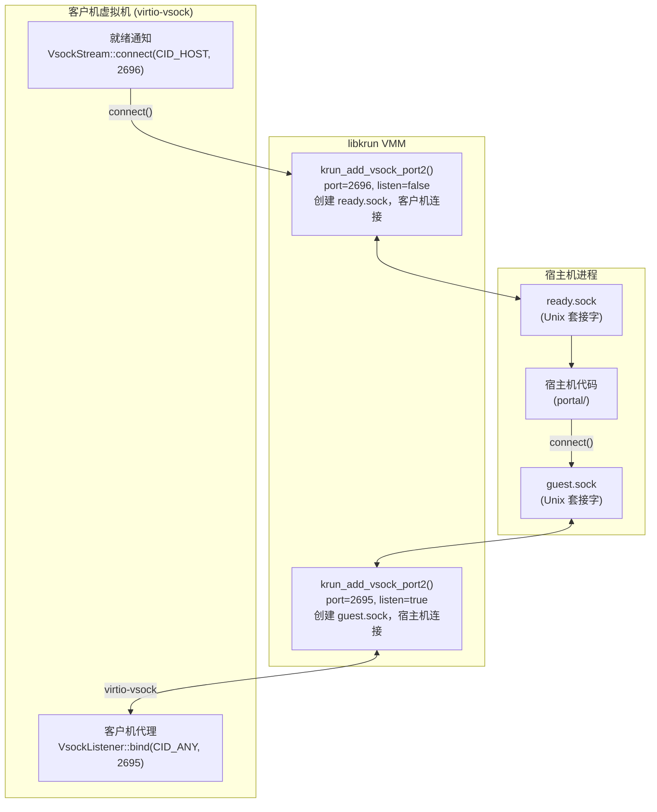
```mermaid
graph TB
    subgraph Host ["宿主机进程"]
        HC["宿主机代码<br/>(portal/)"]
        GS_SOCK["guest.sock<br/>(Unix 套接字)"]
        RN_SOCK["ready.sock<br/>(Unix 套接字)"]
    end

    subgraph libkrun ["libkrun VMM"]
        VP1["krun_add_vsock_port2()<br/>port=2695, listen=true<br/>创建 guest.sock，宿主机连接"]
        VP2["krun_add_vsock_port2()<br/>port=2696, listen=false<br/>创建 ready.sock，客户机连接"]
    end

    subgraph VM ["客户机虚拟机 (virtio-vsock)"]
        GA["客户机代理<br/>VsockListener::bind(CID_ANY, 2695)"]
        RN["就绪通知<br/>VsockStream::connect(CID_HOST, 2696)"]
    end

    HC -- "connect()" --> GS_SOCK
    GS_SOCK <--> VP1
    VP1 <-- "virtio-vsock" --> GA

    RN -- "connect()" --> VP2
    VP2 <--> RN_SOCK
    RN_SOCK --> HC
```

**端口分配：**

| 端口 | 常量 | 用途 | 方向 |
|------|------|------|------|
| 2695 | `GUEST_AGENT_PORT` | gRPC 服务端点 | 宿主机连接到客户机（libkrun 在宿主机套接字上监听） |
| 2696 | `GUEST_READY_PORT` | 就绪通知 | 客户机连接到宿主机（libkrun 在客户机侧监听） |

端口号来源于手机九宫格键盘助记符：2695 = "BOXL"，2696 = "BOXM"。

**`krun_add_vsock_port2()` 参数：**

```rust
// 端口 2695：libkrun 创建 Unix 套接字并监听。
// 宿主机连接到此套接字以访问客户机 gRPC。
ctx.add_vsock_port(2695, "/path/to/guest.sock", /* listen= */ true);

// 端口 2696：libkrun 创建 Unix 套接字。
// 客户机向外连接此端口；宿主机在该套接字上接受连接。
ctx.add_vsock_port(2696, "/path/to/ready.sock", /* listen= */ false);
```

---

## 6. 共享文件系统布局

宿主机和客户机双方使用 `shared/src/layout.rs` 中相同的 Rust 类型来计算完全一致的路径：

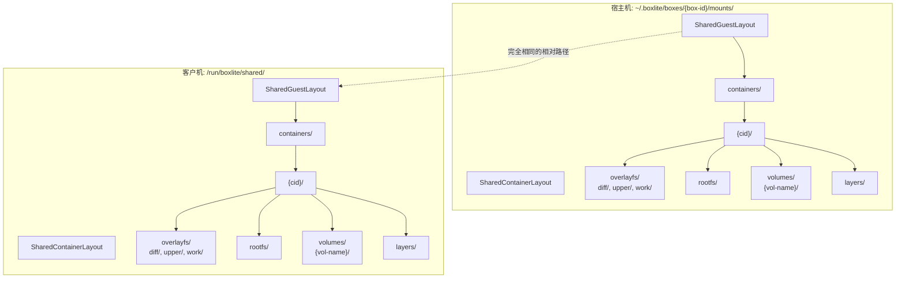
```mermaid
graph TB
    subgraph Host ["宿主机: ~/.boxlite/boxes/{box-id}/mounts/"]
        H_SGL["SharedGuestLayout"]
        H_SCL["SharedContainerLayout"]
        H_SGL --> H_CONT["containers/"]
        H_CONT --> H_CID["{cid}/"]
        H_CID --> H_OVL["overlayfs/<br/>diff/, upper/, work/"]
        H_CID --> H_RFS["rootfs/"]
        H_CID --> H_VOL["volumes/<br/>{vol-name}/"]
        H_CID --> H_LAY["layers/"]
    end

    subgraph Guest ["客户机: /run/boxlite/shared/"]
        G_SGL["SharedGuestLayout"]
        G_SCL["SharedContainerLayout"]
        G_SGL --> G_CONT["containers/"]
        G_CONT --> G_CID["{cid}/"]
        G_CID --> G_OVL["overlayfs/<br/>diff/, upper/, work/"]
        G_CID --> G_RFS["rootfs/"]
        G_CID --> G_VOL["volumes/<br/>{vol-name}/"]
        G_CID --> G_LAY["layers/"]
    end

    H_SGL -. "完全相同的相对路径" .-> G_SGL
```

**核心不变量：** 对于任意容器 ID 和路径组件，从基础目录开始的相对路径在宿主机和客户机上是完全相同的。这一点通过使用 proptest 的属性测试来强制保证：

```rust
// 来自 layout.rs 的测试：
let host_rel = host_rootfs.strip_prefix(host.base()).unwrap();
let guest_rel = guest_rootfs.strip_prefix(guest.base()).unwrap();
assert_eq!(host_rel, guest_rel);
```

**virtiofs 如何连接两端：** 宿主机将 `~/.boxlite/boxes/{box-id}/mounts/` 作为 virtiofs 共享暴露，标签为 `BoxLiteShared`。客户机将此标签挂载到 `/run/boxlite/shared/`。双方随后使用 `SharedGuestLayout` 来导航目录树。

---

## 7. 流式 I/O 架构

### 7.1 整体数据流

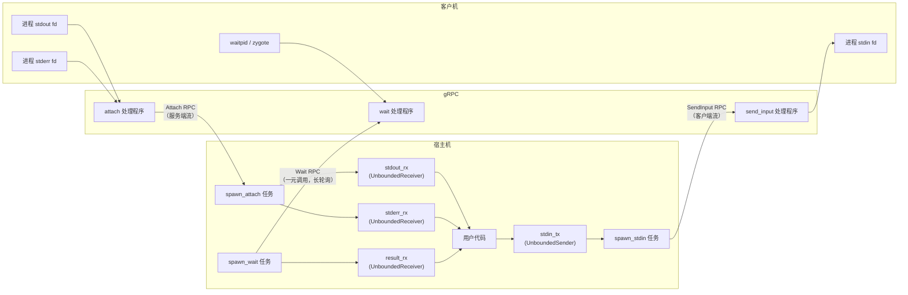
```mermaid
graph LR
    subgraph Host ["宿主机"]
        USER["用户代码"] --> STX["stdin_tx<br/>(UnboundedSender)"]
        SORX["stdout_rx<br/>(UnboundedReceiver)"] --> USER
        SERX["stderr_rx<br/>(UnboundedReceiver)"] --> USER
        RRX["result_rx<br/>(UnboundedReceiver)"] --> USER

        STX --> SP_STDIN["spawn_stdin 任务"]
        SP_ATT["spawn_attach 任务"] --> SORX
        SP_ATT --> SERX
        SP_WAIT["spawn_wait 任务"] --> RRX
    end

    subgraph gRPC
        SP_STDIN -- "SendInput RPC<br/>（客户端流）" --> G_STDIN
        G_ATT -- "Attach RPC<br/>（服务端流）" --> SP_ATT
        SP_WAIT -- "Wait RPC<br/>（一元调用，长轮询）" --> G_WAIT
    end

    subgraph Guest ["客户机"]
        G_STDIN["send_input 处理程序"] --> PROC_STDIN["进程 stdin fd"]
        PROC_STDOUT["进程 stdout fd"] --> G_ATT["attach 处理程序"]
        PROC_STDERR["进程 stderr fd"] --> G_ATT
        PROC_EXIT["waitpid / zygote"] --> G_WAIT["wait 处理程序"]
    end
```

### 7.2 stdin 转发详情

在宿主机侧，`spawn_stdin` 创建一个内部 `mpsc::channel(8)` 用于背压控制。一个嵌套的生产者任务从用户侧的 `stdin_rx` 读取数据，并将 `ExecStdin` 消息转发到有界通道中。外层任务将有界接收器包装为 `ReceiverStream` 并通过 `SendInput` RPC 发送。

在客户机侧，`send_input()` 从第一条消息中提取 `execution_id`，查找 `ExecutionState`，从 `ExecHandle` 中获取 stdin 文件描述符，并启动一个转发任务，将每条消息的 `data` 字节写入进程的 stdin。当 `close=true` 时，任务退出，stdin FD 被丢弃（关闭管道）。

### 7.3 stdout/stderr 转发详情

在客户机侧，`attach()` 从 `ExecHandle` 获取 stdout 和 stderr 流对象，并为每个流启动一个转发任务。每个任务读取数据块并将其包装为 `ExecOutput { event: Stdout(...) }` 或 `ExecOutput { event: Stderr(...) }`，通过 `mpsc::channel(100)` 发送。

在宿主机侧，`spawn_attach` 接收 `ExecOutput` 服务端流并路由每条消息：
- `Event::Stdout` —— 解码为字符串，发送到 `stdout_tx`
- `Event::Stderr` —— 解码为字符串，发送到 `stderr_tx`

---

## 8. 文件传输协议

### 8.1 上传协议

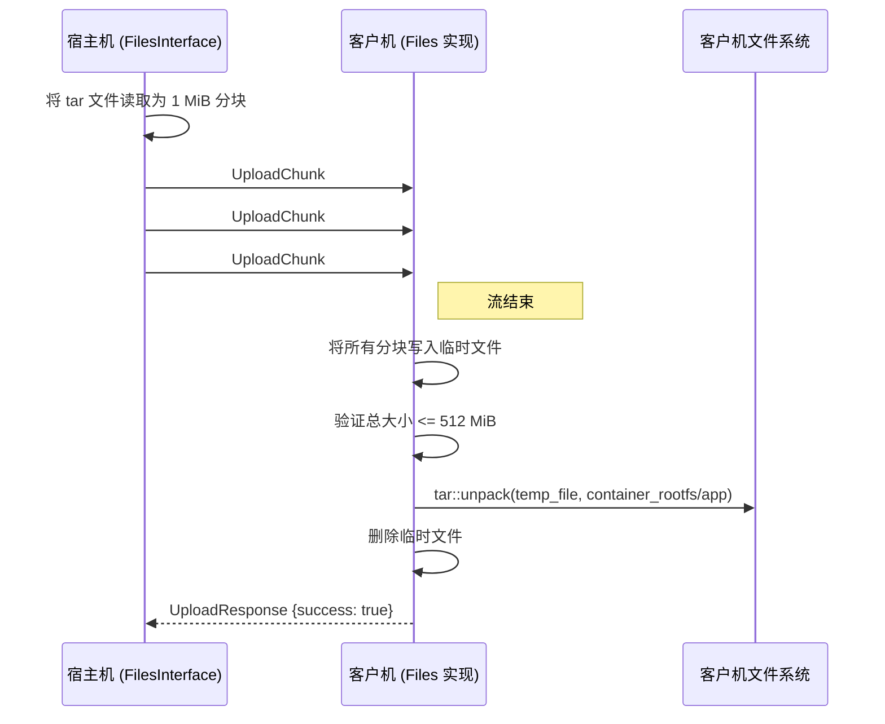
```mermaid
sequenceDiagram
    participant H as 宿主机 (FilesInterface)
    participant G as 客户机 (Files 实现)
    participant FS as 客户机文件系统

    H->>H: 将 tar 文件读取为 1 MiB 分块
    H->>G: UploadChunk #1 {dest_path: "/app", container_id: "main", data: [...], mkdir_parents: true}
    H->>G: UploadChunk #2 {dest_path: "", data: [...]}
    H->>G: UploadChunk #N {dest_path: "", data: [...]}
    Note right of G: 流结束

    G->>G: 将所有分块写入临时文件
    G->>G: 验证总大小 <= 512 MiB

    G->>FS: tar::unpack(temp_file, container_rootfs/app)
    G->>G: 删除临时文件

    G-->>H: UploadResponse {success: true}
```

**首个分块要求：** `dest_path` 是必需的且不能为空。如果只有一个容器在运行，`container_id` 可以省略。后续分块的 `dest_path` 可以为空（仅从首个分块读取）。

**安全上限：** 客户机强制执行 512 MiB（`MAX_UPLOAD_BYTES`）的限制。如果累计上传大小超过此值，RPC 返回 `RESOURCE_EXHAUSTED`。

**尾部斜杠约定：** 如果 `dest_path` 以 `/` 结尾，tar 以目录模式解压（`force_directory = true`）。

### 8.2 下载协议

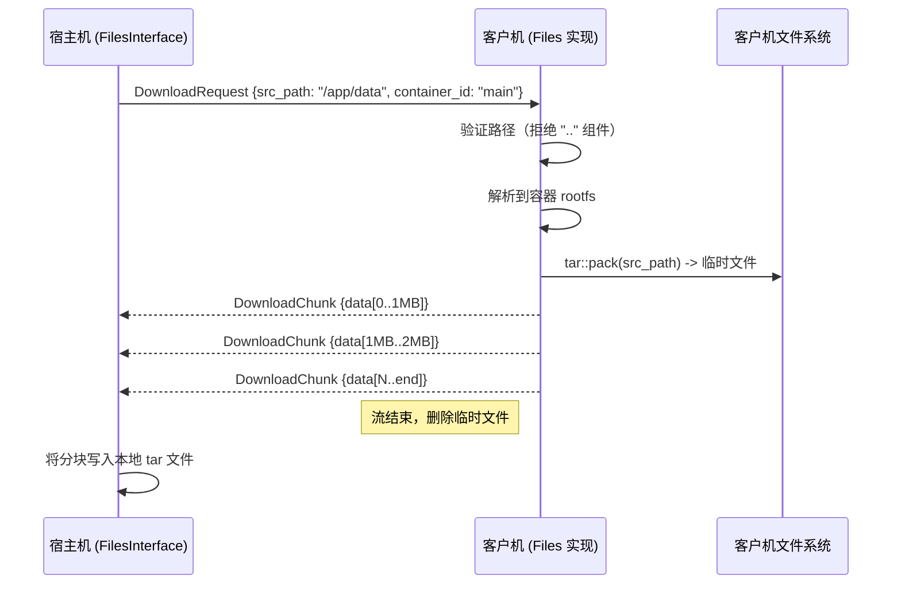
```mermaid
sequenceDiagram
    participant H as 宿主机 (FilesInterface)
    participant G as 客户机 (Files 实现)
    participant FS as 客户机文件系统

    H->>G: DownloadRequest {src_path: "/app/data", container_id: "main"}

    G->>G: 验证路径（拒绝 ".." 组件）
    G->>G: 解析到容器 rootfs
    G->>FS: tar::pack(src_path) -> 临时文件

    G-->>H: DownloadChunk {data[0..1MB]}
    G-->>H: DownloadChunk {data[1MB..2MB]}
    G-->>H: DownloadChunk {data[N..end]}
    Note left of G: 流结束，删除临时文件

    H->>H: 将分块写入本地 tar 文件
```

**路径验证：** 客户机拒绝任何包含 `..`（父目录）组件的 `src_path`。绝对路径会去除前导 `/`，然后拼接到容器 rootfs。

**选项：** `include_parent` 控制是否在 tar 归档中包含父目录名。`follow_symlinks` 控制打包过程中的符号链接（symlink）解析行为。

---

## 9. 静默/解冻：快照一致性协议

静默/解冻协议确保虚拟机快照的文件系统一致性。它对标了 QEMU guest-agent 的 `guest-fsfreeze-freeze` / `guest-fsfreeze-thaw` 协议。

### 9.1 完整快照工作流

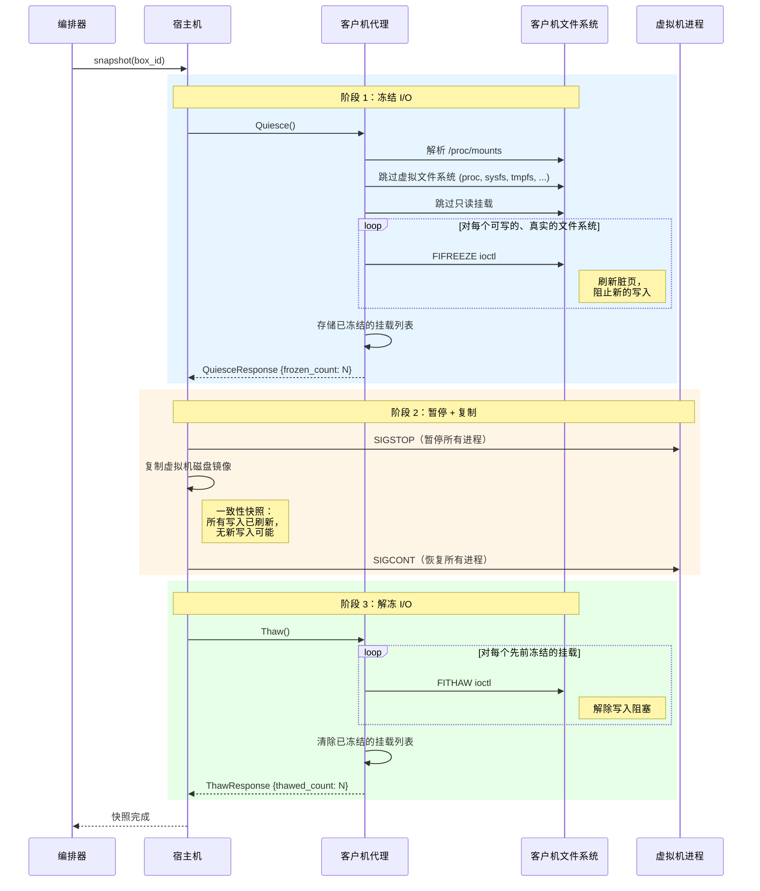
```mermaid
sequenceDiagram
    participant O as 编排器
    participant H as 宿主机
    participant G as 客户机代理
    participant FS as 客户机文件系统
    participant VM as 虚拟机进程

    O->>H: snapshot(box_id)

    rect rgb(230, 245, 255)
        Note over H,FS: 阶段 1：冻结 I/O
        H->>G: Quiesce()
        G->>FS: 解析 /proc/mounts
        G->>FS: 跳过虚拟文件系统 (proc, sysfs, tmpfs, ...)
        G->>FS: 跳过只读挂载
        loop 对每个可写的、真实的文件系统
            G->>FS: FIFREEZE ioctl
            Note right of FS: 刷新脏页，<br/>阻止新的写入
        end
        G->>G: 存储已冻结的挂载列表
        G-->>H: QuiesceResponse {frozen_count: N}
    end

    rect rgb(255, 245, 230)
        Note over H,VM: 阶段 2：暂停 + 复制
        H->>VM: SIGSTOP（暂停所有进程）
        H->>H: 复制虚拟机磁盘镜像
        Note right of H: 一致性快照：<br/>所有写入已刷新，<br/>无新写入可能
        H->>VM: SIGCONT（恢复所有进程）
    end

    rect rgb(230, 255, 230)
        Note over H,FS: 阶段 3：解冻 I/O
        H->>G: Thaw()
        loop 对每个先前冻结的挂载
            G->>FS: FITHAW ioctl
            Note right of FS: 解除写入阻塞
        end
        G->>G: 清除已冻结的挂载列表
        G-->>H: ThawResponse {thawed_count: N}
    end

    H-->>O: 快照完成
```

### 9.2 FIFREEZE/FITHAW 实现

`fsfreeze` 模块（`guest/src/storage/fsfreeze.rs`）实现了 ioctl 调用：

**文件系统过滤：** 虚拟/伪文件系统会被跳过（proc、sysfs、devtmpfs、devpts、tmpfs、cgroup、cgroup2、securityfs、debugfs、tracefs、configfs、fusectl、mqueue、hugetlbfs、pstore、binfmt_misc、autofs、rpc_pipefs、nfsd、overlay）。

**冻结时的错误处理：**
- `EBUSY` —— 文件系统已被冻结，视为成功
- `EOPNOTSUPP` —— 文件系统不支持冻结，静默跳过
- 其他错误 —— 记录为警告，文件系统不会添加到已冻结列表中

**ioctl 常量：**

```rust
const FIFREEZE: libc::c_ulong = 0xC004_5877;  // _IOWR('X', 119, int)
const FITHAW:   libc::c_ulong = 0xC004_5878;  // _IOWR('X', 120, int)
```

这些是 `linux/fs.h` 中定义的 `_IOWR`（读写双向）常量。使用原始值而非 nix 宏，是因为 `nix::ioctl_write_int!` 生成的是 `_IOW`（只写），会产生不正确的 ioctl 编号。

---

## 10. 初始化序列（端到端）

以下图表展示了从虚拟机启动到首次命令执行的完整宿主机-客户机通信流程：

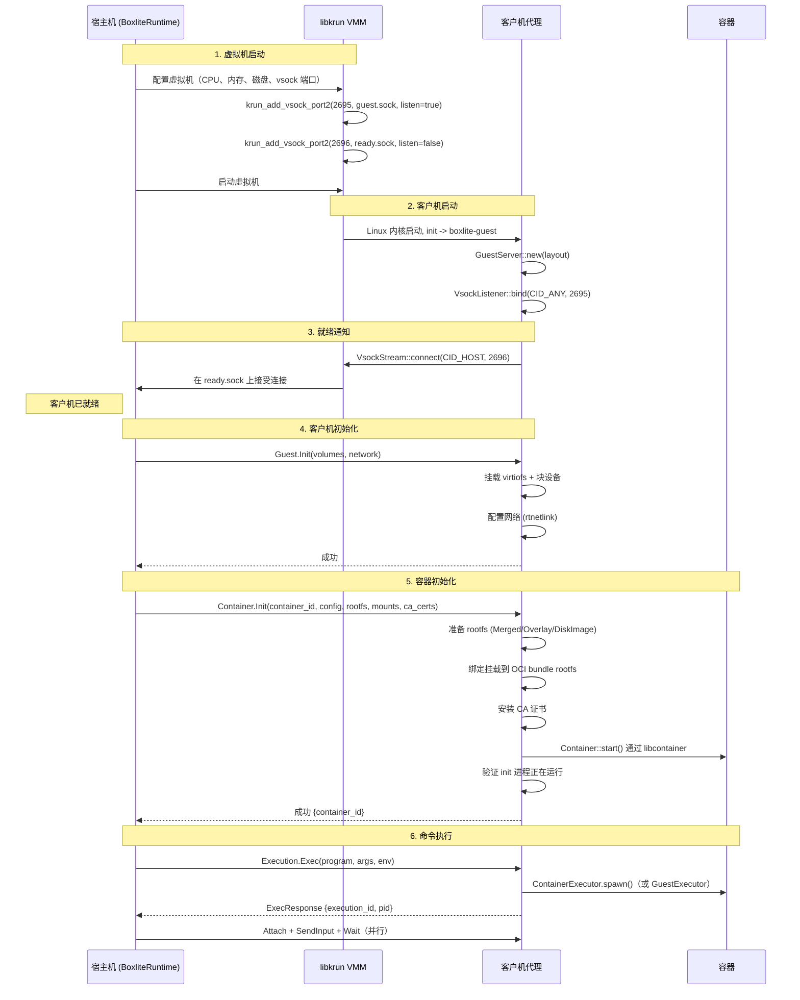
```mermaid
sequenceDiagram
    participant H as 宿主机 (BoxliteRuntime)
    participant K as libkrun VMM
    participant G as 客户机代理
    participant C as 容器

    Note over H,K: 1. 虚拟机启动
    H->>K: 配置虚拟机（CPU、内存、磁盘、vsock 端口）
    K->>K: krun_add_vsock_port2(2695, guest.sock, listen=true)
    K->>K: krun_add_vsock_port2(2696, ready.sock, listen=false)
    H->>K: 启动虚拟机

    Note over K,G: 2. 客户机启动
    K->>G: Linux 内核启动, init -> boxlite-guest
    G->>G: GuestServer::new(layout)
    G->>G: VsockListener::bind(CID_ANY, 2695)

    Note over G,H: 3. 就绪通知
    G->>K: VsockStream::connect(CID_HOST, 2696)
    K->>H: 在 ready.sock 上接受连接
    Note left of H: 客户机已就绪

    Note over H,G: 4. 客户机初始化
    H->>G: Guest.Init(volumes, network)
    G->>G: 挂载 virtiofs + 块设备
    G->>G: 配置网络 (rtnetlink)
    G-->>H: 成功

    Note over H,C: 5. 容器初始化
    H->>G: Container.Init(container_id, config, rootfs, mounts, ca_certs)
    G->>G: 准备 rootfs (Merged/Overlay/DiskImage)
    G->>G: 绑定挂载到 OCI bundle rootfs
    G->>G: 安装 CA 证书
    G->>C: Container::start() 通过 libcontainer
    G->>G: 验证 init 进程正在运行
    G-->>H: 成功 {container_id}

    Note over H,C: 6. 命令执行
    H->>G: Execution.Exec(program, args, env)
    G->>C: ContainerExecutor.spawn()（或 GuestExecutor）
    G-->>H: ExecResponse {execution_id, pid}
    H->>G: Attach + SendInput + Wait（并行）
```

---

## 11. 源文件参考

| 组件 | 文件 | 用途 |
|------|------|------|
| Transport 枚举 | `src/shared/src/transport.rs` | 基于 URI 的传输层抽象 |
| 文件系统布局 | `src/shared/src/layout.rs` | 宿主机和客户机的共享路径计算 |
| 常量 | `src/shared/src/constants.rs` | Vsock 端口、挂载标签、执行器环境变量 |
| 宿主机连接 | `src/boxlite/src/portal/connection.rs` | 延迟初始化的 `Arc<OnceCell<Channel>>` |
| 宿主机会话 | `src/boxlite/src/portal/session.rs` | 四个服务接口的门面 |
| 宿主机执行接口 | `src/boxlite/src/portal/interfaces/exec.rs` | 三任务 exec 编排 |
| 宿主机文件接口 | `src/boxlite/src/portal/interfaces/files.rs` | Tar 上传/下载 |
| 宿主机客户机接口 | `src/boxlite/src/portal/interfaces/guest.rs` | Init、ping、shutdown、quiesce、thaw |
| 宿主机容器接口 | `src/boxlite/src/portal/interfaces/container.rs` | 容器 rootfs + 生命周期 |
| 客户机服务器 | `src/guest/src/service/server.rs` | tonic 服务器、就绪通知 |
| 客户机服务实现 | `src/guest/src/service/guest.rs` | Init、ping、shutdown、quiesce、thaw 处理程序 |
| 容器服务实现 | `src/guest/src/service/container.rs` | Rootfs 策略、OCI 容器启动 |
| 执行服务实现 | `src/guest/src/service/exec/mod.rs` | Exec、attach、send_input、wait、kill、resize_tty |
| 执行器抽象 | `src/guest/src/service/exec/executor.rs` | GuestExecutor 和 ContainerExecutor |
| 执行状态 | `src/guest/src/service/exec/state.rs` | 单次执行的状态、I/O 转发、等待路由 |
| 执行注册表 | `src/guest/src/service/exec/registry.rs` | 活跃执行的 HashMap、优雅关闭 |
| 文件服务实现 | `src/guest/src/service/files.rs` | 带路径验证的 Tar 上传/下载 |
| 文件系统冻结 | `src/guest/src/storage/fsfreeze.rs` | FIFREEZE/FITHAW ioctl |
| Vsock 桥接配置 | `src/boxlite/src/vmm/krun/context.rs` | `krun_add_vsock_port2()` |
