# BoxLite 安全与隔离

> boxlite-shim 的纵深防御进程隔离机制，覆盖 Linux、macOS 和 Windows 平台。

本文档描述了 BoxLite 在 shim 进程生成前、生成中和生成后所应用的每一层安全措施。文档分为两个独立部分，您可以根据需要选择阅读深度。

**导航：**
- [Part A：精简版](#part-a精简版) -- 2-3 页的执行摘要
- [Part B：详尽版](#part-b详尽版) -- 完整的技术参考

---

# Part A：精简版

## A.1 纵深防御模型

BoxLite 从不依赖单一的隔离边界。三个同心环保护主机免受不受信任工作负载的影响，且每一层都由内核强制执行，而非由应用程序自身实现。

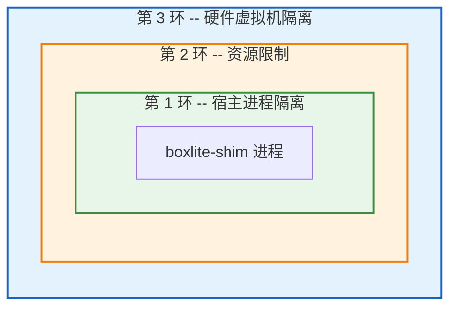

| 层级 | Linux | macOS | Windows |
|------|-------|-------|---------|
| 宿主进程隔离 | bwrap 命名空间 + Landlock ACL（访问控制列表） + seccomp BPF | Seatbelt (sandbox-exec SBPL) | Job Object（作业对象）+ UI 限制 |
| 资源限制 | cgroups v2 + rlimits | rlimits | Job Object 内存/进程限制 |
| 硬件虚拟机 | KVM (libkrun) | Hypervisor.framework (libkrun) | WHPX |

## A.2 平台安全栈概览

### Linux

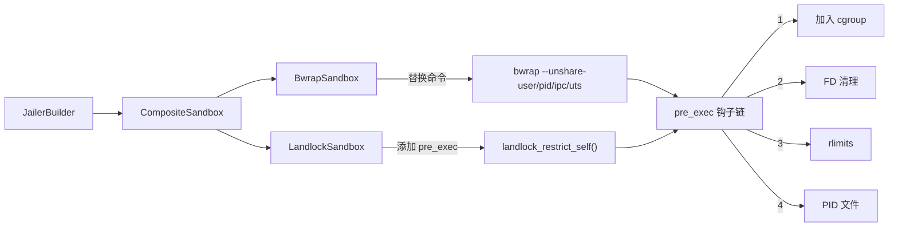

Bwrap 提供命名空间隔离（进程能**看到**什么），Landlock 添加基于 inode（索引节点）的 ACL（进程能**访问**什么），seccomp 限制系统调用（进程能**调用**什么）。cgroups v2 防止资源耗尽。

### macOS

Seatbelt 应用基于四个模块化文件构建的默认拒绝 SBPL 策略。动态路径规则根据 `PathAccess` 条目按每个 box 计算。仅在 `network_enabled=true` 时添加网络策略。

### Windows

在 `setup()` 期间创建带有 `KILL_ON_JOB_CLOSE` 标志的 Windows Job Object（作业对象），并在进程生成后通过 `post_spawn()` 将其分配给子进程。UI 限制阻止桌面操作。

## A.3 文件系统访问模型

BoxLite 从不对 box 目录授予全量访问权限。每个子目录只获得所需的最小权限。

| 路径 | 权限 | 用途 |
|------|------|------|
| `bin/` | 只读 | 复制的 shim 二进制文件 + libkrunfw |
| `shared/` | 读写 | 客户机可见的 virtio-fs 共享根目录 |
| `sockets/` | 读写 | libkrun vsock/unix 套接字 |
| `tmp/` | 读写 | shim 临时文件 |
| `logs/` | 读写 | shim 日志 + 虚拟机控制台输出 |
| `disks/` | 读写 | QCOW2 磁盘映像 |
| `mounts/` | **排除** | 宿主在生成前写入；shim 通过 `shared/` 读取 |
| `~/.boxlite/bases/` | 只读 | 快照/克隆的后备文件 |
| 用户卷 | 按 `VolumeSpec.read_only` 设定 | 绑定挂载到客户机 |

QCOW2 后备链遍历确保所有父映像（包括多级克隆链）都被授予只读访问权限。

## A.4 威胁覆盖矩阵

| 威胁 | Linux | macOS | Windows |
|------|-------|-------|---------|
| 进程逃逸 | bwrap 命名空间 | Seatbelt | Job Object |
| 文件系统访问 | bwrap + Landlock | Seatbelt SBPL ACL | Job Object（有限） |
| 系统调用滥用 | seccomp BPF | 不适用 | 不适用 |
| 资源耗尽 | cgroups v2 + rlimits | rlimits | Job Object 限制 |
| FD（文件描述符）信息泄露 | close_range() / 暴力遍历 | 暴力遍历 4096 个 FD | 不适用 |
| 权限提升 | PR_SET_NO_NEW_PRIVS | 不适用 | 不适用 |
| 网络数据泄露 | Landlock（拒绝所有 TCP/UDP） | Seatbelt（无网络规则） | 不适用 |
| 二进制文件替换 | shim 复制到 `bin/` | shim 复制到 `bin/` | shim 复制到 `bin/` |

## A.5 SecurityOptions 默认值

| 选项 | 默认值 | 说明 |
|------|--------|------|
| `jailer_enabled` | `true`（macOS），`false`（Linux/其他） | 沙箱封装 |
| `seccomp_enabled` | `false` | seccomp BPF（仅 Linux） |
| `close_fds` | `true` | 关闭继承的 FD 3+ |
| `sanitize_env` | `true` | 清除不受信任的环境变量 |
| `env_allowlist` | `RUST_LOG, PATH, HOME, USER, LANG, TERM` | 保留的环境变量 |
| `network_enabled` | `true` | gvproxy 虚拟机网络所需 |

提供三种预设：`development()`（全部关闭）、`standard()`（在支持的平台上启用 jailer + seccomp）和 `maximum()`（面向不受信任工作负载的完全锁定模式）。

---

# Part B：详尽版

## B.1 架构概述

### B.1.1 Trait（特征）层级结构

jailer 子系统采用两层抽象组织。公开的 `Jail` trait 是调用者唯一看到的接口。内部的 `Jailer<S>` 将工作委派给特定平台的 `Sandbox` 实现。

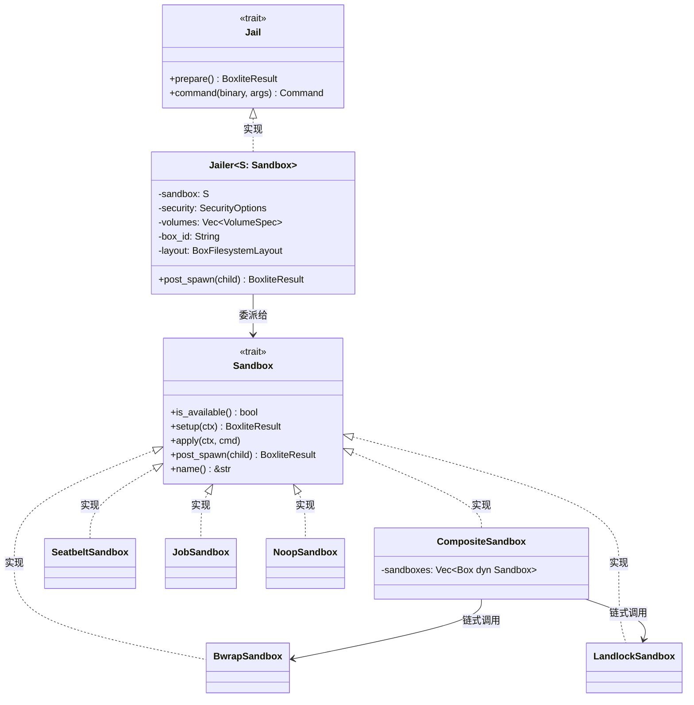

`PlatformSandbox` 类型别名在编译时解析：

| 平台 | `PlatformSandbox` 解析为 |
|------|--------------------------|
| Linux | `CompositeSandbox`（BwrapSandbox + LandlockSandbox） |
| macOS | `SeatbeltSandbox` |
| Windows | `JobSandbox` |
| 其他 | `NoopSandbox` |

### B.1.2 端到端生成流程

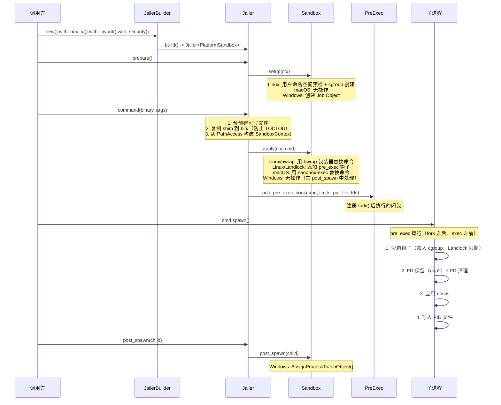

## B.2 Linux：命名空间隔离（bubblewrap）

### B.2.1 Bwrap 发现机制

BoxLite 按以下顺序在两个位置搜索 bubblewrap：

1. **系统 bwrap** -- 通过 `PATH` 查找。这允许用户使用其发行版自带的版本，该版本通常附带 AppArmor 配置文件以授予 `userns` 权限。
2. **内置 bwrap** -- 从内嵌的 `bubblewrap-sys` crate 构建。在未系统全局安装 bwrap 的 SDK 分发场景中用作备选。

路径仅解析一次，并缓存在 `OnceLock<Option<PathBuf>>` 中，在进程生命周期内有效。

### B.2.2 命名空间配置

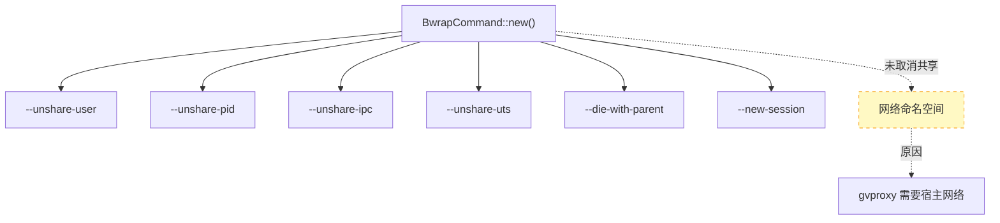

| 命名空间 | 标志 | 用途 |
|----------|------|------|
| User（用户） | `--unshare-user` | 非特权 UID/GID 映射（无需 root 即可执行 pivot_root） |
| PID（进程 ID） | `--unshare-pid` | 隔离的 PID 树；shim 在内部为 PID 1 |
| IPC（进程间通信） | `--unshare-ipc` | 隔离的 System V IPC 和 POSIX 消息队列 |
| UTS（Unix 分时系统） | `--unshare-uts` | 隔离的主机名和域名 |
| Mount（挂载） | （隐式） | 使用绑定挂载时自动取消共享 |
| Network（网络） | **未取消共享** | 与宿主共享，因为 gvproxy 需要宿主网络 |

### B.2.3 挂载表

Bwrap 构建一个最小挂载命名空间：

| 源路径 | 目标路径 | 模式 | 用途 |
|--------|----------|------|------|
| `/usr` | `/usr` | 只读绑定 | 系统二进制文件和库 |
| `/lib` | `/lib` | 只读绑定 | 共享库 |
| `/lib64` | `/lib64` | 只读绑定（如果存在） | 某些发行版上的 64 位库 |
| `/bin` | `/bin` | 只读绑定 | 基础二进制文件 |
| `/sbin` | `/sbin` | 只读绑定 | 系统管理二进制文件 |
| `/dev/kvm` | `/dev/kvm` | 设备绑定（如果存在） | 用于虚拟机执行的 KVM 设备 |
| `/dev/net/tun` | `/dev/net/tun` | 设备绑定（如果存在） | 用于网络的 TUN 设备 |
| （tmpfs） | `/tmp` | tmpfs | 隔离的临时空间 |
| （devtmpfs） | `/dev` | --dev | 标准设备节点 |
| （proc） | `/proc` | --proc | 进程信息 |
| PathAccess 可写路径 | 相同路径 | 绑定（读写） | 每个 box 的可写路径 |
| PathAccess 只读路径 | 相同路径 | 只读绑定 | 每个 box 的只读路径 |

### B.2.4 环境变量净化

在 `--clearenv` 之后，仅显式设置以下环境变量：

| 变量 | 值 | 用途 |
|------|-----|------|
| `PATH` | `/usr/bin:/bin:/usr/sbin:/sbin` | 最小系统路径 |
| `HOME` | `/root` | 沙箱已隔离 |
| `RUST_LOG` | （从父进程继承） | 调试（如已设置） |
| `RUST_BACKTRACE` | （从父进程继承） | 堆栈跟踪（如已设置） |

### B.2.5 权限与会话隔离

- **`--die-with-parent`**：如果宿主进程（BoxLite 运行时）终止，shim 将通过 `PR_SET_PDEATHSIG` 立即被杀死。防止出现孤儿虚拟机。
- **`--new-session`**：创建新的终端会话。防止沙箱内进程通过向父终端写入转义序列来实施终端注入攻击。
- **`PR_SET_NO_NEW_PRIVS`**：由 bwrap 设置（Landlock 和 seccomp 也独立设置）。一旦设置，该进程及其后代无法通过 `execve()` setuid/setgid 二进制文件获得新权限。

### B.2.6 用户命名空间预检

在生成进程之前，`can_create_user_namespace()` 执行两阶段检查：

1. **Chrome 风格的原始探测** -- 调用 `clone(CLONE_NEWUSER)` 以获取内核级错误码（`EPERM`、`EUSERS`、`EINVAL`、`ENOSPC`）。
2. **bwrap 探测** -- 运行 `bwrap --unshare-user --ro-bind / / -- true` 以测试 bwrap 是否能实际创建命名空间（处理 AppArmor 按二进制文件配置的情况，此时原始 clone 可能失败，但 bwrap 可以通过其自身的配置文件成功运行）。

如果探测失败，BoxLite 会生成有针对性的诊断消息，通过 sysctl 文件检测具体的限制原因，并提供正确的修复命令。

## B.3 Linux：Landlock LSM（Linux 安全模块）

### B.3.1 设计

Landlock 是一个 Linux 安全模块（内核 5.13+），提供基于 inode 的文件系统和网络访问控制。它通过在挂载命名空间内添加细粒度规则来补充 bwrap。

```
bwrap     -> 进程能看到什么（挂载命名空间可见性）
Landlock  -> 进程能访问什么（基于 inode 的 ACL 强制执行）
seccomp   -> 进程能调用什么系统调用（BPF 过滤器）
```

### B.3.2 双阶段应用

Landlock 使用父/子进程分离模式实现零间隙强制执行：

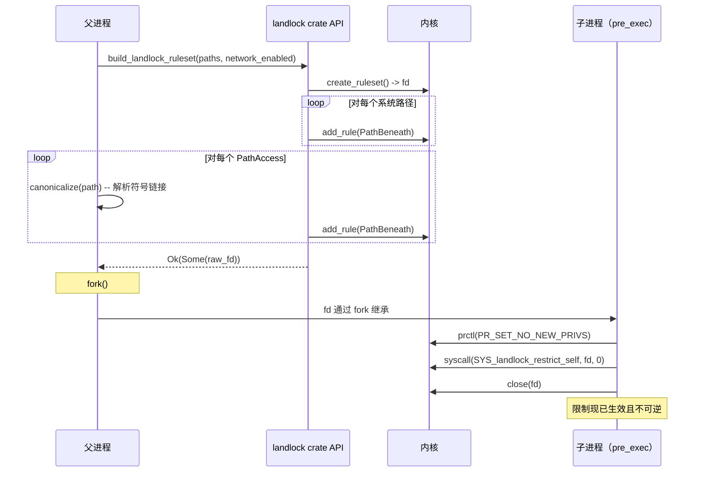

**关键细节**：父进程使用完整的 `landlock` crate API（可自由分配内存）构建规则集。子进程仅使用两个原始系统调用（`prctl` 和 `landlock_restrict_self`）来应用限制，这两个调用都是异步信号安全的。

### B.3.3 文件系统规则

| 类别 | 路径 | 访问权限 |
|------|------|----------|
| 系统只读 | `/usr`、`/lib`、`/lib64`、`/bin`、`/sbin`、`/etc`、`/proc`、`/dev` | `AccessFs::from_read(V5)` |
| 系统可写 | `/tmp` | `AccessFs::from_all(V5)` |
| Box 专属 | 根据 `PathAccess` 条目动态计算 | `from_all`（可写）或 `from_read`（只读） |

### B.3.4 网络隔离

- **`network_enabled=true`**：完全不处理 `AccessNet` -- 内核默认允许所有 TCP/UDP。
- **`network_enabled=false`**：处理 `AccessNet::from_all(V5)` 但**不添加任何规则** -- 内核拒绝所有 TCP/UDP 连接。

这种"零规则等于拒绝"的模式是 Landlock 的核心设计原则。

### B.3.5 优雅降级

- **内核 < 5.13（无 Landlock）**：`build_landlock_ruleset()` 返回 `Ok(None)`。调用方记录警告并在不使用 Landlock 的情况下继续运行。
- **内核 5.13-6.6（部分 Landlock 支持）**：`BestEffort` 兼容模式静默丢弃不支持的访问权限（例如 6.7 之前内核上的网络规则）。
- **内核 6.7+（完整 Landlock V4+ 支持）**：所有文件系统和网络规则均被强制执行。

### B.3.6 规范路径处理

Landlock 是基于 inode 的，而非基于路径的。添加规则前必须解析符号链接，否则规则将应用于符号链接的 inode 而非目标。对每个路径调用 `canonicalize()`，如果规范化失败（路径可能尚不存在），则回退到原始路径。

## B.4 Linux：seccomp BPF

### B.4.1 架构

seccomp 过滤器在构建时通过 `seccompiler` 从 JSON 定义预编译。这消除了运行时编译开销，并确保过滤器内容的确定性。

```
resources/seccomp/*.json  -->  build.rs (seccompiler)  -->  seccomp_filter.bpf
                                                              |
                                                              v
                                                     运行时 include_bytes!()
                                                              |
                                                              v
                                                     deserialize_binary() -> BpfThreadMap
```

### B.4.2 线程特定过滤器

| 角色 | 描述 | 应用方式 |
|------|------|----------|
| `vmm` | 核心 VMM + libkrun + Go 运行时（gvproxy）系统调用，约 106 个条目 | 使用 `SECCOMP_FILTER_FLAG_TSYNC` 应用到所有线程 |
| `vcpu` | 虚拟 CPU 线程过滤器 | 已编译，但 vCPU 线程通过 `clone()` 从主线程继承 |
| `api` | 为兼容性保留 | BoxLite 中未使用 |

### B.4.3 TSYNC（线程同步）

VMM 过滤器使用 `TSYNC` 应用，以确保**所有线程** -- 包括 gvproxy 网络组件生成的 Go 运行时线程 -- 共享相同的过滤器。应用后创建的新线程通过标准内核 `clone()` 行为自动继承该过滤器。

### B.4.4 默认动作

未授权的系统调用触发 `SECCOMP_RET_TRAP`，向调用线程发送 `SIGSYS` 信号。该信号默认是致命的，会立即终止进程。

### B.4.5 当前过滤器状态

当前的 VMM 过滤器故意设置得较为宽泛。为使 libkrun 正常工作，原始 Firecracker 过滤器中所有带参数限制的条目都被放宽为不受限制。原始过滤器以 `*.original.json` 形式保存在 `resources/seccomp/` 中。后续工作：分析 libkrun 的实际系统调用参数，恢复按参数的限制。

**允许的系统调用类别**：I/O、内存管理、网络、进程管理、时间、设备、存储（包括 `io_uring`）和加密。

## B.5 Linux：cgroup v2

### B.5.1 层级结构

```
/sys/fs/cgroup/                                    # root 模式
  boxlite/
    {box_id}/
      cpu.max          # "配额 周期"（例如 "100000 100000"）
      cpu.weight       # 相对 CPU 权重（1-10000）
      memory.max       # 硬性内存限制（字节）
      memory.high      # 节流阈值（最大值的 90%）
      pids.max         # 最大进程数
      cgroup.procs     # 写入 PID 以添加进程

/sys/fs/cgroup/user.slice/user-{uid}.slice/        # 非 root 模式
  user@{uid}.service/
    boxlite/
      {box_id}/
        ...相同的文件...
```

### B.5.2 非 root 支持

BoxLite 检测当前是否以 root 身份运行。如果不是，它会查找用户的 systemd 服务 cgroup 路径（`user.slice/user-{uid}.slice/user@{uid}.service/`）。如果找到，cgroup 将在该路径下创建。如果未找到，则回退到根 cgroup 路径（由于权限问题通常会失败）。

### B.5.3 资源限制

| 控制文件 | 来源 | 效果 |
|----------|------|------|
| `cpu.max` | `ResourceLimits.max_cpu_time` | 每周期的配额（微秒） |
| `cpu.weight` | （可配置） | 相对于其他 cgroup 的 CPU 时间 |
| `memory.max` | `ResourceLimits.max_memory` | 硬性内存上限（超过则 OOM 杀死） |
| `memory.high` | `max_memory` 的 90% | 节流阈值（回收压力） |
| `pids.max` | `ResourceLimits.max_processes` | 防止 fork 炸弹 |

### B.5.4 加入 cgroup

子进程通过 pre_exec 钩子加入 cgroup，该钩子使用仅异步信号安全的系统调用（`getpid`、`open`、`write`、`close`）将当前 PID 写入 `cgroup.procs`。路径在父进程中预计算为 `CString`，以避免在 fork-exec 窗口中进行内存分配。

## B.6 macOS：Seatbelt (sandbox-exec)

### B.6.1 策略架构

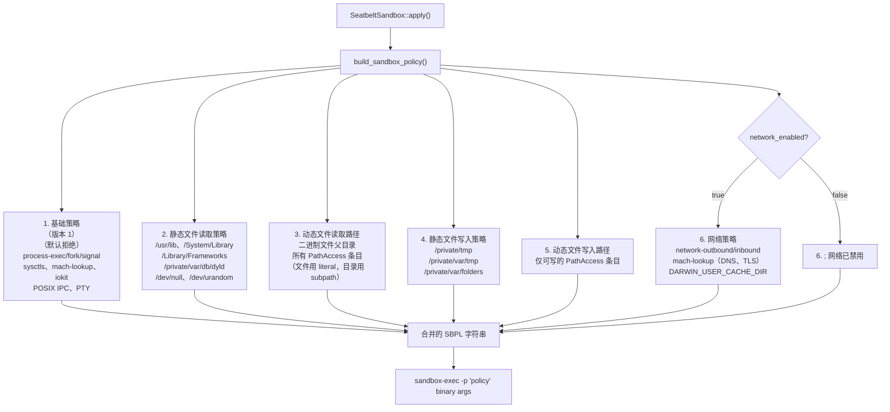

### B.6.2 基础策略详情

基础策略从 `(deny default)` 开始，并显式允许：

| 类别 | 规则 |
|------|------|
| 进程生命周期 | `process-exec`、`process-fork`、`signal (target same-sandbox)`、`process-info* (target same-sandbox)` |
| 设备 I/O | 对 `/dev/null` 的 `file-write-data`（仅字符设备） |
| 系统控制参数 | 50+ 个命名的 sysctl，涵盖 `hw.*`、`kern.*`、`vm.*`、`sysctl.*`、`net.routetable.*` |
| IOKit | `RootDomainUserClient`（电源管理查询） |
| Mach 服务 | `com.apple.system.opendirectoryd.libinfo`（用户/组查找）、`com.apple.PowerManagement.control`、`com.apple.logd`（日志）、`com.apple.system.notification_center` |
| IPC/PTY | `ipc-posix-sem`、`pseudo-tty`、`/dev/ptmx` 读写/ioctl、`/dev/ttys*`（带 pty 扩展） |

### B.6.3 动态路径规则

`seatbelt.rs` 将每个 `PathAccess` 条目转换为 SBPL 规则：

- **目录**同时获得 `(literal "path")`（用于对目录节点本身执行 `stat`）和 `(subpath "path")`（用于所有后代）。
- **文件**仅获得 `(literal "path")`。
- 所有路径都通过 `canonicalize()` 进行规范化以解析符号链接，因为 Seatbelt 基于解析后的路径工作。
- 不存在的路径被视为文件（最严格：仅 `literal`，不含 `subpath`）。

### B.6.4 网络策略

当 `network_enabled=true` 时，网络策略添加：

| 规则 | 用途 |
|------|------|
| `(allow network-outbound)` | 所有出站连接 |
| `(allow network-inbound)` | 所有入站连接 |
| `(allow system-socket)` | 系统套接字操作 |
| Mach 查找 | DNS（`com.apple.SystemConfiguration.DNSConfiguration`）、TLS（`com.apple.SecurityServer`、`com.apple.trustd.agent`）等 |
| `DARWIN_USER_CACHE_DIR` 写入 | TLS 会话和证书缓存 |

### B.6.5 加固的 sandbox-exec 路径

`sandbox-exec` 的路径硬编码为 `/usr/bin/sandbox-exec`，以防止 PATH 注入攻击。如果攻击者能替换为伪造的 `sandbox-exec` 二进制文件，沙箱将被击破。

## B.7 Windows：Job Objects（作业对象）

### B.7.1 Job Object 配置

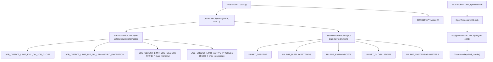

### B.7.2 关闭即终止语义

当 `JobSandbox` 被 drop（释放）时，Rust 的 `Drop` 实现调用 `CloseHandle(job_handle)`。由于设置了 `JOB_OBJECT_LIMIT_KILL_ON_JOB_CLOSE`，内核会终止分配给该 Job Object 的所有进程。这保证了在宿主端崩溃时不会存在孤儿 shim 进程。

### B.7.3 UI 限制

UI 限制防止通过 Windows 桌面操作实现沙箱逃逸：

| 标志 | 阻止的操作 |
|------|-----------|
| `UILIMIT_DESKTOP` | 切换或创建桌面 |
| `UILIMIT_DISPLAYSETTINGS` | 更改显示设置 |
| `UILIMIT_EXITWINDOWS` | 调用 `ExitWindowsEx()` |
| `UILIMIT_GLOBALATOMS` | 访问全局原子表 |
| `UILIMIT_SYSTEMPARAMETERS` | 调用 `SystemParametersInfo()` |

### B.7.4 生成后分配

与 Linux 和 macOS 在生成前或生成期间应用隔离不同，Windows Job Object 的分配发生在 `cmd.spawn()` **之后**。`post_spawn()` 方法以 `PROCESS_SET_QUOTA | PROCESS_TERMINATE` 访问权限打开子进程，并通过 `AssignProcessToJobObject()` 将其分配给 Job Object。

## B.8 通用隔离机制

### B.8.1 Pre-exec 钩子链

在 Unix 平台上，`fork()` 之后但 `exec()` 之前，一系列钩子在子进程中运行。执行顺序至关重要，且所有操作必须是异步信号安全的。

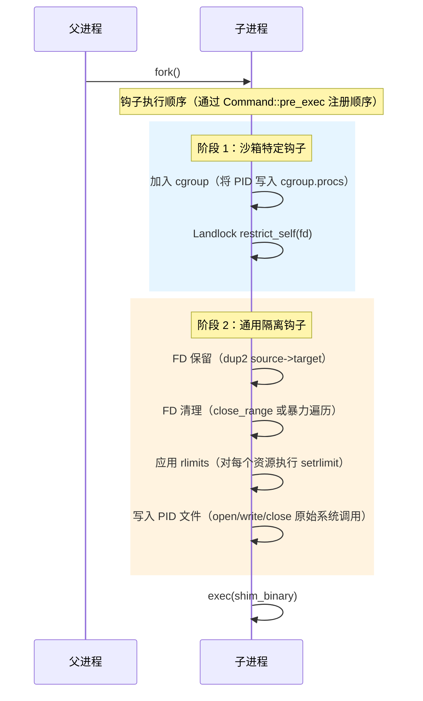

**异步信号安全约束**：在 `fork()` 和 `exec()` 之间，子进程处于受限状态。不允许堆分配（`Box`、`Vec`、`String`），不允许互斥锁操作，不允许日志记录（`tracing`、`println`），也不允许大多数 Rust 标准库函数。仅允许原始系统调用。

### B.8.2 FD 清理

文件描述符清理防止通过继承的文件描述符（可能包含凭据、数据库连接或套接字）泄露信息。

| 平台 | 方法 | 详情 |
|------|------|------|
| Linux (5.9+) | `close_range(first_fd, UINT_MAX, 0)` | 单个系统调用，O(1) 内核清理 |
| Linux (< 5.9) | 暴力 `close()` 循环 | FD 3 到 1023 |
| macOS | 暴力 `close()` 循环 | FD 3 到 4095 |

通过 `dup2(source, target)` 进行 FD 保留，允许特定文件描述符（例如看门狗管道）在清理过程中存活。dup2 之后，所有高于最高目标的 FD 都被关闭。

### B.8.3 资源限制（rlimits）

通过 pre_exec 钩子中的 `setrlimit()` 应用：

| 资源 | 限制常量 | 来源 |
|------|----------|------|
| 最大打开文件数 | `RLIMIT_NOFILE` | `ResourceLimits.max_open_files` |
| 最大文件大小 | `RLIMIT_FSIZE` | `ResourceLimits.max_file_size` |
| 最大进程数 | `RLIMIT_NPROC` | `ResourceLimits.max_processes` |
| 最大地址空间 | `RLIMIT_AS` | `ResourceLimits.max_memory` |
| 最大 CPU 时间 | `RLIMIT_CPU` | `ResourceLimits.max_cpu_time` |

软限制和硬限制设置为相同值。macOS 上 `RLIMIT_NPROC` 的错误会被忽略，因为进程限制在该平台上的工作方式不同。

### B.8.4 PID 文件写入

PID 文件在 pre_exec 钩子中使用原始 `open()`、`write()`、`close()` 系统调用写入。PID 被格式化到 16 字节的栈缓冲区中，不进行任何堆分配。此文件作为 shim 进程 PID 的单一事实来源，支持崩溃恢复和进程跟踪。

### B.8.5 Shim 二进制文件复制

BoxLite 在生成前将 shim 二进制文件复制（而非硬链接）到 `{box_dir}/bin/`。这遵循了 Firecracker 的安全隔离模式，提供两个好处：

1. **TOCTOU（检查时间/使用时间）防护**：如果攻击者在安全检查和 `exec()` 调用之间替换了原始二进制文件，运行的将是已复制的（经过验证的）二进制文件。
2. **内存隔离**：硬链接的二进制文件共享相同的 inode 和内存中的 `.text` 段。一个 box 中的漏洞可能利用共享的代码页。

在 Unix 上，`libkrunfw` 也会被复制，因为 libkrun 在运行时通过 `dlopen()` 加载它，而 shim 的 rpath 解析到 `bin/` 目录。在 macOS 上，通过 `sandbox-exec` 时 SIP 会剥离 `DYLD_*` 环境变量，因此库必须放在同一位置。

使用"仅在更新时复制"的语义，避免后续启动时不必要的 I/O。

## B.9 文件系统隔离：细粒度路径访问

### B.9.1 路径访问模型

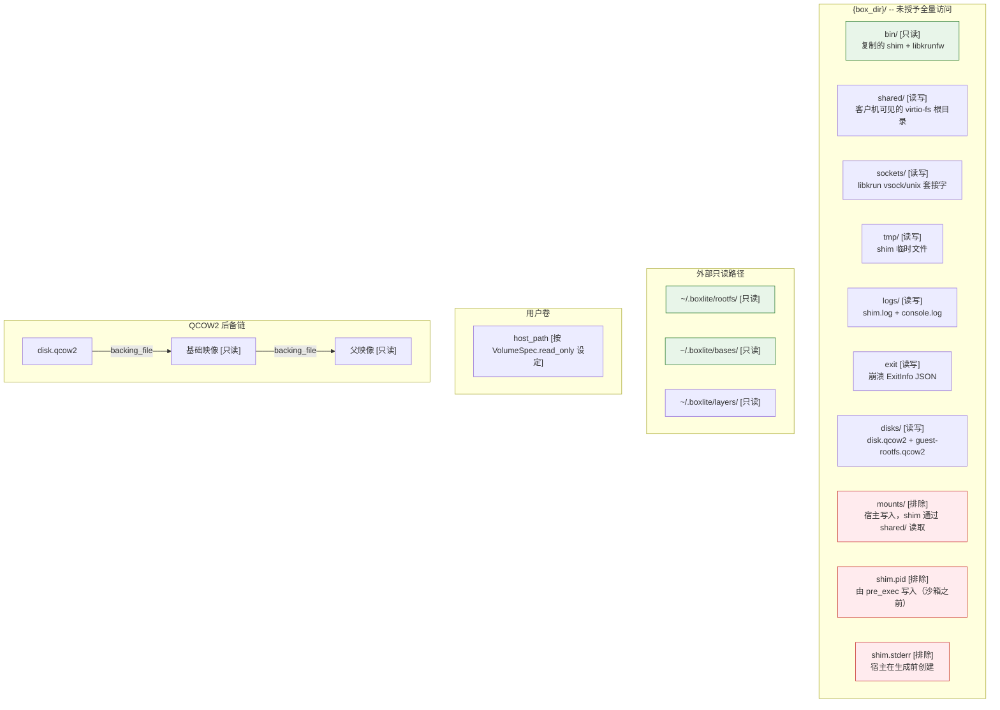

### B.9.2 QCOW2 后备链遍历

QCOW2 叠加映像引用的后备文件可能位于 box 目录之外（例如 `~/.boxlite/images/disk-images/`）。克隆的 box 会创建多级后备链（克隆 -> 源 -> 基础映像）。`build_path_access()` 通过 `read_backing_chain()` 遍历完整的链，并对每个后备文件**及其父目录**授予只读访问权限。

如果没有此遍历，libkrun 在默认拒绝沙箱下尝试打开后备文件时会因 `EINVAL` 而失败。

### B.9.3 为何排除 `mounts/`

`mounts/` 目录是宿主在生成 shim 之前写入文件的位置。shim 通过 `shared/` 目录（提供客户机可见的 virtio-fs 根目录）访问这些文件。将 `mounts/` 纳入沙箱路径访问范围会扩大攻击面而无任何收益，因为 shim 从不直接写入 `mounts/`。

## B.10 组合沙箱模式

### B.10.1 Linux 组合

在 Linux 上，`PlatformSandbox` 是 `CompositeSandbox`，它将 `BwrapSandbox` 和 `LandlockSandbox` 链接在一起：

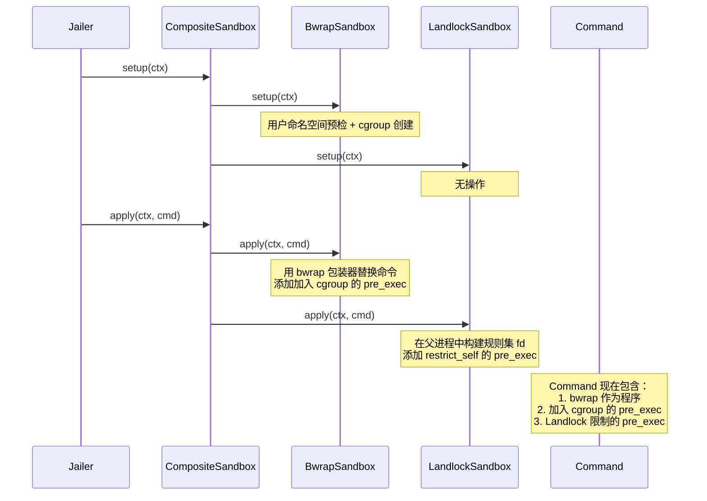

每个子沙箱的 `apply()` 按注册顺序在同一个 `Command` 上调用。`BwrapSandbox` 用 bwrap 替换命令二进制文件；`LandlockSandbox` 添加 `pre_exec` 钩子。多个 `pre_exec` 钩子是安全的，因为 `Command` 将它们存储在 `Vec` 中并按注册顺序执行。

### B.10.2 可用性逻辑

`CompositeSandbox::is_available()` 仅委派给**第一个**子沙箱。在 Linux 上，这意味着 bwrap 必须可用；Landlock 在不支持的内核上优雅降级。

## B.11 Jailer Trait 和 Builder

### B.11.1 `Jail` Trait

```rust
pub trait Jail: Send + Sync {
    /// 生成前的准备工作（用户命名空间预检、cgroup 创建、Job Object 创建）。
    fn prepare(&self) -> BoxliteResult<()>;

    /// 构建一个受限的、准备好生成的命令。
    fn command(&self, binary: &Path, args: &[String]) -> Command;
}
```

这是调用者唯一看到的接口。该 trait 是 `Send + Sync` 的，因此可以在异步任务之间共享。

### B.11.2 JailerBuilder

builder 模式根据 `SecurityOptions` 和目标平台构建适当的 `Jailer<PlatformSandbox>`：

```rust
let jail = JailerBuilder::new()
    .with_box_id("my-box")
    .with_layout(layout)
    .with_security(SecurityOptions::standard())
    .with_volumes(volumes)
    .build()?;

jail.prepare()?;
let cmd = jail.command(&binary, &args);
let child = cmd.spawn()?;
jail.post_spawn(&child)?;
```

## B.12 SecurityOptions 参考

### B.12.1 字段参考

| 字段 | 类型 | 默认值 | 描述 |
|------|------|--------|------|
| `jailer_enabled` | `bool` | `true`（macOS），`false`（其他） | 启用沙箱封装 |
| `seccomp_enabled` | `bool` | `false` | 启用 seccomp BPF（仅 Linux） |
| `uid` | `Option<u32>` | `None` | 设置后降权到的 UID |
| `gid` | `Option<u32>` | `None` | 设置后降权到的 GID |
| `new_pid_ns` | `bool` | `false` | 创建新的 PID 命名空间 |
| `new_net_ns` | `bool` | `false` | 创建新的网络命名空间 |
| `chroot_enabled` | `bool` | `true`（Linux） | 启用 chroot 隔离 |
| `close_fds` | `bool` | `true` | 关闭继承的 FD 3+ |
| `sanitize_env` | `bool` | `true` | 清除不受信任的环境变量 |
| `env_allowlist` | `Vec<String>` | `[RUST_LOG, PATH, HOME, USER, LANG, TERM]` | 保留的环境变量 |
| `resource_limits` | `ResourceLimits` | （全部为 `None`） | CPU、内存、进程、文件限制 |
| `sandbox_profile` | `Option<String>` | `None` | 自定义 SBPL 配置文件路径（macOS） |
| `network_enabled` | `bool` | `true` | 在沙箱中允许网络 |

### B.12.2 预设

| 预设 | `jailer_enabled` | `seccomp_enabled` | `close_fds` | `sanitize_env` | 使用场景 |
|------|-----------------|-------------------|-------------|----------------|----------|
| `default()` | 仅 macOS | `false` | `true` | `true` | 通用场景 |
| `development()` | `false` | `false` | `false` | `false` | 调试 |
| `standard()` | Linux + macOS | 仅 Linux | `true` | `true` | 生产环境 |
| `maximum()` | `true` | 仅 Linux | `true` | `true` | 不受信任的工作负载（AI 沙箱、多租户） |

`maximum()` 预设还将 `uid/gid` 设置为 `65534`（nobody/nogroup），将 `new_pid_ns` 设置为 `true`，并应用资源限制（最多 1024 个打开文件、最大 1GB 文件大小等）。

## B.13 威胁覆盖对比

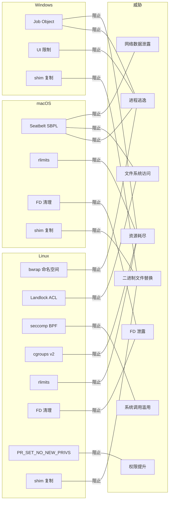

### 详细覆盖表

| 威胁 | Linux 缓解措施 | macOS 缓解措施 | Windows 缓解措施 |
|------|---------------|---------------|-----------------|
| **进程逃逸** | bwrap user/PID/IPC/UTS 命名空间、pivot_root | Seatbelt `(deny default)` 加显式进程允许列表 | Job Object `KILL_ON_JOB_CLOSE` |
| **文件系统访问** | bwrap 绑定挂载允许列表 + Landlock inode ACL | Seatbelt file-read*/file-write* 加 literal/subpath 规则 | Job Object（有限；无文件系统 ACL） |
| **系统调用滥用** | seccomp BPF 约 106 个系统调用允许列表，默认 TRAP | 不适用（Seatbelt 不过滤系统调用） | 不适用 |
| **资源耗尽** | cgroups v2（cpu.max、memory.max、pids.max）+ rlimits | rlimits（NOFILE、FSIZE、NPROC、AS、CPU） | Job Object（JOB_MEMORY、ACTIVE_PROCESS） |
| **FD 信息泄露** | `close_range()`（5.9+）或暴力关闭 3-1023 | 暴力关闭 FD 3-4095 | 不适用（无 FD 继承模型） |
| **权限提升** | `PR_SET_NO_NEW_PRIVS`（通过 bwrap、Landlock、seccomp） | 不适用（macOS 不使用 setuid 模型） | 不适用 |
| **网络数据泄露** | Landlock `AccessNet` 全部拒绝（无规则 = 拒绝所有 TCP/UDP） | Seatbelt：禁用时无 `network-outbound` 规则 | 不适用（无网络过滤） |
| **二进制文件替换** | 复制 shim + libkrunfw 到 `{box_dir}/bin/` | 复制 shim + libkrunfw 到 `{box_dir}/bin/` | 复制 shim 到 `{box_dir}/bin/` |

## B.14 调试沙箱违规

### macOS

查看最近 5 分钟的 Seatbelt 拒绝记录：

```bash
log show --predicate 'subsystem == "com.apple.sandbox"' --last 5m
```

导出生成的 SBPL 策略以供检查：

```bash
BOXLITE_DEBUG_PRINT_SEATBELT=1 python your_script.py
# 或保存到文件：
BOXLITE_DEBUG_POLICY_FILE=/tmp/boxlite-policy.sbpl python your_script.py
```

### Linux

检查 bwrap 用户命名空间能力：

```bash
# 快速探测
bwrap --unshare-user --ro-bind / / -- true

# 检查 sysctl 参数
cat /proc/sys/kernel/apparmor_restrict_unprivileged_userns   # 1 = 已阻止
cat /proc/sys/kernel/unprivileged_userns_clone               # 0 = 已阻止
cat /proc/sys/user/max_user_namespaces                       # 0 = 已阻止
```

查看 seccomp 违规：

```bash
dmesg | grep -i seccomp
```

验证 Landlock 是否可用：

```bash
# Landlock 需要内核 5.13+
uname -r
```

### 通用

启用详细日志：

```bash
RUST_LOG=debug python your_script.py
```
