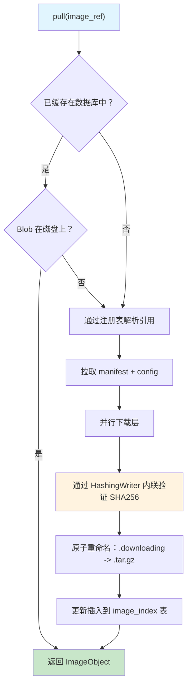
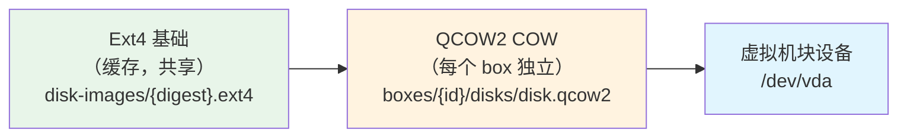
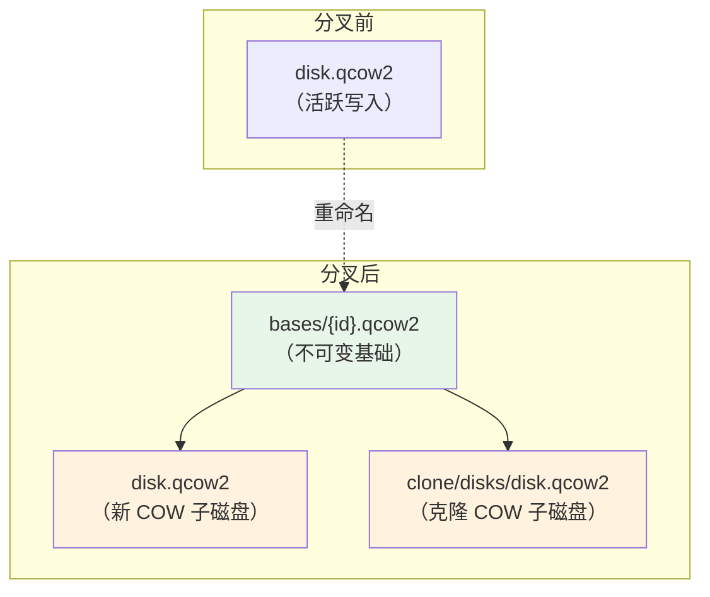
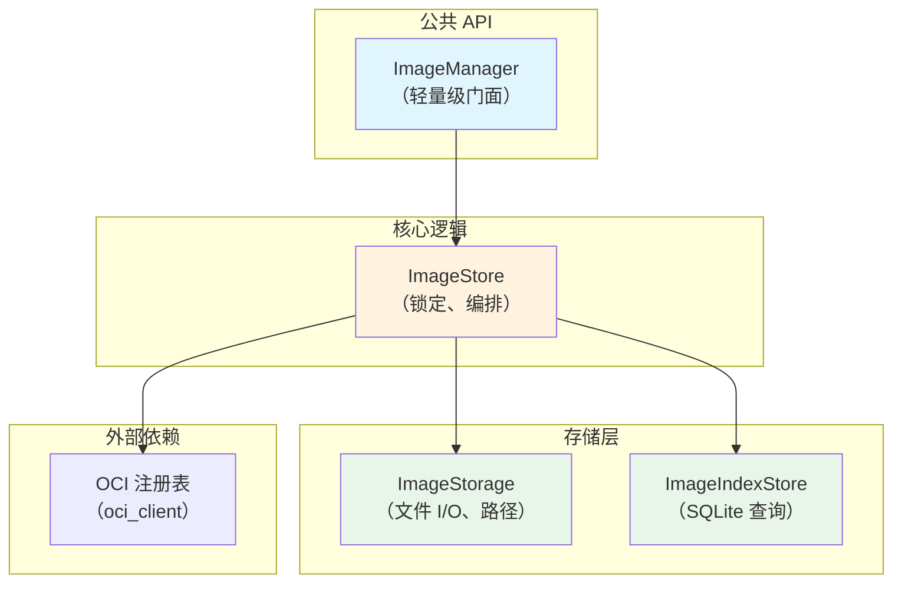
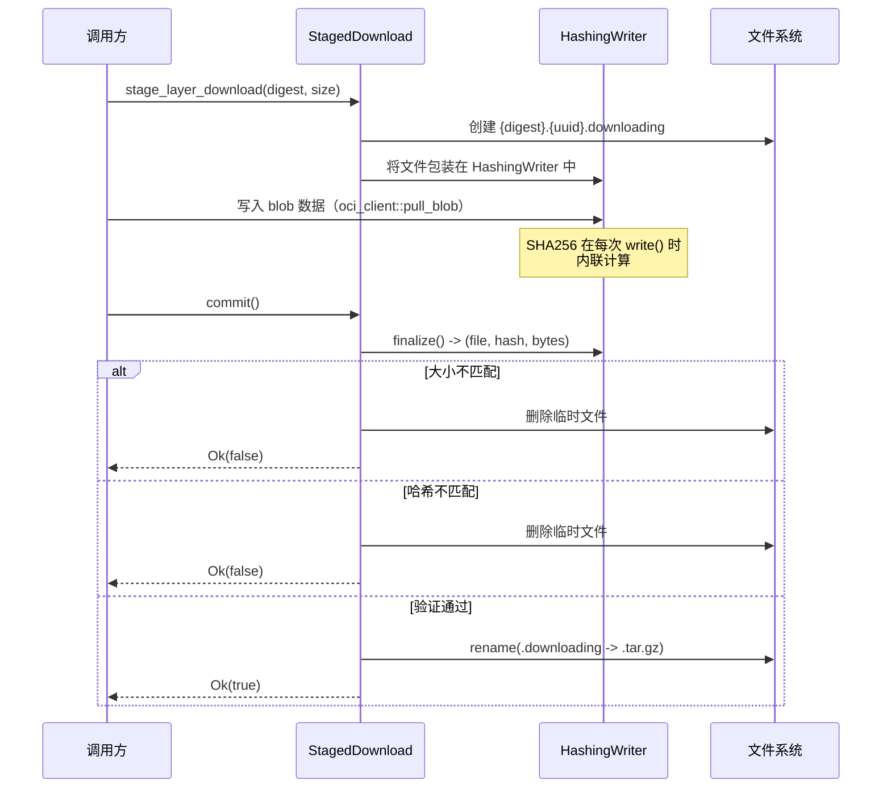
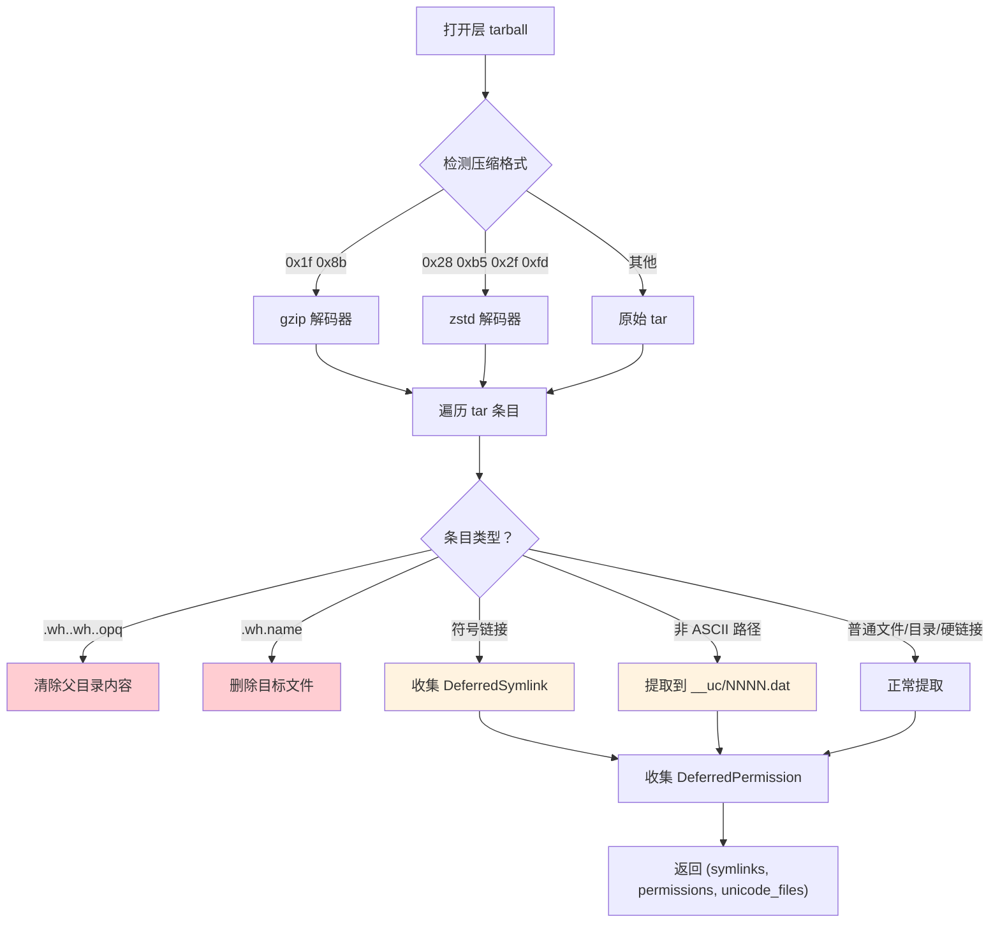
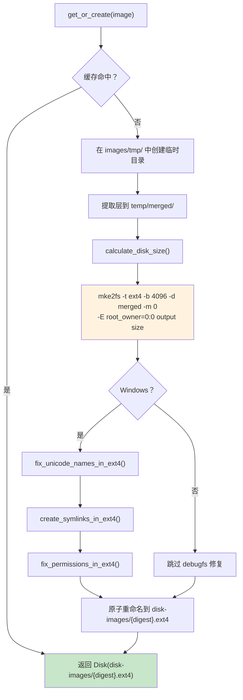
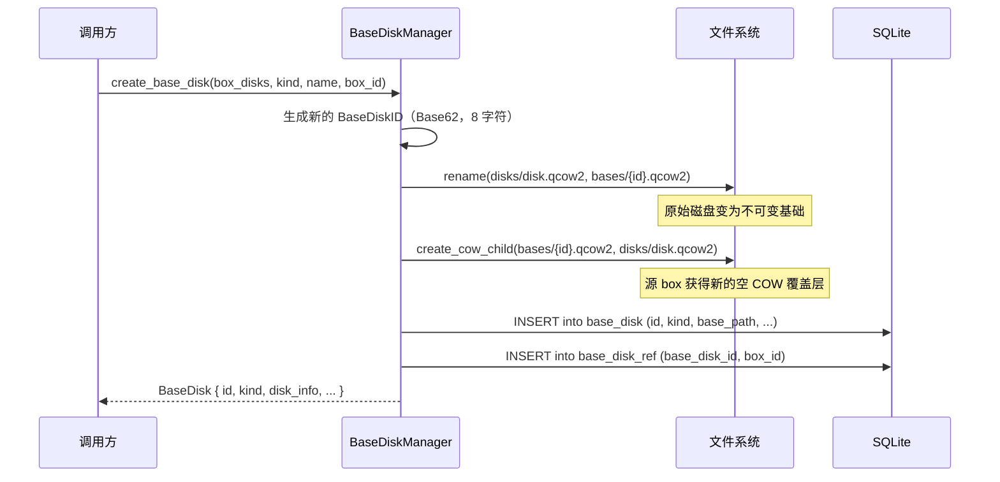
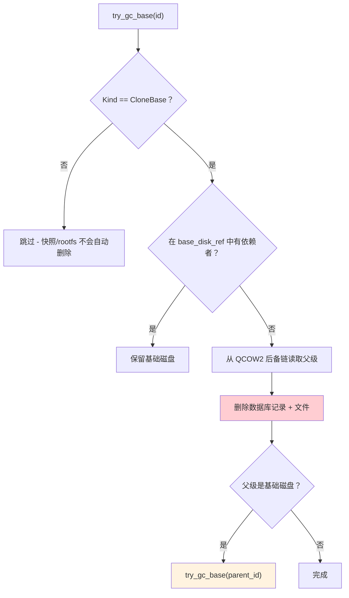
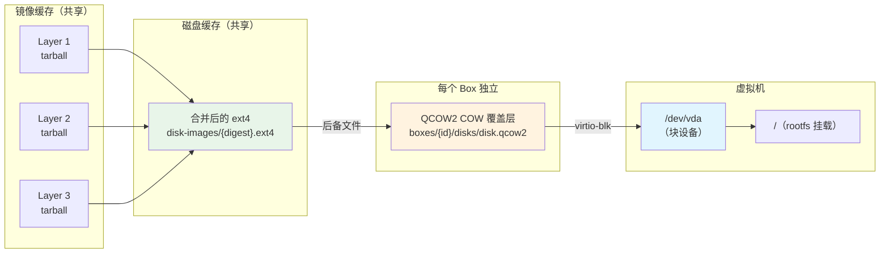

# BoxLite OCI 镜像与存储：深度指南

本文档提供了 BoxLite OCI 镜像管理和存储子系统的完整参考——从镜像拉取、层提取与缓存，到磁盘镜像创建、卷管理和基础磁盘生命周期。文档覆盖了完整的数据管道，所有细节均直接来源于源码，确保代码级别的准确性。

本文档分为两部分：

- **Part A：精简版** -- 快速参考的简要摘要。
- **Part B：详细版** -- 包含实现细节的完整深度覆盖。

---

# Part A：精简版

## 1. 存储架构概览

BoxLite 将所有运行时数据存储在 `~/.boxlite/` 目录下。镜像、磁盘镜像和每个 box 的数据遵循内容寻址（content-addressed）的分层结构，旨在实现去重和原子操作。

```
~/.boxlite/
  images/                          # OCI 镜像缓存
    manifests/                     # sha256-{digest}.json
    layers/                        # sha256-{digest}.tar.gz（压缩的 tarball）
    extracted/                     # sha256-{digest}/（已提取的层目录，仅 Unix）
    configs/                       # sha256-{digest}.json（OCI 镜像配置 blob）
    disk-images/                   # sha256-{digest}.ext4（按唯一层集合缓存的 ext4 镜像）
    tmp/                           # 用于原子安装的暂存区
  boxes/                           # 每个 box 的运行时数据
    {box_id}/
      disks/
        disk.qcow2                 # 容器 rootfs COW 磁盘（QCOW2，每个 box 独立）
        guest-rootfs.qcow2         # 客户机引导 COW 磁盘（QCOW2，每个 box 独立）
  bases/                           # 不可变基础磁盘（跨 box 共享）
    {base_disk_id}.qcow2           # 平面文件：克隆基础、快照
  db/
    boxlite.db                     # SQLite 数据库（schema v8）
```

## 2. 镜像拉取流水线

当你使用 OCI 镜像引用调用 `runtime.create()` 时，镜像拉取流水线作为懒初始化的一部分运行：



| 步骤 | 处理内容 |
|------|---------|
| **缓存检查** | 查询 `image_index` 表中的引用。如果 `complete=1` 且所有层 blob 在磁盘上存在，则完全跳过网络请求。 |
| **注册表解析** | `ReferenceIter` 尝试多个已配置的注册表。对于多架构镜像，会选择特定平台的 manifest。 |
| **层下载** | 每个层通过 `HashingWriter` 下载，内联计算 SHA256。如果 manifest 提供了预期大小，还会进行大小验证。 |
| **暂存安装** | 层 tarball 下载到 `{digest}.{uuid}.downloading` 临时文件，验证成功后原子重命名为 `{digest}.tar.gz`。 |
| **数据库更新插入** | `image_index` 行存储 `reference`、`manifest_digest`、`config_digest`、`layers`（JSON 数组）、`cached_at` 和 `complete` 标志。 |

## 3. 层提取与 Rootfs 准备

层被缓存为 tarball 后，必须提取并合并为虚拟机使用的文件系统。BoxLite 支持两种平台特定的路径：

**Unix（Linux/macOS）：** 使用 `RootfsBuilder` 配合 `LayerExtractor`，实现流式 tar 应用，完整支持 xattr（扩展属性）和权限。层被提取到 `images/extracted/{digest}/` 并缓存以供重用。Whiteout（白名单删除）标记（`.wh.*`）在缓存中被保留，并在基于复制的合并过程中内联处理。

**Windows：** 使用较简单的 tar 提取方式，将符号链接、权限和非 ASCII 文件名收集为延迟操作。这些操作在 `mke2fs` 创建 ext4 镜像之后，通过 `debugfs` 批量命令应用。

## 4. 磁盘镜像管理

BoxLite 使用两种磁盘格式：

| 格式 | 用途 | 创建方式 |
|------|------|---------|
| **Ext4** | 容器 rootfs 内容（镜像层合并后） | `mke2fs -d`（e2fsprogs） |
| **QCOW2** | 每个 box 的写时复制（COW）覆盖层 | 原生 Rust（`qcow2_rs`） |

运行中的 box 的磁盘链：



**关键特性：**
- Ext4 基础镜像通过层摘要的 SHA256 进行内容寻址，因此相同的镜像共享一个缓存磁盘
- QCOW2 覆盖层使用原生 Rust 创建，仅需约 1ms（相比 qemu-img 子进程的约 28ms）
- `Disk` 结构体提供 RAII（资源获取即初始化）清理——非持久化磁盘在 drop 时自动删除

## 5. 基础磁盘生命周期（克隆与快照）

克隆或快照一个 box 时，容器磁盘会被"分叉"：

1. 将 `disk.qcow2` 移动到 `bases/{base_disk_id}.qcow2`（使其不可变）
2. 在原始路径创建一个新的 COW 子磁盘（源 box 继续运行）
3. 在数据库中插入带有引用追踪的 `base_disk` 记录



**垃圾回收：** `BaseDiskKind` 决定清理规则：
- `CloneBase` -- 当 `base_disk_ref` 表显示零依赖时自动删除；级联到父磁盘
- `Snapshot` -- 永不自动删除；需要显式移除
- `Rootfs` -- 全局缓存，不自动删除

## 6. 卷管理

`GuestVolumeManager` 追踪两种类型的客户机存储：

| 类型 | 机制 | 示例 |
|------|------|------|
| **Virtiofs 共享** | `tag` + `host_path` 映射到客户机挂载 | 共享目录 |
| **块设备** | 顺序分配：`vda`、`vdb`、`vdc`... | 磁盘镜像 |

`ContainerVolumeManager` 提供基于约定的命名容器卷路径：`/run/boxlite/shared/containers/{container_id}/volumes/{volume_name}`。

## 7. 关键设计模式

| 模式 | 使用位置 | 原因 |
|------|---------|------|
| **暂存安装** | 层下载、磁盘镜像创建 | 确保缓存中永远不会出现半写入的文件 |
| **内容寻址缓存** | 层、manifest、config、ext4 镜像 | 跨镜像自动去重 |
| **RAII 磁盘清理** | `Disk` 结构体配合 `Drop` | 防止临时文件泄漏 |
| **HashingWriter** | 层/config 下载 | 内联 SHA256 验证，无需下载后重新读取 |
| **原子重命名** | 所有缓存操作 | 竞态安全的并发访问 |
| **基于数据库的引用计数** | `base_disk_ref` 表 | 克隆基础的级联垃圾回收 |

---

# Part B：详细版

## B.1 存储目录布局

所有 BoxLite 运行时数据存储在单个根目录下，默认为 `~/.boxlite/`。目录布局由 `ImageFilesystemLayout` 和 `BoxFilesystemLayout` 管理，它们从根目录确定性地计算路径。

```
~/.boxlite/
  images/                              # OCI 镜像缓存（由 ImageStorage 管理）
    manifests/                         # OCI manifest，按摘要索引
      sha256-{digest}.json             # 序列化的 OciManifest
    layers/                            # 压缩的层 tarball
      sha256-{digest}.tar.gz           # 从注册表下载的原始层 blob
      sha256-{digest}.{uuid}.downloading  # 正在进行的暂存下载（临时文件）
    extracted/                         # 已提取的层目录（仅 Unix）
      sha256-{digest}/                 # 完整提取的层目录树（保留 .wh.*）
      sha256-{digest}.{uuid}.extracting  # 正在进行的提取（临时文件）
    configs/                           # OCI 镜像配置 blob
      sha256-{digest}.json             # 镜像配置 JSON
    disk-images/                       # 缓存的 ext4 基础镜像（由 ImageDiskManager 管理）
      sha256-{digest}.ext4             # 某唯一镜像所有层合并后的 ext4
    tmp/                               # 构建操作的暂存区
  boxes/                               # 每个 box 的运行时数据
    {box_id}/
      config.json                      # 不可变的 box 配置
      disks/
        disk.qcow2                     # 容器 rootfs COW 覆盖层（QCOW2）
        guest-rootfs.qcow2             # 客户机引导 COW 覆盖层（QCOW2）
  bases/                               # 不可变基础磁盘（平面文件，共享）
    {base_disk_id}.qcow2               # 克隆基础、快照或 rootfs 缓存
  db/
    boxlite.db                         # SQLite 数据库（所有元数据）
```

**关键文件系统约束：** `tmp/`、`bases/` 和 `disk-images/` 目录必须与其最终目标位于同一文件系统上。这是 `rename(2)` 原子性所要求的——跨文件系统重命名会失败并返回 `EXDEV` 错误。

## B.2 SQLite 数据库 Schema（v8）

BoxLite 使用 SQLite 存储所有持久化元数据。Schema 版本在 `schema_version` 表中追踪，并在启动时自动迁移。

### B.2.1 镜像索引表

按引用（例如 `docker.io/library/python:3.12-alpine`）追踪缓存的 OCI 镜像：

```sql
CREATE TABLE IF NOT EXISTS image_index (
    reference      TEXT PRIMARY KEY NOT NULL,
    manifest_digest TEXT NOT NULL,
    config_digest   TEXT NOT NULL,
    layers          TEXT NOT NULL,       -- 层摘要字符串的 JSON 数组
    cached_at       TEXT NOT NULL,       -- RFC 3339 时间戳
    complete        INTEGER NOT NULL DEFAULT 0  -- 1 = 所有 blob 已在磁盘上验证
);
```

`complete` 标志防止部分下载被视为已缓存。全新拉取时设置 `complete=0`，仅在所有层 blob 通过 SHA256 验证后才翻转为 `1`。

### B.2.2 基础磁盘表

追踪不可变基础磁盘及其引用计数：

```sql
CREATE TABLE IF NOT EXISTS base_disk (
    id             TEXT PRIMARY KEY NOT NULL,  -- BaseDiskID（Base62，8 字符）
    source_box_id  TEXT NOT NULL,              -- 创建此基础磁盘的 box
    name           TEXT,                        -- 可选的人类可读名称
    kind           TEXT NOT NULL CHECK(kind IN ('snapshot', 'clone_base', 'rootfs')),
    base_path      TEXT NOT NULL,              -- .qcow2 文件的绝对路径
    created_at     INTEGER NOT NULL,           -- Unix 时间戳
    json           TEXT NOT NULL,              -- 完整的 BaseDisk 序列化为 JSON
    UNIQUE(source_box_id, name)
);

CREATE TABLE IF NOT EXISTS base_disk_ref (
    base_disk_id   TEXT NOT NULL,
    box_id         TEXT NOT NULL,
    PRIMARY KEY (base_disk_id, box_id)
);
```

`base_disk_ref` 关联表支持依赖感知的垃圾回收。当一个 box 被移除时，其引用被删除，`try_gc_base()` 会检查是否还有剩余引用，然后再决定是否删除基础磁盘文件。

### B.2.3 Box 状态表

```sql
CREATE TABLE IF NOT EXISTS box_config (
    box_id TEXT PRIMARY KEY NOT NULL,
    json   TEXT NOT NULL    -- 完整的 BoxConfig 序列化为 JSON
);

CREATE TABLE IF NOT EXISTS box_state (
    box_id TEXT PRIMARY KEY NOT NULL,
    json   TEXT NOT NULL    -- 完整的 BoxState 序列化为 JSON
);

CREATE TABLE IF NOT EXISTS alive (
    box_id TEXT PRIMARY KEY NOT NULL,
    pid    INTEGER NOT NULL,
    since  TEXT NOT NULL
);
```

### B.2.4 快照表

```sql
CREATE TABLE IF NOT EXISTS snapshot (
    id            TEXT PRIMARY KEY NOT NULL,
    box_id        TEXT NOT NULL,
    name          TEXT NOT NULL,
    base_disk_id  TEXT NOT NULL,
    created_at    INTEGER NOT NULL,
    json          TEXT NOT NULL,
    UNIQUE(box_id, name)
);
```

## B.3 镜像拉取流程（详细）

### B.3.1 架构

镜像子系统遵循分层架构，具有清晰的关注点分离：



| 组件 | 职责 |
|------|------|
| `ImageManager` | 公共门面。持有 `Arc<ImageStore>`。可廉价克隆。 |
| `ImageStore` | 所有锁定、去重、注册表通信。同一镜像的多个并发拉取只会下载一次。 |
| `ImageStorage` | 底层文件 I/O。内容寻址路径。不处理元数据或注册表通信。 |
| `ImageIndexStore` | 对 `image_index` 的 SQLite 操作。获取/更新插入/移除/列表。 |

### B.3.2 拉取算法

```rust
// ImageStore 的简化拉取流程
pub async fn pull(&self, image_ref: &str) -> BoxliteResult<ImageManifest> {
    // 1. 检查数据库缓存
    if let Some(cached) = self.index.get(image_ref)? {
        if cached.complete && self.storage.verify_blobs_exist(&cached.layers) {
            return Ok(cached.to_manifest());  // 快速路径：无需网络
        }
    }

    // 2. 通过注册表链解析引用
    let reference = Reference::from_str(image_ref)?;
    let (manifest, manifest_digest) = self.pull_manifest(&reference).await?;

    // 3. 拉取 config blob
    let config_digest = manifest.config.digest.clone();
    if !self.storage.has_config(&config_digest) {
        self.pull_config(&reference, &manifest).await?;
    }

    // 4. 并行拉取层（按摘要去重）
    for layer in &manifest.layers {
        if !self.storage.has_layer(&layer.digest) {
            self.pull_layer(&reference, layer).await?;
        }
    }

    // 5. 更新插入到数据库，complete=1
    self.index.upsert(image_ref, &manifest_digest, &config_digest, &layers)?;

    Ok(manifest)
}
```

### B.3.3 暂存下载协议

每个 blob 下载都使用 `StagedDownload` 协议，确保崩溃安全和竞态安全的写入：



`HashingWriter` 包装 `tokio::fs::File` 并实现 `AsyncWrite`。在每次 `poll_write` 时，它将成功写入的字节通过 `sha2::Sha256` 进行哈希计算。这消除了下载后重新读取文件以进行验证的需要。

### B.3.4 BlobSource 抽象

`ImageObject` 使用 `BlobSource` 来抽象层 blob 的来源：

```rust
pub enum BlobSource {
    /// 来自注册表的 blob（存储在 ImageStorage 缓存中）
    Store(StoreBlobSource),
    /// 来自本地 OCI 目录包的 blob（直接读取，不复制）
    LocalBundle(LocalBundleBlobSource),
}
```

`load_from_local()` 路径直接从本地包目录读取 blob，不将其复制到存储中。每个包的缓存目录（以 `bundle_path` + `manifest_digest` 为键）存储已提取的产物。

### B.3.5 镜像 Manifest 与层信息

在整个拉取流水线中使用的内部类型：

```rust
pub(super) struct ImageManifest {
    pub manifest_digest: String,      // 特定平台的 manifest 摘要
    pub layers: Vec<LayerInfo>,
    pub config_digest: String,
    pub diff_ids: Vec<String>,        // 未压缩层的 SHA256（来自 config）
}

pub(super) struct LayerInfo {
    pub digest: String,               // 压缩层的 SHA256
    pub media_type: String,           // 例如 "application/vnd.oci.image.layer.v1.tar+gzip"
    pub size: i64,                    // 预期大小；<=0 表示未知
}
```

## B.4 层提取与缓存

### B.4.1 Unix 路径：LayerExtractor

在 Unix（Linux/macOS）上，`LayerExtractor` 提供类似 containerd 的流式 tar 应用：

```rust
// 来自 archive/extractor.rs
pub struct LayerExtractor {
    root: SafeRoot,                    // 约束边界
    whiteout_mode: WhiteoutMode,       // Apply 或 Preserve
}

pub enum WhiteoutMode {
    Apply,    // 处理 .wh.* 文件（删除目标）
    Preserve, // 保持 .wh.* 文件原样（用于缓存）
}
```

Unix 提取器的关键特性：
- **SafeRoot 约束**：使用 `openat2`（Linux）或词法路径验证（macOS）防止路径遍历攻击
- **延迟目录元数据**：目录时间戳和权限在所有文件提取完成后再应用（避免嵌套写入覆盖 `mtime`）
- **延迟硬链接**：指向尚未提取目标的硬链接会被排队，在所有条目处理完成后创建
- **权限虚拟化**：使用 xattr `user.containers.override_stat`，格式为 `uid:gid:mode`，支持无根容器

层提取遵循暂存安装模式：

1. 提取到 `{digest}.{uuid}.extracting` 临时目录
2. 如果提取成功，原子重命名为 `{digest}/`
3. 如果另一个线程/进程赢得了重命名竞争，则静默清理临时目录

**Whiteout 处理至关重要。** 缓存的已提取层保留 `.wh.*` 标记，因为 whiteout 指示从*下层*删除文件。在单独的层上处理它们会丢失删除信息。Whiteout 在基于复制的 rootfs 合并过程中被内联处理。

### B.4.2 Windows 路径：extract_layer_tarball

在 Windows 上，层提取使用较简单的方式，因为 Windows 文件系统不支持 Unix 权限、xattr 或任意符号链接：



三种延迟操作会被收集，并在 `mke2fs` 创建 ext4 镜像后通过 `debugfs` 应用：

| 延迟类型 | 延迟原因 | 应用方式 |
|---------|---------|---------|
| `DeferredSymlink` | Windows 创建符号链接需要特殊权限；Unix 绝对路径在 Windows 上无效 | `debugfs symlink` 命令 |
| `DeferredPermission` | Windows 不保留 Unix mode 位 | `debugfs sif mode` 命令 |
| `DeferredUnicodeFile` | `mke2fs -d` 在 Windows 上使用 ANSI `opendir()`/`readdir()`（通过 MinGW），会破坏非 ASCII 文件名 | `debugfs write` 配合 UTF-8 路径 |

所有延迟操作使用基于 HashMap 的"后者覆盖前者"去重，符合 OCI 规范（上层覆盖下层）。

**路径清理**：所有传递给 debugfs 命令的路径都由 `sanitize_debugfs_path()` 验证，该函数拒绝换行符、回车符、空字节和双引号，以防止命令注入。

### B.4.3 OCI Whiteout 处理

OCI 层使用 whiteout 标记来指示层之间的文件删除：

| 标记 | 含义 | 示例 |
|------|------|------|
| `.wh.<name>` | 删除同一目录中的 `<name>` | `etc/.wh.old_config` 删除 `etc/old_config` |
| `.wh..wh..opq` | 删除父目录中来自下层的所有内容 | `etc/.wh..wh..opq` 清除 `etc/*` |

处理顺序很重要：不透明 whiteout 首先清除目录，然后同层的新文件被提取。单文件 whiteout 删除特定目标。

## B.5 磁盘镜像创建

### B.5.1 Ext4 创建流水线

`ImageDiskManager` 负责编排从 OCI 镜像创建缓存 ext4 磁盘镜像的过程：



**缓存键计算**：镜像摘要是所有层摘要字符串拼接后的 SHA256 哈希。这意味着两个不同的镜像引用如果具有相同的层集合，则共享同一个缓存的 ext4 磁盘。

**磁盘大小计算**（`calculate_disk_size()`）：

```
content_size = du -sb source_directory
inode_overhead = (file_count * 256 bytes)
adjusted = (content_size + inode_overhead) * 1.1  (10% 开销)
with_journal = adjusted + 64 MB
final = max(with_journal, 256 MB)
```

来自 `disk/constants.rs` 的常量：

| 常量 | 值 | 用途 |
|------|---|------|
| `BLOCK_SIZE` | 4096 字节 | Ext4 块大小 |
| `INODE_SIZE` | 256 字节 | Ext4 inode 大小 |
| `SIZE_MULTIPLIER` | 11/10（1.1 倍） | 10% 开销余量 |
| `JOURNAL_OVERHEAD_BYTES` | 64 MB | Ext4 日志预留 |
| `MIN_DISK_SIZE_BYTES` | 256 MB | 最小磁盘大小下限 |

### B.5.2 QCOW2 操作

BoxLite 使用原生 Rust QCOW2 实现（`qcow2_rs` crate）进行所有 COW（写时复制）磁盘操作，避免了 `qemu-img` 子进程的开销。

**创建独立 QCOW2 磁盘：**

```rust
// 来自 disk/qcow2.rs - Qcow2Helper::create_disk()
pub fn create_disk(disk_path: &Path, persistent: bool) -> BoxliteResult<Disk> {
    let size_bytes = DEFAULT_DISK_SIZE_GB * 1024 * 1024 * 1024;  // 10 GB
    let (rc_table, rc_block, _l1_table) = Qcow2Header::calculate_meta_params(
        size_bytes, CLUSTER_BITS, REFCOUNT_ORDER, BLOCK_SIZE
    );
    // ... 格式化头部并写入文件
    Ok(Disk::new(disk_path, DiskFormat::Qcow2, persistent))
}
```

QCOW2 配置常量：

| 常量 | 值 | 含义 |
|------|---|------|
| `DEFAULT_DISK_SIZE_GB` | 10 | 虚拟磁盘大小（稀疏分配，实际约 200KB） |
| `CLUSTER_BITS` | 16 | 64 KB 簇（2^16） |
| `REFCOUNT_ORDER` | 4 | 16 位引用计数（2^4） |
| `BLOCK_SIZE` | 512 | 元数据块大小 |

**创建 COW 子磁盘：**

`create_cow_child_disk()` 函数创建一个引用另一个磁盘作为后备文件的 QCOW2 文件。所有读取转发到后备文件；写入存储在子磁盘中。

```rust
pub fn create_cow_child_disk(
    base_disk: &Path,
    backing_format: BackingFormat,  // Raw 或 Qcow2
    child_path: &Path,
    virtual_size: u64,
) -> BoxliteResult<Disk> {
    Self::write_cow_child_header(child_path, base_disk, backing_format, virtual_size)?;
    Ok(Disk::new(child_path, DiskFormat::Qcow2, false))
}
```

头部包含：
- 后备文件路径（在偏移量 512 处的规范化绝对路径）
- 后备格式扩展头部（类型 `0xE2792ACA`）
- 空的 L1 表（所有读取穿透到后备文件）
- 正确大小的引用计数结构

性能：原生 Rust COW 子磁盘创建约需 1ms，而 `qemu-img create -b` 约需 28ms。

**后备链操作：**

```rust
// 从 QCOW2 头部读取后备文件路径
pub fn read_backing_file_path(path: &Path) -> BoxliteResult<Option<String>>

// 遍历完整后备链（最大深度 MAX_BACKING_CHAIN_DEPTH = 8）
pub fn read_backing_chain(path: &Path) -> Vec<PathBuf>

// 检查目标是否出现在 chain_root 的后备链中
pub fn is_backing_dependency(target: &Path, chain_root: &Path) -> bool

// 覆写头部中的后备文件路径（轻量级变基）
pub fn set_backing_file_path(qcow2_path: &Path, new_backing: &Path) -> BoxliteResult<()>

// 将整个后备链扁平化为独立的 QCOW2
pub fn flatten(src: &Path, dst: &Path) -> BoxliteResult<()>
```

`flatten()` 操作将后备链的所有层合并为单个独立的 QCOW2 文件：
1. 打开完整的后备链（顶层在前，基础在后）
2. 对于每个虚拟簇，通过链解析（第一个已分配的层优先）
3. 写入数据簇，在内存中构建 L2 表
4. 写入引用计数结构
5. 写入独立的 QCOW2 v3 头部（无后备文件引用）

### B.5.3 磁盘 RAII 包装器

`Disk` 结构体为磁盘生命周期管理提供 RAII（资源获取即初始化）语义：

```rust
pub struct Disk {
    path: PathBuf,
    format: DiskFormat,   // Ext4 或 Qcow2
    persistent: bool,     // 如果为 false，在 Drop 时删除
}

pub enum DiskFormat { Ext4, Qcow2 }
```

- 非持久化磁盘（每个 box 的 COW 覆盖层）在 `Disk` 被 drop 时自动删除
- 持久化磁盘（缓存的 ext4 镜像、基础磁盘）存活超过拥有者的作用域
- `disk.leak()` 通过转移所有权防止清理（在原子重命名后使用）

## B.6 基础磁盘管理

### B.6.1 BaseDiskManager

`BaseDiskManager` 管理用于克隆和快照操作的不可变基础磁盘的生命周期：

```rust
pub(crate) struct BaseDiskManager {
    bases_dir: PathBuf,       // ~/.boxlite/bases/
    store: BaseDiskStore,     // 数据库操作
}
```

### B.6.2 分叉操作

核心 `create_base_disk()` 方法实现分叉与 COW 模式：



### B.6.3 BaseDiskKind 生命周期规则

```rust
pub enum BaseDiskKind {
    Snapshot,   // 用户命名。不会被垃圾回收自动删除。仅支持显式移除。
    CloneBase,  // 当 base_disk_ref 显示零依赖时自动删除。
    Rootfs,     // 全局缓存（source_box_id = "__global__"）。不自动删除。
}
```

### B.6.4 垃圾回收（级联）

当一个 box 被移除时，其引用从 `base_disk_ref` 中清除。然后 `try_gc_base()` 运行：

```rust
pub(crate) fn try_gc_base(&self, base_disk_id: &BaseDiskID) {
    // 1. 如果不是 CloneBase 类型则跳过
    // 2. 查询 base_disk_ref 获取依赖者
    // 3. 如果存在依赖者，保留基础磁盘
    // 4. 在删除前从 QCOW2 头部读取父级后备路径
    // 5. 删除数据库记录和文件
    // 6. 级联：try_gc_base(parent_base_disk_id)
}
```

级联沿 QCOW2 后备链进行：如果 base-2 的后备文件指向 base-1，且 base-2 没有依赖者，则删除 base-2 会触发对 base-1 的垃圾回收检查。



## B.7 卷管理

### B.7.1 GuestVolumeManager

追踪两种类型的客户机可见存储：

```rust
pub struct GuestVolumeManager {
    fs_shares: Vec<FsShare>,          // Virtiofs 共享目录
    block_devices: Vec<BlockDevice>,  // 块设备（QCOW2/ext4 磁盘）
}

struct FsShare {
    tag: String,       // Virtiofs 挂载标签（客户机端标识符）
    host_path: PathBuf, // 要共享的宿主机目录
}

struct BlockDevice {
    id: String,        // 顺序分配："vda"、"vdb"、"vdc"...
    path: PathBuf,     // 磁盘镜像路径
}
```

块设备 ID 使用 `vd{a-z}` 命名约定顺序分配：

```rust
fn next_block_id(&self) -> String {
    let idx = self.block_devices.len();
    let letter = (b'a' + idx as u8) as char;
    format!("vd{}", letter)
}
```

管理器产生两个供 VMM（虚拟机监控器）使用的输出：
- `build_vmm_config()` -- 为 hypervisor（虚拟机管理程序）提供 Virtiofs 共享路径和块设备路径
- `build_guest_mounts()` -- 通过 gRPC 发送给客户机代理的挂载指令

### B.7.2 ContainerVolumeManager

为命名容器卷提供基于约定的卷路径解析：

```rust
// 卷路径约定：
// /run/boxlite/shared/containers/{container_id}/volumes/{volume_name}
pub fn volume_path(&self, volume_name: &str) -> PathBuf {
    PathBuf::from("/run/boxlite/shared/containers")
        .join(&self.container_id)
        .join("volumes")
        .join(volume_name)
}
```

它包装了 `GuestVolumeManager`，将面向用户的卷名映射到内部的 virtiofs 共享 + 客户机挂载路径对。

## B.8 OCI 镜像配置

### B.8.1 ContainerImageConfig

从 OCI 镜像配置 blob 中提取，该结构体携带运行时配置：

```rust
pub struct ContainerImageConfig {
    pub entrypoint: Vec<String>,      // OCI ENTRYPOINT（可执行文件）
    pub cmd: Vec<String>,             // OCI CMD（默认参数，可覆盖）
    pub user: String,                 // OCI USER（默认 "0:0"）
    pub exposed_ports: Vec<String>,   // OCI EXPOSE（例如 "8080/tcp"）
    pub env: Vec<String>,             // OCI ENV（例如 "PATH=/usr/bin"）
    pub working_dir: String,          // OCI WORKDIR（默认 "/"）
}
```

**最终命令计算**遵循 Docker/OCI 语义：

```rust
pub fn final_cmd(&self) -> Vec<String> {
    let mut result = self.entrypoint.clone();
    result.extend(self.cmd.iter().cloned());
    result
}
// entrypoint=["/bin/sh", "-c"] + cmd=["echo hello"]
// -> ["/bin/sh", "-c", "echo hello"]
```

**环境变量合并**：用户提供的环境变量按键覆盖镜像环境变量：

```rust
pub fn merge_env(&mut self, user_env: Vec<(String, String)>) {
    // 将现有的 "KEY=VALUE" 解析为 HashMap
    // 合并用户变量（覆盖现有键）
    // 对输出排序以确保确定性
}
```

**默认配置**（当镜像没有配置或字段缺失时）：

| 字段 | 默认值 |
|------|-------|
| `entrypoint` | `["/bin/sh"]` |
| `cmd` | `[]` |
| `user` | `"0:0"` |
| `env` | `["PATH=/usr/local/sbin:/usr/local/bin:/usr/sbin:/usr/bin:/sbin:/bin"]` |
| `working_dir` | `"/"` |
| `exposed_ports` | `[]` |

## B.9 容器 Rootfs 初始化策略

BoxLite 根据平台能力使用两种策略来准备容器 rootfs：

### B.9.1 基于复制的挂载（Unix，首选）

`RootfsBuilder` 使用 VFS 风格的复制操作，通过 `cp -ac`（Linux）或 `cp --reflink=auto` 将已提取的层合并为单个目录树。该方式：

- 在复制过程中内联处理 whiteout 标记（而非之后处理）
- 支持 `user.containers.override_stat` xattr 进行权限虚拟化
- 生成合并后的目录，由 `mke2fs -d` 转换为 ext4

### B.9.2 基于提取的挂载（Windows，备选）

在 Windows 上，层从 tarball 中提取，符号链接、权限和非 ASCII 文件名作为延迟操作处理。合并后的目录通过 `mke2fs -d` 转换为 ext4，然后 `debugfs` 批量命令应用延迟操作。

### B.9.3 端到端磁盘链

从 OCI 镜像到运行中虚拟机的完整磁盘链：



## B.10 关键设计模式

### B.10.1 暂存安装模式

每次对共享缓存位置的写入都遵循暂存安装模式，以防止半写入的文件：

```
1. 在临时位置创建工作内容（唯一后缀：UUID 或 PID）
2. 在临时位置执行所有 I/O
3. 验证完整性（SHA256、大小）
4. 原子 rename(2) 到最终位置
5. 如果重命名失败（竞态），检查获胜者是否成功
6. 任何失败时清理临时文件
```

该模式出现在：
- 层下载（`StagedDownload`，使用 `.downloading` 后缀）
- 层提取（`.extracting` 后缀）
- 磁盘镜像创建（`images/tmp/` 中的临时目录）

### B.10.2 内容寻址缓存

所有缓存产物按内容摘要索引：

| 产物 | 键 | 路径 |
|------|---|------|
| Manifest | `sha256:{digest}` | `manifests/sha256-{digest}.json` |
| 层 tarball | `sha256:{digest}` | `layers/sha256-{digest}.tar.gz` |
| Config blob | `sha256:{digest}` | `configs/sha256-{digest}.json` |
| 已提取层 | `sha256:{digest}` | `extracted/sha256-{digest}/` |
| Ext4 磁盘镜像 | 层摘要的 SHA256 | `disk-images/sha256-{digest}.ext4` |

优点：跨镜像自动去重、崩溃安全（内容要么完整存在要么不存在）、可轻松验证。

### B.10.3 内联完整性验证

`HashingWriter` 消除了下载后重新读取的需要：

```rust
impl<W: AsyncWrite + Unpin> AsyncWrite for HashingWriter<W> {
    fn poll_write(..., buf: &[u8]) -> Poll<Result<usize>> {
        match Pin::new(&mut this.inner).poll_write(cx, buf) {
            Poll::Ready(Ok(n)) => {
                this.hasher.update(&buf[..n]);  // 仅对成功写入的字节进行哈希
                this.bytes_written += n as u64;
                Poll::Ready(Ok(n))
            }
            other => other,
        }
    }
}
```

这是独立于 `oci-client` 自身摘要检查的验证层，提供纵深防御。

### B.10.4 RAII 资源管理

`Disk` 结构体使用 Rust 的 `Drop` trait 实现自动清理：

```rust
impl Drop for Disk {
    fn drop(&mut self) {
        if !self.persistent {
            let _ = std::fs::remove_file(&self.path);
        }
    }
}
```

初始化流水线中的 `CleanupGuard` 确保如果 box 设置的任何阶段失败，所有部分资源（已提取层、临时磁盘、COW 覆盖层）都会被回滚。

### B.10.5 基于数据库的引用计数

`base_disk_ref` 关联表支持共享基础磁盘的安全垃圾回收：

```
Box A ----ref----> 基础磁盘 X <----ref---- Box B
                        |
                   （后备文件）
                        |
                   基础磁盘 Y
```

当 Box A 被移除时：
1. 删除 (X, A) 的 `base_disk_ref` 行
2. 检查：X 是否仍有引用？如果 Box B 的引用存在，保留 X
3. 当 Box B 也被移除时，X 有零引用 -> 删除 X
4. 级联：检查 Y（X 在后备链中的父级）是否也有零引用

这避免了文件系统级别的引用计数（在崩溃时不可靠），并提供了清晰的审计轨迹，记录哪些 box 依赖哪些基础磁盘。
