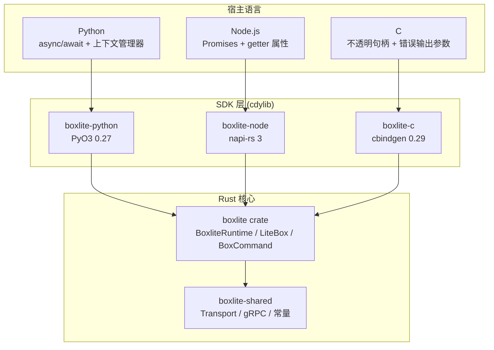
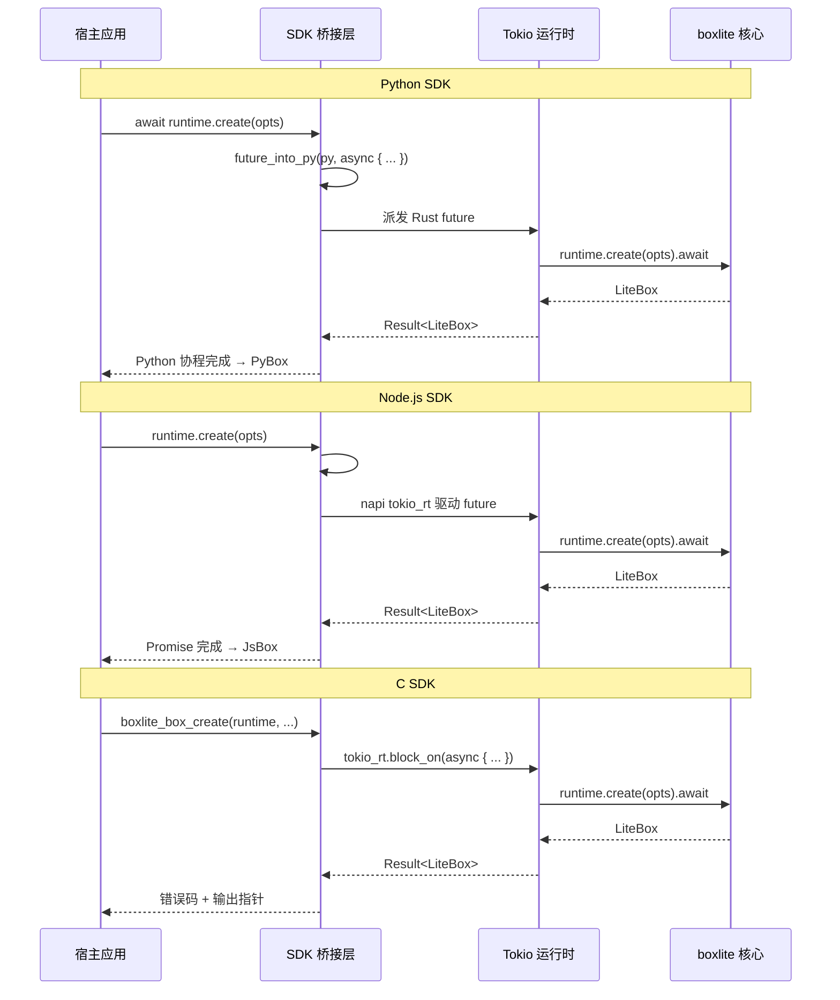
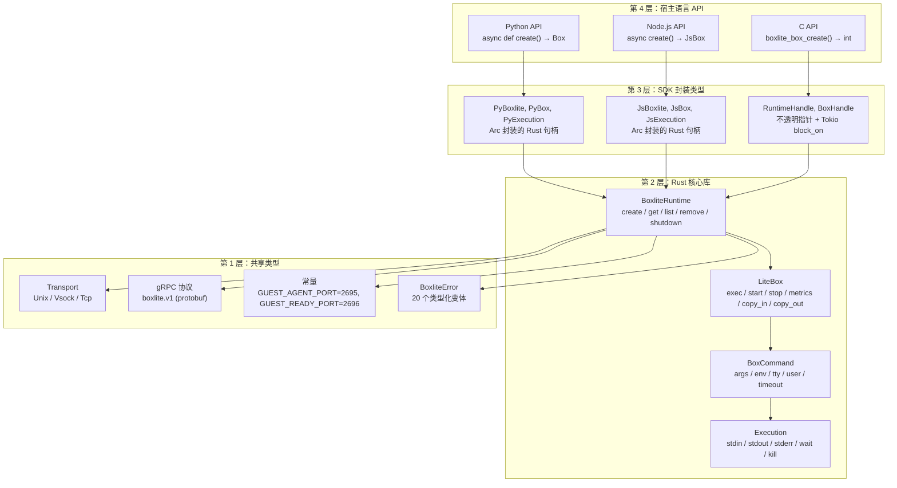
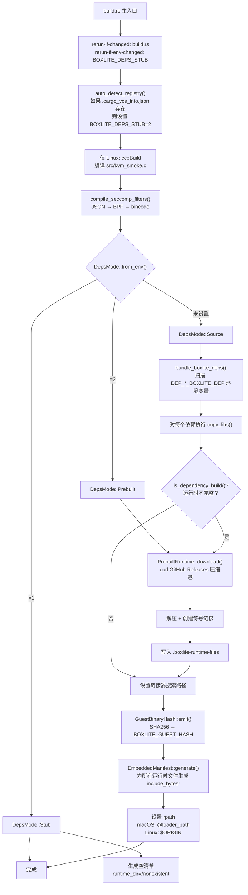
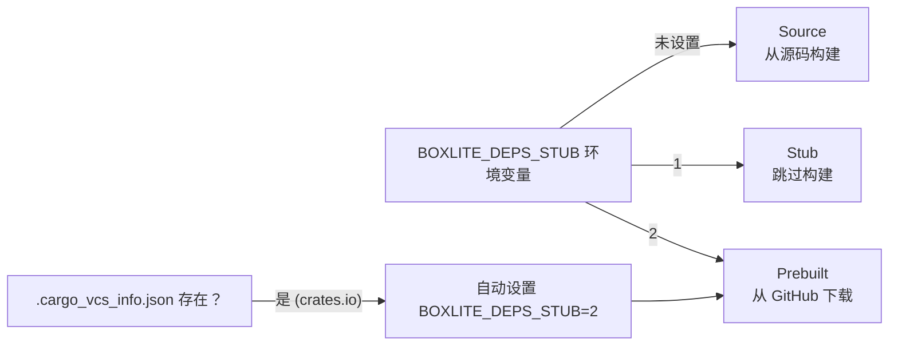
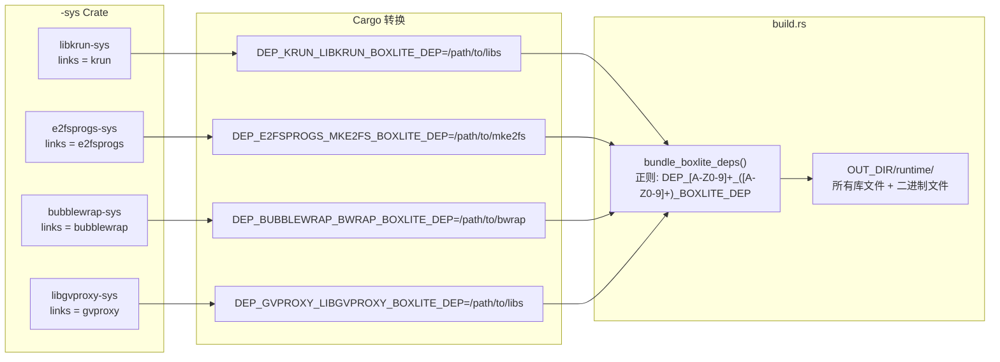
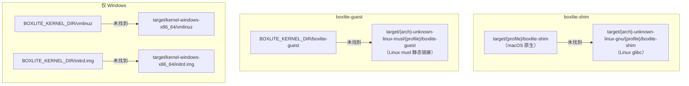
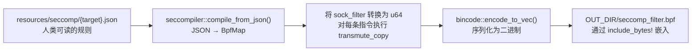
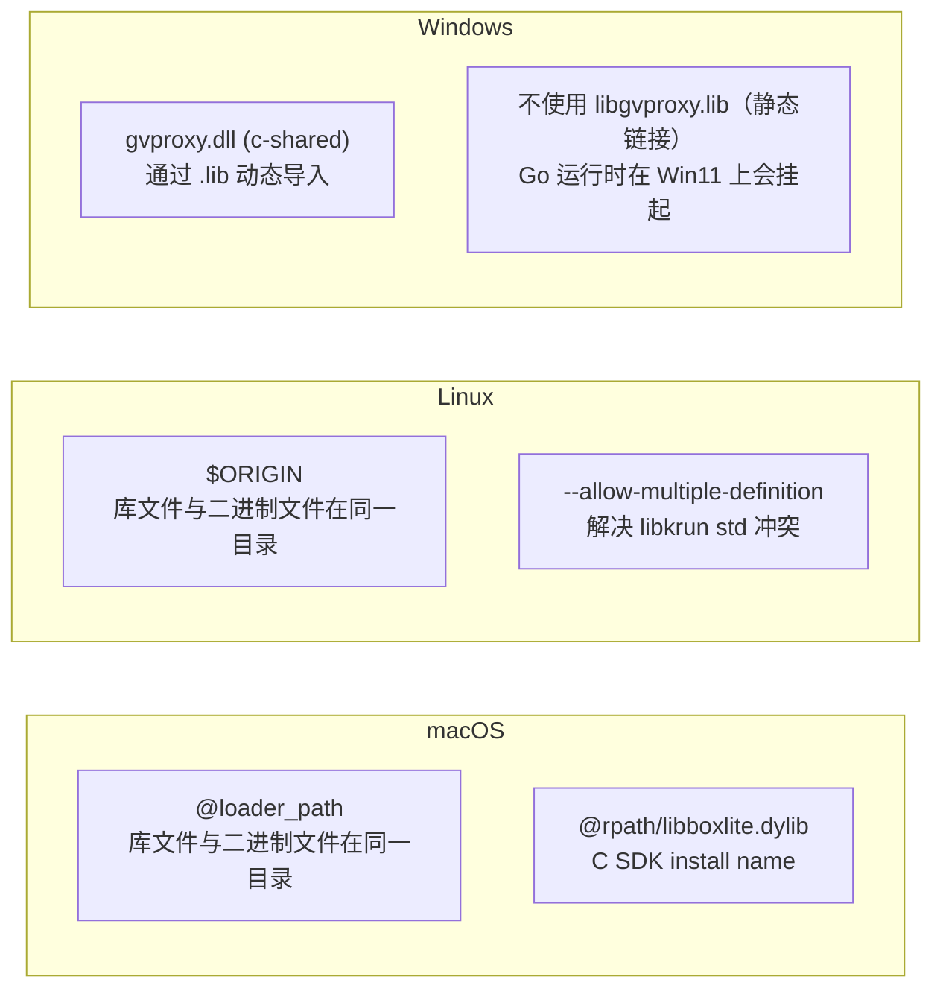
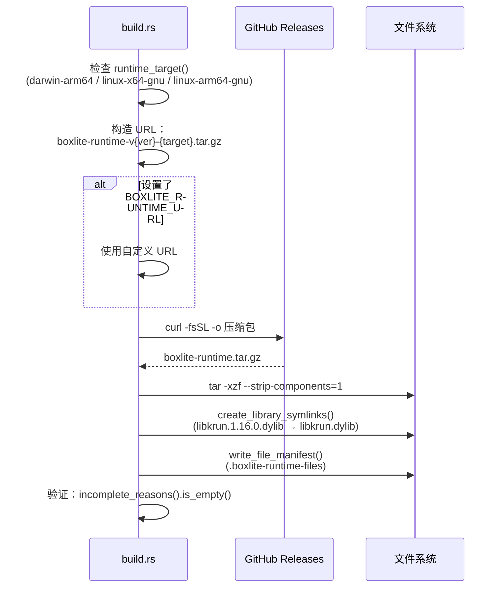

# SDK/FFI 层与跨平台构建系统

> BoxLite 通过三个语言特定的 SDK 暴露其 Rust 核心 -- Python (PyO3)、
> Node.js (napi-rs) 和 C (cbindgen FFI（外部函数接口）)。本文档涵盖分层桥接
> 架构、异步桥接模式、错误传播机制，以及约 1,400 行的构建系统，该系统负责打包
> 原生依赖、编译 seccomp 过滤器，并嵌入运行时二进制文件以实现自包含分发。

**版本**: 0.9.2 | **Rust 版本**: 2024 | **最低支持 Rust 版本 (MSRV)**: 1.88

---

## 目录

- [Part A: 扼要版](#part-a-扼要版)
  - [A.1 SDK 架构总览](#a1-sdk-架构总览)
  - [A.2 异步桥接模式](#a2-异步桥接模式)
  - [A.3 错误传播](#a3-错误传播)
  - [A.4 构建系统概览](#a4-构建系统概览)
  - [A.5 跨平台编译](#a5-跨平台编译)
- [Part B: 全面细致版](#part-b-全面细致版)
  - [B.1 分层桥接架构](#b1-分层桥接架构)
  - [B.2 共享类型层](#b2-共享类型层)
  - [B.3 Python SDK 详解 (PyO3)](#b3-python-sdk-详解-pyo3)
  - [B.4 Node.js SDK 详解 (napi-rs)](#b4-nodejs-sdk-详解-napi-rs)
  - [B.5 C SDK 详解 (cbindgen FFI)](#b5-c-sdk-详解-cbindgen-ffi)
  - [B.6 SDK API 接口对照](#b6-sdk-api-接口对照)
  - [B.7 构建系统详解 (build.rs)](#b7-构建系统详解-buildrs)
  - [B.8 依赖打包流水线](#b8-依赖打包流水线)
  - [B.9 嵌入式运行时清单](#b9-嵌入式运行时清单)
  - [B.10 Seccomp 过滤器编译](#b10-seccomp-过滤器编译)
  - [B.11 特性开关](#b11-特性开关)
  - [B.12 跨平台条件编译](#b12-跨平台条件编译)
  - [B.13 平台特定链接](#b13-平台特定链接)
  - [B.14 源文件参考](#b14-源文件参考)

---

# Part A: 扼要版

## A.1 SDK 架构总览

BoxLite 采用**分层桥接模式**，将单一的平台无关 Rust 核心（`boxlite` crate）通过三个语言特定的 SDK crate 暴露出去。每个 SDK 都是一个 `cdylib`（C 动态链接库），用语言惯用的 API 封装相同的 `BoxliteRuntime` 和 `LiteBox` 类型。



| SDK | 绑定框架 | Crate 类型 | 异步模型 | 关键依赖 |
|-----|---------|-----------|---------|---------|
| Python | PyO3 0.27.1 | `cdylib` | `pyo3_async_runtimes::tokio::future_into_py()` | `pyo3`, `pyo3-async-runtimes` |
| Node.js | napi-rs 3 | `cdylib` | `#[napi] async fn`（自动 Promise） | `napi`, `napi-derive` |
| C | cbindgen 0.29 | `cdylib` + `staticlib` | `block_on()`（同步阻塞） | `cbindgen`, `tokio` |

**所有 SDK 的核心模式：**

1. 使用 `Arc<BoxliteRuntime>` 封装 `BoxliteRuntime` 以实现共享所有权
2. 使用 `Arc<LiteBox>` 封装 `LiteBox` 以确保跨引用安全
3. 通过每个 SDK 的 `map_err` 辅助函数将 `BoxliteError` 转换为语言特定的错误类型
4. 以语言惯用的命名风格 1:1 映射 Rust API 接口

## A.2 异步桥接模式

每个 SDK 以不同方式处理 Rust 到宿主语言的异步边界：



## A.3 错误传播

所有 SDK 都通过 `boxlite-shared` 中集中定义的 `BoxliteError` 枚举进行错误传播：

| SDK | 错误映射方式 | 用户可见类型 |
|-----|------------|------------|
| Python | `map_err(e) → PyRuntimeError::new_err(e.to_string())` | 附带消息的 `RuntimeError` |
| Node.js | `map_err(e) → NapiError::from_reason(e.to_string())` | 附带消息的 `Error` |
| C | `error_to_code(&e) → BoxliteErrorCode` 枚举 + `FFIError` 结构体 | 整数错误码 + `char*` 错误消息 |

## A.4 构建系统概览

`src/boxlite/build.rs`（约 1,400 行）承担五项职责：

1. **依赖打包** -- 扫描来自 `-sys` crate 的 `DEP_{LINKS}_{NAME}_BOXLITE_DEP` 环境变量，将库文件复制到 `OUT_DIR/runtime/`
2. **嵌入式运行时清单** -- 为 shim、guest、内核二进制文件生成 `include_bytes!` 代码，并计算 SHA256 哈希
3. **Seccomp 编译**（仅 Linux） -- 通过 `seccompiler` 将 JSON 过滤规则编译为 BPF（伯克利包过滤器）字节码
4. **平台链接** -- 设置 `@rpath`（macOS）、`$ORIGIN`（Linux）、动态链接标志
5. **预构建下载** -- 自动检测 crates.io 包，从 GitHub Releases 下载预构建产物

三种依赖解析模式（`DepsMode`）：

| 模式 | 环境变量 | 行为 |
|------|---------|------|
| `Source` | 未设置 | 从源码构建 `-sys` crate，打包输出 |
| `Stub` | `BOXLITE_DEPS_STUB=1` | 跳过所有构建（用于 `cargo check`/`cargo clippy`） |
| `Prebuilt` | `BOXLITE_DEPS_STUB=2` | 从 GitHub Releases 下载预构建产物 |

## A.5 跨平台编译

BoxLite 广泛使用 `#[cfg]` 属性来实现平台特定代码：

| 平台 | 虚拟化引擎 | 沙箱隔离 | 依赖 |
|------|-----------|---------|------|
| Linux | KVM | bwrap、landlock、cgroup、seccomp、apparmor | `nix`, `xattr`, `signal-hook`, `caps`, `seccompiler` |
| macOS | Hypervisor.framework | seatbelt (sandbox-exec) | `nix`, `xattr`, `signal-hook` |
| Windows | WHPX | Job Objects（作业对象） | `windows-sys`, `uds_windows` |

---

# Part B: 全面细致版

## B.1 分层桥接架构

SDK 架构遵循严格的分层原则。没有任何 SDK 包含业务逻辑 -- 每个 SDK 都只是一个从 Rust 类型到宿主语言类型的薄翻译层。



**设计不变量：**

- 每个 SDK 模块都对应一个核心模块：`runtime.rs`、`box_handle.rs`、`exec.rs`、`images.rs`、`metrics.rs`、`options.rs`、`snapshots.rs`
- 所有 SDK 都使用 `Arc<T>` 实现共享所有权 -- 宿主语言的 GC（垃圾回收器）可以持有对同一 Rust 对象的多个引用
- 错误转换在每个 SDK 中是单一函数（`map_err`），从不分散在各处
- 除了 Node.js（为了其 `map_err` 中使用 `BoxliteError`）之外，没有 SDK 直接导入 `boxlite-shared`。Python 和 C 通过 `boxlite::BoxliteError` 的重导出来访问。

## B.2 共享类型层

`boxlite-shared` crate（`src/shared/`）提供主机端运行时和 Guest Agent（客户代理）共同使用的类型。SDK 通过 `boxlite` crate 间接依赖这些类型。

### Transport（传输）抽象

```rust
// src/shared/src/transport.rs
pub enum Transport {
    Tcp { port: u16 },
    Unix { socket_path: PathBuf },
    Vsock { port: u32 },
}
```

每个变体都有 URI 表示形式（`tcp://127.0.0.1:8080`、`unix:///path/to/sock`、`vsock://2695`），并通过 `to_uri()` / `from_uri()` 实现双向解析。`Display` 和 `FromStr` trait 的实现使其可以无缝序列化。

### gRPC 协议

共享 crate 通过 `tonic::include_proto!("boxlite.v1")` 从 protobuf 定义生成 gRPC 客户端/服务端代码。生成四个服务：

| 服务 | 用途 |
|------|------|
| `Guest` | 虚拟机生命周期管理（健康检查、关闭） |
| `Container` | 虚拟机内部的容器管理 |
| `Execution` | 命令执行、标准输入/输出/错误流式传输 |
| `Files` | 主机与客户机之间的文件传输 |

### 常量

共享常量确保主机和客户机在通信参数上保持一致：

```rust
// src/shared/src/constants.rs
pub mod network {
    pub const GUEST_AGENT_PORT: u32 = 2695;  // 手机键盘上的 "BOXL"
    pub const GUEST_READY_PORT: u32 = 2696;  // 手机键盘上的 "BOXM"
}

pub mod mount_tags {
    pub const ROOTFS: &str = "BoxLiteContainer0Rootfs";
    pub const LAYERS: &str = "BoxLiteContainer0Layers";
    pub const SHARED: &str = "BoxLiteShared";
}
```

## B.3 Python SDK 详解 (PyO3)

**Crate**: `boxlite-python` | **路径**: `sdks/python/` | **框架**: PyO3 0.27.1

### 模块结构

```
sdks/python/src/
  lib.rs               # 模块注册（28 个类导出）
  runtime.rs            # PyBoxlite → Arc<BoxliteRuntime>
  box_handle.rs         # PyBox → Arc<LiteBox>
  exec.rs               # PyExecution, PyExecStdin/Stdout/Stderr
  images.rs             # PyImageHandle, PyImageInfo, PyImagePullResult
  metrics.rs            # PyBoxMetrics, PyRuntimeMetrics
  options.rs            # PyBoxOptions, PyOptions, PyNetworkSpec 等
  info.rs               # PyBoxInfo, PyBoxStateInfo, PyHealthState
  snapshots.rs          # PySnapshotHandle, PySnapshotInfo
  snapshot_options.rs   # PySnapshotOptions, PyExportOptions, PyCloneOptions
  advanced_options.rs   # PyAdvancedBoxOptions, PySecurityOptions
  util.rs               # map_err 辅助函数（3 行）
```

### 模块注册

Python 模块注册为 `boxlite`，导出 30 个类（31 个 `add_class` 调用；`PyHealthCheckOptions` 注册了两次）：

```rust
// sdks/python/src/lib.rs
#[pymodule(name = "boxlite")]
fn boxlite_python(m: &Bound<'_, PyModule>) -> PyResult<()> {
    // 从 RUST_LOG 环境变量初始化日志追踪
    let _ = tracing_subscriber::fmt()
        .with_env_filter(tracing_subscriber::EnvFilter::from_default_env())
        .try_init();

    m.add_class::<PyOptions>()?;
    m.add_class::<PyBoxlite>()?;
    m.add_class::<PyBox>()?;
    m.add_class::<PyExecution>()?;
    // ... 还有 24 个类
    Ok(())
}
```

### 异步桥接模式

每个异步操作都使用 `pyo3_async_runtimes::tokio::future_into_py()`，它将 Rust `Future` 转换为 Python 协程。该模式在所有方法中保持一致：

```rust
// sdks/python/src/runtime.rs — 标准异步桥接模式
fn create<'py>(
    &self,
    py: Python<'py>,
    options: PyBoxOptions,
    name: Option<String>,
) -> PyResult<Bound<'py, PyAny>> {
    let runtime = Arc::clone(&self.runtime);     // 1. 克隆 Arc 以便移动
    let opts = BoxOptions::try_from(options)     // 2. 在异步之前转换选项
        .map_err(map_err)?;
    pyo3_async_runtimes::tokio::future_into_py(  // 3. 桥接到 Python
        py,
        async move {
            let handle = runtime.create(opts, name)
                .await.map_err(map_err)?;        // 4. 调用核心，映射错误
            Ok(PyBox {
                handle: Arc::new(handle),        // 5. 用 Arc 封装结果
            })
        },
    )
}
```

**为什么在 async 块之前要 `Arc::clone`？** `&self` 引用无法移动到 `async move` 块中（它从 Python 借用）。克隆 `Arc` 创建一个拥有所有权的引用，future 可以安全地跨线程移动。

### 上下文管理器支持

`PyBox` 实现了 `__aenter__` / `__aexit__`，采用 Testcontainers 模式 -- Box 在进入时自动启动，在退出时自动停止：

```rust
// sdks/python/src/box_handle.rs
fn __aenter__<'a>(slf: PyRefMut<'_, Self>, py: Python<'a>) -> PyResult<Bound<'a, PyAny>> {
    let handle = Arc::clone(&slf.handle);
    pyo3_async_runtimes::tokio::future_into_py(py, async move {
        handle.start().await.map_err(map_err)?;
        Ok(PyBox { handle })
    })
}

fn __aexit__<'a>(/* ... */) -> PyResult<Bound<'a, PyAny>> {
    let handle = Arc::clone(&slf.handle);
    pyo3_async_runtimes::tokio::future_into_py(py, async move {
        handle.stop().await.map_err(map_err)?;
        Ok(())
    })
}
```

Python 使用方式：

```python
async with box as b:       # 自动启动
    result = await b.exec("echo", ["hello"])
                            # 退出时自动停止
```

### 流式 I/O

`PyExecStdout` 和 `PyExecStderr` 类型通过将 Rust 流封装在 `Arc<Mutex<...>>` 中实现了 Python 的异步迭代器协议（`__aiter__` / `__anext__`）：

```rust
// sdks/python/src/exec.rs
#[pyclass(name = "ExecStdout")]
pub(crate) struct PyExecStdout {
    pub(crate) stream: Arc<Mutex<boxlite::ExecStdout>>,
}

#[pymethods]
impl PyExecStdout {
    fn __aiter__(slf: PyRef<'_, Self>) -> PyRef<'_, Self> { slf }

    fn __anext__<'a>(&self, py: Python<'a>) -> PyResult<Option<Bound<'a, PyAny>>> {
        let stream = Arc::clone(&self.stream);
        let future = pyo3_async_runtimes::tokio::future_into_py(py, async move {
            use futures::StreamExt;
            let mut guard = stream.lock().await;
            match guard.next().await {
                Some(line) => Ok(line),
                None => Err(pyo3::exceptions::PyStopAsyncIteration::new_err("")),
            }
        })?;
        Ok(Some(future))
    }
}
```

### 错误映射

Python SDK 的错误映射是一个仅 3 行的函数：

```rust
// sdks/python/src/util.rs
pub(crate) fn map_err(err: impl std::fmt::Display) -> PyErr {
    PyRuntimeError::new_err(err.to_string())
}
```

所有 `BoxliteError` 变体都会变成 Python 的 `RuntimeError`，消息内容为 Rust 错误的 display 字符串。泛型的 `impl std::fmt::Display` 约束意味着它也可以处理非 `BoxliteError` 类型（例如 `TryFrom` 转换错误）。

## B.4 Node.js SDK 详解 (napi-rs)

**Crate**: `boxlite-node` | **路径**: `sdks/node/` | **框架**: napi-rs 3

### 模块结构

```
sdks/node/src/
  lib.rs               # 重导出（pub use 所有类型）
  runtime.rs            # JsBoxlite → Arc<BoxliteRuntime>
  box_handle.rs         # JsBox → Arc<LiteBox>
  exec.rs               # JsExecution, JsExecStdin/Stdout/Stderr
  images.rs             # JsImageHandle, JsImageInfo
  metrics.rs            # JsBoxMetrics, JsRuntimeMetrics
  options.rs            # JsBoxOptions, JsOptions 等
  copy.rs               # JsCopyOptions
  info.rs               # JsBoxInfo, JsBoxStateInfo
  snapshots.rs          # JsSnapshotHandle, JsSnapshotInfo
  snapshot_options.rs   # JsSnapshotOptions, JsExportOptions
  advanced_options.rs   # JsSecurityOptions
  util.rs               # map_err 辅助函数
```

### 异步桥接模式

napi-rs 提供内置的异步支持。`#[napi] async fn` 属性自动将 Rust 异步函数转换为返回 JavaScript Promise 的函数：

```rust
// sdks/node/src/runtime.rs — napi-rs 异步模式
#[napi]
pub async fn create(&self, options: JsBoxOptions, name: Option<String>) -> Result<JsBox> {
    let runtime = Arc::clone(&self.runtime);
    let options = BoxOptions::try_from(options).map_err(map_err)?;
    let handle = runtime.create(options, name).await.map_err(map_err)?;
    Ok(JsBox {
        handle: Arc::new(handle),
    })
}
```

与 Python SDK 相比，Node.js 所需的样板代码显著减少：

- 无需手动处理 `py: Python<'py>` 生命周期
- 无需 `future_into_py()` 封装 -- napi-rs 在内部处理 Promise 桥接
- 返回类型直接是 `Result<T>`，而非 `PyResult<Bound<'py, PyAny>>`

### 工厂方法与 Getter

napi-rs 使用属性来控制 JavaScript API 的形态：

```rust
#[napi(constructor)]        // new Boxlite(options)
pub fn new(options: JsOptions) -> Result<Self> { /* ... */ }

#[napi(factory)]            // Boxlite.withDefaultConfig()
pub fn with_default_config() -> Result<Self> { /* ... */ }

#[napi(getter)]             // runtime.images（属性，非方法）
pub fn images(&self) -> Result<JsImageHandle> { /* ... */ }

#[napi(js_name = "importBox")]  // runtime.importBox()（驼峰命名）
pub async fn import_box(&self, ...) -> Result<JsBox> { /* ... */ }
```

### Release Profile 优化

Node.js SDK 附带了激进的发布优化配置：

```toml
# sdks/node/Cargo.toml
[profile.release]
lto = true           # 链接时优化
strip = true          # 去除调试符号
codegen-units = 1     # 单代码生成单元以获得更好的优化
opt-level = 3         # 最大优化级别
```

### GetOrCreate 结果模式

Node.js 需要一个封装结构体，因为 napi-rs 不能返回元组：

```rust
// sdks/node/src/runtime.rs
#[napi]
pub struct JsGetOrCreateResult {
    inner_handle: Arc<boxlite::LiteBox>,
    inner_created: bool,
}

#[napi]
impl JsGetOrCreateResult {
    #[napi(getter)]
    pub fn created(&self) -> bool { self.inner_created }

    #[napi(getter, js_name = "box")]
    pub fn get_box(&self) -> JsBox { /* ... */ }
}
```

### 错误映射

```rust
// sdks/node/src/util.rs
pub(crate) fn map_err(err: BoxliteError) -> NapiError {
    NapiError::from_reason(format!("{}", err))
}
```

与 Python 的泛型 `impl Display` 约束不同，Node.js 的 `map_err` 专门接受 `BoxliteError`，因为所有 napi-rs 错误路径都通过核心错误类型。

## B.5 C SDK 详解 (cbindgen FFI)

**Crate**: `boxlite-c` | **路径**: `sdks/c/` | **框架**: cbindgen 0.29

C SDK 与 Python 和 Node.js SDK 有根本性区别，因为 C 语言没有异步运行时、没有垃圾回收器，也没有异常处理机制。

### 模块结构

```
sdks/c/src/
  lib.rs          # 不透明类型别名（16 个类型定义）
  runtime.rs      # RuntimeHandle, RuntimeLiveness, FFI 入口点
  box_handle.rs   # BoxHandle FFI 函数
  exec.rs         # BoxRunner, ExecResult, ExecutionHandle, BoxliteCommand
  images.rs       # ImageHandle, CImageInfoList
  metrics.rs      # CBoxMetrics, CRuntimeMetrics
  options.rs      # OptionsHandle
  copy.rs         # 复制操作 FFI
  info.rs         # CBoxInfo, CBoxInfoList
  error.rs        # BoxliteErrorCode 枚举（21 个变体）, FFIError 结构体
  util.rs         # c_str_to_string, ensure_runtime_live
  tests.rs        # 单元测试
```

### 不透明句柄模式

C SDK 通过 15 个类型别名将 Rust 类型暴露为不透明句柄：

```rust
// sdks/c/src/lib.rs
pub type CBoxliteRuntime = runtime::RuntimeHandle;
pub type CBoxHandle = box_handle::BoxHandle;
pub type CBoxliteImageHandle = images::ImageHandle;
pub type CBoxliteOptions = options::OptionsHandle;
pub type CBoxliteError = error::FFIError;
pub type CBoxliteExecResult = exec::ExecResult;
pub type CBoxInfo = info::CBoxInfo;
pub type CBoxInfoList = info::CBoxInfoList;
pub type CBoxMetrics = metrics::CBoxMetrics;
pub type CExecutionHandle = exec::ExecutionHandle;
pub type CImageInfoList = images::CImageInfoList;
pub type CImagePullResult = images::CImagePullResult;
pub type CRuntimeMetrics = metrics::CRuntimeMetrics;
pub type CBoxliteSimple = exec::BoxRunner;
pub type BoxliteCommand = exec::BoxliteCommand;
```

C 语言使用者将这些视为不透明指针（`CBoxliteRuntime*`），并通过 `boxlite_*` 前缀的函数进行交互。

### 拥有 Tokio 运行时的 Runtime 句柄

与 Python 和 Node.js SDK（依赖其宿主运行时的事件循环）不同，C SDK 必须拥有自己的 Tokio 运行时：

```rust
// sdks/c/src/runtime.rs
pub struct RuntimeHandle {
    pub runtime: BoxliteRuntime,
    pub tokio_rt: Arc<TokioRuntime>,
    pub liveness: Arc<RuntimeLiveness>,
}
```

所有异步操作使用 `block_on()` 同步驱动 Tokio 运行时：

```rust
let result = runtime_ref.tokio_rt.block_on(
    runtime_ref.runtime.shutdown(timeout)
);
```

### 存活状态追踪

`RuntimeLiveness` 结构体使用 `AtomicBool` 追踪运行时是否仍然存活。镜像句柄和 Box 句柄在执行操作前会检查此状态：

```rust
// sdks/c/src/runtime.rs
pub struct RuntimeLiveness {
    alive: AtomicBool,
}

impl RuntimeLiveness {
    pub fn is_alive(&self) -> bool {
        self.alive.load(Ordering::Acquire)
    }
    pub fn mark_closed(&self) {
        self.alive.store(false, Ordering::Release);
    }
}
```

这可以防止 UAF（use-after-free，释放后使用）场景，即 C 调用者在释放运行时后尝试使用镜像句柄。

### FFI 函数约定

每个面向 C 的函数都遵循一致的模式：

```rust
// sdks/c/src/runtime.rs — 标准 FFI 模式
#[unsafe(no_mangle)]
pub unsafe extern "C" fn boxlite_runtime_new(
    home_dir: *const c_char,                    // 输入：可空字符串
    image_registries: *const BoxliteImageRegistry,  // 输入：数组指针
    image_registries_count: c_int,              // 输入：数组长度
    out_runtime: *mut *mut CBoxliteRuntime,     // 输出：句柄指针
    out_error: *mut CBoxliteError,              // 输出：错误详情
) -> BoxliteErrorCode {                         // 返回值：错误码
    // 1. 验证指针
    if out_runtime.is_null() {
        write_error(out_error, null_pointer_error("out_runtime"));
        return BoxliteErrorCode::InvalidArgument;
    }
    // 2. 创建 Tokio 运行时
    // 3. 从 C 类型解析选项
    // 4. 调用核心 API
    // 5. 将结果写入输出指针
    // 6. 返回 BoxliteErrorCode::Ok
}
```

**约定总结：**

- 返回值：`BoxliteErrorCode` 枚举（0 = 成功）
- 输出值：通过 `*mut *mut T` 输出参数传递
- 错误详情：通过 `*mut CBoxliteError` 输出参数传递（错误码 + 消息字符串）
- 内存所有权：调用者必须为每个 `*_new()` / `*_create()` 调用对应的 `boxlite_*_free()`
- 字符串所有权：错误消息必须使用 `boxlite_error_free()` 释放

### 错误码枚举

C SDK 提供了一个全面的错误码枚举，与 `BoxliteError` 变体 1:1 映射：

```rust
// sdks/c/src/error.rs
#[repr(C)]
pub enum BoxliteErrorCode {
    Ok = 0,
    Internal = 1,
    NotFound = 2,
    AlreadyExists = 3,
    InvalidState = 4,
    InvalidArgument = 5,
    Config = 6,
    Storage = 7,
    Image = 8,
    Network = 9,
    Execution = 10,
    Stopped = 11,
    Engine = 12,
    Unsupported = 13,
    Database = 14,
    Portal = 15,
    Rpc = 16,
    RpcTransport = 17,
    Metadata = 18,
    UnsupportedEngine = 19,
    ResourceExhausted = 20,
}
```

### 头文件生成

`build.rs` 使用 cbindgen 自动生成 `include/boxlite.h`：

```rust
// sdks/c/build.rs
fn main() {
    let crate_dir = env::var("CARGO_MANIFEST_DIR").unwrap();
    let output_file = PathBuf::from(&crate_dir).join("include").join("boxlite.h");

    // macOS：为 dylib 设置 install name
    if env::var("CARGO_CFG_TARGET_OS").as_deref() == Ok("macos") {
        println!("cargo:rustc-cdylib-link-arg=-Wl,-install_name,@rpath/libboxlite.dylib");
    }

    let config = cbindgen::Config::from_file(
        PathBuf::from(&crate_dir).join("cbindgen.toml")
    ).expect("Failed to load cbindgen.toml");

    cbindgen::Builder::new()
        .with_crate(&crate_dir)
        .with_config(config)
        .generate()
        .expect("Unable to generate C bindings")
        .write_to_file(&output_file);
}
```

cbindgen 配置（`cbindgen.toml`）：

```toml
language = "C"
include_guard = "BOXLITE_H"
pragma_once = true
cpp_compat = true
documentation = true
documentation_style = "c99"
style = "both"
usize_is_size_t = true

[parse]
parse_deps = false
```

## B.6 SDK API 接口对照

下表对比了三个 SDK 的 API 命名和使用模式。

### 运行时操作

| 操作 | Python | Node.js | C |
|------|--------|---------|---|
| 创建运行时 | `Boxlite(options)` | `new Boxlite(options)` | `boxlite_runtime_new(...)` |
| 默认运行时 | `Boxlite.default()` | `Boxlite.withDefaultConfig()` | `boxlite_runtime_new(NULL, ...)` |
| REST 运行时 | `Boxlite.rest(opts)` | `Boxlite.rest(opts)` | -- |
| 创建 Box | `await runtime.create(opts)` | `await runtime.create(opts)` | `boxlite_box_create(runtime, ...)` |
| 获取或创建 | `await runtime.get_or_create(opts)` | `await runtime.getOrCreate(opts)` | -- |
| 列出 Box | `await runtime.list_info()` | `await runtime.listInfo()` | -- |
| 获取镜像 | `runtime.images`（属性） | `runtime.images`（getter） | `boxlite_runtime_images(...)` |
| 关闭 | `await runtime.shutdown(timeout)` | `await runtime.shutdown(timeout)` | `boxlite_runtime_shutdown(...)` |
| 释放 | `runtime.close()` | `runtime.close()` | `boxlite_runtime_free(runtime)` |

### Box 操作

| 操作 | Python | Node.js | C |
|------|--------|---------|---|
| 执行命令 | `await box.exec("cmd", args=[...])` | `await box.exec("cmd", [...])` | `boxlite_box_exec(...)` |
| 启动 | `await box.start()` | `await box.start()` | -- |
| 停止 | `await box.stop()` | `await box.stop()` | -- |
| 指标 | `await box.metrics()` | `await box.metrics()` | `boxlite_box_metrics(...)` |
| 复制到客户机 | `await box.copy_in(src, dest)` | `await box.copyIn(src, dest)` | -- |
| 从客户机复制 | `await box.copy_out(src, dest)` | `await box.copyOut(src, dest)` | -- |
| 导出 | `await box.export(dest=path)` | `await box.export(dest)` | -- |
| 克隆 | `await box.clone_box()` | `await box.cloneBox()` | -- |
| 上下文管理器 | `async with box as b:` | -- | -- |
| ID | `box.id`（属性） | `box.id`（getter） | `boxlite_box_id(...)` |
| 名称 | `box.name`（属性） | `box.name`（getter） | -- |

## B.7 构建系统详解 (build.rs)

位于 `src/boxlite/build.rs` 的主构建脚本（约 1,400 行）是项目中最复杂的构建脚本。它负责编排原生依赖打包、运行时嵌入和平台特定配置。

### 执行流程



### CargoBuildContext

`CargoBuildContext` 结构体捕获 Cargo 环境变量值并提供工作区发现功能：

```rust
struct CargoBuildContext {
    manifest_dir: PathBuf,  // CARGO_MANIFEST_DIR
    out_dir: PathBuf,       // OUT_DIR
    workspace_root: OnceCell<Option<PathBuf>>,  // 延迟解析
    primary_package: bool,  // CARGO_PRIMARY_PACKAGE
}
```

关键方法：`is_dependency_build()` -- 检测 boxlite 是否作为另一个 crate（例如 SDK 或用户项目）的依赖项被构建。如果源码工作区没有所有必需的二进制文件，则会触发预构建运行时下载。

### DepsMode 解析



自动检测：当 `boxlite` 从 crates.io 下载时，Cargo 会在包中添加 `.cargo_vcs_info.json`。构建脚本检测到此文件后自动切换到 `Prebuilt` 模式。

## B.8 依赖打包流水线

### 约定：BOXLITE_DEP 环境变量

每个 `-sys` crate（例如 `libkrun-sys`、`e2fsprogs-sys`、`bubblewrap-sys`）会发出一个 `cargo:{NAME}_BOXLITE_DEP=<path>` 元数据行。Cargo 将其转换为下游 crate 可用的 `DEP_{LINKS}_{NAME}_BOXLITE_DEP` 环境变量。



路径可以指向：

- **目录**：`copy_libs()` 复制所有库文件（`.dylib`、`.so`、`.so.*`、`.dll`），跳过符号链接
- **单个文件**：直接复制该文件

### 库文件检测

```rust
fn is_library_file(path: &Path) -> bool {
    let filename = path.file_name().and_then(|n| n.to_str()).unwrap_or("");
    filename.ends_with(".dylib")      // macOS
        || filename.contains(".so")   // Linux (.so, .so.1.2.3)
        || filename.ends_with(".dll") // Windows
}
```

## B.9 嵌入式运行时清单

`EmbeddedManifest` 结构体生成一个包含 `include_bytes!` 指令的 Rust 源文件，用于嵌入所有运行时文件。这使得 SDK 可以自包含分发，原生库直接嵌入到编译后的二进制文件中。

### 生成的代码

```rust
// 自动生成：OUT_DIR/embedded_manifest.rs
pub const MANIFEST: &[(&str, u32, &[u8])] = &[
    ("boxlite-guest", 0o755, include_bytes!("/path/to/runtime/boxlite-guest")),
    ("boxlite-shim", 0o755, include_bytes!("/path/to/runtime/boxlite-shim")),
    ("libkrun.1.16.0.dylib", 0o644, include_bytes!("/path/to/runtime/libkrun.1.16.0.dylib")),
    // ...
];
```

每个条目包含：`(文件名, Unix 权限, 二进制内容)`。

### 预构建二进制文件搜索顺序



### 内容哈希

清单生成器对所有嵌入文件的文件名、权限模式和内容计算 SHA256 哈希。该哈希通过 `cargo:rustc-env=BOXLITE_MANIFEST_HASH={hash}` 暴露，用于缓存失效和构建可重现性检查。

### macOS 代码签名

在 macOS 上嵌入 `boxlite-shim` 时，构建脚本会自动使用 `com.apple.security.hypervisor` 权限对二进制文件进行签名：

```rust
fn sign_shim_with_entitlements(binary: &Path) {
    // 写入临时 .entitlements.plist
    // 运行：codesign -s - --force --entitlements <plist> <binary>
    // 清理 plist
}
```

这是必要的，因为 `cargo test` 会隐式重新构建 shim 二进制文件，从而去除先前的签名。如果没有此步骤，每个依赖虚拟机的测试都会因"Hypervisor.framework 访问被拒绝"而失败。

### Guest 二进制文件哈希

`GuestBinaryHash` 结构体在编译时通过 `cargo:rustc-env=BOXLITE_GUEST_HASH={hash}` 计算并嵌入 guest 二进制文件的 SHA256 哈希。运行时使用此哈希进行完整性验证。搜索顺序优先使用直接构建输出而非 `OUT_DIR/runtime/` 中的副本，以避免过期哈希。

## B.10 Seccomp 过滤器编译

在 Linux 上，构建脚本在编译时将 JSON seccomp 过滤规则编译为 BPF（伯克利包过滤器）字节码，以实现运行时零开销的系统调用过滤：



编译后的过滤器是使用 `standard().with_fixed_int_encoding()` 配置的 bincode 序列化的 `HashMap<String, Vec<u64>>`。在运行时，过滤器被反序列化并应用，无需任何 JSON 解析开销。

## B.11 特性开关

`boxlite` crate 使用 Cargo feature（特性开关）来控制包含哪些原生依赖以及如何构建运行时：

| 特性 | 默认 | 描述 | 控制的依赖 |
|------|------|------|-----------|
| `embedded-runtime` | 是 | 通过 `include_bytes!` 嵌入 shim/guest/内核二进制文件 | -- |
| `krunfw` | 是 | 下载 libkrunfw 固件用于运行时打包 | `libkrun-sys/krunfw` |
| `e2fsprogs` | 是 | 内置 mke2fs 用于创建 ext4 镜像 | `dep:e2fsprogs-sys` |
| `bubblewrap` | 是 | 内置 bwrap 用于沙箱隔离（Linux） | `dep:bubblewrap-sys` |
| `krun` | 否 | 静态链接 libkrun.a（仅用于 boxlite-shim） | `libkrun-sys/krun` |
| `gvproxy` | 否 | gvisor-tap-vsock CGO 库，用于网络 | `dep:libgvproxy-sys` |
| `libslirp` | 否 | 外部 libslirp-helper 二进制文件，用于网络 | -- |
| `rest` | 否 | REST API 客户端后端 | `dep:reqwest`, `dep:urlencoding` |

**SDK 特性激活：**

- Python 和 Node.js SDK 启用 `rest` 特性：`boxlite = { features = ["rest"] }`
- C SDK 仅使用默认特性

## B.12 跨平台条件编译

BoxLite 广泛使用 `#[cfg]` 来限定平台特定代码。以下是关键模式：

### Cargo.toml 依赖

```toml
# Unix 特定（macOS + Linux）
[target.'cfg(unix)'.dependencies]
nix = { version = "0.30.1", features = ["mount"] }
xattr = "1.0"
signal-hook = "0.3"

# Windows 特定
[target.'cfg(target_os = "windows")'.dependencies]
windows-sys = { version = "0.61", features = [
    "Win32_Foundation",
    "Win32_System_JobObjects",
    "Win32_System_Threading",
    # ... 还有 8 个特性组
] }
uds_windows = "1.2"

# Linux 特定
[target.'cfg(target_os = "linux")'.dependencies]
caps = "0.5"
seccompiler = "0.4"
landlock = "0.4"
fuse-backend-rs = { version = "0.12", features = ["fusedev"] }
```

### 沙箱模块平台隔离

沙箱（jailer）模块拥有代码库中最广泛的平台隔离：

```
src/boxlite/src/jailer/
  mod.rs           # 跨平台
  builder.rs       # 跨平台
  command.rs       # 跨平台
  common.rs        # 跨平台
  error.rs         # 跨平台
  pre_exec.rs      # 跨平台
  sandbox.rs       # 跨平台
  bwrap.rs         # #[cfg(target_os = "linux")]
  landlock.rs      # #[cfg(target_os = "linux")]
  cgroup.rs        # #[cfg(target_os = "linux")]
  credentials.rs   # #[cfg(target_os = "linux")]
  seccomp.rs       # #[cfg(target_os = "linux")]
  apparmor.rs      # #[cfg(target_os = "linux")]
  seatbelt.rs      # #[cfg(target_os = "macos")]
  job_object.rs    # #[cfg(target_os = "windows")]
```

### 构建脚本隔离

```rust
// Seccomp 编译：仅 Linux
#[cfg(target_os = "linux")]
fn compile_seccomp_filters() { /* JSON → BPF */ }

#[cfg(not(target_os = "linux"))]
fn compile_seccomp_filters() { /* 空操作 */ }

// KVM 冒烟测试：仅 Linux
#[cfg(target_os = "linux")]
{
    cc::Build::new().file("src/kvm_smoke.c").compile("kvm_smoke");
}

// 链接器标志：平台特定
#[cfg(target_os = "linux")]
println!("cargo:rustc-link-arg-tests=-Wl,--allow-multiple-definition");
```

### Windows 内核嵌入

在 Windows 上，Linux 内核和 initrd 必须被嵌入，因为 WHPX 没有内置于 libkrun 的固件：

```rust
let target_os = env::var("CARGO_CFG_TARGET_OS").unwrap_or_default();
if target_os == "windows" {
    self.copy_prebuilt_binary(workspace_root, "vmlinuz", &profile,
        Self::find_prebuilt_kernel);
    self.copy_prebuilt_binary(workspace_root, "initrd.img", &profile,
        Self::find_prebuilt_initrd);
}
```

## B.13 平台特定链接

### rpath 配置



**macOS：**
```rust
println!("cargo:rustc-link-arg=-Wl,-rpath,@loader_path");
```
C SDK 构建脚本还会设置：
```rust
println!("cargo:rustc-cdylib-link-arg=-Wl,-install_name,@rpath/libboxlite.dylib");
```

**Linux：**
```rust
println!("cargo:rustc-link-arg=-Wl,-rpath,$ORIGIN");
println!("cargo:rustc-link-arg-tests=-Wl,--allow-multiple-definition");
println!("cargo:rustc-link-arg-bins=-Wl,--allow-multiple-definition");
```

需要 `--allow-multiple-definition` 标志是因为 `libkrun` 是一个嵌入了自己的 `std` 副本的 Rust 静态库。当链接到 Rust 测试或二进制目标时，标准库符号会产生冲突。

**Windows：**

构建脚本包含一段注释，解释了为什么 gvproxy 在 Windows 上必须动态链接：静态嵌入的 Go 运行时在 Windows 11 上会在 `_cgo_wait_runtime_init_done()` 期间挂起。使用 DLL 方式（`c-shared` 构建模式）可以避免此问题。

### 预构建运行时下载流程



### 库文件符号链接创建

预构建压缩包包含带版本号的库文件（例如 `libkrun.1.16.0.dylib`），但编译时链接需要不带版本号的名称（`libkrun.dylib`）。构建脚本使用正则匹配创建符号链接：

```rust
// 带版本号库文件的正则表达式
// macOS: lib<name>.<version>.dylib → lib<name>.dylib
// Linux: lib<name>.so.<version>    → lib<name>.so
let re = Regex::new(
    r"^(lib\w+)\.(\d+\.)*\d+\.dylib$|^(lib\w+\.so)\.\d+(\.\d+)*$"
).unwrap();
```

## B.14 源文件参考

### Python SDK (`sdks/python/`)

| 文件 | 用途 | 关键类型 |
|------|------|---------|
| `Cargo.toml` | Crate 配置：`cdylib`，PyO3 0.27.1，pyo3-async-runtimes 0.27 | -- |
| `src/lib.rs` | 模块注册，28 个类导出 | `boxlite_python()` |
| `src/runtime.rs` | 使用 `Arc<BoxliteRuntime>` 的运行时封装 | `PyBoxlite` |
| `src/box_handle.rs` | 支持上下文管理器的 Box 句柄 | `PyBox` |
| `src/exec.rs` | 执行 + 异步流式传输（标准输入/输出/错误） | `PyExecution`, `PyExecStdout` |
| `src/images.rs` | 镜像管理 | `PyImageHandle`, `PyImageInfo` |
| `src/metrics.rs` | 运行时和 Box 指标 | `PyBoxMetrics`, `PyRuntimeMetrics` |
| `src/options.rs` | 配置类型 | `PyBoxOptions`, `PyOptions` |
| `src/info.rs` | Box 状态信息 | `PyBoxInfo`, `PyBoxStateInfo` |
| `src/snapshots.rs` | 快照管理 | `PySnapshotHandle`, `PySnapshotInfo` |
| `src/snapshot_options.rs` | 快照/导出/克隆选项 | `PySnapshotOptions`, `PyExportOptions` |
| `src/advanced_options.rs` | 安全和健康检查选项 | `PyAdvancedBoxOptions` |
| `src/util.rs` | 错误映射（3 行） | `map_err()` |

### Node.js SDK (`sdks/node/`)

| 文件 | 用途 | 关键类型 |
|------|------|---------|
| `Cargo.toml` | Crate 配置：`cdylib`，napi 3，LTO 发布配置 | -- |
| `src/lib.rs` | 重导出（pub use 所有类型） | -- |
| `src/runtime.rs` | 运行时封装、工厂方法、getter | `JsBoxlite`, `JsGetOrCreateResult` |
| `src/box_handle.rs` | Box 句柄，支持 exec/start/stop/copy | `JsBox` |
| `src/exec.rs` | 使用 Mutex 封装流的执行 | `JsExecution` |
| `src/images.rs` | 镜像管理 | `JsImageHandle`, `JsImageInfo` |
| `src/metrics.rs` | 运行时和 Box 指标 | `JsBoxMetrics`, `JsRuntimeMetrics` |
| `src/options.rs` | 配置类型 | `JsBoxOptions`, `JsOptions` |
| `src/copy.rs` | 复制选项 | `JsCopyOptions` |
| `src/info.rs` | Box 状态信息 | `JsBoxInfo`, `JsBoxStateInfo` |
| `src/snapshots.rs` | 快照管理 | `JsSnapshotHandle` |
| `src/snapshot_options.rs` | 快照/导出/克隆选项 | `JsSnapshotOptions` |
| `src/advanced_options.rs` | 安全选项 | `JsSecurityOptions` |
| `src/util.rs` | 错误映射（3 行） | `map_err()` |

### C SDK (`sdks/c/`)

| 文件 | 用途 | 关键类型 |
|------|------|---------|
| `Cargo.toml` | Crate 配置：`cdylib` + `staticlib`，cbindgen 0.29 | -- |
| `cbindgen.toml` | 头文件生成配置：C 语言，`BOXLITE_H` 保护宏 | -- |
| `build.rs` | 头文件生成 + macOS install name | -- |
| `src/lib.rs` | 15 个不透明类型别名，通配符重导出 | `CBoxliteRuntime`, `CBoxHandle` |
| `src/runtime.rs` | 拥有 Tokio 运行时的 `RuntimeHandle` + `RuntimeLiveness` | `RuntimeHandle`, `RuntimeLiveness` |
| `src/box_handle.rs` | Box FFI 函数 | `BoxHandle` |
| `src/exec.rs` | 执行 + 简单运行器 | `BoxRunner`, `ExecResult`, `ExecutionHandle` |
| `src/images.rs` | 镜像管理 | `ImageHandle`, `CImageInfoList` |
| `src/metrics.rs` | 指标结构体 | `CBoxMetrics`, `CRuntimeMetrics` |
| `src/options.rs` | 选项句柄 | `OptionsHandle` |
| `src/copy.rs` | 复制操作 | -- |
| `src/info.rs` | Box 信息结构体 | `CBoxInfo`, `CBoxInfoList` |
| `src/error.rs` | 错误码枚举（21 个变体）+ FFIError 结构体 | `BoxliteErrorCode`, `FFIError` |
| `src/util.rs` | 字符串转换，存活状态检查 | `c_str_to_string()` |
| `src/tests.rs` | FFI 函数单元测试 | -- |

### 共享类型 (`src/shared/`)

| 文件 | 用途 | 关键类型 |
|------|------|---------|
| `src/lib.rs` | 模块声明、protobuf 生成、重导出 | 4 个 gRPC 服务 |
| `src/transport.rs` | 支持 URI 序列化的传输抽象 | `Transport` |
| `src/constants.rs` | 主机-客户机共享常量 | `GUEST_AGENT_PORT`, `GUEST_READY_PORT` |
| `src/errors.rs` | 集中式错误枚举 | `BoxliteError`（20 个变体） |
| `src/layout.rs` | Guest/容器目录的路径计算 | `SharedGuestLayout` |
| `src/tar.rs` | Tar 工具函数 | -- |

### 构建系统 (`src/boxlite/`)

| 文件 | 用途 | 行数 |
|------|------|------|
| `build.rs` | 主构建脚本：依赖打包、清单生成、seccomp、链接 | 约 1,400 |
| `Cargo.toml` | 特性开关、平台特定依赖、构建依赖 | 约 130 |

### 环境变量

| 变量 | 阶段 | 描述 |
|------|------|------|
| `BOXLITE_DEPS_STUB` | 构建 | `1` = stub 模式，`2` = 预构建模式 |
| `BOXLITE_RUNTIME_URL` | 构建 | 预构建运行时下载的自定义 URL |
| `BOXLITE_KERNEL_DIR` | 构建 | 包含 vmlinuz/initrd.img 的目录（Windows） |
| `CARGO_FEATURE_EMBEDDED_RUNTIME` | 构建 | 启用 `embedded-runtime` 特性时设置 |
| `BOXLITE_MANIFEST_HASH` | 构建输出 | 嵌入式清单的 SHA256 哈希前缀 |
| `BOXLITE_GUEST_HASH` | 构建输出 | Guest 二进制文件的 SHA256 哈希 |
| `BOXLITE_BUILD_PROFILE` | 构建输出 | `debug` 或 `release` |
| `BOXLITE_RUNTIME_DIR` | 构建输出 / 运行时 | 解压后的运行时目录路径 |
| `RUST_LOG` | 运行时 | 日志过滤器（例如 `debug`、`boxlite=trace`） |
