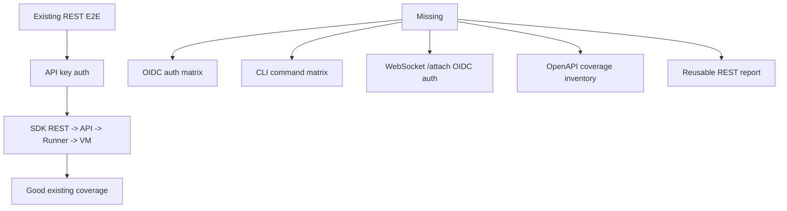
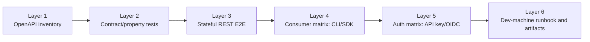
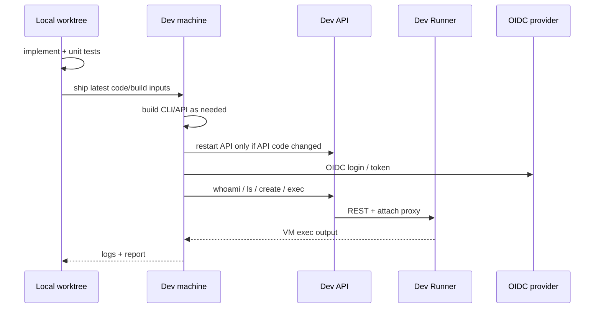

# REST API E2E and OIDC CLI Test Design

Date: 2026-06-16
Status: design approved; implementation pending
Target environment: dev

## Goal

Build a reusable REST API test system for BoxLite that covers:

- The public Box REST API contract in `openapi/box.openapi.yaml`.
- Existing REST E2E path: SDK/CLI -> API -> Runner -> VM.
- Both auth modes: API key and OIDC.
- The CLI command surface that maps onto REST behavior, including auth, list, create, run, exec, lifecycle, inspect, copy, pull/images, stats/logs, and info commands.
- The local CLI/OIDC failures observed on dev, especially stale `path_prefix` and WebSocket attach auth.
- A dev-machine execution path, so heavy builds and VM E2E do not run on the local Mac.

The outcome is not just a one-off bug fix. The outcome is a repeatable test workflow that future engineers can run and extend.

## Existing Assets

This work starts from existing coverage, not a blank slate.

| Area | Existing asset | Current role |
| --- | --- | --- |
| REST contract | `openapi/box.openapi.yaml` | Source of truth for public Box REST API. |
| Full REST E2E | `make test:e2e:setup`, `make test:e2e` | Exercises Python SDK REST -> NestJS API -> Runner -> VM. |
| Two-sided proof | `make test:e2e:two-sided` | Proves a regression test fails before a fix and passes after. |
| CLI auth tests | `src/cli/tests/auth.rs` | Stub-server tests for API-key login/whoami/status. |
| Dev/KVM runner path | `.github/workflows/e2e-local.yml`, `scripts/ci/setup-ci-runner.sh` | Existing pattern for running VM tests on a self-hosted EC2 runner. |
| Reference API | `openapi/reference-server` | Useful for contract/client checks, not production behavior. |

The main gap is that existing E2E fixtures are API-key only. They prove REST exists, but not REST x OIDC x CLI x WebSocket attach.

## Current Gap



The OIDC issue has two likely roots:

1. CLI profile `path_prefix` can become stale after the server-resolved principal changes. `auth login` caches it, but later `auth whoami` does not currently self-heal the stored profile.
2. `/attach` is handled by a raw WebSocket upgrade path. Nest guards do not run there, and the existing proxy authentication is API-key only. HTTP REST can pass with OIDC while exec streaming fails at attach time.

## Target Test Layers

Industry-standard API test systems usually split coverage by layer instead of relying on one large hand-written suite.



BoxLite mapping:

| Layer | BoxLite implementation |
| --- | --- |
| Inventory | Script compares `openapi/box.openapi.yaml` paths/operations against existing tests and produces a coverage table. |
| Contract | Schemathesis-style OpenAPI tests for request validation, response shape, and 4xx/5xx boundaries. |
| Stateful E2E | Extend `scripts/test/e2e` to support `AUTH=api-key` and `AUTH=oidc`. |
| CLI command matrix | Real CLI commands against dev/local E2E stack, from auth and list through create/run/exec/lifecycle/cp cleanup. |
| Auth matrix | Every critical route runs through both API key and OIDC where practical. |
| Dev runbook | One documented remote workflow for build, deploy/restart, test, log collection, and report. |

## CLI Command Matrix

The CLI suite must not be a single `whoami`/`ls` smoke. It should be a reusable command matrix that proves each user-facing CLI command still works when the runtime is REST-backed and when auth changes from API key to OIDC.

| Command group | Commands | Required mode | REST/API behavior proven |
| --- | --- | --- | --- |
| Auth | `auth status`, `auth whoami`, `auth login`, `auth logout` | API key + OIDC where practical | Credential source, `/v1/me`, profile persistence, stale `path_prefix` repair. |
| Discovery | `ls` / `list` / `ps`, `inspect`, `info` | API key + OIDC | List/get box, server health/config, auth context. |
| Create and run | `create`, `run` | API key + OIDC | Create box, image/options serialization, command startup. |
| Execution | `exec` | API key + OIDC | HTTP exec creation plus WebSocket/SSE attach and exit status/stdout. |
| Lifecycle | `start`, `stop`, `restart`, `rm` / `remove` | API key + OIDC | Box state transitions and cleanup. |
| Files | `cp` host-to-box and box-to-host | API key + OIDC | REST file upload/download path and tar handling. |
| Images | `pull`, `images` | API key + OIDC if supported by dev REST | Image pull/list behavior. |
| Observability | `stats`, `logs` | API key + OIDC if supported by REST-backed runtime | Metrics and console-log access. |
| Local-only | `serve`, `completion` | Separate local/parse tests | Not part of dev REST command matrix unless they map to deployed REST behavior. |

Minimum dev smoke remains small: `auth whoami`, `ls`, `create`/`run`, `exec echo hi`, `cp` roundtrip, and cleanup. The full reusable matrix should include all rows above and record skips with explicit reasons.

## Proposed Commands

These commands are the future clean interface. Some wrap existing targets; some are new.

```bash
make test:rest:inventory
make test:rest:contract
make test:rest:e2e AUTH=api-key
make test:rest:e2e AUTH=oidc
make test:rest:cli AUTH=api-key SCOPE=smoke
make test:rest:cli AUTH=oidc SCOPE=full
make test:rest:report
```

Command responsibilities:

| Command | Scope | Backing implementation |
| --- | --- | --- |
| `test:rest:inventory` | Static coverage table | New script over OpenAPI + test sources. |
| `test:rest:contract` | Contract/property tests | New Schemathesis-style runner or equivalent. |
| `test:rest:e2e AUTH=api-key` | Existing full REST chain | Wrapper around `make test:e2e`. |
| `test:rest:e2e AUTH=oidc` | New OIDC full REST chain | Extend `scripts/test/e2e/cases/conftest.py` and fixtures. |
| `test:rest:cli AUTH=api-key SCOPE=smoke` | API-key CLI command smoke | New CLI matrix runner against dev/local E2E stack. |
| `test:rest:cli AUTH=oidc SCOPE=full` | OIDC CLI command matrix | Same command runner, but using OIDC credentials and full command coverage. |
| `test:rest:report` | Aggregated evidence | New report writer, includes skipped endpoints and logs. |

## Dev Execution Strategy

The user confirmed this should run on dev, and the dev API may be restarted. However, dev is already deployed, so implementation must not start by running disruptive tests.

Execution order:

1. Build and test locally only for fast unit-level checks.
2. Do not run dev tests before code fixes and test entry points are ready.
3. When ready, build on the dev/development machine, not the local Mac.
4. Restart only the dev API when the API WebSocket/OIDC fix needs validation.
5. Do not restart Runner unless code changes require Runner validation.
6. Capture API logs, Runner logs, CLI output, pytest output, and generated report.



## Work Breakdown

### Phase 0: Baseline and inventory

- Confirm current worktree and existing tests.
- Generate REST endpoint inventory from OpenAPI.
- Map each endpoint to existing test files or mark as missing.
- Produce a first `rest-coverage.md` report.

### Phase 1: Fix OIDC/CLI root causes

- Add CLI profile self-heal for server-resolved `path_prefix`.
- Extend or reuse unit/integration tests around `auth whoami`.
- Extend API WebSocket attach auth to accept OIDC/JWT in addition to API keys.
- Keep API-key behavior unchanged.
- Add focused tests for the WebSocket auth path.

### Phase 2: Add reusable REST test entry points

- Add Make targets under the existing `make/test.mk` style.
- Add inventory/report scripts.
- Add contract test runner.
- Add auth matrix support to E2E fixtures.
- Add the reusable CLI command matrix runner with `SCOPE=smoke|full`.
- Cover `auth`, `ls/list/ps`, `create`, `run`, `exec`, `start`, `stop`, `restart`, `rm/remove`, `inspect`, `cp`, `pull`, `images`, `stats`, `logs`, and `info` where the command maps to deployed REST behavior.

### Phase 3: Dev validation

- Build latest CLI/API on the dev machine.
- Restart dev API only after the API patch is ready.
- Run API-key REST E2E.
- Run API-key CLI smoke.
- Run OIDC CLI command matrix.
- Run OIDC REST E2E subset/full suite depending on stability.
- Save logs and report.

### Phase 4: Documentation

- Add `docs/testing/rest-api-e2e.md`.
- Document prerequisites, dev-machine runbook, command matrix, common failures, and how to add a new case.
- Link the report format and expected artifacts.

## Responsibility Split

| Work | Owner |
| --- | --- |
| Repo investigation, design, implementation, tests | Codex |
| REST coverage inventory/report | Codex |
| CLI/OIDC path_prefix fix | Codex |
| API WebSocket OIDC attach fix | Codex |
| Dev-machine build and test run | Codex |
| Dev API restart when needed | Codex, allowed by user |
| OIDC login if browser/MFA/human action is required | User |
| Final product/PR review | User |

## Acceptance Criteria

- REST inventory report exists and lists covered/missing endpoints.
- API-key REST E2E still passes through the existing full path.
- OIDC `boxlite auth whoami` refreshes stale `path_prefix` when the server returns a different one.
- OIDC `boxlite ls` works against dev.
- OIDC `boxlite exec ... echo hi` returns stdout, proving HTTP exec and WebSocket attach both work.
- The CLI command matrix covers auth, discovery, create/run, exec, lifecycle, inspect, copy, pull/images, stats/logs, and info commands, or records an explicit skip reason.
- API-key attach behavior remains green.
- Dev validation produces logs and a reusable report.
- Documentation lets another engineer reproduce the run without reading this chat.

## Out of Scope

- Rebuilding dev before fixes are ready.
- Restarting Runner unless Runner code changes.
- Full production rollout.
- Rewriting the public REST API implementation to cover every OpenAPI endpoint in this task. Missing endpoint implementation can be filed separately after inventory.
