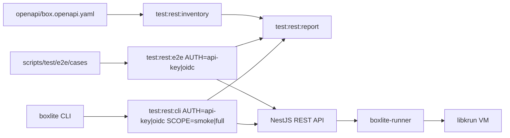
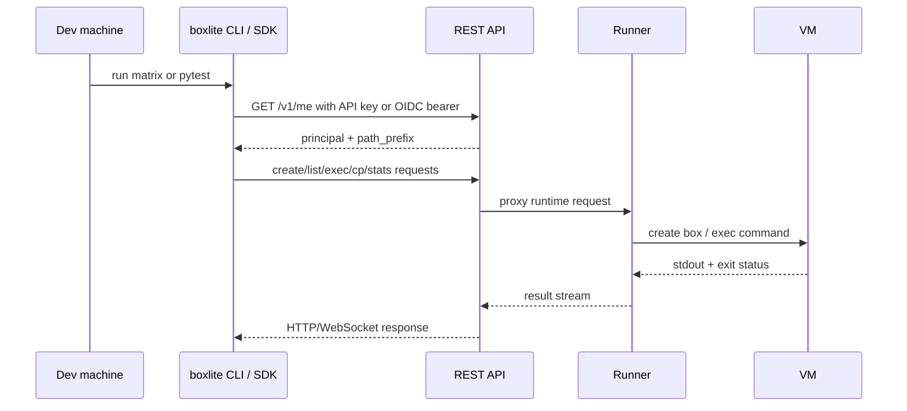

# REST API E2E Runbook

This runbook describes the reusable REST API test flow for BoxLite. It covers
the public REST contract, the existing SDK -> API -> Runner -> VM E2E suite,
the CLI command matrix, and the API-key/OIDC auth matrix.

## Test Stack



## What Already Exists

The suite under `scripts/test/e2e` is already REST-backed. It builds a Python
SDK REST client and verifies the path reaches the API and runner. It is not a
local FFI test suite.

The main gaps this flow closes are:

- static inventory against `openapi/box.openapi.yaml`;
- explicit API-key/OIDC auth mode selection for REST E2E;
- CLI command matrix against a REST API;
- explicit skips for commands or SDKs that are not REST-backed yet;
- one generated report directory under `target/rest-test-report`.

## Where To Run

Use the dev machine or CI runner for heavy commands. Do not run full REST E2E,
CLI integration, or `make test:apps` on a local laptop unless you explicitly
want local rebuilds.

Recommended narrow app test for local or Remote validation:

```bash
cd apps && yarn nx test api --testNamePattern BoxliteWsProxyService --runInBand
```

Full validation belongs on the dev machine:

```bash
make test:rest:e2e AUTH=api-key
make test:rest:e2e AUTH=oidc
make test:rest:cli AUTH=api-key SCOPE=smoke
make test:rest:cli AUTH=oidc SCOPE=full
```

## Auth Inputs

### API key

```bash
export BOXLITE_E2E_AUTH=api-key
export BOXLITE_E2E_API_KEY=<api-key>
export BOXLITE_E2E_API_URL=http://localhost:3000/api
```

For CLI matrix:

```bash
export BOXLITE_REST_URL=https://<api-host>/api
export BOXLITE_API_KEY=<api-key>
make test:rest:cli AUTH=api-key SCOPE=smoke
```

### OIDC

For REST E2E:

```bash
export BOXLITE_E2E_AUTH=oidc
export BOXLITE_E2E_OIDC_TOKEN=<access-token>
export BOXLITE_E2E_API_URL=http://localhost:3000/api
make test:rest:e2e AUTH=oidc
```

If `BOXLITE_E2E_OIDC_TOKEN` is not set, the E2E helper reads the stored OIDC
profile and runs `boxlite auth whoami` first so the CLI refresh path matches
real command behavior.

For CLI matrix, log in first or point at an existing OIDC profile. Keep
`BOXLITE_API_KEY` unset because it takes precedence over profile credentials.

```bash
unset BOXLITE_API_KEY
boxlite --profile dev-oidc --url https://<api-host>/api auth login --method browser
BOXLITE_PROFILE=dev-oidc make test:rest:cli AUTH=oidc SCOPE=full
```

Both REST E2E auth modes discover `path_prefix` from `/v1/me` by default. Use
`BOXLITE_E2E_PREFIX` only when you intentionally need to override discovery.

## Command Flow



## Checklist

1. Static inventory:

   ```bash
   make test:rest:inventory
   ```

2. Prepare local-stack E2E on the dev machine:

   ```bash
   make test:e2e:setup
   ```

3. Run API-key REST E2E:

   ```bash
   make test:rest:e2e AUTH=api-key
   ```

4. Prepare OIDC credentials:

   ```bash
   export BOXLITE_E2E_OIDC_TOKEN=<access-token>
   ```

5. Run OIDC REST E2E or a narrow attach smoke:

   ```bash
   make test:rest:e2e AUTH=oidc FILTER=attach
   ```

6. Run CLI matrix against dev:

   ```bash
   make test:rest:cli AUTH=api-key SCOPE=smoke
   make test:rest:cli AUTH=oidc SCOPE=full
   ```

7. Generate report:

   ```bash
   make test:rest:report
   ```

## Skip Policy

Skips must be explicit and documented in artifacts. Current intentional skips:

- `boxlite info`: local runtime/options, not REST-backed behavior.
- `boxlite logs`: local runtime console logs, not REST-backed stdout.
- `boxlite pull` and `boxlite images`: REST runtime does not support image ops.
- `boxlite remove`: no command exists; use `boxlite rm`.
- C/Go/Node E2E entry-point tests under `AUTH=oidc`: SDK smoke drivers expose
  API-key credential types today.

## Artifacts

All reusable artifacts are written under:

```text
target/rest-test-report/
```

Key files:

- `rest-inventory.md` and `rest-inventory.json`;
- `cli-matrix-<auth>-<scope>.log`;
- `cli-matrix-<auth>-<scope>.skips`;
- `cli-matrix-<auth>-<scope>.md`;
- `rest-report.md`.

## Operational Rules

- Prefer smoke before full matrix.
- Keep auth modes separate; never set `BOXLITE_API_KEY` for OIDC CLI tests.
- Use isolated `BOXLITE_HOME`/`BOXLITE_PROFILE` when testing credentials.
- Do not restart the dev API unless validating an API-side change that has
  already passed narrow tests.
- When API code changes, deploy or restart only the API surface needed for the
  validation, then rerun `AUTH=oidc` attach/exec coverage.
