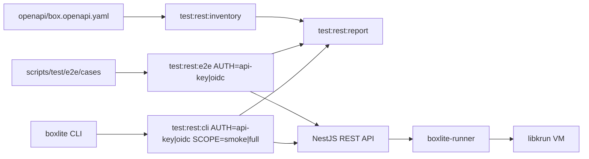
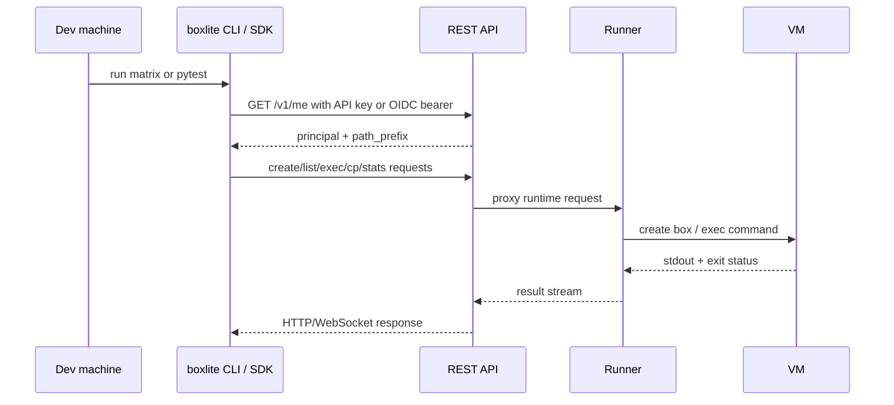

# REST API E2E 测试报告与运行手册

这份文档描述 BoxLite REST API 的可复用测试流程。覆盖范围包括公开
REST contract、现有 SDK -> API -> Runner -> VM 的 E2E 套件、CLI 命令矩阵，
以及 API key / OIDC 两种认证方式。

## 测试栈



## 现有基础

`scripts/test/e2e` 里的套件本来就是 REST-backed。它会构造 Python SDK
REST client，并验证请求确实到达 API 和 Runner。它不是 local FFI 测试。

这次补齐的缺口是：

- 基于 `openapi/box.openapi.yaml` 做静态覆盖盘点；
- REST E2E 明确支持 `AUTH=api-key` 和 `AUTH=oidc`；
- 增加面向 REST API 的 CLI 命令矩阵；
- 对当前还不是 REST-backed 的命令或 SDK 入口做显式 skip；
- 统一把产物写到 `target/rest-test-report`。

## 运行位置

重测试放开发机或 CI runner。不要在本机跑完整 REST E2E、CLI integration，
也不要跑 `make test:apps`，除非你明确想触发本机重构建。

本机或 Remote 上推荐的窄测命令：

```bash
cd apps && yarn nx test api --testNamePattern BoxliteWsProxyService --runInBand
```

完整验证放开发机：

```bash
make test:rest:e2e AUTH=api-key
make test:rest:e2e AUTH=oidc
make test:rest:cli AUTH=api-key SCOPE=smoke
make test:rest:cli AUTH=oidc SCOPE=full
```

## 认证输入

### API key

REST E2E：

```bash
export BOXLITE_E2E_AUTH=api-key
export BOXLITE_E2E_API_KEY=<api-key>
export BOXLITE_E2E_API_URL=http://localhost:3000/api
make test:rest:e2e AUTH=api-key
```

CLI 矩阵：

```bash
export BOXLITE_REST_URL=https://<api-host>/api
export BOXLITE_API_KEY=<api-key>
make test:rest:cli AUTH=api-key SCOPE=smoke
```

### OIDC

REST E2E：

```bash
export BOXLITE_E2E_AUTH=oidc
export BOXLITE_E2E_OIDC_TOKEN=<access-token>
export BOXLITE_E2E_API_URL=http://localhost:3000/api
make test:rest:e2e AUTH=oidc
```

如果没有设置 `BOXLITE_E2E_OIDC_TOKEN`，E2E helper 会读取本地 OIDC profile，
并先执行 `boxlite auth whoami`，这样 token refresh 行为和真实 CLI 命令保持一致。

CLI 矩阵需要先登录 OIDC，或指向已经登录过的 profile。跑 OIDC 时必须保持
`BOXLITE_API_KEY` 未设置，因为它优先级高于 profile credentials。

```bash
unset BOXLITE_API_KEY
boxlite --profile dev-oidc --url https://<api-host>/api auth login --method browser
BOXLITE_PROFILE=dev-oidc make test:rest:cli AUTH=oidc SCOPE=full
```

两种 REST E2E 认证模式默认都会通过 `/v1/me` 发现 `path_prefix`。只有需要
刻意覆盖服务端发现结果时，才设置 `BOXLITE_E2E_PREFIX`。

## 请求链路



## 检查清单

1. 静态覆盖盘点：

   ```bash
   make test:rest:inventory
   ```

2. 在开发机准备本地 E2E stack：

   ```bash
   make test:e2e:setup
   ```

3. 跑 API-key REST E2E：

   ```bash
   make test:rest:e2e AUTH=api-key
   ```

4. 准备 OIDC 凭证：

   ```bash
   export BOXLITE_E2E_OIDC_TOKEN=<access-token>
   ```

5. 跑 OIDC REST E2E，或只跑 attach 窄测：

   ```bash
   make test:rest:e2e AUTH=oidc FILTER=attach
   ```

6. 在 dev 上跑 CLI 矩阵：

   ```bash
   make test:rest:cli AUTH=api-key SCOPE=smoke
   make test:rest:cli AUTH=oidc SCOPE=full
   ```

7. 生成聚合报告：

   ```bash
   make test:rest:report
   ```

## Skip 规则

Skip 必须显式写入产物。当前有意 skip 的范围：

- `boxlite info`：报告本地 runtime/options，不是 REST-backed 行为。
- `boxlite logs`：读取本地 runtime console logs，不是 REST-backed stdout。
- `boxlite pull` 和 `boxlite images`：REST runtime 目前不支持 image ops。
- `boxlite remove`：不存在这个命令，正确命令是 `boxlite rm`。
- `AUTH=oidc` 下的 C/Go/Node E2E 入口测试：这些 SDK smoke driver 目前只暴露
  API-key credential 类型。

## 产物

所有可复用产物都写到：

```text
target/rest-test-report/
```

关键文件：

- `rest-inventory.md` 和 `rest-inventory.json`;
- `cli-matrix-<auth>-<scope>.log`;
- `cli-matrix-<auth>-<scope>.skips`;
- `cli-matrix-<auth>-<scope>.md`;
- `rest-report.md`.

## 操作原则

- 先跑 smoke，再跑 full matrix。
- 认证模式必须隔离；OIDC CLI 测试时不要设置 `BOXLITE_API_KEY`。
- 测 credentials 时使用隔离的 `BOXLITE_HOME` / `BOXLITE_PROFILE`。
- 不要随便重启 dev API；只有验证 API-side 改动且窄测通过后再重启。
- API 代码改动后，只部署或重启需要验证的 API surface，然后重跑
  `AUTH=oidc` 的 attach/exec 覆盖。
