# BoxLite VM Creation and Execution Flow

Complete workflow diagram from user code to VM execution.

## Complete Flow Diagram

```mermaid
graph TD
    %% Entry Point - Python User Code
    A["<b>USER CODE</b><br/>examples/python/lifecycle_example.py<br/><br/>runtime = boxlite.Boxlite.default()<br/>box = runtime.create(BoxOptions(image='alpine'))<br/>execution = await box.exec('echo', ['Hello'])<br/>result = await execution.wait()"]

    %% PyO3 Bindings Layer
    A --> B["<b>PyO3: PyBoxlite::default()</b><br/>sdks/python/src/runtime.rs:20-40<br/><br/>let runtime = BoxliteRuntime::default_runtime();<br/>Ok(Self { runtime: Arc::new(runtime.clone()) })"]

    B --> C["<b>BoxliteRuntime::default_runtime()</b><br/>boxlite/src/runtime/core.rs:46-51<br/><br/>DEFAULT_RUNTIME.get_or_init(||<br/>  Self::new(BoxliteOptions::default()))<br/>Returns: &'static BoxliteRuntime"]

    %% Runtime Initialization
    C --> D["<b>RuntimeImpl::new()</b><br/>boxlite/src/runtime/rt_impl.rs:86-189<br/><br/>1. Validate home_dir is absolute<br/>2. FilesystemLayout::prepare() → ~/.boxlite/<br/>3. RuntimeLock::acquire() → lockfile<br/>4. Database::open() → SQLite<br/>5. ImageManager::new()<br/>6. BoxManager::new()<br/>7. recover_boxes() from DB"]

    D --> E["<b>FilesystemLayout Structure</b><br/>boxlite/src/layout/mod.rs<br/><br/>~/.boxlite/<br/>├── images/ (OCI cache)<br/>├── boxes/{id}/ (per-box data)<br/>├── db/ (SQLite)<br/>├── locks/ (lockfiles)<br/>├── logs/<br/>└── temp/"]

    %% Box Creation
    E --> F["<b>PyBoxlite::create()</b><br/>sdks/python/src/runtime.rs:42-58<br/><br/>let handle = self.runtime.create(<br/>  options.into(), name<br/>).map_err(map_err)?;<br/>Ok(PyBox { handle: Arc::new(handle) })"]

    F --> G["<b>RuntimeImpl::create()</b><br/>boxlite/src/runtime/rt_impl.rs:257-287<br/><br/>let config = BoxConfig {<br/>  id: BoxID::from(ulid()),<br/>  name, options, ...<br/>};<br/>let box_impl = Arc::new(BoxImpl::new(...));<br/>// VM NOT started yet - lazy init"]

    G --> H["<b>BoxImpl::new()</b><br/>boxlite/src/litebox/box_impl.rs:103-119<br/><br/>Self {<br/>  config, state,<br/>  runtime,<br/>  is_shutdown: AtomicBool::new(false),<br/>  live: OnceCell::new() // ← Empty!<br/>}"]

    %% Execution Triggers Lazy Init
    H --> I["<b>PyBox::exec()</b><br/>sdks/python/src/box_handle.rs:31-63<br/><br/>let handle = Arc::clone(&self.handle);<br/>pyo3_async_runtimes::tokio::future_into_py(<br/>  handle.exec(cmd).await<br/>)"]

    I --> J["<b>BoxImpl::exec()</b><br/>boxlite/src/litebox/box_impl.rs:142-176<br/><br/>// ← LAZY INIT HAPPENS HERE<br/>let live = self.live_state().await?;<br/><br/>let mut exec_interface =<br/>  live.guest_session.execution().await?;<br/>exec_interface.exec(command).await?"]

    J --> K["<b>BoxImpl::live_state()</b><br/>boxlite/src/litebox/box_impl.rs:211-219<br/><br/>self.live.get_or_try_init(||<br/>  async { self.init_live_state().await }<br/>).await<br/><br/>// Calls BoxBuilder::build()"]

    %% Init Pipeline
    K --> L["<b>BoxBuilder::build()</b><br/>boxlite/src/litebox/init/mod.rs:59-97<br/><br/>let plan = get_execution_plan(status);<br/>let executor = PipelineExecutor::new(plan);<br/>executor.execute(ctx).await?;<br/><br/>Returns: LiveState"]

    L --> M["<b>get_execution_plan()</b><br/>boxlite/src/litebox/init/mod.rs:102-167<br/><br/>match status {<br/>  Starting/Stopped → Full init pipeline<br/>  Running → Reattach only<br/>}<br/><br/>5 Phases (sequential stages)"]

    %% Phase 1: Filesystem
    M --> N["<b>PHASE 1: FilesystemTask</b><br/>init/tasks/filesystem.rs<br/><br/>let box_home = ~/.boxlite/boxes/{id};<br/>std::fs::create_dir_all(&box_home)?;<br/>let layout = BoxFilesystemLayout::new(box_home);<br/>layout.prepare()?;<br/><br/>Creates: image/, rw/, rootfs/, socket, ready_socket"]

    %% Phase 2: Parallel Rootfs Prep
    N --> O1["<b>PHASE 2A: ContainerRootfsTask</b><br/>init/tasks/container_rootfs.rs<br/><br/>1. image_manager.pull(image_ref).await?<br/>   → Download OCI image<br/>2. extract_layers(&manifest, &container_img_dir)<br/>   → Extract to ~/.boxlite/boxes/{id}/image/<br/>3. Disk::create_qcow2(disk_path, backing, 512MB)<br/>   → Create COW disk"]

    N --> O2["<b>PHASE 2B: GuestRootfsTask</b><br/>init/tasks/guest_rootfs.rs<br/><br/>let guest_rootfs =<br/>  runtime.guest_rootfs.get_or_try_init(||<br/>    GuestRootfs::new(&runtime.layout)<br/>  ).await?;<br/><br/>Disk::create_qcow2(guest_disk_path,<br/>  guest_rootfs.rootfs_dir(), 1024MB)"]

    O1 --> P
    O2 --> P

    %% Phase 3: VMM Spawn
    P["<b>PHASE 3: VmmSpawnTask</b><br/>init/tasks/vmm_spawn.rs:31-116"]

    P --> Q["<b>build_config()</b><br/>vmm_spawn.rs:128-291<br/><br/>let transport = Transport::unix(socket_path);<br/>let ready_transport = Transport::unix(ready_socket);<br/>let volume_mgr = GuestVolumeManager::new();<br/>volume_mgr.add_fs_share(SHARED, shared_dir, ...);<br/><br/>InstanceSpec { vcpu_count, mem_size_mb,<br/>  container_disk_path, guest_disk_path,<br/>  volumes, network, env, ... }"]

    Q --> R["<b>spawn_vm()</b><br/>vmm_spawn.rs:293-304<br/><br/>let shim_path = find_binary('boxlite-shim')?;<br/>let mut controller = ShimController::new(shim_path);<br/>let handler = controller.start(instance_spec).await?;<br/><br/>Returns: Box&lt;dyn VmmHandler&gt; (PID, stop())"]

    R --> S["<b>ShimController::start()</b><br/>vmm/controller/shim.rs:40-75<br/><br/>let child = tokio::process::Command::new(&shim_path)<br/>  .args(spec.to_args())<br/>  .spawn()?;<br/><br/>let pid = child.id()?;<br/>Returns: ShimHandler { pid, child }"]

    S --> T["<b>boxlite-shim (subprocess)</b><br/>boxlite/src/bin/shim.rs<br/><br/>let spec = InstanceSpec::from_args()?;<br/>let ctx = KrunContext::new(&spec)?;<br/><br/>// ← libkrun process takeover<br/>unsafe { ctx.start_enter() };<br/><br/>VM starts, guest boots, boxlite-guest daemon starts"]

    T --> U["<b>boxlite-guest daemon</b><br/>guest/src/main.rs<br/><br/>Runs inside VM<br/>Starts gRPC server on vsock/unix socket<br/>Listens for: ExecRequest, InitRequest, etc.<br/><br/>When ready: connects to ready_socket"]

    %% Phase 4: Guest Connect
    U --> V["<b>PHASE 4: GuestConnectTask</b><br/>init/tasks/guest_connect.rs:20-56<br/><br/>wait_for_guest_ready(&ready_transport).await?;<br/><br/>// Wait for guest connection (30s timeout)<br/>let listener = UnixListener::bind(ready_socket_path)?;<br/>let (_stream, _addr) = listener.accept().await?;<br/><br/>guest_session = GuestSession::new(transport);"]

    V --> W["<b>GuestSession::new()</b><br/>portal/session.rs:17-42<br/><br/>Self {<br/>  connection: Connection::new(transport)<br/>}<br/><br/>// Lazy - doesn't connect yet<br/>pub async fn execution() →<br/>  ExecutionInterface::new(channel)"]

    %% Phase 5: Guest Init
    W --> X["<b>PHASE 5: GuestInitTask</b><br/>init/tasks/guest_init.rs:20-84<br/><br/>run_guest_init(<br/>  guest_session,<br/>  container_image_config,<br/>  container_id, volume_mgr,<br/>  rootfs_init, container_mounts<br/>).await?"]

    X --> Y["<b>run_guest_init()</b><br/>guest_init.rs:95-138<br/><br/>// Step 1: Guest Init<br/>let guest_init_config = GuestInitConfig {<br/>  volumes: guest_volumes,<br/>  network: NetworkInitConfig { ... }<br/>};<br/>guest_interface.init(guest_init_config).await?;<br/><br/>// Step 2: Container Init<br/>container_interface.init(<br/>  container_id, image_config,<br/>  rootfs_init, mounts<br/>).await?"]

    Y --> Z["<b>LiveState Created</b><br/>litebox/box_impl.rs:75-92<br/><br/>LiveState {<br/>  handler: VmmHandler (PID, stop()),<br/>  guest_session: GuestSession,<br/>  metrics: BoxMetricsStorage,<br/>  _container_rootfs_disk: Disk,<br/>  guest_rootfs_disk: Option&lt;Disk&gt;<br/>}<br/><br/>Stored in: BoxImpl.live (OnceCell)"]

    %% Exec Flow
    Z --> AA["<b>ExecutionInterface::exec()</b><br/>portal/interfaces/exec.rs:38-83<br/><br/>// Create I/O channels<br/>let (stdin_tx, stdin_rx) = mpsc::unbounded_channel();<br/>let (stdout_tx, stdout_rx) = mpsc::unbounded_channel();<br/>let (result_tx, result_rx) = mpsc::unbounded_channel();<br/><br/>// Send gRPC ExecRequest<br/>let exec_response = self.client.exec(request).await?;<br/>let execution_id = exec_response.execution_id;"]

    AA --> AB["<b>Spawn Background Tasks</b><br/>portal/interfaces/exec.rs:141-211<br/><br/>spawn_stdin(client, exec_id, stdin_rx);<br/>  → Pumps stdin_rx to gRPC stream<br/><br/>spawn_attach(client, exec_id, stdout_tx, stderr_tx);<br/>  → Receives gRPC streams, fanout to channels<br/><br/>spawn_wait(client, exec_id, result_tx);<br/>  → Waits for exit code, sends to result_rx"]

    AB --> AC["<b>Guest Receives ExecRequest</b><br/>guest/src/server/execution.rs<br/><br/>Receives gRPC call<br/>Runs command via OCI runtime (runc/crun)<br/>Streams stdout/stderr back to host<br/>Sends exit code on completion"]

    AC --> AD["<b>Execution Returned</b><br/>litebox/exec.rs:1-244<br/><br/>Ok(Execution {<br/>  id: execution_id,<br/>  inner: ExecutionInner {<br/>    interface,<br/>    result_rx,<br/>    stdin: Some(ExecStdin),<br/>    stdout: Some(ExecStdout),<br/>    stderr: Some(ExecStderr)<br/>  }<br/>})"]

    AD --> AE["<b>PyExecution Returned</b><br/>sdks/python/src/execution.rs<br/><br/>PyExecution {<br/>  execution: Arc&lt;Execution&gt;<br/>}<br/><br/>#[pymethods]<br/>fn wait() → PyResult&lt;PyExecResult&gt;<br/>fn stdout() → Option&lt;PyExecStdout&gt;<br/>fn stdin() → Option&lt;PyExecStdin&gt;"]

    %% User Consumes Result
    AE --> AF["<b>User Awaits Result</b><br/>examples/python/lifecycle_example.py<br/><br/>result = await execution.wait()<br/>print(result.exit_code)<br/>print(result.stdout)<br/>print(result.stderr)<br/><br/>// Stream stdout<br/>async for line in execution.stdout():<br/>    print(line)"]

    %% Styling
    classDef pythonNode fill:#3776ab,stroke:#23527c,color:#fff
    classDef rustNode fill:#ce422b,stroke:#a33520,color:#fff
    classDef vmNode fill:#00758f,stroke:#005f73,color:#fff
    classDef guestNode fill:#6a9955,stroke:#4d7c3d,color:#fff
    classDef initNode fill:#f39c12,stroke:#d68910,color:#000

    class A,I,AE,AF pythonNode
    class B,C,D,F,G,H,J,K,L,M rustNode
    class N,O1,O2,P,Q,X,Y initNode
    class R,S,T vmNode
    class U,V,W,Z,AA,AB,AC,AD guestNode
```

## Legend

- **Blue nodes**: Python layer (PyO3 bindings, user code)
- **Red nodes**: Rust runtime core
- **Orange nodes**: Initialization pipeline tasks
- **Teal nodes**: VM/hypervisor layer
- **Green nodes**: Guest communication and execution

## Key Phases

### 1. Runtime Initialization (Once per process)
- `BoxliteRuntime::default_runtime()` creates singleton
- Sets up `~/.boxlite/` directory structure
- Opens SQLite database for persistence
- Acquires runtime lock for multi-process safety

### 2. Box Creation (Lazy - config only)
- `runtime.create()` returns `LiteBox` immediately
- VM is **NOT** started yet
- Only creates `BoxConfig` and `BoxState`

### 3. Lazy VM Initialization (On first `exec()`)
- 5-phase pipeline with sequential stages and parallel tasks
- **Phase 1**: Filesystem setup
- **Phase 2**: Parallel rootfs preparation (container + guest)
- **Phase 3**: Build config and spawn VM (boxlite-shim subprocess)
- **Phase 4**: Wait for guest ready and connect gRPC portal
- **Phase 5**: Initialize guest (volumes, network, container)

### 4. Execution (gRPC host-guest communication)
- `ExecutionInterface::exec()` sends gRPC request
- Background tasks pump stdin, attach stdout/stderr, wait for exit
- User gets `Execution` handle with async streams

### 5. Result Consumption (Python async)
- User awaits `execution.wait()` for exit code
- User iterates `execution.stdout()` for output stream
- Clean async/await API from Python

## File Reference

| Component | File Path |
|-----------|-----------|
| Python Entry | `examples/python/lifecycle_example.py` |
| PyO3 Runtime | `sdks/python/src/runtime.rs` |
| PyO3 Box | `sdks/python/src/box_handle.rs` |
| Rust Runtime | `boxlite/src/runtime/core.rs` |
| RuntimeImpl | `boxlite/src/runtime/rt_impl.rs` |
| BoxImpl | `boxlite/src/litebox/box_impl.rs` |
| Init Pipeline | `boxlite/src/litebox/init/mod.rs` |
| Filesystem Task | `boxlite/src/litebox/init/tasks/filesystem.rs` |
| Container Rootfs | `boxlite/src/litebox/init/tasks/container_rootfs.rs` |
| Guest Rootfs | `boxlite/src/litebox/init/tasks/guest_rootfs.rs` |
| VMM Spawn | `boxlite/src/litebox/init/tasks/vmm_spawn.rs` |
| Guest Connect | `boxlite/src/litebox/init/tasks/guest_connect.rs` |
| Guest Init | `boxlite/src/litebox/init/tasks/guest_init.rs` |
| Execution | `boxlite/src/litebox/exec.rs` |
| Execution Interface | `boxlite/src/portal/interfaces/exec.rs` |
| Guest Session | `boxlite/src/portal/session.rs` |
| Connection | `boxlite/src/portal/connection.rs` |
| ShimController | `boxlite/src/vmm/controller/shim.rs` |
| Shim Binary | `boxlite/src/bin/shim.rs` |
| Guest Daemon | `guest/src/main.rs` |

## Critical Design Patterns

1. **Lazy Initialization**: VM only starts when `exec()` is first called
2. **OnceCell Pattern**: `LiveState` initialized exactly once via `OnceCell::get_or_try_init()`
3. **Pipeline Architecture**: Table-driven execution plans with sequential stages and parallel tasks
4. **Arc + RwLock**: Thread-safe shared state for active boxes
5. **gRPC Streaming**: Bidirectional streams for stdin/stdout/stderr
6. **Background Tasks**: Tokio tasks pump I/O between channels and gRPC streams
7. **Persistence**: SQLite stores box metadata, supports crash recovery
