# BoxLite VM 创建完整流程

本文档详细描述了 BoxLite 从用户调用 API 到 VM 启动运行的完整流程。

## 目录

1. [架构概览](#1-架构概览)
2. [核心组件](#2-核心组件)
3. [Runtime 初始化](#3-runtime-初始化)
4. [Box 创建流程](#4-box-创建流程)
5. [懒初始化机制](#5-懒初始化机制)
6. [BoxBuilder 流水线](#6-boxbuilder-流水线)
7. [Shim 进程架构](#7-shim-进程架构)
8. [libkrun 详解](#8-libkrun-详解)
   - [8.1 什么是 libkrun](#81-什么是-libkrun)
   - [8.2 libkrun 内部架构](#82-libkrun-内部架构)
   - [8.3 进程接管机制](#83-进程接管机制)
   - [8.4 核心 FFI API](#84-核心-ffi-api)
   - [8.5 BoxLite 封装层次](#85-boxlite-封装层次)
   - [8.6 KrunContext 封装](#86-kruncontext-封装)
   - [8.7 virtiofs 文件共享](#87-virtiofs-文件共享)
   - [8.8 vsock 通信桥接](#88-vsock-通信桥接)
   - [8.9 块设备与 QCOW2 支持](#89-块设备与-qcow2-支持)
   - [8.10 网络后端](#810-网络后端)
   - [8.11 与其他虚拟化方案对比](#811-与其他虚拟化方案对比)
   - [8.12 引擎集成流程](#812-引擎集成流程)
   - [8.13 libkrun VM 生命周期管理代码](#813-libkrun-vm-生命周期管理代码)
     - [8.13.1 FFI 绑定层](#8131-ffi-绑定层-libkrun-sys)
     - [8.13.2 Rust 封装层](#8132-rust-封装层-kruncontext)
     - [8.13.3 引擎层](#8133-引擎层-krun)
     - [8.13.4 VM 生命周期流程](#8134-vm-生命周期流程)
     - [8.13.5 关键文件索引](#8135-关键文件索引)
     - [8.13.6 生命周期状态映射](#8136-生命周期状态映射)
9. [Guest Agent 启动](#9-guest-agent-启动)
10. [Host-Guest 通信](#10-host-guest-通信)
11. [完整时序图](#11-完整时序图)
12. [关键文件索引](#12-关键文件索引)

---

## 1. 架构概览

BoxLite 采用分层架构，通过 Shim 子进程隔离实现轻量级虚拟化：

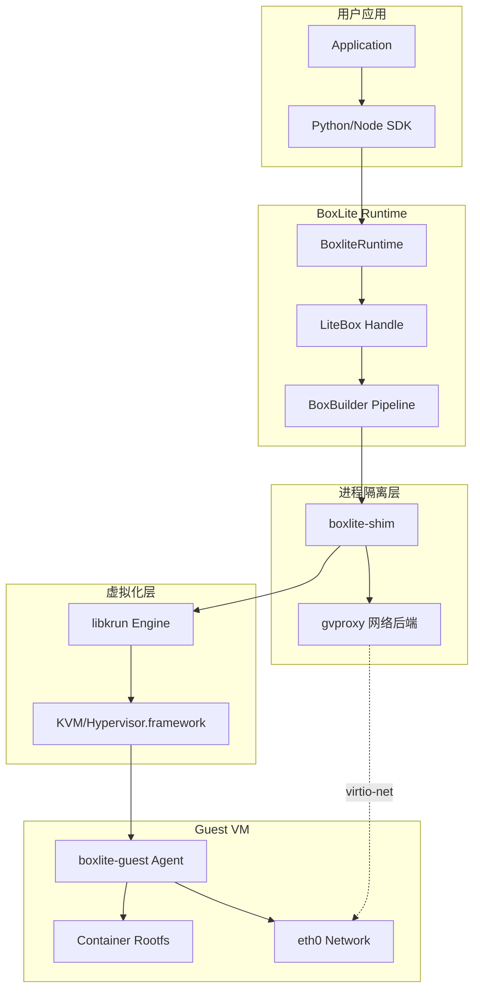

### 设计理念

- **"SQLite for Sandboxing"**: 嵌入式库，无需 daemon 或 root 权限
- **进程隔离**: Shim 子进程防止 libkrun 进程接管影响主进程
- **懒初始化**: Box 句柄立即返回，实际 VM 启动延迟到首次使用
- **Copy-on-Write**: QCOW2 磁盘实现写时复制，支持快速重启

---

## 2. 核心组件

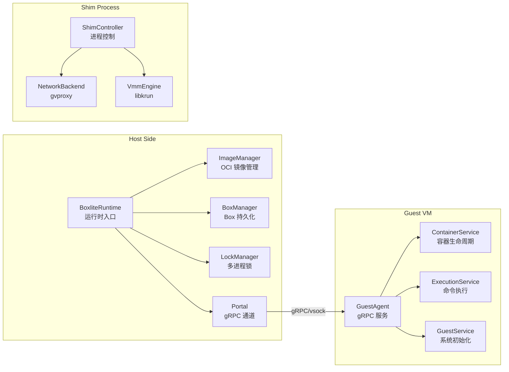

### 组件职责

| 组件 | 职责 | 位置 |
|------|------|------|
| BoxliteRuntime | 用户 API 入口，管理 Box 生命周期 | `boxlite/src/runtime/core.rs` |
| ImageManager | OCI 镜像拉取、缓存、层提取 | `boxlite/src/images/manager.rs` |
| BoxManager | Box 配置持久化 (SQLite) | `boxlite/src/db/` |
| BoxBuilder | 初始化流水线编排 | `boxlite/src/litebox/init/mod.rs` |
| ShimController | Shim 子进程生命周期管理 | `boxlite/src/vmm/shim/` |
| GuestAgent | VM 内部 gRPC 服务端 | `guest/src/` |

---

## 3. Runtime 初始化

当调用 `BoxliteRuntime::new(options)` 时：

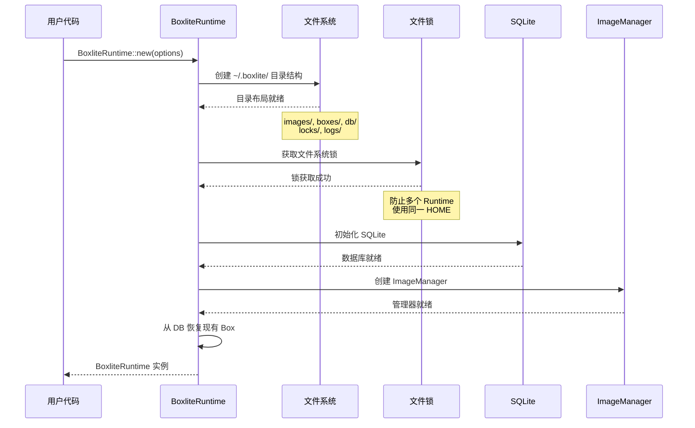

### 目录结构

```
~/.boxlite/
├── images/           # OCI 镜像缓存
│   ├── {digest}.tar.gz  # 层压缩包
│   └── {digest}/        # 解压后的层
├── boxes/            # 每个 Box 的数据
│   └── {box_id}/
│       ├── root.qcow2   # 容器 rootfs COW 磁盘
│       ├── guest.qcow2  # Guest rootfs COW 磁盘
│       ├── socket/      # Unix socket 目录
│       └── shared/      # virtiofs 共享目录
├── db/               # SQLite 数据库
├── locks/            # 实体级别锁文件
└── logs/             # 日志文件
```

---

## 4. Box 创建流程

`runtime.create()` 返回一个轻量级句柄，实际 VM 启动是懒加载的：

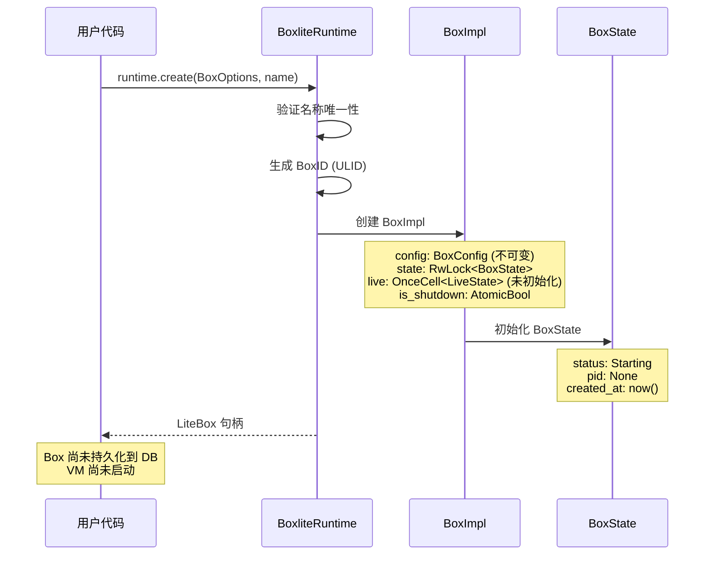

### BoxOptions 关键配置

```rust
pub struct BoxOptions {
    pub image: Option<String>,      // OCI 镜像引用
    pub rootfs: Option<PathBuf>,    // 或直接指定 rootfs 路径
    pub cpus: Option<u32>,          // CPU 数量 (默认 4)
    pub memory_mb: Option<u32>,     // 内存大小 (默认 4096MB)
    pub disk_size_gb: Option<u32>,  // 磁盘大小
    pub volumes: Vec<VolumeMount>,  // 卷挂载
    pub port_mappings: Vec<PortMapping>, // 端口映射
    pub env: HashMap<String, String>,    // 环境变量
    pub workdir: Option<String>,    // 工作目录
}
```

---

## 5. 懒初始化机制

Box 的实际初始化延迟到首次 API 调用：

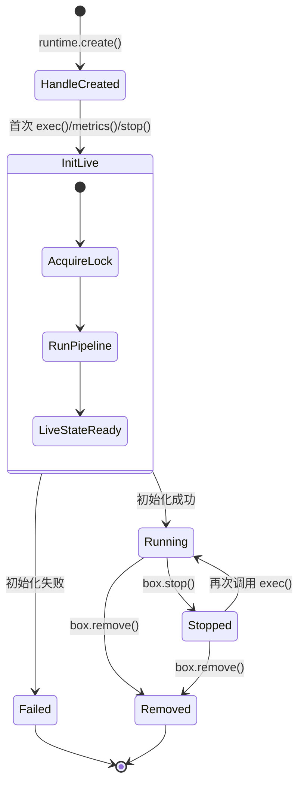

### OnceCell 模式

```rust
pub struct BoxImpl {
    config: BoxConfig,                    // 不可变配置
    state: RwLock<BoxState>,              // 可变状态
    live: OnceCell<LiveState>,            // 懒初始化的运行时状态
    is_shutdown: AtomicBool,              // 关闭标志
}

impl BoxImpl {
    async fn ensure_live(&self) -> BoxliteResult<&LiveState> {
        self.live.get_or_try_init(|| async {
            // 执行完整初始化流水线
            BoxBuilder::new(...).build().await
        }).await
    }
}
```

---

## 6. BoxBuilder 流水线

BoxBuilder 根据 BoxStatus 执行不同的初始化计划：

```mermaid
graph TB
    subgraph "Starting (新建 Box)"
        S1[Stage 1: FilesystemTask<br/>创建目录布局]
        S2a[ContainerRootfsTask<br/>拉取镜像, 创建 COW 磁盘]
        S2b[GuestRootfsTask<br/>准备 Guest rootfs]
        S3[Stage 3: VmmSpawnTask<br/>构建配置, 启动 Shim]
        S4[Stage 4: GuestConnectTask<br/>等待 Guest 就绪]
        S5[Stage 5: GuestInitTask<br/>初始化容器]

        S1 --> S2a
        S1 --> S2b
        S2a --> S3
        S2b --> S3
        S3 --> S4
        S4 --> S5
    end

    subgraph "Stopped (重启 Box)"
        R1[FilesystemTask<br/>加载现有布局]
        R2a[ContainerRootfsTask<br/>复用现有 COW 磁盘]
        R2b[GuestRootfsTask<br/>复用现有 COW 磁盘]
        R3[VmmSpawnTask<br/>启动新 VM 进程]
        R4[GuestConnectTask<br/>等待 Guest 就绪]
        R5[GuestInitTask<br/>重新初始化容器]

        R1 --> R2a
        R1 --> R2b
        R2a --> R3
        R2b --> R3
        R3 --> R4
        R4 --> R5
    end

    subgraph "Running (重连 Box)"
        A1[VmmAttachTask<br/>附加到运行中的 VM]
        A2[GuestConnectTask<br/>重连 Guest]

        A1 --> A2
    end
```

### 各阶段详细任务

#### Stage 1: FilesystemTask

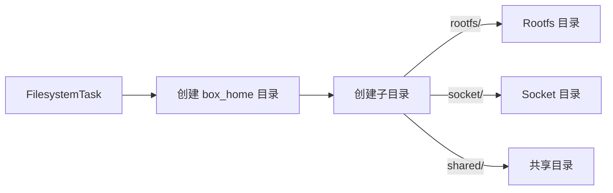

#### Stage 2: ContainerRootfsTask (并行)

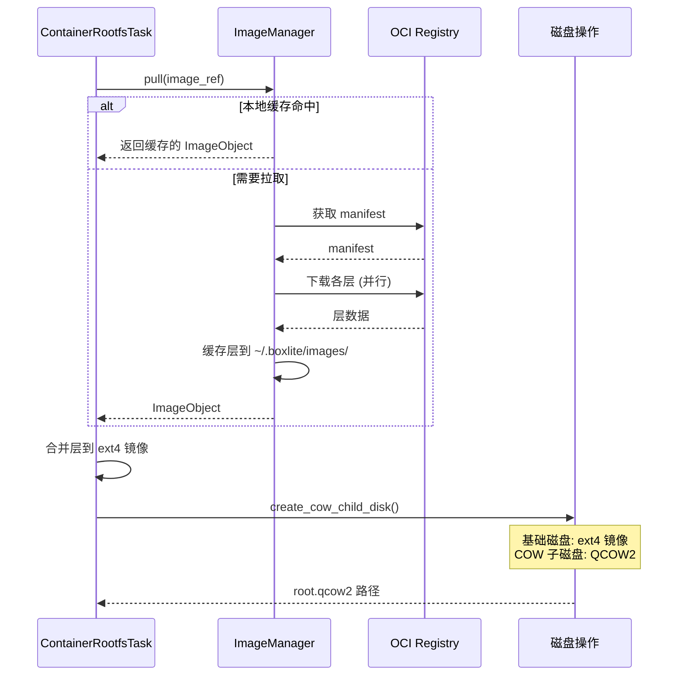

#### Stage 3: VmmSpawnTask

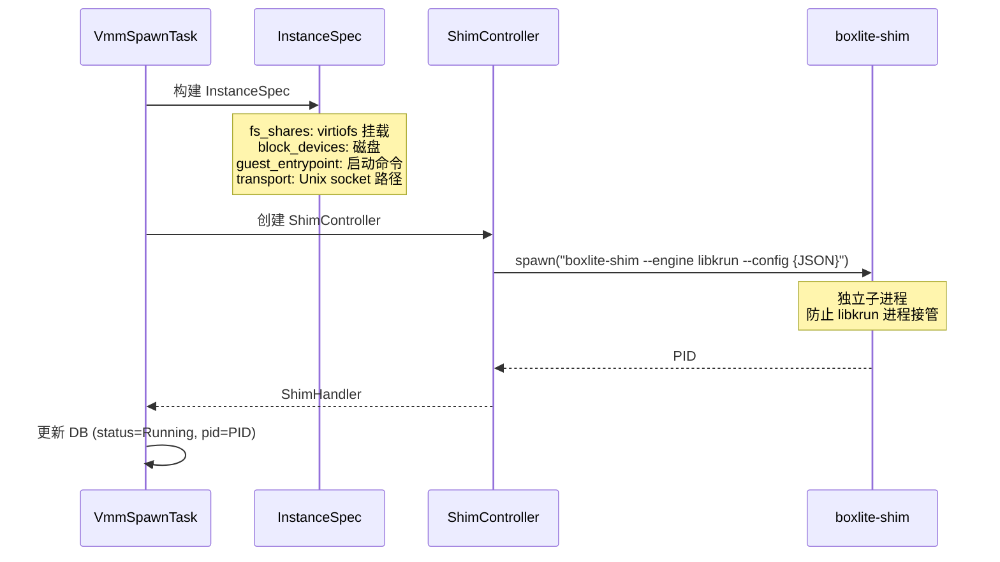

#### Stage 4: GuestConnectTask

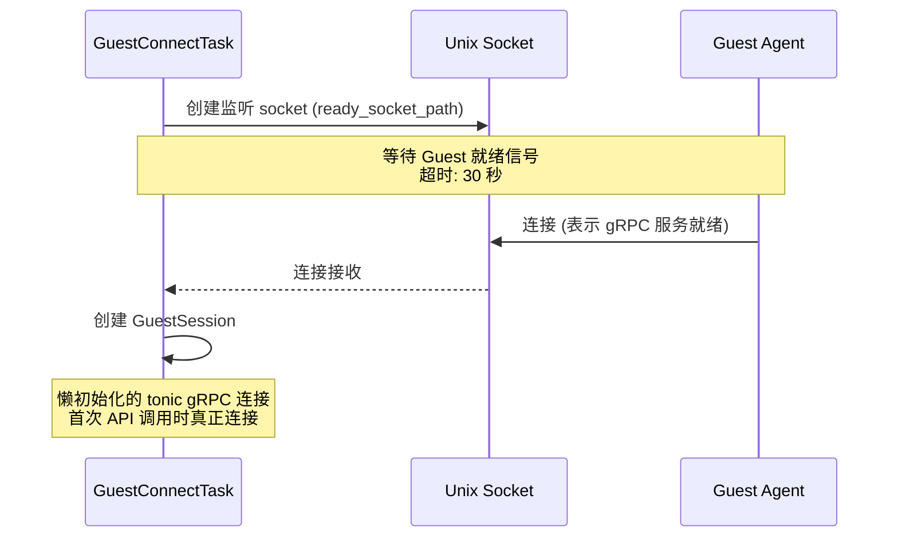

#### Stage 5: GuestInitTask

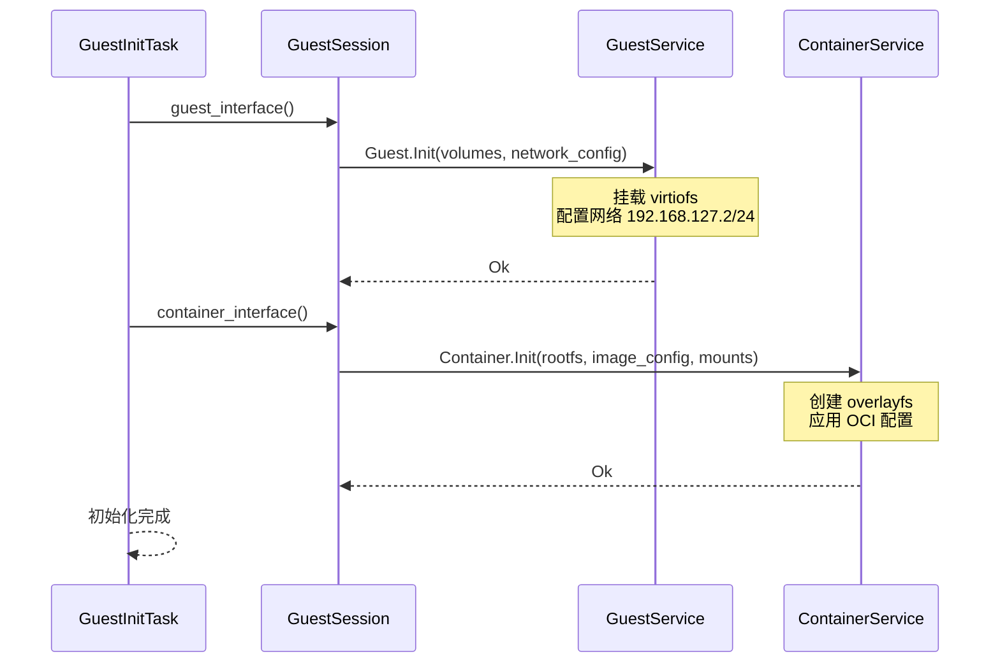

---

## 7. Shim 进程架构

Shim 子进程是实现进程隔离的关键：

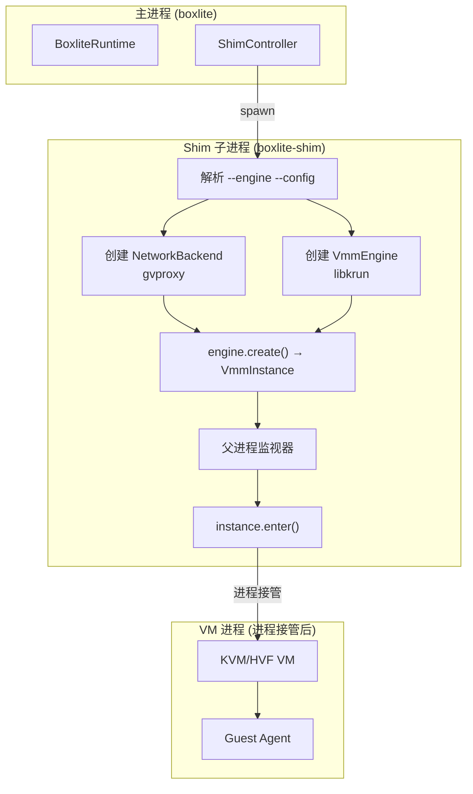

### 为什么需要 Shim 子进程？

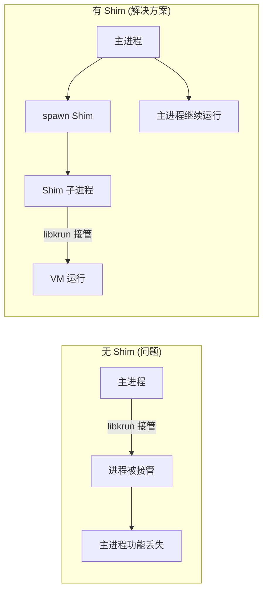

### Shim 主要逻辑 (`boxlite/src/bin/shim.rs`)

```rust
fn main() -> BoxliteResult<()> {
    let args = ShimArgs::parse();
    let mut config: InstanceSpec = serde_json::from_str(&args.config)?;

    // 1. 创建网络后端 (gvproxy)
    #[cfg(feature = "gvproxy-backend")]
    if let Some(ref net_config) = config.network_config {
        let gvproxy = GvproxyInstance::new(&net_config.port_mappings)?;
        // 故意泄漏以保持 VM 生命周期内存活
        let _gvproxy_leaked = Box::leak(Box::new(gvproxy));
    }

    // 2. 创建引擎
    let mut engine = vmm::create_engine(args.engine, options)?;

    // 3. 创建 VM 实例
    let instance = engine.create(config)?;

    // 4. 启动父进程监视器 (detach=false 时)
    if !detach {
        start_parent_watchdog(parent_pid);
    }

    // 5. 进入 VM (进程接管)
    instance.enter()  // 可能永不返回
}
```

---

## 8. libkrun 详解

### 8.1 什么是 libkrun

**libkrun** 是一个动态库，用于在进程中嵌入轻量级虚拟机（microVM）。它是 [containers/libkrun](https://github.com/containers/libkrun) 项目的核心，由 Red Hat 开发。

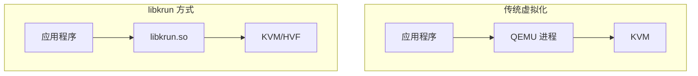

#### 核心特点

| 特性 | 说明 |
|------|------|
| **嵌入式** | 作为库链接到应用，无需独立守护进程 |
| **轻量级** | 启动时间毫秒级，内存占用小 |
| **跨平台** | 支持 Linux (KVM) 和 macOS (Hypervisor.framework) |
| **无 root** | 用户态运行，无需特权 |
| **进程接管** | 调用 `krun_start_enter()` 后当前进程变成 VM |

### 8.2 libkrun 内部架构

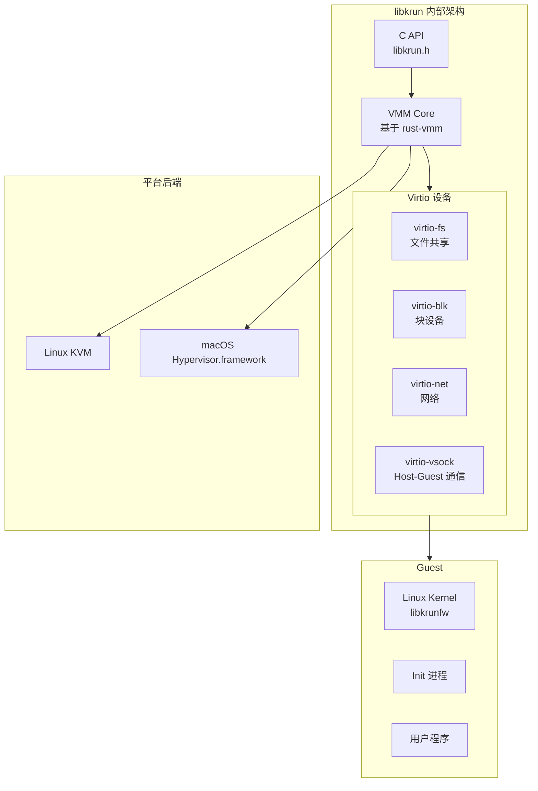

#### 关键组件

| 组件 | 说明 |
|------|------|
| **libkrunfw** | 包含精简 Linux 内核的固件，自动加载 |
| **rust-vmm** | 底层 VMM 组件库（virtio、KVM 封装等） |
| **virtiofsd** | 嵌入式 virtiofs 守护进程，提供文件共享 |

### 8.3 进程接管机制

libkrun 最独特的设计是**进程接管**：调用 `krun_start_enter()` 后，当前进程变成 VM 宿主进程。

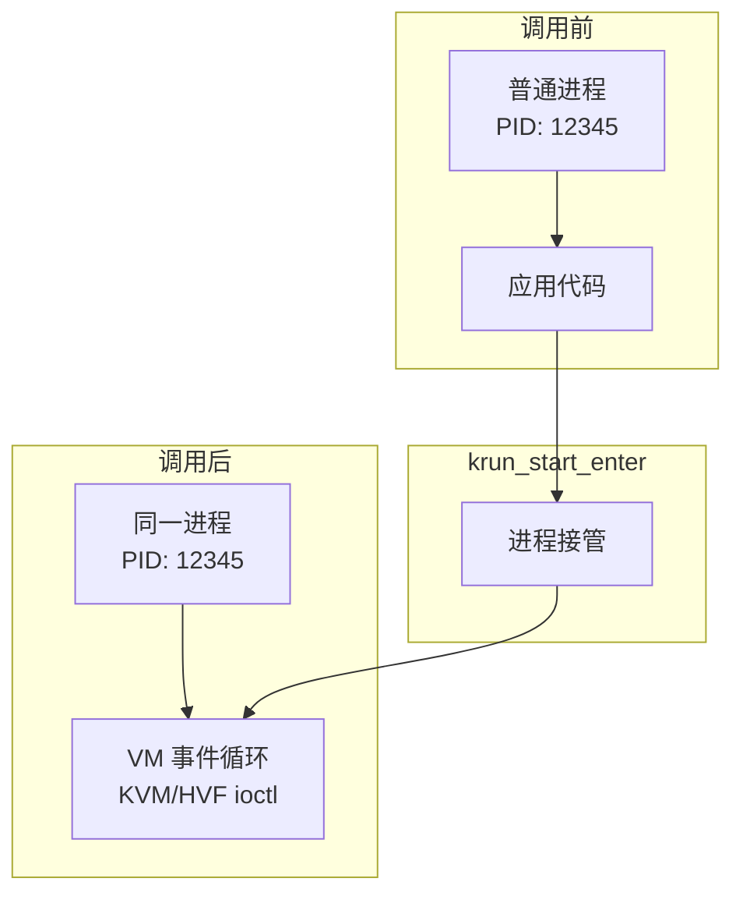

**这就是为什么 BoxLite 需要 Shim 子进程**：

```rust
// ❌ 错误方式：直接调用
fn main() {
    let runtime = BoxliteRuntime::new();
    let b = runtime.create(options);
    b.exec("python", ["script.py"]);  // 调用 krun_start_enter()
    // 永远执行不到这里！主进程被接管了
    println!("Done");
}

// ✅ 正确方式：通过 Shim 子进程
fn main() {
    let runtime = BoxliteRuntime::new();
    let b = runtime.create(options);
    // Shim 子进程被接管，主进程继续运行
    b.exec("python", ["script.py"]);
    println!("Done");  // 可以执行
}
```

### 8.4 核心 FFI API

```c
// 上下文管理
int krun_create_ctx();                    // 创建配置上下文
int krun_free_ctx(uint32_t ctx_id);       // 释放上下文

// VM 配置
int krun_set_vm_config(ctx, num_vcpus, ram_mib);  // CPU/内存
int krun_set_root(ctx, root_path);                 // Guest rootfs
int krun_set_exec(ctx, exec_path, argv, envp);     // 启动命令
int krun_set_workdir(ctx, workdir_path);           // 工作目录

// 文件系统
int krun_add_virtiofs(ctx, mount_tag, host_path);  // 共享目录
int krun_add_disk2(ctx, block_id, path, format, ro); // 磁盘镜像

// 网络
int krun_add_net_unixstream(ctx, path, fd, mac, features, flags);
int krun_add_net_unixgram(ctx, path, fd, mac, features, flags);

// vsock 通信
int krun_add_vsock_port2(ctx, port, filepath, listen);

// 启动 (不返回!)
int krun_start_enter(ctx_id);
```

### 8.5 BoxLite 封装层次

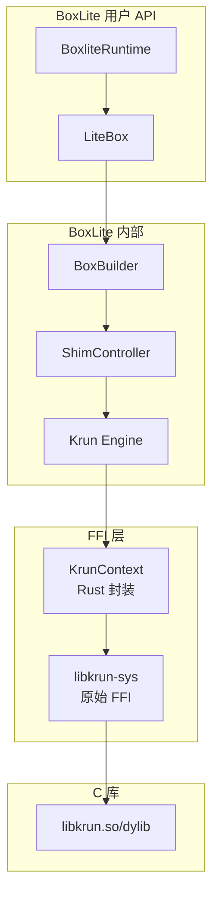

### 8.6 KrunContext 封装

BoxLite 在 `boxlite/src/vmm/krun/context.rs` 中提供了安全的 Rust 封装：

```rust
/// libkrun 上下文的安全封装
pub struct KrunContext {
    ctx_id: u32,
}

impl KrunContext {
    // 创建上下文
    pub unsafe fn create() -> BoxliteResult<Self>;

    // 配置 VM
    pub unsafe fn set_vm_config(&self, cpus: u8, memory_mib: u32);
    pub unsafe fn set_rootfs(&self, rootfs: &str);
    pub unsafe fn set_exec(&self, exec: &str, args: &[String], env: &[(String, String)]);

    // 文件系统
    pub unsafe fn add_virtiofs(&self, mount_tag: &str, host_path: &str);
    pub unsafe fn add_disk_with_format(&self, block_id: &str, path: &str,
                                        read_only: bool, format: &str);

    // 网络
    pub unsafe fn add_net_path(&self, socket_path: &str, features: u32,
                               connection_type: ConnectionType, mac_address: [u8; 6]);

    // vsock 桥接
    pub unsafe fn add_vsock_port(&self, port: u32, socket_path: &str, listen: bool);

    // 启动 VM (进程接管)
    pub unsafe fn start_enter(&self) -> i32;
}

impl Drop for KrunContext {
    fn drop(&mut self) {
        unsafe { krun_free_ctx(self.ctx_id); }
    }
}
```

### 8.7 virtiofs 文件共享

virtiofs 允许 Host 目录直接共享到 Guest：

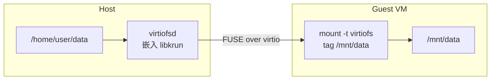

**BoxLite 使用方式：**

```rust
// Host 侧配置
ctx.add_virtiofs("SHARED", "/home/user/.boxlite/shared")?;
ctx.add_virtiofs("VOL_data", "/home/user/project/data")?;

// Guest 侧挂载 (由 Guest Agent 执行)
// mount -t virtiofs SHARED /boxlite/shared
// mount -t virtiofs VOL_data /workspace/data
```

### 8.8 vsock 通信桥接

libkrun 提供 vsock 桥接，将 Host Unix socket 透明转发到 Guest vsock：

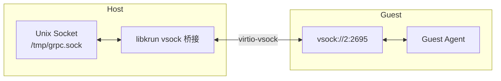

**配置代码：**

```rust
// listen=true: libkrun 创建 socket，Host 连接
// listen=false: Host 创建 socket 监听，Guest 连接
ctx.add_vsock_port(2695, "/tmp/boxlite/grpc.sock", true)?;   // gRPC 通道
ctx.add_vsock_port(2696, "/tmp/boxlite/ready.sock", false)?; // Ready 信号
```

### 8.9 块设备与 QCOW2 支持

libkrun 支持 raw 和 QCOW2 格式的块设备：

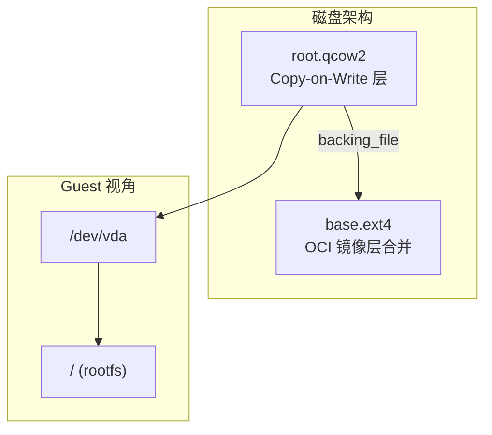

```rust
// 添加 QCOW2 磁盘
ctx.add_disk_with_format(
    "vda",                           // block_id
    "/path/to/root.qcow2",           // 磁盘路径
    false,                           // read_only
    "qcow2"                          // 格式
)?;

// 配置从磁盘启动
ctx.set_root_disk_remount("/dev/vda", Some("ext4"), None)?;
```

### 8.10 网络后端

libkrun 支持多种网络后端：

```mermaid
graph TB
    subgraph "网络后端选项"
        TSI[TSI<br/>内置透明套接字]
        Gvproxy[gvproxy<br/>用户态网络栈]
        Passt[passt<br/>用户态网络栈]
    end

    subgraph "Guest"
        Eth0[eth0<br/>virtio-net]
    end

    TSI -->|简单场景| Eth0
    Gvproxy -->|端口映射| Eth0
    Passt -->|完整网络| Eth0
```

**BoxLite 使用 gvproxy：**

```rust
// macOS: UnixDgram + VFKit 协议
ctx.add_net_path(socket_path, features, ConnectionType::UnixDgram, mac_address)?;

// Linux: UnixStream + QEMU 协议
ctx.add_net_path(socket_path, features, ConnectionType::UnixStream, mac_address)?;
```

### 8.11 与其他虚拟化方案对比

| 特性 | libkrun | QEMU | Firecracker | gVisor |
|------|---------|------|-------------|--------|
| **隔离级别** | 硬件 VM | 硬件 VM | 硬件 VM | 内核沙箱 |
| **启动时间** | ~100ms | ~1s | ~125ms | ~150ms |
| **内存开销** | ~20MB | ~100MB | ~5MB | ~50MB |
| **嵌入式** | ✅ 库 | ❌ 进程 | ❌ 进程 | ❌ 进程 |
| **无 root** | ✅ | ❌ | ❌ | ✅ |
| **macOS** | ✅ | ✅ | ❌ | ❌ |

### 8.12 引擎集成流程

libkrun 引擎负责配置和启动虚拟机：

```mermaid
sequenceDiagram
    participant Shim as boxlite-shim
    participant Engine as Krun Engine
    participant Ctx as KrunContext
    participant FFI as libkrun FFI

    Shim->>Engine: engine.create(InstanceSpec)

    Engine->>Engine: 验证文件系统共享存在
    Engine->>Engine: 验证磁盘镜像存在

    Engine->>Ctx: KrunContext::create()
    Ctx->>FFI: krun_create_ctx()
    FFI-->>Ctx: ctx_id

    Engine->>Ctx: set_vm_config(cpus=4, memory=4096MB)

    alt 有网络配置
        Engine->>Ctx: add_net_path(socket_path, mac, features)
    else 无网络配置
        Note over Engine: 使用 libkrun 内置 TSI 网络
    end

    Engine->>Ctx: set_rlimits([NPROC, NOFILE])

    loop 每个 virtiofs 共享
        Engine->>Ctx: add_virtiofs(tag, host_path)
    end

    loop 每个块设备
        Engine->>Ctx: add_disk_with_format(id, path, format)
    end

    Engine->>Ctx: set_root_disk_remount() 或 set_rootfs()
    Engine->>Ctx: set_workdir("/boxlite")

    Engine->>Engine: transform_guest_args()
    Note over Engine: unix:// → vsock://<br/>--listen unix://... → --listen vsock://2695

    Engine->>Ctx: set_exec(executable, args, env)

    Engine->>Ctx: add_vsock_port(2695, grpc_socket, listen=true)
    Engine->>Ctx: add_vsock_port(2696, ready_socket, listen=false)

    Engine-->>Shim: VmmInstance

    Shim->>Engine: instance.enter()
    Engine->>FFI: krun_start_enter()
    Note over FFI: 进程被接管<br/>成为 VM 宿主进程
```

### Transport 转换

```mermaid
graph LR
    subgraph "Host 侧"
        Unix["Unix Socket<br/>~/.boxlite/boxes/{id}/socket/grpc.sock"]
    end

    subgraph "libkrun 桥接"
        Bridge["vsock 桥接<br/>add_vsock_port()"]
    end

    subgraph "Guest 侧"
        Vsock[vsock://2695]
    end

    Unix --> Bridge
    Bridge --> Vsock
```

### 8.13 libkrun VM 生命周期管理代码

项目中使用 libkrun 进行 VM 生命周期管理的代码分为三层：FFI 绑定层、Rust 封装层、引擎层。

#### 8.13.1 FFI 绑定层 (libkrun-sys)

| 函数 | 签名 | 用途 | 生命周期阶段 |
|------|------|------|--------------|
| `krun_create_ctx` | `() -> u32` | 创建 VM 上下文 | 创建 |
| `krun_free_ctx` | `(ctx_id: u32) -> i32` | 释放 VM 上下文 | 销毁 |
| `krun_set_vm_config` | `(ctx_id: u32, num_vcpus: u8, ram_mib: u32) -> i32` | 设置 CPU/内存 | 配置 |
| `krun_set_root` | `(ctx_id: u32, root_path: *const c_char) -> i32` | 设置根文件系统 | 配置 |
| `krun_set_workdir` | `(ctx_id: u32, workdir_path: *const c_char) -> i32` | 设置工作目录 | 配置 |
| `krun_set_exec` | `(ctx_id: u32, exec_path: *const c_char, argv: ..., envp: ...) -> i32` | 设置启动命令 | 配置 |
| `krun_add_virtiofs` | `(ctx_id: u32, tag: *const c_char, path: *const c_char) -> i32` | 添加 virtiofs 挂载 | 配置 |
| `krun_add_vsock_port` | `(ctx_id: u32, port: u32, path: *const c_char) -> i32` | 添加 vsock 端口映射 | 配置 |
| `krun_set_passt_fd` | `(ctx_id: u32, fd: c_int) -> i32` | 设置网络 fd | 配置 |
| `krun_set_gvproxy_path` | `(ctx_id: u32, path: *const c_char) -> i32` | 设置 gvproxy socket | 配置 |
| `krun_add_disk` | `(ctx_id: u32, block_id: *const c_char, disk_path: *const c_char, read_only: bool) -> i32` | 添加磁盘 | 配置 |
| `krun_set_tee_config_file` | `(ctx_id: u32, filepath: *const c_char) -> i32` | TEE 配置 (机密计算) | 配置 |
| `krun_start_enter` | `(ctx_id: u32) -> i32` | 启动并进入 VM (不返回) | 启动 |

**源文件**: `boxlite/deps/libkrun-sys/src/lib.rs`

#### 8.13.2 Rust 封装层 (KrunContext)

| 方法 | 调用的 FFI | 功能描述 |
|------|-----------|----------|
| `KrunContext::create()` | `krun_create_ctx()` | 创建新的 VM 上下文，返回 `KrunContext` 实例 |
| `set_vm_config(vcpus, ram_mib)` | `krun_set_vm_config()` | 配置虚拟 CPU 数量和内存大小 |
| `set_root(path)` | `krun_set_root()` | 设置 Guest 根文件系统路径 |
| `set_workdir(path)` | `krun_set_workdir()` | 设置 Guest 工作目录 |
| `set_exec(path, args, env)` | `krun_set_exec()` | 设置 Guest 启动命令和环境变量 |
| `add_virtiofs(tag, path)` | `krun_add_virtiofs()` | 添加 Host→Guest 目录共享 |
| `add_vsock_port(port, socket_path)` | `krun_add_vsock_port()` | 添加 Unix Socket 到 vsock 端口映射 |
| `set_gvproxy_path(path)` | `krun_set_gvproxy_path()` | 设置 gvproxy 网络 socket 路径 |
| `add_disk(block_id, path, read_only)` | `krun_add_disk()` | 添加 QCOW2 磁盘镜像 |
| `start_enter()` | `krun_start_enter()` | 启动 VM 并接管当前进程 (不返回) |

**源文件**: `boxlite/src/vmm/krun/context.rs`

#### 8.13.3 引擎层 (Krun)

| 方法/函数 | 调用链 | 功能描述 |
|-----------|--------|----------|
| `Krun::create(config)` | → `KrunContext::create()` | 创建 VM 引擎实例 |
| `Vmm::create(...)` | → 多个 `ctx.set_*()` | 配置并创建 VM 实例 |
| `KrunVmmInstance::enter()` | → `ctx.start_enter()` | 启动 VM (在 shim 进程中调用) |
| `transform_guest_args()` | - | 转换 Guest 参数 (unix:// → vsock://) |

**源文件**: `boxlite/src/vmm/krun/engine.rs`

#### 8.13.4 VM 生命周期流程

```mermaid
sequenceDiagram
    participant App as 应用程序
    participant Engine as Krun Engine
    participant Ctx as KrunContext
    participant FFI as libkrun FFI
    participant VM as microVM

    Note over App,VM: 阶段 1: 创建
    App->>Engine: Krun::create(config)
    Engine->>Ctx: KrunContext::create()
    Ctx->>FFI: krun_create_ctx()
    FFI-->>Ctx: ctx_id

    Note over App,VM: 阶段 2: 配置
    App->>Engine: Vmm::create(spec)
    Engine->>Ctx: set_vm_config(vcpus, ram)
    Ctx->>FFI: krun_set_vm_config()
    Engine->>Ctx: set_root(rootfs)
    Ctx->>FFI: krun_set_root()
    Engine->>Ctx: add_virtiofs(tag, path)
    Ctx->>FFI: krun_add_virtiofs()
    Engine->>Ctx: add_vsock_port(port, socket)
    Ctx->>FFI: krun_add_vsock_port()
    Engine->>Ctx: set_exec(cmd, args, env)
    Ctx->>FFI: krun_set_exec()

    Note over App,VM: 阶段 3: 启动 (在 Shim 进程中)
    Engine->>Ctx: start_enter()
    Ctx->>FFI: krun_start_enter()
    FFI->>VM: 进程接管，VM 启动
    Note over FFI,VM: 不返回，进程变为 VM
```

#### 8.13.5 关键文件索引

| 文件路径 | 职责 | 关键代码位置 |
|----------|------|--------------|
| `boxlite/deps/libkrun-sys/src/lib.rs` | libkrun C FFI 绑定 | 第 28-126 行 |
| `boxlite/src/vmm/krun/context.rs` | 安全 Rust 封装 | 全文件 |
| `boxlite/src/vmm/krun/engine.rs` | VM 引擎实现 | `Vmm::create()` 方法 |
| `boxlite/src/bin/shim.rs` | Shim 子进程入口 | `main()` 函数 |

#### 8.13.6 生命周期状态映射

| 阶段 | Host 状态 | VM 状态 | 关键调用 |
|------|-----------|---------|----------|
| 创建 | `BoxState::Creating` | 不存在 | `krun_create_ctx()` |
| 配置 | `BoxState::Creating` | 配置中 | `krun_set_*()` 系列 |
| 启动 | `BoxState::Running` | 启动中 | `krun_start_enter()` |
| 运行 | `BoxState::Running` | 运行中 | gRPC 通信 |
| 停止 | `BoxState::Stopped` | 已终止 | 进程终止 |

---

## 9. Guest Agent 启动

VM 启动后，Guest Agent 开始运行：

```mermaid
sequenceDiagram
    participant VM as VM Boot
    participant Init as Init System
    participant Agent as boxlite-guest
    participant Server as GuestServer
    participant Notify as Notify Socket

    VM->>Init: VM 启动
    Init->>Agent: 启动 boxlite-guest

    Agent->>Agent: 解析参数
    Note over Agent: --listen vsock://2695<br/>--notify vsock://2696

    Agent->>Agent: mount_essential_tmpfs()
    Note over Agent: 挂载 /tmp, /run<br/>virtio-fs 不支持 open-unlink-fstat

    Agent->>Agent: GuestLayout::prepare_base()

    Agent->>Server: GuestServer::new(layout)
    Server->>Server: 绑定 vsock://2695
    Server->>Server: 注册 gRPC 服务
    Note over Server: GuestService<br/>ContainerService<br/>ExecutionService

    Server->>Notify: 连接 vsock://2696
    Note over Notify: 通知 Host 服务就绪

    Server->>Server: 开始接受 gRPC 请求
```

### Guest Agent 服务

```mermaid
graph TB
    subgraph "GuestServer"
        GuestSvc[GuestService<br/>系统初始化]
        ContainerSvc[ContainerService<br/>容器生命周期]
        ExecSvc[ExecutionService<br/>命令执行]
    end

    GuestSvc --> |Guest.Init| InitVolumes[挂载 virtiofs]
    GuestSvc --> |Guest.Init| InitNetwork[配置网络]

    ContainerSvc --> |Container.Init| CreateOverlay[创建 overlayfs]
    ContainerSvc --> |Container.Init| ApplyConfig[应用 OCI 配置]
    ContainerSvc --> |Container.Kill| KillContainer[终止容器]

    ExecSvc --> |Execution.Exec| RunCmd[执行命令]
    ExecSvc --> |Execution.Exec| StreamIO[流式 I/O]
```

---

## 10. Host-Guest 通信

Portal 模块管理 Host 和 Guest 之间的 gRPC 通信：

```mermaid
graph TB
    subgraph "Host 侧"
        LiteBox[LiteBox]
        Session[GuestSession]
        Channel[tonic::Channel]
        Transport[Transport::Unix]
    end

    subgraph "通信层"
        Socket[Unix Socket]
        Vsock[vsock 桥接]
    end

    subgraph "Guest 侧"
        GuestServer[GuestServer]
        Services[gRPC Services]
    end

    LiteBox --> Session
    Session --> |lazy init| Channel
    Channel --> Transport
    Transport --> Socket
    Socket --> Vsock
    Vsock --> GuestServer
    GuestServer --> Services
```

### GuestSession 接口

```mermaid
classDiagram
    class GuestSession {
        -connection: OnceCell~Connection~
        -transport: Transport
        +execution() ExecutionInterface
        +container() ContainerInterface
        +guest() GuestInterface
    }

    class ExecutionInterface {
        +exec(cmd, args, env, workdir) Stream~ExecOutput~
    }

    class ContainerInterface {
        +init(rootfs, config, mounts)
        +kill(signal)
        +status() ContainerStatus
    }

    class GuestInterface {
        +init(volumes, network)
        +shutdown()
    }

    GuestSession --> ExecutionInterface
    GuestSession --> ContainerInterface
    GuestSession --> GuestInterface
```

---

## 11. 完整时序图

### 完整的 VM 创建流程

```mermaid
sequenceDiagram
    participant User as 用户
    participant Runtime as BoxliteRuntime
    participant LiteBox as LiteBox
    participant Builder as BoxBuilder
    participant ImageMgr as ImageManager
    participant Shim as boxlite-shim
    participant Krun as libkrun
    participant VM as VM
    participant Guest as GuestAgent

    User->>Runtime: runtime.create(options, name)
    Runtime->>Runtime: 验证 & 生成 BoxID
    Runtime->>LiteBox: 创建 BoxImpl (LiveState 未初始化)
    Runtime-->>User: LiteBox 句柄

    Note over User,Guest: === 首次 API 调用触发懒初始化 ===

    User->>LiteBox: box.exec("python", ["script.py"])
    LiteBox->>LiteBox: ensure_live() - OnceCell 检查

    LiteBox->>Builder: BoxBuilder::new().build()

    Note over Builder: Stage 1: Filesystem
    Builder->>Builder: 创建 ~/.boxlite/boxes/{id}/

    Note over Builder: Stage 2: Rootfs (并行)
    par ContainerRootfsTask
        Builder->>ImageMgr: pull(image)
        ImageMgr-->>Builder: ImageObject
        Builder->>Builder: 创建 ext4 镜像
        Builder->>Builder: 创建 QCOW2 COW 磁盘
    and GuestRootfsTask
        Builder->>Builder: 准备 Guest rootfs
        Builder->>Builder: 创建 Guest COW 磁盘
    end

    Note over Builder: Stage 3: VmmSpawn
    Builder->>Builder: 构建 InstanceSpec
    Builder->>Shim: spawn("boxlite-shim --config {JSON}")

    Shim->>Shim: 创建 gvproxy
    Shim->>Krun: Krun::create(spec)
    Krun->>Krun: 配置 VM 资源
    Krun->>Krun: 配置 virtiofs/磁盘/网络
    Krun->>Krun: 配置 vsock 桥接
    Krun-->>Shim: VmmInstance

    Shim->>Krun: instance.enter()
    Krun->>VM: krun_start_enter()
    Note over VM: 进程被接管<br/>VM 开始运行

    VM->>Guest: 启动 boxlite-guest
    Guest->>Guest: 挂载 tmpfs
    Guest->>Guest: 启动 gRPC 服务

    Note over Builder: Stage 4: GuestConnect
    Guest-->>Builder: 连接 ready socket (就绪信号)
    Builder->>Builder: 创建 GuestSession

    Note over Builder: Stage 5: GuestInit
    Builder->>Guest: Guest.Init(volumes, network)
    Guest->>Guest: 挂载 virtiofs
    Guest->>Guest: 配置网络 192.168.127.2/24
    Guest-->>Builder: Ok

    Builder->>Guest: Container.Init(rootfs, config)
    Guest->>Guest: 创建 overlayfs
    Guest->>Guest: 应用 OCI 配置
    Guest-->>Builder: Ok

    Builder-->>LiteBox: LiveState
    LiteBox->>LiteBox: 持久化到 DB
    LiteBox->>LiteBox: 解除 CleanupGuard

    Note over User,Guest: === VM 就绪，执行命令 ===

    LiteBox->>Guest: Execution.Exec("python", ["script.py"])
    Guest->>Guest: 在容器内执行
    Guest-->>LiteBox: Stream<ExecOutput>
    LiteBox-->>User: 执行结果
```

---

## 12. 关键文件索引

### 核心模块

| 文件 | 描述 |
|------|------|
| `boxlite/src/runtime/core.rs` | BoxliteRuntime 公共 API |
| `boxlite/src/runtime/rt_impl.rs` | Runtime 内部实现 |
| `boxlite/src/litebox/mod.rs` | LiteBox 句柄定义 |
| `boxlite/src/litebox/box_impl.rs` | BoxImpl 状态管理 |
| `boxlite/src/litebox/init/mod.rs` | BoxBuilder 流水线编排 |
| `boxlite/src/litebox/init/tasks/` | 初始化任务实现 |

### 虚拟化层 (libkrun)

| 文件 | 描述 |
|------|------|
| `boxlite/src/bin/shim.rs` | Shim 子进程入口 |
| `boxlite/src/vmm/krun/engine.rs` | libkrun 引擎实现 (Krun struct) |
| `boxlite/src/vmm/krun/context.rs` | KrunContext FFI 安全封装 |
| `boxlite/src/vmm/krun/constants.rs` | libkrun 常量定义 |
| `boxlite/src/vmm/shim/` | ShimController 进程控制 |
| `boxlite/deps/libkrun-sys/src/lib.rs` | libkrun 原始 FFI 绑定 |
| `boxlite/deps/libkrun-sys/build.rs` | libkrun 编译配置 |

### Guest Agent

| 文件 | 描述 |
|------|------|
| `guest/src/main.rs` | Guest Agent 入口 |
| `guest/src/service/server.rs` | gRPC 服务端 |
| `guest/src/container/` | 容器生命周期管理 |
| `guest/src/network/` | 网络配置 |
| `guest/src/mounts/` | 文件系统挂载 |

### 支撑模块

| 文件 | 描述 |
|------|------|
| `boxlite/src/images/manager.rs` | OCI 镜像管理 |
| `boxlite/src/portal/` | Host-Guest gRPC 通信 |
| `boxlite/src/disk/` | 磁盘镜像操作 |
| `boxlite/src/net/` | 网络后端 (gvproxy) |
| `boxlite/src/db/` | SQLite 持久化 |

---

## 状态转换图

```mermaid
stateDiagram-v2
    [*] --> Starting: runtime.create()

    Starting --> Running: 首次 API 调用<br/>完成初始化
    Starting --> Failed: 初始化失败

    Running --> Stopped: box.stop()
    Running --> Removed: box.remove()

    Stopped --> Running: 再次 API 调用<br/>重启 VM (复用磁盘)
    Stopped --> Removed: box.remove()

    Failed --> Removed: 自动清理

    Removed --> [*]

    note right of Starting: LiveState 未初始化<br/>Box 未持久化
    note right of Running: VM 运行中<br/>可执行命令
    note right of Stopped: VM 已停止<br/>COW 磁盘保留
```

---

## CleanupGuard 机制

BoxBuilder 使用 RAII 模式确保失败时自动清理：

```mermaid
graph TB
    subgraph "正常流程"
        Build["BoxBuilder.build()"]
        Success[初始化成功]
        Persist[持久化到 DB]
        Disarm[解除 CleanupGuard]
        Done[完成]

        Build --> Success
        Success --> Persist
        Persist --> Disarm
        Disarm --> Done
    end

    subgraph "失败流程"
        Build2["BoxBuilder.build()"]
        Fail[某阶段失败]
        Drop[CleanupGuard Drop]
        Cleanup[清理: 杀进程, 删目录, 释放锁]

        Build2 --> Fail
        Fail --> Drop
        Drop --> Cleanup
    end
```

---

## 总结

BoxLite 的 VM 创建流程体现了以下设计原则：

1. **懒初始化**: Box 句柄立即返回，实际工作延迟到首次使用
2. **进程隔离**: Shim 子进程防止 libkrun 进程接管影响主应用
3. **RAII 清理**: CleanupGuard 确保失败时自动清理资源
4. **Copy-on-Write**: QCOW2 磁盘实现高效的写时复制和快速重启
5. **vsock 桥接**: Host Unix socket 透明桥接到 Guest vsock
6. **流水线架构**: 可配置的初始化阶段，支持并行执行
