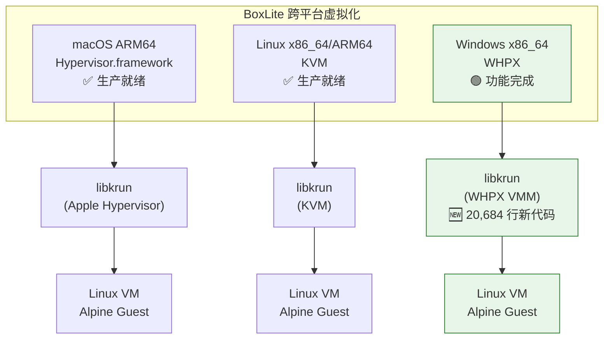
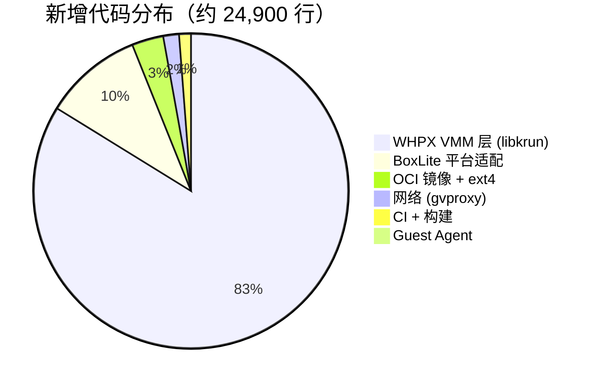
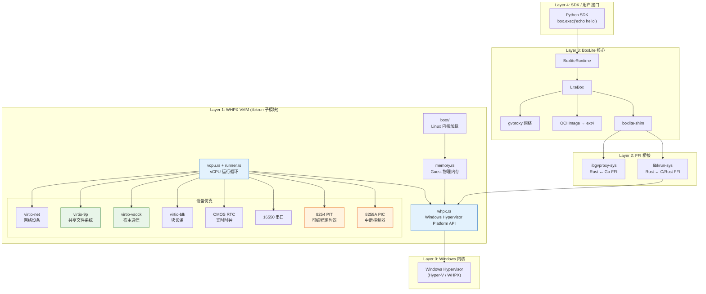
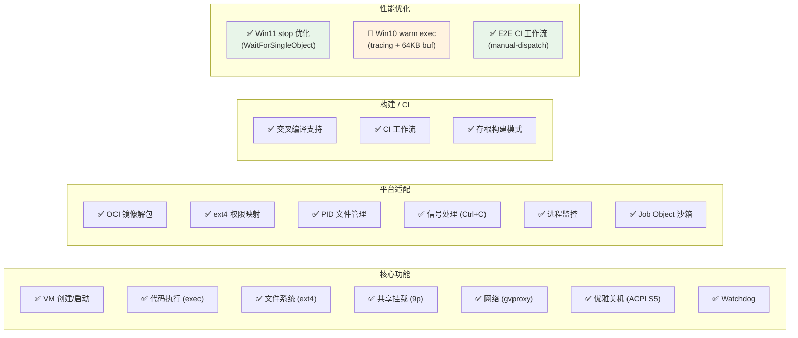
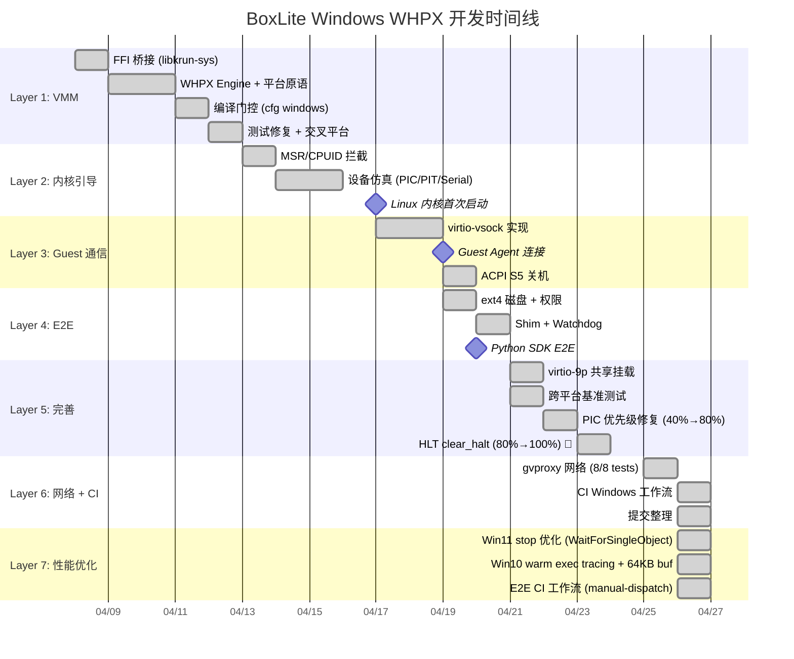
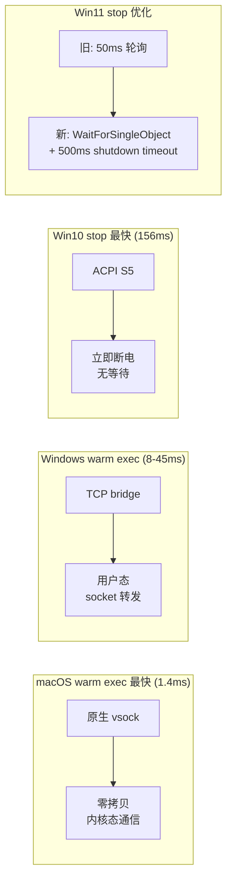
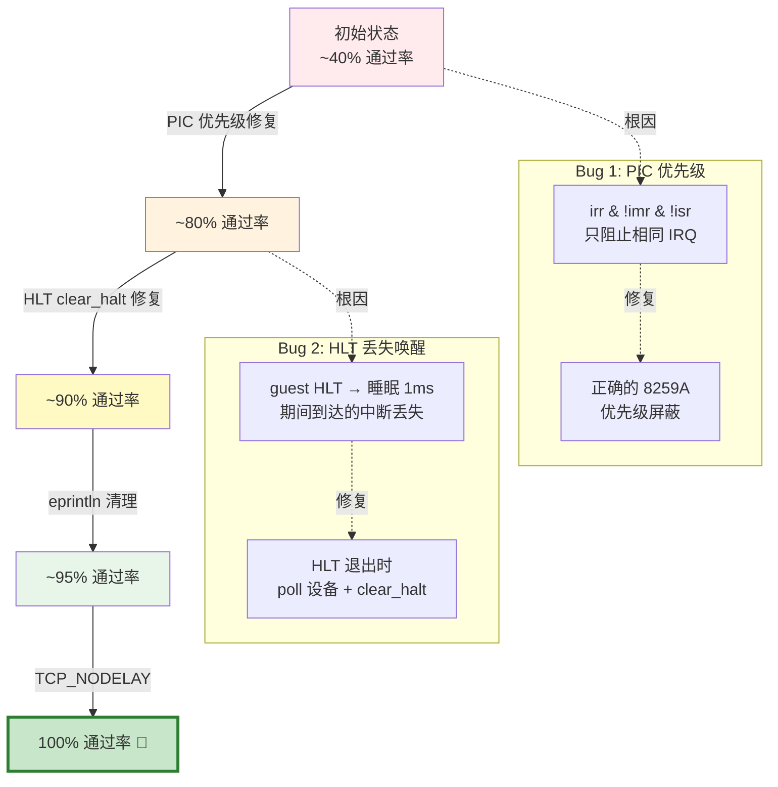
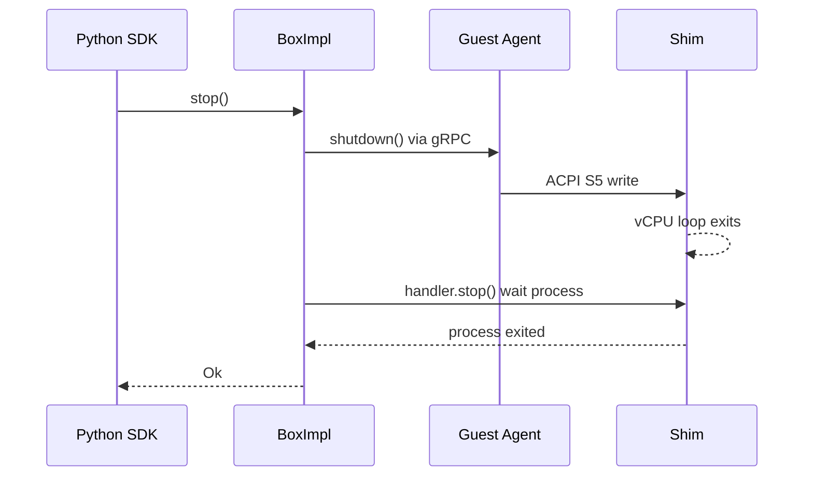
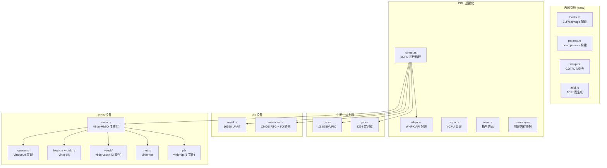

# BoxLite Windows WHPX Native Support — 整体状态总结

> 更新时间：2026-04-26 (rev.2) | 分支：`feat/windows-whpx-support`

## 一句话总结

BoxLite 已在 Windows 上通过 WHPX（Windows Hypervisor Platform）实现了完整的 VM 生命周期，包括 VM 创建、代码执行、文件系统、网络、优雅关机，三平台（macOS / Win10 / Win11）测试通过率均为 **100%**。

---

## 项目全景



---

## 代码规模

| 维度 | 数量 |
|------|------|
| boxlite 仓库变更文件 | 78 files, +4,225 / -509 lines |
| libkrun 子模块新增文件 | 41 files, +20,684 / -28 lines |
| **总计新增代码** | **~24,900 lines** |
| 分支 commits | 36 |
| libkrun 子模块 commits | 8 |

### 代码分布



---

## 架构层次



---

## 功能完成度



| 功能 | 状态 | 说明 |
|------|------|------|
| VM 创建 & 启动 | ✅ 完成 | WHPX partition → 内存映射 → Linux 内核引导 |
| 代码执行 (cold) | ✅ 完成 | 首次 exec 包含 VM 启动，Win11 仅 ~600ms |
| 代码执行 (warm) | ✅ 完成 | VM 已启动时，macOS 1.4ms / Win11 ~8ms |
| OCI 镜像 → ext4 | ✅ 完成 | 解包 + debugfs 注入权限 + raw 磁盘格式 |
| 共享文件系统 (9p) | ✅ 完成 | 自定义内核 CONFIG_9P_FS=y，容错降级 |
| 网络 (gvproxy) | ✅ 完成 | DHCP + DNS + HTTP + HTTPS，TCP 模式 |
| 优雅关机 | ✅ 完成 | ACPI S5 立即关机，Win10 仅 156ms |
| Watchdog | ✅ 完成 | Keepalive + SetEvent 关机 |
| Job Object 沙箱 | ✅ 完成 | Windows 原生进程隔离 |
| CI 工作流 | ✅ 完成 | 编译 + clippy + 633 单元测试 |
| E2E CI (manual) | ✅ 完成 | Self-hosted runner manual-dispatch 工作流 |
| 100% 可靠性 | ✅ 完成 | PIC 优先级 + HLT clear_halt 修复 |
| Win11 stop 优化 | ✅ 完成 | WaitForSingleObject 替换 50ms 轮询 + 500ms shutdown timeout |
| Win10 warm exec | 🔬 诊断中 | 添加 vsock tracing + 64KB read buffer，待部署 profiling |

---

## 开发时间线



---

## 关键里程碑

| 日期 | 里程碑 | 意义 |
|------|--------|------|
| 04-08 | FFI 桥接完成 | Rust 可调用 WHPX API |
| 04-17 | **Linux 内核首次启动** | Guest 内核在 WHPX 上成功引导 |
| 04-19 | **Guest Agent 连接** | Host ↔ Guest gRPC 通信建立 |
| 04-20 | **完整 E2E 生命周期** | Python SDK 端到端测试通过 |
| 04-21 | 跨平台基准测试 | 三平台性能数据对比 |
| 04-22 | PIC 优先级修复 | 可靠性 40% → 80% |
| 04-24 | **三平台 100% 可靠** | HLT clear_halt + 核弹清理 |
| 04-25 | **完整网络支持** | 8/8 网络测试通过 |
| 04-26 | CI 工作流 + 提交 | 代码已提交，CI 就绪 |
| 04-26 | **Stop 优化 + E2E CI** | WaitForSingleObject 替换轮询；E2E manual-dispatch 工作流 |

---

## 性能基准

```mermaid
xychart-beta
    title "VM 生命周期耗时对比 (ms, 越低越好)"
    x-axis ["cold exec", "warm exec", "stop"]
    y-axis "耗时 (ms)" 0 --> 2200
    bar [1759, 1, 2076]
    bar [1726, 45, 156]
    bar [617, 8, 2080]
```



| 阶段 | macOS (M5) | Win10 (MBP 2014) | Win11 (T14) | 最快 |
|------|-----------|-------------------|-------------|------|
| cold exec | 1,759ms | 1,726ms | **617ms** | Win11 |
| warm exec | **1.4ms** | 45ms | ~8ms | macOS |
| stop | 2,076ms | **156ms** | ~2,080ms | Win10 |
| VM 总周期 | 3,846ms | 2,035ms | **~807ms** | Win11 |
| 可靠性 | 100% | **100%** | **100%** | 三平台持平 |

### 性能差异分析



---

## 可靠性修复历程



| 阶段 | 通过率 | 根因 | 修复方法 |
|------|--------|------|----------|
| 初始 | ~40% | PIC `pending_irq()` 无优先级屏蔽 | 实现 8259A 标准优先级：在服务中的 IRQ 阻止所有低优先级 |
| 中期 | ~80% | HLT 退出后 vCPU 睡眠 1ms，期间中断丢失 | HLT 退出时调用 `tick_and_poll()` + `clear_halt()` |
| 后期 | ~90% | `eprintln!` 诊断输出的 I/O 开销 | 移除生产代码中的 eprintln |
| 最终 | **100%** | TCP 连接 Nagle 延迟 | 设置 `TCP_NODELAY` |

---

## Stop 性能优化

Win11 上 `box.stop()` 耗时 ~2,080ms（Win10 仅 156ms），13x 差异。优化方案：

### 问题分析

Stop 路径经过两个阶段：

1. **`guest.shutdown()`** — gRPC call 触发 guest 写 ACPI S5
2. **`handler.stop()`** — 等待 shim 进程退出



### 优化措施

| 优化 | 旧行为 | 新行为 | 预期收益 |
|------|--------|--------|----------|
| Shutdown timeout | 10s 等待 gRPC 响应 | Windows: 500ms（fire-and-forget） | 避免 shim 退出后等待超时 |
| 进程等待 | 50ms `try_wait()` 轮询 | `WaitForSingleObject` 事件驱动 | 消除最多 ~2s 轮询延迟 |
| 附着模式 | 50ms `is_process_alive()` 轮询 | `OpenProcess` + `WaitForSingleObject` | 同上 |

### 涉及文件

| 文件 | 变更 |
|------|------|
| `src/boxlite/src/litebox/box_impl.rs` | 添加 timing breakdown + Windows 500ms shutdown timeout |
| `src/boxlite/src/vmm/controller/shim.rs` | `WaitForSingleObject` 替换所有 Windows 轮询路径 |

---

## WHPX VMM 组件清单

libkrun 子模块中新增的 Windows VMM 实现（33 个核心文件）：



---

## 测试硬件

| 机器 | OS | CPU | 内存 | 用途 |
|------|-----|-----|------|------|
| MacBook Pro M5 | macOS 15 | Apple M5 | 24GB | 主开发机 + macOS 测试 |
| MacBook Pro 2014 Mid | Windows 10 | Intel i7-4770HQ | 16GB | Win10 WHPX 测试 |
| IBM ThinkPad T14 Gen2 | Windows 11 | Intel i5-1135G7 | 16GB | Win11 WHPX 测试 |

---

## Git 提交结构

```mermaid
gitgraph
    commit id: "main"
    branch feat/windows-whpx-support
    commit id: "FFI bridge"
    commit id: "WHPX engine"
    commit id: "cfg gate"
    commit id: "test fixes"
    commit id: "WHPX probe"
    commit id: "kernel boot"
    commit id: "MSR/CPUID"
    commit id: "device emulation"
    commit id: "virtio-blk"
    commit id: "VM stop"
    commit id: "submodule: ACPI S5"
    commit id: "submodule: vsock"
    commit id: "shim + watchdog"
    commit id: "full E2E ✅"
    commit id: "9p mount"
    commit id: "guest VFS"
    commit id: "zygote process"
    commit id: "PIC + HLT fix"
    commit id: "TCP_NODELAY"
    commit id: "gvproxy networking"
    commit id: "RTC BCD + MMIO"
    commit id: "CI workflow"
    commit id: "stop optimize"
    commit id: "warm exec tracing"
    commit id: "E2E CI workflow"
```

共 ~39 个提交，按功能分组：

| 类别 | 提交数 | 说明 |
|------|--------|------|
| feat(vmm) | 10 | WHPX 引擎、设备仿真、内核引导 |
| feat(windows) | 4 | E2E 集成、shim、网络 |
| feat(guest) | 4 | 9p、VFS、zygote、容错 |
| fix | 9 | 编译门控、磁盘格式、MMIO、PIC、HLT |
| perf | 4 | TCP_NODELAY、串口 FIFO、stop WaitForSingleObject、vsock 64KB buf |
| chore (submodule) | 5 | libkrun 子模块更新 |
| ci + style | 3 | Windows CI、rustfmt、E2E manual-dispatch |

---

## 分支范围原则

> **本分支（`feat/windows-whpx-support`）只做 Windows WHPX 原生支持相关事项。**
> 不做 macOS/Linux 的优化或修复。例如 macOS stop 延迟 (2.1s) 不在本分支范围内。

---

## 待办事项

### 已完成

| 项目 | 完成日期 | 说明 |
|------|----------|------|
| ~~Commit libkrun 子模块~~ | 2026-04-26 | 内部 + 父仓库两次提交 |
| ~~CI Windows 工作流~~ | 2026-04-26 | 编译 + clippy + 633 单元测试 |
| ~~Win11 stop 优化~~ | 2026-04-26 | `WaitForSingleObject` 替换 50ms 轮询 + 500ms shutdown timeout |
| ~~E2E CI 工作流~~ | 2026-04-26 | Self-hosted runner manual-dispatch，Win10/Win11 矩阵 |
| ~~Win10 warm exec 诊断~~ | 2026-04-26 | vsock tracing + 64KB read buffer，待部署 profiling |

### 高优先级

| 项目 | 状态 | 说明 |
|------|------|------|
| PR 创建 | ⏳ 待做 | 整理提交，编写 PR 描述 |

### 中优先级

| 项目 | 状态 | 说明 |
|------|------|------|
| Win11 stop 验证 | ⏳ 待做 | 部署优化构建到 Win11，运行 10 轮测试验证 |
| Win10 warm exec profiling | ⏳ 待做 | 部署 tracing 构建到 Win10，RUST_LOG=trace 分析瓶颈 |
| Win10 warm exec 优化 | ⏳ 待做 | 根据 profiling 结果实施优化（现实目标 15-25ms） |

### 低优先级 / 未来

| 项目 | 状态 | 说明 |
|------|------|------|
| Windows installer | ⏳ 未开始 | .msi / winget 分发 |
| GPU passthrough | ⏳ 未开始 | DirectX/Vulkan → guest GPU |
| Windows ARM64 | ⏳ 未开始 | ARM 版 Windows on Snapdragon |

---

## 与 macOS/Linux 的技术差异

> 详细分析见 [windows-whpx-technical-differences.md](./windows-whpx-technical-differences.md)

| 维度 | macOS / Linux | Windows (WHPX) | Why |
|------|---------------|-----------------|-----|
| Hypervisor API | Hypervisor.framework / KVM | Windows Hypervisor Platform | - |
| 设备仿真 | libkrun 内部 (KVM-based) | 全部自行实现 (33 文件) | WHPX 不提供设备仿真，需从零构建 |
| 中断控制器 | 内核 KVM 模块 | 用户态 8259A PIC 仿真 | WHPX 无内核 APIC/PIC 模拟 |
| 定时器 | KVM 内核定时器 | 用户态 8254 PIT 仿真 | WHPX 不含定时器设备 |
| vsock 通信 | 原生 AF_VSOCK | TCP bridge (用户态转发) | Windows 无 AF_VSOCK socket 族 |
| 磁盘格式 | QCOW2 (COW) | Raw ext4 (完整拷贝) | WHPX 无 QCOW2 驱动支持 |
| 网络 | Unix socket gvproxy | TCP gvproxy | Windows 无 Unix domain socket 的进程继承 |
| 沙箱 | seccomp / sandbox-exec | Job Object | Windows 原生进程隔离机制 |
| 进程监控 | pidfd / kqueue | WaitForSingleObject（零轮询） | Windows 无 pidfd/kqueue，process handle 天然可等待 |
| 信号处理 | SIGTERM / SIGCHLD | SetConsoleCtrlHandler | Windows 无 POSIX 信号 |
