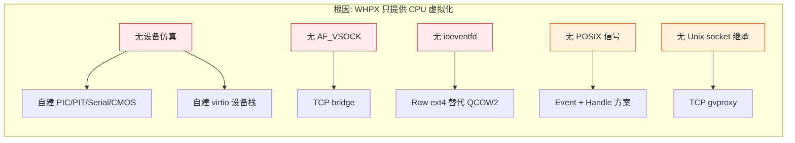

# BoxLite Windows WHPX 与 macOS/Linux 技术差异详解

> 本文档详细说明 BoxLite 在 Windows WHPX 上的每一项技术选型与 macOS/Linux 的差异及其根因。

---

## 1. Hypervisor API

| | macOS / Linux | Windows |
|--|---------------|---------|
| API | Hypervisor.framework / KVM | Windows Hypervisor Platform (WHPX) |

**Why**: 每个操作系统只暴露自己的虚拟化接口。KVM 通过 `/dev/kvm` ioctl 提供，Hypervisor.framework 通过 Objective-C/C API 提供，WHPX 通过 `WinHvPlatform.dll` 的 C API（`WHvCreatePartition`、`WHvRunVirtualProcessor` 等）提供。三者语义类似（创建分区 → 映射内存 → 运行 vCPU → 处理 exit），但 ABI 完全不同。

**影响**: `whpx.rs` (680 行) 封装了完整的 WHPX API，包括分区管理、vCPU 寄存器读写、中断注入、内存映射等。这是其他所有差异的根基。

---

## 2. 设备仿真

| | macOS / Linux | Windows |
|--|---------------|---------|
| 实现方式 | libkrun 内部，复用 KVM 设备模型 | 全部自行实现 (33 文件, ~14,000 行) |

**Why**: KVM 在内核中提供了丰富的设备仿真支持（irqchip、PIT、APIC、ioeventfd 等），libkrun 只需通过 ioctl 配置即可。WHPX 的设计哲学完全不同——它只提供 CPU 虚拟化（vCPU 运行、内存映射），**不提供任何设备仿真**。所有 I/O 设备、中断控制器、定时器都需要 VMM 在用户态自行实现。

**实现**: 完整的设备栈包括：
- `pic.rs` — 双级联 8259A PIC（主 + 从，16 条 IRQ 线）
- `pit.rs` — 8254 可编程间隔定时器（Channel 0 周期中断）
- `serial.rs` — 16550 UART（guest console 输出）
- `manager.rs` — CMOS RTC + I/O 端口路由
- `mmio.rs` — Virtio-MMIO 传输层
- `queue.rs` — Virtqueue 实现（descriptor chain 解析）
- `block.rs` + `disk.rs` — virtio-blk 块设备
- `vsock/` — virtio-vsock（3 文件）
- `net.rs` — virtio-net 网络设备
- `p9/` — virtio-9p 共享文件系统（3 文件）

这是本项目代码量最大的部分，也是最核心的技术挑战。

---

## 3. 中断控制器

| | macOS / Linux | Windows |
|--|---------------|---------|
| 实现 | 内核 KVM irqchip（APIC/PIC/IOAPIC） | 用户态 8259A PIC 仿真 |

**Why**: KVM 通过 `KVM_CREATE_IRQCHIP` ioctl 在内核中创建完整的中断控制器（Local APIC + I/O APIC + 8259A PIC），中断路由、EOI 处理、优先级仲裁全部在内核完成。WHPX 不提供 irqchip 仿真。

**实现**: `pic.rs` (~400 行) 实现了完整的 Intel 8259A 规范：
- ICW1-ICW4 初始化序列
- IRR/ISR/IMR 寄存器
- 优先级仲裁（固定优先级，in-service IRQ 阻止低优先级）
- EOI 处理（specific / non-specific）
- 级联模式（IRQ2 连接从 PIC）

**教训**: PIC 优先级 bug 是导致 WHPX 可靠性仅 40% 的根因。初始实现用 `irr & !imr & !isr` 判断 pending，只阻止同一 IRQ 的重入，不阻止低优先级 IRQ。修复为标准 8259A 优先级屏蔽后，可靠性提升到 80%。

---

## 4. 定时器

| | macOS / Linux | Windows |
|--|---------------|---------|
| 实现 | KVM 内核定时器 (`KVM_CREATE_PIT2`) | 用户态 8254 PIT 仿真 |

**Why**: KVM 在内核中维护 PIT 定时器状态，自动在指定频率触发中断。WHPX 不提供定时器设备。

**实现**: `pit.rs` (~200 行) 仿真 8254 Channel 0：
- 基于墙钟时间差（`Instant::now()` delta）计算经过的 PIT tick 数
- 每次 vCPU exit 时在 `tick_and_poll()` 中调用
- 触发 IRQ 0（通过 PIC 注入到 vCPU）

**设计选择**: 使用独立的 timer thread（每 1ms `cancel()` vCPU）保证最小中断延迟。没有用 WHPX 的 `WHvRequestInterrupt`（不适用于传统 PIC 模式）。

---

## 5. vsock 通信

| | macOS / Linux | Windows |
|--|---------------|---------|
| 传输 | 原生 AF_VSOCK（内核态） | TCP bridge（用户态转发） |
| 延迟 | ~1.4ms (warm exec) | ~8-45ms (warm exec) |

**Why**: Linux/macOS 的 libkrun 使用 `AF_VSOCK` socket 族（`VMADDR_CID_HOST` / `VMADDR_CID_ANY`），这是 hypervisor 原生支持的 host-guest 通信通道，在内核态直接传递数据，零拷贝。Windows **没有** `AF_VSOCK` socket 族（`AF_HYPERV` 仅用于 Hyper-V VM，不可用于 WHPX partition 内的自定义 VMM）。

**实现**: TCP bridge 方案：
1. Host 端创建 `TcpListener` 监听 `127.0.0.1:PORT`
2. Guest 的 `AF_VSOCK connect()` 到达 virtio-vsock 设备
3. `vsock/mod.rs` 在用户态将 vsock 包 ↔ TCP 流相互转发
4. 每次 vCPU exit 时 `poll_tcp_streams()` 检查 TCP 数据

**性能代价**: 原生 vsock 是内核态零拷贝传输（~1.4ms），TCP bridge 需要经过用户态 socket 缓冲区 + virtio-vsock 设备仿真 + interrupt injection（~8-45ms）。这是 Windows warm exec 比 macOS 慢的根本原因。

**未来优化方向**: `AF_HYPERV` (Hyper-V sockets) 或共享内存 ring buffer 可以消除 TCP 开销。

---

## 6. 磁盘格式

| | macOS / Linux | Windows |
|--|---------------|---------|
| 格式 | QCOW2 (Copy-on-Write) | Raw ext4 (完整拷贝) |

**Why**: libkrun 的 QCOW2 实现依赖 KVM 的 ioeventfd 和 eventfd 机制进行异步 I/O 通知。WHPX 不提供 ioeventfd——当 guest 写 MMIO 地址时，WHPX 只产生 `WHvRunVpExitReasonMemoryAccess` exit，没有内核级的 eventfd 通知路径。

**实现**: 使用 raw ext4 磁盘镜像 + virtio-blk 设备仿真：
- `block.rs` 处理 virtio-blk 请求（read/write/flush）
- `disk.rs` 对原始文件执行 `pread`/`pwrite`
- 每个 box 创建独立的 ext4 镜像（通过 `mke2fs` + `debugfs` 注入文件）

**代价**: Raw 格式不支持 COW，每次创建 box 需要完整拷贝 rootfs（~50-100MB），比 QCOW2 的 thin provision 慢。但 raw 格式实现简单，I/O 路径短。

---

## 7. 网络

| | macOS / Linux | Windows |
|--|---------------|---------|
| gvproxy 连接 | Unix domain socket | TCP socket |

**Why**: gvproxy（用户态网络代理）通过 socket 与 VMM 通信。macOS/Linux 使用 Unix domain socket（高性能、无 TCP 开销），但 Windows 的 Unix domain socket **不支持进程间句柄继承**（`CreateProcess` 的 `STARTUPINFO` 无法传递 UDS 文件描述符）。

**实现**: Windows 上 gvproxy 监听 `127.0.0.1:PORT`（TCP），VMM 通过 TCP 连接。功能完全等价，仅传输层不同。性能差异微乎其微（本地 TCP loopback 延迟 < 0.1ms）。

---

## 8. 沙箱

| | macOS / Linux | Windows |
|--|---------------|---------|
| 机制 | seccomp (Linux) / sandbox-exec (macOS) | Job Object |

**Why**: 三个平台的进程沙箱机制完全不同：
- **Linux seccomp**: 内核级 syscall 过滤（BPF 程序），限制进程可用的系统调用集合
- **macOS sandbox-exec**: 基于 Seatbelt 的沙箱 profile，限制文件/网络/IPC 访问
- **Windows Job Object**: 进程组资源限制（CPU、内存、进程数、UI 限制）

**实现**: Windows 上通过 `CreateJobObject` + `AssignProcessToJobObject` 将 shim 进程绑定到 Job Object，设置 `JOB_OBJECT_LIMIT_KILL_ON_JOB_CLOSE` 确保父进程退出时子进程被终止。

**差异**: seccomp 是 syscall 级白名单（极细粒度），Job Object 是资源级限制（较粗粒度）。但对 BoxLite 的使用场景（隔离 shim 进程），Job Object 已足够——真正的安全隔离由 VM 硬件边界提供。

---

## 9. 进程监控

| | macOS / Linux | Windows |
|--|---------------|---------|
| 机制 | pidfd (Linux) / kqueue (macOS) | WaitForSingleObject |
| 模型 | 事件驱动 | 事件驱动 |

**Why**: 三个平台都提供了事件驱动的进程退出监控：
- **Linux pidfd**: `pidfd_open()` 获取进程文件描述符，`epoll` 监控退出事件
- **macOS kqueue**: `EVFILT_PROC` + `NOTE_EXIT` 监控进程退出
- **Windows**: 进程 `HANDLE` 天然是 waitable object，`WaitForSingleObject` 在进程退出时立即返回

**实现**:
- 早期实现使用 50ms `try_wait()` 轮询（跨平台但性能差）
- 优化后 Windows 路径使用 `WaitForSingleObject`（`shim.rs`），零延迟唤醒
- macOS/Linux 路径使用 `ProcessMonitor`（pidfd/kqueue），同样事件驱动

三个平台最终都实现了零轮询的进程退出检测。

---

## 10. 信号处理

| | macOS / Linux | Windows |
|--|---------------|---------|
| 机制 | POSIX signals (SIGTERM, SIGCHLD) | SetConsoleCtrlHandler |

**Why**: Windows 不支持 POSIX 信号。`SIGTERM` / `SIGCHLD` 等在 Windows 上不存在。

**实现**:
- **优雅关机**: Unix 用 `kill(pid, SIGTERM)`；Windows 用 `SetEvent(shutdown_event)`（watchdog event）
- **Ctrl+C 处理**: Unix 用 `SIGINT` handler；Windows 用 `SetConsoleCtrlHandler` 注册 `CTRL_C_EVENT` 回调
- **子进程终止**: Unix 用 `SIGCHLD` + `waitpid`；Windows 用 `WaitForSingleObject` 或 watchdog 的 parent process handle 监控

**Watchdog 设计**:
- Unix: pipe trick（父持写端，子 poll 读端，父死 → POLLHUP）
- Windows: Event object（`SetEvent` 主动信号）+ parent process handle（父死 → handle signaled）

两种方案都实现了"父进程意外退出时子进程自动清理"的防御性机制。

---

## 总结

所有技术差异归结为一个根因：**WHPX 是一个"纯 CPU 虚拟化"API**，不像 KVM 那样提供完整的虚拟机管理基础设施。这意味着 VMM 需要在用户态从零构建全部设备仿真、中断管理、定时器、通信通道——这正是 libkrun 子模块 20,684 行新代码的由来。
