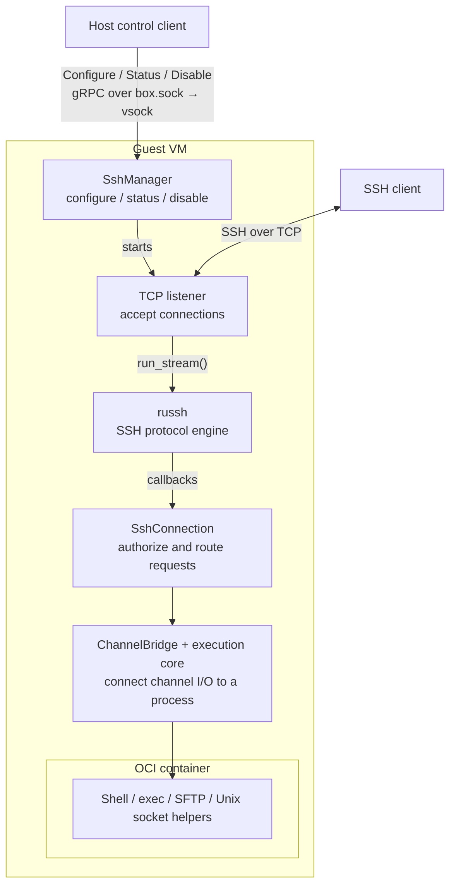
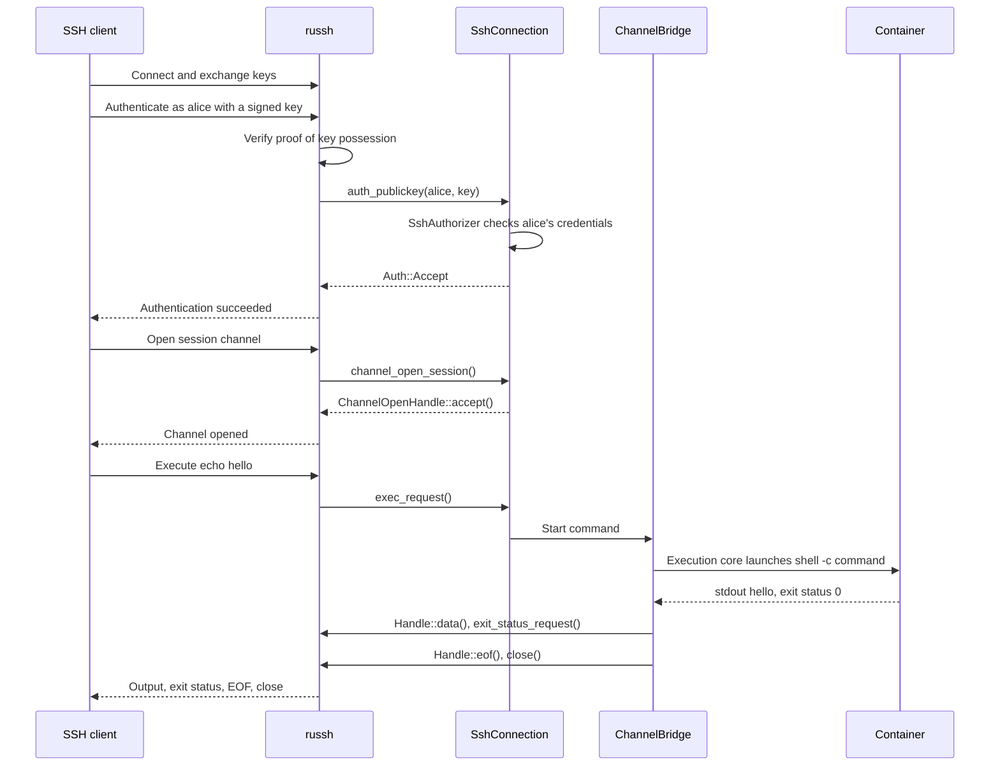
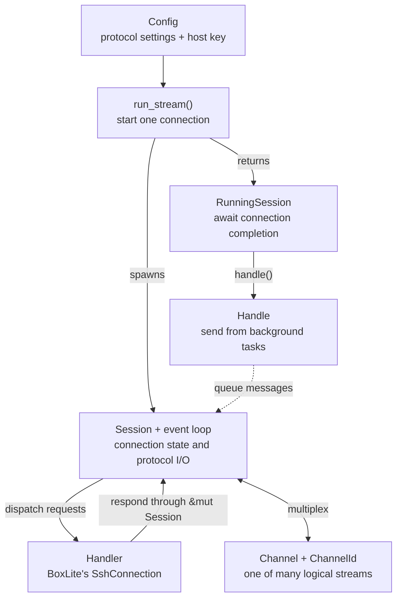
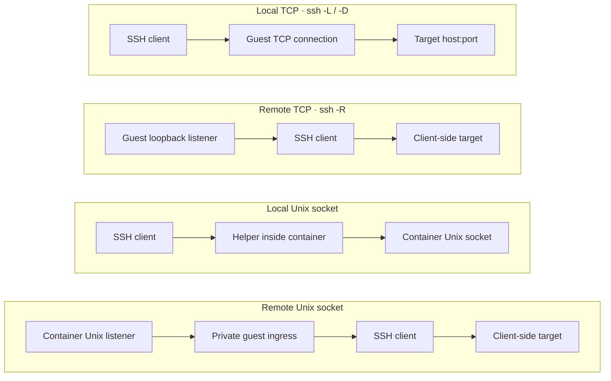

# Guest SSH architecture

## TL;DR

Russh speaks SSH; BoxLite decides who may connect and turns SSH requests into container processes, file operations, or socket forwarding.

## Overview

The host first enables SSH through gRPC. An SSH client then uses a separate TCP
connection to the listener.



Three boundaries explain the whole feature:

| Owner | What it knows |
| --- | --- |
| **russh** | SSH packets, encryption, authentication signatures, channels, and flow control. |
| **Guest SSH code** | Which login/key is allowed and which execution or forwarding operation a request should start. |
| **Container workload** | The actual shell, files, Unix sockets, and configured UID/GID. |

## Follow one command

Assume SSH is configured and reachable. A developer runs:

```sh
ssh alice@host 'echo hello'
```



`alice` selects SSH credentials. The process runs as the **container's configured
user**; an SSH account does not create a separate Linux user.

## Control API

- SSH starts disabled; `Guest.Init` must finish before `Configure`.
- Host port forwarding is configured separately from the guest SSH listener.
- Control uses `boxlite_shared::SshClient`; there is no LiteBox, CLI, or language
  SDK SSH control API in this implementation.
- `SshConfig` supplies the listen address, host private key, and named accounts
  with authorized keys and/or a CA plus certificate principal.

See [Guest SSH control](../../../../../docs/guides/ssh.md) for setup and
[the RPC schema](../../../../shared/proto/boxlite/v1/service.proto#L51) for fields.

## The russh objects you need to know

A **connection** is one encrypted transport. A **channel** is one logical stream
inside it: for example, a shell, an SFTP session, or a forwarded connection.



| Component | Use it for |
| --- | --- |
| `server::Config` | Host keys, authentication methods, algorithm preferences, packet/window sizes, keepalives, and timeouts. |
| `server::Handler` | Callbacks for authentication, channel opens, requests, input, and closure; one handler per connection. |
| `server::Session` | Reply within a callback using `channel_success()`, `channel_failure()`, or other response methods. |
| `server::Handle` | Send asynchronously from other tasks: `data()`, `extended_data()`, exit status/signal, `eof()`, `close()`, forwarded channel opens, and `disconnect()`. |
| `RunningSession` | Await connection completion. Receiving it does **not** mean authentication has finished. |
| `ChannelOpenHandle` | Accept or reject an incoming channel with `accept()` / `reject()`. |
| `Channel` / `ChannelId` | Address one stream; `wait()` receives `ChannelMsg`, `split()` creates read/write halves, and `into_stream()` provides `AsyncRead` / `AsyncWrite`. |
| `ChannelMsg` | Channel events: data, extended data, success/failure, exit status, EOF, and close. |

Supporting pieces:

| Area | Components |
| --- | --- |
| Cryptography | `keys` handles key material and certificates; `kex`, `cipher`, `mac`, and `compression` implement the negotiated algorithms. Packet encoding/decoding and buffers connect them to transport I/O. |
| Negotiation and limits | `Preferred` selects algorithm preferences; `MethodSet` selects authentication methods; `Limits` bounds rekey intervals by bytes/time. |
| Protocol values | `Auth`, `ChannelOpenFailure`, `Disconnect`, and `Error` report decisions/failures; `Pty` and `Sig` describe terminal modes and signals. |

BoxLite owns its listener and calls `server::run_stream()` itself. Russh also
provides `server::Server::new_client()` with `run_on_address()` / `run_on_socket()`
for applications that want russh to accept connections.

### If you are writing a russh client

OpenSSH already performs these steps; a Rust client uses the following APIs.

| Step | API |
| --- | --- |
| Connect and verify the host | `client::Config`, `client::Handler::check_server_key()`, `connect()` / `connect_stream()` → `client::Handle`. |
| Authenticate | `Handle::authenticate_publickey()` / `authenticate_openssh_cert()`. |
| Open a stream | `Handle::channel_open_session()` / `channel_open_direct_tcpip()` / `channel_open_direct_streamlocal()`. |
| Request work | `Channel::exec()`, `request_shell()`, `request_subsystem("sftp")`, `request_pty()`, `set_env()`, `window_change()`, `signal()`. |
| Exchange data and finish | `Channel::data()`, `wait()`, `eof()`, `close()`; `Handle::disconnect()` ends the connection. |
| Request remote forwarding | `Handle::tcpip_forward()` / `streamlocal_forward()` and their `cancel_*` counterparts. |

## How guest requests reach their implementation

| Incoming handler callback | BoxLite action |
| --- | --- |
| `auth_publickey()` / `auth_openssh_certificate()` | `SshAuthorizer` checks the named account and records session permissions. |
| `channel_open_session()` | Reserve a channel and its pending environment/PTY state. |
| `env_request()` / `pty_request()` | Validate and store settings for the upcoming process. |
| `shell_request()` / `exec_request()` | `ChannelBridge` starts a typed shell/exec workload through the execution core. |
| `subsystem_request("sftp")` | Start `SftpSession` inside the container using the separate `russh-sftp` library. |
| `data()` / `channel_eof()` | Forward stdin bytes or end-of-input to the execution. |
| `window_change_request()` / `signal()` | Resize the execution's terminal or signal its process group. |
| `channel_close()` | Remove channel state and terminate its running bridge. |

`auth_publickey_offered()` accepts probes without revealing account existence;
actual authorization follows proof of key possession. Password/none authentication,
agent forwarding, and X11 forwarding are rejected.

`start_ssh_execution()` is an internal entry point outside the public Execution
RPC contract. Libcontainer applies the container's namespaces and credentials;
`BoxliteWorkloadExecutor` then runs the selected `SshWorkload`. Shell/exec resolves
the container user's profile. SFTP runs its protocol loop over process stdin/stdout.
The bridge sends output back using the russh `Handle`.

## Forwarding: where each connection goes

**Local** forwarding starts with a connection on the SSH client side. **Remote**
forwarding creates a listener on the server side. Arrows show connection
initiation; established relays carry bytes in both directions.



| Mode | Request → implementation → transport |
| --- | --- |
| Local TCP | `channel_open_direct_tcpip()` → `ForwardingManager::open_direct_tcpip()` → guest `TcpStream` bridged to `Channel::into_stream()`. |
| Remote TCP | `tcpip_forward()` → `ForwardingManager::listen_tcpip()` → each accepted socket opens `Handle::channel_open_forwarded_tcpip()`. |
| Local Unix socket | `channel_open_direct_streamlocal()` → `ChannelBridge` → `SshWorkload::DirectStreamlocal` connects inside the container. |
| Remote Unix socket | `streamlocal_forward()` → `ReverseStreamlocalManager::listen()` → container helper accepts, connects to authenticated guest ingress, then `Handle::channel_open_forwarded_streamlocal()` opens toward the client. |

Unix socket helpers are needed because their paths belong to the container's
mount namespace. TCP forwarding uses guest sockets. All four modes require the
session's forwarding permission; normal shell/exec sessions need none of them.

## Who cleans up

| Scope | Owner and action |
| --- | --- |
| One channel | EOF ends input; CLOSE ends the channel and triggers bridge termination. Normal command completion sends exit status/signal, EOF, then CLOSE. |
| One connection | `SshConnection::drop()` cancels connection tasks and terminates bridges. |
| One forwarding listener | `cancel_tcpip_forward()` / `cancel_streamlocal_forward()` stop the selected listener. |
| Whole SSH service | `SshManager::disable()` cancels and drains SSH work; valid `configure()` drains the previous generation before binding another listener. |

`TaskGroup` combines **CancellationToken** (request shutdown) with **TaskTracker**
(account for completion). Task counts depend on active work. A drain timeout
leaves cleanup tracked for a later control call. SSH restart leaves the container's
main process and non-SSH executions running.

## Source map

Use this table when you know which part you want to change.

| Responsibility | Source |
| --- | --- |
| gRPC control and service lifecycle | [control.rs](control.rs#L9), [mod.rs](mod.rs#L122) |
| Russh callbacks and protocol policy | [server.rs](server.rs#L126) |
| Accounts, keys, certificates, permissions | [auth.rs](auth.rs#L88) |
| Channel/process I/O and termination | [bridge.rs](bridge.rs#L119) |
| Execution core and typed workloads | [exec/mod.rs](../exec/mod.rs#L323), [workload.rs](workload.rs#L110) |
| Container user environment and shell launch | [session.rs](session.rs#L28) |
| SFTP protocol and filesystem operations | [sftp.rs](sftp.rs#L517) |
| TCP forwarding | [forward.rs](forward.rs#L154) |
| Container Unix socket forwarding | [streamlocal.rs](streamlocal.rs), [reverse_streamlocal.rs](reverse_streamlocal.rs#L1) |
| Cancellation and completion tracking | [task_group.rs](task_group.rs#L10) |
| Resource bounds and accept-error retry | [limits.rs](limits.rs), [backoff.rs](backoff.rs) |

This map covers russh **0.62.4** and russh-sftp **2.3.0**, as locked in
[Cargo.lock](../../../../../Cargo.lock). Upstream references:
[russh overview](https://docs.rs/russh/0.62.4/russh/),
[server API](https://docs.rs/russh/0.62.4/russh/server/index.html), and
[client API](https://docs.rs/russh/0.62.4/russh/client/index.html).
