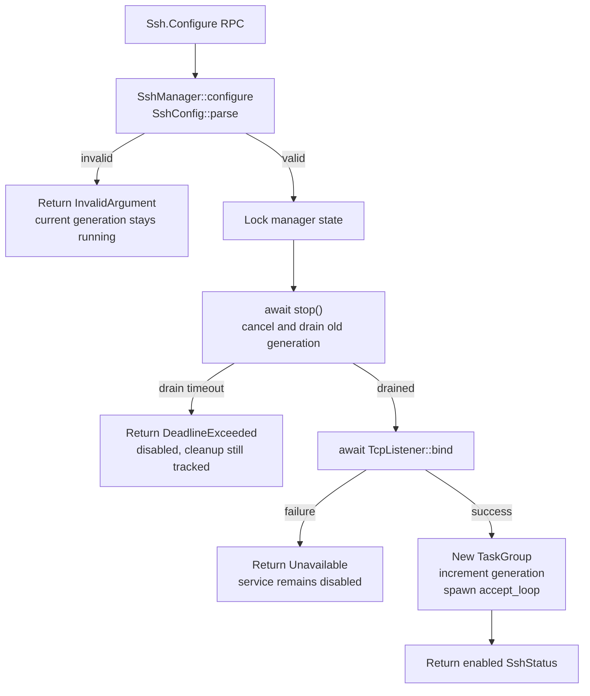
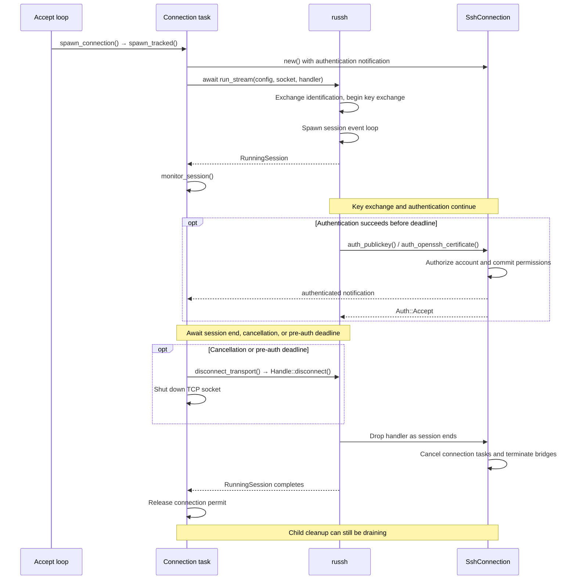
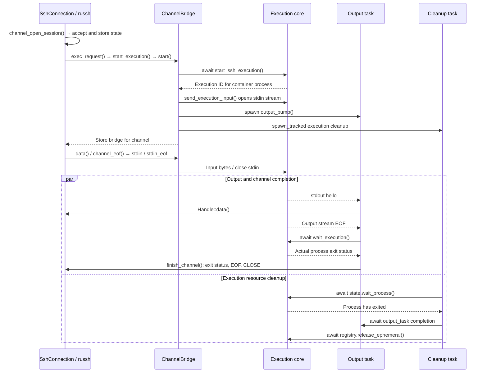
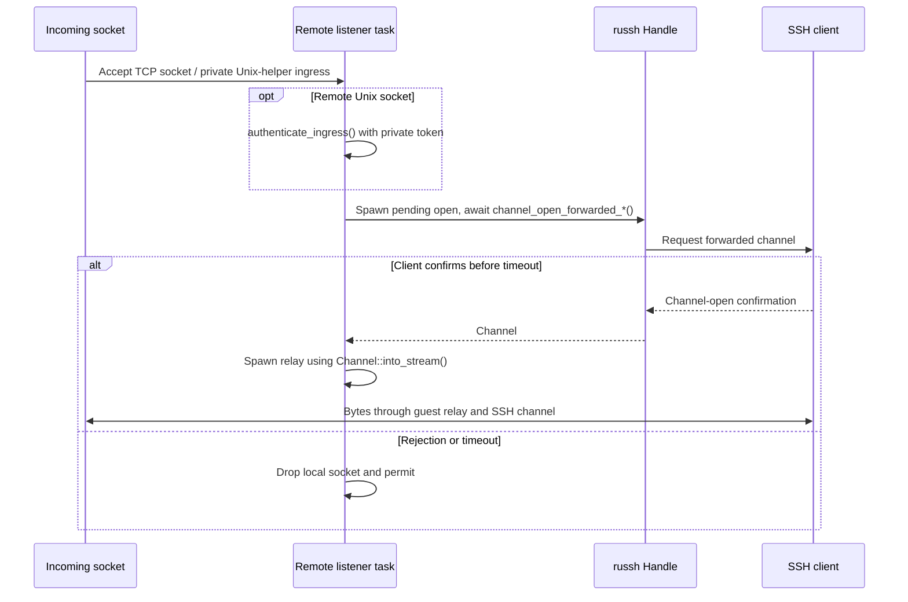
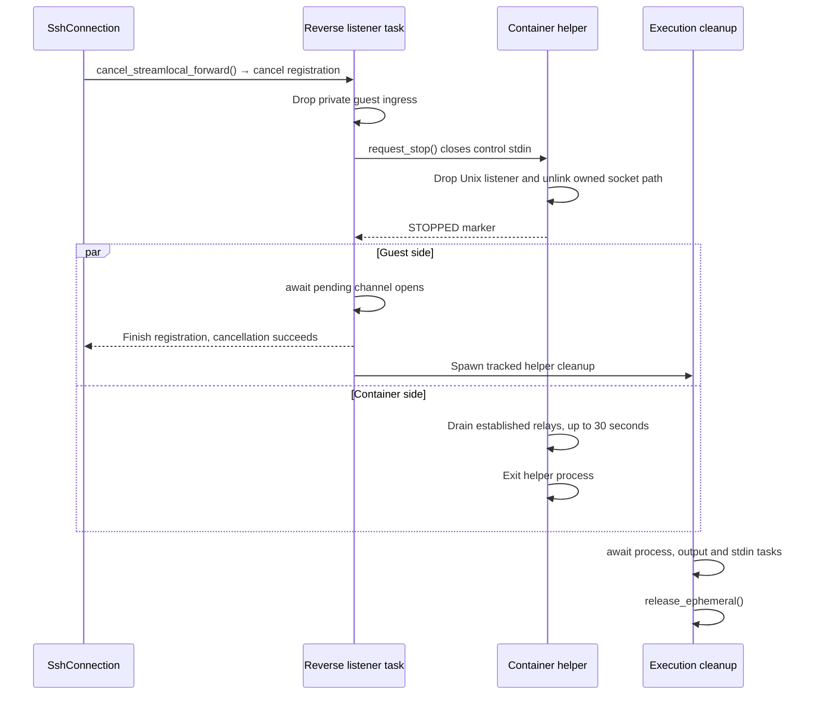
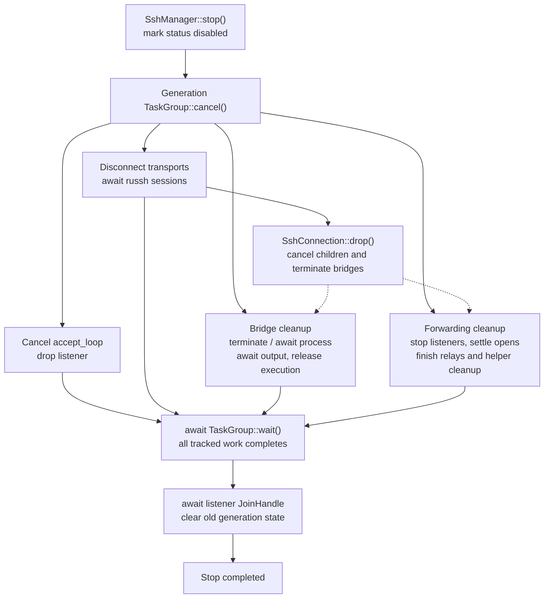

# Guest SSH lifecycles

## TL;DR

SSH work belongs to a service generation, connection, or channel; cancellation requests a stop, while tracked completion proves cleanup has finished.

## Start with the ownership model

Read the [architecture overview](README.md) first. These diagrams follow its
`ssh alice@host 'echo hello'` example, then add forwarding and shutdown.

| Scope | Starts at | Finishes when |
| --- | --- | --- |
| Service generation | Successful `configure()` | Listener and tracked SSH work have drained |
| Connection | Accepted TCP socket | Russh session ends and connection cleanup drains |
| Execution-backed channel | Shell, exec, SFTP, or direct Unix socket request | Process and output task finish, then execution resources are released |
| Remote forwarding listener | TCP bind or container helper readiness | Listener stops and pending channel opens settle; established relays have a separate lifetime |

Read in order: [service](#1-service-configuration) → [connection](#2-connection-and-authentication)
→ [channel](#3-channel-execution) → [forwarding](#4-forwarding) → [shutdown](#5-service-shutdown).
Arrows name calls or events. **Spawn** starts concurrent work; **await** marks a
completion dependency. Diagrams omit routine logging and validation helpers.

## 1. Service configuration

`Configure` replaces one complete SSH generation. Validation happens before
stopping the current generation; binding the new address happens afterward.

`Status` reports availability, not a cleanup barrier. `Disable` calls the same
`stop()` without starting a replacement. A later control call can resume waiting
after a drain timeout; the old tracking state is retained.

Source: [configure/status/disable/stop](mod.rs#L127).

## 2. Connection and authentication

One accepted socket gets one `SshConnection`, one child `TaskGroup`, and one
connection permit. The accept loop can continue while that connection runs.

There are two separate 30-second limits: `run_stream()` identification exchange,
then authentication in `monitor_session()`. Returning `RunningSession` does not
mean the client authenticated. A rejected key can be retried within the deadline.

Disconnect allows up to one second to queue the russh request, then shuts down
the local socket and awaits the session. During identification, cancellation
closes the socket directly. Neither step promises that the peer received CLOSE
for every channel.

Sources: [accept and monitor](mod.rs#L231), [authentication](server.rs#L76),
[handler drop](server.rs#L622). Russh's [run_stream implementation](https://docs.rs/russh/0.62.4/src/russh/server/mod.rs.html#1049-1088)
shows the separate spawned event loop.

## 3. Channel execution

Opening a session channel only reserves pending state. `env_request()` and
`pty_request()` fill it; shell, exec, or SFTP requests start the process.
The following diagram shows normal completion of `echo hello`.

| Event | What changes |
| --- | --- |
| Client EOF | Closes process stdin; the process may continue running |
| Output stream EOF | Output pump still awaits actual process exit before sending exit status |
| Client CLOSE, connection drop, or service stop | `terminate_running()` cancels bridge tasks; tracked cleanup signals the process group, waits for exit, then releases resources |
| Bridge setup fails after obtaining an execution ID | `cleanup_failed_execution_start()` schedules the same termination/release path |

On cancellation, `terminate_process_group()` sends SIGHUP and SIGTERM, waits out
the one-second grace period, then attempts SIGKILL. The output task is cancelable,
so normal exit-status/EOF/CLOSE delivery is not guaranteed during teardown.
Cleanup awaits both process exit and output-task completion before release.
The stdin writer is also tracked through completion.

Sources: [channel callbacks](server.rs#L169), [bridge startup](bridge.rs#L120),
[signals](bridge.rs#L307), [output completion](bridge.rs#L747),
[tracked cleanup](bridge.rs#L825).

## 4. Forwarding

### Establish the destination before relaying

All modes require forwarding permission. Direct forwarding opens from client to
server; remote forwarding opens a new channel back toward the client for each
accepted socket. See the [four network paths](README.md#forwarding-where-each-connection-goes).

| Mode | Readiness and channel confirmation | Relay owner |
| --- | --- | --- |
| Direct TCP | `open_direct_tcpip()` connects the guest TCP socket, then `reply.accept()` | `ForwardingManager` task |
| Direct Unix socket | `ChannelBridge::start()` awaits container helper READY, then the handler accepts and calls `activate_output()` | Bridge and container helper |
| Remote TCP | `listen_tcpip()` binds a guest loopback listener before success | One task per accepted socket |
| Remote Unix socket | `listen()` starts a container listener and awaits helper READY before success | Container helper plus one guest relay per accepted socket |

Direct TCP connect and forwarded-channel confirmation each have a ten-second
timeout. Direct Unix helpers use bridge execution cleanup but omit SSH process
exit notifications: a forwarded stream is not a shell session.

### Stop a listener without confusing it with its relays

For TCP, `cancel_tcpip_forward()` cancels the selected registration. Its task
drops the listener, awaits pending opens, then drops the registration to notify
the caller. Already established relays may continue until they finish or their
connection/service is canceled.

Unix listeners require another handshake because the socket lives inside the
container. The successful cancellation path is:

**STOPPED means the listener is gone, not that the helper has exited.**
Waiting for STOPPED has a ten-second timeout after the stop request is sent.
A missing acknowledgement triggers cleanup with process termination; a helper
that already ended goes straight to completion cleanup. A successful listener
cancellation does not await execution release.

Sources: [TCP lifecycle](forward.rs#L154), [TCP listener drain](forward.rs#L375),
[direct Unix readiness](server.rs#L247), [reverse Unix manager](reverse_streamlocal.rs#L442),
[helper STOPPED and relay drain](reverse_streamlocal.rs#L190),
[guest listener teardown](reverse_streamlocal.rs#L865), [helper cleanup](reverse_streamlocal.rs#L1042).

## 5. Service shutdown

`disable()` and replacement `configure()` share this stop path. Cancellation
propagates down the task tree; the branches below run concurrently.

The caller gives the drain **ten seconds**. On timeout it gets
`DeadlineExceeded`; status stays disabled and cleanup remains tracked.
The diagram's final state has not yet been reached.

| TaskGroup API | Meaning during shutdown |
| --- | --- |
| `child()` | Parent cancellation reaches children; parent tracking includes their completion |
| `spawn()` | Drops its work when cancellation wins, e.g. accept loop or ordinary relay |
| `spawn_tracked()` | Passes the cancellation token to work that must finish its own cleanup |
| `token()` | Keeps russh's handler lifetime counted until `Drop` has registered cleanup |
| `wait()` | Closes the tracker and awaits tracked work, including cleanup registered during shutdown |

SSH disable leaves the container's main process and non-SSH executions running.
Full `Guest.Shutdown` attempts SSH disable, then continues with the execution
registry and container teardown even if disabling SSH returned an error.

Sources: [stop barrier](mod.rs#L190), [TaskGroup](task_group.rs#L10),
[guest shutdown](../guest.rs#L89). Time limits live in [limits.rs](limits.rs).
